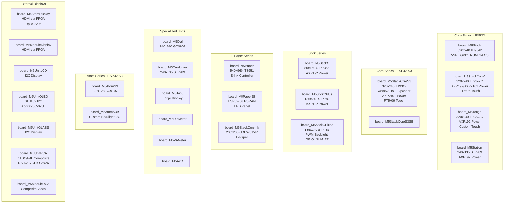
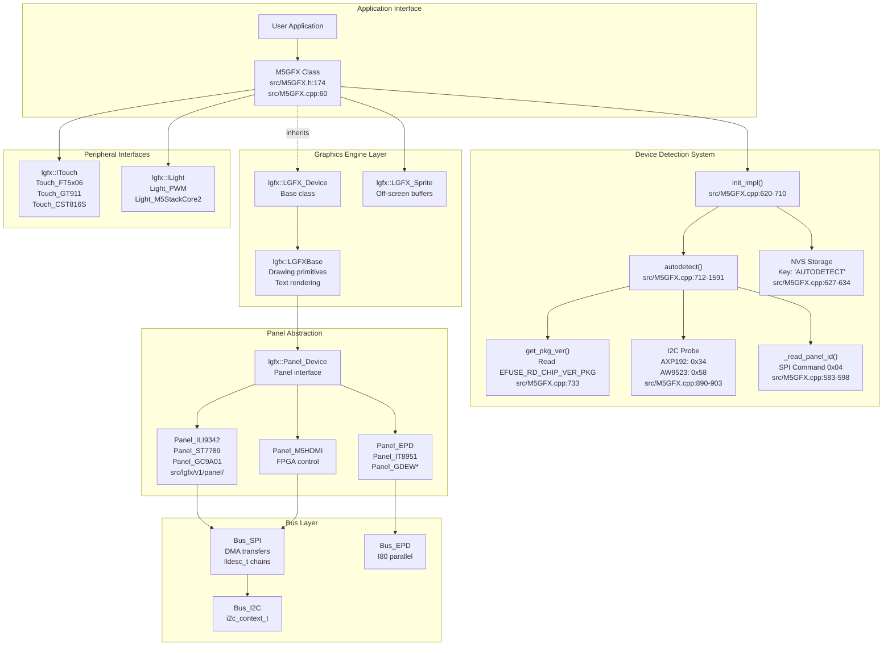
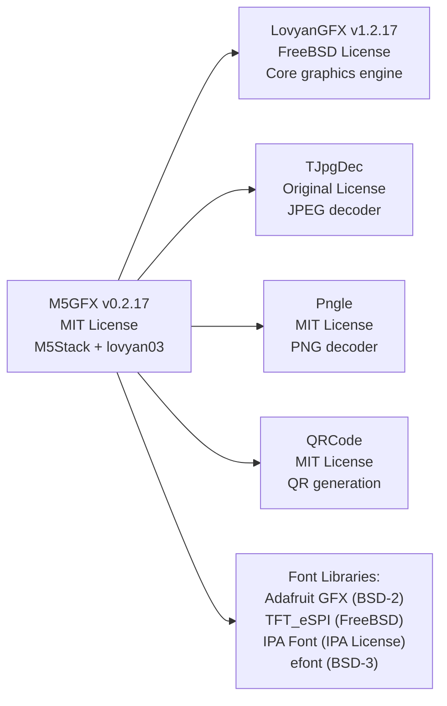
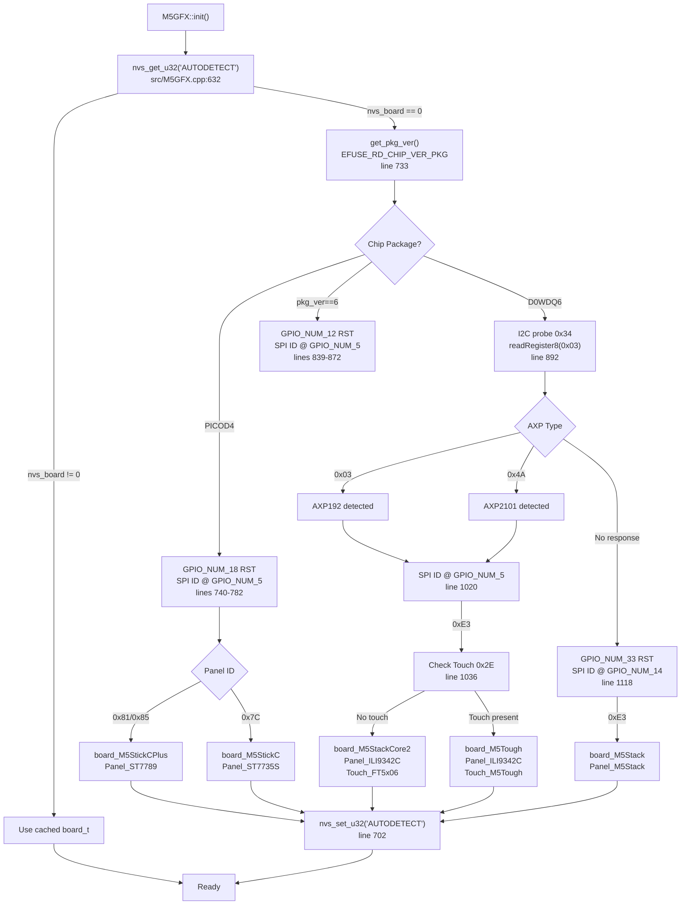
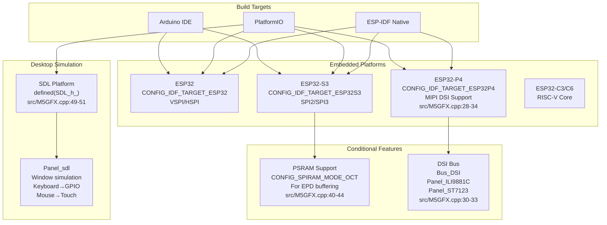

M5GFX Introduction

# Introduction

Relevant source files

The following files were used as context for generating this wiki page:

- [README.md](README.md)
- [idf_component.yml](idf_component.yml)
- [library.json](library.json)
- [library.properties](library.properties)
- [src/M5GFX.cpp](src/M5GFX.cpp)
- [src/M5GFX.h](src/M5GFX.h)
- [src/lgfx/boards.hpp](src/lgfx/boards.hpp)
- [src/lgfx/v1/gitTagVersion.h](src/lgfx/v1/gitTagVersion.h)

M5GFX is a graphics library for the M5Stack hardware ecosystem built on the LovyanGFX graphics engine. It provides automatic hardware detection and board-specific initialization for 25+ M5Stack devices while exposing a unified graphics API. The library supports diverse display technologies including LCD, E-Paper, HDMI, and composite video, and compiles for both ESP32 embedded targets and desktop simulation via SDL2.

**Key Capabilities**:
- **Hardware Autodetection**: Identifies M5Stack boards using eFuse reading, I2C probing, and SPI panel ID detection
- **Unified Graphics API**: Single codebase works across different display controllers and communication buses
- **Multi-Platform**: Compiles for ESP32/S2/S3/C3/C6/P4 and SDL desktop simulation
- **LovyanGFX Core**: Inherits optimized graphics primitives, font rendering, and image decoding from LovyanGFX v1.2.19

**Navigation**: For installation and basic usage, see page 1.1 (Getting Started). For architecture details, see page 1.2 (Architecture Overview). For the complete device list, see page 1.3 (Supported Devices and Displays).

---

## What is M5GFX?

M5GFX extends the LovyanGFX graphics engine to provide M5Stack-specific hardware support. The library manages 25+ M5Stack board variants with different display controllers (ILI9342, ST7789, GC9A01, IT8951), communication buses (SPI, I2C, I80 parallel, HDMI), touch interfaces (FT5x06, GT911, CST816S), and power management ICs (AXP192, AXP2101, AW9523).

**Primary Goals**:
1. **Zero-Configuration Initialization**: Call `M5GFX::init()` to automatically detect and configure hardware
2. **Portable Graphics Code**: Write once, run on any supported M5Stack device
3. **Desktop Development**: Test graphics code on PC using SDL2 before deploying to hardware
4. **Performance**: DMA-accelerated transfers, hardware-specific optimizations, PSRAM sprite support

**Core Class**: The `M5GFX` class ([src/M5GFX.h:174]()) inherits from `lgfx::LGFX_Device` and adds board auto-detection ([src/M5GFX.cpp:712-1591]()).

Sources: [src/M5GFX.h:1-296](), [src/M5GFX.cpp:1-1591](), [README.md:1-56]()

---

## Supported Hardware

M5GFX supports a comprehensive range of M5Stack products organized into categories:

### Main Display Units

**Board Enumeration**: All board types are defined in [src/lgfx/boards.hpp:8-72]() as the `board_t` enum. The library distinguishes between display boards (0-127), non-display boards (128-191), and external displays (192+).

Sources: [src/lgfx/boards.hpp:1-78](), [README.md:11-39](), [library.json:4]()

---

## Core Architecture Components

The following diagram maps M5GFX's conceptual architecture to actual code entities:

**Component Relationships**:

| Component | File Location | Purpose |
|-----------|---------------|---------|
| `M5GFX` | [src/M5GFX.h:174]() | Main API class with board detection |
| `init_impl()` | [src/M5GFX.cpp:620-710]() | Initialization with NVS cache check |
| `autodetect()` | [src/M5GFX.cpp:712-1591]() | Hardware probing and identification |
| `lgfx::LGFX_Device` | Inherited base | Device configuration container |
| `lgfx::LGFXBase` | Include chain | Drawing primitives implementation |
| `lgfx::Panel_Device` | Panel headers | Display controller interface |
| `Bus_SPI` / `Bus_I2C` | Platform layer | Hardware communication |
| `ITouch` / `ILight` | Interfaces | Touch and backlight control |

Sources: [src/M5GFX.h:174-274](), [src/M5GFX.cpp:60-63,620-710,712-1591]()

---

## Library Dependencies and Version

M5GFX builds upon several open-source libraries:

**Version Information**:
- **M5GFX**: v0.2.19 ([library.json:13](), [library.properties:2]())
- **LovyanGFX Core**: v1.2.19 ([src/lgfx/v1/gitTagVersion.h:1-4]())
- **License**: M5GFX uses MIT license; LovyanGFX core uses FreeBSD license

**Supported Frameworks**:
- ESP-IDF (native ESP32 framework)
- Arduino for ESP32
- Native desktop (via SDL2 for simulation)

Declared in [library.json:14](): `"frameworks": ["arduino", "espidf", "*"]`

Sources: [library.json:1-17](), [library.properties:1-11](), [src/lgfx/v1/gitTagVersion.h:1-5](), [README.md:41-54]()

---

## Hardware Autodetection System

**Autodetection Algorithm**: The `M5GFX::init()` method ([src/M5GFX.cpp:620-710]()) performs multi-stage hardware identification:

1. **NVS Cache Check** ([src/M5GFX.cpp:627-635]()): Reads previously detected `board_t` from non-volatile storage using key `"AUTODETECT"` to optimize subsequent boots.

2. **ESP32 Package Detection** ([src/M5GFX.cpp:733]()): Reads `EFUSE_RD_CHIP_VER_PKG` to determine chip variant:
   - `EFUSE_RD_CHIP_VER_PKG_ESP32PICOD4`: M5StickC/CPlus/CoreInk (lines 736-834)
   - `pkg_ver == 6`: M5StickCPlus2 (lines 835-879)
   - `EFUSE_RD_CHIP_VER_PKG_ESP32D0WDQ6`: M5Stack/Core2/Tough (lines 880-1101)

3. **I2C Power Management Probing** ([src/M5GFX.cpp:890-903]()): Detects power ICs:
   - `0x34` address → Read register `0x03`:
     - `0x03` = AXP192 (Core2 1st gen)
     - `0x4A` = AXP2101 (Core2 v1.1)
   - `0x58` address → AW9523B (CoreS3)

4. **SPI Panel ID Reading** ([src/M5GFX.cpp:583-598]()): Sends command `0x04` (RDDID) to identify display controller:
   - `0xE3`: ILI9342C (M5Stack Basic/Core2)
   - `0x81/0x85`: ST7789 (M5StickCPlus)
   - `0x7C`: ST7735S (M5StickC)
   - `0x019A00`: GC9A01 (M5Dial)

5. **Board-Specific Configuration**: Instantiates panel, bus, touch, and backlight drivers. Example: M5StackCore2 setup at [src/M5GFX.cpp:1025-1091]() creates `Panel_M5StackCore2`, `Touch_FT5x06`, and `Light_M5StackCore2`.

6. **NVS Persistence** ([src/M5GFX.cpp:699-705]()): Saves detected `board_t` value to NVS for faster future boots.

**Detection Flow Diagram**:

Sources: [src/M5GFX.cpp:620-710,712-1591,583-598]()

---

## Platform and Build Target Support

M5GFX compiles for multiple platforms with conditional compilation:

**Platform Detection** ([src/M5GFX.cpp:6-52]()): 

| Define | Purpose | Lines |
|--------|---------|-------|
| `ESP_PLATFORM` | ESP32 family targets | 6 |
| `CONFIG_IDF_TARGET_ESP32P4` | ESP32-P4 with DSI support | 28 |
| `CONFIG_IDF_TARGET_ESP32S3` | ESP32-S3 variant | 37 |
| `CONFIG_SPIRAM_MODE_OCT` | Octal PSRAM for M5PaperS3 | 40 |
| `SDL_h_` | SDL2 desktop simulation | 49 |

**Platform-Specific Includes**:
- ESP32-P4 DSI: [src/M5GFX.cpp:30-33]() includes `Bus_DSI.hpp`, `Panel_ILI9881C.hpp`, `Panel_ST7123.hpp`
- ESP32-S3 EPD: [src/M5GFX.cpp:42]() includes `Panel_EPD.hpp` for M5PaperS3 with octal PSRAM
- SDL Simulation: [src/M5GFX.cpp:49-50]() includes `Panel_sdl.hpp` and `picture_frame.h`

Sources: [src/M5GFX.cpp:6-52](), [library.json:14-15]()

---

## Key Features Summary

| Feature | Implementation | Code Reference |
|---------|----------------|----------------|
| **Auto-Detection** | NVS caching + eFuse + I2C + SPI probing | [src/M5GFX.cpp:620-1591]() |
| **40+ Board Support** | Enum in `board_t` | [src/lgfx/boards.hpp:8-72]() |
| **Unified API** | `M5GFX` inherits `LGFX_Device` | [src/M5GFX.h:174]() |
| **Multiple Displays** | Panel_LCD, Panel_EPD, Panel_HDMI, Panel_DSI, Panel_CVBS | Various panel headers |
| **Touch Support** | `ITouch` interface with FT5x06, GT911, CST816S | [src/M5GFX.cpp:24-26]() |
| **Backlight Control** | `ILight` interface with PWM and I2C | [src/M5GFX.cpp:600-618]() |
| **Power Management** | AXP192/AXP2101 integration | [src/M5GFX.cpp:79-80,349]() |
| **Desktop Simulation** | SDL2 platform support | [src/M5GFX.cpp:49-51]() |
| **Sprite/Canvas** | `M5Canvas` class | [src/M5GFX.h:277-284]() |
| **Image Formats** | JPEG, PNG, BMP decoding | LovyanGFX dependencies |
| **Font Support** | Multiple font libraries | README.md fonts section |

**API Entry Point**: Users instantiate `M5GFX` and call `init()` ([src/M5GFX.h:174,267-273]()). All graphics operations inherit from `lgfx::LGFXBase`.

Sources: [src/M5GFX.h:1-296](), [src/M5GFX.cpp:1-1591](), [README.md:1-56]()

---

## Next Steps

- **[Getting Started](#1.1)**: Installation, basic examples, and first program
- **[Architecture Overview](#1.2)**: Detailed layer-by-layer architecture explanation
- **[M5GFX Core System](#2)**: Complete API documentation for graphics operations
- **[Display Device Classes](#3)**: Device-specific wrapper classes (M5AtomDisplay, M5UnitRCA, etc.)
- **[Panel Drivers](#4)**: Low-level panel implementations for different display technologies