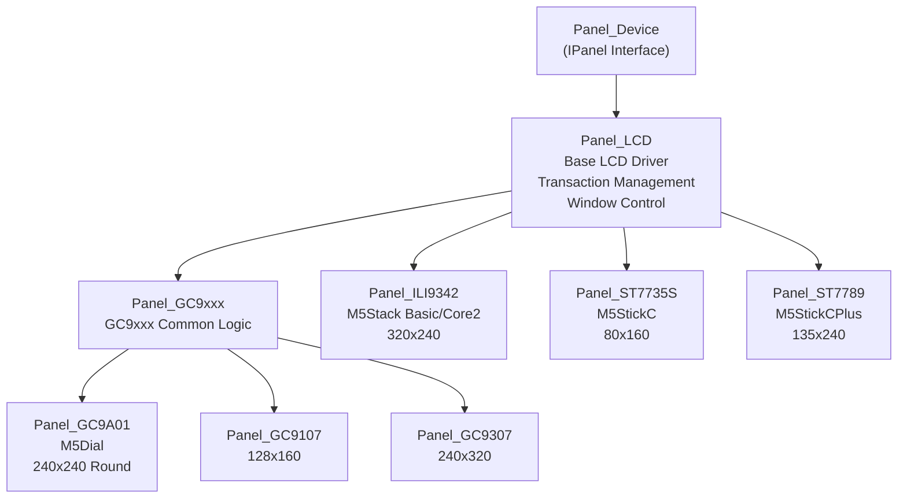
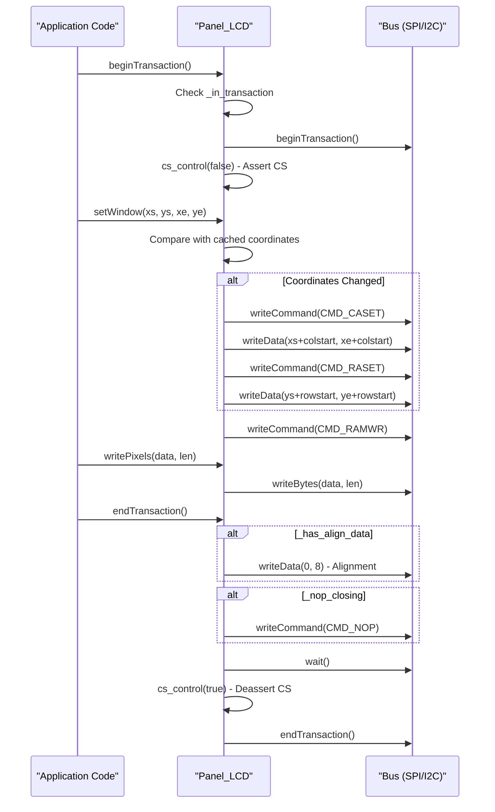
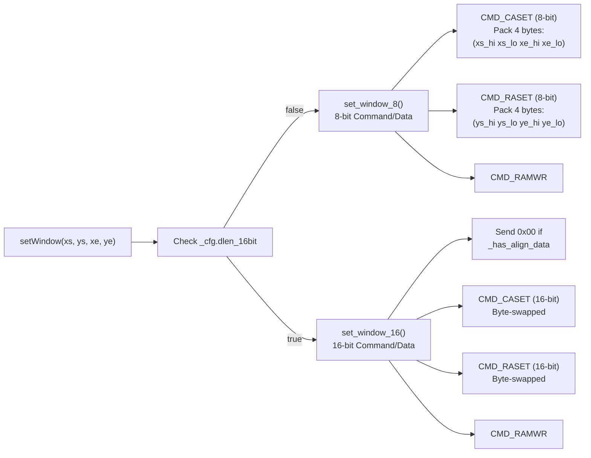
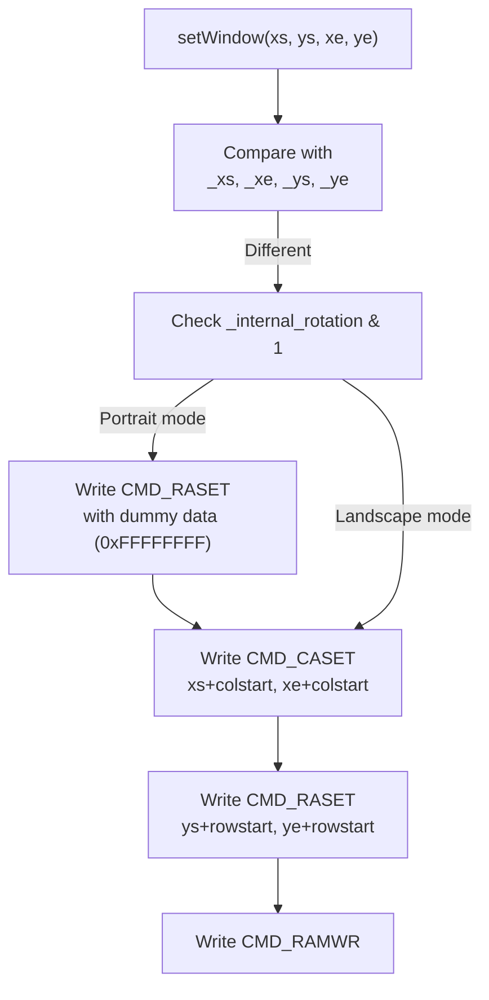
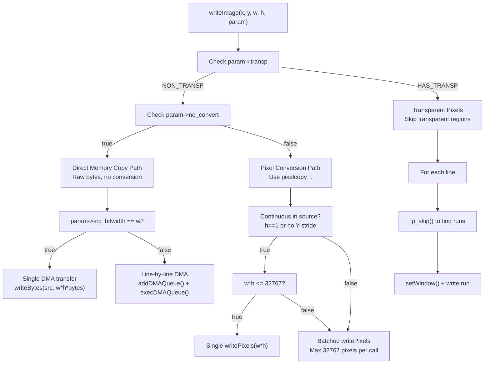
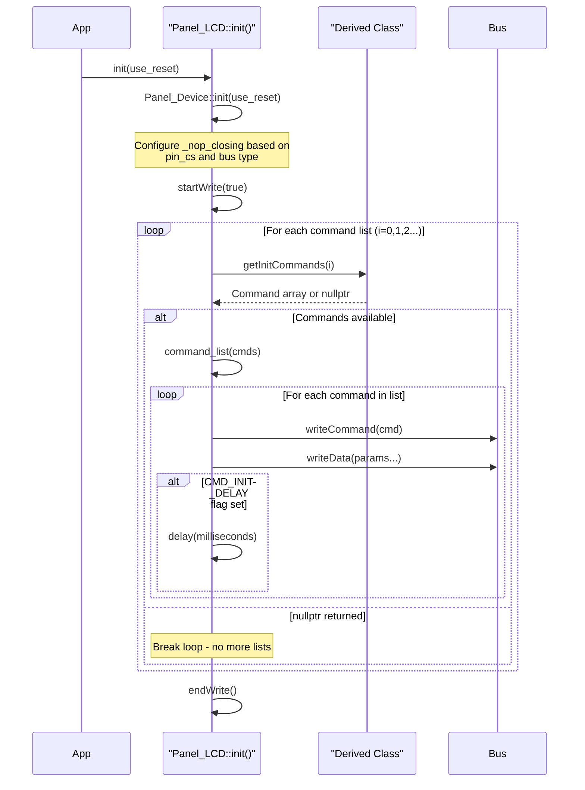
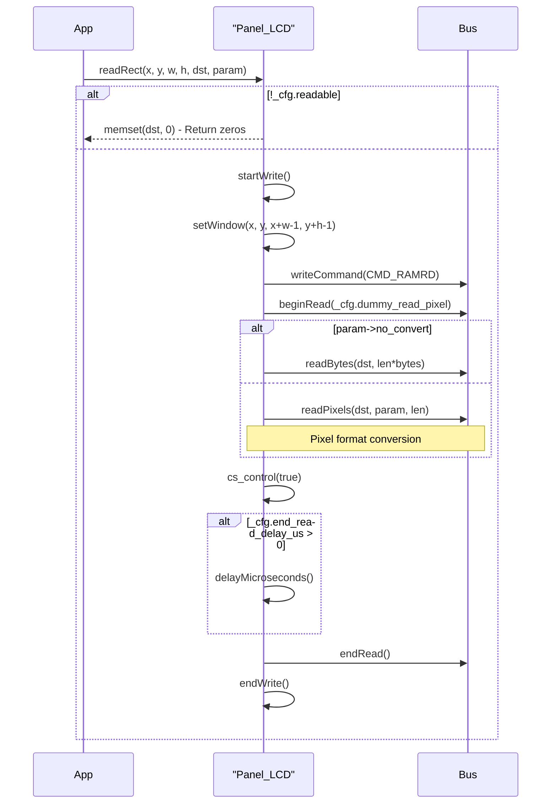

M5GFX LCD Panel Drivers

# LCD Panel Drivers

<details>
<summary>Relevant source files</summary>

The following files were used as context for generating this wiki page:

- [src/lgfx/v1/lgfx_fonts.cpp](src/lgfx/v1/lgfx_fonts.cpp)
- [src/lgfx/v1/lgfx_fonts.hpp](src/lgfx/v1/lgfx_fonts.hpp)
- [src/lgfx/v1/panel/Panel_EPDiy.cpp](src/lgfx/v1/panel/Panel_EPDiy.cpp)
- [src/lgfx/v1/panel/Panel_EPDiy.hpp](src/lgfx/v1/panel/Panel_EPDiy.hpp)
- [src/lgfx/v1/panel/Panel_GC9A01.hpp](src/lgfx/v1/panel/Panel_GC9A01.hpp)
- [src/lgfx/v1/panel/Panel_LCD.cpp](src/lgfx/v1/panel/Panel_LCD.cpp)
- [src/lgfx/v1/panel/Panel_LCD.hpp](src/lgfx/v1/panel/Panel_LCD.hpp)

</details>


This document covers the LCD panel driver architecture in M5GFX, specifically focusing on the `Panel_LCD` base class and its derived drivers for common SPI LCD controllers. LCD panels use direct pixel streaming without framebuffers, in contrast to buffered display technologies covered in [E-Paper Panel Driver](#4.2) and [I2C Display Panel Drivers](#4.5). For HDMI and composite video output, see [HDMI Panel Driver](#4.3) and [Composite Video Panel Driver](#4.4) respectively.

## Panel_LCD Base Class Architecture

The `Panel_LCD` class provides the foundational implementation for SPI-connected LCD controllers that support standard command sets. It inherits from `Panel_Device` and implements direct pixel streaming, transaction management, and coordinate transformations.

**Sources:** [src/lgfx/v1/panel/Panel_LCD.hpp:28-142](), [src/lgfx/v1/panel/Panel_LCD.cpp:28-505]()

### Class Hierarchy



**Sources:** [src/lgfx/v1/panel/Panel_LCD.hpp:28-29](), [src/lgfx/v1/panel/Panel_GC9A01.hpp:29-74]()

### Transaction and State Management

The `Panel_LCD` class maintains transaction state and window coordinates to minimize redundant SPI commands. Key state variables include:

| State Variable | Type | Purpose |
|----------------|------|---------|
| `_in_transaction` | `bool` | Tracks whether a transaction is active |
| `_colstart` | `uint16_t` | Column offset after rotation |
| `_rowstart` | `uint16_t` | Row offset after rotation |
| `_xs`, `_xe`, `_ys`, `_ye` | `int16_t` | Cached window coordinates |
| `_xsxe`, `_ysye` | `uint32_t` | Packed window coordinates for 8-bit mode |
| `_has_align_data` | `bool` | Alignment flag for 16-bit data mode |
| `_nop_closing` | `bool` | Controls NOP command at transaction end |

**Sources:** [src/lgfx/v1/panel/Panel_LCD.hpp:60-65]()

#### Transaction Flow



**Sources:** [src/lgfx/v1/panel/Panel_LCD.cpp:56-90](), [src/lgfx/v1/panel/Panel_LCD.cpp:227-237]()

### Window and Coordinate Management

Window setting uses the standard MIPI DCS commands `CMD_CASET` (Column Address Set, 0x2A) and `CMD_RASET` (Row Address Set, 0x2B) to define the active drawing region. The driver caches these coordinates to avoid redundant commands when drawing contiguous regions.

The base implementation provides two variants for different bus modes:



**Sources:** [src/lgfx/v1/panel/Panel_LCD.cpp:227-237](), [src/lgfx/v1/panel/Panel_LCD.cpp:451-501]()

The offset calculation accounts for rotation:

```
_colstart = (_internal_rotation & 2) 
          ? memory_width - (panel_width + offset_x) 
          : offset_x

_rowstart = ((1 << _internal_rotation) & 0b10010110) // rotation 1,2,4,7
          ? memory_height - (panel_height + offset_y) 
          : offset_y
```

**Sources:** [src/lgfx/v1/panel/Panel_LCD.cpp:146-150]()

## Controller-Specific Drivers

Each LCD controller driver inherits from `Panel_LCD` and provides controller-specific initialization sequences and rotation matrices. The two key virtual methods that subclasses override are:

1. **`getInitCommands(uint8_t listno)`** - Returns initialization command sequences
2. **`getMadCtl(uint8_t r)`** - Returns MADCTL register value for rotation `r`

### Command List Format

Initialization commands use a compact byte array format:

| Byte(s) | Description |
|---------|-------------|
| Command byte | LCD controller command (e.g., 0xEF, 0xC3) |
| Parameter count | Number of data bytes following |
| Parameter bytes | 0-N data bytes |
| `CMD_INIT_DELAY` flag | If added to count, indicates delay follows |
| Delay value (ms) | Delay duration if flag set |
| `0xFF, 0xFF` | End-of-list marker |

**Example from GC9A01:**
```
0xEF, 0,           // Command 0xEF, 0 parameters
0xEB, 1, 0x14,     // Command 0xEB, 1 parameter (0x14)
0x11, 0+CMD_INIT_DELAY, 120,  // Command 0x11 (SLPOUT), delay 120ms
0xFF, 0xFF         // End of list
```

**Sources:** [src/lgfx/v1/panel/Panel_GC9A01.hpp:96-150]()

### MADCTL Rotation Matrix

The `getMadCtl()` method returns the Memory Access Control register value for each of 8 rotation states (0-7). Bits control pixel reading order:

| Bit | Name | Function |
|-----|------|----------|
| 7 | `MAD_MY` | Row address order (vertical flip) |
| 6 | `MAD_MX` | Column address order (horizontal flip) |
| 5 | `MAD_MV` | Row/Column exchange (90° rotation) |
| 4 | `MAD_ML` | Vertical refresh order |
| 3 | `MAD_BGR` | BGR color order (vs RGB) |
| 2 | `MAD_MH` | Horizontal refresh order |

**Standard MADCTL table (most controllers):**
```cpp
static constexpr uint8_t madctl_table[] = {
    0,                                     // 0: Normal
    MAD_MV|MAD_MX|MAD_MH,                 // 1: 90° CW
    MAD_MX|MAD_MH|MAD_MY|MAD_ML,         // 2: 180°
    MAD_MV|MAD_MY|MAD_ML,                 // 3: 270° CW
    MAD_MY|MAD_ML,                        // 4: Horizontal flip
    MAD_MV,                               // 5: 90° CW + H flip
    MAD_MX|MAD_MH,                        // 6: Vertical flip
    MAD_MV|MAD_MX|MAD_MY|MAD_MH|MAD_ML,  // 7: 270° CW + H flip
};
```

**Sources:** [src/lgfx/v1/panel/Panel_LCD.hpp:85-99](), [src/lgfx/v1/panel/Panel_GC9A01.hpp:59-74]()

## GC9xxx Family Controllers

The GC9xxx family shares common window-setting logic but differs in initialization sequences and display dimensions.

### Panel_GC9xxx Common Logic

The `Panel_GC9xxx` class overrides `setWindow()` to handle a quirk where `CMD_RASET` must be written first when in portrait orientation (rotation & 1):



**Sources:** [src/lgfx/v1/panel/Panel_GC9A01.hpp:31-56]()

### Panel_GC9A01 (M5Dial)

Round 240x240 display with specific power-on and gamma settings.

| Property | Value |
|----------|-------|
| Resolution | 240x240 |
| Memory Size | 240x240 |
| `dummy_read_pixel` | 16 bits |
| NOP Closing | Disabled (controller malfunctions) |

**Key quirk:** GC9A01 malfunctions when receiving NOP commands, so `_nop_closing` is set to `false` in the constructor.

**Sources:** [src/lgfx/v1/panel/Panel_GC9A01.hpp:78-91](), [src/lgfx/v1/panel/Panel_LCD.cpp:36-42]()

### Panel_GC9107

Smaller 128x160 display with compact initialization sequence.

| Property | Value |
|----------|-------|
| Resolution | 128x160 |
| Memory Size | 128x160 |
| `dummy_read_pixel` | 16 bits |

**Sources:** [src/lgfx/v1/panel/Panel_GC9A01.hpp:155-198]()

### Panel_GC9307

240x320 display with custom `setWindow()` implementation that applies a 34-pixel offset differently based on rotation:

```cpp
void setWindow(uint_fast16_t xs, uint_fast16_t ys, uint_fast16_t xe, uint_fast16_t ye) override {
    if (_internal_rotation % 2 == 0) {
        // Portrait: offset X coordinates by 34
        write_caset(xs + 34, xe + 34);
        write_raset(ys, ye);
    } else {
        // Landscape: offset Y coordinates by 34
        write_caset(xs, xe);
        write_raset(ys + 34, ye + 34);
    }
    write_ramwr();
}
```

**Custom MADCTL table** with `MAD_ML` and `MAD_MH` bits for proper refresh ordering:

**Sources:** [src/lgfx/v1/panel/Panel_GC9A01.hpp:200-287](), [src/lgfx/v1/panel/Panel_GC9A01.hpp:208-222](), [src/lgfx/v1/panel/Panel_GC9A01.hpp:270-286]()

### Panel_Round_GC9A01_071

Smaller 160x160 round display variant (0.71" diameter) with different initialization sequence and display offsets.

| Property | Value |
|----------|-------|
| Resolution | 160x160 |
| Memory Size | 160x160 |
| `offset_x`, `offset_y` | 0 |
| `offset_rotation` | 0 |
| `dummy_read_pixel` | 8 bits |
| `rgb_order` | 1 (BGR) |

**Sources:** [src/lgfx/v1/panel/Panel_GC9A01.hpp:292-404]()

## Pixel Write Operations

The `Panel_LCD` class provides multiple methods for writing pixels, each optimized for different scenarios:

### Write Method Comparison

| Method | Use Case | Transaction Handling | Window Setting |
|--------|----------|---------------------|----------------|
| `drawPixelPreclipped()` | Single pixel | Creates if needed | Sets 1x1 window |
| `writeFillRectPreclipped()` | Solid rectangle | Uses active | Sets full rectangle window |
| `writeBlock()` | Repeated color | Uses active | Uses current window |
| `writePixels()` | Arbitrary pixel data | Uses active | Uses current window |
| `writeImage()` | 2D image data | Uses active | Sets per-line or full window |

**Sources:** [src/lgfx/v1/panel/Panel_LCD.cpp:239-249](), [src/lgfx/v1/panel/Panel_LCD.cpp:251-260](), [src/lgfx/v1/panel/Panel_LCD.cpp:262-269](), [src/lgfx/v1/panel/Panel_LCD.cpp:271-285](), [src/lgfx/v1/panel/Panel_LCD.cpp:287-398]()

### writeImage Optimization

The `writeImage()` method contains sophisticated logic to minimize overhead:



**Sources:** [src/lgfx/v1/panel/Panel_LCD.cpp:287-398]()

## Initialization and Configuration

### Initialization Sequence

The `Panel_LCD::init()` method coordinates panel setup:



**Sources:** [src/lgfx/v1/panel/Panel_LCD.cpp:29-54]()

### Color Depth Configuration

The `setColorDepth()` method configures both write and read depths, then sends `CMD_COLMOD` and `CMD_MADCTL` to the controller:

| Color Depth | COLMOD Value | Write Bits | Read Depth |
|-------------|--------------|------------|------------|
| RGB444 (12-bit) | 0x33 | 12 | RGB888 (24-bit) |
| RGB565 (16-bit) | 0x55 | 16 | RGB888 (24-bit) |
| RGB888 (24-bit) | 0x66 | 24 | RGB888 (24-bit) |

The `_read_depth` is always set to `rgb888_3Byte` (24-bit) because most LCD controllers return pixel data in 24-bit format regardless of write depth.

**Sources:** [src/lgfx/v1/panel/Panel_LCD.cpp:117-124](), [src/lgfx/v1/panel/Panel_LCD.cpp:157-170](), [src/lgfx/v1/panel/Panel_LCD.hpp:79-83]()

### Rotation Configuration

Rotation is set via `setRotation(r)` where `r` is 0-7:
- Bits 0-2: Rotation (0-3 = 0°, 90°, 180°, 270°)
- Bit 2: Vertical/horizontal flip

The method:
1. Adds `_cfg.offset_rotation` to handle board-specific mounting
2. Calculates `_internal_rotation` for indexing the MADCTL table
3. Swaps width/height for 90°/270° rotations
4. Calculates `_colstart` and `_rowstart` offsets
5. Calls `update_madctl()` to send `CMD_MADCTL` and `CMD_COLMOD`

**Sources:** [src/lgfx/v1/panel/Panel_LCD.cpp:125-155]()

## Reading Operations

### readRect Implementation

LCD panels support reading pixel data via `CMD_RAMRD` (0x2E), though it's often slow and some panels don't support it reliably:



**Sources:** [src/lgfx/v1/panel/Panel_LCD.cpp:409-444]()

### getScanLine

Returns the current scan line number from the display controller using `CMD_GETSCANLINE` (0x45). This can be used for tearing effect synchronization:

```cpp
int32_t Panel_LCD::getScanLine(void) {
    return getSwap16(readCommand(CMD_GETSCANLINE, 0, 2));
}
```

**Sources:** [src/lgfx/v1/panel/Panel_LCD.cpp:446-449]()

## Special Features and Quirks

### NOP Closing Mechanism

When `_nop_closing` is true, the driver sends `CMD_NOP` (0x00) at the end of each transaction. This allows the SPI bus to be shared with other devices (e.g., SD cards) by ensuring the panel doesn't misinterpret the first byte of the next transaction as a command.

**Conditions for enabling:**
- `_cfg.pin_cs < 0` (no dedicated CS pin)
- `_bus->busType() != bus_i2c` (not I2C bus)
- `_nop_closing == true` (not disabled by derived class)

**GC9A01 Exception:** The GC9A01 controller malfunctions when receiving NOP commands, so it disables this feature in its constructor.

**Sources:** [src/lgfx/v1/panel/Panel_LCD.cpp:36-42](), [src/lgfx/v1/panel/Panel_LCD.cpp:83-86](), [src/lgfx/v1/panel/Panel_GC9A01.hpp:88-89]()

### 16-bit Data Length Mode

Some displays use 16-bit command and data transfers instead of 8-bit. When `_cfg.dlen_16bit` is true:
- Commands are byte-swapped: `data << 8 | data >> 8`
- Alignment bytes are sent when pixel count is odd
- `_has_align_data` flag tracks alignment state
- Separate `set_window_16()` method handles windowing

**Sources:** [src/lgfx/v1/panel/Panel_LCD.cpp:174-187](), [src/lgfx/v1/panel/Panel_LCD.cpp:473-501]()

### Command Read with Dummy Bits

Many LCD controllers require dummy clock cycles before returning valid data. The `_cfg.dummy_read_pixel` and `_cfg.dummy_read_bits` fields specify these delays:

```cpp
uint32_t Panel_LCD::readCommand(uint_fast16_t cmd, uint_fast8_t index, uint_fast8_t length) {
    write_command(cmd);
    _bus->beginRead((index * dlen) + _cfg.dummy_read_bits);
    // Read data...
}
```

**Common values:**
- GC9A01: 16 dummy bits
- GC9107: 16 dummy bits
- Panel_Round_GC9A01_071: 8 dummy bits

**Sources:** [src/lgfx/v1/panel/Panel_LCD.cpp:189-207](), [src/lgfx/v1/panel/Panel_GC9A01.hpp:85](), [src/lgfx/v1/panel/Panel_GC9A01.hpp:162](), [src/lgfx/v1/panel/Panel_GC9A01.hpp:302]()

## Summary Table: Common LCD Controllers

| Controller | Resolution | Used In | Key Features |
|------------|------------|---------|--------------|
| ILI9342 | 320x240 | M5Stack Basic/Core2 | Standard MADCTL, RGB565/RGB888 |
| ST7735S | 80x160 | M5StickC | Small display, offset management |
| ST7789 | 135x240 | M5StickCPlus | Narrow display, offset management |
| GC9A01 | 240x240 | M5Dial | Round display, NOP disabled, special RASET handling |
| GC9107 | 128x160 | Small modules | Compact display, standard addressing |
| GC9307 | 240x320 | Various | 34-pixel offset, rotation-dependent addressing |

**Sources:** [src/lgfx/v1/panel/Panel_GC9A01.hpp:78-287]()