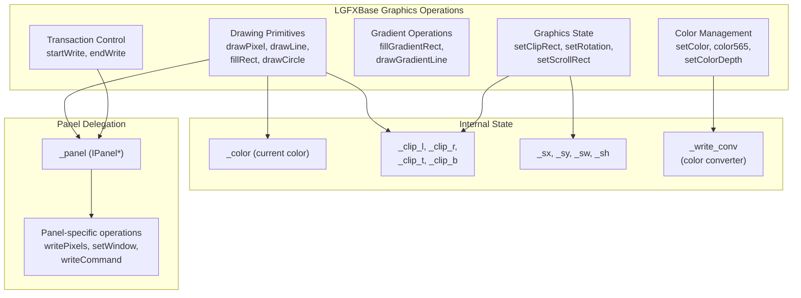
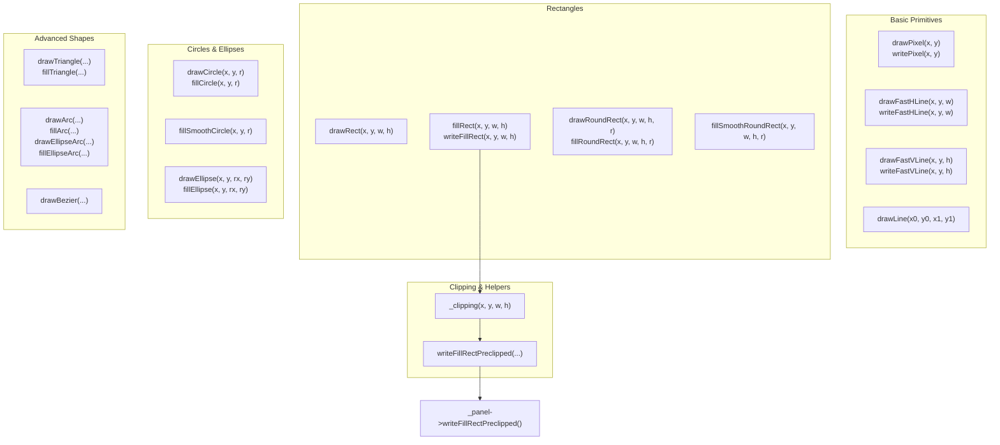
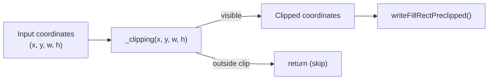
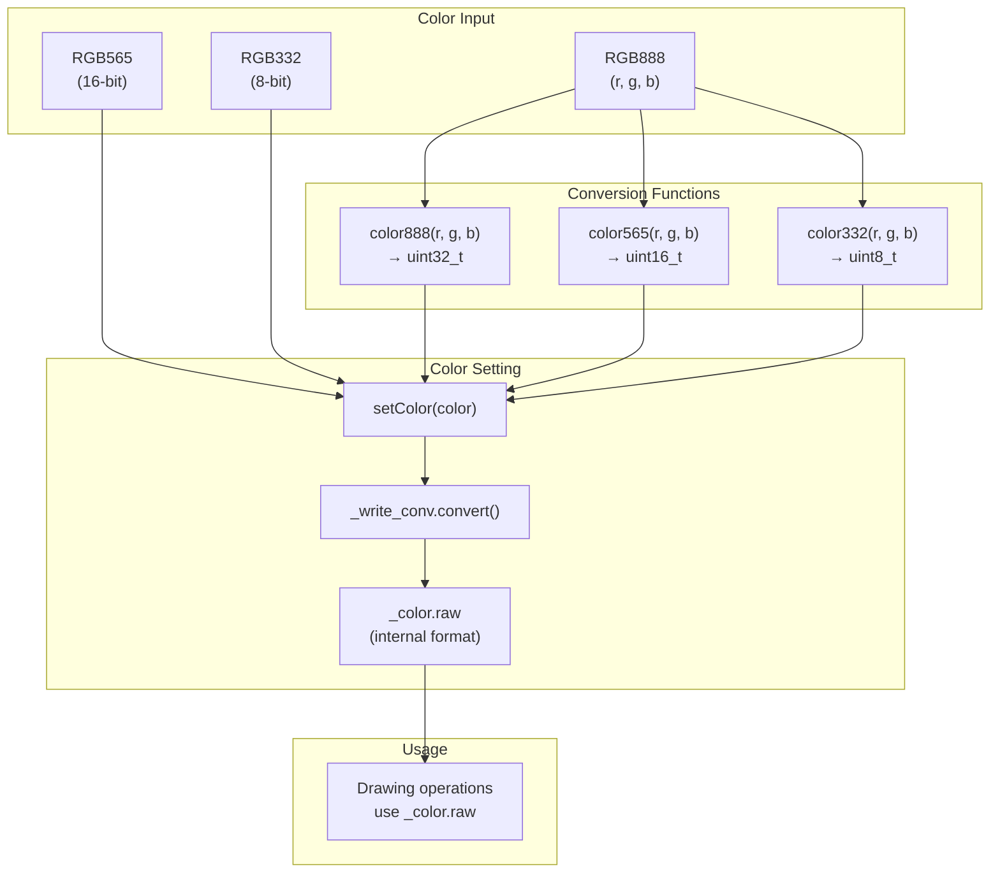
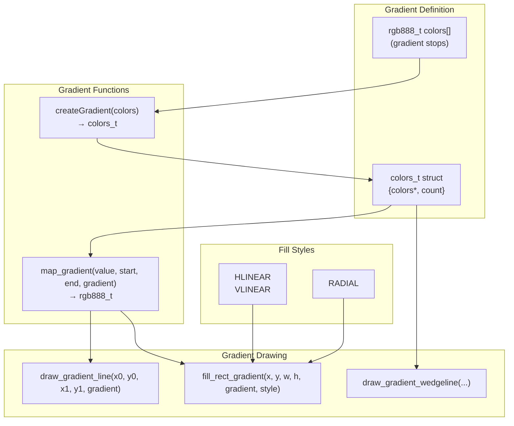
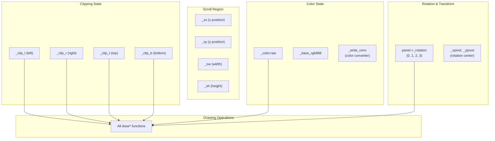
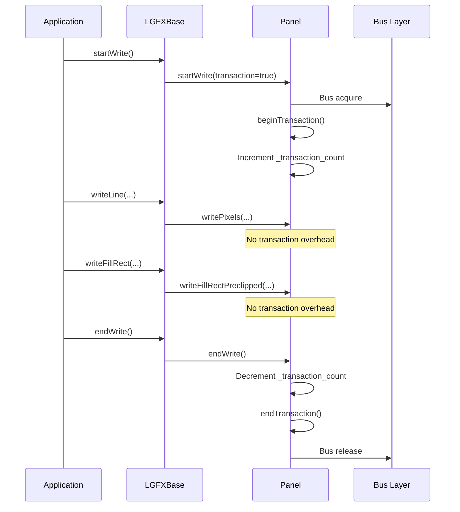
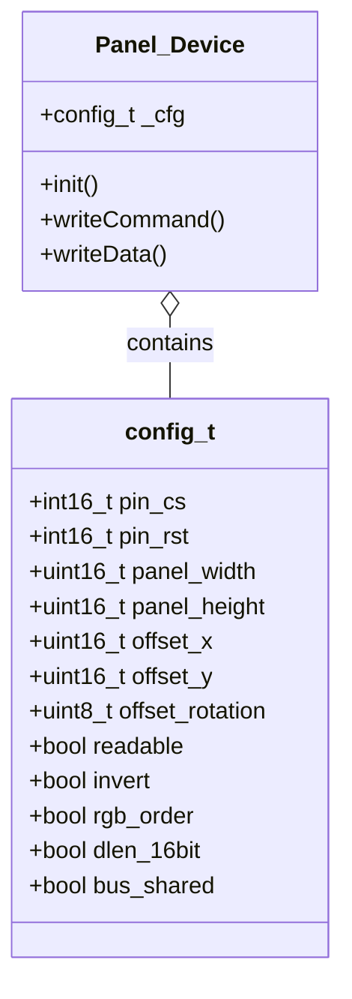
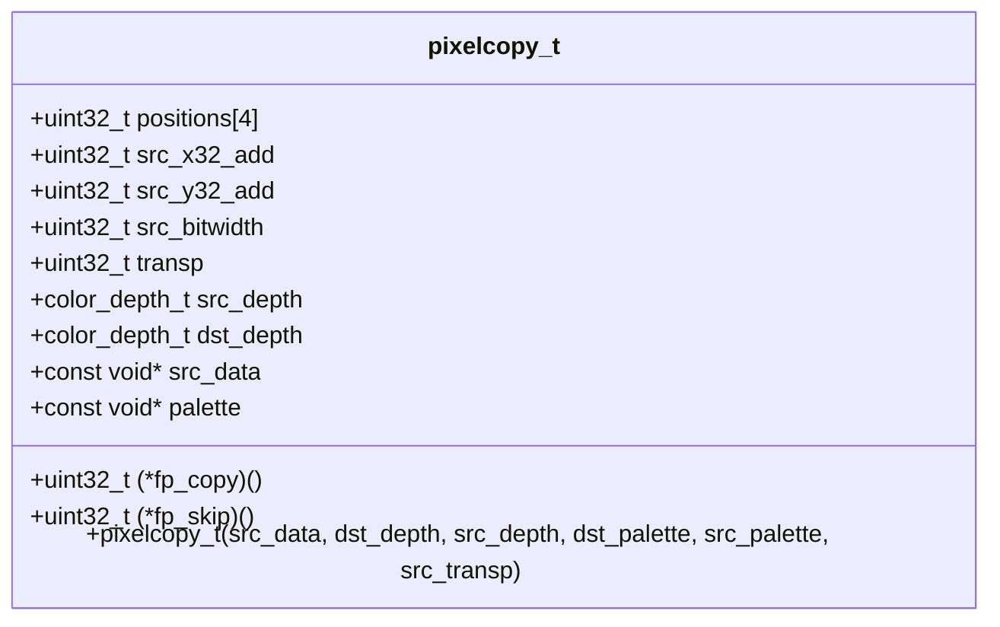

M5GFX LGFXBase Graphics Operations

# LGFXBase Graphics Operations

<details>
<summary>Relevant source files</summary>

The following files were used as context for generating this wiki page:

- [src/lgfx/v1/LGFXBase.cpp](src/lgfx/v1/LGFXBase.cpp)
- [src/lgfx/v1/LGFXBase.hpp](src/lgfx/v1/LGFXBase.hpp)
- [src/lgfx/v1/misc/colortype.hpp](src/lgfx/v1/misc/colortype.hpp)

</details>


`LGFXBase` is the core graphics class in M5GFX that provides all drawing primitives, color management, gradient operations, and graphics state control. This class inherits from Arduino's `Print` class (when compiled for Arduino) and serves as the base for all display operations. All M5GFX device classes and sprites inherit from `LGFXBase`, making these operations available throughout the library.

This page documents the drawing operations, color handling, and state management functions provided by `LGFXBase`. For panel-specific implementations, see [Panel Driver Architecture](#4). For sprite operations, see [Sprite and Off-Screen Buffers](#3.4). For font rendering, see [Font Rendering System](#3.5).

Sources: [src/lgfx/v1/LGFXBase.hpp:56-64](), [src/lgfx/v1/LGFXBase.cpp:43-46]()

## LGFXBase Architecture Overview

**LGFXBase Structure and Delegation**



Sources: [src/lgfx/v1/LGFXBase.hpp:56-143](), [src/lgfx/v1/LGFXBase.cpp:52-79]()

`LGFXBase` maintains graphics state (clipping, color, scroll regions) and delegates hardware-specific operations to a `_panel` member. This separation allows the same drawing code to work with different display hardware. All drawing primitives automatically respect the current clipping rectangle and color settings.

## Drawing Primitives

**Drawing Primitive Categories**



Sources: [src/lgfx/v1/LGFXBase.hpp:158-257](), [src/lgfx/v1/LGFXBase.cpp:158-765]()

### Core Drawing Functions

All drawing functions in `LGFXBase` follow consistent patterns. Each primitive has two variants:

1. **With explicit color**: `drawLine(x0, y0, x1, y1, color)` - draws with specified color
2. **With current color**: `drawLine(x0, y0, x1, y1)` - uses color set by `setColor()`

| Primitive Type | Draw Outline | Fill Shape | Notes |
|----------------|--------------|------------|-------|
| **Pixel** | `drawPixel(x, y)` | N/A | Single pixel at coordinates |
| **Lines** | `drawLine(x0, y0, x1, y1)` | N/A | Bresenham line algorithm |
| | `drawFastHLine(x, y, w)` | N/A | Optimized horizontal line |
| | `drawFastVLine(x, y, h)` | N/A | Optimized vertical line |
| **Rectangles** | `drawRect(x, y, w, h)` | `fillRect(x, y, w, h)` | Axis-aligned rectangles |
| | `drawRoundRect(x, y, w, h, r)` | `fillRoundRect(x, y, w, h, r)` | Corners with radius `r` |
| **Circles** | `drawCircle(x, y, r)` | `fillCircle(x, y, r)` | Midpoint circle algorithm |
| **Ellipses** | `drawEllipse(x, y, rx, ry)` | `fillEllipse(x, y, rx, ry)` | Separate X/Y radii |
| **Triangles** | `drawTriangle(x0, y0, x1, y1, x2, y2)` | `fillTriangle(x0, y0, x1, y1, x2, y2)` | Three vertices |
| **Arcs** | `drawArc(x, y, r0, r1, a0, a1)` | `fillArc(x, y, r0, r1, a0, a1)` | Inner radius `r0`, outer `r1`, angles in degrees |
| | `drawEllipseArc(x, y, r0x, r1x, r0y, r1y, a0, a1)` | `fillEllipseArc(...)` | Elliptical arcs with separate radii |
| **Bezier** | `drawBezier(x0, y0, x1, y1, x2, y2)` | N/A | Quadratic Bezier curve |
| | `drawBezier(x0, y0, x1, y1, x2, y2, x3, y3)` | N/A | Cubic Bezier curve |

Sources: [src/lgfx/v1/LGFXBase.hpp:158-257](), [src/lgfx/v1/LGFXBase.cpp:158-828]()

### Write vs Draw Functions

`LGFXBase` provides two patterns for drawing operations:

- **`draw*()` functions**: Automatically call `startWrite()`/`endWrite()`, suitable for single operations
- **`write*()` functions**: Assume transaction is already active, used for batch operations

```cpp
// Single operation - uses draw
display.drawLine(0, 0, 100, 100, TFT_RED);

// Batch operations - use write with manual transaction
display.startWrite();
display.writeLine(0, 0, 100, 100);
display.writeLine(0, 100, 100, 0);
display.endWrite();
```

The `write*()` variants skip transaction management for better performance when drawing multiple primitives.

Sources: [src/lgfx/v1/LGFXBase.hpp:145-157](), [src/lgfx/v1/LGFXBase.cpp:158-213]()

### Clipping and Coordinate Handling

All drawing primitives automatically respect the current clipping rectangle stored in `_clip_l`, `_clip_r`, `_clip_t`, `_clip_b`. The internal `_clipping()` function adjusts coordinates and dimensions:



Sources: [src/lgfx/v1/LGFXBase.cpp:207-213]()

### Special Drawing Functions

| Function | Purpose | Implementation Notes |
|----------|---------|---------------------|
| `fillScreen(color)` | Fill entire display | Calls `fillRect(0, 0, width(), height())` |
| `clear(color)` | Clear display, sets base color | For EPD displays, performs full refresh |
| `floodFill(x, y)` | Flood fill from seed point | Uses scanline seed fill algorithm with std::list for points |
| `drawCircleHelper(x, y, r, corners)` | Draw partial circle | `corners` bitmask: 0x1=top-left, 0x2=top-right, 0x4=bottom-right, 0x8=bottom-left |
| `fillCircleHelper(x, y, r, corners, delta)` | Fill partial circle | Used internally by `fillRoundRect` |

Sources: [src/lgfx/v1/LGFXBase.hpp:299-306](), [src/lgfx/v1/LGFXBase.cpp:302-340](), [src/lgfx/v1/LGFXBase.cpp:1867-1978]()

## Color Management

**Color Conversion and Management Flow**



Sources: [src/lgfx/v1/LGFXBase.hpp:70-129](), [src/lgfx/v1/LGFXBase.cpp:52-57]()

### Color Format Conversion

`LGFXBase` provides static methods for converting between color formats:

| Function | Input | Output | Description |
|----------|-------|--------|-------------|
| `color332(r, g, b)` | 8-bit R,G,B | `uint8_t` | 3-bit red, 3-bit green, 2-bit blue |
| `color565(r, g, b)` | 8-bit R,G,B | `uint16_t` | 5-bit red, 6-bit green, 5-bit blue |
| `color888(r, g, b)` | 8-bit R,G,B | `uint32_t` | 8-bit each for R, G, B |
| `swap565(r, g, b)` | 8-bit R,G,B | `uint16_t` | RGB565 with endian swap |
| `swap888(r, g, b)` | 8-bit R,G,B | `uint32_t` | RGB888 with endian swap |
| `color16to8(rgb565)` | RGB565 | RGB332 | Downsample to 8-bit |
| `color8to16(rgb332)` | RGB332 | RGB565 | Upsample to 16-bit |
| `color16to24(rgb565)` | RGB565 | RGB888 | Expand to 24-bit |
| `color24to16(rgb888)` | RGB888 | RGB565 | Reduce to 16-bit |

Sources: [src/lgfx/v1/LGFXBase.hpp:65-114]()

### Setting Colors

The `setColor()` method converts the input color to the display's native format using the `_write_conv` color converter:

```cpp
void setColor(T color);              // Template version accepts any color type
void setColor(uint8_t r, uint8_t g, uint8_t b);  // RGB components
void setRawColor(uint32_t c);        // Set pre-converted color directly
uint32_t getRawColor();              // Get current raw color value
```

The color is stored in `_color.raw` in the panel's native format. The `_write_conv` converter handles format translation based on the current `color_depth_t`.

Sources: [src/lgfx/v1/LGFXBase.hpp:116-129]()

### Color Depth Management

The display color depth can be changed dynamically:

```cpp
void setColorDepth(color_depth_t depth);
void setColorDepth(int bits);        // Convenience wrapper
color_depth_t getColorDepth() const;
```

Supported color depths (from `color_depth_t` enum):
- `rgb332_1Byte` - 8-bit color
- `rgb565_2Byte` - 16-bit color (most common)
- `rgb888_3Byte` - 24-bit color
- `rgb666_3Byte` - 18-bit color (666)
- `grayscale_8bit` - 8-bit grayscale
- Palette modes: 1-bit, 2-bit, 4-bit with palette

Changing color depth updates both `_write_conv` and `_read_conv` converters and affects all subsequent drawing operations.

Sources: [src/lgfx/v1/LGFXBase.hpp:386-387](), [src/lgfx/v1/LGFXBase.cpp:52-57]()

### Base Color

The base color is used for screen clearing and as a background color for some operations:

```cpp
void setBaseColor(T color);
uint32_t getBaseColor() const;
```

For non-palette modes, the base color is stored as RGB888. For EPD displays, `clear()` uses the base color for background.

Sources: [src/lgfx/v1/LGFXBase.hpp:126-127]()

## Gradient Operations

`LGFXBase` provides comprehensive gradient support for creating smooth color transitions.

**Gradient System Architecture**



Sources: [src/lgfx/v1/LGFXBase.hpp:269-289](), [src/lgfx/v1/LGFXBase.cpp:869-1149]()

### Creating Gradients

Gradients are defined using the `colors_t` structure containing an array of `rgb888_t` color stops:

```cpp
// Create gradient from array
const rgb888_t gradient_colors[] = {
    rgb888_t(255, 0, 0),    // Red
    rgb888_t(255, 255, 0),  // Yellow
    rgb888_t(0, 255, 0)     // Green
};
colors_t gradient = createGradient(gradient_colors);

// Or create from pointer
colors_t gradient = createGradient(colors, count);
```

The `map_gradient()` function interpolates between color stops based on a value:

```cpp
rgb888_t map_gradient(float value, float start, float end, const colors_t gradient);
```

Sources: [src/lgfx/v1/LGFXBase.hpp:269-275](), [src/lgfx/v1/LGFXBase.cpp:869-893]()

### Gradient Drawing Functions

| Function | Purpose | Parameters |
|----------|---------|------------|
| `drawGradientLine(x0, y0, x1, y1, colors)` | Line with gradient | Color array interpolated along line |
| `drawGradientHLine(x, y, w, colors)` | Horizontal gradient line | Simpler than full line |
| `drawGradientVLine(x, y, h, colors)` | Vertical gradient line | Simpler than full line |
| `fillGradientRect(x, y, w, h, colors, style)` | Rectangle with gradient | Style: `HLINEAR`, `VLINEAR`, or `RADIAL` |
| `drawWideLine(x0, y0, x1, y1, r, colors)` | Wide line with gradient | Radius `r`, anti-aliased |
| `drawWedgeLine(x0, y0, x1, y1, r0, r1, colors)` | Tapered line with gradient | Start radius `r0`, end radius `r1` |
| `drawGradientSpot(x, y, r, colors)` | Circular spot with gradient | Radial gradient from center |

Sources: [src/lgfx/v1/LGFXBase.hpp:262-289](), [src/lgfx/v1/LGFXBase.cpp:895-1149]()

### Two-Color Gradients

Convenience functions for simple two-color gradients:

```cpp
// Two-color gradient line
void drawGradientLine(int32_t x0, int32_t y0, int32_t x1, int32_t y1, 
                      uint32_t colorstart, uint32_t colorend);

// Two-color gradient rectangle
void fillGradientRect(int32_t x, int32_t y, uint32_t w, uint32_t h,
                      uint32_t colorstart, uint32_t colorend, 
                      fill_style_t style = RADIAL);
```

These internally create a two-element `colors_t` structure and call the multi-color gradient functions.

Sources: [src/lgfx/v1/LGFXBase.cpp:895-942](), [src/lgfx/v1/LGFXBase.cpp:1108-1149]()

### Gradient Fill Styles

The `fill_style_t` enum defines gradient direction for rectangles:

| Style | Effect | Implementation |
|-------|--------|----------------|
| `HLINEAR` | Horizontal linear gradient | Left to right color interpolation |
| `VLINEAR` | Vertical linear gradient | Top to bottom color interpolation |
| `RADIAL` | Radial gradient | From center outward, uses distance calculation |

For `RADIAL` style, the gradient is calculated using the distance from the rectangle's center, with aspect ratio correction.

Sources: [src/lgfx/v1/LGFXBase.cpp:1115-1149]()

### Anti-aliased Lines and Wedges

The wedge line functions provide anti-aliased drawing with variable width:

```cpp
void drawWideLine(int32_t x0, int32_t y0, int32_t x1, int32_t y1, 
                  float r, const colors_t colors);

void drawWedgeLine(int32_t x0, int32_t y0, int32_t x1, int32_t y1, 
                   float r0, float r1, const colors_t colors);
```

These use `wedgeLineDistance()` to calculate pixel intensity based on distance from the line centerline, producing smooth anti-aliased edges. The implementation scans a bounding box and calculates alpha values for edge pixels.

Sources: [src/lgfx/v1/LGFXBase.cpp:844-852](), [src/lgfx/v1/LGFXBase.cpp:985-1074]()

## Graphics State Management

`LGFXBase` maintains several graphics state variables that affect drawing operations.

**Graphics State Components**



Sources: [src/lgfx/v1/LGFXBase.hpp:1026-1055]()

### Clipping Rectangle

The clipping rectangle restricts drawing to a specific screen region. All primitives are automatically clipped:

```cpp
void setClipRect(int32_t x, int32_t y, int32_t w, int32_t h);
void getClipRect(int32_t *x, int32_t *y, int32_t *w, int32_t *h);
void clearClipRect();  // Reset to full screen
```

Clipping is stored as edge coordinates (`_clip_l`, `_clip_r`, `_clip_t`, `_clip_b`) for efficient boundary checking. The internal `_clipping()` function adjusts coordinates before drawing:

```cpp
bool _clipping(int32_t &x, int32_t &y, int32_t &w, int32_t &h)
{
    if (x < _clip_l) { w += x - _clip_l; x = _clip_l; }
    if (w > _clip_r + 1 - x) w = _clip_r + 1 - x;
    if (w < 1) return false;
    // Similar for y, h...
    return true;
}
```

Sources: [src/lgfx/v1/LGFXBase.hpp:391-393](), [src/lgfx/v1/LGFXBase.cpp:81-123]()

### Scroll Rectangle

The scroll rectangle defines a region for the `scroll()` operation:

```cpp
void setScrollRect(int32_t x, int32_t y, int32_t w, int32_t h);
void getScrollRect(int32_t *x, int32_t *y, int32_t *w, int32_t *h);
void clearScrollRect();  // Reset to full screen
void scroll(int_fast16_t dx, int_fast16_t dy = 0);
```

The `scroll()` function copies pixels within the scroll rectangle and fills the exposed area with the base color. It uses `copyRect()` for the pixel copy operation.

Sources: [src/lgfx/v1/LGFXBase.hpp:395-397](), [src/lgfx/v1/LGFXBase.cpp:125-156](), [src/lgfx/v1/LGFXBase.cpp:1776-1817]()

### Rotation

Display rotation affects coordinate mapping for all operations:

```cpp
void setRotation(uint_fast8_t rotation);  // 0-3 or 0-7 depending on panel
uint8_t getRotation() const;
```

Rotation values:
- `0` - Normal orientation
- `1` - 90° clockwise
- `2` - 180°
- `3` - 270° clockwise
- `4-7` - Same as 0-3 but with mirroring (panel-dependent)

When rotation changes, `clearClipRect()` and `clearScrollRect()` are automatically called to reset state.

Sources: [src/lgfx/v1/LGFXBase.hpp:384-385](), [src/lgfx/v1/LGFXBase.cpp:59-64]()

### Pivot Point

The pivot point is used for rotation calculations in sprite and image operations:

```cpp
void setPivot(float x, float y);
float getPivotX() const;
float getPivotY() const;
```

The pivot point is stored in `_xpivot` and `_ypivot` and used by transformation functions like `pushImageRotateZoom()`.

Sources: [src/lgfx/v1/LGFXBase.hpp:307-309]()

### Address Window

The address window defines the active pixel region for bulk write operations:

```cpp
void setAddrWindow(int32_t x, int32_t y, int32_t w, int32_t h);
void setWindow(uint_fast16_t xs, uint_fast16_t ys, 
               uint_fast16_t xe, uint_fast16_t ye);
```

`setAddrWindow()` clips to screen bounds and calls the panel's `setWindow()` with start/end coordinates. This is used internally by image writing functions to optimize bulk transfers.

Sources: [src/lgfx/v1/LGFXBase.hpp:389](), [src/lgfx/v1/LGFXBase.cpp:66-79]()

## Transaction Control

Transaction functions manage bus access and optimize performance for multiple operations.

**Transaction Flow**



Sources: [src/lgfx/v1/LGFXBase.hpp:137-142]()

### Transaction Functions

| Function | Purpose | Use Case |
|----------|---------|----------|
| `startWrite()` | Begin transaction, acquire bus | Start of batch operations |
| `endWrite()` | End transaction, release bus | End of batch operations |
| `beginTransaction()` | Low-level transaction begin | Usually not called directly |
| `endTransaction()` | Low-level transaction end | Usually not called directly |
| `getStartCount()` | Get transaction nesting level | Debug/diagnostics |

### Transaction Best Practices

**Single operation** - Use `draw*()` functions that handle transactions automatically:
```cpp
display.drawLine(0, 0, 100, 100, TFT_RED);
display.fillRect(10, 10, 50, 50, TFT_BLUE);
```

**Batch operations** - Use `write*()` functions with manual transaction:
```cpp
display.startWrite();
for (int i = 0; i < 100; i++) {
    display.writeLine(i, 0, i, 100);
}
display.endWrite();
```

**Nested transactions** - Transactions can be nested, with the bus acquired only on the outermost call:
```cpp
display.startWrite();      // Acquires bus
  display.startWrite();    // Increments counter
  display.writeLine(...);
  display.endWrite();      // Decrements counter
display.endWrite();        // Releases bus
```

Sources: [src/lgfx/v1/LGFXBase.hpp:131-142]()

## Anti-aliasing and Smooth Drawing

Certain functions provide anti-aliased output for smoother visual appearance.

### Smooth Shapes

| Function | Description | Implementation |
|----------|-------------|----------------|
| `fillSmoothRoundRect(x, y, w, h, r)` | Rounded rectangle with AA edges | Calculates alpha for edge pixels using distance from ideal circle |
| `fillSmoothCircle(x, y, r)` | Circle with AA edges | Wrapper around `fillSmoothRoundRect` |
| `drawSmoothLine(x0, y0, x1, y1)` | Alias for `drawWideLine` with r=0.5 | Uses wedge line with 0.5 pixel radius |

The smooth functions calculate sub-pixel coverage using alpha blending. For `fillSmoothRoundRect`, pixels near the corner arc are tested against both inner and outer radius circles, with fractional alpha calculated from the distance.

Sources: [src/lgfx/v1/LGFXBase.hpp:293-297](), [src/lgfx/v1/LGFXBase.cpp:1154-1196]()

### Alpha Blending

The `fillRectAlpha()` function draws a semi-transparent rectangle:

```cpp
void fillRectAlpha(int32_t x, int32_t y, int32_t w, int32_t h, 
                   uint8_t alpha, const T& color);
```

Alpha values: 0 (fully transparent) to 255 (fully opaque). The implementation blends the specified color with existing pixels based on the alpha value.

Sources: [src/lgfx/v1/LGFXBase.hpp:358-362]()

### Anti-aliased Image Transformations

Functions ending with `WithAA` provide anti-aliased image transformations:

```cpp
void pushImageRotateZoomWithAA(float dst_x, float dst_y, 
                                float src_x, float src_y, 
                                float angle, float zoom_x, float zoom_y,
                                int32_t w, int32_t h, const T* data);

void pushImageAffineWithAA(const float matrix[6], 
                            int32_t w, int32_t h, const T* data);
```

These functions sample multiple source pixels with sub-pixel accuracy to reduce aliasing artifacts when rotating or scaling images.

Sources: [src/lgfx/v1/LGFXBase.hpp:475-500](), [src/lgfx/v1/LGFXBase.cpp:1501-1750]()

## Panel_Device Class

`Panel_Device` implements the `IPanel` interface and serves as the base class for all panel-specific implementations. It provides the bridge between the high-level graphics operations and the low-level hardware communication.

### Panel Configuration

`Panel_Device` uses a configuration structure to define the panel's characteristics:



Sources: [src/lgfx/v1/panel/Panel_Device.hpp:37-109]()

### Panel Initialization and Control

The `Panel_Device` class provides methods for initializing and controlling the panel:

| Category | Methods |
|----------|---------|
| Initialization | `init`, `initBus`, `releaseBus` |
| Pin Control | `init_cs`, `cs_control`, `init_rst`, `rst_control` |
| Bus Communication | `writeCommand`, `writeData`, `command_list` |
| Display Control | `display`, `setColorDepth`, `setRotation` |
| Touch Interface | `setTouch`, `getTouchRaw`, `getTouch`, `touchCalibrate` |

The class supports connecting to different bus types (SPI, I2C, etc.) through the `IBus` interface, allowing flexibility in hardware communication.

Sources: [src/lgfx/v1/panel/Panel_Device.cpp:31-56](), [src/lgfx/v1/panel/Panel_Device.cpp:110-178](), [src/lgfx/v1/panel/Panel_Device.cpp:315-357]()

## Panel_FrameBufferBase Class

`Panel_FrameBufferBase` extends `Panel_Device` to add frame buffer functionality. It manages a frame buffer in memory, which is used to store the pixel data before it is sent to the display hardware.

### Frame Buffer Management

The class manages a two-dimensional array of pixel lines (`_lines_buffer`), where each line is a buffer of pixel data. The key operations include:

| Operation | Description |
|-----------|-------------|
| Drawing to Buffer | `drawPixelPreclipped`, `writeFillRectPreclipped` |
| Updating Display | `display` method flushes changes to the physical display |
| Window Management | `setWindow` defines the active drawing region |
| Block Operations | `writeBlock`, `writePixels` write to the frame buffer |
| Image Handling | `writeImage`, `writeImageARGB` draw images to the buffer |
| Rotation | Handles coordinate rotation for proper display orientation |

The frame buffer approach provides better performance for many operations, as multiple pixel changes can be batched before updating the display.

Sources: [src/lgfx/v1/panel/Panel_FrameBufferBase.cpp:74-434]()

## pixelcopy_t Class

The `pixelcopy_t` class is a utility class used for pixel copy operations throughout the graphics system. It handles different color depths, formats, and transformations.



Sources: [src/lgfx/v1/misc/pixelcopy.hpp:30-87](), [src/lgfx/v1/misc/pixelcopy.cpp:27-41]()

### Pixel Copy Operations

The class supports various pixel copy operations:

| Operation Type | Methods |
|----------------|---------|
| Direct Copy | `copy_rgb_fast`, `copy_bit_fast` |
| Transformed Copy | `copy_rgb_affine`, `copy_bit_affine` |
| Alpha Blending | `copy_alpha_affine`, `blend_rgb_fast` |
| Palette Handling | `copy_palette_fast`, `copy_palette_affine` |
| Anti-aliasing | `copy_rgb_antialias`, `copy_palette_antialias` |

The class uses function pointers (`fp_copy`, `fp_skip`) to select the appropriate copy method based on the source and destination color depths and formats.

Sources: [src/lgfx/v1/misc/pixelcopy.hpp:105-497](), [src/lgfx/v1/misc/pixelcopy.cpp:78-258]()

## Common Usage Patterns

The Graphics Base Classes are typically used in the following patterns:

1. **Direct Drawing**: Using `LGFXBase` methods to draw shapes, text, and images directly
   ```cpp
   display.drawLine(0, 0, 100, 100, TFT_RED);
   display.fillRect(10, 10, 50, 50, TFT_BLUE);
   ```

2. **Buffered Operations**: Using `startWrite`/`endWrite` to batch operations for better performance
   ```cpp
   display.startWrite();
   display.drawLine(0, 0, 100, 100);
   display.drawLine(0, 100, 100, 0);
   display.endWrite();
   ```

3. **Image Manipulation**: Using the image handling methods to display and transform images
   ```cpp
   display.pushImage(x, y, width, height, imageData);
   display.pushImageRotateZoom(x, y, 0, 0, angle, zoom, zoom, width, height, imageData);
   ```

4. **Frame Buffer Operations**: Working with the frame buffer for complex display updates
   ```cpp
   // Draw to frame buffer
   display.writeFillRect(x, y, width, height, color);
   // Update display to show changes
   display.display();
   ```

These patterns demonstrate the flexibility and power of the Graphics Base Classes, which provide a solid foundation for building complex graphical applications.