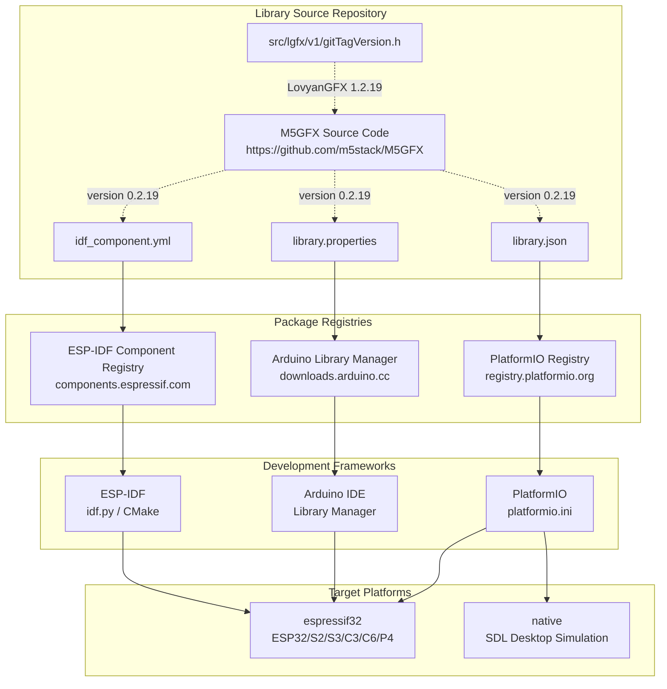
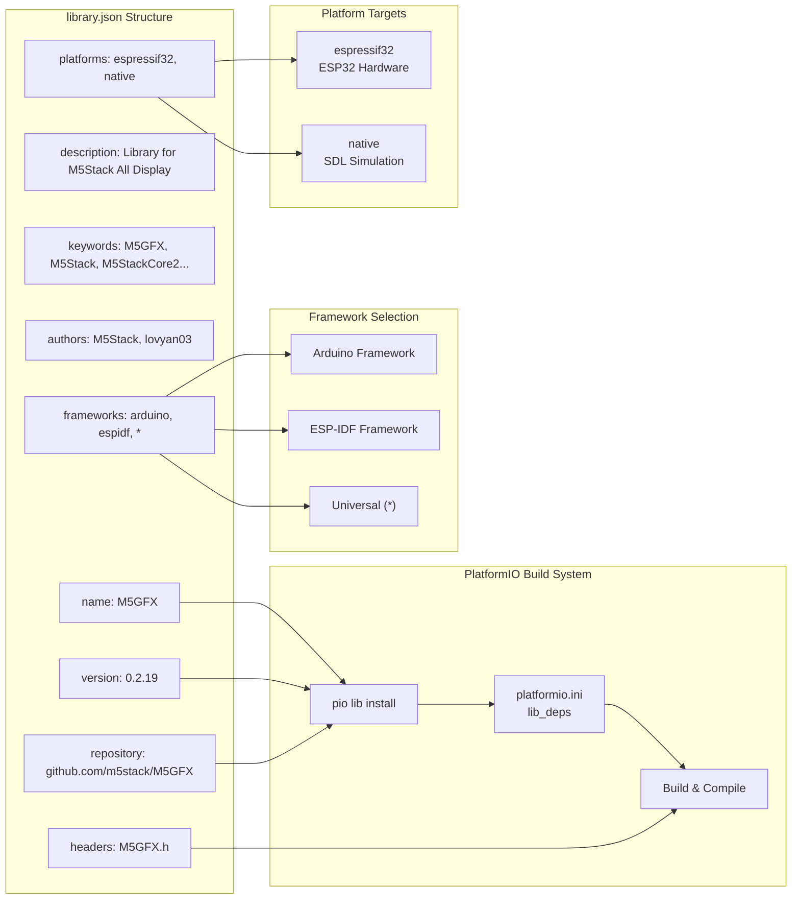
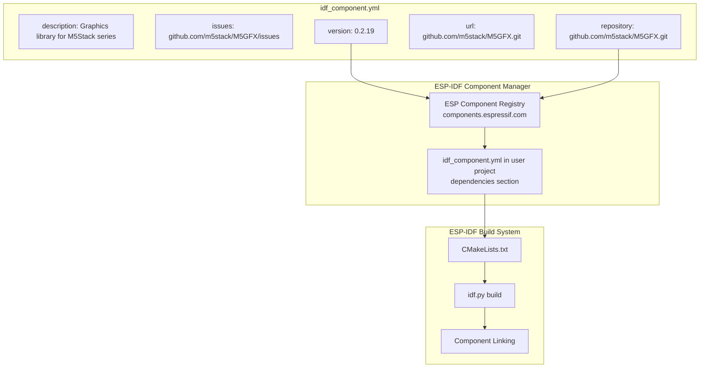
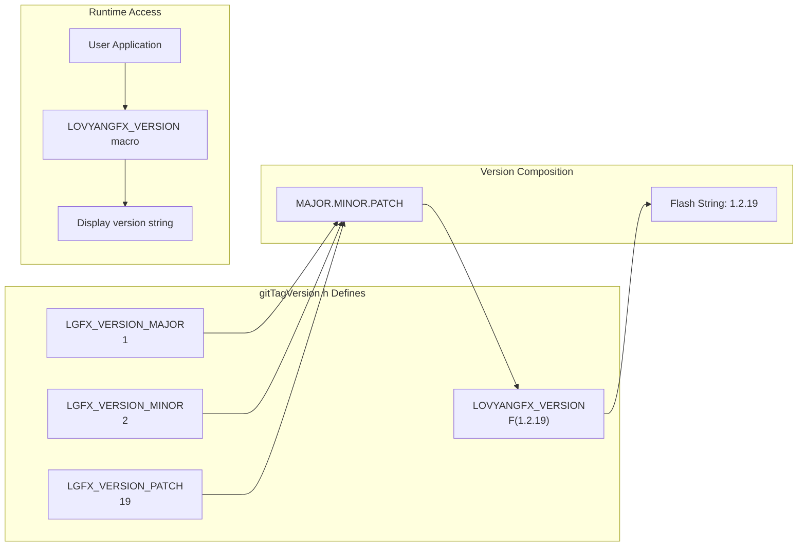
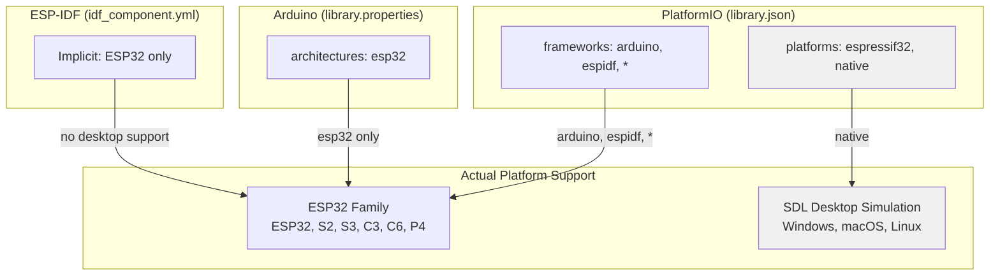
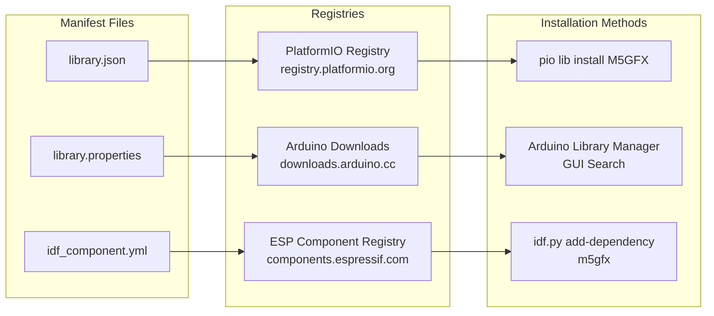

M5GFX Library Configuration and Versioning

# Library Configuration and Versioning

<details>
<summary>Relevant source files</summary>

The following files were used as context for generating this wiki page:

- [README.md](README.md)
- [idf_component.yml](idf_component.yml)
- [library.json](library.json)
- [library.properties](library.properties)
- [src/lgfx/v1/gitTagVersion.h](src/lgfx/v1/gitTagVersion.h)

</details>


## Purpose and Scope

This document explains how M5GFX manages library metadata, versioning, and distribution across multiple frameworks and package managers. M5GFX provides three separate manifest files to support different build ecosystems: PlatformIO, Arduino Library Manager, and ESP-IDF Component Registry. 

For information about build environments and compilation flags, see [PlatformIO Project Configuration](#6.2). For cross-platform development patterns, see [Cross-Platform Code Patterns](#6.4).

**Sources:** [library.json:1-17](), [library.properties:1-10](), [idf_component.yml:1-5]()

---

## Multi-Ecosystem Distribution Architecture

M5GFX maintains separate manifest files for each package management ecosystem, allowing the library to be distributed through multiple channels simultaneously. Each manifest file contains ecosystem-specific metadata while maintaining synchronized version numbers.



**Diagram: Library Distribution Through Multiple Ecosystems**

The library uses three distinct manifest files that serve different package management systems. All three files maintain synchronized version numbers to ensure consistency across distribution channels.

**Sources:** [library.json:1-17](), [library.properties:1-10](), [idf_component.yml:1-5]()

---

## Version Management Strategy

M5GFX maintains two separate version numbers that track different aspects of the library:

1. **M5GFX Version**: The version of the M5GFX wrapper and M5Stack-specific device configurations
2. **LovyanGFX Version**: The version of the underlying graphics core library

Both version numbers follow semantic versioning (`MAJOR.MINOR.PATCH`), but they evolve independently. The M5GFX version is defined in all three manifest files, while the LovyanGFX version is defined in [src/lgfx/v1/gitTagVersion.h:1-4]().

### Current Version Numbers

| Component | Version | Location |
|-----------|---------|----------|
| M5GFX | 0.2.19 | [library.json:13](), [library.properties:2](), [idf_component.yml:5]() |
| LovyanGFX Core | 1.2.19 | [src/lgfx/v1/gitTagVersion.h:1-3]() |

The version numbers are currently synchronized (both at `.19` patch level), but this is not guaranteed. M5GFX may release updates to device configurations without updating the LovyanGFX core, or vice versa.

**Sources:** [library.json:13](), [library.properties:2](), [idf_component.yml:5](), [src/lgfx/v1/gitTagVersion.h:1-4]()

---

## PlatformIO Library Manifest (library.json)

The `library.json` file provides metadata for the PlatformIO ecosystem. This manifest enables installation via `platformio lib install "M5GFX"` or automatic dependency resolution in `platformio.ini`.



**Diagram: library.json Metadata and PlatformIO Integration**

### Key Fields

| Field | Value | Purpose |
|-------|-------|---------|
| `name` | `"M5GFX"` | Library identifier in PlatformIO Registry |
| `description` | `"Library for M5Stack All Display"` | Short description for search results |
| `keywords` | `"M5GFX,M5Stack,M5StackCore2..."` | Searchable keywords including device names |
| `authors.name` | `"M5Stack, lovyan03"` | Primary maintainers |
| `authors.url` | `"http://www.m5stack.com"` | Organization homepage |
| `repository.type` | `"git"` | Version control system |
| `repository.url` | `"https://github.com/m5stack/M5GFX.git"` | Source code location |
| `version` | `"0.2.19"` | Current release version |
| `frameworks` | `["arduino", "espidf", "*"]` | Supported frameworks (wildcard allows all) |
| `platforms` | `["espressif32", "native"]` | ESP32 hardware and native SDL simulation |
| `headers` | `"M5GFX.h"` | Primary include file |

The `frameworks` field with wildcard `"*"` allows the library to be used with any framework, not just Arduino and ESP-IDF. The `platforms` field explicitly lists `"native"` to enable desktop SDL simulation alongside ESP32 hardware targets.

**Sources:** [library.json:1-17]()

---

## Arduino Library Manager Manifest (library.properties)

The `library.properties` file conforms to the Arduino Library Specification 1.5, enabling distribution through the Arduino Library Manager. Arduino IDE users can install M5GFX via **Sketch → Include Library → Manage Libraries**.

### Manifest Structure

| Field | Value | Purpose |
|-------|-------|---------|
| `name` | `M5GFX` | Library name displayed in Arduino IDE |
| `version` | `0.2.19` | Must match `library.json` version |
| `author` | `M5Stack` | Primary author/maintainer |
| `maintainer` | `M5Stack` | Current maintainer contact |
| `sentence` | `Library for M5Stack All Display` | Short description (one line) |
| `paragraph` | `M5Stack, M5Stack Core2, M5Stack CoreInk...` | Detailed description with device list |
| `category` | `Display` | Arduino Library Manager category |
| `url` | `https://github.com/m5stack/M5GFX.git` | Project homepage |
| `architectures` | `esp32` | Target architectures (ESP32 only) |
| `includes` | `M5GFX.h` | Header file for IDE auto-include |

### Platform Restriction

Unlike `library.json` which supports both `espressif32` and `native` platforms, the Arduino Library Manager manifest restricts architectures to `esp32` only. This is because Arduino IDE does not support SDL desktop simulation—it targets embedded hardware exclusively.

The `includes` field at [library.properties:10]() tells Arduino IDE which header to automatically insert when a user selects **Sketch → Include Library → M5GFX**.

**Sources:** [library.properties:1-10]()

---

## ESP-IDF Component Manifest (idf_component.yml)

The `idf_component.yml` file enables M5GFX to be used as an ESP-IDF component through the Component Registry. This allows integration with native ESP-IDF projects that use `idf.py build` instead of Arduino or PlatformIO.



**Diagram: ESP-IDF Component Integration Flow**

### Minimal Field Set

The ESP-IDF component manifest contains fewer fields than the PlatformIO and Arduino manifests. It provides only the essential metadata required for component registration and dependency resolution:

- `description`: Human-readable component description
- `issues`: Issue tracker URL for bug reports
- `repository`: Git repository URL for source code access
- `url`: Project homepage (typically same as repository)
- `version`: Component version following semantic versioning

ESP-IDF users add M5GFX as a dependency by creating an `idf_component.yml` file in their project's main component directory:

```yaml
dependencies:
  m5gfx:
    version: ">=0.2.19"
```

The Component Manager automatically downloads and links M5GFX during the build process.

**Sources:** [idf_component.yml:1-5]()

---

## LovyanGFX Version Tracking

M5GFX embeds LovyanGFX as its graphics core. The LovyanGFX version is tracked separately from the M5GFX version using preprocessor defines in [src/lgfx/v1/gitTagVersion.h:1-4]().



**Diagram: LovyanGFX Version Macro Composition**

### Version Macros

The version is defined as three separate integer macros:

```cpp
#define LGFX_VERSION_MAJOR 1
#define LGFX_VERSION_MINOR 2
#define LGFX_VERSION_PATCH 19
```

These are combined into a flash string macro using the `F()` helper for memory efficiency on embedded systems:

```cpp
#define LOVYANGFX_VERSION F( LGFX_VERSION_MAJOR "." LGFX_VERSION_MINOR "." LGFX_VERSION_PATCH )
```

The `F()` macro stores the version string in program flash memory rather than RAM, reducing memory usage on resource-constrained devices.

### Version Query in Application Code

Applications can query the LovyanGFX version at runtime:

```cpp
#include <M5GFX.h>

void setup() {
  Serial.println(LOVYANGFX_VERSION);  // Prints: "1.2.19"
}
```

This allows applications to conditionally enable features based on the LovyanGFX version or display version information to users.

**Sources:** [src/lgfx/v1/gitTagVersion.h:1-4]()

---

## Metadata Consistency and Synchronization

All three manifest files maintain synchronized version numbers and repository URLs to ensure consistency across distribution channels. Any version update must modify all three files simultaneously.

### Synchronized Fields Across Manifests

| Field | library.json | library.properties | idf_component.yml |
|-------|--------------|-------------------|------------------|
| **Version** | `0.2.19` | `0.2.19` | `0.2.19` |
| **Repository** | `https://github.com/m5stack/M5GFX.git` | `https://github.com/m5stack/M5GFX.git` | `https://github.com/m5stack/M5GFX.git` |
| **Description** | "Library for M5Stack All Display" | "Library for M5Stack All Display" | "Graphics library for M5Stack series" |

### Version Update Workflow

When releasing a new M5GFX version, maintainers must:

1. Update `version` field in [library.json:13]()
2. Update `version` field in [library.properties:2]()
3. Update `version` field in [idf_component.yml:5]()
4. Optionally update LovyanGFX version in [src/lgfx/v1/gitTagVersion.h:1-3]() if core changes are included
5. Create Git tag matching the version number (e.g., `v0.2.19`)
6. Trigger automatic publication to all three registries

The absence of automated tooling for version synchronization requires manual verification that all manifest files contain matching version numbers before release.

**Sources:** [library.json:13](), [library.properties:2](), [idf_component.yml:5]()

---

## Framework and Platform Support Matrix

The library manifests declare different framework and platform support based on the capabilities of each ecosystem.



**Diagram: Platform Support Across Different Ecosystems**

### Platform-Specific Capabilities

| Ecosystem | ESP32 Support | Desktop SDL Support | Frameworks |
|-----------|--------------|---------------------|------------|
| **PlatformIO** | ✓ (espressif32) | ✓ (native) | Arduino, ESP-IDF, universal |
| **Arduino IDE** | ✓ (esp32) | ✗ | Arduino only |
| **ESP-IDF** | ✓ (implicit) | ✗ | ESP-IDF only |

Only PlatformIO supports desktop SDL simulation through the `native` platform. Arduino Library Manager and ESP-IDF Component Registry are restricted to embedded ESP32 targets.

The wildcard framework `"*"` in [library.json:14]() theoretically allows M5GFX to be used with other frameworks beyond Arduino and ESP-IDF, though this is untested.

**Sources:** [library.json:14-15](), [library.properties:9]()

---

## Keywords and Discoverability

The `library.json` manifest includes an extensive keyword list to improve discoverability in package manager search results. The keywords enumerate specific device models supported by M5GFX.

### Device Model Keywords

From [library.json:4]():

```
"M5GFX,M5Stack,M5StackCore2,M5StackCoreInk,M5StickC,M5StickC-Plus,M5Paper,
M5Tough,M5Station,M5ATOMS3,M5Tab5,UnitOLED,UnitLCD,UnitRCA,ATOMDisplay"
```

These keywords enable users to discover M5GFX by searching for their specific device model in the PlatformIO Library Registry. For example, searching "M5Paper" or "UnitOLED" will return M5GFX in the results.

The Arduino Library Manager uses the `sentence` and `paragraph` fields in [library.properties:5-6]() for search indexing rather than explicit keywords. The paragraph field contains a similar device enumeration:

```
M5Stack, M5Stack Core2, M5Stack CoreInk, M5StickC, M5StickC-Plus, M5Paper, 
M5Tough, M5Station, M5ATOMS3, Unit OLED, Unit LCD, Unit RCA, ATOM Display
```

**Sources:** [library.json:4](), [library.properties:5-6]()

---

## License Documentation

While the manifest files reference the MIT license for M5GFX itself, the actual license documentation is maintained in separate files. The [README.md:41-53]() provides a comprehensive list of all dependencies and their respective licenses.

### License Summary

| Component | License | Copyright Holder |
|-----------|---------|-----------------|
| M5GFX | MIT | M5Stack |
| LovyanGFX | FreeBSD | lovyan03 |
| TJpgDec | Original | ChaN |
| Pngle | MIT | kikuchan |
| QRCode | MIT | Richard Moore, Nayuki |
| result | MIT | Matthew Rodusek |
| GFX/GLCD fonts | 2-clause BSD | Adafruit Industries |
| Font 2,4,6,7,8 | FreeBSD | Bodmer |
| IPA fonts | IPA Font License | IPA |
| efont | 3-clause BSD | Electronic Font Open Laboratory |
| TomThumb font | 3-clause BSD | Brian J. Swetland, et al. |

The manifest files themselves do not include license fields, as PlatformIO and Arduino Library Manager expect licenses to be defined in separate `LICENSE` or `LICENSE.txt` files at the repository root.

**Sources:** [README.md:41-53]()

---

## Distribution Endpoints

Each manifest file targets a different distribution endpoint:



**Diagram: Distribution Channels and Installation Methods**

### Registry URLs

- **PlatformIO**: `https://registry.platformio.org/libraries/m5stack/M5GFX`
- **Arduino**: Indexed via Arduino Library Manager API at `downloads.arduino.cc`
- **ESP-IDF**: `https://components.espressif.com/components/m5stack/m5gfx`

Each registry has different update propagation delays after a new release is tagged in GitHub. PlatformIO typically indexes new versions within hours, while Arduino Library Manager may take 1-2 days for manual review and approval.

**Sources:** [library.json:9-11](), [library.properties:8](), [idf_component.yml:3]()