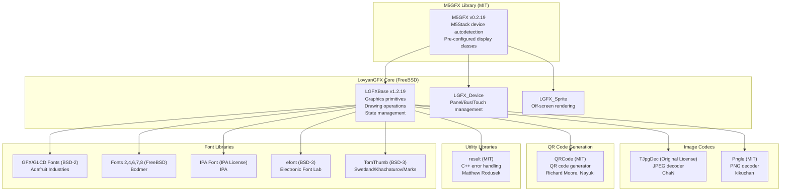
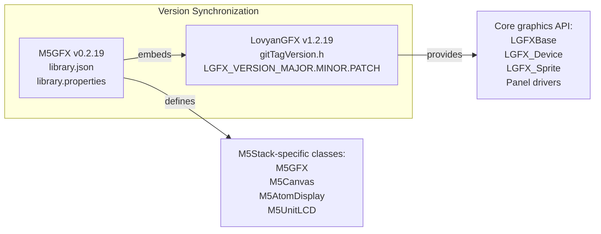
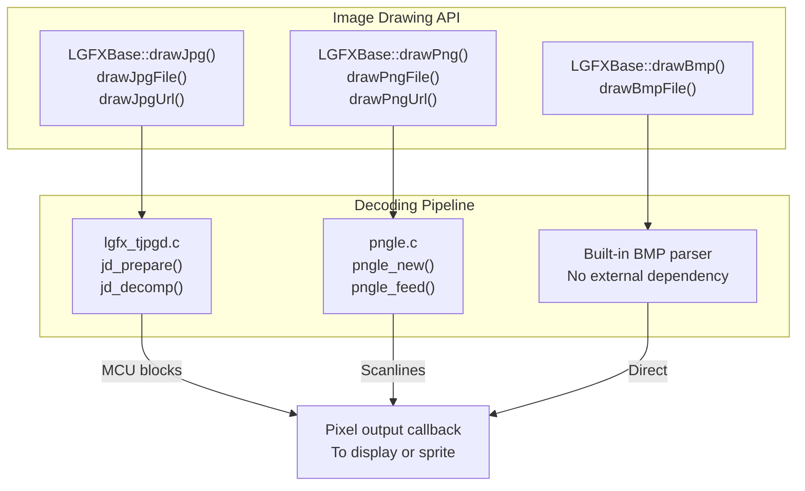
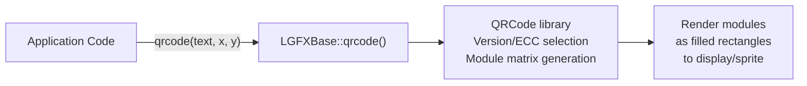
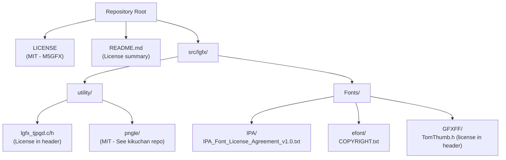

M5GFX Library Dependencies and Licenses

# Library Dependencies and Licenses

Relevant source files

The following files were used as context for generating this wiki page:

- [README.md](README.md)
- [idf_component.yml](idf_component.yml)
- [library.json](library.json)
- [library.properties](library.properties)
- [src/lgfx/v1/gitTagVersion.h](src/lgfx/v1/gitTagVersion.h)

This page documents all third-party libraries, embedded components, and their respective licenses that M5GFX depends on or includes. M5GFX is built on the LovyanGFX graphics core and integrates several specialized libraries for image decoding, QR code generation, and font rendering.

For information about supported frameworks and build configuration, see [Development and Build System](#6). For font rendering implementation details, see [Font Rendering System](#3.5).

---

## Dependency Overview

M5GFX has a layered dependency structure where the core graphics functionality comes from LovyanGFX, while specialized features are provided by embedded third-party libraries. All dependencies are statically linked into the M5GFX library—there are no external runtime dependencies beyond the target framework (Arduino or ESP-IDF).

**Sources:** [library.json:1-17](), [README.md:41-53](), [src/lgfx/v1/gitTagVersion.h:1-4]()

---

## LovyanGFX Core Library

M5GFX is a wrapper and extension of **LovyanGFX** (lovyan03), which provides the foundational graphics engine. M5GFX version 0.2.19 includes LovyanGFX version 1.2.19.

### Relationship Between M5GFX and LovyanGFX Versions

### LovyanGFX License (FreeBSD)

LovyanGFX is licensed under the **FreeBSD license** (2-clause BSD), which permits:
- Commercial use
- Modification
- Distribution
- Private use

Requirements:
- Include copyright notice
- Include license text

The FreeBSD license text is located in the upstream LovyanGFX repository. M5GFX redistributes LovyanGFX as an embedded component.

**Sources:** [README.md:44](), [library.json:2-16](), [src/lgfx/v1/gitTagVersion.h:1-4]()

---

## Image Codec Dependencies

M5GFX supports JPEG and PNG decoding through two embedded libraries.

### TJpgDec - JPEG Decoder

**TJpgDec** is a compact JPEG decoder optimized for embedded systems, written by ChaN (the same author as FatFs). It supports baseline JPEG with various color formats.

| Property | Value |
|----------|-------|
| **Author** | ChaN |
| **License** | Original (permissive, see source header) |
| **Source Location** | `src/lgfx/utility/lgfx_tjpgd.c` and `.h` |
| **Integration Point** | `LGFXBase::drawJpg()`, `LGFXBase::drawJpgFile()` |
| **Features** | Baseline JPEG, 1/1, 1/2, 1/4, 1/8 scaling, MCU-by-MCU decoding |

### Pngle - PNG Decoder

**Pngle** is a streaming PNG decoder by kikuchan, designed for memory-constrained environments.

| Property | Value |
|----------|-------|
| **Author** | kikuchan |
| **License** | MIT |
| **Repository** | https://github.com/kikuchan/pngle |
| **Source Location** | `src/lgfx/utility/pngle/` |
| **Integration Point** | `LGFXBase::drawPng()`, `LGFXBase::drawPngFile()` |
| **Features** | Interlaced/non-interlaced, transparency, streaming decode |

**Sources:** [README.md:45-46]()

---

## QRCode Generation Library

M5GFX includes **QRCode** by Richard Moore and Nayuki for generating QR codes directly on displays.

| Property | Value |
|----------|-------|
| **Authors** | Richard Moore, Nayuki |
| **License** | MIT |
| **Repository** | https://github.com/ricmoo/QRCode |
| **Source Location** | Embedded in LovyanGFX utility sources |
| **Integration Point** | `LGFXBase::qrcode()` |
| **Features** | QR code versions 1-40, error correction levels L/M/Q/H |

### Usage Pattern

**Sources:** [README.md:47]()

---

## Utility Libraries

### result - C++ Error Handling

The **result** library by Matthew Rodusek provides Rust-style `Result<T, E>` type for error handling without exceptions.

| Property | Value |
|----------|-------|
| **Author** | Matthew Rodusek |
| **License** | MIT |
| **Repository** | https://github.com/bitwizeshift/result |
| **Usage Context** | Optional error handling in platform abstraction |

This library is used internally by LovyanGFX for error propagation in situations where exceptions are disabled or undesirable.

**Sources:** [README.md:48]()

---

## Font Libraries and Licenses

M5GFX supports multiple font formats with different origins and licenses. Font rendering is handled by the LovyanGFX `IFont` interface and format-specific implementations.

### Font Formats and Sources

```mermaid
graph TB
    subgraph "Font Format Support"
        IFont["IFont Interface<br/>Font rendering abstraction"]
    end
    
    subgraph "Adafruit-Compatible Fonts (BSD-2)"
        GFXFont["GFXfont (Adafruit GFX)<br/>Fixed and proportional<br/>Bitmap-based"]
        GLCDFont["GLCD font (Adafruit GFX)<br/>Classic LCD font<br/>5x7, 6x8 variants"]
    end
    
    subgraph "TFT_eSPI Fonts (FreeBSD)"
        Font2["Font 2<br/>16-pixel height"]
        Font4["Font 4<br/>26-pixel height"]
        Font6["Font 6<br/>48-pixel height"]
        Font7["Font 7<br/>7-segment style"]
        Font8["Font 8<br/>75-pixel height"]
    end
    
    subgraph "Japanese Fonts"
        IPAFont_Detail["IPA Font (IPA License)<br/>src/lgfx/Fonts/IPA/<br/>Gothic and Mincho variants<br/>Converted to RLE format"]
        EFont_Detail["efont (BSD-3)<br/>src/lgfx/Fonts/efont/<br/>Electronic Font Open Laboratory<br/>Unicode Japanese font"]
    end
    
    subgraph "Specialty Fonts"
        TomThumb_Detail["TomThumb (BSD-3)<br/>3x5 pixel ultra-compact<br/>ASCII only"]
        U8g2Font["U8g2 fonts<br/>Various U8g2-compatible fonts"]
        VLWFont["VLW fonts<br/>Anti-aliased fonts<br/>Created with Processing"]
    end
    
    IFont --> GFXFont
    IFont --> GLCDFont
    IFont --> Font2
    IFont --> Font4
    IFont --> Font6
    IFont --> Font7
    IFont --> Font8
    IFont --> IPAFont_Detail
    IFont --> EFont_Detail
    IFont --> TomThumb_Detail
    IFont --> U8g2Font
    IFont --> VLWFont
```

### License Details by Font Family

| Font Family | License | Copyright Holder | Source Location | Usage Notes |
|-------------|---------|------------------|-----------------|-------------|
| **GFXfont** | BSD-2-Clause | Adafruit Industries | Various `src/lgfx/Fonts/` | Adafruit GFX Library fonts |
| **GLCD font** | BSD-2-Clause | Adafruit Industries | Built into LGFXBase | Classic 5x7 LCD font |
| **Font 2,4,6,7,8** | FreeBSD (BSD-2) | Bodmer | `src/lgfx/Fonts/` | TFT_eSPI numeric fonts |
| **IPA Font** | IPA Font License v1.0 | IPA (Information-technology Promotion Agency, Japan) | `src/lgfx/Fonts/IPA/` | Japanese Gothic/Mincho, requires license file distribution |
| **efont** | BSD-3-Clause | The Electronic Font Open Laboratory | `src/lgfx/Fonts/efont/` | Japanese Unicode font |
| **TomThumb** | BSD-3-Clause | Brian J. Swetland, Vassilii Khachaturov, Dan Marks | `src/lgfx/Fonts/GFXFF/TomThumb.h` | 3x5 pixel minimal font |

### IPA Font License Requirements

The IPA Font License is a unique license specific to fonts provided by the Information-technology Promotion Agency of Japan. Key requirements:
- License text must be distributed with the font (`IPA_Font_License_Agreement_v1.0.txt`)
- Modifications must be clearly marked
- Renamed if modified
- Commercial use permitted

The license file is located at `src/lgfx/Fonts/IPA/IPA_Font_License_Agreement_v1.0.txt`.

**Sources:** [README.md:49-53]()

---

## License Summary

### Primary Library Licenses

| Component | License | Commercial Use | Attribution Required | Modification Allowed |
|-----------|---------|----------------|---------------------|---------------------|
| **M5GFX** | MIT | ✓ | ✓ (Copyright notice) | ✓ |
| **LovyanGFX** | FreeBSD (BSD-2) | ✓ | ✓ (Copyright + License) | ✓ |
| **TJpgDec** | Original (Permissive) | ✓ | ✓ (See source header) | ✓ |
| **Pngle** | MIT | ✓ | ✓ (Copyright notice) | ✓ |
| **QRCode** | MIT | ✓ | ✓ (Copyright notice) | ✓ |
| **result** | MIT | ✓ | ✓ (Copyright notice) | ✓ |

### Font Licenses

| Font Component | License | Commercial Use | Attribution Required | Special Requirements |
|----------------|---------|----------------|---------------------|---------------------|
| **GFX/GLCD Fonts** | BSD-2-Clause | ✓ | ✓ | None |
| **TFT_eSPI Fonts 2,4,6,7,8** | FreeBSD (BSD-2) | ✓ | ✓ | None |
| **IPA Font** | IPA Font License v1.0 | ✓ | ✓ | Must distribute license file |
| **efont** | BSD-3-Clause | ✓ | ✓ | None |
| **TomThumb** | BSD-3-Clause | ✓ | ✓ | None |

**Sources:** [README.md:41-53](), [library.json:1-17]()

---

## Compliance Considerations

### Attribution Requirements

When distributing applications using M5GFX, include the following in your documentation or About screen:

1. **M5GFX**: Copyright notice and MIT license text
2. **LovyanGFX**: Copyright notice (lovyan03) and FreeBSD license text
3. **Font Licenses**: 
   - If using IPA fonts: Include `IPA_Font_License_Agreement_v1.0.txt`
   - If using other fonts: Include relevant copyright notices per their BSD licenses

### License File Locations

### Upstream License References

For complete license texts, refer to:
- **M5GFX**: [LICENSE]() in repository root
- **LovyanGFX**: https://github.com/lovyan03/LovyanGFX/blob/master/license.txt
- **Pngle**: https://github.com/kikuchan/pngle/blob/master/LICENSE
- **QRCode**: https://github.com/ricmoo/QRCode/blob/master/LICENSE.txt
- **result**: https://github.com/bitwizeshift/result/blob/master/LICENSE
- **Adafruit GFX**: https://github.com/adafruit/Adafruit-GFX-Library/blob/master/license.txt
- **TFT_eSPI**: https://github.com/Bodmer/TFT_eSPI/blob/master/license.txt

**Sources:** [README.md:41-53]()

---

## Framework and Platform Dependencies

M5GFX itself does not have external library dependencies at runtime beyond the target framework. However, it requires one of the following frameworks:

| Framework | Required For | Platform Support |
|-----------|--------------|------------------|
| **Arduino for ESP32** | Arduino API support | ESP32, ESP32-S2, ESP32-S3, ESP32-C3, ESP32-C6 |
| **ESP-IDF** | Native ESP-IDF projects | ESP32, ESP32-S2, ESP32-S3, ESP32-C3, ESP32-C6, ESP32-P4 |
| **SDL2** | Desktop simulation | Windows, macOS, Linux |

SDL2 is required only for the `native` PlatformIO environment used for desktop development. It is not bundled with M5GFX and must be installed separately on the development system.

**Sources:** [library.json:14-15](), [library.properties:9](), [README.md:5-8]()