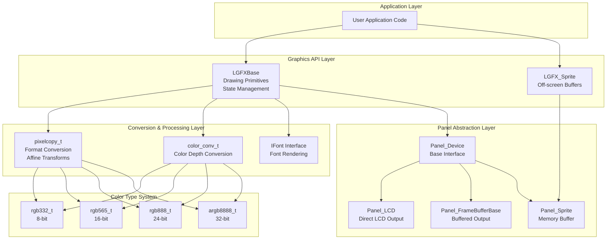
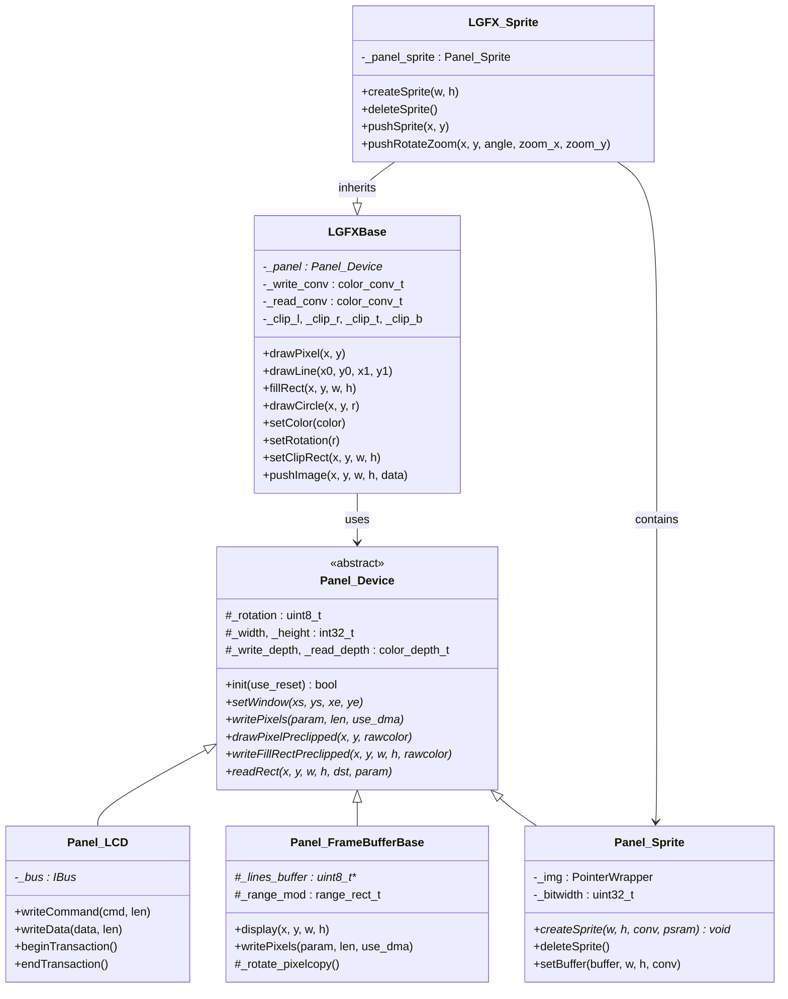
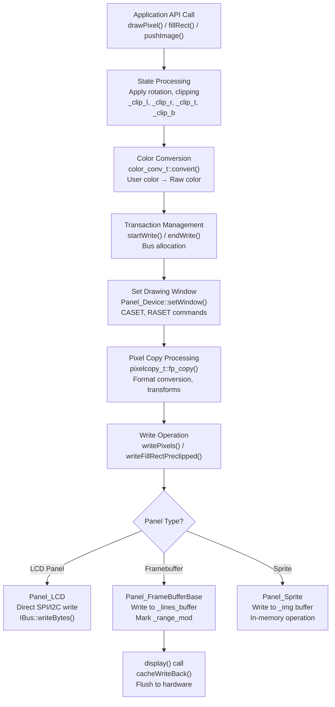
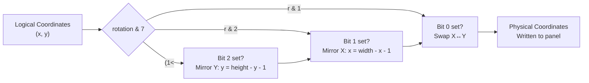
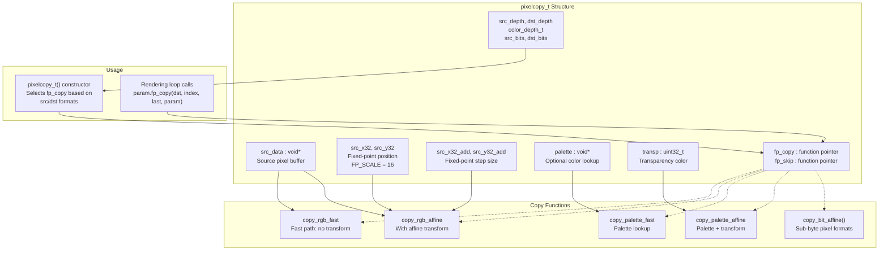
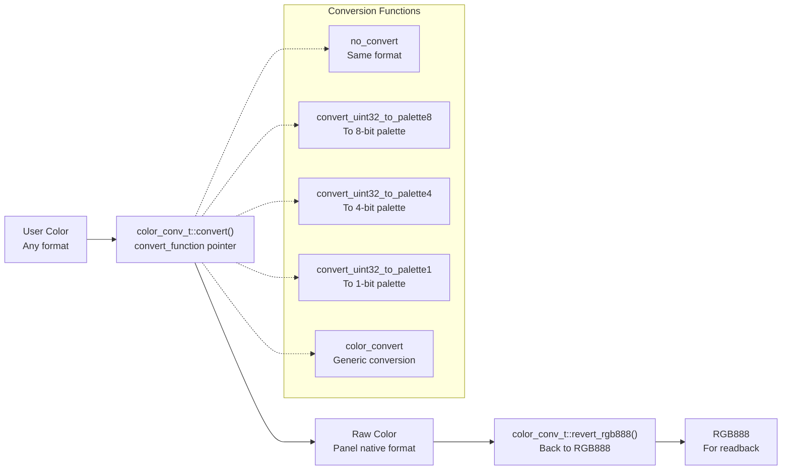

M5GFX LovyanGFX Graphics Core

# LovyanGFX Graphics Core

<details>
<summary>Relevant source files</summary>

The following files were used as context for generating this wiki page:

- [src/lgfx/v1/LGFXBase.cpp](src/lgfx/v1/LGFXBase.cpp)
- [src/lgfx/v1/LGFXBase.hpp](src/lgfx/v1/LGFXBase.hpp)
- [src/lgfx/v1/LGFX_Sprite.cpp](src/lgfx/v1/LGFX_Sprite.cpp)
- [src/lgfx/v1/misc/colortype.hpp](src/lgfx/v1/misc/colortype.hpp)
- [src/lgfx/v1/misc/pixelcopy.cpp](src/lgfx/v1/misc/pixelcopy.cpp)
- [src/lgfx/v1/misc/pixelcopy.hpp](src/lgfx/v1/misc/pixelcopy.hpp)
- [src/lgfx/v1/panel/Panel_FrameBufferBase.cpp](src/lgfx/v1/panel/Panel_FrameBufferBase.cpp)
- [src/lgfx/v1/panel/Panel_FrameBufferBase.hpp](src/lgfx/v1/panel/Panel_FrameBufferBase.hpp)

</details>


## Purpose and Scope

LovyanGFX is the foundational graphics library upon which M5GFX is built. This page provides an overview of the core graphics architecture, class hierarchy, and rendering pipeline. LovyanGFX provides hardware-agnostic drawing primitives, color management, text rendering, and image operations that work consistently across different display technologies.

For device-specific implementations that use LovyanGFX, see [M5GFX Device Classes](#2). For detailed information about specific subsystems, see:
- Drawing operations: [LGFXBase Graphics Operations](#3.1)
- Color handling: [Color Types and Conversion](#3.2)
- Image transformations: [Pixel Copy and Transformation](#3.3)
- Off-screen rendering: [Sprite and Off-Screen Buffers](#3.4)
- Text output: [Font Rendering System](#3.5)

## Core Architecture

LovyanGFX implements a three-layer architecture that separates graphics operations from hardware-specific panel implementations:



**Sources:** [src/lgfx/v1/LGFXBase.hpp:56-60](), [src/lgfx/v1/misc/pixelcopy.hpp:30-87](), [src/lgfx/v1/misc/colortype.hpp:63-71](), [src/lgfx/v1/LGFX_Sprite.cpp:1-20]()

## Class Hierarchy

The LovyanGFX class hierarchy separates concerns between graphics operations, state management, and hardware access:



**Sources:** [src/lgfx/v1/LGFXBase.hpp:56-330](), [src/lgfx/v1/panel/Panel_FrameBufferBase.hpp:29-76](), [src/lgfx/v1/LGFX_Sprite.cpp:36-86]()

## Graphics Rendering Pipeline

Every drawing operation in LovyanGFX flows through a multi-stage pipeline that handles coordinate transformation, clipping, color conversion, and hardware output:



**Sources:** [src/lgfx/v1/LGFXBase.cpp:158-213](), [src/lgfx/v1/panel/Panel_FrameBufferBase.cpp:172-234](), [src/lgfx/v1/LGFX_Sprite.cpp:127-164]()

## State Management

`LGFXBase` maintains rendering state that affects all drawing operations:

| State Variable | Type | Purpose | Modified By |
|---------------|------|---------|-------------|
| `_panel` | `Panel_Device*` | Target output device | Constructor |
| `_rotation` | `uint_fast8_t` | Screen rotation (0-7) | `setRotation()` |
| `_clip_l, _clip_r, _clip_t, _clip_b` | `int32_t` | Clipping rectangle | `setClipRect()`, `clearClipRect()` |
| `_sx, _sy, _sw, _sh` | `int32_t` | Scroll rectangle | `setScrollRect()`, `clearScrollRect()` |
| `_color` | `color_t` | Current drawing color | `setColor()`, `setRawColor()` |
| `_base_rgb888` | `uint32_t` | Base color for clear operations | `setBaseColor()` |
| `_write_conv` | `color_conv_t` | Write color converter | `setColorDepth()` |
| `_read_conv` | `color_conv_t` | Read color converter | `setColorDepth()` |
| `_xpivot, _ypivot` | `float` | Rotation pivot point | `setPivot()` |

**Sources:** [src/lgfx/v1/LGFXBase.hpp:116-330](), [src/lgfx/v1/LGFXBase.cpp:52-157]()

### Rotation Handling

Rotation is applied at multiple levels in the rendering pipeline. The rotation value is a 3-bit value where:
- Bits 0-1: Rotation angle (0=0°, 1=90°, 2=180°, 3=270°)
- Bit 2: Mirror flag

The rotation transformation is handled differently depending on the operation:



**Sources:** [src/lgfx/v1/LGFXBase.cpp:59-64](), [src/lgfx/v1/panel/Panel_FrameBufferBase.cpp:186-207](), [src/lgfx/v1/LGFX_Sprite.cpp:127-164]()

## Pixel Copy System

The `pixelcopy_t` structure is the heart of LovyanGFX's format conversion and transformation system. It uses function pointers to achieve efficient pixel-format conversion without virtual function overhead:



**Sources:** [src/lgfx/v1/misc/pixelcopy.hpp:30-87](), [src/lgfx/v1/misc/pixelcopy.cpp:27-84]()

### Fixed-Point Arithmetic

All coordinate transformations use fixed-point arithmetic with `FP_SCALE = 16`, meaning coordinates are stored as `(integer_part << 16) | fractional_part`. This allows sub-pixel positioning for smooth scaling and rotation without floating-point operations:

```cpp
// From pixelcopy.hpp:32
static constexpr uint32_t FP_SCALE = 16;

// Example: x=10.5 is stored as (10 << 16) | (0.5 * 65536) = 655360 + 32768 = 688128
// Extract integer part: src_x = src_x32 >> FP_SCALE
// Extract fractional part: src_x_lo = src_x32 & 0xFFFF
```

**Sources:** [src/lgfx/v1/misc/pixelcopy.hpp:32-56](), [src/lgfx/v1/misc/pixelcopy.hpp:244-264]()

## Color Type System

LovyanGFX defines strongly-typed color structures for different bit depths, each providing conversion methods and bit-field access:

| Type | Bits | Encoding | Usage |
|------|------|----------|-------|
| `rgb332_t` | 8 | 3R:3G:2B | Low-memory displays |
| `rgb565_t` | 16 | 5R:6G:5B (native) | Most LCD panels |
| `swap565_t` | 16 | 5R:6G:5B (byte-swapped) | SPI displays |
| `rgb888_t` | 24 | 8R:8G:8B | True color |
| `bgr888_t` | 24 | 8B:8G:8R | BGR order |
| `argb8888_t` | 32 | 8A:8R:8G:8B | Alpha channel |
| `bgr666_t` | 24 | 6B:6G:6R (aligned) | OLED displays |
| `grayscale_t` | 8 | Grayscale | Monochrome |

Each type provides methods for extracting RGB components:
- `R8()`, `G8()`, `B8()`: Extract 8-bit components
- `R6()`, `G6()`, `B6()`: Extract 6-bit components
- `A8()`: Extract alpha channel (if present)
- `set(r, g, b)`: Set color from components
- `get()`: Get raw value

**Sources:** [src/lgfx/v1/misc/colortype.hpp:63-425](), [src/lgfx/v1/misc/colortype.hpp:42-56]()

## Color Conversion System

The `color_conv_t` structure manages color depth conversion between user-specified colors and panel native formats:



**Sources:** [src/lgfx/v1/misc/colortype.hpp:42-56](), [src/lgfx/v1/LGFXBase.cpp:52-57]()

## Drawing Primitives

`LGFXBase` provides a comprehensive set of drawing primitives, optimized for different scenarios:

### Basic Shapes
- **Lines**: `drawLine()`, `drawFastHLine()`, `drawFastVLine()` - Bresenham algorithm with clipping [src/lgfx/v1/LGFXBase.cpp:513-589]()
- **Rectangles**: `drawRect()`, `fillRect()` - Optimized for axis-aligned rectangles [src/lgfx/v1/LGFXBase.cpp:198-228]()
- **Circles**: `drawCircle()`, `fillCircle()` - Midpoint circle algorithm [src/lgfx/v1/LGFXBase.cpp:230-340]()
- **Ellipses**: `drawEllipse()`, `fillEllipse()` - Optimized for horizontal/vertical axis [src/lgfx/v1/LGFXBase.cpp:342-434]()
- **Triangles**: `drawTriangle()`, `fillTriangle()` - Scanline filling [src/lgfx/v1/LGFXBase.cpp:600-682]()
- **Rounded Rectangles**: `drawRoundRect()`, `fillRoundRect()` - Combined circle and line drawing [src/lgfx/v1/LGFXBase.cpp:436-511]()

### Advanced Features
- **Bezier Curves**: `drawBezier()` - Quadratic and cubic curves [src/lgfx/v1/LGFXBase.cpp:684-828]()
- **Arcs**: `drawArc()`, `fillArc()`, `drawEllipseArc()`, `fillEllipseArc()` - Partial circles/ellipses [src/lgfx/v1/LGFXBase.cpp:1198-1440]()
- **Gradients**: `fill_rect_gradient()`, `draw_gradient_line()`, `draw_gradient_wedgeline()` - Linear and radial gradients [src/lgfx/v1/LGFXBase.cpp:895-1149]()
- **Anti-aliased Shapes**: `fillSmoothRoundRect()`, `fillSmoothCircle()` - Alpha-blended edges [src/lgfx/v1/LGFXBase.cpp:1154-1196]()

**Sources:** [src/lgfx/v1/LGFXBase.cpp:158-1440](), [src/lgfx/v1/LGFXBase.hpp:158-298]()

## Image Operations

LovyanGFX provides flexible image rendering with support for various formats, transformations, and transparency:

### Image Push Methods

| Method | Description | Key Features |
|--------|-------------|--------------|
| `pushImage()` | Simple image blit | Fast path for format-matching images |
| `pushImageRotateZoom()` | Scaled rotation | Fixed-point affine transform |
| `pushImageAffine()` | Full affine transform | Arbitrary 2D transforms |
| `pushImageRotateZoomWithAA()` | Anti-aliased scaling | Sub-pixel sampling |

### Bitmap Methods
- `drawBitmap()` - Monochrome bitmaps with foreground/background colors
- `drawXBitmap()` - X11 bitmap format (bit-reversed)

### Image Decoding
LovyanGFX integrates with external decoders:
- **JPEG**: TJpgDec library
- **PNG**: Pngle library  
- **BMP**: Built-in decoder
- **QOI**: Quite OK Image format

**Sources:** [src/lgfx/v1/LGFXBase.hpp:400-445](), [src/lgfx/v1/LGFXBase.cpp:19-30]()

## Transaction Management

LovyanGFX uses transaction management to optimize bus usage and enable batch operations:

```cpp
// startWrite() acquires the bus and may begin a transaction
startWrite();

// Multiple operations without bus reacquisition
drawPixel(10, 10);
fillRect(20, 20, 50, 50);
pushImage(0, 0, 100, 100, imageData);

// endWrite() releases the bus
// For EPD panels, this triggers the actual display update
endWrite();
```

For buffered displays (`Panel_FrameBufferBase`), the `display()` method is automatically called on `endWrite()` when `_auto_display` is enabled, flushing the modified region to hardware.

**Sources:** [src/lgfx/v1/LGFXBase.hpp:132-142](), [src/lgfx/v1/panel/Panel_FrameBufferBase.cpp:74-93]()

## Panel Device Abstraction

The `Panel_Device` base class defines the interface that all panel implementations must provide:

### Core Methods
- `init(bool use_reset)` - Initialize the panel hardware
- `setWindow(xs, ys, xe, ye)` - Set the active drawing window
- `writePixels(param, len, use_dma)` - Write a stream of pixels
- `writeFillRectPreclipped(x, y, w, h, rawcolor)` - Optimized rectangle fill
- `drawPixelPreclipped(x, y, rawcolor)` - Single pixel write
- `readRect(x, y, w, h, dst, param)` - Read pixels from display
- `display(x, y, w, h)` - Flush changes to hardware (buffered displays)

### Panel Types

**Panel_LCD**: Direct output to LCD controllers via SPI/I2C buses. Commands and data are sent immediately to the display controller.

**Panel_FrameBufferBase**: Maintains a full-screen buffer in memory (`_lines_buffer`). All drawing operations modify the buffer, and `display()` flushes the modified region (`_range_mod`) to hardware. Includes cache writeback for ESP32-S3 PSRAM.

**Panel_Sprite**: Pure in-memory buffer (`_img`) with no hardware backing. Used for off-screen rendering and sprites.

**Sources:** [src/lgfx/v1/panel/Panel_FrameBufferBase.hpp:29-76](), [src/lgfx/v1/panel/Panel_FrameBufferBase.cpp:74-170]()

## Memory Management

LovyanGFX provides flexible memory allocation strategies through the `PointerWrapper` class:

### Allocation Sources
- **DMA Memory**: `MALLOC_CAP_DMA` - Required for DMA transfers on ESP32
- **PSRAM**: External SPIRAM for large buffers
- **Stack**: `alloca()` for temporary buffers
- **Heap**: Standard `malloc()` for general use

### Sprite Memory Allocation

```cpp
// From LGFX_Sprite.cpp:58-86
void* Panel_Sprite::createSprite(int32_t w, int32_t h, color_conv_t* conv, bool psram)
{
    size_t len = h * (_bitwidth * _write_bits >> 3) + std::max(1, _write_bits >> 3);
    
    // Allocate from PSRAM or DMA-capable memory
    _img.reset(len, psram ? AllocationSource::Psram : AllocationSource::Dma);
    
    if (!_img) {
        deleteSprite();
        return nullptr;
    }
    // ...
}
```

For ESP32-S3 with PSRAM, `cacheWriteBack()` ensures cache coherency before DMA operations.

**Sources:** [src/lgfx/v1/LGFX_Sprite.cpp:58-86](), [src/lgfx/v1/panel/Panel_FrameBufferBase.cpp:62-73](), [src/lgfx/v1/panel/Panel_FrameBufferBase.cpp:132-165]()