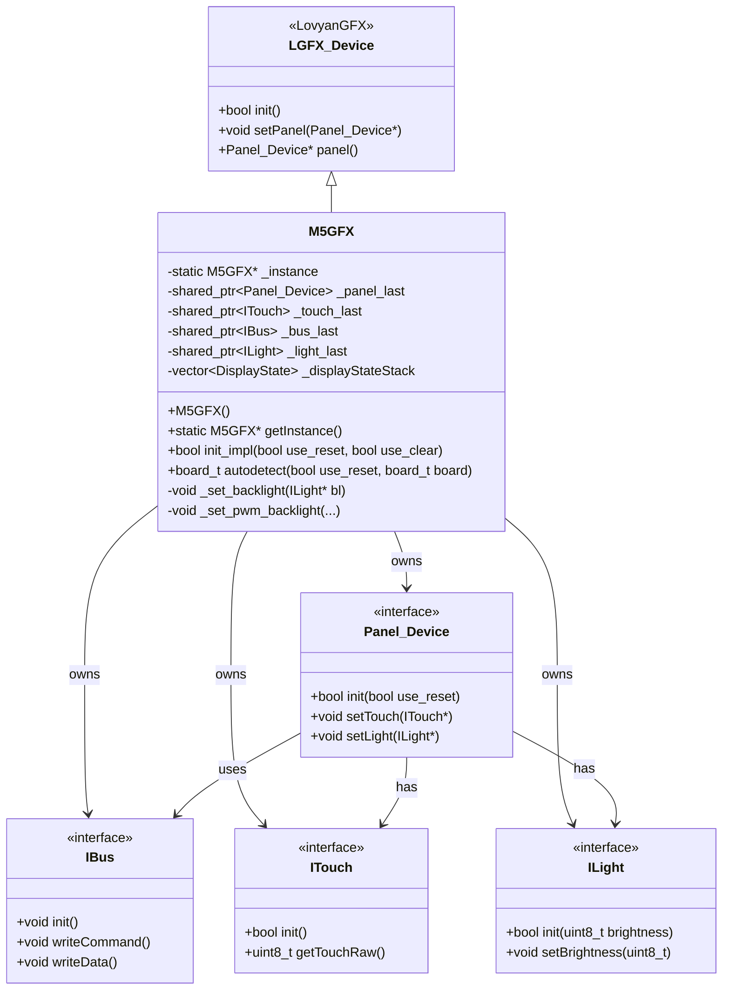
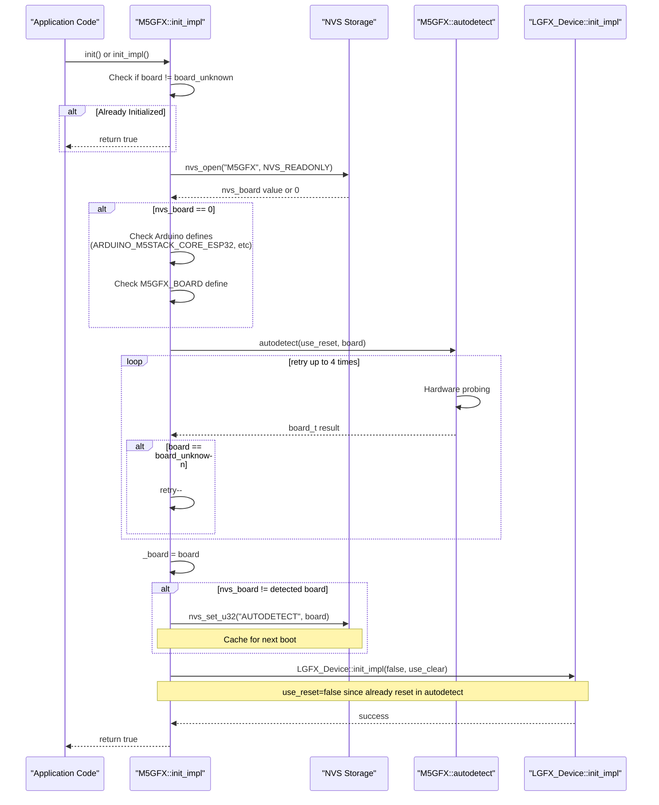
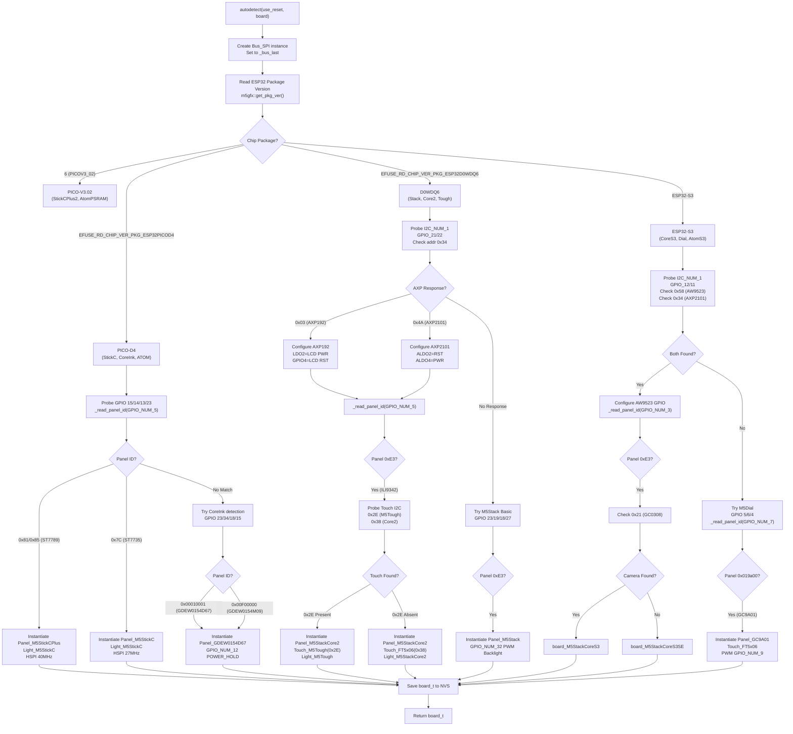
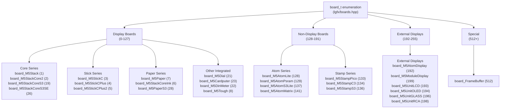
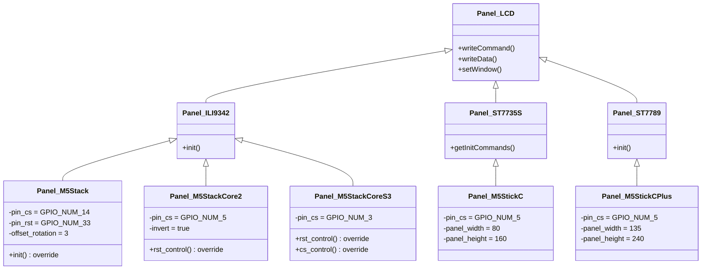

M5GFX M5GFX Class and Board Auto-Detection

# M5GFX Class and Board Auto-Detection

<details>
<summary>Relevant source files</summary>

The following files were used as context for generating this wiki page:

- [src/M5GFX.cpp](src/M5GFX.cpp)
- [src/M5GFX.h](src/M5GFX.h)
- [src/lgfx/boards.hpp](src/lgfx/boards.hpp)

</details>


## Purpose and Scope

This document describes the `M5GFX` class, which serves as the primary interface for M5Stack hardware initialization. The class implements a sophisticated hardware autodetection system that identifies connected display hardware at runtime, eliminating the need for manual pin configuration. This page covers the singleton pattern implementation, the initialization workflow including NVS caching, and the multi-stage autodetection algorithm that uses eFuse package version detection, I2C power management IC probing, and SPI panel ID reading.

For information about specific device configurations detected by this system, see [M5Stack Core and Stick Device Classes](#2.2), [Atom Display Device Classes](#2.3), and [E-Paper Device Detection and Configuration](#2.6). For the underlying graphics operations after initialization, see [LovyanGFX Graphics Core](#3).

---

## M5GFX Class Structure

### Class Hierarchy and Singleton Pattern

The `M5GFX` class inherits from `lgfx::LGFX_Device` and implements a singleton pattern to ensure only one display instance exists per application. The class maintains shared pointers to hardware components that are instantiated during autodetection.

**Diagram: M5GFX Class Structure**



Sources: [src/M5GFX.h:174-274](), [src/M5GFX.cpp:58-63]()

### Member Variables and Resource Management

The class uses `std::shared_ptr` for automatic memory management of dynamically instantiated hardware components:

| Member Variable | Type | Purpose |
|----------------|------|---------|
| `_instance` | `static M5GFX*` | Singleton instance pointer |
| `_panel_last` | `shared_ptr<Panel_Device>` | Current panel driver (ILI9342, ST7789, GC9A01, etc.) |
| `_bus_last` | `shared_ptr<IBus>` | Communication bus (SPI, I2C, or parallel) |
| `_touch_last` | `shared_ptr<ITouch>` | Touch controller driver (FT5x06, GT911, etc.) |
| `_light_last` | `shared_ptr<ILight>` | Backlight controller (PWM, AXP192, etc.) |
| `_displayStateStack` | `vector<DisplayState>` | Stack for push/popState operations |

Sources: [src/M5GFX.h:187-193]()

---

## Initialization Flow and NVS Caching

### init_impl Entry Point

The `init_impl` method serves as the main initialization entry point and implements NVS (Non-Volatile Storage) caching to optimize subsequent boot times.

**Diagram: Initialization Sequence**



Sources: [src/M5GFX.cpp:620-710]()

### NVS Caching Mechanism

The initialization uses NVS to cache the detected board type, significantly reducing boot time on subsequent starts:

1. **First Boot**: Autodetection runs fully, probing I2C buses and reading panel IDs. Result is saved to NVS with key `"AUTODETECT"`.
2. **Subsequent Boots**: Board type is loaded from NVS and used directly, skipping hardware probing.
3. **Cache Invalidation**: If autodetection returns a different board type, the cache is updated.

The NVS namespace is `"M5GFX"` and the key is `"AUTODETECT"`.

Sources: [src/M5GFX.cpp:627-635](), [src/M5GFX.cpp:699-705]()

### Compile-Time Board Hints

If NVS cache is empty, the system checks for Arduino board defines to provide hints:

```cpp
#elif defined ( ARDUINO_M5STACK_CORE_ESP32 ) || defined ( ARDUINO_M5STACK_FIRE )
    nvs_board = board_t::board_M5Stack;
#elif defined ( ARDUINO_M5STACK_CORE2 ) || defined ( ARDUINO_M5STACK_Core2 )
    nvs_board = board_t::board_M5StackCore2;
#elif defined ( ARDUINO_M5STICK_C ) || defined ( ARDUINO_M5Stick_C )
    nvs_board = board_t::board_M5StickC;
```

The `M5GFX_BOARD` macro can also be defined at compile time to force a specific board type.

Sources: [src/M5GFX.cpp:639-676]()

---

## Hardware Autodetection Algorithm

### Multi-Stage Detection Strategy

The `autodetect` method implements a cascading detection strategy that narrows hardware possibilities through multiple stages:

**Diagram: Autodetection Decision Flow**



Sources: [src/M5GFX.cpp:712-2595]()

### Stage 1: ESP32 Package Version Detection

The first stage reads the eFuse register to determine the ESP32 chip package type, which narrows the possible M5Stack devices:

```cpp
std::uint32_t pkg_ver = m5gfx::get_pkg_ver();
```

Key package versions:
- `EFUSE_RD_CHIP_VER_PKG_ESP32PICOD4` → M5StickC, M5StickCPlus, M5StackCoreInk, M5Atom variants
- `EFUSE_RD_CHIP_VER_PKG_ESP32D0WDQ6` → M5Stack Basic, M5StackCore2, M5Tough, M5Station
- `6` (PICOV3_02) → M5StickCPlus2, M5AtomPSRAM
- ESP32-S3 variants → M5StackCoreS3, M5Dial, M5AtomS3, M5PaperS3

Sources: [src/M5GFX.cpp:733-736](), [src/M5GFX.cpp:881-882](), [src/M5GFX.cpp:1249-1251]()

### Stage 2: I2C Power Management IC Probing

For devices with power management ICs, the system probes I2C buses to detect specific PMIC addresses:

**I2C Probing Table**

| PMIC | I2C Address | Register | Expected Value | Devices |
|------|-------------|----------|----------------|---------|
| AXP192 | 0x34 | 0x03 | 0x03 | M5Stack Core2, M5Tough, M5StickC/Plus |
| AXP2101 | 0x34 | 0x03 | 0x4A | M5Stack Core2 v1.1 |
| AW9523B | 0x58 | 0x10 | 0x23 | M5Stack CoreS3 (GPIO expander) |
| GC0308 | 0x21 | 0x00 | 0x9B | Camera module (CoreS3 vs CoreS3SE) |

Sources: [src/M5GFX.cpp:78-83](), [src/M5GFX.cpp:346-353](), [src/M5GFX.cpp:891-905](), [src/M5GFX.cpp:1261-1265]()

### Stage 3: SPI Panel ID Reading

The `_read_panel_id` function sends an SPI command to read the display controller's identification register:

```cpp
static std::uint32_t _read_panel_id(lgfx::Bus_SPI* bus, std::int32_t pin_cs, 
                                     std::uint32_t cmd = 0x04, std::uint8_t dummy_read_bit = 1)
```

The function:
1. Begins SPI transaction
2. Sends `cmd` (default 0x04 = RDDID command)
3. Reads 32-bit response with optional dummy bits
4. Returns panel ID for matching

**Panel ID Mapping**

| Panel ID | Controller | Devices |
|----------|-----------|---------|
| `0xE3` | ILI9342 | M5Stack Basic, Core2, Tough, CoreS3 |
| `0x7C` | ST7735 | M5StickC |
| `0x81` or `0x85` | ST7789 | M5StickCPlus, M5StickCPlus2, M5DinMeter |
| `0x019A00` | GC9A01 | M5Dial (240x240 round display) |
| `0x00010001` | GDEW0154D67 | CoreInk e-paper |
| `0x00F00000` | GDEW0154M09 | CoreInk e-paper (newer lot) |

Sources: [src/M5GFX.cpp:583-598](), [src/M5GFX.cpp:749-779](), [src/M5GFX.cpp:1020-1094](), [src/M5GFX.cpp:1353-1376]()

### Stage 4: Device-Specific Configuration Instantiation

Once a device is identified, the system instantiates panel, bus, touch, and light drivers with device-specific configurations:

**Example: M5Stack CoreS3 Instantiation**

```cpp
// Panel configuration
auto p = new Panel_M5StackCoreS3();
p->bus(bus_spi);
_panel_last.reset(p);

// Backlight via AXP2101
_set_backlight(new Light_M5StackCoreS3());

// Touch controller
auto t = new Touch_M5StackCoreS3();
_touch_last.reset(t);
_panel_last->touch(t);
```

Each device has custom configurations for:
- GPIO pin assignments (CS, RST, DC, MOSI, MISO, SCLK)
- SPI frequencies (write/read speeds)
- Display offsets and rotation
- Backlight control method (PWM, I2C register, GPIO expander)
- Touch controller type and I2C parameters

Sources: [src/M5GFX.cpp:1319-1330](), [src/M5GFX.cpp:759-777](), [src/M5GFX.cpp:1027-1091]()

---

## Board Type Enumeration

### board_t Enum Definition

The `board_t` enum in `lgfx::boards` namespace defines all supported hardware variants:

**Diagram: Board Type Categories**



Sources: [src/lgfx/boards.hpp:1-81]()

### Board Number Ranges

The enum uses specific numeric ranges to categorize boards:

| Range | Category | Purpose |
|-------|----------|---------|
| 0 | `board_unknown` | Unidentified or uninitialized |
| 1-127 | Integrated displays | M5Stack devices with built-in screens |
| 128-191 | Non-display boards | M5Stack devices without displays |
| 192-255 | External displays | Modular display units and output devices |
| 512+ | Special types | Virtual displays like framebuffers |

The numeric values must remain stable to maintain NVS cache compatibility across firmware versions.

Sources: [src/lgfx/boards.hpp:8-76]()

---

## Hardware Component Instantiation

### Panel-Specific Classes

Each device type has a custom panel class that extends base panel drivers:

**Panel Class Hierarchy for M5Stack Devices**



Sources: [src/M5GFX.cpp:85-110](), [src/M5GFX.cpp:112-130](), [src/M5GFX.cpp:355-389](), [src/M5GFX.cpp:279-304](), [src/M5GFX.cpp:331-343]()

### Backlight Controller Instantiation

Backlight control varies by device and is implemented through the `ILight` interface:

**Backlight Implementation Methods**

| Device | Implementation | Control Method |
|--------|---------------|----------------|
| M5Stack Basic | `Light_PWM` | GPIO_NUM_32, PWM channel 7, 44.1kHz |
| M5Stack Core2 (AXP192) | `Light_M5StackCore2` | AXP192 reg 0x27 (DC3), I2C control |
| M5Stack Core2 (AXP2101) | `Light_M5StackCore2_AXP2101` | AXP2101 reg 0x96 (BLDO1), I2C control |
| M5Stack CoreS3 | `Light_M5StackCoreS3` | AXP2101 reg 0x99 (DLDO1), I2C control |
| M5Stack Tough | `Light_M5Tough` | AXP192 reg 0x28 (LDO3), I2C control |
| M5StickC/Plus | `Light_M5StickC` | AXP192 reg 0x28, I2C control |
| M5Dial | `Light_PWM` | GPIO_NUM_9, PWM channel 7, 44.1kHz |

The `_set_backlight` and `_set_pwm_backlight` helper methods configure the appropriate controller:

```cpp
void M5GFX::_set_pwm_backlight(std::int16_t pin, std::uint8_t ch, 
                                std::uint32_t freq, bool invert, uint8_t offset)
{
    auto bl = new lgfx::Light_PWM();
    auto cfg = bl->config();
    cfg.pin_bl = pin;
    cfg.freq = freq;
    cfg.pwm_channel = ch;
    cfg.offset = offset;
    cfg.invert = invert;
    bl->config(cfg);
    _set_backlight(bl);
}
```

Sources: [src/M5GFX.cpp:607-618](), [src/M5GFX.cpp:132-154](), [src/M5GFX.cpp:156-179](), [src/M5GFX.cpp:425-448](), [src/M5GFX.cpp:181-205](), [src/M5GFX.cpp:306-329](), [src/M5GFX.cpp:1131](), [src/M5GFX.cpp:1376]()

### Touch Controller Configuration

Touch controllers are instantiated based on device requirements:

**Touch Controller Instantiation Examples**

```cpp
// M5Stack Core2 - FT5x06
auto t = new lgfx::Touch_FT5x06();
auto cfg = t->config();
cfg.pin_int  = GPIO_NUM_39;
cfg.pin_sda  = GPIO_NUM_21;
cfg.pin_scl  = GPIO_NUM_22;
cfg.i2c_addr = 0x38;
cfg.i2c_port = I2C_NUM_1;
cfg.freq = 400000;
cfg.x_min = 0; cfg.x_max = 319;
cfg.y_min = 0; cfg.y_max = 279;

// M5Stack Tough - Custom Touch_M5Tough
auto t = new Touch_M5Tough();
cfg.i2c_addr = 0x2E;  // Different address than Core2

// M5Stack CoreS3 - Custom Touch_M5StackCoreS3
auto t = new Touch_M5StackCoreS3();
cfg.pin_int = GPIO_NUM_21;
cfg.i2c_addr = 0x38;
```

The custom touch classes handle device-specific quirks like interrupt clearing for GPIO expanders (AW9523B on CoreS3).

Sources: [src/M5GFX.cpp:1049-1067](), [src/M5GFX.cpp:1075-1091](), [src/M5GFX.cpp:391-423]()

---

## GPIO Pin Restoration and Backup

### pin_backup_t System

During autodetection, GPIO pins are temporarily reconfigured for probing. The `gpio::pin_backup_t` structure saves and restores pin states:

```cpp
gpio::pin_backup_t backup_pins[] = { GPIO_NUM_5, GPIO_NUM_13, GPIO_NUM_14, GPIO_NUM_15 };
// ... configure pins for SPI probing ...
bus_spi->init();
id = _read_panel_id(bus_spi, GPIO_NUM_5);
// ... check result ...
bus_spi->release();
for (auto pin: backup_pins) { pin.restore(); }  // Restore original pin states
```

This ensures that failed detection attempts don't leave pins in incorrect states that could interfere with subsequent probes.

Sources: [src/M5GFX.cpp:740](), [src/M5GFX.cpp:781](), [src/M5GFX.cpp:786](), [src/M5GFX.cpp:829]()

### Reset and Power Control Helper Functions

Utility functions handle common reset and power sequencing:

```cpp
// Reset control with optional reset pulse
static void _pin_reset(std::int_fast16_t pin, bool use_reset)
{
    lgfx::gpio_hi(pin);
    lgfx::pinMode(pin, lgfx::pin_mode_t::output);
    lgfx::delay(1);
    if (!use_reset) return;
    lgfx::gpio_lo(pin);
    lgfx::delay(2);
    lgfx::gpio_hi(pin);
    lgfx::delay(10);
}

// Set pin to specific level
static void _pin_level(std::int_fast16_t pin, bool level)
{
    lgfx::pinMode(pin, lgfx::pin_mode_t::output);
    if (level) lgfx::gpio_hi(pin);
    else       lgfx::gpio_lo(pin);
}
```

These functions are used for LCD reset pins, power hold pins (CoreInk GPIO_NUM_12, StickCPlus2 GPIO_NUM_4), and other control signals.

Sources: [src/M5GFX.cpp:540-550](), [src/M5GFX.cpp:532-537]()

---

## SD Card SPI Mode Initialization

### _set_sd_spimode Function

The autodetection system includes SD card initialization to prevent conflicts with display SPI communication:

```cpp
static void _set_sd_spimode(int spi_host, int_fast16_t pin_cs)
{
    m5gfx::spi::beginTransaction(spi_host, 400000, 0);
    _send_sd_dummy_clock(spi_host, pin_cs);
    
    uint8_t sd_cmd58[] = { 0x7A, 0, 0, 0, 0, 0xFD, 0xFF, 0xFF }; // READ_OCR
    m5gfx::spi::readBytes(spi_host, sd_cmd58, sizeof(sd_cmd58));
    
    if (sd_cmd58[6] == sd_cmd58[7])  // Not in SPI mode
    {
        _send_sd_dummy_clock(spi_host, pin_cs);
        static constexpr uint8_t sd_cmd0[] = { 0x40, 0, 0, 0, 0, 0x95, 0xFF, 0xFF }; // GO_IDLE_STATE
        m5gfx::spi::writeBytes(spi_host, sd_cmd0, sizeof(sd_cmd0));
    }
    _pin_level(pin_cs, true);
    m5gfx::spi::endTransaction(spi_host);
}
```

This sends dummy clock pulses and SPI mode commands to SD cards before panel ID reading. Called for devices with SD card slots (M5Stack Basic, Core2, CoreS3).

Sources: [src/M5GFX.cpp:552-580](), [src/M5GFX.cpp:1018](), [src/M5GFX.cpp:1116](), [src/M5GFX.cpp:1159](), [src/M5GFX.cpp:1302]()

---

## Platform-Specific Detection Differences

### ESP32 vs ESP32-S3 Differences

The autodetection logic branches based on chip family:

| Feature | ESP32 (Original) | ESP32-S3 |
|---------|-----------------|----------|
| SPI Host | `VSPI_HOST` / `HSPI_HOST` | `SPI2_HOST` / `SPI3_HOST` |
| DMA Channel | Manual assignment (`1`) | `SPI_DMA_CH_AUTO` |
| I2C Default Port | `I2C_NUM_1` | `I2C_NUM_1` |
| Default SDA/SCL | GPIO 21/22 | GPIO 12/11 |
| Package Detection | eFuse CHIP_VER_PKG | eFuse CHIP_VER_PKG |

ESP32-S3 detection includes additional checks for GPIO expanders (AW9523B) and newer power management ICs (AXP2101).

Sources: [src/M5GFX.cpp:727-730](), [src/M5GFX.cpp:1243-1245](), [src/M5GFX.cpp:347-353]()

### SDL Platform (Desktop Simulation)

On SDL platforms, autodetection is bypassed and a `Panel_sdl` is instantiated directly without hardware probing. The entire autodetection code is conditionally compiled out:

```cpp
#if defined ( ESP_PLATFORM )
    // ... full autodetection logic ...
#else
    #include "lgfx/v1/platforms/sdl/Panel_sdl.hpp"
    // No autodetection on SDL
#endif
```

Sources: [src/M5GFX.cpp:6](), [src/M5GFX.cpp:47-52]()

---

## Usage Examples

### Basic Initialization

```cpp
#include <M5GFX.h>

M5GFX display;

void setup() {
    display.init();  // Automatically detects hardware and configures
    
    display.fillScreen(TFT_BLACK);
    display.setTextSize(2);
    display.setCursor(10, 10);
    display.println("Auto-detected!");
    
    // Query detected board type
    auto board = display.getBoard();
    Serial.printf("Board: %d\n", (int)board);
}
```

### Forcing Specific Board Type

```cpp
M5GFX display;

void setup() {
    // Force M5Stack CoreS3 detection
    display.init(board_t::board_M5StackCoreS3);
}
```

### Accessing Hardware Components

```cpp
M5GFX display;

void setup() {
    display.init();
    
    // Access panel instance
    auto panel = display.panel();
    
    // Get touch controller if available
    auto touch = panel->touch();
    if (touch) {
        touch_point_t tp;
        if (touch->getTouch(&tp)) {
            Serial.printf("Touch: %d, %d\n", tp.x, tp.y);
        }
    }
    
    // Control backlight
    display.setBrightness(128);
}
```

Sources: [src/M5GFX.h:174-274]()

---

## Summary

The M5GFX class provides:

1. **Singleton Management**: Single global display instance via `getInstance()`
2. **NVS Caching**: Fast subsequent boots by caching detected board type
3. **Multi-Stage Autodetection**: 
   - eFuse package version detection
   - I2C PMIC probing (AXP192, AXP2101, AW9523B)
   - SPI panel ID reading (RDDID command)
   - Device-specific configuration instantiation
4. **Hardware Abstraction**: Unified API across 25+ M5Stack device variants
5. **Resource Management**: Smart pointers for automatic cleanup of panel, bus, touch, and light controllers

The autodetection system eliminates manual pin configuration while maintaining compatibility with compile-time board hints and forced board type selection for edge cases.