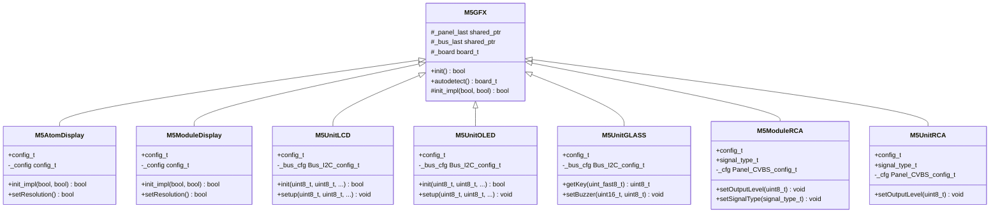
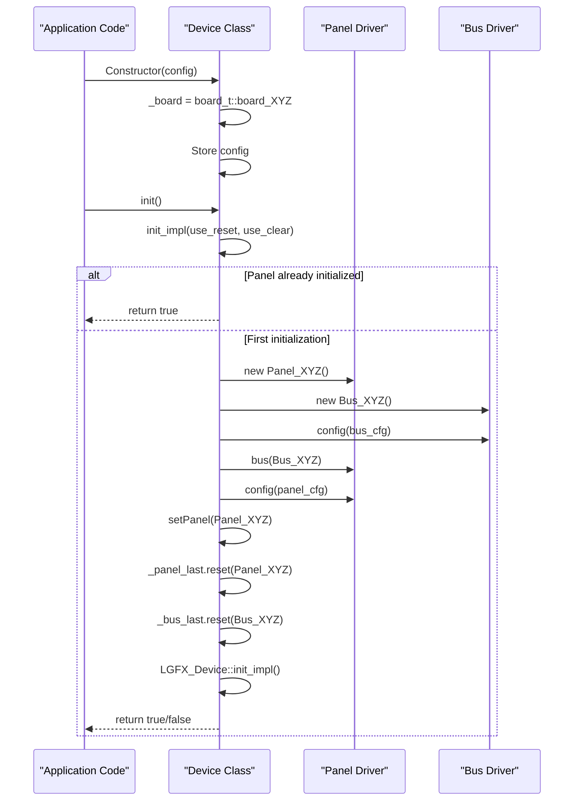
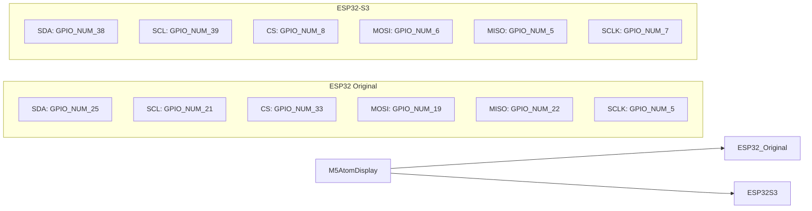

M5GFX M5GFX Device Classes

# M5GFX Device Classes

<details>
<summary>Relevant source files</summary>

The following files were used as context for generating this wiki page:

- [src/M5AtomDisplay.h](src/M5AtomDisplay.h)
- [src/M5GFX.cpp](src/M5GFX.cpp)
- [src/M5GFX.h](src/M5GFX.h)
- [src/M5ModuleDisplay.h](src/M5ModuleDisplay.h)
- [src/M5ModuleRCA.h](src/M5ModuleRCA.h)
- [src/M5UnitGLASS.h](src/M5UnitGLASS.h)
- [src/M5UnitLCD.h](src/M5UnitLCD.h)
- [src/M5UnitOLED.h](src/M5UnitOLED.h)
- [src/M5UnitRCA.h](src/M5UnitRCA.h)
- [src/lgfx/boards.hpp](src/lgfx/boards.hpp)

</details>


## Purpose and Scope

This page provides an overview of M5Stack-specific device classes that enable direct hardware configuration without relying on autodetection. These classes (`M5AtomDisplay`, `M5UnitLCD`, `M5UnitOLED`, etc.) extend the base `M5GFX` class to provide pre-configured display setups for specific M5Stack hardware modules and units.

For information about the autodetection mechanism used by the base `M5GFX` class, see [M5GFX Class and Board Auto-Detection](#2.1). For details on the underlying graphics operations, see [LovyanGFX Graphics Core](#3). For platform-specific implementations, see [Platform Abstraction Layer](#5).

## Device Class Categories

M5GFX device classes are organized into five functional categories based on their display technology and connection method:

**HDMI Output Devices** - External displays connected via FPGA-based HDMI transmitter using SPI and I2C buses. These support programmable resolutions and are used with ATOM series or Core modules.

**I2C Display Units** - Compact display modules connected via I2C protocol. These include LCD panels, OLED displays, and the GLASS unit with integrated buttons and buzzer.

**Composite Video Devices** - Analog video output modules using DAC to generate NTSC/PAL signals. These support configurable output levels and signal types.

**Auto-Detected Core Devices** - Primary M5Stack devices (Core, Core2, CoreS3, StickC, etc.) that use the autodetection system in the base `M5GFX` class rather than dedicated device classes.

**E-Paper Devices** - Low-power e-ink displays (M5Paper, CoreInk) detected through the autodetection system with specific panel ID matching.

Sources: [src/M5GFX.h](), [src/M5AtomDisplay.h](), [src/M5UnitLCD.h](), [src/M5ModuleRCA.h](), [src/lgfx/boards.hpp]()

## Device Class Architecture



**Diagram: Device Class Hierarchy**

All device-specific classes inherit from `M5GFX` and override the `init_impl()` method to instantiate their specific panel and bus configurations. They bypass the autodetection logic in the base class by directly creating panel objects with predetermined settings.

Sources: [src/M5GFX.h:174-274](), [src/M5AtomDisplay.h:56-253](), [src/M5UnitLCD.h:35-186]()

## Device Class to Code Entity Mapping

```mermaid
graph TB
    subgraph "Device Classes"
        M5AtomDisplay["M5AtomDisplay<br/>src/M5AtomDisplay.h"]
        M5ModuleDisplay["M5ModuleDisplay<br/>src/M5ModuleDisplay.h"]
        M5UnitLCD["M5UnitLCD<br/>src/M5UnitLCD.h"]
        M5UnitOLED["M5UnitOLED<br/>src/M5UnitOLED.h"]
        M5UnitGLASS["M5UnitGLASS<br/>src/M5UnitGLASS.h"]
        M5ModuleRCA["M5ModuleRCA<br/>src/M5ModuleRCA.h"]
        M5UnitRCA["M5UnitRCA<br/>src/M5UnitRCA.h"]
    end
    
    subgraph "Panel Drivers"
        Panel_M5HDMI["Panel_M5HDMI<br/>lgfx/v1/panel/Panel_M5HDMI.hpp"]
        Panel_M5UnitLCD["Panel_M5UnitLCD<br/>lgfx/v1/panel/Panel_M5UnitLCD.hpp"]
        Panel_SH110x["Panel_SH110x<br/>lgfx/v1/panel/Panel_SSD1306.hpp"]
        Panel_M5UnitGlass["Panel_M5UnitGlass<br/>lgfx/v1/panel/Panel_M5UnitGLASS.hpp"]
        Panel_CVBS["Panel_CVBS<br/>lgfx/v1/platforms/esp32/Panel_CVBS.hpp"]
    end
    
    subgraph "Bus Drivers"
        Bus_SPI["Bus_SPI"]
        Bus_I2C["Bus_I2C"]
    end
    
    subgraph "Board Enumeration"
        board_M5AtomDisplay["board_M5AtomDisplay = 192"]
        board_M5ModuleDisplay["board_M5ModuleDisplay = 199"]
        board_M5UnitLCD["board_M5UnitLCD = 193"]
        board_M5UnitOLED["board_M5UnitOLED = 194"]
        board_M5UnitGLASS["board_M5UnitGLASS = 196"]
        board_M5ModuleRCA["board_M5ModuleRCA = 200"]
        board_M5UnitRCA["board_M5UnitRCA = 198"]
    end
    
    M5AtomDisplay --> Panel_M5HDMI
    M5AtomDisplay --> Bus_SPI
    M5AtomDisplay --> board_M5AtomDisplay
    
    M5ModuleDisplay --> Panel_M5HDMI
    M5ModuleDisplay --> Bus_SPI
    M5ModuleDisplay --> board_M5ModuleDisplay
    
    M5UnitLCD --> Panel_M5UnitLCD
    M5UnitLCD --> Bus_I2C
    M5UnitLCD --> board_M5UnitLCD
    
    M5UnitOLED --> Panel_SH110x
    M5UnitOLED --> Bus_I2C
    M5UnitOLED --> board_M5UnitOLED
    
    M5UnitGLASS --> Panel_M5UnitGlass
    M5UnitGLASS --> Bus_I2C
    M5UnitGLASS --> board_M5UnitGLASS
    
    M5ModuleRCA --> Panel_CVBS
    M5ModuleRCA --> board_M5ModuleRCA
    
    M5UnitRCA --> Panel_CVBS
    M5UnitRCA --> board_M5UnitRCA
```



**Diagram: Device Classes to Code Entities**

Each device class is responsible for instantiating the appropriate panel driver and bus configuration. The `board_t` enumeration values (defined in [src/lgfx/boards.hpp:8-76]()) are assigned during construction to identify the hardware type.

Sources: [src/lgfx/boards.hpp:63-72](), [src/M5AtomDisplay.h:24](), [src/M5UnitLCD.h:16](), [src/M5ModuleRCA.h:10]()

## Configuration Pattern

All device classes follow a consistent configuration pattern:

### Constructor Configuration

Each class provides both a `config_t` structure and individual parameter constructors:

```cpp
// Structure-based configuration
M5AtomDisplay display(M5AtomDisplay::config_t{
    .logical_width = 1280,
    .logical_height = 720,
    .refresh_rate = 60.0f
});

// Parameter-based configuration
M5UnitLCD lcd(pin_sda, pin_scl, i2c_freq, i2c_port, i2c_addr);
```

### Initialization Flow



**Diagram: Device Class Initialization Sequence**

The `init_impl()` method checks if a panel has already been initialized via `_panel_last.get()`. If not, it creates the appropriate panel and bus objects, configures them, and calls the base class initialization.

Sources: [src/M5AtomDisplay.h:101-250](), [src/M5UnitLCD.h:154-184](), [src/M5UnitOLED.h:157-183]()

### SDL Simulation Support

Most device classes include conditional compilation for SDL-based desktop simulation:

```cpp
#if defined (SDL_h_)
    auto p = new lgfx::Panel_sdl();
    // Configure for simulation
#else
    auto p = new lgfx::Panel_M5UnitLCD();
    // Configure for hardware
#endif
```

This enables development and testing on desktop platforms before deploying to hardware.

Sources: [src/M5AtomDisplay.h:110-124](), [src/M5UnitLCD.h:74-106](), [src/M5ModuleRCA.h:140-173]()

## Device Class Reference Table

| Class Name | Header File | Panel Driver | Bus Type | Board Enum | Display Technology |
|------------|-------------|--------------|----------|------------|-------------------|
| `M5AtomDisplay` | [M5AtomDisplay.h]() | `Panel_M5HDMI` | `Bus_SPI` | `board_M5AtomDisplay` (192) | HDMI via FPGA |
| `M5ModuleDisplay` | [M5ModuleDisplay.h]() | `Panel_M5HDMI` | `Bus_SPI` | `board_M5ModuleDisplay` (199) | HDMI via FPGA |
| `M5UnitLCD` | [M5UnitLCD.h]() | `Panel_M5UnitLCD` | `Bus_I2C` | `board_M5UnitLCD` (193) | ST7789 LCD 135x240 |
| `M5UnitOLED` | [M5UnitOLED.h]() | `Panel_SH110x` | `Bus_I2C` | `board_M5UnitOLED` (194) | SH110x OLED 64x128 |
| `M5UnitGLASS` | [M5UnitGLASS.h]() | `Panel_M5UnitGlass` | `Bus_I2C` | `board_M5UnitGLASS` (196) | SSD1306 OLED 128x64 |
| `M5ModuleRCA` | [M5ModuleRCA.h]() | `Panel_CVBS` | DAC | `board_M5ModuleRCA` (200) | Composite Video |
| `M5UnitRCA` | [M5UnitRCA.h]() | `Panel_CVBS` | DAC | `board_M5UnitRCA` (198) | Composite Video |

Sources: [src/lgfx/boards.hpp:63-72](), [src/M5AtomDisplay.h:56](), [src/M5UnitLCD.h:35](), [src/M5ModuleRCA.h:51]()

## Platform-Specific Pin Configurations

Device classes adapt their pin configurations based on the target platform:

### M5AtomDisplay Pin Mapping



**Diagram: Platform-Specific Pin Configurations for M5AtomDisplay**

The pin assignments are determined at compile-time using `CONFIG_IDF_TARGET_*` preprocessor symbols. ATOM Lite and ATOM Matrix variants (detected via `EFUSE_RD_CHIP_VER_PKG_ESP32PICOD4`) use `GPIO_NUM_23` for SCLK instead of `GPIO_NUM_5`.

Sources: [src/M5AtomDisplay.h:128-168](), [src/M5ModuleDisplay.h:128-177]()

## I2C Configuration Defaults

I2C-based device classes use platform-specific default pins defined via preprocessor macros:

| Macro | Default Value (ESP32) | Default Value (ESP32-S3) | Default Value (ESP32-C6) |
|-------|----------------------|-------------------------|-------------------------|
| `M5GFX_PORTA_DEFAULT_SDA` | 21 (GPIO_NUM_21) | 2 (GPIO_NUM_2) | 2 (GPIO_NUM_2) |
| `M5GFX_PORTA_DEFAULT_SCL` | 22 (GPIO_NUM_22) | 1 (GPIO_NUM_1) | 1 (GPIO_NUM_1) |

These defaults can be overridden by defining the macros before including the header files or by passing explicit pin numbers to the constructor.

Sources: [src/M5GFX.h:17-43](), [src/M5UnitLCD.h:19-24](), [src/M5UnitOLED.h:19-24]()

## Usage Examples

### Basic Initialization Pattern

```cpp
// HDMI display with custom resolution
M5AtomDisplay display(1920, 1080, 60.0f);
display.init();

// I2C LCD with custom pins
M5UnitLCD lcd(GPIO_NUM_21, GPIO_NUM_22, 400000);
lcd.init();

// Composite video with PAL signal
M5ModuleRCA rca;
rca.setup(320, 240, 0, 0, M5ModuleRCA::signal_type_t::PAL);
rca.init();
```

### Advanced Configuration

```cpp
// Using config_t structure
M5AtomDisplay::config_t cfg;
cfg.logical_width = 1280;
cfg.logical_height = 720;
cfg.output_width = 1920;
cfg.output_height = 1080;
cfg.scale_w = 0;  // Auto-scale
cfg.scale_h = 0;  // Auto-scale
cfg.pixel_clock = 74250000;

M5AtomDisplay display(cfg);
display.init();
```

Sources: [src/M5AtomDisplay.h:74-99](), [src/M5UnitLCD.h:117-120](), [src/M5ModuleRCA.h:85-97]()

## When to Use Device Classes vs Autodetection

**Use Device Classes When:**
- Working with external display modules (Units/Modules) not integrated into the main board
- Requiring explicit control over configuration parameters (resolution, I2C address, pins)
- Developing applications for specific known hardware configurations
- Bypassing autodetection for faster initialization or debugging

**Use Autodetection (Base M5GFX) When:**
- Developing applications that should run on multiple M5Stack devices
- Working with integrated displays (M5Stack Core series, StickC series, etc.)
- Prototyping applications where hardware may change
- Leveraging NVS caching for subsequent boot speed optimization

The autodetection mechanism in the base `M5GFX` class is documented in detail in [M5GFX Class and Board Auto-Detection](#2.1).

Sources: [src/M5GFX.cpp:620-710](), [src/M5AtomDisplay.h:101-250](), [src/M5UnitLCD.h:154-184]()