M5GFX M5Stack Core and Stick Device Classes

# M5Stack Core and Stick Device Classes

<details>
<summary>Relevant source files</summary>

The following files were used as context for generating this wiki page:

- [src/M5GFX.cpp](src/M5GFX.cpp)
- [src/M5GFX.h](src/M5GFX.h)
- [src/lgfx/boards.hpp](src/lgfx/boards.hpp)

</details>


This document covers the device-specific panel, backlight, and touch controller classes for M5Stack Core and Stick series devices with integrated displays. These classes implement hardware-specific initialization and control for devices like M5Stack Basic/Core2/CoreS3 and M5Stick C/Plus variants.

For information about the main auto-detection logic, see [M5GFX Class and Board Auto-Detection](#2.1). For external display modules, see [Unit Display Device Classes](#2.4). For e-paper devices like CoreInk and Paper, see [E-Paper Device Classes](#2.6).

---

## Supported Device Families

The Core and Stick device classes support M5Stack's primary form factors with integrated TFT LCD displays. These devices are automatically detected by the M5GFX class based on chip package version, I2C device presence, and panel IDs.

### Device Overview

| Device Family | Board Enum | Panel Controller | Resolution | Touch |
|---------------|------------|------------------|------------|-------|
| M5Stack Basic/Gray/GO/Fire | `board_M5Stack` | ILI9342 | 320×240 | None |
| M5Stack Core2 | `board_M5StackCore2` | ILI9342 | 320×240 | FT5x06 |
| M5Stack Tough | `board_M5Tough` | ILI9342 | 320×240 | Custom |
| M5Stack CoreS3 | `board_M5StackCoreS3` | ILI9342 | 320×240 | FT5x06 |
| M5Stack CoreS3 SE | `board_M5StackCoreS3SE` | ILI9342 | 320×240 | FT5x06 |
| M5Stick C | `board_M5StickC` | ST7735S | 80×160 | None |
| M5Stick C Plus | `board_M5StickCPlus` | ST7789 | 135×240 | None |
| M5Stick C Plus2 | `board_M5StickCPlus2` | ST7789 | 135×240 | None |
| M5Station | `board_M5Station` | ST7789 | 135×240 | None |

Sources: [src/lgfx/boards.hpp:8-34](), [src/M5GFX.cpp:85-343]()

---

## Architecture Overview

The device classes follow a layered architecture where hardware-specific panel, backlight, and touch classes are instantiated during auto-detection and configured for each device's unique hardware characteristics.

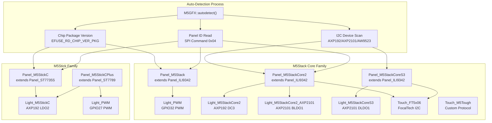

Sources: [src/M5GFX.cpp:620-710](), [src/M5GFX.cpp:712-1240]()

---

## Panel Driver Classes

Panel driver classes inherit from LovyanGFX base panel classes and customize initialization, pin configurations, and control signals for specific M5Stack hardware.

### Panel_M5Stack

The original M5Stack Basic/Gray/GO/Fire panel driver. Uses ILI9342 controller with hardware-specific reset detection and pin configuration.

**Key Characteristics:**
- Pin CS: GPIO14
- Pin RST: GPIO33 (with pull-down detection for hardware variant)
- Rotation offset: 3
- Default rotation: 1 (landscape)
- Invert detection: Tests GPIO33 pull behavior to determine display variant

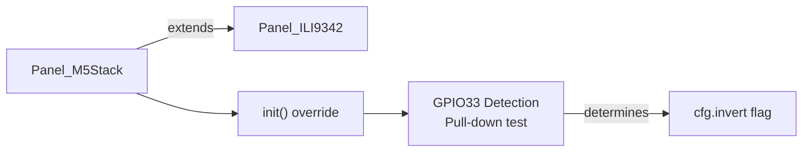

Sources: [src/M5GFX.cpp:85-110]()

**Initialization Logic:**

The `init()` method performs a sophisticated hardware variant detection by testing GPIO33 behavior:
1. Set GPIO33 to output and drive low
2. Change to input with pull-down
3. Drive high and read state
4. Reading determines if display uses inverted color mode

Sources: [src/M5GFX.cpp:96-109]()

### Panel_M5StackCore2

Core2 panel driver supporting both AXP192 (original) and AXP2101 (v1.1) power management ICs. The display reset is controlled via the power IC rather than a direct GPIO connection.

**Key Characteristics:**
- Pin CS: GPIO5
- Reset via: AXP192 GPIO3/4 or AXP2101 ALDO2
- Color inversion: Always true
- Rotation offset: 3
- Default rotation: 1 (landscape)

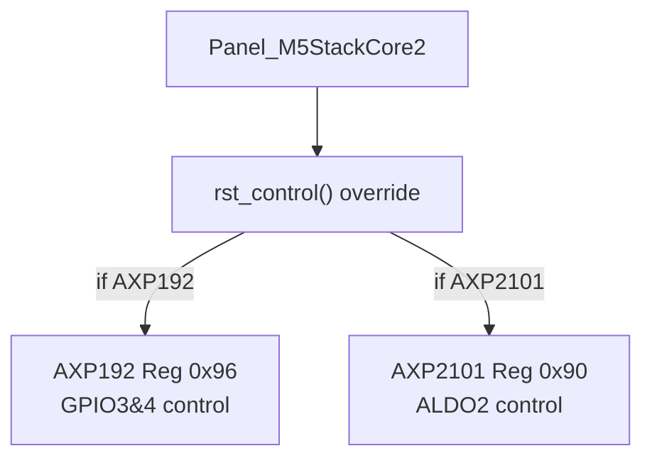

Sources: [src/M5GFX.cpp:112-130]()

**Reset Control:**

The `rst_control()` method writes to I2C register 0x96 of the AXP192 power IC to control the LCD reset line through GPIO3/4 pins:
- Level true: Set bits 2, clear with mask ~0
- Level false: Clear bits, mask ~2

Sources: [src/M5GFX.cpp:123-129]()

### Panel_M5StackCoreS3

CoreS3 panel driver with AW9523B GPIO expander for reset control and shared MISO/DC pin functionality on GPIO35.

**Key Characteristics:**
- Pin CS: GPIO3
- Reset via: AW9523B I2C GPIO expander (bit 5, register 0x03)
- Shared pin: GPIO35 functions as both MISO and D/C
- Pin switching: CS control enables/disables GPIO35 output to switch modes
- Color inversion: Always true
- Rotation offset: 3

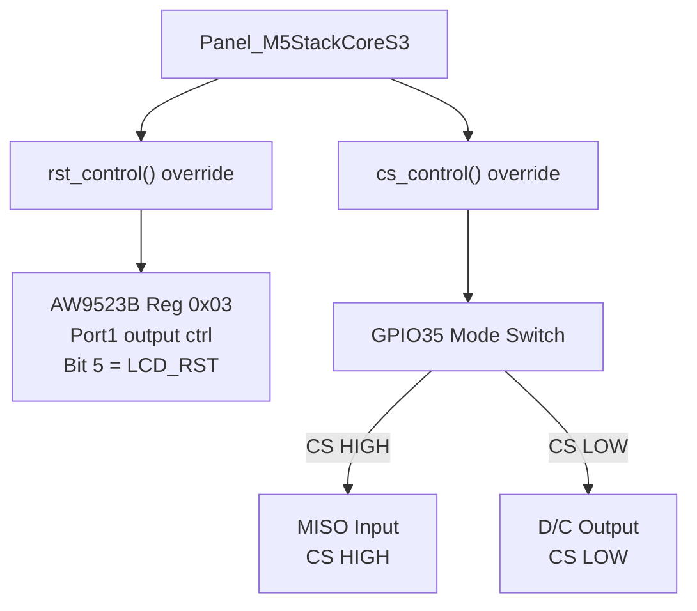

Sources: [src/M5GFX.cpp:355-389]()

**Dual-Function GPIO35:**

CoreS3 uniquely shares GPIO35 between SPI MISO and LCD D/C. The `cs_control()` method manages this by:
- CS HIGH: Disable GPIO35 output, enable MISO function (register GPIO_ENABLE1_W1TC_REG)
- CS LOW: Enable GPIO35 output for D/C function (register GPIO_ENABLE1_W1TS_REG)

Sources: [src/M5GFX.cpp:374-388]()

### Panel_M5StickC

Compact display driver for M5Stick C using ST7735S controller with specific offsets for the small 80×160 panel.

**Key Characteristics:**
- Controller: ST7735S
- Pin CS: GPIO5
- Pin RST: GPIO18
- Resolution: 80×160
- Offset X: 26, Offset Y: 1
- Rotation offset: 2
- Color inversion: True
- Custom gamma: Curve 4

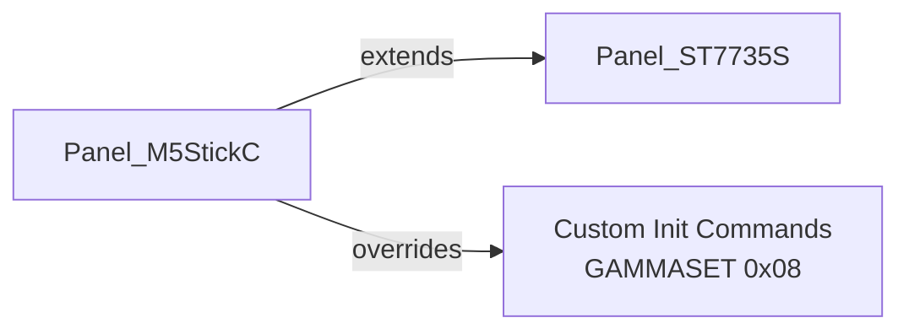

Sources: [src/M5GFX.cpp:279-304]()

**Custom Initialization:**

The `getInitCommands()` override returns a gamma curve setting (0x08 = curve 4) to optimize color rendering for this specific panel variant.

Sources: [src/M5GFX.cpp:295-303]()

### Panel_M5StickCPlus

Display driver for M5Stick C Plus and Plus2 variants using ST7789 controller with 135×240 resolution.

**Key Characteristics:**
- Controller: ST7789
- Pin CS: GPIO5
- Pin RST: GPIO18
- Resolution: 135×240
- Offset X: 52, Offset Y: 40
- Color inversion: True

Sources: [src/M5GFX.cpp:331-343]()

---

## Backlight Control Classes

Backlight control is highly device-specific, using either PWM or I2C power management ICs. All classes implement the `ILight` interface with `init()` and `setBrightness()` methods.

### Light_M5StackCore2 (AXP192)

Controls backlight via AXP192 DC3 voltage regulator. Brightness maps to voltage range with DC3 enable/disable control.

**Register Configuration:**
- Enable/disable: Reg 0x12, bit 0x02
- Voltage setting: Reg 0x27, brightness mapping: `(brightness >> 3) + 72`
- Voltage range: DC3 output with mask 0x80

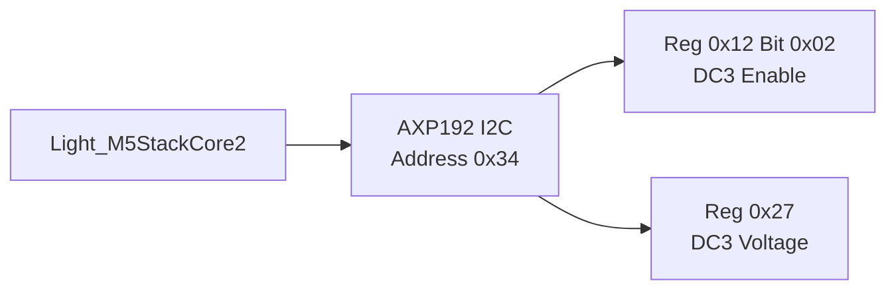

Sources: [src/M5GFX.cpp:132-154]()

### Light_M5StackCore2_AXP2101

Controls backlight via AXP2101 BLDO1 regulator for Core2 v1.1 hardware revision.

**Register Configuration:**
- Enable/disable: Reg 0x90, bit 0x10 (BLDO1 enable)
- Voltage setting: Reg 0x96, brightness mapping: `(brightness + 641) >> 5`
- Voltage range: 0.5V - 3.5V in 100mV steps

Sources: [src/M5GFX.cpp:156-179]()

### Light_M5Tough

Controls backlight via AXP192 LDO3 regulator with different voltage mapping than Core2.

**Register Configuration:**
- Enable/disable: Reg 0x12, bit 0x08 (LDO3 enable)
- Voltage setting: Reg 0x28, brightness mapping: `(brightness / 24) + 5` for brightness > 4
- Mask: 0xF0

Sources: [src/M5GFX.cpp:181-205]()

### Light_M5StackCoreS3

Controls backlight via AXP2101 DLDO1 regulator for CoreS3 hardware.

**Register Configuration:**
- Enable/disable: Reg 0x90, bit 0x80 (DLDO1 enable)
- Voltage setting: Reg 0x99, brightness mapping: `(brightness + 641) >> 5`

Sources: [src/M5GFX.cpp:425-448]()

### Light_M5StickC

Controls backlight via AXP192 LDO2 regulator with non-linear brightness mapping.

**Initialization:**
- I2C port: I2C_NUM_1 (GPIO21 SDA, GPIO22 SCL)
- Power configuration: Reg 0x12 = 0x4D

**Brightness Mapping:**
```
brightness = (((brightness >> 1) + 8) / 13) + 5
```
This creates a non-linear curve optimized for the small display's visual response.

**Register Configuration:**
- Enable/disable: Reg 0x12, bit 0x04 (LDO2 enable)
- Voltage setting: Reg 0x28, shifted brightness << 4, mask 0x0F

Sources: [src/M5GFX.cpp:306-329]()

### PWM Backlight Control

For devices without power management ICs, PWM backlight control is used via `Light_PWM` class configured through `_set_pwm_backlight()`.

**Common PWM Configurations:**

| Device | Pin | Channel | Frequency | Invert | Offset |
|--------|-----|---------|-----------|--------|--------|
| M5Stack Basic | GPIO32 | 7 | 44100 Hz | false | 0 |
| M5StickCPlus2 | GPIO27 | 7 | 256 Hz | false | 40 |
| M5Dial | GPIO9 | 7 | 44100 Hz | false | 0 |
| M5AtomS3 | GPIO16 | 7 | 256 Hz | false | 48 |
| M5DinMeter | GPIO9 | 7 | 256 Hz | false | 16 |
| M5Cardputer | GPIO38 | 7 | 256 Hz | false | 16 |
| M5VAMeter | GPIO38 | 7 | 512 Hz | false | 64 |

Sources: [src/M5GFX.cpp:607-618](), [src/M5GFX.cpp:1131](), [src/M5GFX.cpp:867](), [src/M5GFX.cpp:1376](), [src/M5GFX.cpp:1567](), [src/M5GFX.cpp:1613](), [src/M5GFX.cpp:1721]()

---

## Touch Controller Classes

Touch controllers provide multi-point capacitive touch input with I2C communication.

### Touch_M5StackCoreS3

FT5x06-based touch controller for CoreS3 with AW9523B interrupt handling.

**Configuration:**
- I2C address: 0x38
- Pin INT: GPIO21
- Pin SDA: GPIO12, Pin SCL: GPIO11
- Port: I2C_NUM_1
- Frequency: 400 kHz
- Touch area: 0-319 (X), 0-239 (Y)

**Interrupt Handling:**

The `getTouchRaw()` override clears AW9523B GPIO expander interrupts after reading touch data by reading registers 0x00 and 0x01.

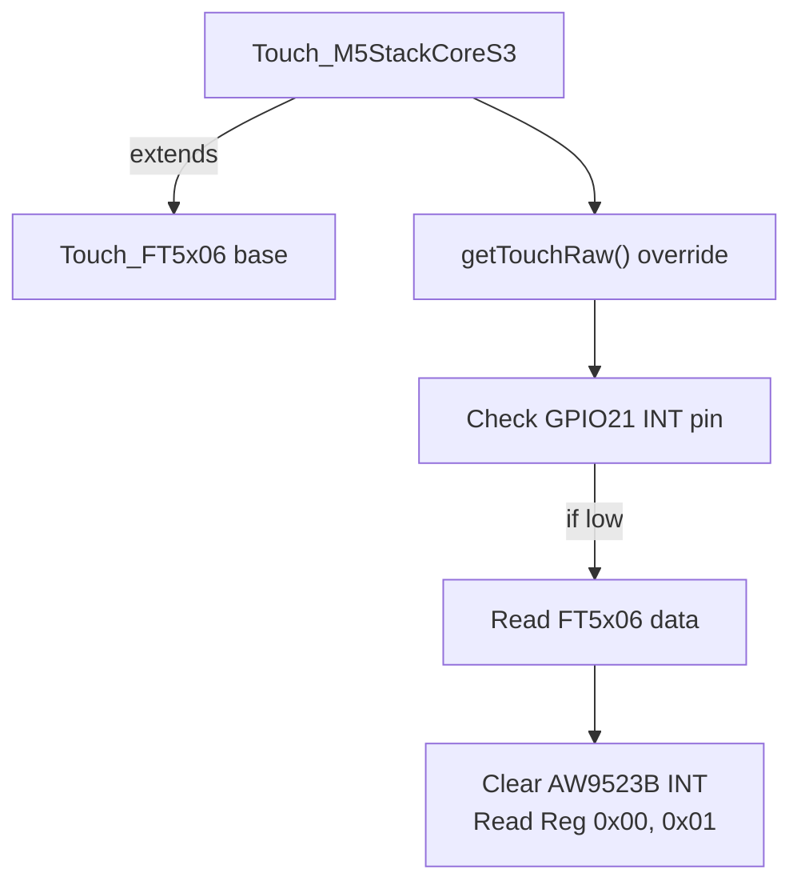

Sources: [src/M5GFX.cpp:391-423]()

### Touch_M5Tough

Custom touch protocol for M5Tough device with multi-point support and retry logic.

**Configuration:**
- I2C address: 0x2E
- Pin INT: GPIO39
- Pin SDA: GPIO21, Pin SCL: GPIO22
- Port: I2C_NUM_1
- Frequency: 400 kHz
- Touch area: 0-319 (X), 0-239 (Y)
- Max points: 2

**Protocol Details:**

The touch controller uses a custom protocol:
1. Check interrupt pin (GPIO39) - return if high
2. Begin I2C transaction to address 0x2E
3. Write register number 2
4. Restart and read 1 byte (touch point count)
5. If count > 0, read 6 bytes per touch point
6. Retry up to 5 times until data stabilizes (two consecutive reads match)
7. Parse touch data: X = (data[0] & 0x0F) << 8 | data[1], Y = (data[2] & 0x0F) << 8 | data[3]

**IRQ Mode Change:**

During initialization, a mode change command `{0x5a, 0x5a}` is sent to configure the interrupt mode.

Sources: [src/M5GFX.cpp:207-277]()

---

## Board Detection Logic

The auto-detection system identifies devices through a multi-stage process using chip package version, I2C probes, and LCD panel ID reads.

### Detection Flow for ESP32 Devices

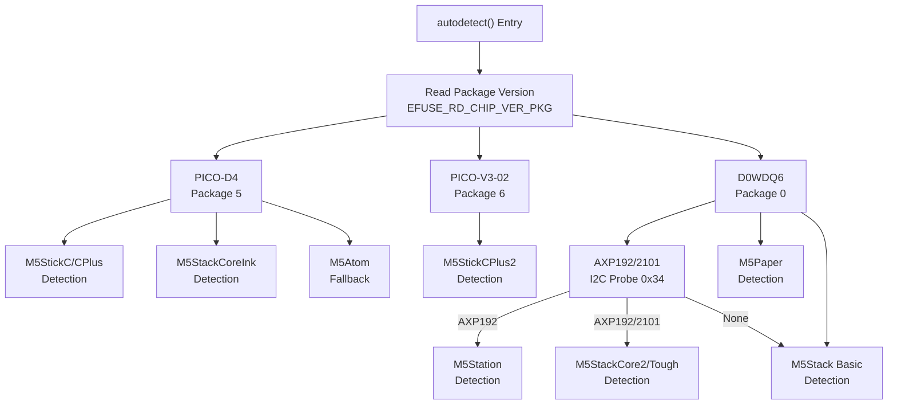

Sources: [src/M5GFX.cpp:712-1240]()

### Detection Flow for ESP32-S3 Devices

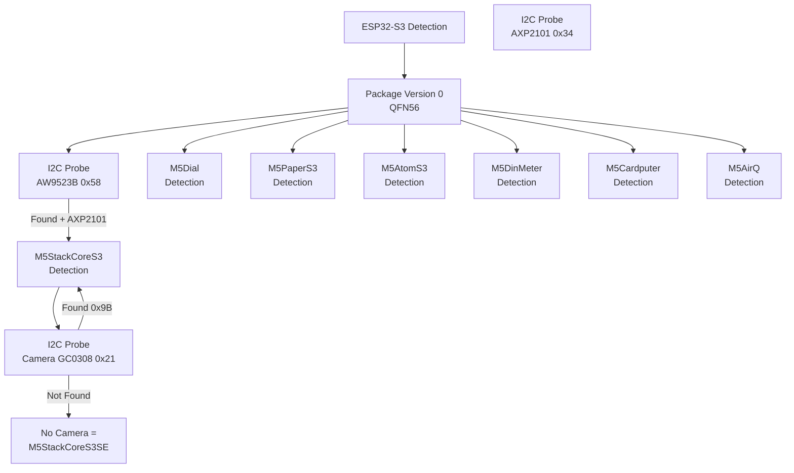

Sources: [src/M5GFX.cpp:1242-1780]()

### Panel ID Reading

Panel identification uses SPI command 0x04 (RDDID) to read a 32-bit identifier from the LCD controller.

**Detection Method:**

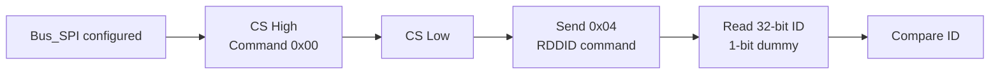

**Common Panel IDs:**
- ILI9342: `(id & 0xFF) == 0xE3`
- ST7789: `(id & 0xFB) == 0x81` (matches 0x81 or 0x85)
- ST7735S: `(id & 0xFF) == 0x7C`
- GC9A01: `(id & 0xFFFFFF) == 0x019A00`
- GC9107: `(id & 0xFFFFFF) == 0x079100`

Sources: [src/M5GFX.cpp:583-598](), [src/M5GFX.cpp:749-779](), [src/M5GFX.cpp:848-869](), [src/M5GFX.cpp:918-942](), [src/M5GFX.cpp:1118-1133](), [src/M5GFX.cpp:1353-1406](), [src/M5GFX.cpp:1543-1570]()

### I2C Device Probing

I2C device presence is used to differentiate hardware variants:

**AXP Power Management:**
- Address 0x34, Register 0x03
- Value 0x03 = AXP192
- Value 0x4A = AXP2101

**GPIO Expander:**
- Address 0x58 (AW9523B), Register 0x10
- Value 0x23 confirms presence

**Camera Module:**
- Address 0x21 (GC0308), Register 0x00
- Value 0x9B confirms camera present (differentiates CoreS3 from CoreS3 SE)

Sources: [src/M5GFX.cpp:883-905](), [src/M5GFX.cpp:1256-1338]()

### SD Card SPI Mode Initialization

Many Core devices share SPI bus with SD card slot. Before LCD detection, the SD card is forced into SPI mode to prevent bus conflicts.

**SD Card Initialization Sequence:**

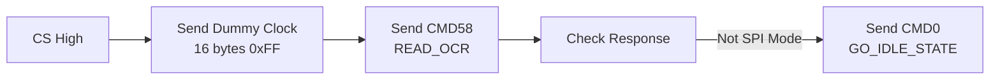

The dummy clock sequence ensures the card powers up and enters idle state, while CMD0 forces SPI mode if the card was in SD mode.

Sources: [src/M5GFX.cpp:552-580](), [src/M5GFX.cpp:1018](), [src/M5GFX.cpp:1116](), [src/M5GFX.cpp:1159](), [src/M5GFX.cpp:1302]()

---

## Hardware Configuration Details

### Pin Assignments by Device

#### M5Stack Basic/Gray/GO/Fire
- **SPI Bus:** VSPI_HOST (GPIO23 MOSI, GPIO19 MISO, GPIO18 SCLK)
- **LCD:** GPIO14 CS, GPIO33 RST, GPIO27 DC
- **SD Card:** GPIO4 CS
- **Backlight:** GPIO32 PWM
- **Power:** No AXP IC

Sources: [src/M5GFX.cpp:1103-1136]()

#### M5Stack Core2
- **SPI Bus:** VSPI_HOST (GPIO23 MOSI, GPIO38 MISO, GPIO18 SCLK)
- **LCD:** GPIO5 CS, GPIO15 DC, AXP192/2101 RST
- **SD Card:** GPIO4 CS
- **Touch:** GPIO39 INT, GPIO21 SDA, GPIO22 SCL, I2C address 0x38
- **Backlight:** AXP192 DC3 or AXP2101 BLDO1
- **Power:** AXP192 (original) or AXP2101 (v1.1) at I2C address 0x34

Sources: [src/M5GFX.cpp:883-1098]()

#### M5Stack Tough
- **SPI Bus:** VSPI_HOST (same as Core2)
- **LCD:** GPIO5 CS, GPIO15 DC, AXP192 RST
- **SD Card:** GPIO4 CS
- **Touch:** GPIO39 INT, GPIO21 SDA, GPIO22 SCL, I2C address 0x2E
- **Backlight:** AXP192 LDO3
- **Power:** AXP192 at I2C address 0x34

Sources: [src/M5GFX.cpp:947-1098]()

#### M5Stack CoreS3
- **SPI Bus:** SPI2_HOST (GPIO37 MOSI, GPIO35 MISO/DC, GPIO36 SCLK)
- **LCD:** GPIO3 CS, AW9523B RST, GPIO35 shared MISO/DC
- **SD Card:** GPIO4 CS
- **Touch:** GPIO21 INT, GPIO12 SDA, GPIO11 SCL, I2C address 0x38
- **Backlight:** AXP2101 DLDO1
- **Power:** AXP2101 at I2C address 0x34
- **GPIO Expander:** AW9523B at I2C address 0x58

Sources: [src/M5GFX.cpp:1254-1339]()

#### M5Stick C
- **SPI Bus:** HSPI_HOST (GPIO15 MOSI, GPIO14 MISO, GPIO13 SCLK)
- **LCD:** GPIO5 CS, GPIO18 RST, GPIO23 DC
- **Backlight:** AXP192 LDO2
- **Power:** AXP192 at I2C address 0x34 (GPIO21 SDA, GPIO22 SCL)

Sources: [src/M5GFX.cpp:738-779]()

#### M5Stick C Plus
- **SPI Bus:** HSPI_HOST (GPIO15 MOSI, GPIO14 MISO, GPIO13 SCLK)
- **LCD:** GPIO5 CS, GPIO18 RST, GPIO23 DC
- **Backlight:** AXP192 LDO2
- **Power:** AXP192 at I2C address 0x34 (GPIO21 SDA, GPIO22 SCL)

Sources: [src/M5GFX.cpp:738-779]()

#### M5Stick C Plus2
- **SPI Bus:** HSPI_HOST (GPIO15 MOSI, GPIO13 SCLK)
- **LCD:** GPIO5 CS, GPIO12 RST, GPIO14 DC
- **Backlight:** GPIO27 PWM
- **Power Hold:** GPIO4 (must be driven high)

Sources: [src/M5GFX.cpp:837-872]()

#### M5Station
- **SPI Bus:** HSPI_HOST (GPIO23 MOSI, GPIO18 SCLK)
- **LCD:** GPIO5 CS, GPIO15 RST, GPIO19 DC
- **Backlight:** AXP192 LDO3 (same as M5Tough)
- **Power:** AXP192 at I2C address 0x34

Sources: [src/M5GFX.cpp:906-945]()

### Power Management IC Registers

#### AXP192 Register Map (ESP32 Original)
- **0x12:** Power enable control (DC1/DC3/LDO2/LDO3)
  - Bit 0x02: DC3 (Core2 backlight)
  - Bit 0x04: LDO2 (StickC backlight)
  - Bit 0x08: LDO3 (Tough/Station backlight)
- **0x27:** DC3 voltage setting (Core2 backlight)
- **0x28:** LDO2/LDO3 voltage setting
- **0x92:** GPIO1 control (M5Tough touch reset)
- **0x94:** GPIO1 output (M5Tough touch reset)
- **0x95:** GPIO4 enable (Core2 LCD reset)
- **0x96:** GPIO4 output (Core2 LCD reset)

Sources: [src/M5GFX.cpp:79-83](), [src/M5GFX.cpp:145-152](), [src/M5GFX.cpp:197-203](), [src/M5GFX.cpp:955-1006]()

#### AXP2101 Register Map (ESP32-S3)
- **0x80:** DCDC enable control
- **0x82:** DCDC1 voltage (3.3V = 0x12)
- **0x84:** DCDC3 voltage (3.3V = 0x6A)
- **0x90:** LDO enable control
  - Bit 0x02: ALDO2 (Core2 v1.1 LCD+Touch reset)
  - Bit 0x08: ALDO4 (Core2 v1.1 peripherals power)
  - Bit 0x10: BLDO1 (Core2 v1.1 backlight)
  - Bit 0x80: DLDO1 (CoreS3 backlight)
- **0x94:** ALDO3 voltage (camera power)
- **0x95:** ALDO4 voltage (peripherals power)
- **0x96:** BLDO1 voltage (Core2 v1.1 backlight)
- **0x99:** DLDO1 voltage (CoreS3 backlight)

Sources: [src/M5GFX.cpp:347-353](), [src/M5GFX.cpp:980-994](), [src/M5GFX.cpp:1289-1292]()

#### AW9523B Register Map (ESP32-S3 CoreS3)
- **0x00/0x01:** Port input status (read to clear interrupt)
- **0x02:** Port 0 output control
- **0x03:** Port 1 output control (Bit 5 = LCD_RST)
- **0x04:** Port 0 direction (1=input, 0=output)
- **0x05:** Port 1 direction
- **0x07:** Port 0 high impedance
- **0x0D:** Port 0 pull mode
- **0x10:** Chip ID register (0x23)
- **0x11:** GCR (Global Control Register)
- **0x12/0x13:** LED mode configuration

Sources: [src/M5GFX.cpp:348-353](), [src/M5GFX.cpp:1282-1289](), [src/M5GFX.cpp:417-418]()

---

## Usage Examples

### Basic Initialization

```cpp
#include <M5GFX.h>

M5GFX display;

void setup() {
  display.init();  // Auto-detects hardware and configures
  display.setBrightness(128);
  display.setRotation(1);
  display.fillScreen(TFT_BLACK);
}
```

### Manual Panel Configuration

```cpp
#include <M5GFX.h>

M5GFX display;

void setup() {
  // Force specific device type
  display.autodetect(false, board_t::board_M5StackCore2);
  display.init();
  
  // Access panel configuration
  auto panel = display.panel();
  auto cfg = panel->config();
  cfg.offset_rotation = 0;  // Custom rotation offset
  panel->config(cfg);
}
```

### Accessing Device Information

```cpp
void printDeviceInfo() {
  board_t board = display.getBoard();
  
  switch (board) {
    case board_t::board_M5Stack:
      Serial.println("M5Stack Basic/Gray/GO/Fire");
      break;
    case board_t::board_M5StackCore2:
      Serial.println("M5Stack Core2");
      break;
    case board_t::board_M5StackCoreS3:
      Serial.println("M5Stack CoreS3");
      break;
    case board_t::board_M5StickC:
      Serial.println("M5Stick C");
      break;
    case board_t::board_M5StickCPlus:
      Serial.println("M5Stick C Plus");
      break;
    default:
      Serial.println("Unknown device");
  }
  
  Serial.printf("Width: %d, Height: %d\n", 
                display.width(), display.height());
}
```

Sources: [src/M5GFX.cpp:620-710](), [src/lgfx/boards.hpp:8-34]()