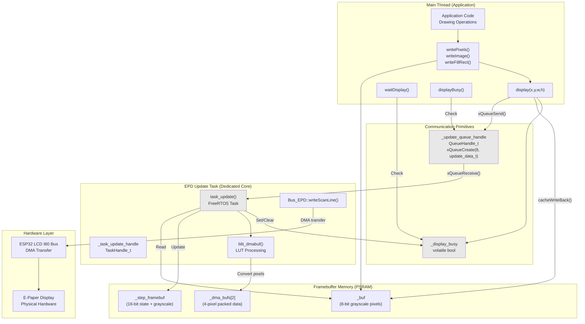
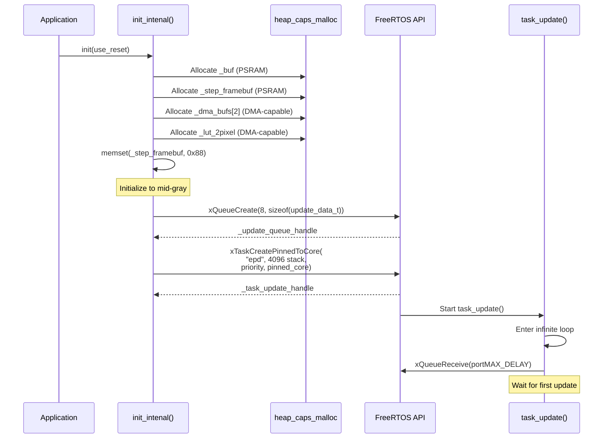
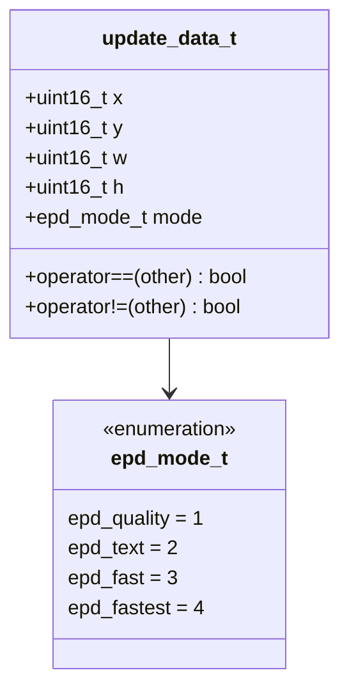
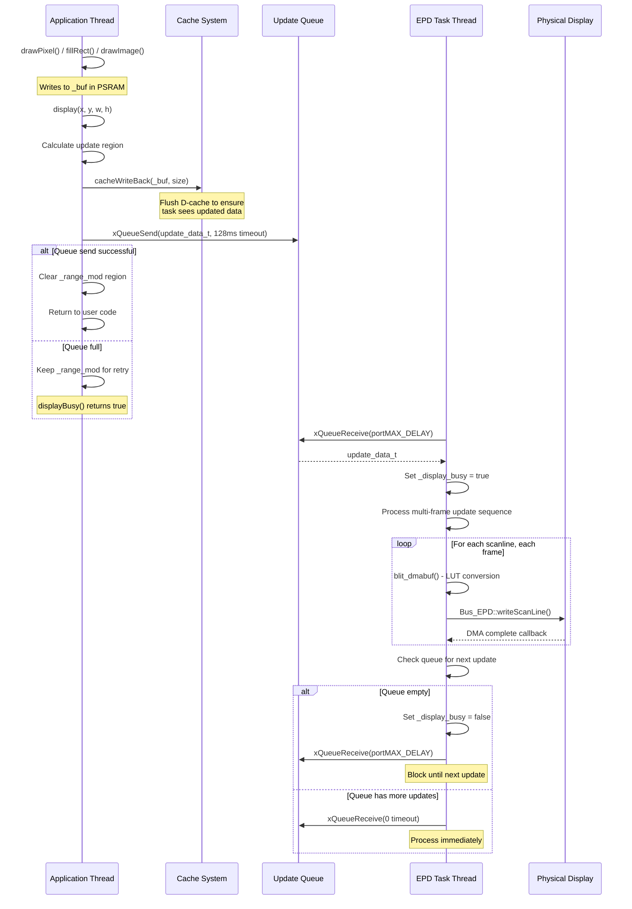
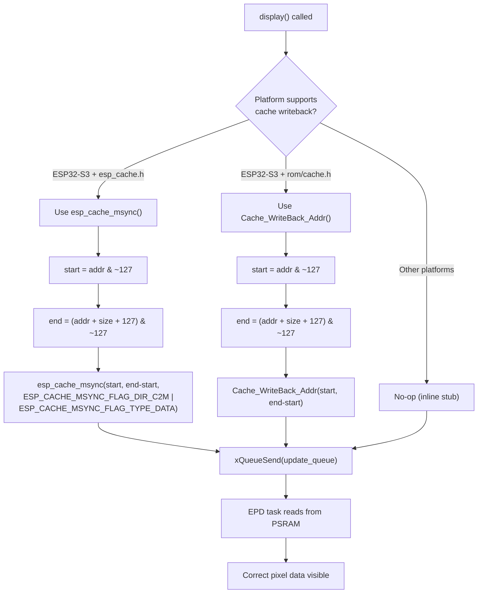
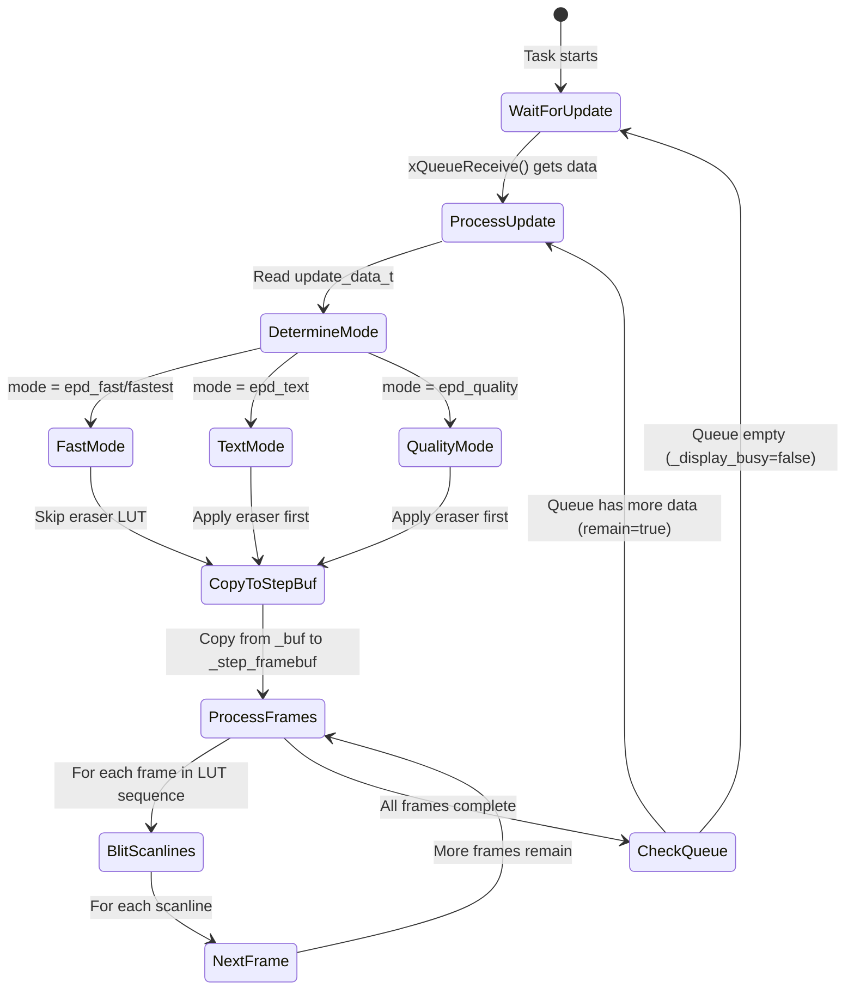
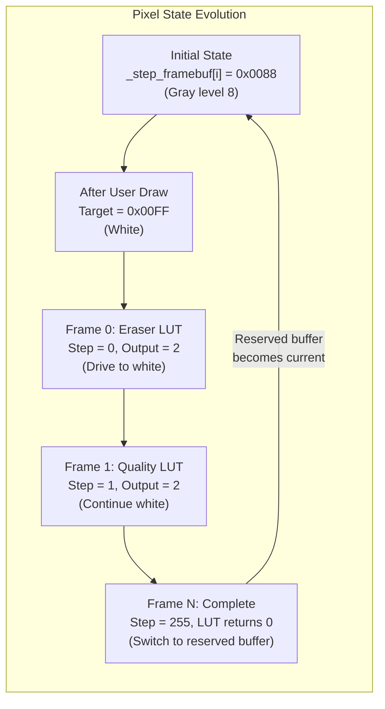
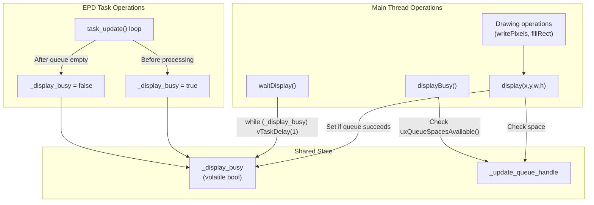
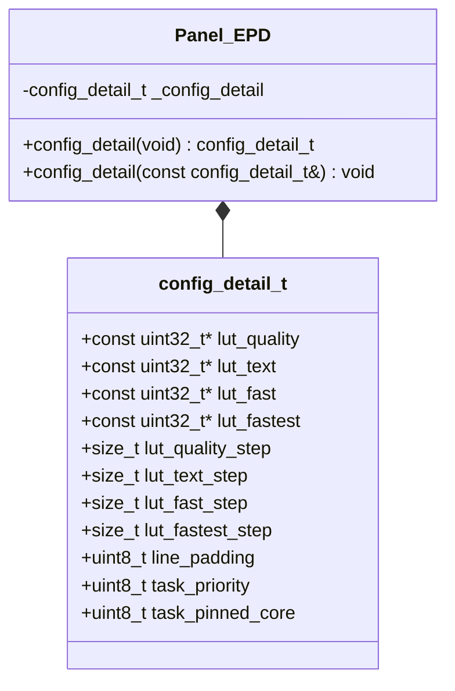

M5GFX Multi-Threading and Async Updates

# Multi-Threading and Async Updates

<details>
<summary>Relevant source files</summary>

The following files were used as context for generating this wiki page:

- [src/lgfx/v1/misc/enum.hpp](src/lgfx/v1/misc/enum.hpp)
- [src/lgfx/v1/platforms/esp32/Bus_EPD.cpp](src/lgfx/v1/platforms/esp32/Bus_EPD.cpp)
- [src/lgfx/v1/platforms/esp32/Bus_EPD.h](src/lgfx/v1/platforms/esp32/Bus_EPD.h)
- [src/lgfx/v1/platforms/esp32/Panel_EPD.cpp](src/lgfx/v1/platforms/esp32/Panel_EPD.cpp)
- [src/lgfx/v1/platforms/esp32/Panel_EPD.hpp](src/lgfx/v1/platforms/esp32/Panel_EPD.hpp)

</details>


## Purpose and Scope

This page explains the multi-threading architecture used in `Panel_EPD` for asynchronous e-paper display updates. E-paper displays require slow, multi-frame refresh sequences that can take hundreds of milliseconds to complete. To prevent blocking the main application thread during these updates, M5GFX implements a FreeRTOS-based asynchronous update system with queue-based communication and multi-core cache coherency management.

For basic e-paper panel configuration and LUT (Look-Up Table) settings, see [Display-Specific Configuration](#7.4). For general panel driver architecture, see [Panel Driver Architecture](#4). For e-paper-specific features like grayscale transitions, see [E-Paper Panel Driver](#4.2).

---

## Why Asynchronous Updates Are Required

E-paper displays differ fundamentally from LCD panels in their refresh characteristics. While LCDs update pixels in milliseconds via SPI transactions, e-paper displays require:

1. **Multi-frame sequences**: Each grayscale transition requires multiple display frames (15-30 frames for quality mode)
2. **Slow refresh rates**: Each frame takes 10-50ms to apply, resulting in total update times of 200-1500ms
3. **State-dependent transitions**: Pixels must transition gradually from their current grayscale level to the target level using lookup tables

Blocking the main application thread during these updates would make the device unresponsive. The solution is to offload display refresh to a dedicated FreeRTOS task that processes updates asynchronously while the main thread continues executing user code.

**Sources:** [Panel_EPD.cpp:1-296]()

---

## System Architecture

### Component Overview



**Key Components:**

- **_buf**: User-facing framebuffer in PSRAM storing 4-bit grayscale pixel pairs (1 byte = 2 pixels)
- **_step_framebuf**: Internal framebuffer tracking refresh progress (upper 8 bits) and target grayscale values (lower 8 bits) per pixel pair
- **_update_queue_handle**: FreeRTOS queue for passing update regions from main thread to task
- **_task_update_handle**: FreeRTOS task handle running on dedicated CPU core
- **_display_busy**: Volatile flag indicating whether updates are in progress

**Sources:** [Panel_EPD.hpp:87-126](), [Panel_EPD.cpp:161-296]()

---

## Task Creation and Initialization

### Initialization Sequence

The asynchronous update system is initialized during `Panel_EPD::init_intenal()`:



**Memory Allocation Strategy:**

| Buffer | Size Calculation | Capability | Purpose |
|--------|-----------------|------------|---------|
| `_buf` | `(panel_w × panel_h) / 2` | `MALLOC_CAP_SPIRAM` | User framebuffer (4-bit grayscale pairs) |
| `_step_framebuf` | `(memory_w × memory_h) × 2` | `MALLOC_CAP_SPIRAM` | Progress tracking (2 banks: current + reserved) |
| `_dma_bufs[2]` | `memory_w / 4 + line_padding` | `MALLOC_CAP_DMA` | Double-buffered DMA scanline data |
| `_lut_2pixel` | `lut_total_step × 256 × 2` | `MALLOC_CAP_DMA` | Pre-computed LUT for 2-pixel transitions |

**Task Configuration:**

The task is created with configurable parameters from `config_detail_t`:

- **task_priority**: Default 2 (configurable via `_config_detail.task_priority`)
- **task_pinned_core**: Defaults to opposite core from caller. If `task_pinned_core >= portNUM_PROCESSORS`, it selects `(xPortGetCoreID() + 1) % portNUM_PROCESSORS`
- **Stack size**: 4096 bytes

**Sources:** [Panel_EPD.cpp:213-296](), [Panel_EPD.hpp:42-58]()

---

## Queue-Based Communication

### Update Data Structure

Updates are passed from the main thread to the task via `update_data_t`:



**Sources:** [Panel_EPD.hpp:99-111](), [enum.hpp:42-52]()

### Display Update Flow



**Queue Characteristics:**
- **Depth**: 8 entries (configured in [Panel_EPD.cpp:286]())
- **Item Size**: `sizeof(update_data_t)` = 10 bytes
- **Timeout on Send**: 128ms (`128 / portTICK_PERIOD_MS`)
- **Blocking Behavior**: Task blocks indefinitely (`portMAX_DELAY`) when queue is empty

**Sources:** [Panel_EPD.cpp:553-589](), [Panel_EPD.cpp:887-910]()

---

## Cache Coherency Across Cores

### The Multi-Core Problem

When the main thread runs on Core 0 and the EPD task runs on Core 1 (or vice versa), PSRAM data written by one core may remain in that core's data cache and not be immediately visible to the other core. This manifests as:

1. Main thread writes pixels to `_buf` in PSRAM
2. Data remains in Core 0's D-cache
3. EPD task on Core 1 reads `_buf` from PSRAM
4. EPD task sees stale pixel data, causing display artifacts

### Cache Writeback Implementation

M5GFX solves this with explicit cache management before queueing updates:



**Cache Alignment:**
- Both implementations align addresses to 128-byte boundaries (cache line size)
- This ensures entire cache lines are flushed, preventing partial updates

**Platform-Specific Code:**

The implementation uses conditional compilation based on available headers:

1. **Modern ESP-IDF (v5.0+)**: Uses `esp_cache_msync()` with `ESP_CACHE_MSYNC_FLAG_DIR_C2M` (cache-to-memory direction) [Panel_EPD.cpp:27-43]()
2. **Legacy ESP32-S3 IDF**: Uses ROM function `Cache_WriteBack_Addr()` [Panel_EPD.cpp:46-52]()
3. **Other platforms**: No-op stub function [Panel_EPD.cpp:69]()

**Critical Call Sites:**
- Before queueing display update: [Panel_EPD.cpp:578]() - `cacheWriteBack(&_buf[y * _cfg.panel_width >> 1], h * _cfg.panel_width >> 1)`

**Sources:** [Panel_EPD.cpp:27-70](), [Panel_EPD.cpp:578]()

---

## Update Processing Loop

### Task Main Loop Structure



### Frame Processing Detail

The `blit_dmabuf()` function is the performance-critical inner loop that converts pixel state to I80 bus data:

**Function Signature:**
```cpp
static bool blit_dmabuf(uint32_t* dst,      // Output: 4 pixels packed in uint32
                        uint16_t* src,       // Input/Output: _step_framebuf state
                        const uint8_t* lut,  // Input: Current LUT offset
                        size_t len)          // Number of 4-pixel groups
```

**Per-Pixel State Machine:**

Each `uint16_t` in `_step_framebuf` encodes:
- **Upper 8 bits**: Current LUT step (0-255)
- **Lower 8 bits**: Target grayscale value (0-15 for each 4-bit pixel pair)
- **Sign bit (MSB)**: Negative value means "skip processing this pixel"

**Optimization Strategy:**

1. **XTENSA Assembly**: On ESP32/ESP32-S3, uses hand-coded assembly with `loop` instruction and register allocation [Panel_EPD.cpp:591-804]()
2. **Portable C++**: Fallback implementation for other architectures [Panel_EPD.cpp:806-884]()
3. **8-pixel SIMD**: Processes 8 pixels simultaneously per iteration for cache efficiency

**Sources:** [Panel_EPD.cpp:887-1165](), [Panel_EPD.cpp:591-884]()

### LUT-Based Pixel Transitions



**LUT Output Encoding:**
- `0`: End of sequence (pixel complete, switch buffers)
- `1`: Drive pixel toward black
- `2`: Drive pixel toward white
- `3`: No operation (maintain current state)

**Sources:** [Panel_EPD.cpp:74-157](), [Panel_EPD.cpp:912-1020]()

---

## Synchronization Mechanisms

### Busy State Management



**API Functions:**

| Function | Behavior | Use Case |
|----------|----------|----------|
| `waitDisplay()` | Blocks until `_display_busy == false` using `vTaskDelay(1)` | Ensure display update complete before critical operations |
| `displayBusy()` | Returns `true` if queue has no space (`uxQueueSpacesAvailable() == 0`) | Non-blocking check before queueing more updates |
| `display()` | Sets `_display_busy = true` before queueing, clears update region on success | Standard update trigger |

**Busy Flag Semantics:**

The `_display_busy` flag has dual semantics:
1. **From main thread perspective**: Indicates whether any updates are pending or processing
2. **From task perspective**: Set when actively processing frames, cleared when queue is empty and waiting

This prevents a race condition where:
1. Task finishes processing and checks queue (empty)
2. Main thread queues new update
3. Task would set `_display_busy = false` incorrectly

The queue's own internal state (`uxQueueSpacesAvailable()`) provides the authoritative busy status from the main thread's perspective.

**Sources:** [Panel_EPD.cpp:299-319](), [Panel_EPD.cpp:905-907]()

---

## Configuration Options

### Task Configuration Structure

The `config_detail_t` structure provides runtime configuration for the async update system:



**Configuration Parameters:**

| Parameter | Type | Default | Description |
|-----------|------|---------|-------------|
| `task_priority` | `uint8_t` | `2` | FreeRTOS task priority (0-configMAX_PRIORITIES) |
| `task_pinned_core` | `uint8_t` | `-1` (auto) | Pin task to specific CPU core (0, 1, or -1 for auto) |
| `line_padding` | `uint8_t` | `0` | Extra bytes added to DMA buffer per scanline |
| `lut_*` pointers | `const uint32_t*` | Built-in | Custom LUT tables for different refresh modes |
| `lut_*_step` | `size_t` | Auto-calculated | Number of frames in each LUT sequence |

**Example Configuration:**

```cpp
// Pin EPD task to Core 1 with high priority
auto epd = new Panel_EPD();
auto cfg = epd->config_detail();
cfg.task_priority = 5;           // Higher priority than default
cfg.task_pinned_core = 1;        // Force to Core 1
cfg.line_padding = 4;            // Add 4 bytes padding per scanline
epd->config_detail(cfg);
epd->init(true);
```

**Core Assignment Logic:**

If `task_pinned_core >= portNUM_PROCESSORS` (typically 2), the code automatically selects the opposite core from the calling thread:

```cpp
if (task_pinned_core >= portNUM_PROCESSORS)
{
    task_pinned_core = (xPortGetCoreID() + 1) % portNUM_PROCESSORS;
}
```

This ensures the EPD task runs on a different core from the main application, maximizing parallelism and cache isolation benefits.

**Sources:** [Panel_EPD.hpp:42-61](), [Panel_EPD.cpp:287-293]()

---

## Performance Considerations

### Memory Bandwidth and Cache Pressure

**Double Buffering in _step_framebuf:**

The `_step_framebuf` uses double buffering with alternating indices:
- **Even indices** (`[0], [2], [4]...`): Currently processing pixel states
- **Odd indices** (`[1], [3], [5]...`): Reserved/next-frame pixel targets

This prevents flickering when new updates arrive during ongoing refresh sequences. The task completes the current frame sequence with old data while preparing the next sequence with new data.

**Memory Access Pattern:**

```
_buf:           [Panel framebuffer, sequential access]
                 ↓ (copy during display())
_step_framebuf:  [State tracking, even/odd interleaved]
                 ↓ (LUT processing)
_dma_bufs[n]:    [Packed I80 data, DMA-capable memory]
                 ↓ (DMA transfer)
I80 Bus:         [Hardware peripheral]
```

**Cache Writeback Overhead:**

On ESP32-S3 with 32KB D-cache, flushing the entire framebuffer (e.g., 540×960÷2 = 259,200 bytes for M5Paper) takes approximately:
- **Cache line size**: 128 bytes
- **Lines to flush**: 259,200 ÷ 128 = 2,025 lines
- **Estimated time**: ~100-200µs at 240MHz CPU clock

This is negligible compared to the multi-frame update duration (200-1500ms) but important for real-time rendering scenarios.

**Sources:** [Panel_EPD.cpp:232](), [Panel_EPD.cpp:578]()

---

## Summary

The `Panel_EPD` multi-threading architecture provides:

1. **Non-blocking updates**: Main application continues running during 200-1500ms refresh sequences
2. **Queue-based decoupling**: Up to 8 pending update regions can be buffered
3. **Multi-core parallelism**: EPD task can run on separate core for true concurrency
4. **Cache coherency**: Explicit writeback ensures correct pixel data visibility across cores
5. **Configurable scheduling**: Task priority and CPU affinity tunable for specific applications
6. **Zero-copy design**: DMA transfers directly from PSRAM buffers without intermediate copies

This design is essential for responsive e-paper applications where display updates must not freeze the UI or interrupt time-sensitive operations like touch input processing or network communication.

**Sources:** [Panel_EPD.cpp:1-1165](), [Panel_EPD.hpp:1-132](), [Bus_EPD.cpp:1-167]()