M5GFX Panel Driver Architecture

# Panel Driver Architecture

<details>
<summary>Relevant source files</summary>

The following files were used as context for generating this wiki page:

- [src/lgfx/v1/LGFX_Sprite.cpp](src/lgfx/v1/LGFX_Sprite.cpp)
- [src/lgfx/v1/lgfx_fonts.cpp](src/lgfx/v1/lgfx_fonts.cpp)
- [src/lgfx/v1/lgfx_fonts.hpp](src/lgfx/v1/lgfx_fonts.hpp)
- [src/lgfx/v1/misc/pixelcopy.cpp](src/lgfx/v1/misc/pixelcopy.cpp)
- [src/lgfx/v1/misc/pixelcopy.hpp](src/lgfx/v1/misc/pixelcopy.hpp)
- [src/lgfx/v1/panel/Panel_EPDiy.cpp](src/lgfx/v1/panel/Panel_EPDiy.cpp)
- [src/lgfx/v1/panel/Panel_EPDiy.hpp](src/lgfx/v1/panel/Panel_EPDiy.hpp)
- [src/lgfx/v1/panel/Panel_FrameBufferBase.cpp](src/lgfx/v1/panel/Panel_FrameBufferBase.cpp)
- [src/lgfx/v1/panel/Panel_FrameBufferBase.hpp](src/lgfx/v1/panel/Panel_FrameBufferBase.hpp)
- [src/lgfx/v1/panel/Panel_GC9A01.hpp](src/lgfx/v1/panel/Panel_GC9A01.hpp)
- [src/lgfx/v1/panel/Panel_LCD.cpp](src/lgfx/v1/panel/Panel_LCD.cpp)
- [src/lgfx/v1/panel/Panel_LCD.hpp](src/lgfx/v1/panel/Panel_LCD.hpp)

</details>


This document describes the panel driver architecture, which abstracts display hardware through a common interface hierarchy. It covers the `IPanel` interface, base classes (`Panel_LCD`, `Panel_FrameBufferBase`), and specific panel implementations. For information about bus communication protocols used by panels, see [Bus & Hardware Abstraction](#5). For hardware autodetection that instantiates these panel drivers, see [M5GFX Class and Board Auto-Detection](#2.1).

---

## Panel Driver Hierarchy

The panel driver system is organized as a three-tier hierarchy: an abstract interface, intermediate base classes that implement common behaviors, and concrete drivers for specific display controllers.

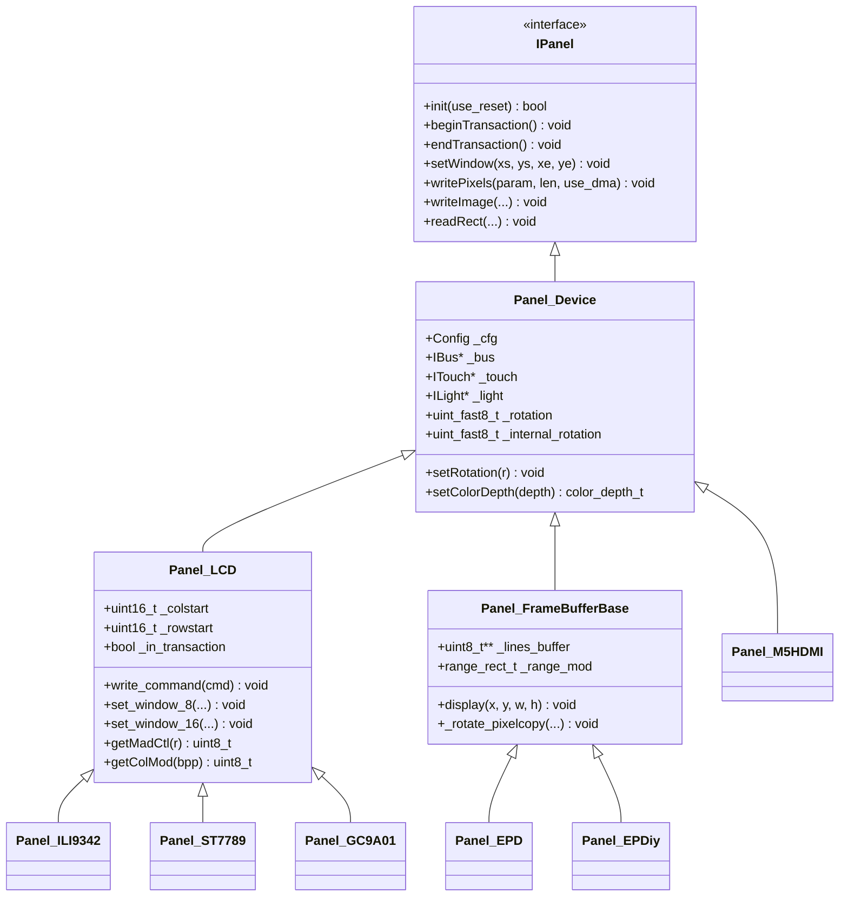

**Sources:** [src/lgfx/v1/panel/Panel_LCD.hpp:28-142](), [src/lgfx/v1/panel/Panel_FrameBufferBase.hpp:29-77]()

---

## Panel Technology Categories

Panels are categorized by their update mechanism, which determines which base class they inherit from.

| Category | Base Class | Characteristics | Examples |
|----------|-----------|-----------------|----------|
| **Direct-Write LCD** | `Panel_LCD` | Streaming pixel writes via SPI/parallel bus, hardware rotation control via MADCTL register | ILI9342, ST7735, ST7789, GC9A01 |
| **Buffered E-Paper** | `Panel_FrameBufferBase` | Full framebuffer in RAM, software rotation, slow refresh requiring full-frame updates | EPD (CoreInk), EPDiy, IT8951 (M5Paper) |
| **HDMI Output** | `Panel_Device` | FPGA-based video timing, I2C transmitter control | Panel_M5HDMI |
| **Composite Video** | `Panel_Device` | DAC-based NTSC/PAL signal generation | Panel_CVBS |
| **Simulation** | `Panel_FrameBufferBase` | SDL2 window rendering for desktop development | Panel_sdl |

**Sources:** Diagram 3 from system overview

---

## Panel_LCD: Direct-Write Display Driver

`Panel_LCD` implements streaming pixel writes for TFT LCD controllers. Pixels are transmitted directly to the display controller through SPI or parallel buses without intermediate buffering.

### Transaction Management

Transactions control chip select signals and bus ownership. A transaction holds CS low and the bus locked for efficient multi-operation sequences.

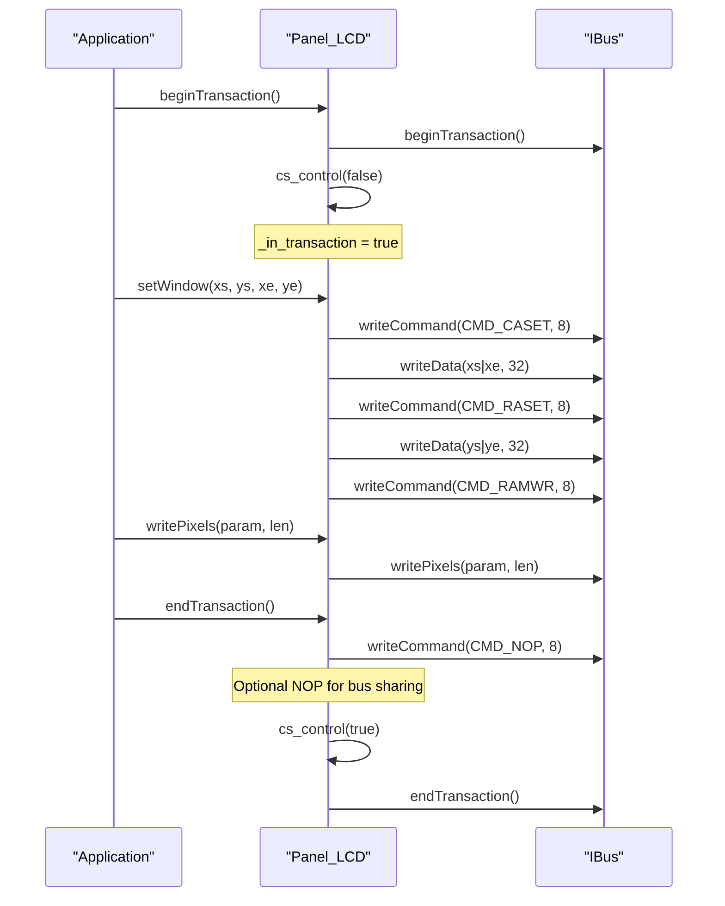

The `_nop_closing` flag (enabled when `pin_cs < 0` and bus type is not I2C) sends a NOP command at transaction end, allowing SPI bus sharing with SD cards. This is disabled for controllers like GC9A01 that malfunction on NOP reception.

**Sources:** [src/lgfx/v1/panel/Panel_LCD.cpp:56-90](), [src/lgfx/v1/panel/Panel_LCD.cpp:29-54]()

### Window Setting and Pixel Writing

The `setWindow()` method establishes a rectangular write region by sending CASET (column address set) and RASET (row address set) commands, followed by RAMWR (RAM write) to begin data transfer.

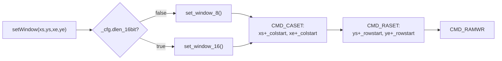

The `_colstart` and `_rowstart` offsets map logical coordinates to the display controller's memory space, accounting for rotation and panel configuration.

**Sources:** [src/lgfx/v1/panel/Panel_LCD.cpp:227-237](), [src/lgfx/v1/panel/Panel_LCD.cpp:125-155]()

### Hardware Rotation Control

LCD controllers have a MADCTL register that controls memory access direction, enabling hardware rotation without software pixel manipulation.

| Rotation | MADCTL Flags | Effect |
|----------|--------------|--------|
| 0 | `0x00` | Normal orientation |
| 1 | `MAD_MV\|MAD_MX\|MAD_MH` | 90° clockwise |
| 2 | `MAD_MX\|MAD_MH\|MAD_MY\|MAD_ML` | 180° |
| 3 | `MAD_MV\|MAD_MY\|MAD_ML` | 270° clockwise |
| 4 | `MAD_MY\|MAD_ML` | Vertical flip |
| 5 | `MAD_MV` | 90° + vertical flip |
| 6 | `MAD_MX\|MAD_MH` | Horizontal flip |
| 7 | `MAD_MV\|MAD_MX\|MAD_MY\|MAD_MH\|MAD_ML` | 270° + horizontal flip |

Controllers may have different MADCTL mappings; `getMadCtl()` is virtual to allow overriding. For example, `Panel_GC9307` uses a different mapping than the default:

**Sources:** [src/lgfx/v1/panel/Panel_LCD.hpp:85-99](), [src/lgfx/v1/panel/Panel_GC9A01.hpp:270-286]()

### Initialization Sequences

Panels define controller-specific initialization commands via `getInitCommands()`, which returns arrays of command-data pairs. Special command `CMD_INIT_DELAY` (0x80) triggers delay in milliseconds.

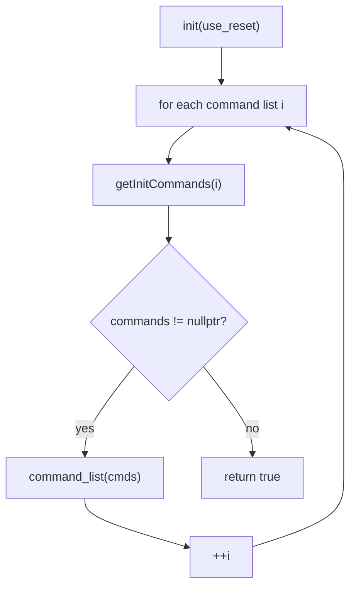

Example from `Panel_GC9A01`:
- Command 0xEF with 0 data bytes
- Command 0xEB with 1 data byte (0x14)
- Command 0x11 (sleep out) with `CMD_INIT_DELAY` and 120ms delay
- Command 0x29 (display on)

**Sources:** [src/lgfx/v1/panel/Panel_LCD.cpp:44-51](), [src/lgfx/v1/panel/Panel_GC9A01.hpp:94-150]()

---

## Panel_FrameBufferBase: Buffered Display Driver

`Panel_FrameBufferBase` maintains a complete framebuffer in RAM, enabling software rotation, modified region tracking, and deferred physical updates. This is essential for e-paper displays with slow refresh rates.

### Framebuffer Structure and Cache Coherency

The framebuffer is organized as an array of row pointers (`_lines_buffer`), where each row is a contiguous memory region.

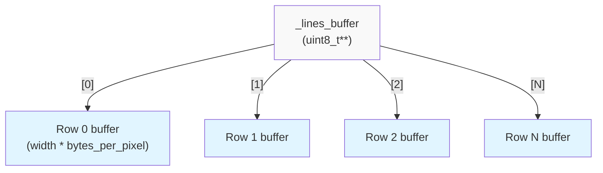

On ESP32-S3 with PSRAM, cache writeback is required before the physical display update. The `display()` method tracks modified regions (`_range_mod`) and calls `cacheWriteBack()` on affected scanlines:

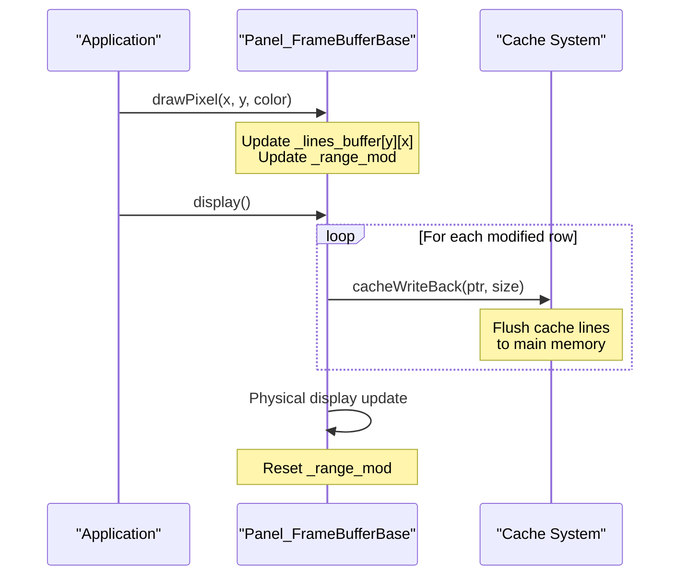

**Sources:** [src/lgfx/v1/panel/Panel_FrameBufferBase.cpp:115-170](), [src/lgfx/v1/panel/Panel_FrameBufferBase.cpp:62-72]()

### Software Rotation in Buffered Panels

Unlike `Panel_LCD`, rotation is applied during pixel write operations by transforming coordinates before buffer access.

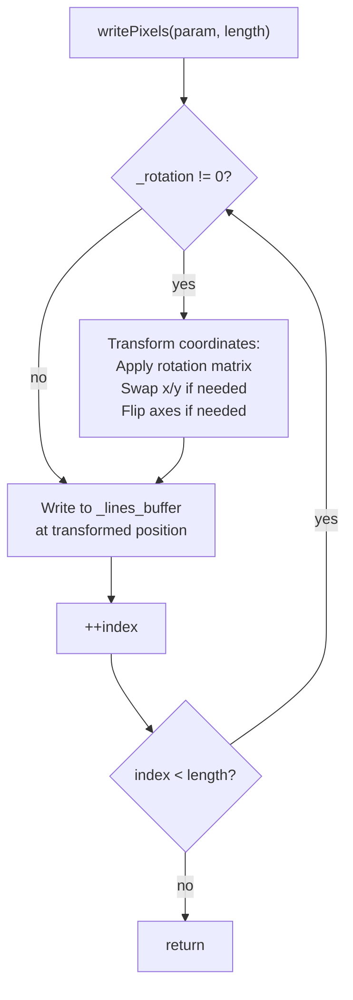

The transformation logic in `_rotate_pixelcopy()` adjusts source coordinates and increments based on rotation value:

| Rotation Bit Pattern | Y-axis Flip | X-axis Flip | XY Swap |
|---------------------|-------------|-------------|---------|
| `0b10010110` (1,2,4,7) | Yes | - | Check bit 0 |
| Bit 1 set | - | Yes | - |
| Bit 0 set | - | - | Yes |

**Sources:** [src/lgfx/v1/panel/Panel_FrameBufferBase.cpp:289-373](), [src/lgfx/v1/panel/Panel_FrameBufferBase.cpp:254-287]()

### Modified Region Tracking

The `_range_mod` rectangle tracks accumulated modifications since the last `display()` call, enabling partial updates for improved performance.

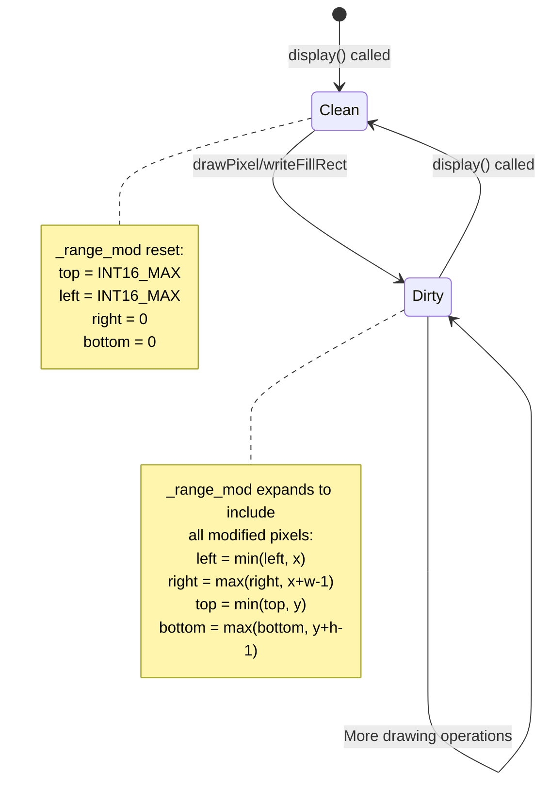

**Sources:** [src/lgfx/v1/panel/Panel_FrameBufferBase.cpp:186-207](), [src/lgfx/v1/panel/Panel_FrameBufferBase.cpp:166-170]()

---

## Specific Panel Implementations

### Panel_GC9A01: Round Display Controller

The GC9A01 controller drives 240x240 circular displays (e.g., M5Dial). Key differences from standard LCD panels:

1. **NOP Intolerance**: Sets `_nop_closing = false` because GC9A01 malfunctions on NOP command reception
2. **Custom Window Setting**: When `_internal_rotation & 1`, sends a dummy RASET with `~0u` data before real window commands
3. **Variant Support**: `Panel_Round_GC9A01_071` for 160x160 displays with different initialization sequences

**Sources:** [src/lgfx/v1/panel/Panel_GC9A01.hpp:78-151](), [src/lgfx/v1/panel/Panel_GC9A01.hpp:29-75]()

### Panel_EPDiy: Large E-Paper Driver

`Panel_EPDiy` integrates with the EPDiy library for large e-paper panels (e.g., 6" to 10.3"). It uses external library functions for hardware control while implementing LovyanGFX's panel interface.

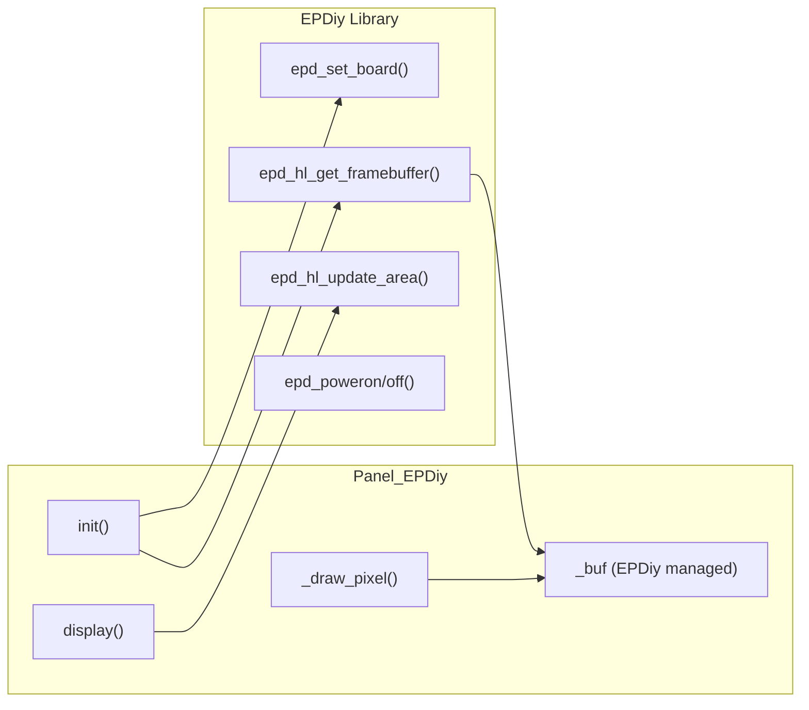

**Bayer Dithering**: Converts RGB to 4-bit grayscale with ordered dithering using a 4x4 Bayer matrix:

```
Bayer[16] = {-30, 2, -22, 10, 18, -14, 26, -6, -18, 14, -26, 6, 30, -2, 22, -10}
```

The threshold varies by pixel position: `sum + Bayer[(y & 3) << 2 + (x & 3)]`, creating a spatial dither pattern.

**Display Modes**:
- `epd_fastest`: `MODE_DU` (direct update, 2 tones, ~260ms)
- `epd_fast`: `MODE_DU` (direct update, 2 tones, ~260ms)
- `epd_text`: `MODE_GL16` (grayscale, 16 levels, ~450ms)
- `epd_quality`: `MODE_GC16` (grayscale compensated, 16 levels, ~950ms)

**Sources:** [src/lgfx/v1/panel/Panel_EPDiy.cpp:62-76](), [src/lgfx/v1/panel/Panel_EPDiy.cpp:43](), [src/lgfx/v1/panel/Panel_EPDiy.cpp:247-262](), [src/lgfx/v1/panel/Panel_EPDiy.cpp:283-321]()

---

## Color Depth Handling

Panels support multiple color depths through the `setColorDepth()` method, which configures both write and read depths.

| Color Depth Enum | Bits | Format | Usage |
|------------------|------|--------|-------|
| `rgb332_1Byte` | 8 | 3:3:2 RGB | Low memory sprites |
| `rgb565_2Byte` | 16 | 5:6:5 RGB | Most LCD panels (swapped) |
| `rgb565_nonswapped` | 16 | 5:6:5 RGB | Non-swapped byte order |
| `rgb888_3Byte` | 24 | 8:8:8 RGB | High color LCD panels |
| `rgb666_3Byte` | 18 | 6:6:6 RGB (packed in 24 bits) | Some panels |
| `grayscale_8bit` | 8 | 8-bit gray | Monochrome displays |

The `getColMod()` method maps internal depth to controller-specific COLMOD register values:

```cpp
virtual uint8_t getColMod(uint8_t bpp) const { 
    return (bpp > 16) ? RGB888_3BYTE : RGB565_2BYTE; 
}
```

Where:
- `RGB444_12bit = 0x33` (12-bit color, rarely used)
- `RGB565_2BYTE = 0x55` (16-bit color, most common)
- `RGB888_3BYTE = 0x66` (24-bit color)

**Sources:** [src/lgfx/v1/panel/Panel_LCD.cpp:117-124](), [src/lgfx/v1/panel/Panel_LCD.cpp:158-170](), [src/lgfx/v1/panel/Panel_LCD.hpp:137]()

---

## Pixel Copy Operations

All pixel writing operations use the `pixelcopy_t` structure for format conversion and transformation. This allows source data in any color format to be converted to the panel's native format during write.

### Write Operation Flow

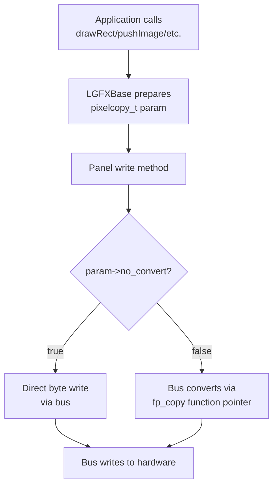

The `pixelcopy_t` structure contains function pointers (`fp_copy`, `fp_skip`) that are assigned based on source/destination format combinations. For example, converting RGB565 to RGB888:

```cpp
fp_copy = pixelcopy_t::copy_rgb_affine<bgr888_t, swap565_t>
```

**Sources:** [src/lgfx/v1/panel/Panel_LCD.cpp:271-285](), [src/lgfx/v1/misc/pixelcopy.hpp:30-576](), [src/lgfx/v1/misc/pixelcopy.cpp:27-84]()

### Optimized Image Writing

The `writeImage()` method in `Panel_LCD` optimizes for different scenarios:

| Condition | Optimization |
|-----------|-------------|
| `no_convert && NON_TRANSP` | Direct DMA transfer without format conversion |
| `src_bitwidth == w` | Single DMA operation for entire image |
| Otherwise | Line-by-line DMA queue building or conversion |

When transparency is involved, the panel processes the image in segments, skipping transparent pixels using `fp_skip()`.

**Sources:** [src/lgfx/v1/panel/Panel_LCD.cpp:287-398]()

---

## Display Update Sequence

### Direct-Write LCD Update Flow

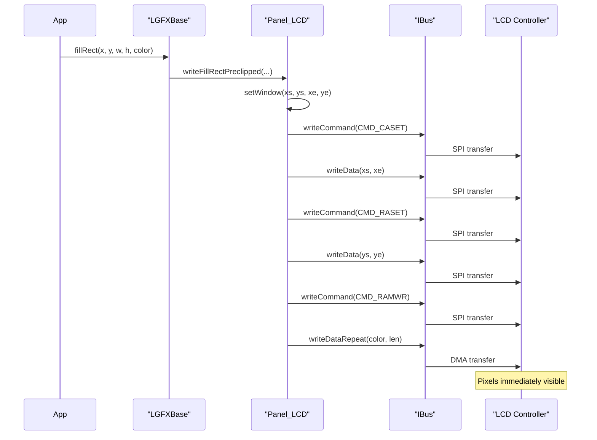

**Sources:** [src/lgfx/v1/panel/Panel_LCD.cpp:251-260]()

### Buffered Display Update Flow

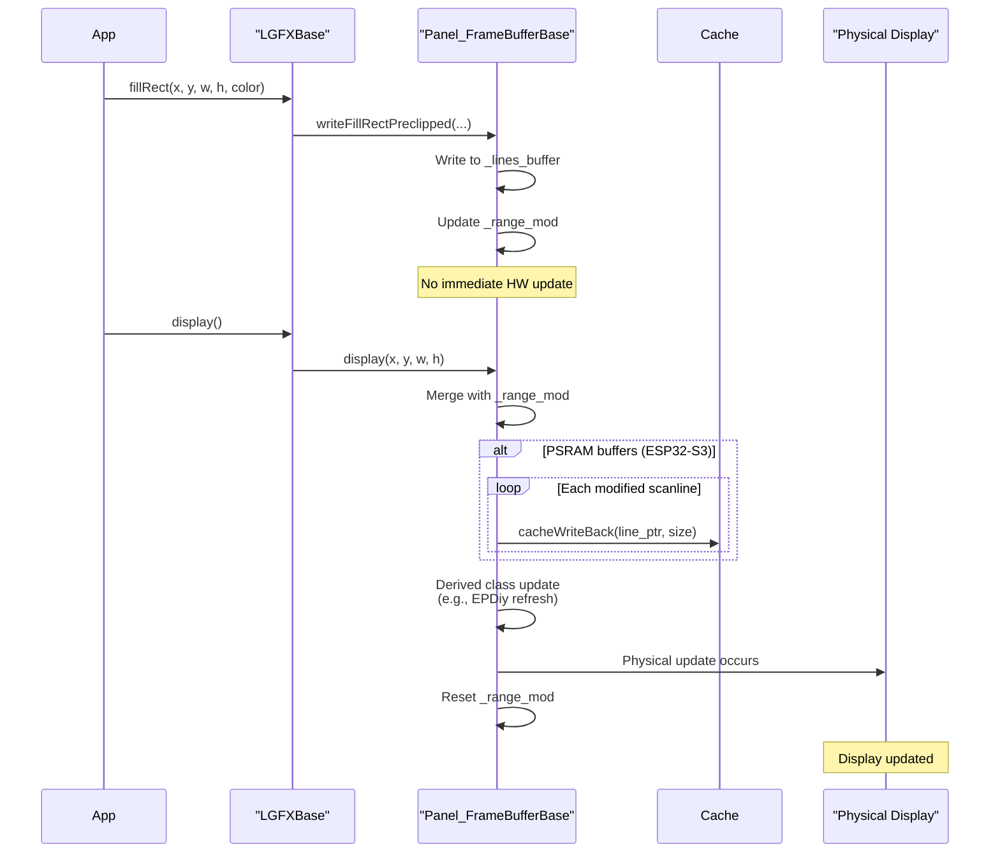

**Sources:** [src/lgfx/v1/panel/Panel_FrameBufferBase.cpp:115-170]()

---

## Summary Table: Panel Driver Characteristics

| Feature | Panel_LCD | Panel_FrameBufferBase | Panel_M5HDMI |
|---------|-----------|----------------------|--------------|
| **Buffering** | None (streaming) | Full framebuffer in RAM | Hardware FIFO |
| **Rotation** | Hardware (MADCTL register) | Software (coordinate transform) | Hardware (video timing) |
| **Transaction** | Bus lock + CS control | No bus operations | I2C command sequences |
| **Update Latency** | Immediate (per-pixel) | Deferred (display() call) | Scanline DMA |
| **Memory Usage** | Minimal | `width * height * bytes_per_pixel` | External FPGA RAM |
| **Modified Tracking** | None | `_range_mod` rectangle | None |
| **Cache Coherency** | N/A | Required on PSRAM | N/A |
| **Transparency Support** | Via `fp_skip()` | Via `fp_skip()` | Not applicable |
| **DMA Usage** | Optional per-operation | On display() update | Continuous |

**Sources:** All panel implementation files referenced above