M5GFX Performance Optimization Techniques

# Performance Optimization Techniques

<details>
<summary>Relevant source files</summary>

The following files were used as context for generating this wiki page:

- [src/lgfx/v1/LGFX_Sprite.cpp](src/lgfx/v1/LGFX_Sprite.cpp)
- [src/lgfx/v1/misc/pixelcopy.cpp](src/lgfx/v1/misc/pixelcopy.cpp)
- [src/lgfx/v1/misc/pixelcopy.hpp](src/lgfx/v1/misc/pixelcopy.hpp)
- [src/lgfx/v1/panel/Panel_FrameBufferBase.cpp](src/lgfx/v1/panel/Panel_FrameBufferBase.cpp)
- [src/lgfx/v1/panel/Panel_FrameBufferBase.hpp](src/lgfx/v1/panel/Panel_FrameBufferBase.hpp)
- [src/lgfx/v1/platforms/esp32/Bus_SPI.cpp](src/lgfx/v1/platforms/esp32/Bus_SPI.cpp)
- [src/lgfx/v1/platforms/esp32/Bus_SPI.hpp](src/lgfx/v1/platforms/esp32/Bus_SPI.hpp)
- [src/lgfx/v1/platforms/esp32/common.cpp](src/lgfx/v1/platforms/esp32/common.cpp)
- [src/lgfx/v1/platforms/esp32/common.hpp](src/lgfx/v1/platforms/esp32/common.hpp)

</details>


This page documents the performance optimization strategies implemented in M5GFX for maximizing throughput on ESP32 platforms. These techniques include DMA strategies, buffer management, transaction optimization, and hardware-specific optimizations.

For multi-threading and async operations, see [Multi-Threading and Async Updates](#7.1). For platform-specific implementation details, see [ESP32 SPI Bus Implementation](#5.3) and [ESP32 DMA and Memory Management](#5.5).

---

## Overview of Performance Architecture

M5GFX achieves high performance through a multi-layered optimization approach that bypasses high-level ESP-IDF APIs in favor of direct hardware register access, sophisticated DMA management, and intelligent buffer strategies.

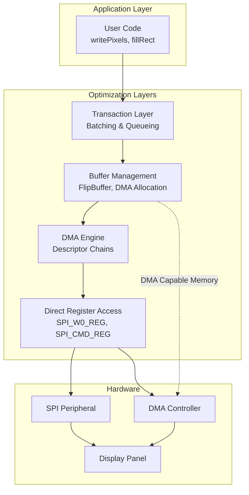

**Sources**: [src/lgfx/v1/platforms/esp32/Bus_SPI.cpp](), [src/lgfx/v1/platforms/esp32/common.cpp]()

---

## DMA Strategies

### DMA Descriptor Chain Management

M5GFX implements manual DMA descriptor chain management for maximum control and efficiency. DMA descriptors are linked lists that describe memory regions to transfer without CPU intervention.

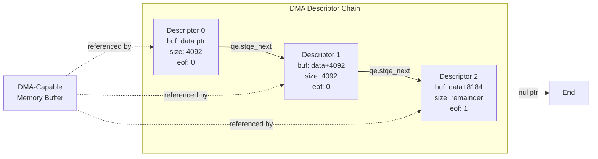

**Key Implementation: `_setup_dma_desc_links`**

The function at [src/lgfx/v1/platforms/esp32/Bus_SPI.cpp:1180-1202]() sets up DMA descriptor chains:

| Parameter | Purpose | Max Size |
|-----------|---------|----------|
| `data` | Source data pointer | Any |
| `len` | Total bytes to transfer | Limited by descriptor count |
| `SPI_MAX_DMA_LEN` | Max bytes per descriptor | 4092 bytes |

Each descriptor contains:
- `buf`: Pointer to data segment
- `size`: Actual data size
- `length`: Size rounded to 4-byte boundary
- `eof`: End-of-frame flag (set on last descriptor)
- `qe.stqe_next`: Pointer to next descriptor

**Sources**: [src/lgfx/v1/platforms/esp32/Bus_SPI.cpp:1180-1202]()

---

### DMA Channel Detection

On ESP32-S3 and ESP32-C3, M5GFX must locate which GDMA channel is assigned to the SPI peripheral:

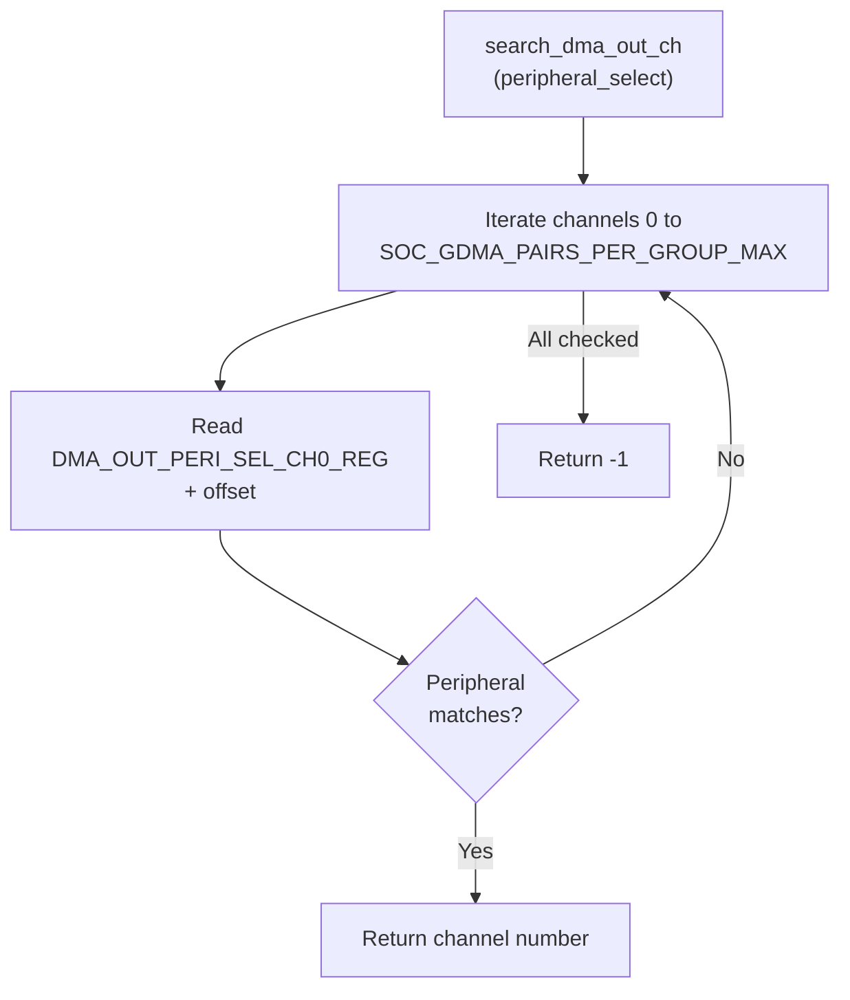

**Sources**: [src/lgfx/v1/platforms/esp32/common.cpp:262-286](), [src/lgfx/v1/platforms/esp32/Bus_SPI.cpp:177-198]()

---

### DMA Queue System

The DMA queue allows batching multiple memory regions into a single DMA operation:

| Method | Purpose | Use Case |
|--------|---------|----------|
| `addDMAQueue()` | Add buffer to queue | Building frame data |
| `execDMAQueue()` | Execute all queued transfers | Complete frame transmission |
| `getDMABuffer()` | Get temporary DMA buffer | Small data copies |

**Implementation at** [src/lgfx/v1/platforms/esp32/Bus_SPI.cpp:824-939]()

The queue dynamically grows using `heap_caps_malloc` with `MALLOC_CAP_DMA` to ensure descriptors are DMA-accessible.

**Sources**: [src/lgfx/v1/platforms/esp32/Bus_SPI.cpp:824-939]()

---

## Buffer Management Techniques

### FlipBuffer Double-Buffering

The `FlipBuffer` class implements a double-buffering pattern for continuous DMA operations:

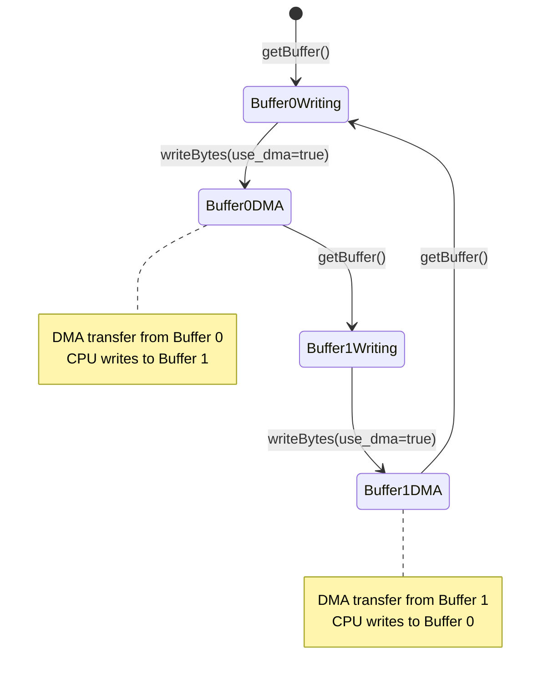

This pattern allows the CPU to prepare the next frame while DMA transfers the current frame, achieving overlapped execution.

**Sources**: [src/lgfx/v1/platforms/esp32/Bus_SPI.hpp:182](), [src/lgfx/v1/platforms/esp32/Bus_SPI.cpp:529-544]()

---

### Memory Allocation Strategies

M5GFX provides different allocation functions optimized for different use cases:

| Function | Memory Type | Use Case | Alignment |
|----------|-------------|----------|-----------|
| `heap_alloc()` | Any 8-bit capable | General purpose | 1 byte |
| `heap_alloc_dma()` | DMA-capable SRAM | DMA descriptors, transfer buffers | 4 bytes |
| `heap_alloc_psram()` | External PSRAM | Large frame buffers | 4 bytes |

**Decision Tree for Buffer Selection**:

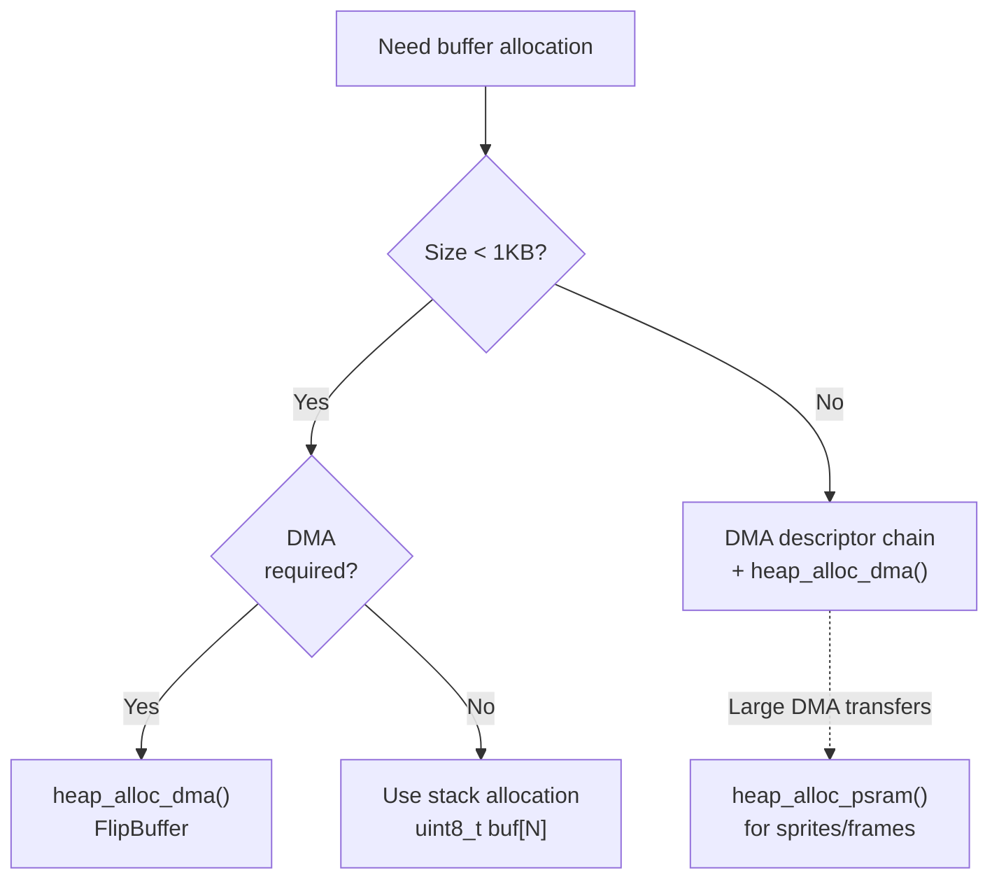

**Helper Functions**:
- `heap_capable_dma()`: Check if pointer is DMA-capable [src/lgfx/v1/platforms/esp32/common.hpp:117]()
- `isEmbeddedMemory()`: Check if pointer is in internal RAM [src/lgfx/v1/platforms/esp32/common.hpp:120]()

**Sources**: [src/lgfx/v1/platforms/esp32/common.hpp:113-120]()

---

### Small Buffer Optimization

For transfers under 64 bytes, M5GFX uses SPI FIFO registers directly without DMA:

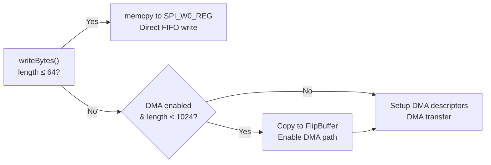

This avoids DMA setup overhead for small transfers. Implementation at [src/lgfx/v1/platforms/esp32/Bus_SPI.cpp:642-659]().

**Sources**: [src/lgfx/v1/platforms/esp32/Bus_SPI.cpp:630-735]()

---

## Transaction Optimization

### Direct Register Access

M5GFX bypasses ESP-IDF SPI driver functions and writes directly to hardware registers for minimal latency:

| Register | Purpose | Address Calculation |
|----------|---------|---------------------|
| `SPI_CMD_REG` | Start SPI transaction | `REG_SPI_BASE(port) + offset` |
| `SPI_W0_REG` | 64-byte FIFO buffer | Base + 0x80 |
| `SPI_MOSI_DLEN_REG` | Set transfer length | Platform-dependent |
| `SPI_USER_REG` | Configure SPI mode | Control register |
| `SPI_CLOCK_REG` | Set clock divider | Timing control |

**Register Access Pattern**:

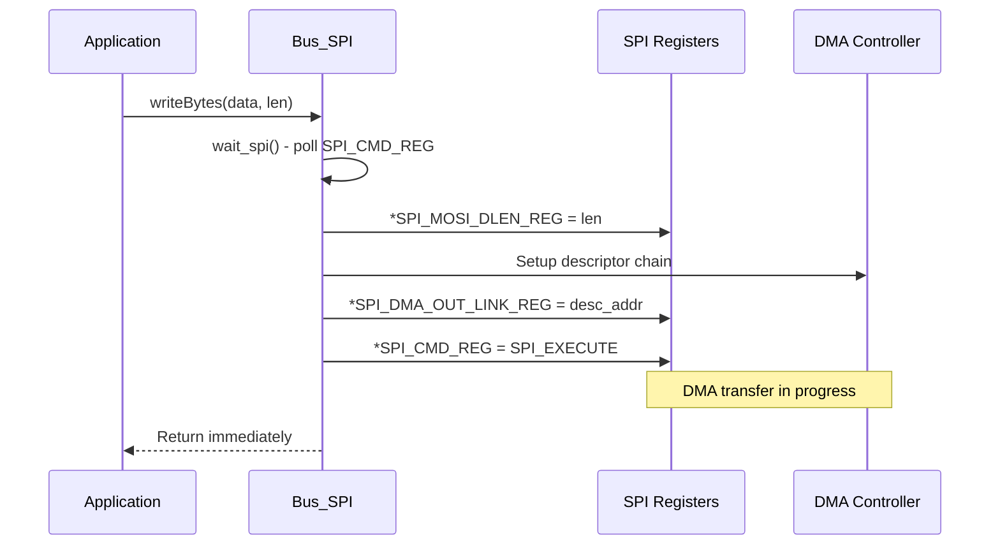

**Key inline functions** at [src/lgfx/v1/platforms/esp32/Bus_SPI.hpp:143-146]():
- `exec_spi()`: Trigger transaction
- `wait_spi()`: Busy-wait for completion
- `set_write_len()`: Configure transfer size
- `set_read_len()`: Configure read size

**Sources**: [src/lgfx/v1/platforms/esp32/Bus_SPI.cpp:108-111](), [src/lgfx/v1/platforms/esp32/Bus_SPI.hpp:143-146](), [src/lgfx/v1/platforms/esp32/common.cpp:164-168]()

---

### HIGHPART Register Optimization (ESP32 Classic)

The ESP32 classic has a unique optimization where the 64-byte SPI FIFO can be used as two 32-byte ping-pong buffers:

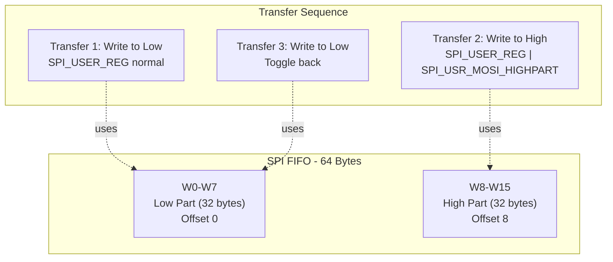

While one half transmits via DMA, the CPU prepares data in the other half. Implementation at [src/lgfx/v1/platforms/esp32/Bus_SPI.cpp:584-625]() for writes and [src/lgfx/v1/platforms/esp32/Bus_SPI.cpp:1055-1082]() for reads.

**Note**: This optimization is disabled on ESP32-C3 and ESP32-S3 due to hardware differences.

**Sources**: [src/lgfx/v1/platforms/esp32/Bus_SPI.cpp:584-625](), [src/lgfx/v1/platforms/esp32/Bus_SPI.cpp:779-820](), [src/lgfx/v1/platforms/esp32/Bus_SPI.cpp:1055-1082]()

---

### Write Repeat Optimization

For filling large areas with a solid color, `writeDataRepeat()` uses a sophisticated pattern:

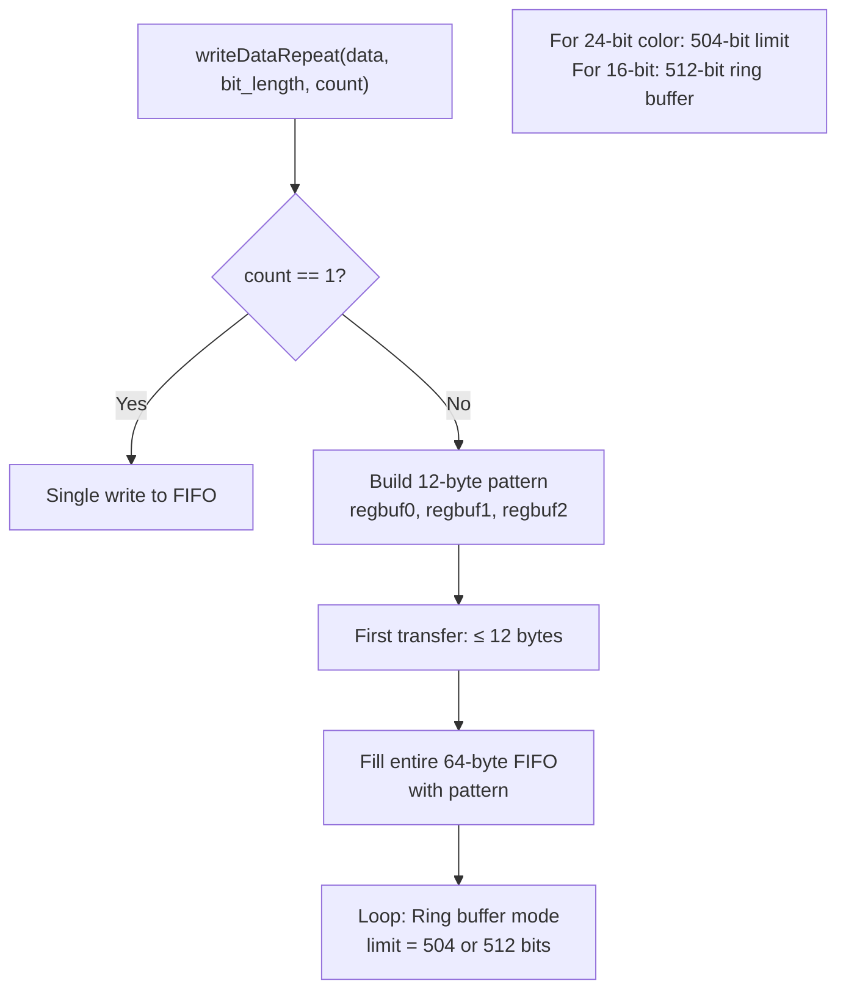

The ring buffer mode allows specifying transfer sizes larger than the FIFO by repeatedly cycling through it. Implementation at [src/lgfx/v1/platforms/esp32/Bus_SPI.cpp:397-513]().

**Sources**: [src/lgfx/v1/platforms/esp32/Bus_SPI.cpp:397-513]()

---

## Clock Frequency Optimization

### Clock Divider Calculation

M5GFX implements precise clock divider calculation to achieve target frequencies:

**Function**: `calcClockDiv()` at [src/lgfx/v1/platforms/esp32/common.cpp:203-243]()

The algorithm searches for optimal divider values (`div_a`, `div_b`, `div_n`, `clkcnt`) that minimize error:

```
Actual Frequency = baseClock / ((div_n * clkcnt) + (div_b * clkcnt) / div_a)
```

| Parameter | Range | Purpose |
|-----------|-------|---------|
| `clkcnt` | 2-64 | Clock count cycles |
| `div_n` | 2-256 | Integer divider |
| `div_a` | 0-63 | Fractional denominator |
| `div_b` | 0-63 | Fractional numerator |

**Optimization Strategy**:
1. Search from high `clkcnt` to low (favor fewer clock edges)
2. For each `clkcnt`, calculate optimal fractional divider
3. Choose combination with minimum frequency error

**Sources**: [src/lgfx/v1/platforms/esp32/common.cpp:203-243]()

---

### APB Frequency Caching

To avoid repeated system calls, the APB frequency is cached:

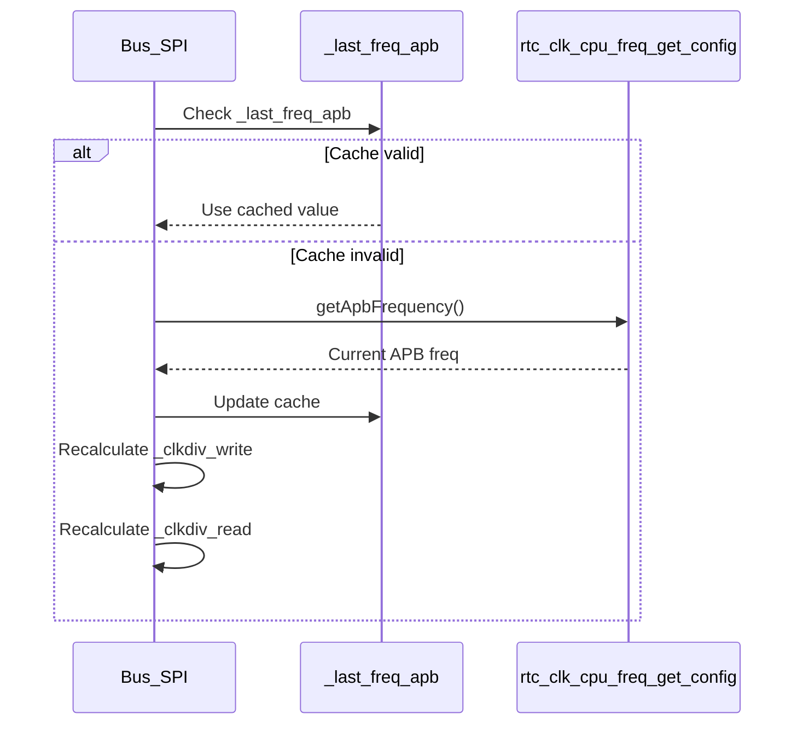

Implementation at [src/lgfx/v1/platforms/esp32/Bus_SPI.cpp:243-253]() and [src/lgfx/v1/platforms/esp32/common.cpp:180-192]().

**Sources**: [src/lgfx/v1/platforms/esp32/Bus_SPI.cpp:240-253](), [src/lgfx/v1/platforms/esp32/common.cpp:180-192]()

---

## Hardware-Specific Optimizations

### DMA Burst Mode

When transfer length is 4-byte aligned, burst mode can be enabled for faster transfers:

```cpp
// From Bus_SPI.cpp:688-697
dma_conf |= (length & 3) 
    ? (SPI_OUTDSCR_BURST_EN)  // Not aligned: descriptor burst only
    : (SPI_OUTDSCR_BURST_EN | SPI_OUT_DATA_BURST_EN);  // Aligned: full burst
```

**Burst Mode Benefit**: Reduces bus arbitration overhead by reading multiple words per transaction.

**Important**: On ESP32 at 80MHz APB clock, burst mode with non-4-byte-aligned transfers can corrupt data. M5GFX automatically disables `SPI_OUT_DATA_BURST_EN` in this case.

**Sources**: [src/lgfx/v1/platforms/esp32/Bus_SPI.cpp:688-697]()

---

### Platform-Specific Workarounds

The codebase includes several workarounds for hardware errata:

| Platform | Issue | Workaround | Location |
|----------|-------|------------|----------|
| ESP32 Classic | DMA idle detection | `spicommon_dmaworkaround_*` | [Bus_SPI.cpp:23-25]() |
| ESP32-C3 | HIGHPART malfunction | Disable HIGHPART use | [Bus_SPI.cpp:548-582]() |
| ESP32-S3 | HIGHPART malfunction | Disable HIGHPART use | [Bus_SPI.cpp:740-778]() |
| All | GDMA clear needed | Clear `SPI_DMA_CONF_REG` | [Bus_SPI.cpp:680-682]() |

**Sources**: [src/lgfx/v1/platforms/esp32/Bus_SPI.cpp:23-25](), [src/lgfx/v1/platforms/esp32/Bus_SPI.cpp:293-295](), [src/lgfx/v1/platforms/esp32/Bus_SPI.cpp:712-714]()

---

### Direct GPIO Operations

For time-critical DC (Data/Command) pin toggling, M5GFX uses direct GPIO register writes:

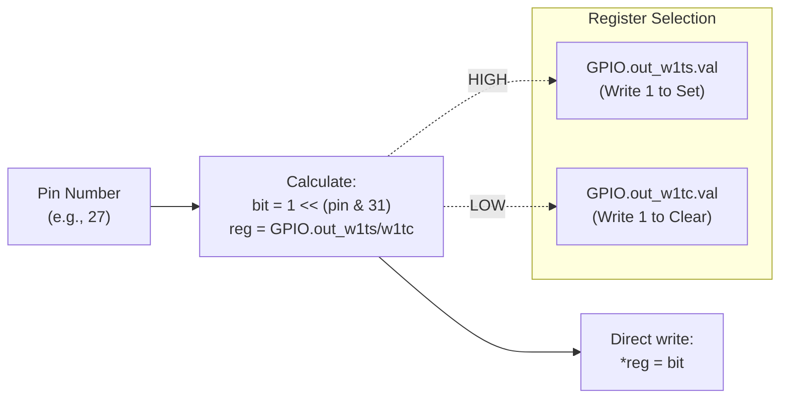

Functions at [src/lgfx/v1/platforms/esp32/common.hpp:157-158]():
- `gpio_hi()`: Set pin high
- `gpio_lo()`: Set pin low
- `get_gpio_hi_reg()`: Get SET register
- `get_gpio_lo_reg()`: Get CLEAR register

This is significantly faster than `gpio_set_level()` from ESP-IDF.

**Sources**: [src/lgfx/v1/platforms/esp32/common.hpp:143-158](), [src/lgfx/v1/platforms/esp32/Bus_SPI.cpp:113-142]()

---

## Performance Measurement and Profiling

### Timing Functions

M5GFX provides microsecond-precision timing:

| Function | Resolution | Implementation |
|----------|------------|----------------|
| `micros()` | 1 μs | `esp_timer_get_time()` |
| `millis()` | 1 ms | `esp_timer_get_time() / 1000` |
| `delayMicroseconds()` | 1 μs | `esp_rom_delay_us()` or `ets_delay_us()` |

Implementation at [src/lgfx/v1/platforms/esp32/common.hpp:88-111]().

**Sources**: [src/lgfx/v1/platforms/esp32/common.hpp:88-111]()

---

### Busy-Wait vs Task Yield

M5GFX uses different waiting strategies depending on expected latency:

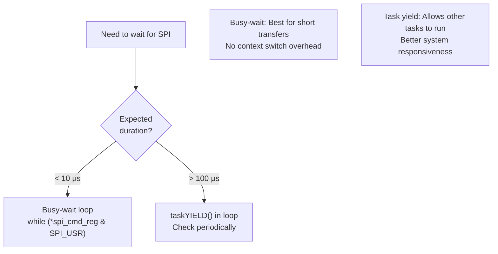

Example at [src/lgfx/v1/platforms/esp32/common.cpp:1197-1202]() in I2C wait logic.

**Sources**: [src/lgfx/v1/platforms/esp32/common.cpp:1197-1202](), [src/lgfx/v1/platforms/esp32/Bus_SPI.cpp:302-311]()

---

## Best Practices Summary

### For Application Developers

| Technique | When to Use | Performance Gain |
|-----------|-------------|------------------|
| DMA transfers | Buffers > 1KB | 2-5x throughput |
| `writeDataRepeat()` | Solid fills | 5-10x vs pixel-by-pixel |
| Transaction batching | Multiple small writes | Reduces overhead |
| Sprites with `pushSprite()` | Complex scenes | Pre-render once, push many times |
| PSRAM for large buffers | > 64KB data | Conserves internal RAM |

**Sources**: [src/lgfx/v1/platforms/esp32/Bus_SPI.cpp:515-628](), [src/lgfx/v1/platforms/esp32/Bus_SPI.cpp:397-513]()

---

### Performance Characteristics Table

Typical performance numbers on ESP32 @ 240MHz with SPI @ 40MHz:

| Operation | Without DMA | With DMA | Notes |
|-----------|-------------|----------|-------|
| 320×240 RGB565 fill | ~15 ms | ~8 ms | Using `writeDataRepeat()` |
| 320×240 RGB565 image | ~25 ms | ~12 ms | From PSRAM using DMA |
| Small writes (< 64B) | ~5 μs | ~15 μs | DMA overhead not worth it |
| Large writes (> 4KB) | ~500 μs | ~200 μs | 2.5x improvement |

These numbers are illustrative and vary by hardware configuration.

**Sources**: [src/lgfx/v1/platforms/esp32/Bus_SPI.cpp]()

---

### Memory Layout Considerations

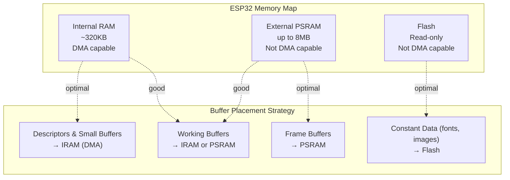

**Key Rules**:
1. DMA descriptors MUST be in DMA-capable memory
2. Transfer source data SHOULD be in DMA-capable memory for best performance
3. If source is in PSRAM/Flash, copy to DMA buffer first (FlipBuffer does this)

**Sources**: [src/lgfx/v1/platforms/esp32/common.hpp:113-127](), [src/lgfx/v1/platforms/esp32/Bus_SPI.cpp:662-671]()