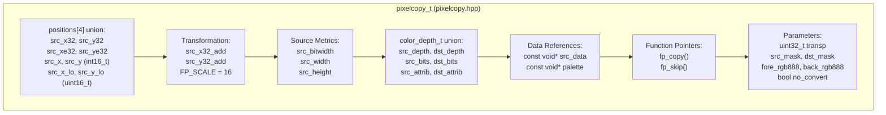
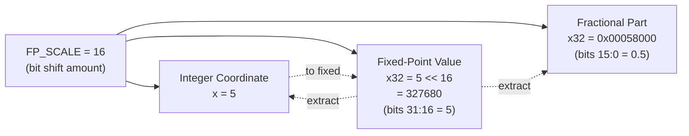
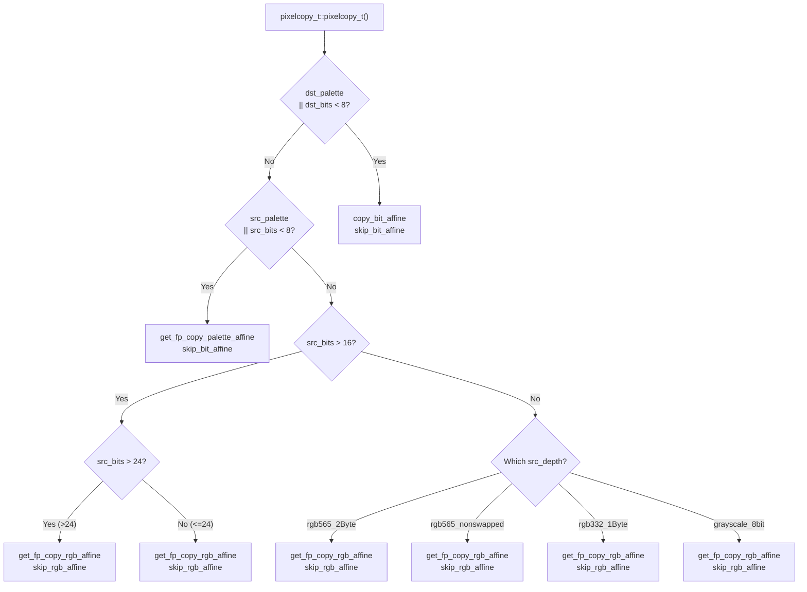
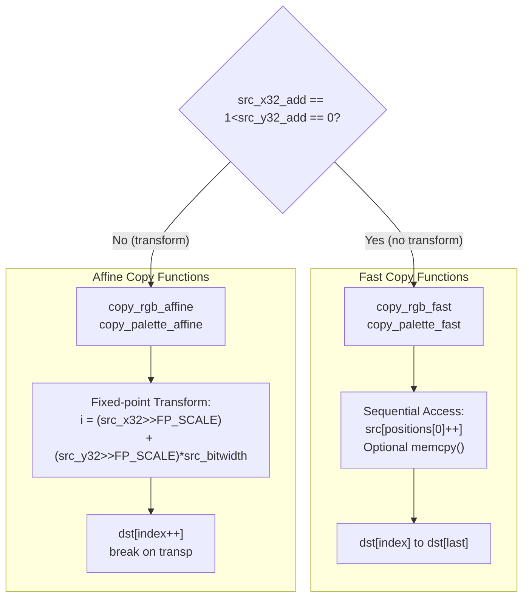
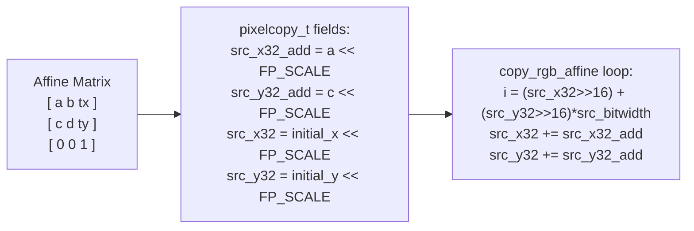
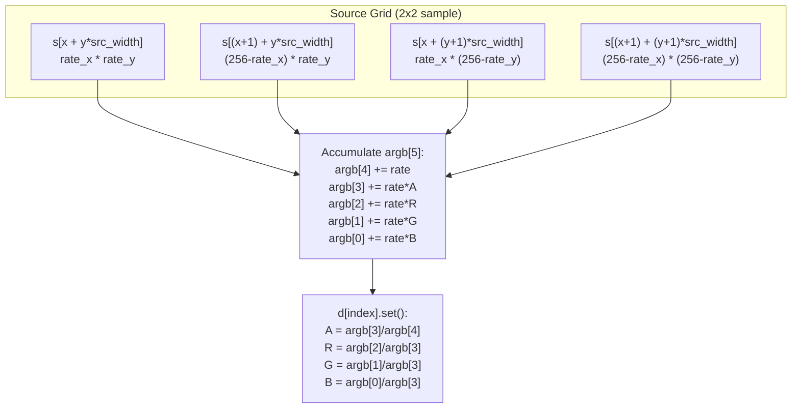
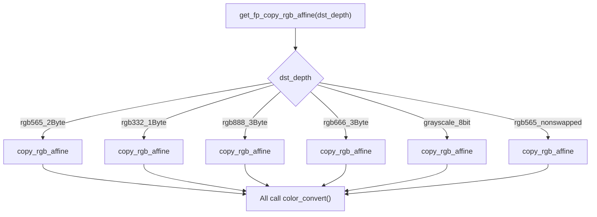
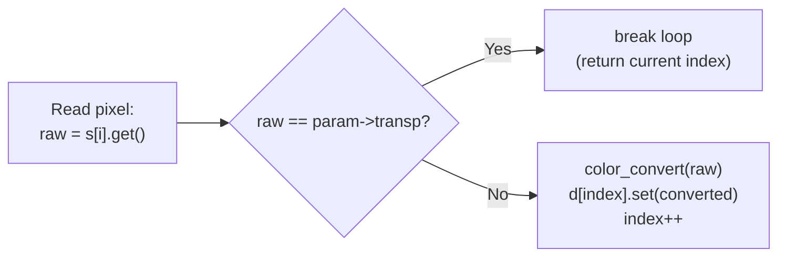
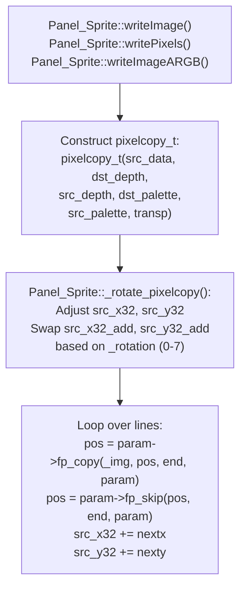

M5GFX Pixel Copy and Transformation

# Pixel Copy and Transformation System

<details>
<summary>Relevant source files</summary>

The following files were used as context for generating this wiki page:

- [src/lgfx/v1/LGFX_Sprite.cpp](src/lgfx/v1/LGFX_Sprite.cpp)
- [src/lgfx/v1/misc/pixelcopy.cpp](src/lgfx/v1/misc/pixelcopy.cpp)
- [src/lgfx/v1/misc/pixelcopy.hpp](src/lgfx/v1/misc/pixelcopy.hpp)
- [src/lgfx/v1/panel/Panel_FrameBufferBase.cpp](src/lgfx/v1/panel/Panel_FrameBufferBase.cpp)
- [src/lgfx/v1/panel/Panel_FrameBufferBase.hpp](src/lgfx/v1/panel/Panel_FrameBufferBase.hpp)

</details>


## Overview

The `pixelcopy_t` system provides efficient pixel data transfer operations with support for color format conversion, affine transformations (rotation, scaling), antialiasing, and alpha blending. The system uses function pointer dispatch to select optimal code paths based on source/destination color depths and transformation requirements, eliminating runtime branching in performance-critical inner loops.

This page covers the low-level pixel copying and transformation mechanics. For higher-level drawing primitives and image rendering, see page 3.1. For color format definitions and conversion functions, see page 3.2. For sprite and framebuffer usage of this system, see page 3.4.

**Sources:** [src/lgfx/v1/misc/pixelcopy.hpp:1-581]()

---

## Core Data Structure

The `pixelcopy_t` structure is the central component of the pixel copy system. It maintains transformation state, color depth information, and function pointers for optimal operation dispatch.

### pixelcopy_t Structure Layout

**Diagram: pixelcopy_t Structure Organization**



### Key Structure Fields

| Field Category | Fields | Purpose |
|---------------|--------|---------|
| **Fixed-Point Coordinates** | `src_x32`, `src_y32`, `src_xe32`, `src_ye32` | 32-bit fixed-point source coordinates (16.16 format) |
| **Transformation Deltas** | `src_x32_add`, `src_y32_add` | Per-pixel coordinate increments for affine transforms |
| **Source Metadata** | `src_bitwidth`, `src_width`, `src_height` | Source image dimensions and stride |
| **Color Depths** | `src_depth`, `dst_depth`, `src_bits`, `dst_bits` | Source and destination color format information |
| **Data References** | `src_data`, `palette` | Pointers to pixel data and optional palette |
| **Function Dispatch** | `fp_copy`, `fp_skip` | Function pointers for copy and skip operations |
| **Transparency** | `transp`, `src_mask`, `dst_mask` | Transparency key and bit masks |
| **Grayscale Colors** | `fore_rgb888`, `back_rgb888` | Foreground/background colors for 1-bit/grayscale expansion |
| **Optimization Flag** | `no_convert` | Set when `src_depth == dst_depth` for fast path |

**Sources:** [src/lgfx/v1/misc/pixelcopy.hpp:30-87]()

---

## Fixed-Point Coordinate System

The transformation system uses 16.16 fixed-point arithmetic to represent fractional pixel coordinates. This provides sufficient precision for smooth scaling and rotation without floating-point overhead.

### Fixed-Point Constants



### Coordinate Access Pattern

The union structure allows accessing coordinates as both 32-bit fixed-point and 16-bit integer/fractional components:

| Access Method | Field Name | Bits Used | Purpose |
|---------------|------------|-----------|---------|
| **32-bit Fixed** | `src_x32` | 31:0 | Full fixed-point value for accumulation |
| **Integer Part** | `src_x` | 31:16 | Extract integer pixel coordinate |
| **Fractional Part** | `src_x_lo` | 15:0 | Extract sub-pixel position for antialiasing |

**Example Coordinate Update (Affine Transform):**
```
Initial:   src_x32 = 3 << 16 = 196608  (pixel 3.0)
Add:       src_x32_add = 1.5 << 16 = 98304  (increment by 1.5 pixels)
Result:    src_x32 = 294912  (pixel 4.5)
Extract:   src_x = 294912 >> 16 = 4  (integer part)
           src_x_lo = 294912 & 0xFFFF = 32768  (0.5 fractional)
```

**Sources:** [src/lgfx/v1/misc/pixelcopy.hpp:32-53]()

---

## Function Pointer Dispatch System

The `pixelcopy_t` constructor analyzes source and destination color depths to select the optimal copy and skip function pointers. This eliminates runtime branching during bulk pixel operations.

### Dispatch Decision Tree

**Diagram: pixelcopy_t Constructor Function Pointer Selection**



### Function Pointer Types

| Function Pointer | Signature | Purpose |
|------------------|-----------|---------|
| `fp_copy` | `uint32_t (*)(void* dst, uint32_t index, uint32_t last, pixelcopy_t* param)` | Copy pixels from `index` to `last`, returns actual end index (may stop early on transparency) |
| `fp_skip` | `uint32_t (*)(uint32_t index, uint32_t last, pixelcopy_t* param)` | Skip transparent pixels without copying, returns index of first non-transparent pixel |

**Sources:** [src/lgfx/v1/misc/pixelcopy.cpp:27-84](), [src/lgfx/v1/misc/pixelcopy.hpp:81-82]()

---

## Copy Operation Modes

The system implements two primary copy modes: **fast** (direct sequential copy) and **affine** (transformed copy with interpolation).

### Fast vs Affine Copy Comparison

**Diagram: Copy Mode Selection**



### Fast Copy Optimization Paths

**Fast RGB Copy (`copy_rgb_fast`):**
- Used when: `src_x32_add == (1 << FP_SCALE)` and `src_y32_add == 0` (no transform)
- Optimization: Uses `memcpy()` when `TDst == TSrc` (same color format)
- Implementation: [src/lgfx/v1/misc/pixelcopy.hpp:162-178]()

**Fast Palette Copy (`copy_palette_fast`):**
- Extracts palette indices from packed bit arrays
- Performs palette lookup and color conversion
- Supports 1-bit, 2-bit, 4-bit, 8-bit indexed formats
- Implementation: [src/lgfx/v1/misc/pixelcopy.hpp:145-159]()

### Affine Copy Coordinate Stepping

**RGB Affine Copy (`copy_rgb_affine`):**

For each destination pixel:
1. Calculate source index: `i = (src_x32 >> FP_SCALE) + (src_y32 >> FP_SCALE) * src_bitwidth`
2. Read source pixel: `raw = src[i].get()`
3. Check transparency: `if (raw == transp) break;`
4. Convert and write: `dst[index].set(color_convert(raw))`
5. Step coordinates: `src_x32 += src_x32_add; src_y32 += src_y32_add;`

**Sources:** [src/lgfx/v1/misc/pixelcopy.hpp:243-264]()

---

## Affine Transformation Implementation

Affine transformations (rotation, scaling) are implemented by setting appropriate `src_x32_add` and `src_y32_add` values that represent the transformed coordinate step per destination pixel.

### Transformation Matrix to Increment Values

**Diagram: Affine Transform Mapping**



### Common Transformation Examples

| Transform | `src_x32_add` | `src_y32_add` | Effect |
|-----------|---------------|---------------|--------|
| **Identity** | `1 << 16` | `0` | No transformation (fast path eligible) |
| **Scale 2x** | `(1 << 16) / 2` = `32768` | `0` | Each dst pixel samples every 0.5 src pixel |
| **Rotate 90° CW** | `0` | `1 << 16` | X advance becomes Y advance |
| **Rotate 90° CCW** | `0` | `-(1 << 16)` | X advance becomes negative Y |

### Sprite Rotation Integration

The `Panel_Sprite::_rotate_pixelcopy()` function adjusts `pixelcopy_t` parameters based on the sprite's rotation setting (0-7):

**Rotation Logic:**
```
if (rotation & 1):
    swap(width, height)
    swap(src_x32_add, src_y32_add_for_next_line)

if (rotation & 2):
    negate src_x32_add and src_y32_add (flip horizontally)
    adjust src_x32 to start from right edge

if (rotation in [1, 2, 4, 7]):
    negate next_line_increment (flip vertically)
    adjust src_y32 to start from bottom edge
```

**Sources:** [src/lgfx/v1/LGFX_Sprite.cpp:294-327]()

---

## Antialiasing with Sub-Pixel Sampling

The antialiasing functions (`copy_rgb_antialias`, `copy_palette_antialias`) perform sub-pixel sampling by reading multiple source pixels for each destination pixel and blending them based on fractional coordinate positions.

### Antialias Sampling Pattern

**Diagram: copy_rgb_antialias Bilinear Sampling**



### Antialiasing Coordinate Ranges

The system calculates a rectangle of source pixels to sample using the fractional coordinate parts:

| Coordinate | Integer Part | Fractional Part | Sampling Range |
|------------|--------------|-----------------|----------------|
| `src_x` | `src_x32 >> 16` | `src_x_lo` (bits 15:0) | From `src_x` to `src_xe` |
| `src_y` | `src_y32 >> 16` | `src_y_lo` (bits 15:0) | From `src_y` to `src_ye` |
| `src_xe` | `src_xe32 >> 16` | `src_xe_lo` (bits 15:0) | End X coordinate |
| `src_ye` | `src_ye32 >> 16` | `src_ye_lo` (bits 15:0) | End Y coordinate |

### Antialiasing Weight Calculation

**Bilinear Interpolation Weights:**
```
rate_x = 256 - (src_x_lo >> 8)  // Left pixel weight (0-256)
rate_y = 256 - (src_y_lo >> 8)  // Top pixel weight (0-256)

For each sampled pixel:
    weight = rate_x * rate_y  // Combined weight
    
    argb[4] += weight  // Accumulate total weight
    if (pixel not transparent):
        argb[3] += weight * alpha  // Accumulate weighted alpha
        argb[2] += pixel.R8() * weight  // Accumulate weighted red
        argb[1] += pixel.G8() * weight  // Accumulate weighted green
        argb[0] += pixel.B8() * weight  // Accumulate weighted blue
```

**Output Normalization:**
```
final_alpha = argb[3] / argb[4]
final_red   = argb[2] / argb[3]
final_green = argb[1] / argb[3]
final_blue  = argb[0] / argb[3]
```

**Sources:** [src/lgfx/v1/misc/pixelcopy.hpp:409-498](), [src/lgfx/v1/misc/pixelcopy.hpp:311-407]()

---

## Color Format Conversion

The system performs color format conversion through template-based `copy_rgb_affine` and `copy_palette_affine` functions that use `color_convert<TDst, TSrc>()` for pixel-level conversion.

### Conversion Function Selection

**Diagram: Template Function Instantiation for Color Conversion**



### Supported Color Depth Conversions

| Source Depth | Destination Depth | Conversion Method | Template Types |
|--------------|-------------------|-------------------|----------------|
| **RGB565** (2-byte) | Any | `get_fp_copy_rgb_affine<swap565_t>()` | 16-bit → 8/16/24-bit |
| **RGB332** (1-byte) | Any | `get_fp_copy_rgb_affine<rgb332_t>()` | 8-bit → 8/16/24-bit |
| **RGB888** (3-byte) | Any | `get_fp_copy_rgb_affine<bgr888_t>()` | 24-bit → 8/16/24-bit |
| **RGB666** (3-byte) | Any | `get_fp_copy_rgb_affine<bgr666_t>()` | 18-bit → 8/16/24-bit |
| **Grayscale** (1-byte) | Any | `get_fp_copy_rgb_affine<grayscale_t>()` | 8-bit gray → color |
| **BGRA8888** (4-byte) | Any | `get_fp_copy_rgb_affine<bgra8888_t>()` | 32-bit ARGB → 8/16/24-bit |
| **Palette** (1-8 bits) | Any | `copy_palette_affine<TDst, TPalette>()` | Indexed → color |

### Grayscale Conversion with Foreground/Background

For 1-bit, 2-bit, and 4-bit grayscale sources, `copy_grayscale_affine` performs interpolation between foreground and background colors:

**Grayscale Blending Formula:**
```
k = 0xFF (1-bit), 0x55 (2-bit), 0x11 (4-bit), 0x01 (8-bit)
alpha = k * pixel_value + 1

r8f = (fore_rgb888 >> 16) & 0xFF - background_r
g8f = (fore_rgb888 >> 8) & 0xFF - background_g
b8f = (fore_rgb888 >> 0) & 0xFF - background_b

dst.R = background_r + ((r8f * alpha) >> 8)
dst.G = background_g + ((g8f * alpha) >> 8)
dst.B = background_b + ((b8f * alpha) >> 8)
```

**Sources:** [src/lgfx/v1/misc/pixelcopy.hpp:106-142](), [src/lgfx/v1/misc/pixelcopy.hpp:266-308]()

---

## Blending and Transparency

The system supports transparency checking and alpha blending for compositing operations.

### Transparency Handling

**Diagram: Transparency Check in Affine Copy Functions**



**Transparency Key (`transp`):**
- Set to `NON_TRANSP` (0x01000000) when no transparency
- Otherwise contains the raw pixel value to treat as transparent
- Checked in all affine copy functions before writing
- Causes early loop termination: `if (raw == transp) break;`

### Alpha Blending

**Fast Alpha Blend (`blend_rgb_fast`):**

Used for ARGB8888 sources with alpha channel blending:

```
For each pixel:
    alpha = src[i].a
    
    if (alpha == 0):
        skip pixel
    
    if (alpha == 255):
        dst[index] = src[i]  // Opaque, direct copy
    
    else:
        inv = 256 - alpha
        dst.R = (dst.R * inv + src.R * (alpha+1)) >> 8
        dst.G = (dst.G * inv + src.G * (alpha+1)) >> 8
        dst.B = (dst.B * inv + src.B * (alpha+1)) >> 8
```

**Alpha Affine (`copy_alpha_affine`):**

Converts grayscale/bit-depth sources to ARGB with alpha based on pixel intensity:

```
k = 0xFF (1-bit), 0x55 (2-bit), 0x11 (4-bit), 0x01 (8-bit)

alpha = k * pixel_value  // Scale to 0-255 range

dst.set(fore_rgb888 | (alpha << 24))  // RGB from fore_color, A from pixel
```

**Sources:** [src/lgfx/v1/misc/pixelcopy.hpp:501-532](), [src/lgfx/v1/misc/pixelcopy.cpp:126-162]()

---

## Integration with Graphics Pipeline

The `pixelcopy_t` system is used extensively by sprites, panels, and drawing operations to perform efficient pixel data transfers.

### Usage in Sprite Operations

**Diagram: Panel_Sprite Integration with pixelcopy_t**



### Key Integration Points

| Component | pixelcopy_t Usage | File Reference |
|-----------|-------------------|----------------|
| **Panel_Sprite::writePixels()** | Sequential pixel writing with optional rotation | [src/lgfx/v1/LGFX_Sprite.cpp:329-431]() |
| **Panel_Sprite::writeImage()** | Image block transfer with transformation | [src/lgfx/v1/LGFX_Sprite.cpp:433-491]() |
| **Panel_Sprite::writeImageARGB()** | ARGB image with alpha blending | [src/lgfx/v1/LGFX_Sprite.cpp:493-515]() |
| **Panel_Sprite::readRect()** | Read sprite data back with transformation | [src/lgfx/v1/LGFX_Sprite.cpp:547-610]() |
| **Panel_Sprite::copyRect()** | Copy sprite region (internal operation) | [src/lgfx/v1/LGFX_Sprite.cpp:612-685]() |

### Optimization: Fast Path Detection

**Memcpy Fast Path (writeImage):**

Conditions for direct `memcpy()`:
1. `rotation == 0` (no rotation)
2. `transp == NON_TRANSP` (no transparency)
3. `no_convert == true` (same color depth)
4. `use_memcpy() == true` (memory type supports fast copy)
5. Bit-aligned: `(src_x & mask) == (dst_x & mask)` for sub-byte depths

When all conditions met, performs direct memory copy instead of pixel-by-pixel conversion.

**Sources:** [src/lgfx/v1/LGFX_Sprite.cpp:436-468]()

---

## Performance Characteristics

### Operation Complexity

| Operation | Time Complexity | Notes |
|-----------|----------------|-------|
| **Fast Copy (no conversion)** | O(n) with `memcpy()` | Single memory block transfer |
| **Fast Copy (conversion)** | O(n) | One color conversion per pixel |
| **Affine Copy** | O(n) | Fixed-point math per pixel (no division) |
| **Antialiasing** | O(n × 4) | Samples 2×2 pixel grid per output |
| **Palette Affine (optimized)** | O(n / run_length) | Run-length optimization for repeated colors |

### Memory Access Patterns

**Sequential (Fast Copy):**
```
src: [0] [1] [2] [3] [4] ...
dst: [0] [1] [2] [3] [4] ...
     ↓   ↓   ↓   ↓   ↓
     Cache-friendly, predictable prefetch
```

**Scattered (Affine Copy):**
```
src: random access based on (src_x32 >> 16, src_y32 >> 16)
dst: [0] [1] [2] [3] [4] ...
     ↓   ↓   ↓   ↓   ↓
     Cache misses possible with large transformations
```

### Optimization Techniques

1. **Function Pointer Pre-Selection**: Eliminates branching in inner loops
2. **Template Specialization**: Compiler optimizes for specific color types
3. **Fixed-Point Math**: No floating-point operations
4. **Run-Length Optimization**: Palette affine detects repeated colors ([src/lgfx/v1/misc/pixelcopy.hpp:215-230]())
5. **Memcpy Fast Path**: Direct memory transfer when possible
6. **No-Convert Flag**: Bypasses color conversion when `src_depth == dst_depth`

**Sources:** [src/lgfx/v1/misc/pixelcopy.hpp:162-178](), [src/lgfx/v1/misc/pixelcopy.hpp:199-241](), [src/lgfx/v1/LGFX_Sprite.cpp:436-468]()