M5GFX Platform Abstraction Layer

# Platform Abstraction Layer

<details>
<summary>Relevant source files</summary>

The following files were used as context for generating this wiki page:

- [src/lgfx/v1/platforms/esp32/Bus_SPI.cpp](src/lgfx/v1/platforms/esp32/Bus_SPI.cpp)
- [src/lgfx/v1/platforms/esp32/Bus_SPI.hpp](src/lgfx/v1/platforms/esp32/Bus_SPI.hpp)
- [src/lgfx/v1/platforms/esp32/common.cpp](src/lgfx/v1/platforms/esp32/common.cpp)
- [src/lgfx/v1/platforms/esp32/common.hpp](src/lgfx/v1/platforms/esp32/common.hpp)
- [src/lgfx/v1/platforms/sdl/Panel_sdl.cpp](src/lgfx/v1/platforms/sdl/Panel_sdl.cpp)
- [src/lgfx/v1/platforms/sdl/Panel_sdl.hpp](src/lgfx/v1/platforms/sdl/Panel_sdl.hpp)
- [src/lgfx/v1/platforms/sdl/common.cpp](src/lgfx/v1/platforms/sdl/common.cpp)

</details>


The Platform Abstraction Layer provides a unified interface for hardware operations, enabling M5GFX to run on both ESP32 microcontrollers and desktop computers via SDL2 simulation. This abstraction allows the same graphics code to compile and execute on embedded hardware or desktop environments without modification. The layer abstracts GPIO control, timing functions, memory management, bus communication (SPI, I2C), and DMA operations.

For information about specific bus implementations (SPI, I2C, parallel buses), see [#5.3](#5.3), [#5.4](#5.4). For SDL-specific panel rendering, see [#4.6](#4.6). For cross-platform development workflows, see [#6.3](#6.3) and [#6.4](#6.4).

---

## Platform Abstraction Architecture

The platform abstraction strategy uses conditional compilation (`#if defined (ESP_PLATFORM)` vs `#if defined (SDL_h_)`) to select between ESP32 hardware access and SDL desktop simulation at compile time. Both platforms implement the same function signatures, ensuring binary compatibility.

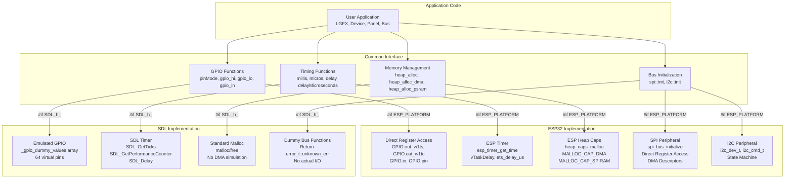

**Platform Selection via Conditional Compilation**

Sources: [src/lgfx/v1/platforms/esp32/common.cpp:18](), [src/lgfx/v1/platforms/sdl/common.cpp:21-25]()

---

## ESP32 Platform Implementation

The ESP32 platform provides direct hardware access through register manipulation and ESP-IDF APIs. It supports multiple chip variants (ESP32, S2, S3, C3, C6, P4) with conditional compilation adjusting for peripheral differences.

### GPIO Control

GPIO operations use direct register access for maximum performance, avoiding function call overhead. The abstraction provides consistent pin control across all ESP32 variants despite register layout differences.

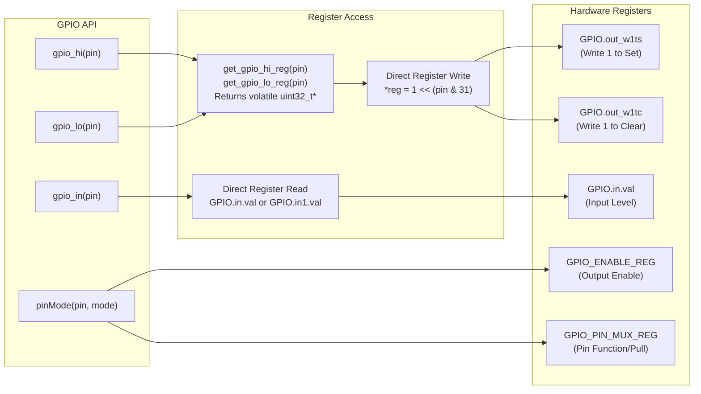

**GPIO Operations - Direct Register Access**

| Function | Purpose | Implementation |
|----------|---------|----------------|
| `pinMode(pin, mode)` | Configure pin direction and pull resistors | Sets IO_MUX registers, GPIO enable, and pad driver mode |
| `gpio_hi(pin)` | Set pin HIGH | `*get_gpio_hi_reg(pin) = 1 << (pin & 31)` |
| `gpio_lo(pin)` | Set pin LOW | `*get_gpio_lo_reg(pin) = 1 << (pin & 31)` |
| `gpio_in(pin)` | Read pin level | `GPIO.in.val & (1 << (pin & 31))` (or `GPIO.in1.val` for pins 32-63) |

**Chip-Specific Register Selection:**

- **ESP32, S2, S3, P4**: Use `GPIO.out_w1ts`/`GPIO.out_w1tc` for pins 0-31, `GPIO.out1_w1ts`/`GPIO.out1_w1tc` for pins 32+
- **ESP32-C3, C6**: Single GPIO bank, no `out1` registers
- Pin masking uses `(pin & 31)` to extract bit position within 32-bit register

Sources: [src/lgfx/v1/platforms/esp32/common.hpp:142-158](), [src/lgfx/v1/platforms/esp32/common.cpp:335-398]()

### Pin Backup and Restore

The `gpio::pin_backup_t` class saves and restores complete GPIO pin configuration, used by bus drivers to temporarily reconfigure pins without disrupting other subsystems.

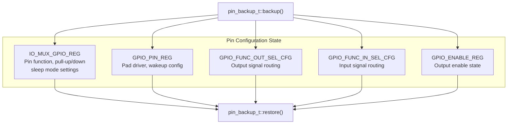

**Pin Backup/Restore Mechanism**

Sources: [src/lgfx/v1/platforms/esp32/common.hpp:272-290](), [src/lgfx/v1/platforms/esp32/common.cpp:404-479]()

### Timing Functions

Timing functions use ESP-IDF's high-resolution timer (`esp_timer_get_time()`) for microsecond accuracy and FreeRTOS task delays for millisecond delays.

| Function | Implementation | Accuracy |
|----------|----------------|----------|
| `millis()` | `esp_timer_get_time() / 1000ULL` | 1 ms |
| `micros()` | `esp_timer_get_time()` | 1 μs |
| `delayMicroseconds(us)` | `ets_delay_us(us)` or `esp_rom_delay_us(us)` (IDF v5+) | Busy-wait, ~1 μs |
| `delay(ms)` | `vTaskDelay()` with correction for sub-tick delays | FreeRTOS tick period (typically 1-10 ms) |

**Delay Implementation Strategy:**
- Short delays (<8 ticks): Use `vTaskDelay()` + `delayMicroseconds()` correction for accuracy
- Long delays (≥8 ticks): Pure `vTaskDelay()` to yield CPU to other tasks
- `delayMicroseconds()`: Busy-wait loop, does not yield

Sources: [src/lgfx/v1/platforms/esp32/common.hpp:88-111]()

### Memory Management

Memory allocation functions provide DMA-capable and PSRAM-specific allocation through ESP-IDF's heap capabilities API.

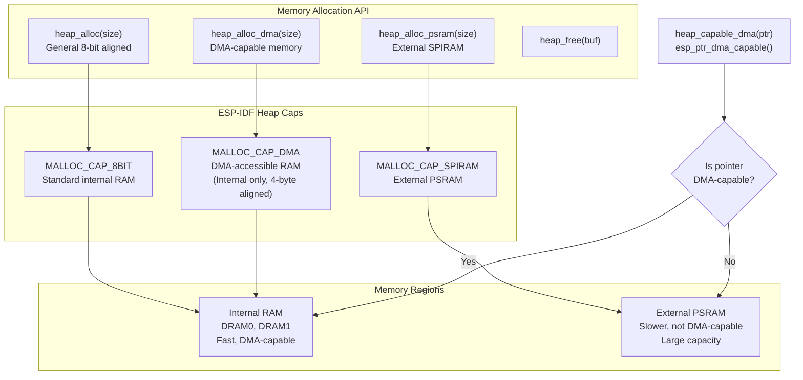

**Memory Allocation Functions**

| Function | Capability Flags | Alignment | Use Case |
|----------|------------------|-----------|----------|
| `heap_alloc(size)` | `MALLOC_CAP_8BIT` | 1 byte | General allocations |
| `heap_alloc_dma(size)` | `MALLOC_CAP_DMA` | 4 bytes | DMA descriptors, SPI/I2C buffers |
| `heap_alloc_psram(size)` | `MALLOC_CAP_SPIRAM \| MALLOC_CAP_8BIT` | 4 bytes | Large sprite buffers, framebuffers |
| `heap_capable_dma(ptr)` | N/A (query) | N/A | Check if pointer is DMA-capable |

**DMA Compatibility:**
- Only internal SRAM is DMA-capable
- PSRAM buffers require copy to internal RAM before DMA transfer
- `FlipBuffer` class in `Bus_SPI` manages this automatically

Sources: [src/lgfx/v1/platforms/esp32/common.hpp:113-120]()

### Clock Management

Clock management functions calculate SPI/I2C clock dividers and determine APB bus frequency, which varies based on CPU speed and power management.

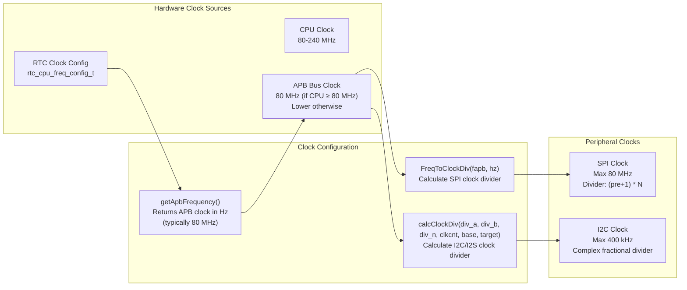

**Clock Calculation Functions**

| Function | Purpose | Algorithm |
|----------|---------|-----------|
| `getApbFrequency()` | Get current APB bus frequency | Reads `rtc_cpu_freq_config_t`, returns 80 MHz if CPU ≥ 80 MHz |
| `FreqToClockDiv(fapb, hz)` | Calculate SPI clock register value | Combines pre-scaler and divider into 32-bit register value |
| `calcClockDiv(...)` | Calculate fractional divider for I2C/I2S | Iterative optimization to minimize frequency error |

**SPI Clock Divider Encoding (32-bit register value):**
- Bits 0-5: `N` (divider, 1-64)
- Bits 6-11: `(N-1)/2` (half-cycle high)
- Bits 12-17: `N` (full cycle length)
- Bits 18-23: Pre-scaler (0-63)

Sources: [src/lgfx/v1/platforms/esp32/common.cpp:188-251]()

### DMA Channel Discovery

For ESP32-S3, C3, C6, P4 (GDMA-based chips), M5GFX must discover which GDMA channel is assigned to the SPI peripheral by the ESP-IDF driver. This is necessary because the channel is not known at compile time.

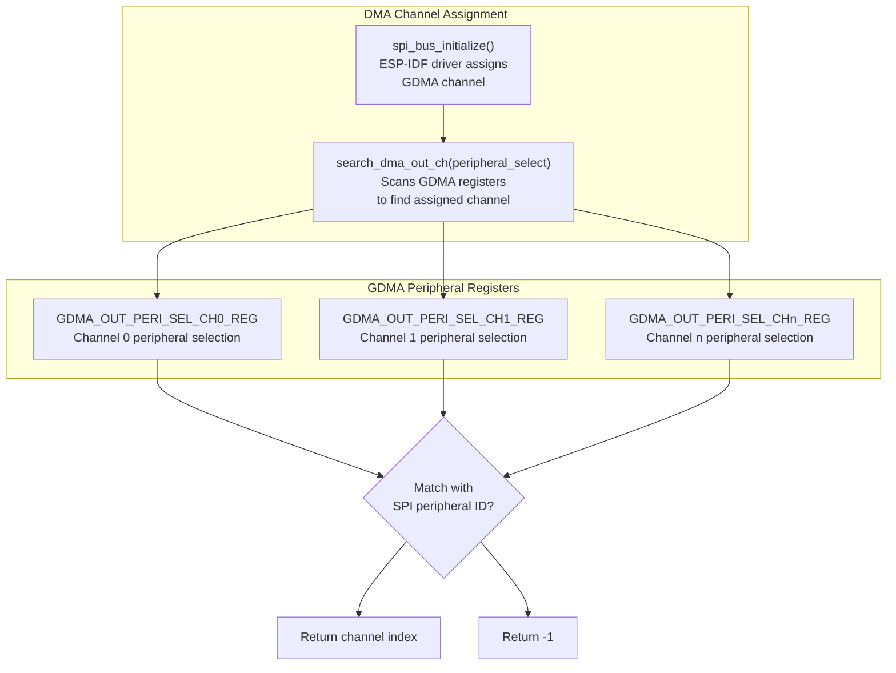

**GDMA Channel Search Algorithm**

For chips with GDMA support (S3, C3, C6, P4):
1. Loop through all GDMA channel registers (0 to `SOC_GDMA_PAIRS_PER_GROUP_MAX`)
2. Read `DMA_OUT_PERI_SEL_CHn_REG` register for each channel
3. Compare against target peripheral ID (e.g., `SOC_GDMA_TRIG_PERIPH_SPI2 = 0`)
4. Return matching channel index, or -1 if not found

This allows M5GFX to directly access DMA registers for high-performance transfers.

Sources: [src/lgfx/v1/platforms/esp32/common.cpp:270-320]()

---

## ESP32 SPI Bus Implementation

The `Bus_SPI` class provides high-performance SPI communication with DMA support, direct register access, and platform-specific optimizations. It bypasses ESP-IDF's transaction APIs for maximum throughput.

### SPI Register Access Strategy

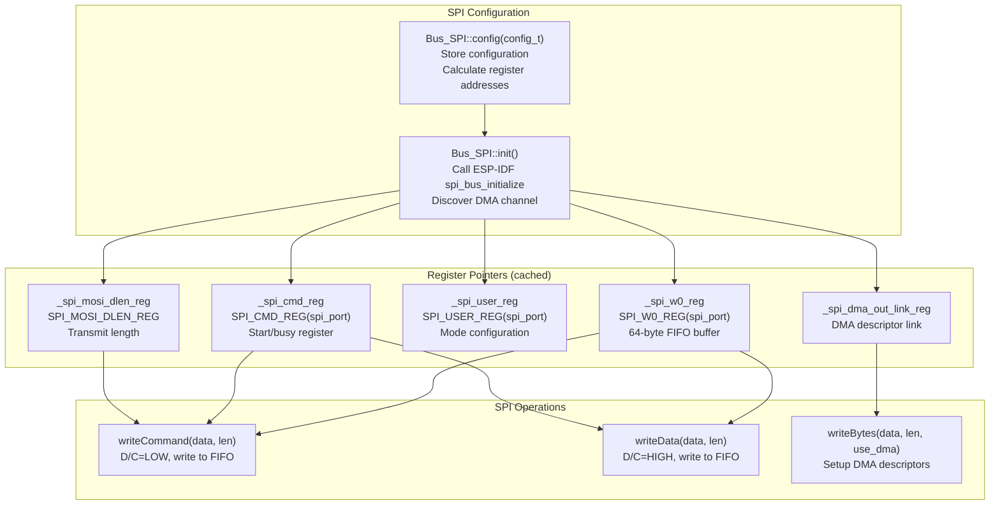

**SPI Register Caching for Performance**

The `Bus_SPI` class caches register addresses as `volatile uint32_t*` pointers during initialization, avoiding repeated address calculations. This optimization is critical for high-speed pixel streaming.

**Key Registers:**
- `SPI_W0_REG` through `SPI_W15_REG`: 64-byte FIFO buffer (16 x 32-bit words)
- `SPI_CMD_REG`: Contains `SPI_USR` bit to start transaction, polled for busy status
- `SPI_MOSI_DLEN_REG`: Sets transmit bit length minus 1
- `SPI_USER_REG`: Configures full-duplex, half-duplex, MISO, MOSI, HIGHPART buffer usage

Sources: [src/lgfx/v1/platforms/esp32/Bus_SPI.hpp:139-176](), [src/lgfx/v1/platforms/esp32/Bus_SPI.cpp:113-155]()

### FIFO and HIGHPART Double Buffering

ESP32 (non-C3/S3) uses the HIGHPART feature to achieve double buffering within the 64-byte SPI FIFO. While the hardware sends the first 32 bytes, software prepares the next 32 bytes in the upper half.

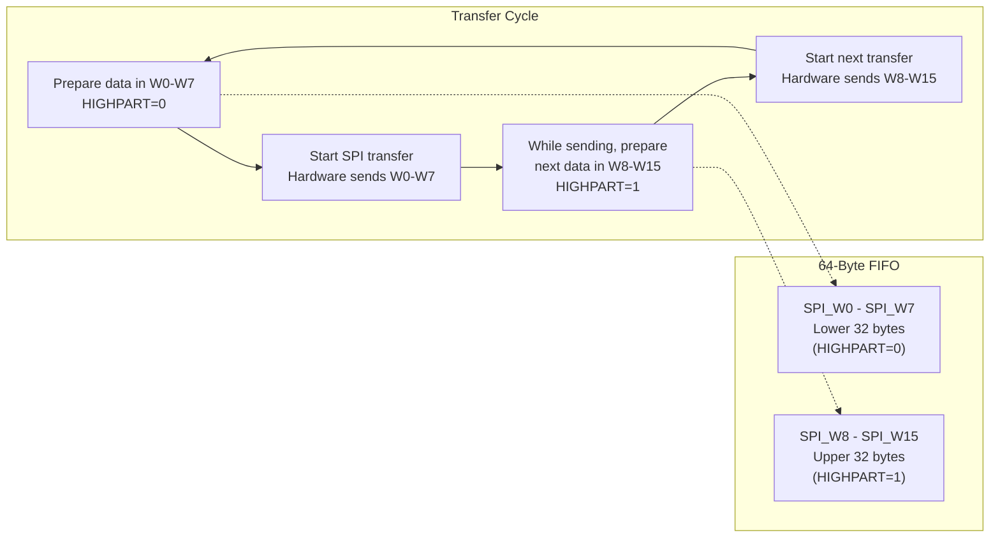

**HIGHPART Double Buffering (ESP32 only)**

The `SPI_USR_MOSI_HIGHPART` bit in `SPI_USER_REG` selects between the lower 32 bytes (0) or upper 32 bytes (1) of the FIFO. By alternating this bit, the driver achieves pipelining:
- Cycle 1: Send W0-W7, prepare W8-W15
- Cycle 2: Send W8-W15, prepare W0-W7
- Repeat

ESP32-C3 and S3 lack this feature, requiring full FIFO waits between transfers.

Sources: [src/lgfx/v1/platforms/esp32/Bus_SPI.cpp:583-625](), [src/lgfx/v1/platforms/esp32/Bus_SPI.cpp:779-820]()

### DMA Descriptor Chain

For large transfers (>64 bytes), the SPI driver uses DMA with linked descriptor chains. Each descriptor points to a data buffer and the next descriptor.

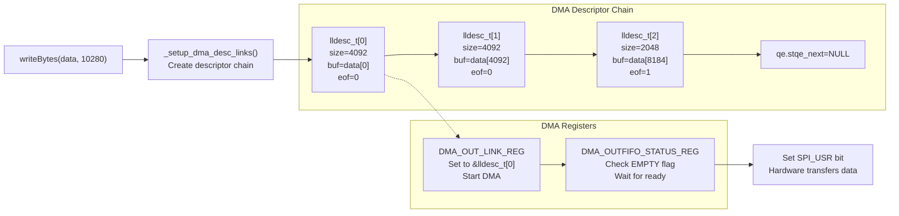

**DMA Descriptor Structure (`lldesc_t`)**

| Field | Type | Purpose |
|-------|------|---------|
| `size` | `uint32_t:12` | Physical buffer size (max 4092 bytes) |
| `length` | `uint32_t:12` | Actual data length |
| `offset` | `uint32_t:5` | Buffer offset (unused) |
| `sosf` | `uint32_t:1` | Start of sub-frame |
| `eof` | `uint32_t:1` | End of frame (last descriptor) |
| `owner` | `uint32_t:1` | DMA ownership (always 1) |
| `buf` | `uint8_t*` | Pointer to data buffer (must be DMA-capable) |
| `qe.stqe_next` | `lldesc_t*` | Pointer to next descriptor (NULL for last) |

**DMA Transfer Limits:**
- Max descriptor size: 4092 bytes (12-bit size field, 4-byte alignment)
- Total transfer length: Up to 512 KB on ESP32, 64 KB on C3/S3 (`SPI_MS_DATA_BITLEN`)
- Automatic descriptor chain creation for lengths > 4092

Sources: [src/lgfx/v1/platforms/esp32/Bus_SPI.cpp:630-735](), [src/lgfx/v1/platforms/esp32/Bus_SPI.cpp:824-939]()

### FlipBuffer for Non-DMA Sources

When source data is in PSRAM or ROM (non-DMA-capable memory), the `FlipBuffer` class provides a small internal RAM buffer for staging data before DMA transfer.

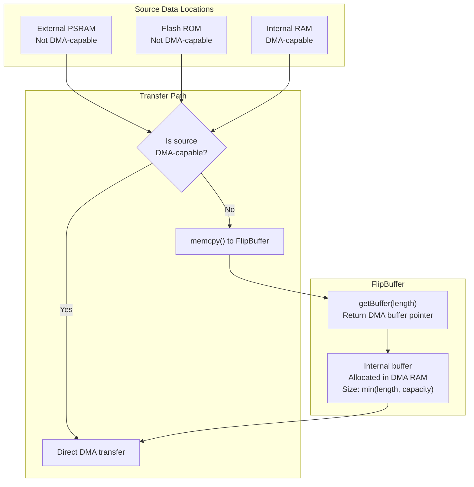

**FlipBuffer Usage Example**

In `Bus_SPI::writeBytes()`, when `use_dma=false` and data is not DMA-capable:
1. Request buffer: `auto buf = _flip_buffer.getBuffer(length)`
2. Copy data: `memcpy(buf, data, length)`
3. Transfer from internal buffer: `writeBytes(buf, length, true, true)`

This avoids the need for large static buffers while maintaining DMA performance.

Sources: [src/lgfx/v1/platforms/esp32/Bus_SPI.cpp:661-671]()

---

## SDL Platform Implementation

The SDL platform provides desktop simulation by emulating hardware through SDL2 APIs. This enables rapid development and debugging without physical hardware.

### Emulated GPIO

SDL implements GPIO as a 64-element array of uint8_t values, providing virtual pins for button emulation and inter-component communication.

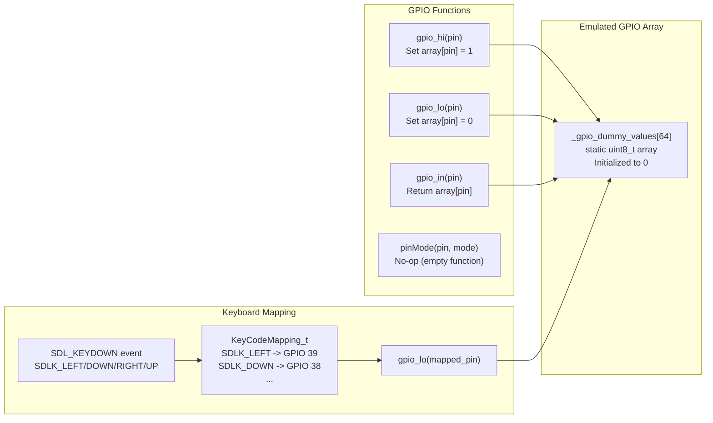

**GPIO Emulation Details**

| Function | Implementation | Notes |
|----------|----------------|-------|
| `pinMode(pin, mode)` | Empty function | No actual pin configuration |
| `gpio_hi(pin)` | `_gpio_dummy_values[pin & 63] = 1` | Sets virtual pin HIGH |
| `gpio_lo(pin)` | `_gpio_dummy_values[pin & 63] = 0` | Sets virtual pin LOW |
| `gpio_in(pin)` | `return _gpio_dummy_values[pin & 63]` | Reads virtual pin state |

**Keyboard-to-GPIO Mapping:**
- Default mappings: LEFT=39, DOWN=38, RIGHT=37, UP=36 (M5Stack button emulation)
- Customizable via `Panel_sdl::addKeyCodeMapping(SDL_KeyCode, gpio)`
- Key press → `gpio_lo(pin)`, Key release → `gpio_hi(pin)` (active-low like physical buttons)

Sources: [src/lgfx/v1/platforms/sdl/common.cpp:36-43](), [src/lgfx/v1/platforms/sdl/Panel_sdl.cpp:64-142]()

### SDL Timing Functions

SDL timing uses high-resolution performance counters for accurate microsecond timekeeping, matching ESP32 behavior.

| Function | Implementation | Resolution |
|----------|----------------|------------|
| `millis()` | `SDL_GetTicks()` | 1 ms |
| `micros()` | `SDL_GetPerformanceCounter() / (SDL_GetPerformanceFrequency() / 1000000)` | ~1 μs |
| `delay(ms)` | `SDL_Delay(ms)` or `delayMicroseconds(ms * 1000)` | OS-dependent |
| `delayMicroseconds(us)` | `SDL_Delay((us / 1000) - 1)` + spin-wait loop | ~100 μs |

**Delay Implementation:**
- Short delays (<2 ms): Spin-wait with `std::this_thread::yield()`
- Long delays (≥2 ms): `SDL_Delay()` to yield to OS scheduler
- Accuracy limited by OS scheduler granularity (typically 1-16 ms)

Sources: [src/lgfx/v1/platforms/sdl/common.cpp:45-78]()

### Dummy Bus Functions

SDL platform provides stub implementations for SPI and I2C functions that return error codes, as no actual hardware communication occurs in desktop simulation.

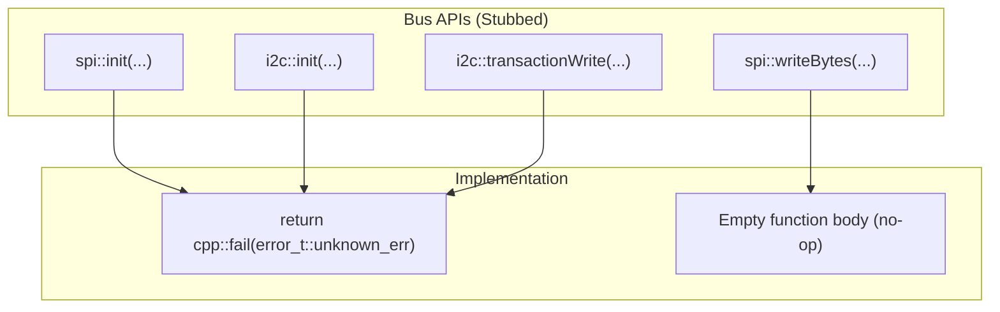

**Dummy Bus Function Table**

All bus functions either return `cpp::fail(error_t::unknown_err)` or perform no operation:

- `spi::init()` → Returns error
- `spi::release()` → No-op
- `spi::beginTransaction()` → No-op
- `spi::endTransaction()` → No-op
- `spi::writeBytes()` → No-op
- `spi::readBytes()` → No-op
- `i2c::init()` → Returns error
- `i2c::beginTransaction()` → Returns error
- `i2c::writeBytes()` → Returns error
- `i2c::readBytes()` → Returns error

This allows panel code to call bus functions without conditional compilation, with the understanding that actual I/O is handled by `Panel_sdl` at the framebuffer level.

Sources: [src/lgfx/v1/platforms/sdl/common.cpp:82-112]()

---

## Conditional Compilation Strategy

Platform selection uses preprocessor directives to include the appropriate implementation at compile time. The selection hierarchy is:

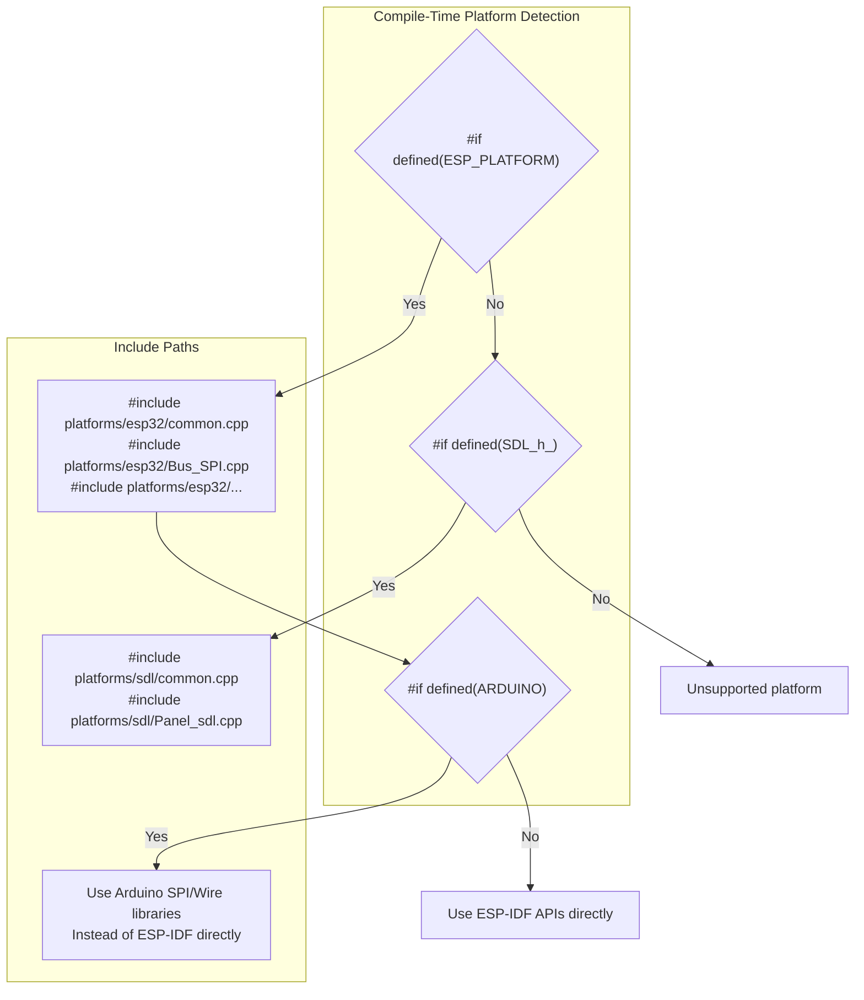

**Platform Selection Logic**

1. **ESP32 Detection**: `#if defined (ESP_PLATFORM)` at [src/lgfx/v1/platforms/esp32/common.cpp:18]()
2. **SDL Detection**: `#if defined (SDL_h_)` at [src/lgfx/v1/platforms/sdl/common.cpp:25]()
3. **Arduino Framework**: `#if defined (ARDUINO)` enables Arduino-specific includes (SPI.h, Wire.h)
4. **Chip Variant**: `CONFIG_IDF_TARGET_*` defines select ESP32/S2/S3/C3/C6/P4 specific code

**Example: GPIO Function Selection**

```cpp
// ESP32 implementation (common.cpp)
#if defined (ESP_PLATFORM)
static inline void gpio_hi(int_fast8_t pin) { 
    if (pin >= 0) *get_gpio_hi_reg(pin) = 1 << (pin & 31); 
}
#endif

// SDL implementation (common.cpp)
#if defined (SDL_h_)
void gpio_hi(uint32_t pin) { 
    _gpio_dummy_values[pin & (EMULATED_GPIO_MAX - 1)] = 1; 
}
#endif
```

Both implementations provide identical function signatures, ensuring source-level compatibility.

Sources: [src/lgfx/v1/platforms/esp32/common.cpp:18](), [src/lgfx/v1/platforms/sdl/common.cpp:21-25]()

---

## Platform-Specific Optimizations

### ESP32: Register-Level Access vs Driver APIs

M5GFX bypasses ESP-IDF driver APIs for performance-critical paths, using direct register writes instead of function calls. This reduces overhead from ~50 cycles per SPI byte to ~10 cycles.

**Performance Comparison:**

| Operation | ESP-IDF API | Direct Register | Speedup |
|-----------|-------------|-----------------|---------|
| Write 1 byte to SPI | `spi_device_transmit()` (~500 cycles) | `*SPI_W0_REG = data; *SPI_CMD_REG = SPI_USR;` (~10 cycles) | 50x |
| Set GPIO pin | `gpio_set_level()` (~30 cycles) | `*GPIO.out_w1ts = mask;` (~3 cycles) | 10x |
| Start DMA transfer | `spi_device_queue_trans()` (~200 cycles) | `*DMA_OUT_LINK_REG = addr; *SPI_CMD_REG = SPI_USR;` (~15 cycles) | 13x |

**Trade-off:** Direct register access requires careful management of peripheral state and lacks safety checks present in driver APIs.

Sources: [src/lgfx/v1/platforms/esp32/Bus_SPI.cpp:313-354]()

### ESP32: Cache Coherency with PSRAM

When using PSRAM for framebuffers or sprite data, explicit cache writeback is required before DMA operations to ensure data consistency.

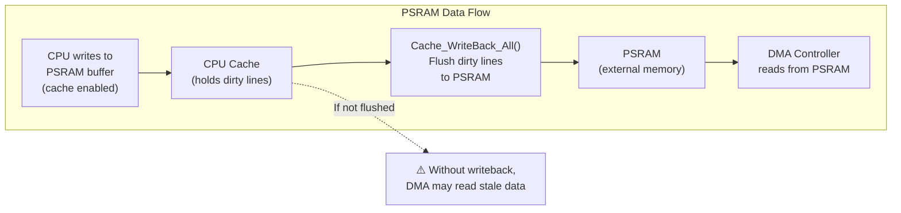

**Cache Management in M5GFX:**
- Before DMA from PSRAM: `Cache_WriteBack_All()` or `esp_rom_cache_writeback_all()` (IDF v5+)
- After DMA to PSRAM: Cache invalidation not typically required (display is write-only)
- Automatic handling in `Panel_FrameBufferBase` when `_lines_buffer` is PSRAM-allocated

This issue is unique to ESP32 with PSRAM; internal RAM does not use cache.

Sources: Referenced in DMA operations, common pattern in ESP-IDF applications

---

## Common Interface Patterns

Both platforms implement the same interface patterns to ensure code portability.

### Error Handling with cpp::result

Platform functions use the `cpp::result<T, error_t>` type for error handling, providing type-safe success/failure returns without exceptions.

```cpp
// Function signature
cpp::result<void, error_t> init(int i2c_port, int pin_sda, int pin_scl);

// Usage
auto result = i2c::init(0, 21, 22);
if (result.has_value()) {
    // Success
} else {
    error_t err = result.error();
    // Handle error
}
```

**Error Types (from enum.hpp):**
- `error_t::connection_lost` - Communication failure
- `error_t::unknown_err` - Generic error (SDL stub functions)
- Success returns: `cpp::result<void, error_t>{}` or `{}`

Sources: [src/lgfx/v1/platforms/esp32/common.hpp:312-314](), [src/lgfx/v1/platforms/sdl/common.cpp:84-111]()

### Namespace Organization

Platform code is organized into functional namespaces within the `lgfx::v1` namespace:

| Namespace | Purpose | Key Functions |
|-----------|---------|---------------|
| `lgfx::v1::` (global) | GPIO, timing, memory | `gpio_hi`, `gpio_lo`, `millis`, `micros`, `heap_alloc` |
| `lgfx::v1::gpio` | Pin management utilities | `pin_backup_t`, `command()` |
| `lgfx::v1::spi` | SPI bus initialization | `init()`, `beginTransaction()`, `endTransaction()` |
| `lgfx::v1::i2c` | I2C bus management | `init()`, `setPins()`, `transactionWrite()` |

This structure allows `using namespace lgfx::v1;` to bring all platform functions into scope without polluting the global namespace.

Sources: [src/lgfx/v1/platforms/esp32/common.hpp:82-345]()

---

## Platform Detection at Runtime

In addition to compile-time selection, ESP32 code includes runtime chip detection for handling variant-specific features.

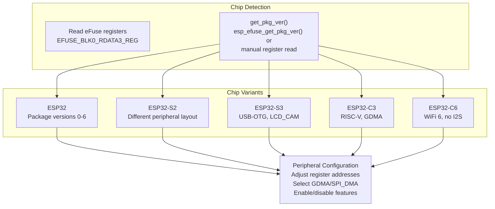

**Chip Detection Function:**

```cpp
uint32_t get_pkg_ver(void)
{
#if defined ( USE_ESP_EFUSE_GET_PKG_VER )
    return esp_efuse_get_pkg_ver();
#else
    uint32_t pkg_ver = REG_GET_FIELD(EFUSE_BLK0_RDATA3_REG, EFUSE_RD_CHIP_VER_PKG);
    // Special handling for ESP32PICOD4 variants
    if (pkg_ver == EFUSE_RD_CHIP_VER_PKG_ESP32PICOD4) {
        if (REG_READ(APB_CTRL_DATE_REG) & 0x80000000) {
            return 6;  // ESP32PICOV302
        }
    }
    return pkg_ver;
#endif
}
```

**Usage:**
- M5GFX autodetect uses `get_pkg_ver()` to identify device type
- Peripheral code uses `CONFIG_IDF_TARGET_*` defines for compile-time selection
- Combined approach allows single binary to detect chip at runtime while optimizing for known targets

Sources: [src/lgfx/v1/platforms/esp32/common.cpp:253-268]()

---

## Summary: Platform Abstraction Benefits

The Platform Abstraction Layer provides:

1. **Single Codebase**: Application code compiles unchanged for ESP32 or SDL
2. **Performance**: Direct register access on ESP32 for maximum throughput
3. **Development Speed**: SDL simulation enables rapid prototyping without hardware
4. **Hardware Flexibility**: Supports 6 ESP32 chip variants with runtime/compile-time detection
5. **Type Safety**: `cpp::result<>` error handling without exceptions
6. **Resource Management**: `pin_backup_t`, `heap_alloc_dma()`, DMA channel discovery
7. **Debugging**: SDL platform includes debugger detection and step-execution support

This abstraction is the foundation enabling M5GFX's "write once, run everywhere" philosophy for embedded graphics development.

Sources: All files in [src/lgfx/v1/platforms/]()