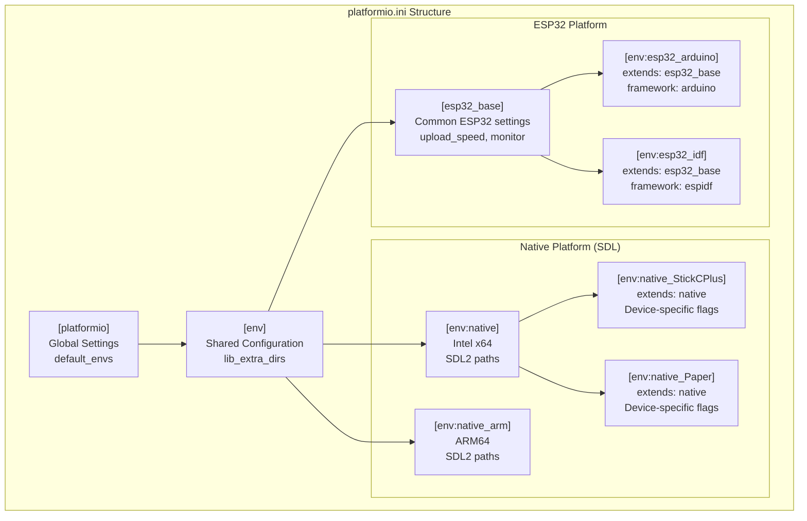
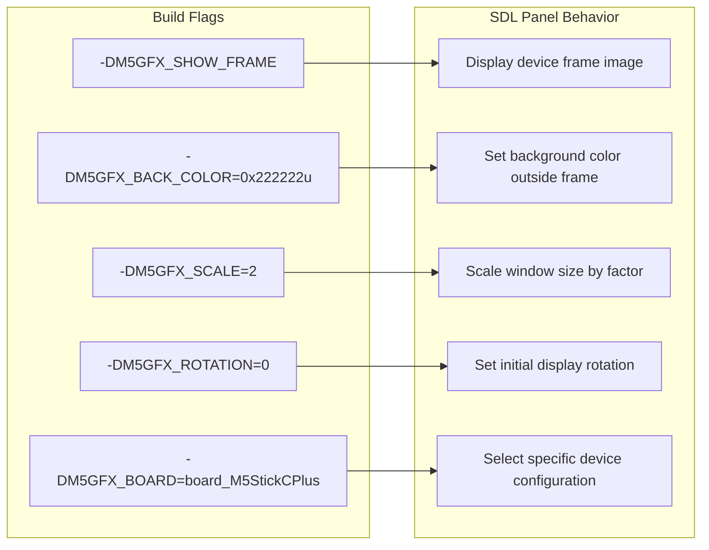
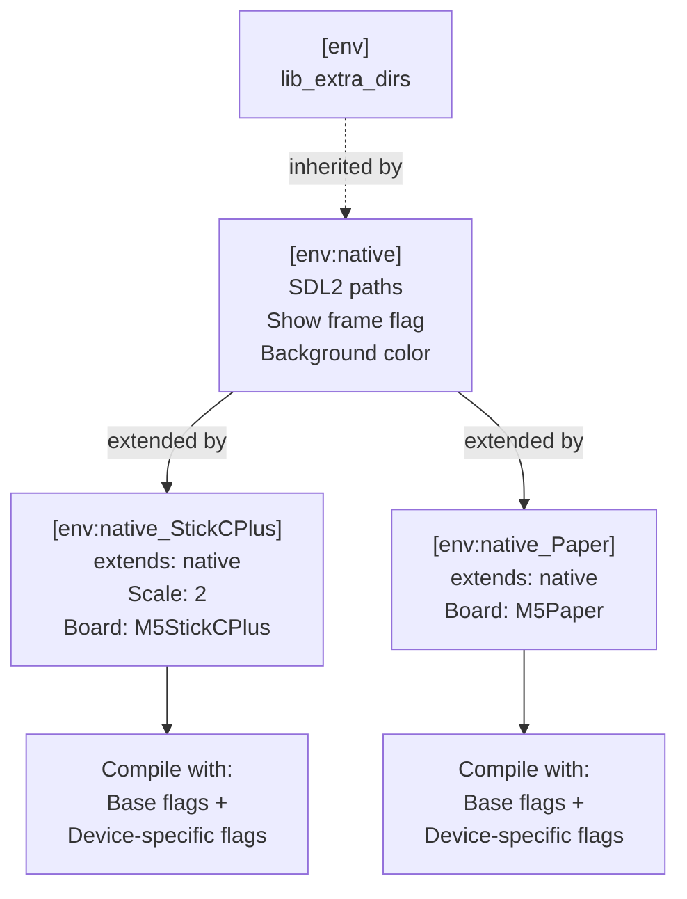
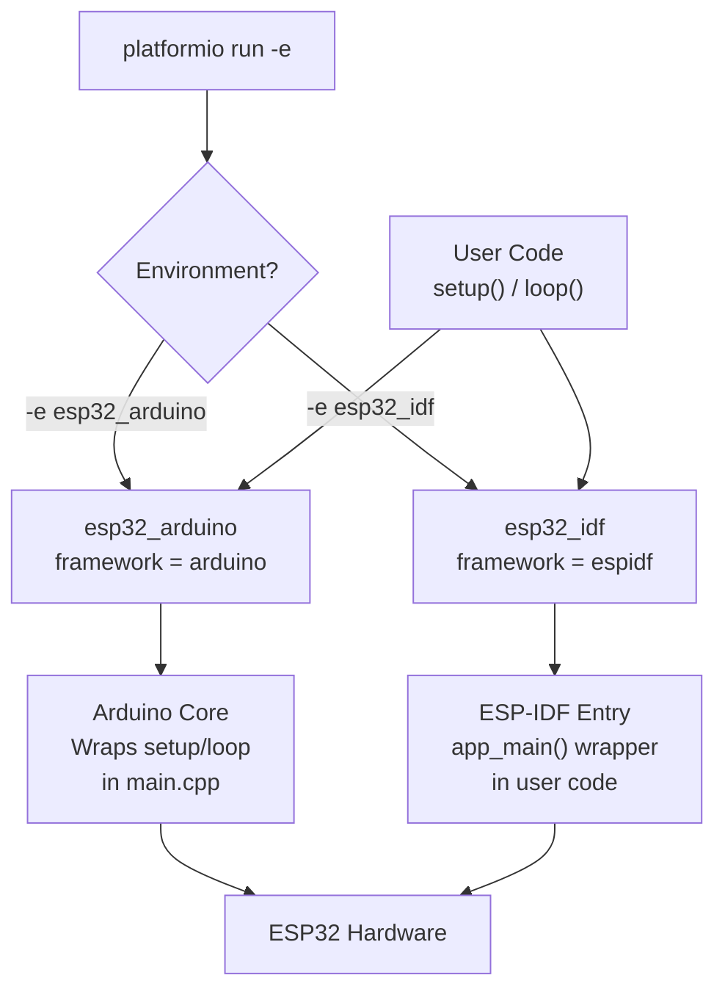
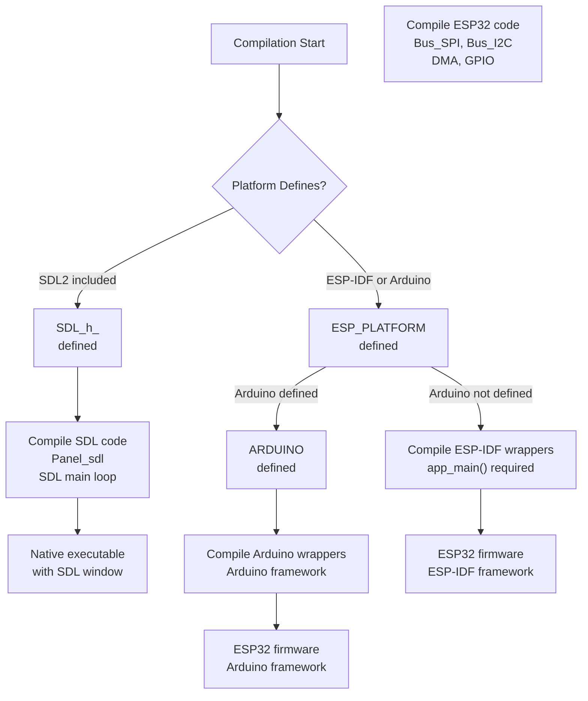

M5GFX PlatformIO Project Configuration

# PlatformIO Project Configuration

<details>
<summary>Relevant source files</summary>

The following files were used as context for generating this wiki page:

- [README.md](README.md)
- [examples/PlatformIO_SDL/README.md](examples/PlatformIO_SDL/README.md)
- [examples/PlatformIO_SDL/platformio.ini](examples/PlatformIO_SDL/platformio.ini)
- [examples/PlatformIO_SDL/src/sdl_main.cpp](examples/PlatformIO_SDL/src/sdl_main.cpp)
- [examples/PlatformIO_SDL/src/user_code.cpp](examples/PlatformIO_SDL/src/user_code.cpp)
- [idf_component.yml](idf_component.yml)
- [library.json](library.json)
- [library.properties](library.properties)
- [src/lgfx/v1/gitTagVersion.h](src/lgfx/v1/gitTagVersion.h)

</details>


This document explains the `platformio.ini` configuration file structure used in M5GFX projects, detailing how build environments are organized to support multiple platforms (ESP32 and SDL desktop simulation), frameworks (Arduino and ESP-IDF), and device-specific configurations. The configuration enables cross-platform development with a single codebase.

For library metadata and version management, see [Library Configuration and Versioning](#6.1). For detailed SDL setup instructions and development workflow, see [SDL Development Workflow](#6.3). For patterns to write cross-platform compatible code, see [Cross-Platform Code Patterns](#6.4).

## PlatformIO Configuration File Structure

The `platformio.ini` file defines build environments through sections that specify platform, framework, build flags, and dependencies. M5GFX uses a hierarchical configuration with base sections that are extended by specific environments.

**Configuration File Organization**



Sources: [examples/PlatformIO_SDL/platformio.ini:1-67]()

## Global Settings Section

The `[platformio]` section defines workspace-level defaults that apply across all build commands.

```ini
[platformio]
default_envs = native
```

| Setting | Purpose |
|---------|---------|
| `default_envs` | Specifies which environment to build when no `-e` flag is provided. Set to `native` for SDL desktop simulation by default |

The `[env]` section provides configuration inherited by all environments:

```ini
[env]
lib_extra_dirs=../../../
```

| Setting | Purpose |
|---------|---------|
| `lib_extra_dirs` | Additional directories to search for libraries. The path `../../../` points to the M5GFX library root from the example project |

Sources: [examples/PlatformIO_SDL/platformio.ini:11-15]()

## Native Platform Environments for SDL

Native platform environments compile for desktop execution using SDL2 for display simulation. Two variants exist to support different processor architectures.

### Intel x64 Environment

```ini
[env:native]
platform = native
build_type = debug
build_flags = -O0 -xc++ -std=c++14 -lSDL2
  -I"/usr/local/include/SDL2"
  -L"/usr/local/lib"
  -DM5GFX_SHOW_FRAME
  -DM5GFX_BACK_COLOR=0x222222u
```

| Configuration | Value | Purpose |
|---------------|-------|---------|
| `platform` | `native` | Builds for host system (Windows, Linux, macOS) |
| `build_type` | `debug` | Includes debug symbols, disables optimizations |
| `-O0` | Optimization level 0 | No optimization for easier debugging |
| `-xc++` | Language mode | Forces C++ compilation |
| `-std=c++14` | C++ standard | Requires C++14 features |
| `-lSDL2` | Linker flag | Links against SDL2 library |
| `-I` | Include path | SDL2 header location for Intel Mac Homebrew |
| `-L` | Library path | SDL2 library location for Intel Mac Homebrew |

Sources: [examples/PlatformIO_SDL/platformio.ini:17-25]()

### ARM64 Environment

```ini
[env:native_arm]
platform = native
build_type = debug
build_flags = -O0 -xc++ -std=c++14 -lSDL2
  -arch arm64
  -I"${sysenv.HOMEBREW_PREFIX}/include/SDL2"
  -L"${sysenv.HOMEBREW_PREFIX}/lib"
  -DM5GFX_SHOW_FRAME
  -DM5GFX_BACK_COLOR=0x222222u
```

Key differences from Intel x64:
- `-arch arm64`: Specifies ARM64 architecture for Apple Silicon
- `${sysenv.HOMEBREW_PREFIX}`: Uses environment variable for Homebrew prefix (typically `/opt/homebrew` on ARM Macs vs `/usr/local` on Intel)

Sources: [examples/PlatformIO_SDL/platformio.ini:26-34]()

## M5GFX-Specific Build Flags

M5GFX uses preprocessor definitions to control SDL simulation behavior and device selection.

**SDL Simulation Control Flags**



| Flag | Type | Purpose | Example Values |
|------|------|---------|----------------|
| `M5GFX_SHOW_FRAME` | Boolean | Display device frame border in SDL window | Defined or undefined |
| `M5GFX_BACK_COLOR` | Color value | Background color outside device frame | `0x222222u` (dark gray) |
| `M5GFX_SCALE` | Integer | Window scaling factor for high-DPI displays | `1`, `2`, `3` |
| `M5GFX_ROTATION` | Integer | Initial rotation (0-7) | `0` (portrait), `1` (landscape), etc. |
| `M5GFX_BOARD` | Board type | Simulate specific M5Stack device | `board_M5StickCPlus`, `board_M5Paper` |

These flags are processed by the SDL panel implementation to configure the simulation window appearance and behavior.

Sources: [examples/PlatformIO_SDL/platformio.ini:23-24,33-34,40-42,48-49]()

## Device-Specific Simulation Environments

Pre-configured environments simulate specific M5Stack devices with appropriate display dimensions, scaling, and rotation.

### M5StickC Plus Simulation

```ini
[env:native_StickCPlus]
extends = native
platform = native
build_flags = ${env:native.build_flags}
  -DM5GFX_SCALE=2
  -DM5GFX_ROTATION=0
  -DM5GFX_BOARD=board_M5StickCPlus
```

- Inherits base `native` environment configuration using `extends`
- Appends device-specific flags to `${env:native.build_flags}`
- `M5GFX_SCALE=2`: Doubles window size for 135x240 display
- `M5GFX_ROTATION=0`: Portrait orientation
- `M5GFX_BOARD=board_M5StickCPlus`: Loads M5StickC Plus panel configuration

### M5Paper Simulation

```ini
[env:native_Paper]
extends = native
platform = native
build_flags = ${env:native.build_flags}
  -DM5GFX_ROTATION=0
  -DM5GFX_BOARD=board_M5Paper
```

- Configured for 960x540 e-paper display
- No scaling factor (default is 1x due to large display)
- Enables e-paper specific rendering behavior

**Environment Inheritance Pattern**



This pattern allows creating new device simulations by extending `native` and adding only device-specific flags.

Sources: [examples/PlatformIO_SDL/platformio.ini:36-49]()

## ESP32 Platform Environments

ESP32 environments compile for embedded hardware using either Arduino or ESP-IDF framework.

### ESP32 Base Configuration

```ini
[esp32_base]
build_type = debug
platform = espressif32
board = esp32dev
upload_speed = 1500000
monitor_speed = 115200
monitor_filters = esp32_exception_decoder
```

| Setting | Value | Purpose |
|---------|-------|---------|
| `platform` | `espressif32` | Uses Espressif ESP32 platform |
| `board` | `esp32dev` | Generic ESP32 development board |
| `upload_speed` | `1500000` | Serial upload baud rate (1.5 Mbps) |
| `monitor_speed` | `115200` | Serial monitor baud rate |
| `monitor_filters` | `esp32_exception_decoder` | Decodes ESP32 crash backtraces |

Note: `[esp32_base]` is not prefixed with `env:`, making it a reusable template section that cannot be built directly.

Sources: [examples/PlatformIO_SDL/platformio.ini:51-57]()

### Arduino Framework Environment

```ini
[env:esp32_arduino]
extends = esp32_base
framework = arduino
```

- Extends `esp32_base` configuration
- Uses Arduino framework with `setup()` and `loop()` functions
- Includes Arduino core libraries and APIs
- Compatible with Arduino IDE libraries

### ESP-IDF Framework Environment

```ini
[env:esp32_idf]
extends = esp32_base
framework = espidf
```

- Extends `esp32_base` configuration  
- Uses native ESP-IDF framework
- Requires `app_main()` entry point instead of `setup()/loop()`
- Provides direct access to FreeRTOS and ESP-IDF APIs

**Framework Selection Flow**



The ESP-IDF environment requires an `app_main()` wrapper as shown in [examples/PlatformIO_SDL/src/user_code.cpp:18-29]():

```cpp
#if defined ( ESP_PLATFORM ) && !defined ( ARDUINO )
extern "C" {
int app_main(int, char**)
{
    setup();
    for (;;) {
      loop();
    }
    return 0;
}
}
#endif
```

Sources: [examples/PlatformIO_SDL/platformio.ini:59-66](), [examples/PlatformIO_SDL/src/user_code.cpp:18-29]()

## Platform Detection and Conditional Compilation

Build flags control which platform-specific code is compiled through preprocessor directives.

**Platform Detection Mechanism**



The SDL main entry point uses conditional compilation in [examples/PlatformIO_SDL/src/sdl_main.cpp:2-25]():

```cpp
#include <M5GFX.h>
#if defined ( SDL_h_ )

void setup(void);
void loop(void);

__attribute__((weak))
int user_func(bool* running)
{
  setup();
  do
  {
    loop();
  } while (*running);
  return 0;
}

int main(int, char**)
{
  // The second argument is effective for step execution with breakpoints.
  return lgfx::Panel_sdl::main(user_func, 128);
}

#endif
```

The `SDL_h_` define is automatically present when SDL2 headers are included. The `lgfx::Panel_sdl::main()` function handles SDL initialization, window creation, and the event loop.

Sources: [examples/PlatformIO_SDL/src/sdl_main.cpp:1-25](), [examples/PlatformIO_SDL/src/user_code.cpp:18-29]()

## Library Integration with PlatformIO

The `library.json` file defines how M5GFX integrates with PlatformIO's library system.

```json
{
  "name": "M5GFX",
  "description": "Library for M5Stack All Display",
  "frameworks": ["arduino", "espidf", "*"],
  "platforms": ["espressif32", "native"],
  "headers": "M5GFX.h"
}
```

| Field | Value | Integration Effect |
|-------|-------|-------------------|
| `frameworks` | `["arduino", "espidf", "*"]` | Compatible with Arduino, ESP-IDF, and all other frameworks |
| `platforms` | `["espressif32", "native"]` | Supports ESP32 hardware and native desktop builds |
| `headers` | `"M5GFX.h"` | Main include file for the library |

When `lib_extra_dirs` points to the M5GFX directory, PlatformIO automatically includes the library based on these settings.

Sources: [library.json:1-17]()

## Build Command Reference

Common PlatformIO commands for building and uploading with different environments:

| Command | Environment | Purpose |
|---------|-------------|---------|
| `pio run` | `native` (default) | Build SDL desktop executable |
| `pio run -e native` | `native` | Build for Intel x64 |
| `pio run -e native_arm` | `native_arm` | Build for ARM64 (Apple Silicon) |
| `pio run -e native_StickCPlus` | `native_StickCPlus` | Build M5StickC Plus simulation |
| `pio run -e native_Paper` | `native_Paper` | Build M5Paper simulation |
| `pio run -e esp32_arduino` | `esp32_arduino` | Build ESP32 firmware with Arduino |
| `pio run -e esp32_idf` | `esp32_idf` | Build ESP32 firmware with ESP-IDF |
| `pio run -t upload -e esp32_arduino` | `esp32_arduino` | Build and upload to ESP32 |
| `pio run -t upload -e native` | `native` | Build and execute SDL application |

The SDL environments execute the program automatically when using the `upload` target, as there is no physical device to upload to.

Sources: [examples/PlatformIO_SDL/platformio.ini:1-67](), [examples/PlatformIO_SDL/README.md:76-85]()

## Creating Custom Build Environments

To create a new build environment for a different M5Stack device or configuration:

1. **Extend an existing base environment:**

```ini
[env:my_custom_device]
extends = native
platform = native
build_flags = ${env:native.build_flags}
  -DM5GFX_SCALE=1
  -DM5GFX_ROTATION=1
  -DM5GFX_BOARD=board_M5StackCore2
```

2. **Define board-specific parameters:**
   - `M5GFX_BOARD`: Must match a board enumeration value used in the autodetection system
   - `M5GFX_SCALE`: Adjust window size for display resolution
   - `M5GFX_ROTATION`: Set appropriate default rotation

3. **For ESP32 hardware environments:**

```ini
[env:my_esp32_config]
extends = esp32_base
framework = arduino
board = esp32-s3-devkitc-1
build_flags = 
  -DBOARD_HAS_PSRAM
  -DARDUINO_USB_CDC_ON_BOOT=1
```

The environment inheritance system allows reusing common configuration while adding device or framework-specific settings.

Sources: [examples/PlatformIO_SDL/platformio.ini:36-49]()