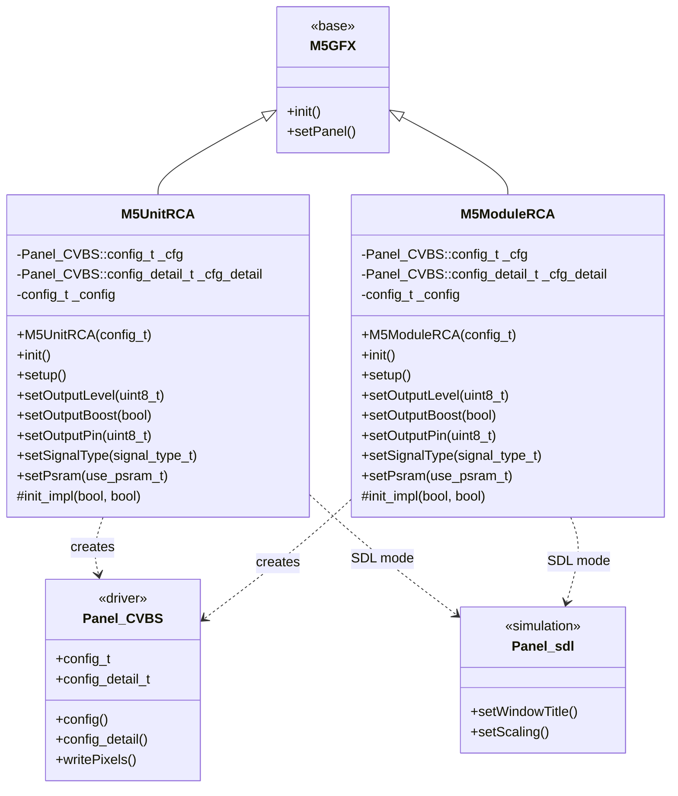
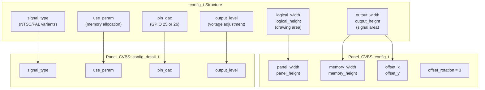
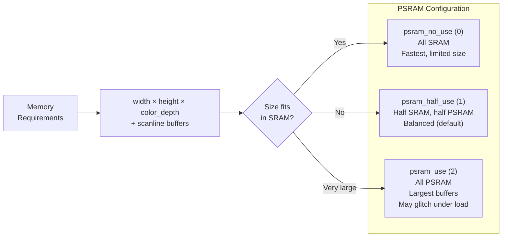
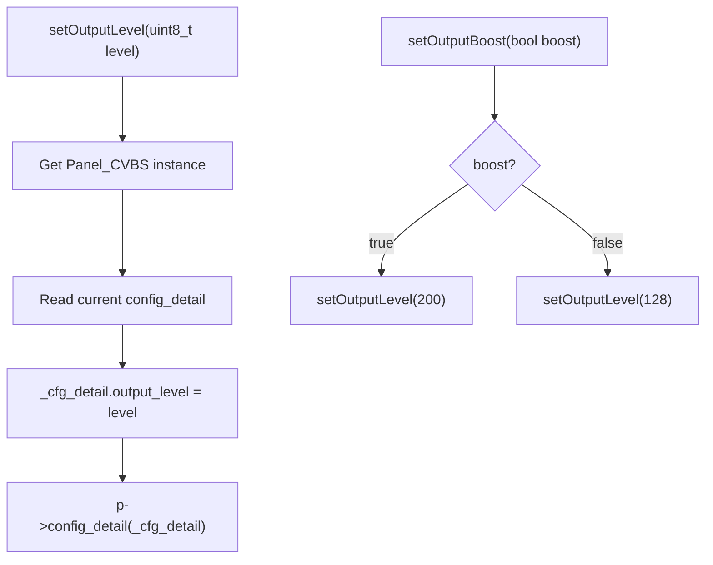

M5GFX RCA and Composite Video Device Classes

# RCA and Composite Video Device Classes

<details>
<summary>Relevant source files</summary>

The following files were used as context for generating this wiki page:

- [src/M5AtomDisplay.h](src/M5AtomDisplay.h)
- [src/M5ModuleDisplay.h](src/M5ModuleDisplay.h)
- [src/M5ModuleRCA.h](src/M5ModuleRCA.h)
- [src/M5UnitRCA.h](src/M5UnitRCA.h)

</details>


## Purpose and Scope

This document describes the `M5UnitRCA` and `M5ModuleRCA` device classes, which provide NTSC/PAL composite video output via ESP32's I2S DAC peripheral. These classes wrap the underlying `Panel_CVBS` driver to enable analog video signal generation on M5Stack hardware.

For HDMI digital video output, see [Atom Display Device Classes](#2.3). For the low-level composite video panel driver implementation, see [Composite Video Panel Driver](#4.4).

## Hardware Overview

### Physical Devices

| Device | Form Factor | GPIO Default | Connection |
|--------|-------------|--------------|------------|
| **Unit RCA** | Grove Unit | GPIO_NUM_26 | Grove port (Port A) |
| **Module RCA** | M5Bus Module | GPIO_NUM_26 | M5Bus connector |

Both devices generate composite video signals using the ESP32's built-in 8-bit DAC. The signal is output through an RCA connector for connection to televisions and monitors with composite video input.

**Hardware Limitations:**
- ESP32 only (ESP32-S3 lacks DAC output)
- GPIO 25 or 26 only (I2S DAC constraint)
- Requires I2S0 peripheral
- Audio not supported (video only)

Sources: [docs/UnitRCA.md:1-19](), [src/M5UnitRCA.h:14-27](), [src/M5ModuleRCA.h:14-27]()

## Class Architecture



Both `M5UnitRCA` and `M5ModuleRCA` inherit from `M5GFX` and have identical implementations. The classes differ only in their board identifier (`board_M5UnitRCA` vs `board_M5ModuleRCA`) and are provided separately for semantic clarity regarding which physical hardware is being used.

Sources: [src/M5UnitRCA.h:51-64](), [src/M5ModuleRCA.h:51-64]()

## Configuration Structure

### Configuration Parameters

**Diagram: Configuration Structure Mapping**



The configuration system uses two levels:

1. **High-level `config_t`** - User-facing parameters with defaults
2. **Low-level Panel configs** - Translated to `Panel_CVBS::config_t` and `Panel_CVBS::config_detail_t`

Sources: [src/M5UnitRCA.h:65-75](), [src/M5ModuleRCA.h:65-75]()

### Default Values

| Parameter | M5UnitRCA Default | M5ModuleRCA Default | Macro |
|-----------|-------------------|---------------------|-------|
| `logical_width` | 216 | 216 | `M5UNITRCA_LOGICAL_WIDTH` / `M5MODULERCA_LOGICAL_WIDTH` |
| `logical_height` | 144 | 144 | `M5UNITRCA_LOGICAL_HEIGHT` / `M5MODULERCA_LOGICAL_HEIGHT` |
| `signal_type` | PAL | PAL | `M5UNITRCA_SIGNAL_TYPE` / `M5MODULERCA_SIGNAL_TYPE` |
| `output_width` | 0 (auto) | 0 (auto) | `M5UNITRCA_OUTPUT_WIDTH` / `M5MODULERCA_OUTPUT_WIDTH` |
| `output_height` | 0 (auto) | 0 (auto) | `M5UNITRCA_OUTPUT_HEIGHT` / `M5MODULERCA_OUTPUT_HEIGHT` |
| `use_psram` | `psram_half_use` | `psram_half_use` | `M5UNITRCA_USE_PSRAM` / `M5MODULERCA_USE_PSRAM` |
| `pin_dac` | GPIO_NUM_26 | GPIO_NUM_26 | `M5UNITRCA_PIN_DAC` / `M5MODULERCA_PIN_DAC` |
| `output_level` | 0 (auto-detect) | 0 (auto-detect) | `M5UNITRCA_OUTPUT_LEVEL` / `M5MODULERCA_OUTPUT_LEVEL` |

When `output_width` or `output_height` is 0 or less than logical dimensions, it defaults to the logical size. Otherwise, the output dimensions create margins around the logical drawing area.

Sources: [src/M5UnitRCA.h:29-49](), [src/M5ModuleRCA.h:29-49]()

## Signal Types and Resolution Limits

### Supported Signal Types

The `signal_type_t` enumeration is defined in `Panel_CVBS::config_detail_t`:

| Signal Type | Region | Black Level | Max Width | Max Height |
|-------------|--------|-------------|-----------|------------|
| `NTSC` | North America | 7.5 IRE | 720 | 480 |
| `NTSC_J` | Japan | 0 IRE | 720 | 480 |
| `PAL` | Europe/Australia | 0 IRE | 864 | 576 |
| `PAL_M` | Brazil | 7.5 IRE | 720 | 480 |
| `PAL_N` | Argentina/Uruguay | 0 IRE | 720 | 576 |

### Recommended Resolutions

To minimize scaling artifacts, resolutions should be integer divisors of the maximum dimensions:

**PAL (864×576):**
- Width: 864, 576, 432, 288, 216, 173, 144
- Height: 576, 288, 192, 144, 113, 96, 72

**NTSC/PAL-M (720×480):**
- Width: 720, 480, 360, 240, 180, 144, 120
- Height: 480, 240, 160, 120, 96, 80, 60

**PAL-N (720×576):**
- Width: 720, 480, 360, 240, 180, 144, 120
- Height: 576, 288, 192, 144, 113, 96, 72

Sources: [docs/UnitRCA.md:22-82]()

## Initialization Flow

**Diagram: Initialization Sequence**

```mermaid
flowchart TD
    Constructor["M5UnitRCA/M5ModuleRCA<br/>Constructor"] --> SetBoard["Set _board identifier<br/>(board_M5UnitRCA/board_M5ModuleRCA)"]
    SetBoard --> CallSetup["Call setup() method"]
    
    CallSetup --> SetupMethod["setup() method"]
    
    subgraph SetupSub["setup() method"]
        ValidateSize["Validate output >= logical size"] --> ConfigPanel["Configure _cfg:<br/>panel_width/height<br/>memory_width/height"]
        ConfigPanel --> ConfigOffset["Calculate offsets:<br/>offset_x/y for centering"]
        ConfigOffset --> ConfigDetail["Configure _cfg_detail:<br/>signal_type, use_psram<br/>pin_dac, output_level"]
    end
    
    SetupMethod --> UserInit["User calls init()"]
    
    UserInit --> InitImpl["init_impl(use_reset, use_clear)"]
    
    subgraph ESP32Sub["init_impl() - ESP32"]
        CheckPanel["Check if panel exists"] -->|No| DetectCore["Auto-detect Core variant<br/>via I2C AXP192/2101"]
        DetectCore --> SetLevel["Set output_level:<br/>128 (Basic/Fire/Go)<br/>200 (Core2/Tough)"]
        SetLevel --> CreatePanel["Create Panel_CVBS instance"]
        CreatePanel --> ApplyConfig["Apply _cfg and _cfg_detail"]
        ApplyConfig --> SetRotation["setRotation(1)"]
        SetRotation --> BaseInit["LGFX_Device::init_impl()"]
    end
    
    subgraph SDLSub["init_impl() - SDL"]
        CheckPanel2["Check if panel exists"] -->|No| CreateSDL["Create Panel_sdl instance"]
        CreateSDL --> ConfigSDL["Configure SDL panel:<br/>memory/panel dimensions"]
        ConfigSDL --> SetTitle["setWindowTitle('UnitRCA'/'ModuleRCA')"]
        SetTitle --> SetScaling["setScaling(864/w, 576/h)"]
        SetScaling --> SetRotationSDL["setRotation(1)"]
        SetRotationSDL --> BaseInitSDL["LGFX_Device::init_impl()"]
    end
```



Sources: [src/M5UnitRCA.h:79-112](), [src/M5UnitRCA.h:183-230](), [src/M5ModuleRCA.h:79-112](), [src/M5ModuleRCA.h:183-230]()

### Hardware-Specific Output Level Auto-Detection

The classes automatically detect M5Stack Core variant to set appropriate output levels:

```
if (_cfg_detail.output_level == 0) {
    uint8_t axp_id = m5gfx::i2c::readRegister8(1, 0x34, 0x03, 400000);
    if (axp_id == 0x03) { // AXP192 - Core2/Tough
        _cfg_detail.output_level = 200;  // Compensate for protection resistor
    } else {
        _cfg_detail.output_level = 128;  // Basic/Fire/Go
    }
}
```

M5Stack Core2 and Tough have protection resistors on GPIO pins that reduce signal voltage. The higher output level (200 vs 128) compensates for this voltage drop.

Sources: [src/M5UnitRCA.h:196-211](), [src/M5ModuleRCA.h:196-211]()

## Memory Management

### PSRAM Usage Modes

The `use_psram_t` enumeration controls buffer memory allocation:

**Diagram: PSRAM Memory Allocation Strategy**



**Memory consumption formula:**
```
buffer_size = output_width × output_height × bytes_per_pixel
              + scanline_buffers
```

Where `bytes_per_pixel`:
- Grayscale: 1 byte
- RGB332: 1 byte  
- RGB565: 2 bytes

**Example for 216×144 RGB565:**
```
216 × 144 × 2 = 62,208 bytes ≈ 60 KB (fits in SRAM)
```

**Example for 864×576 RGB565:**
```
864 × 576 × 2 = 995,328 bytes ≈ 972 KB (requires PSRAM)
```

Sources: [src/M5UnitRCA.h:59-63](), [src/M5ModuleRCA.h:59-63](), [docs/UnitRCA.md:147-153]()

### Color Depth Options

The color depth can be configured via `setColorDepth()` before calling `init()`:

| Mode | Value | Colors | Memory per Pixel |
|------|-------|--------|------------------|
| Grayscale | `grayscale_8bit` | 256 levels | 1 byte |
| RGB332 | `8` | 256 colors | 1 byte |
| RGB565 | `16` | 65,536 colors | 2 bytes |

Sources: [docs/UnitRCA.md:155-159]()

## Runtime Configuration Methods

### Output Level Adjustment

**Diagram: Output Level Configuration Methods**



**Methods:**
- `setOutputLevel(uint8_t output_level)` - Fine-grained voltage control (0-255)
- `setOutputBoost(bool boost)` - Convenience method (128 or 200)

Sources: [src/M5UnitRCA.h:235-247](), [src/M5ModuleRCA.h:235-247]()

### Signal Type Switching

```cpp
void setSignalType(signal_type_t signal_type)
```

Changes output signal format at runtime. Available types:
- `signal_type_t::NTSC`
- `signal_type_t::NTSC_J`
- `signal_type_t::PAL`
- `signal_type_t::PAL_M`
- `signal_type_t::PAL_N`

Sources: [src/M5UnitRCA.h:264-270](), [src/M5ModuleRCA.h:264-270]()

### GPIO Pin Configuration

```cpp
void setOutputPin(uint8_t pin_dac)
```

Switches DAC output GPIO. Only GPIO 25 or 26 are valid due to ESP32 I2S DAC hardware constraints.

Sources: [src/M5UnitRCA.h:249-256](), [src/M5ModuleRCA.h:249-256]()

### PSRAM Configuration

```cpp
void setPsram(use_psram_t use_psram)
void setPsram(uint8_t use_psram)  // Overload: 0, 1, or 2
```

Changes PSRAM usage mode at runtime. Note: PSRAM usage may cause video glitches under high CPU load due to cache contention.

Sources: [src/M5UnitRCA.h:277-292](), [src/M5ModuleRCA.h:277-292]()

## Platform-Specific Behavior

### ESP32 Platform

**Implementation:**
- Uses `Panel_CVBS` driver
- I2S DAC peripheral (I2S0)
- Auto-detects Core variant via I2C
- Hardware-specific output level adjustment

**File:** [src/M5UnitRCA.h:183-230](), [src/M5ModuleRCA.h:183-230]()

### SDL Simulation Platform

When compiled with SDL support (`SDL_h_` defined):

**Implementation:**
- Uses `Panel_sdl` for desktop window
- Window title: "UnitRCA" or "ModuleRCA"
- Window scaling: 864÷width by 576÷height (to match PAL max resolution)
- All configuration methods become no-ops
- Rotation set to 1 (landscape)

**File:** [src/M5UnitRCA.h:140-180](), [src/M5ModuleRCA.h:140-180]()

The SDL mode enables development and testing without physical hardware, with the window size scaled to approximate the aspect ratio of composite video output.

Sources: [src/M5UnitRCA.h:140-180](), [src/M5ModuleRCA.h:140-180]()

## Usage Example

```cpp
#include <M5UnitRCA.h>

// Constructor with full configuration
M5UnitRCA display(
    216,                                    // logical_width
    144,                                    // logical_height
    256,                                    // output_width (adds margins)
    160,                                    // output_height
    M5UnitRCA::signal_type_t::PAL,         // signal_type
    M5UnitRCA::use_psram_t::psram_half_use,// use_psram
    26,                                     // pin_dac (GPIO 26)
    128                                     // output_level
);

void setup() {
    // Optional: Adjust for Core2 with protection resistors
    // display.setOutputBoost(true);  // Sets level to 200
    
    // Optional: Change output pin
    // display.setOutputPin(25);  // Use GPIO 25 instead of 26
    
    // Optional: Change signal type
    // display.setSignalType(M5UnitRCA::signal_type_t::NTSC);
    
    // Set color depth (must be before init)
    display.setColorDepth(16);  // RGB565
    
    // Initialize
    display.init();
    
    // Set orientation
    display.setRotation(1);  // Landscape
    
    // Draw content
    display.fillScreen(TFT_BLACK);
    display.drawString("Hello Composite Video", 10, 50);
}

void loop() {
    // Standard M5GFX drawing operations
    display.drawPixel(x, y, color);
    display.fillRect(x, y, w, h, color);
    // etc.
}
```

Sources: [docs/UnitRCA.md:85-197]()

## Class Comparison

### M5UnitRCA vs M5ModuleRCA

Both classes are functionally identical, differing only in:

| Aspect | M5UnitRCA | M5ModuleRCA |
|--------|-----------|-------------|
| Board identifier | `board_t::board_M5UnitRCA` | `board_t::board_M5ModuleRCA` |
| Header file | `M5UnitRCA.h` | `M5ModuleRCA.h` |
| Window title (SDL) | "UnitRCA" | "ModuleRCA" |
| Macro prefix | `M5UNITRCA_*` | `M5MODULERCA_*` |

The separation exists for semantic clarity - Unit RCA is a Grove unit while Module RCA is an M5Bus module, but both generate the same composite video output.

Sources: [src/M5UnitRCA.h:1-297](), [src/M5ModuleRCA.h:1-297]()

## Implementation Details

### Configuration Translation

The `setup()` method translates user-facing parameters to low-level panel configuration:

1. **Validate dimensions:** Ensures output ≥ logical
2. **Set panel size:** `panel_width/height` from logical dimensions
3. **Set memory size:** `memory_width/height` from output dimensions  
4. **Calculate centering:** `offset_x/y` = (output - logical) / 2
5. **Set rotation:** `offset_rotation = 3` (hardware orientation)
6. **Apply detail config:** Signal type, PSRAM, pin, output level

Sources: [src/M5UnitRCA.h:114-138](), [src/M5ModuleRCA.h:114-138]()

### Panel Lifecycle

The `init_impl()` method manages Panel_CVBS lifecycle:

1. Check if panel already exists (early return if true)
2. Create new `Panel_CVBS` instance
3. Auto-detect hardware variant and set output level
4. Configure panel with `_cfg` and `_cfg_detail`
5. Set rotation to 1 (landscape)
6. Call base class `LGFX_Device::init_impl()`
7. On success, store panel in `_panel_last` smart pointer
8. On failure, clean up and return false

Sources: [src/M5UnitRCA.h:183-230](), [src/M5ModuleRCA.h:183-230]()