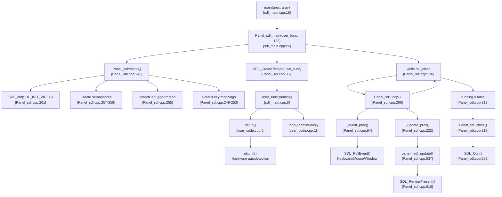
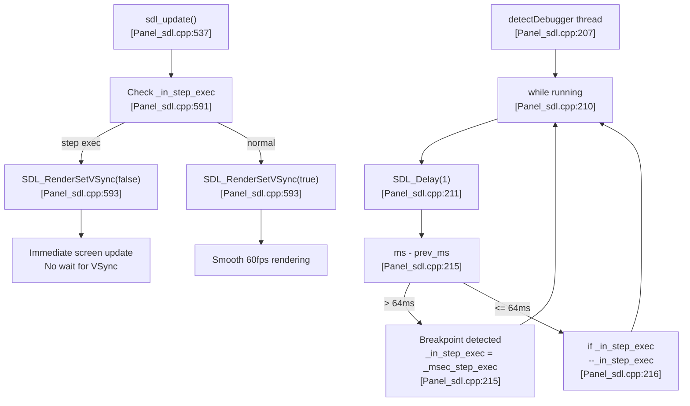
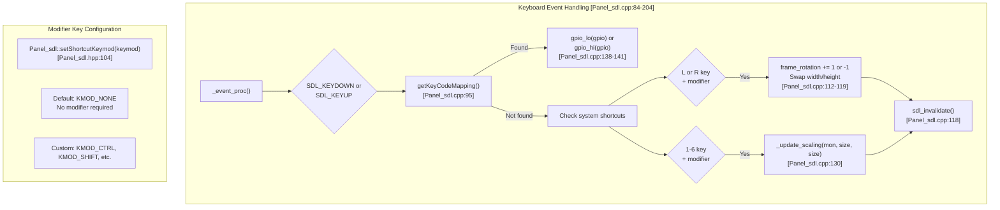
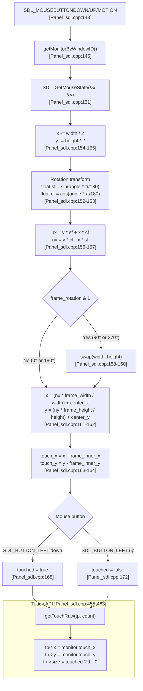

M5GFX SDL Development Workflow

# SDL Development Workflow

<details>
<summary>Relevant source files</summary>

The following files were used as context for generating this wiki page:

- [examples/PlatformIO_SDL/README.md](examples/PlatformIO_SDL/README.md)
- [examples/PlatformIO_SDL/platformio.ini](examples/PlatformIO_SDL/platformio.ini)
- [examples/PlatformIO_SDL/src/sdl_main.cpp](examples/PlatformIO_SDL/src/sdl_main.cpp)
- [examples/PlatformIO_SDL/src/user_code.cpp](examples/PlatformIO_SDL/src/user_code.cpp)
- [src/lgfx/v1/platforms/sdl/Panel_sdl.cpp](src/lgfx/v1/platforms/sdl/Panel_sdl.cpp)
- [src/lgfx/v1/platforms/sdl/Panel_sdl.hpp](src/lgfx/v1/platforms/sdl/Panel_sdl.hpp)
- [src/lgfx/v1/platforms/sdl/common.cpp](src/lgfx/v1/platforms/sdl/common.cpp)

</details>


This page describes the desktop development workflow using SDL2 for M5GFX, enabling rapid prototyping and debugging of graphics applications without physical hardware. This workflow allows developers to write code once and test it immediately on PC before deploying to ESP32 devices. For details about the SDL platform implementation itself, see [SDL Simulation Platform](#5.6). For cross-platform code patterns, see [Cross-Platform Code Patterns](#6.4).

---

## Purpose and Benefits

The SDL development workflow eliminates flash-test-debug cycles by rendering M5Stack displays in SDL2 windows on desktop platforms (Windows, macOS, Linux). Key benefits include:

- **Immediate visual feedback**: Code changes are visible instantly without uploading to hardware
- **Full debugger support**: Use lldb (macOS) or gdb (Windows/Linux) with breakpoints, variable inspection, and step execution
- **Device emulation**: Test different M5Stack device configurations without owning the hardware
- **Interactive debugging**: Keyboard shortcuts control rotation/scaling; mouse input maps to touch coordinates

The workflow uses PlatformIO's `native` platform to compile the same M5GFX code for desktop execution.

Sources: [examples/PlatformIO_SDL/README.md:1-115]()

---

## Environment Setup

### Toolchain Installation by Platform

**Windows (MSYS2)**

The Windows workflow requires MSYS2 for GCC and GDB compilers:

1. Install [MSYS2](https://www.msys2.org/) following the official guide
2. Open MSYS2 terminal and install toolchain:
```bash
pacman -S mingw-w64-ucrt-x86_64-gcc mingw-w64-ucrt-x86_64-gdb
```
3. Add to Windows `PATH` environment variable:
```
C:\msys64\mingw64\bin
C:\msys64\ucrt64\bin
C:\msys64\usr\bin
```

**macOS (Xcode Command Line Tools)**

```bash
xcode-select --install
```

**Linux (Build Essential)**

```bash
sudo apt update
sudo apt install build-essential
```

Sources: [examples/PlatformIO_SDL/README.md:13-41]()

### SDL2 Library Installation

**Windows**

1. Download `SDL2-devel-x.x.x-mingw.zip` from [SDL GitHub releases](https://github.com/libsdl-org/SDL/releases)
2. Extract and copy these directories to `C:\msys64\ucrt64`:
   - `share`
   - `bin`
   - `include`
   - `lib`

**macOS (Homebrew)**

```bash
brew install sdl2
```

**Linux**

```bash
sudo apt-get install libsdl2 libsdl2-dev
```

Sources: [examples/PlatformIO_SDL/README.md:44-71]()

---

## PlatformIO Configuration

### Build Environments

The [examples/PlatformIO_SDL/platformio.ini:1-67]() file defines multiple build environments for different platforms and device emulations:

| Environment | Platform | Architecture | Purpose |
|------------|----------|--------------|---------|
| `native` | Desktop | x86_64 | Default Intel/AMD PC build |
| `native_arm` | Desktop | arm64 | Apple Silicon (M1/M2) Mac build |
| `native_StickCPlus` | Desktop | x86_64 | M5StickCPlus emulation with 2x scaling |
| `native_Paper` | Desktop | x86_64 | M5Paper device emulation |
| `esp32_arduino` | ESP32 | xtensa | Arduino framework (hardware target) |
| `esp32_idf` | ESP32 | xtensa | ESP-IDF framework (hardware target) |

### Build Flags and Options

**Native Environment (Intel Mac)**

```ini
[env:native]
platform = native
build_type = debug
build_flags = -O0 -xc++ -std=c++14 -lSDL2
  -I"/usr/local/include/SDL2"
  -L"/usr/local/lib"
  -DM5GFX_SHOW_FRAME             ; Display frame image
  -DM5GFX_BACK_COLOR=0x222222u   ; Background color outside frame
```

Key flags:
- `-O0`: No optimization for debugging
- `-xc++ -std=c++14`: Force C++14 compilation
- `-lSDL2`: Link SDL2 library
- `-DM5GFX_SHOW_FRAME`: Enable device frame image overlay
- `-DM5GFX_BACK_COLOR`: Set background color for areas outside the frame

**Native ARM Environment (Apple Silicon Mac)**

```ini
[env:native_arm]
build_flags = -O0 -xc++ -std=c++14 -lSDL2
  -arch arm64
  -I"${sysenv.HOMEBREW_PREFIX}/include/SDL2"
  -L"${sysenv.HOMEBREW_PREFIX}/lib"
```

Uses `HOMEBREW_PREFIX` environment variable for Homebrew installation path on ARM Macs.

**Device-Specific Environments**

```ini
[env:native_StickCPlus]
build_flags = ${env:native.build_flags}
  -DM5GFX_SCALE=2                      ; 2x window scaling
  -DM5GFX_ROTATION=0                   ; Initial rotation
  -DM5GFX_BOARD=board_M5StickCPlus     ; Board type
```

Sources: [examples/PlatformIO_SDL/platformio.ini:11-50]()

---

## Execution Flow

### Main Entry Point



**Execution Pattern**

The SDL workflow uses a dual-thread model:

1. **Main thread**: SDL event loop calling [Panel_sdl.cpp:268-282]()
   - Polls keyboard, mouse, and window events
   - Updates all panel renderers
   - Handles window close events

2. **User thread**: User code with Arduino-style setup/loop pattern [sdl_main.cpp:8-16]()
   - Calls `setup()` once at startup
   - Calls `loop()` continuously until window closes

**Default Key Mappings**

The system initializes default GPIO key mappings for M5Stack button emulation:

```cpp
addKeyCodeMapping(SDLK_LEFT, 39);   // BtnA (GPIO 39)
addKeyCodeMapping(SDLK_DOWN, 38);   // BtnB (GPIO 38)  
addKeyCodeMapping(SDLK_RIGHT, 37);  // BtnC (GPIO 37)
addKeyCodeMapping(SDLK_UP, 36);     // Reserved (GPIO 36)
```

Applications can add custom key mappings via [Panel_sdl.cpp:64-72]().

Sources: [examples/PlatformIO_SDL/src/sdl_main.cpp:1-26](), [examples/PlatformIO_SDL/src/user_code.cpp:1-30](), [src/lgfx/v1/platforms/sdl/Panel_sdl.cpp:243-318]()

---

## Debugging Workflow

### Debugger Configuration

**macOS (lldb)**

Visual Studio Code `launch.json` configuration:

```json
{
  "type": "lldb",
  "request": "launch",
  "name": "Debug",
  "program": "${workspaceRoot}/.pio/build/native/program",
  "cwd": "${workspaceRoot}"
}
```

Build the project first, then press `F5` to start debugging with breakpoints and variable inspection.

**Windows/Linux (gdb)**

Similar configuration using `type: "cppdbg"` with gdb as the debugger.

Sources: [examples/PlatformIO_SDL/README.md:88-108]()

### Debugger Detection and VSync Control



**Debugger Detection Mechanism**

The system automatically detects when code is being stepped through in a debugger:

1. Background thread measures time between iterations [Panel_sdl.cpp:207-220]()
2. If interval > 64ms, assumes breakpoint hit
3. Sets `_in_step_exec` flag with 512ms timeout (configurable via `Panel_sdl::main()` second parameter)
4. Disables VSync during step execution for immediate visual updates [Panel_sdl.cpp:591-594]()

**Display Update Synchronization**

The `display()` method handles synchronization differently during step execution:

```cpp
void Panel_sdl::display(uint_fast16_t x, uint_fast16_t y, uint_fast16_t w, uint_fast16_t h)
{
  if (_in_step_exec)
  {
    if (_display_counter != _modified_counter) {
      do {
        SDL_SemPost(_update_in_semaphore);
        SDL_SemWaitTimeout(_update_out_semaphore, 1);
      } while (_display_counter != _modified_counter);
      SDL_Delay(1);
    }
  }
}
```

During normal execution, updates are asynchronous. During step execution, `display()` blocks until the screen actually updates, ensuring the debugger sees the current visual state [Panel_sdl.cpp:437-453]().

Sources: [src/lgfx/v1/platforms/sdl/Panel_sdl.cpp:206-220](), [src/lgfx/v1/platforms/sdl/Panel_sdl.cpp:437-453](), [src/lgfx/v1/platforms/sdl/Panel_sdl.cpp:586-595]()

---

## Interactive Development Features

### Keyboard Shortcuts



**System Shortcuts**

| Key Combination | Action | Implementation |
|----------------|--------|----------------|
| `L` (+ modifier) | Rotate left (counter-clockwise) | [Panel_sdl.cpp:106-121]() |
| `R` (+ modifier) | Rotate right (clockwise) | [Panel_sdl.cpp:106-121]() |
| `1`-`6` (+ modifier) | Set window scale to 1x-6x | [Panel_sdl.cpp:124-133]() |
| Arrow keys | Emulate GPIO 36-39 (M5Stack buttons) | [Panel_sdl.cpp:249-253]() |

The modifier key defaults to `KMOD_NONE` (no modifier required) but can be changed via `Panel_sdl::setShortcutKeymod(SDL_Keymod)`.

**Custom Key Mappings**

Applications can map arbitrary keys to GPIO pins:

```cpp
Panel_sdl::addKeyCodeMapping(SDLK_SPACE, 15);  // Map spacebar to GPIO 15
int gpio = Panel_sdl::getKeyCodeMapping(SDLK_SPACE);  // Returns 15
```

The system maintains a vector of `KeyCodeMapping_t` structures [Panel_sdl.cpp:62-82]().

Sources: [src/lgfx/v1/platforms/sdl/Panel_sdl.cpp:84-204](), [src/lgfx/v1/platforms/sdl/Panel_sdl.hpp:104-112]()

### Mouse to Touch Coordinate Transformation



**Coordinate Transformation Pipeline**

The mouse coordinate transformation accounts for:
1. **Window scaling**: Mouse coords scaled to logical display size
2. **Frame rotation**: Applies rotation matrix for current angle
3. **Frame offset**: Subtracts inner frame offset if device has border image
4. **Aspect ratio**: Handles non-square displays correctly

The touch state is accessible via standard `ITouch::getTouchRaw()` interface, making code identical between SDL and hardware [Panel_sdl.cpp:455-463]().

Sources: [src/lgfx/v1/platforms/sdl/Panel_sdl.cpp:143-174](), [src/lgfx/v1/platforms/sdl/Panel_sdl.cpp:455-463]()

### Window Scaling and Rotation

**Dynamic Scaling**

Scaling can be set programmatically or via keyboard:

```cpp
void Panel_sdl::setScaling(uint_fast8_t scaling_x, uint_fast8_t scaling_y)
{
  monitor.scaling_x = scaling_x;
  monitor.scaling_y = scaling_y;
}
```

The `_update_scaling()` function resizes the window while maintaining center position [Panel_sdl.cpp:473-493]().

**Rotation Handling**

Window dimensions swap automatically when rotation is 90° or 270°:

```cpp
if (mon->frame_rotation & 1) {
  std::swap(window_width, window_height);
}
```

The `render_texture()` function applies rotation via SDL's `SDL_RenderCopyEx()` with pivot point calculations [Panel_sdl.cpp:629-642]().

Sources: [src/lgfx/v1/platforms/sdl/Panel_sdl.cpp:320-339](), [src/lgfx/v1/platforms/sdl/Panel_sdl.cpp:473-493](), [src/lgfx/v1/platforms/sdl/Panel_sdl.cpp:629-642]()

---

## Device Emulation

### Frame Image Overlay

```mermaid
flowchart LR
    subgraph "Frame Configuration [Panel_sdl.cpp:326-333]"
        setFrameImage["setFrameImage(image, width, height, inner_x, inner_y)"]
        frame_data["frame_image: ARGB8888 pixel data<br/>frame_width/height: Frame dimensions<br/>frame_inner_x/y: Display offset"]
    end
    
    subgraph "Texture Creation [Panel_sdl.cpp:524-532]"
        create_surface["SDL_CreateRGBSurfaceFrom()<br/>32-bit ARGB format"]
        create_texture["SDL_CreateTextureFromSurface()"]
        set_blend["SDL_SetTextureBlendMode(BLEND)<br/>Alpha blending enabled"]
    end
    
    subgraph "Rendering Order [Panel_sdl.cpp:614-624]"
        clear["SDL_RenderClear()<br/>Background color"]
        render_display["render_texture(texture)<br/>Display content at inner_x/y"]
        render_frame["render_texture(texture_frameimage)<br/>Frame overlay at 0,0"]
        present["SDL_RenderPresent()"]
    end
    
    setFrameImage --> frame_data
    frame_data --> create_surface
    create_surface --> create_texture
    create_texture --> set_blend
    set_blend --> clear
    clear --> render_display
    render_display --> render_frame
    render_frame --> present
```



**Frame Image System**

Device emulation can include a frame image (device bezel) with alpha channel:

1. **Frame data**: 32-bit ARGB8888 image buffer
2. **Inner offset**: Display content position within frame (`frame_inner_x`, `frame_inner_y`)
3. **Alpha blending**: Frame rendered over display with transparency
4. **Background color**: Configurable via `-DM5GFX_BACK_COLOR` build flag

Example configuration for M5StickCPlus-like device:
```cpp
panel.setFrameImage(frame_pixels, 160, 280, 15, 40);  // Display at (15,40) within 160x280 frame
panel.setScaling(2, 2);  // 2x window scaling
```

The frame image is enabled via `-DM5GFX_SHOW_FRAME` compile flag [platformio.ini:23]().

Sources: [src/lgfx/v1/platforms/sdl/Panel_sdl.cpp:326-339](), [src/lgfx/v1/platforms/sdl/Panel_sdl.cpp:524-533](), [src/lgfx/v1/platforms/sdl/Panel_sdl.cpp:606-626]()

### Custom Device Configurations

The `platformio.ini` can define device-specific environments:

```ini
[env:native_StickCPlus]
build_flags = ${env:native.build_flags}
  -DM5GFX_SCALE=2                    ; 2x scaling
  -DM5GFX_ROTATION=0                 ; Portrait orientation
  -DM5GFX_BOARD=board_M5StickCPlus   ; Board type for autodetection
```

The `M5GFX_BOARD` macro tells the autodetection system which hardware to emulate, loading the correct:
- Panel driver (ST7789 for StickCPlus)
- Display dimensions (135x240)
- Touch controller (if applicable)
- Button GPIO mappings

This allows testing device-specific code without modifying the application.

Sources: [examples/PlatformIO_SDL/platformio.ini:36-49]()

---

## Platform Abstraction

### Emulated GPIO and Timing Functions

The SDL platform provides dummy implementations for hardware functions:

```cpp
// GPIO emulation using array
static uint8_t _gpio_dummy_values[EMULATED_GPIO_MAX];

void gpio_hi(uint32_t pin) { 
  _gpio_dummy_values[pin & (EMULATED_GPIO_MAX - 1)] = 1; 
}

void gpio_lo(uint32_t pin) { 
  _gpio_dummy_values[pin & (EMULATED_GPIO_MAX - 1)] = 0; 
}

bool gpio_in(uint32_t pin) { 
  return _gpio_dummy_values[pin & (EMULATED_GPIO_MAX - 1)]; 
}
```

Timing functions use SDL performance counters:

```cpp
unsigned long millis(void) {
  return SDL_GetTicks();
}

unsigned long micros(void) {
  return SDL_GetPerformanceCounter() / (SDL_GetPerformanceFrequency() / (1000 * 1000));
}
```

Bus interfaces (SPI, I2C) return error codes without actual communication [common.cpp:82-112]().

Sources: [src/lgfx/v1/platforms/sdl/common.cpp:36-78](), [src/lgfx/v1/platforms/sdl/common.cpp:82-112]()

---

## Summary

The SDL development workflow provides:

| Feature | Benefit |
|---------|---------|
| **Zero hardware dependency** | Develop before hardware arrives |
| **Instant feedback** | No flash/upload cycles |
| **Full debugger integration** | Breakpoints, step execution, variable inspection |
| **Interactive controls** | Rotate, scale, and interact in real-time |
| **Device emulation** | Test multiple M5Stack variants |
| **Cross-platform** | Windows, macOS, Linux support |

The workflow is built on `Panel_sdl` which extends `Panel_FrameBufferBase`, providing pixel-perfect rendering in an SDL2 window. All M5GFX drawing operations work identically on SDL and ESP32 hardware, enabling true write-once-run-anywhere development.

For production deployment to ESP32 hardware, simply change the PlatformIO environment from `native` to `esp32_arduino` or `esp32_idf` without code changes.

Sources: [src/lgfx/v1/platforms/sdl/Panel_sdl.hpp:71-146](), [examples/PlatformIO_SDL/platformio.ini:51-66]()