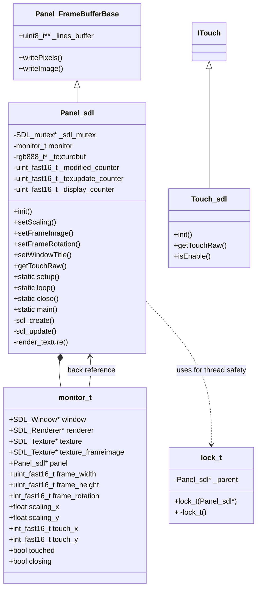
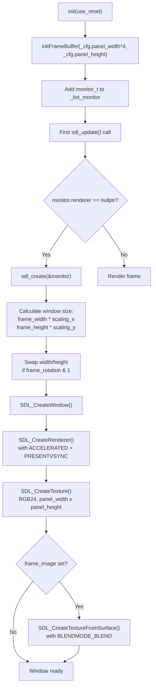
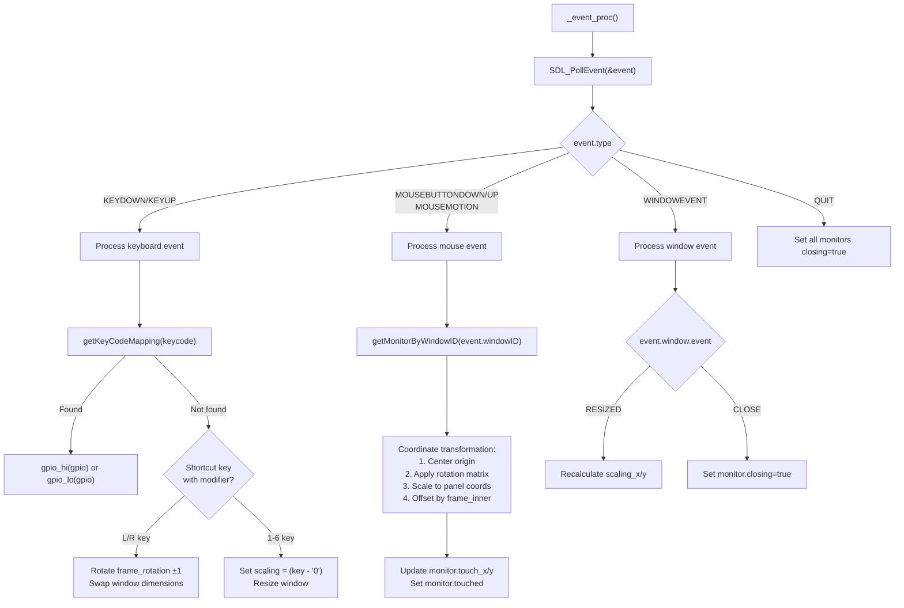
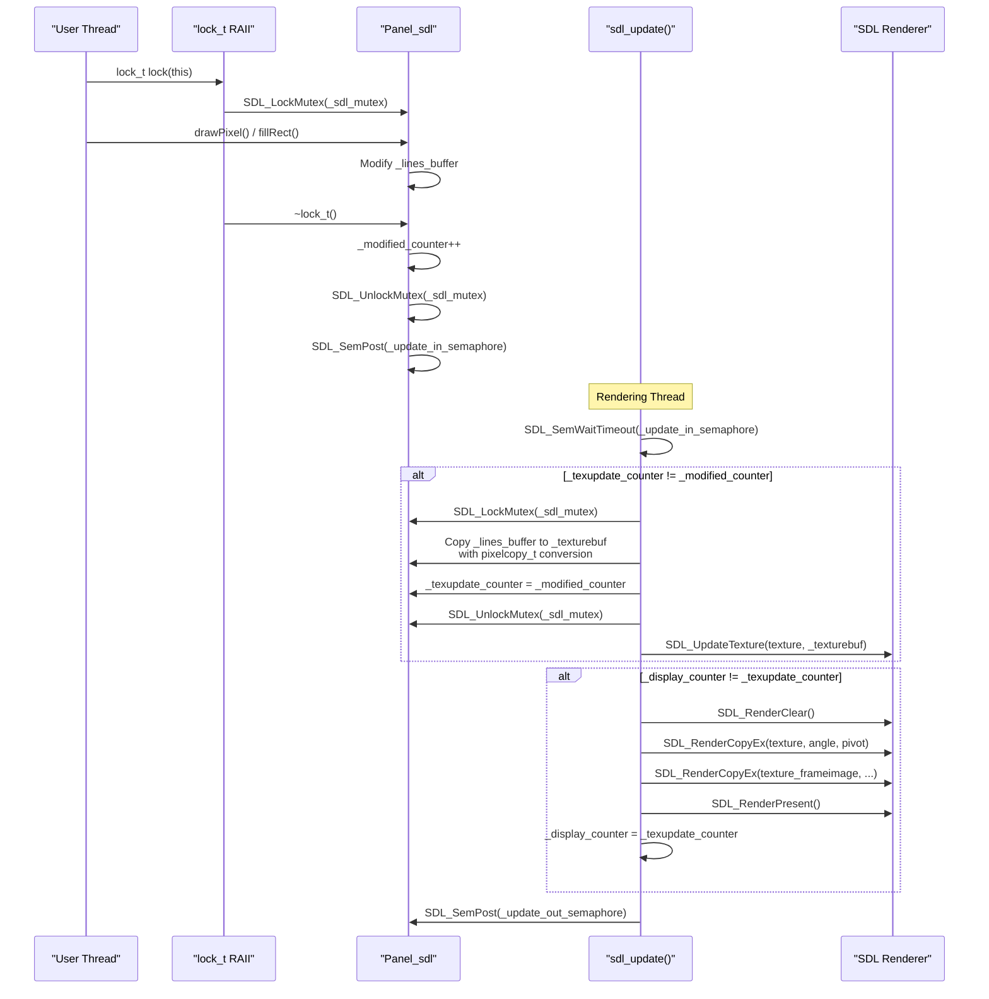
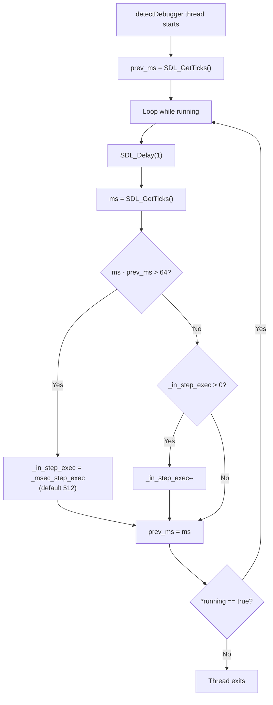

M5GFX SDL Simulation Panel

# SDL Simulation Panel

<details>
<summary>Relevant source files</summary>

The following files were used as context for generating this wiki page:

- [src/lgfx/v1/platforms/sdl/Panel_sdl.cpp](src/lgfx/v1/platforms/sdl/Panel_sdl.cpp)
- [src/lgfx/v1/platforms/sdl/Panel_sdl.hpp](src/lgfx/v1/platforms/sdl/Panel_sdl.hpp)
- [src/lgfx/v1/platforms/sdl/common.cpp](src/lgfx/v1/platforms/sdl/common.cpp)

</details>


## Purpose and Scope

The SDL simulation panel (`Panel_sdl`) enables desktop development and debugging of M5GFX applications without requiring physical hardware. It uses the SDL2 library to create cross-platform windows that simulate M5Stack displays, mapping mouse input to touch coordinates and keyboard shortcuts to GPIO pins. This system significantly accelerates development by eliminating flash-test-debug cycles during initial prototyping.

This page covers the SDL panel driver implementation, including window management, input emulation, thread synchronization, and debugger integration. For information about the general panel driver architecture, see [Panel Driver Architecture](#4). For SDL platform abstraction (GPIO, timing, bus emulation), see [SDL Simulation Platform](#5.6). For the overall development workflow using SDL, see [SDL Development Workflow](#6.3).

---

## Architecture Overview

### Class Hierarchy and Relationships



**Sources:** [src/lgfx/v1/platforms/sdl/Panel_sdl.hpp:71-146](), [src/lgfx/v1/platforms/sdl/Panel_sdl.cpp:347-362]()

The `Panel_sdl` class inherits from `Panel_FrameBufferBase`, which provides a buffered rendering strategy where drawing operations target an in-memory frame buffer (`_lines_buffer`) before being transferred to the display. The SDL panel extends this by maintaining a separate texture buffer (`_texturebuf`) in RGB888 format for SDL rendering, with a pixel copy operation converting from the frame buffer's native color depth.

The `monitor_t` structure encapsulates all SDL-related state for a single window, including SDL window/renderer/texture handles, frame image configuration (for device bezels), scaling factors, touch coordinates, and rotation state. Each `Panel_sdl` instance owns one `monitor_t`, and a global list tracks all active monitors.

---

## Static Lifecycle Management

### Initialization and Main Loop

```mermaid
sequenceDiagram
    participant App as "User Application"
    participant Main as "Panel_sdl::main()"
    participant Setup as "Panel_sdl::setup()"
    participant Loop as "Panel_sdl::loop()"
    participant Thread as "User Thread"
    participant DebugThread as "Debugger Detection Thread"
    
    App->>Main: main(user_fn, msec_step_exec)
    Main->>Setup: setup()
    Setup->>Setup: Initialize semaphores
    Setup->>Setup: Initialize GPIO dummy array
    Setup->>Setup: Add default key mappings
    Setup->>DebugThread: Create detectDebugger thread
    Setup->>Setup: SDL_Init(SDL_INIT_VIDEO)
    Main->>Thread: SDL_CreateThread(user_fn)
    
    loop Until all windows closed
        Main->>Loop: loop()
        Loop->>Loop: _event_proc() - Poll SDL events
        Loop->>Loop: Wait on _update_in_semaphore
        Loop->>Loop: _update_proc() - Render all monitors
        Loop->>Loop: Post _update_out_semaphore
    end
    
    Main->>Thread: Set running=false, SDL_WaitThread()
    Main->>Main: close() - Destroy semaphores, SDL_Quit()
```

**Sources:** [src/lgfx/v1/platforms/sdl/Panel_sdl.cpp:296-318](), [src/lgfx/v1/platforms/sdl/Panel_sdl.cpp:243-266](), [src/lgfx/v1/platforms/sdl/Panel_sdl.cpp:268-282]()

The static `main()` method [Panel_sdl.cpp:296-318]() provides the entry point for SDL-based applications. It orchestrates three concurrent threads:

1. **Main/Rendering Thread**: Runs the SDL event loop and rendering via `loop()`
2. **User Code Thread**: Executes the application's drawing and logic functions
3. **Debugger Detection Thread**: Monitors timing gaps to detect breakpoint pauses

The `setup()` method [Panel_sdl.cpp:243-266]() initializes SDL, creates synchronization semaphores, registers default key-to-GPIO mappings (arrow keys → GPIOs 36-39 for M5Stack buttons), and spawns the debugger detection thread. The `loop()` method [Panel_sdl.cpp:268-282]() alternates between `_event_proc()` for input handling and `_update_proc()` for rendering, using semaphores to synchronize with the user code thread.

---

## Window and Display Management

### SDL Window Creation



**Sources:** [src/lgfx/v1/platforms/sdl/Panel_sdl.cpp:354-362](), [src/lgfx/v1/platforms/sdl/Panel_sdl.cpp:495-535]()

Window creation is deferred until the first `sdl_update()` call [Panel_sdl.cpp:537-627](), which checks if `monitor.renderer` is null and invokes `sdl_create()` [Panel_sdl.cpp:495-535](). This lazy initialization allows configuration methods like `setFrameImage()` to be called before the window appears.

The window size calculation [Panel_sdl.cpp:505-512]() applies scaling factors to the frame dimensions (which default to panel dimensions if not set), then swaps width/height if rotation is odd (90° or 270°). The main texture stores panel pixels in RGB24 format, while the optional frame image texture overlays a device bezel graphic with alpha blending.

### Frame Image Configuration

The `setFrameImage()` method [Panel_sdl.cpp:326-333]() accepts a raw ARGB8888 pixel array representing a device bezel or frame. The frame dimensions must be larger than or equal to the panel dimensions, with `inner_x` and `inner_y` specifying where the actual panel pixels should be rendered within the frame. This enables simulation of M5Stack devices with realistic bezels:

| Method | Purpose | Example Use Case |
|--------|---------|------------------|
| `setFrameImage(ptr, fw, fh, ix, iy)` | Set bezel image and panel position | M5StickCPlus frame with rounded corners |
| `setScaling(sx, sy)` | Set window magnification | 2x scaling for high-DPI monitors |
| `setFrameRotation(rotation)` | Set initial rotation (0-3) | Landscape mode by default |
| `setWindowTitle(title)` | Set window caption | "M5Stack Core2 Simulator" |

**Sources:** [src/lgfx/v1/platforms/sdl/Panel_sdl.cpp:326-339](), [src/lgfx/v1/platforms/sdl/Panel_sdl.cpp:465-471]()

---

## Input Event Handling

### Event Processing Flow



**Sources:** [src/lgfx/v1/platforms/sdl/Panel_sdl.cpp:84-204]()

The `_event_proc()` method [Panel_sdl.cpp:84-204]() implements a polling-based event handler that processes all pending SDL events. Key events are first checked against the user-configurable key-to-GPIO mapping [Panel_sdl.cpp:64-82](), then against built-in shortcuts if no mapping exists:

- **L/R keys** (with modifier): Rotate display ±90° by incrementing/decrementing `frame_rotation`, swapping window width/height, and centering the new window position [Panel_sdl.cpp:106-121]()
- **1-6 keys** (with modifier): Set scaling factor to 1x through 6x, resizing the window while keeping it centered [Panel_sdl.cpp:124-133]()

The default key mappings [Panel_sdl.cpp:248-253]() emulate M5Stack button GPIOs:
```cpp
SDLK_LEFT  → GPIO 39  // BtnA
SDLK_DOWN  → GPIO 38  // BtnB
SDLK_RIGHT → GPIO 37  // BtnC
SDLK_UP    → GPIO 36  // Power button
```

### Mouse-to-Touch Coordinate Transformation

The mouse coordinate transformation [Panel_sdl.cpp:148-165]() involves four steps to map window-relative mouse positions to panel-relative touch coordinates:

1. **Center the origin**: Subtract `(window_width/2, window_height/2)` to center coordinates at (0, 0)
2. **Apply rotation matrix**: Use sine/cosine of `frame_angle` to rotate coordinates
3. **Scale to panel coordinates**: Multiply by `(frame_width/window_width, frame_height/window_height)`
4. **Offset by inner position**: Subtract `(frame_inner_x, frame_inner_y)` to get panel-relative coordinates

The rotation matrix formula:
```
nx = y * sin(angle) + x * cos(angle)
ny = y * cos(angle) - x * sin(angle)
```

If `frame_rotation & 1` is true (90° or 270°), the width/height are swapped before scaling. The final coordinates are stored in `monitor.touch_x` and `monitor.touch_y`, with `monitor.touched` tracking left mouse button state [Panel_sdl.cpp:166-173]().

**Sources:** [src/lgfx/v1/platforms/sdl/Panel_sdl.cpp:143-174]()

---

## Frame Buffer and Rendering Pipeline

### Dual-Buffer Architecture

```mermaid
flowchart LR
    subgraph "Drawing Operations"
        DrawAPI["drawPixel()<br/>fillRect()<br/>writeImage()"]
    end
    
    subgraph "Frame Buffer"
        LinesBuffer["_lines_buffer[][]<br/>Native color depth<br/>(rgb565/rgb888/rgb332)"]
    end
    
    subgraph "Texture Buffer"
        TextureBuf["_texturebuf[]<br/>rgb888_t only"]
    end
    
    subgraph "SDL Rendering"
        SDLTexture["SDL_Texture<br/>SDL_PIXELFORMAT_RGB24"]
        SDLRenderer["SDL_Renderer"]
    end
    
    DrawAPI -->|Protected by lock_t| LinesBuffer
    LinesBuffer -->|pixelcopy_t conversion| TextureBuf
    TextureBuf -->|SDL_UpdateTexture()| SDLTexture
    SDLTexture -->|SDL_RenderCopyEx()| SDLRenderer
    SDLRenderer -->|SDL_RenderPresent()| Display["Window Display"]
    
    LinesBuffer -.->|_modified_counter++| Counter1["Modification Counter"]
    TextureBuf -.->|_texupdate_counter| Counter2["Texture Update Counter"]
    SDLRenderer -.->|_display_counter| Counter3["Display Counter"]
```

**Sources:** [src/lgfx/v1/platforms/sdl/Panel_sdl.cpp:644-668](), [src/lgfx/v1/platforms/sdl/Panel_sdl.cpp:537-627]()

The SDL panel maintains two separate buffers:

1. **Frame Buffer** (`_lines_buffer`): A 2D array of scanline pointers, allocated by `initFrameBuffer()` [Panel_sdl.cpp:644-668](). Stores pixels in the panel's native color depth (rgb565, rgb888, rgb332, or grayscale_8bit). This buffer is modified by all drawing operations.

2. **Texture Buffer** (`_texturebuf`): A contiguous RGB888 array matching the panel dimensions, used as an intermediate buffer for `SDL_UpdateTexture()`. Allocated alongside the frame buffer [Panel_sdl.cpp:649]().

The separation enables the panel to support any color depth internally while SDL always receives RGB24 data. The conversion uses `pixelcopy_t` function pointers selected based on `_write_depth` [Panel_sdl.cpp:547-556]().

### Rendering Update Cycle



**Sources:** [src/lgfx/v1/platforms/sdl/Panel_sdl.cpp:382-399](), [src/lgfx/v1/platforms/sdl/Panel_sdl.cpp:537-627]()

Three counters track the pipeline stages:

| Counter | Incremented By | Purpose |
|---------|----------------|---------|
| `_modified_counter` | `lock_t` destructor [Panel_sdl.cpp:390]() | Indicates frame buffer has been modified |
| `_texupdate_counter` | `sdl_update()` [Panel_sdl.cpp:560]() | Indicates texture buffer has been updated |
| `_display_counter` | `sdl_update()` [Panel_sdl.cpp:617]() | Indicates texture has been presented to screen |

When counters differ, the corresponding pipeline stage executes. This lazy evaluation avoids redundant texture uploads and renders when the buffer hasn't changed.

---

## Thread Synchronization

### Mutex and Semaphore Coordination

The `lock_t` RAII wrapper [Panel_sdl.cpp:382-399]() provides thread-safe access to the frame buffer:

```cpp
lock_t::lock_t(Panel_sdl* parent) : _parent { parent }
{
    SDL_LockMutex(parent->_sdl_mutex);
}

lock_t::~lock_t(void)
{
    ++_parent->_modified_counter;
    SDL_UnlockMutex(_parent->_sdl_mutex);
    if (SDL_SemValue(_update_in_semaphore) < 2)
    {
        SDL_SemPost(_update_in_semaphore);
        if (!_in_step_exec) {
            SDL_SemWaitTimeout(_update_out_semaphore, 1);
        }
    }
}
```

The destructor performs three critical actions:
1. Increments `_modified_counter` to signal changes
2. Posts to `_update_in_semaphore` to wake the rendering thread (limited to 2 pending posts to prevent queue buildup)
3. Waits on `_update_out_semaphore` for rendering to complete, **unless** the debugger is detected

This creates a synchronous drawing model where each draw operation waits for the frame to be displayed, preventing the user thread from overwhelming the renderer with updates. The debugger detection bypass is crucial for step debugging without deadlocks.

**Sources:** [src/lgfx/v1/platforms/sdl/Panel_sdl.cpp:382-399]()

### Display Method and Step Execution

The `display()` method [Panel_sdl.cpp:437-453]() provides additional synchronization for explicit frame updates:

```cpp
void Panel_sdl::display(uint_fast16_t x, uint_fast16_t y, uint_fast16_t w, uint_fast16_t h)
{
    if (_in_step_exec)
    {
        if (_display_counter != _modified_counter) {
            do {
                SDL_SemPost(_update_in_semaphore);
                SDL_SemWaitTimeout(_update_out_semaphore, 1);
            } while (_display_counter != _modified_counter);
            SDL_Delay(1);
        }
    }
}
```

When the debugger is detected (`_in_step_exec` is true), `display()` actively pumps the semaphores until the frame is fully rendered. This ensures that stepping through code at a `display()` call shows the current frame immediately, rather than waiting for the next async update cycle.

**Sources:** [src/lgfx/v1/platforms/sdl/Panel_sdl.cpp:437-453]()

---

## Debugger Detection and VSync Control

### Timing-Based Detection



**Sources:** [src/lgfx/v1/platforms/sdl/Panel_sdl.cpp:207-220](), [src/lgfx/v1/platforms/sdl/Panel_sdl.cpp:296-298]()

The `detectDebugger()` function [Panel_sdl.cpp:207-220]() runs in a separate thread, checking if time gaps between iterations exceed 64ms. Such gaps typically indicate a debugger breakpoint pausing execution. When detected, it sets `_in_step_exec` to a configurable duration (default 512ms, passed to `main()` [Panel_sdl.cpp:296-298]()). The flag then decrements each millisecond until released, maintaining the "in debugger" state for ~512ms after the last breakpoint to handle rapid stepping.

### VSync Disabling During Debugging

The `sdl_update()` method [Panel_sdl.cpp:586-595]() checks the debugger state each frame and toggles VSync accordingly:

```cpp
SDL_RendererInfo info;
if (0 == SDL_GetRendererInfo(monitor.renderer, &info)) {
    // Disable VSync during step execution
    if (((bool)(info.flags & SDL_RENDERER_PRESENTVSYNC)) == step_exec)
    {
        SDL_RenderSetVSync(monitor.renderer, !step_exec);
    }
}
```

When `_in_step_exec` is true (debugger detected), VSync is disabled to allow immediate frame presentation. This prevents the 16ms VSync wait from causing confusing delays when stepping through drawing code. The normal VSync behavior is restored once debugging completes.

**Sources:** [src/lgfx/v1/platforms/sdl/Panel_sdl.cpp:586-595]()

---

## Configuration Methods Summary

### Panel_sdl Configuration API

| Method | Parameters | Function | Timing Requirement |
|--------|------------|----------|-------------------|
| `setWindowTitle(title)` | `const char*` | Sets SDL window caption | Before or after `init()` |
| `setScaling(sx, sy)` | `uint_fast8_t`, `uint_fast8_t` | Sets window magnification factors | Before `init()` for initial size |
| `setFrameImage(ptr, fw, fh, ix, iy)` | `const void*`, 4× `int` | Sets device bezel image (ARGB8888) and panel offset | Before `init()` |
| `setFrameRotation(rotation)` | `uint_fast16_t` | Sets initial rotation (0-3 = 0°-270°) | Before `init()` |
| `addKeyCodeMapping(key, gpio)` | `SDL_KeyCode`, `uint8_t` | Maps keyboard key to GPIO pin (static) | Before `setup()` |
| `setShortcutKeymod(mod)` | `SDL_Keymod` | Sets modifier key for shortcuts (static, default: KMOD_NONE) | Before `setup()` |

**Sources:** [src/lgfx/v1/platforms/sdl/Panel_sdl.hpp:93-112](), [src/lgfx/v1/platforms/sdl/Panel_sdl.cpp:320-339](), [src/lgfx/v1/platforms/sdl/Panel_sdl.cpp:465-471]()

The `_keymod` static member [Panel_sdl.cpp:42]() defaults to `KMOD_NONE`, meaning shortcuts (L/R for rotation, 1-6 for scaling) work without holding modifier keys. Setting this to `KMOD_LCTRL` or `KMOD_LSHIFT` requires the modifier to be held for shortcuts to activate, preventing accidental window changes.

### Touch Coordinate Retrieval

The `getTouchRaw()` method [Panel_sdl.cpp:455-463]() implements the touch interface by returning the transformed mouse coordinates:

```cpp
uint_fast8_t Panel_sdl::getTouchRaw(touch_point_t* tp, uint_fast8_t count)
{
    tp->x = monitor.touch_x;
    tp->y = monitor.touch_y;
    tp->size = monitor.touched ? 1 : 0;
    tp->id = 0;
    return monitor.touched;
}
```

The method always returns a single touch point with ID 0, size 1 when pressed (size 0 when released), and coordinates updated by mouse motion events. This provides basic touch emulation sufficient for most M5Stack applications.

**Sources:** [src/lgfx/v1/platforms/sdl/Panel_sdl.cpp:455-463]()

---

## Memory Management and Cleanup

### Buffer Allocation

The `initFrameBuffer()` method [Panel_sdl.cpp:644-668]() allocates three memory regions:

1. **Line pointer array**: `height * sizeof(uint8_t*)` for scanline pointers
2. **Texture buffer**: `width * height * sizeof(rgb888_t)` for SDL texture data
3. **Frame buffer**: `width * height` bytes (width aligned to 8-byte boundary)

All allocations use `heap_alloc_dma()` from the SDL common implementation [common.cpp:36](), which on SDL platforms simply calls `malloc()`. The frame buffer width is aligned to 8 bytes (`(width + 7) & ~7u`) [Panel_sdl.cpp:652]() for potential SIMD optimizations.

The `deinitFrameBuffer()` method [Panel_sdl.cpp:670-683]() frees all three allocations by freeing `lines[0]` (the frame buffer), then `lines` (the pointer array), then `_texturebuf`.

**Sources:** [src/lgfx/v1/platforms/sdl/Panel_sdl.cpp:644-683]()

### Monitor Lifecycle

The `monitor_t` structure is added to the global `_list_monitor` during `init()` [Panel_sdl.cpp:359]() and removed during the destructor [Panel_sdl.cpp:343](). The `_update_proc()` method [Panel_sdl.cpp:222-241]() iterates this list, destroying SDL resources for monitors marked `closing`:

```cpp
if ((*it)->closing) {
    if ((*it)->texture_frameimage) { SDL_DestroyTexture((*it)->texture_frameimage); }
    SDL_DestroyTexture((*it)->texture);
    SDL_DestroyRenderer((*it)->renderer);
    SDL_DestroyWindow((*it)->window);
    _list_monitor.erase(it++);
    if (_list_monitor.empty()) {
        _all_close = true;
        return;
    }
    continue;
}
```

When the last monitor closes, `_all_close` is set to true, causing `loop()` to return 1 and terminating the main loop. The user code thread is then joined, and `close()` destroys the semaphores and calls `SDL_Quit()`.

**Sources:** [src/lgfx/v1/platforms/sdl/Panel_sdl.cpp:222-241](), [src/lgfx/v1/platforms/sdl/Panel_sdl.cpp:284-294]()

---

## Platform Abstraction Stub Functions

The SDL platform provides stub implementations for bus interfaces that are not needed for simulation:

```cpp
namespace spi {
    cpp::result<void, error_t> init(int, int, int, int) { return cpp::fail(error_t::unknown_err); }
    void release(int) {}
    void beginTransaction(int, uint32_t, int) {}
    void endTransaction(int) {}
    void writeBytes(int, const uint8_t*, size_t) {}
    void readBytes(int, uint8_t*, size_t) {}
}

namespace i2c {
    cpp::result<void, error_t> init(int, int, int) { return cpp::fail(error_t::unknown_err); }
    cpp::result<void, error_t> release(int) { return cpp::fail(error_t::unknown_err); }
    // ... all methods return unknown_err
}
```

These stubs allow bus-related code to compile and link, but they always fail with `error_t::unknown_err`. Applications that require I2C/SPI peripherals (e.g., external sensors) must use conditional compilation to skip hardware-dependent code when running on SDL.

GPIO functions are implemented with a dummy array `_gpio_dummy_values[EMULATED_GPIO_MAX]` [common.cpp:36-43](), allowing keyboard events to set GPIO states that can be read by application code using `gpio_in()`.

**Sources:** [src/lgfx/v1/platforms/sdl/common.cpp:82-112](), [src/lgfx/v1/platforms/sdl/common.cpp:36-43]()