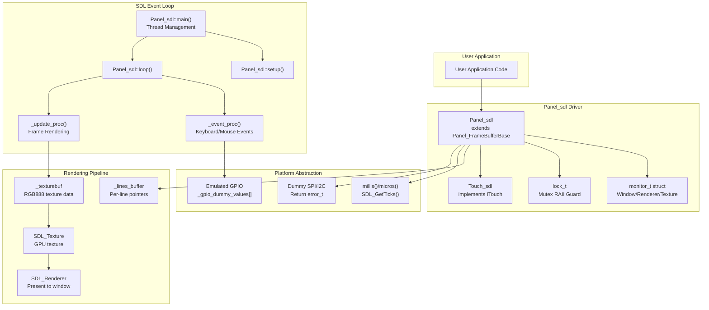
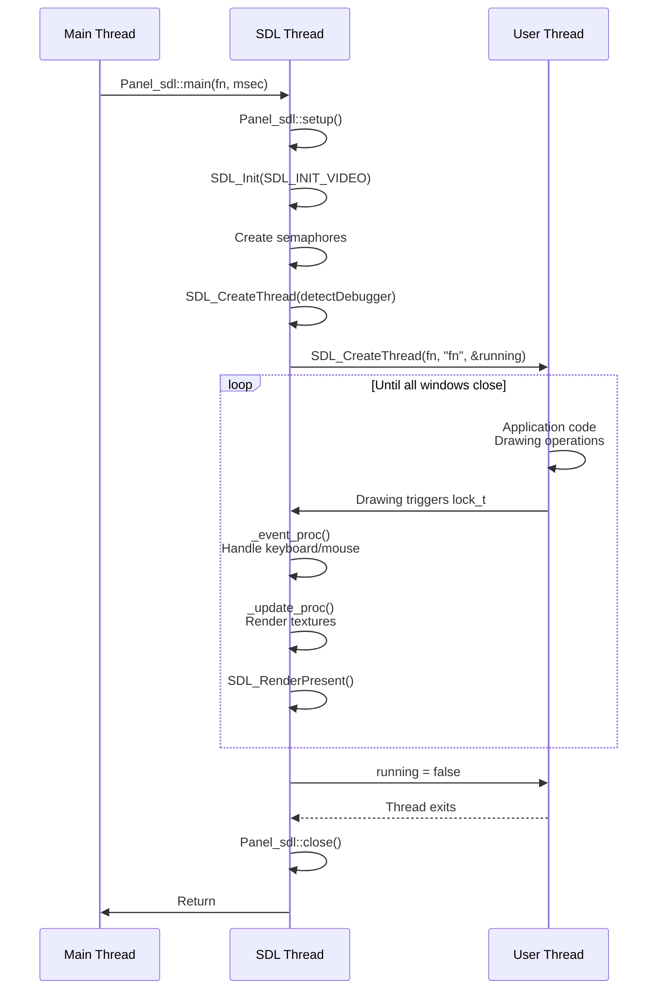
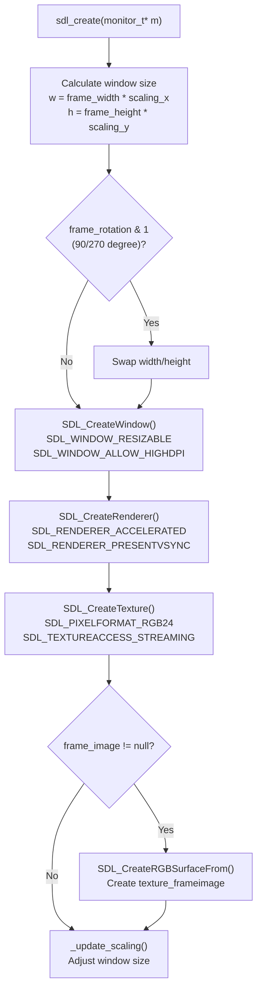
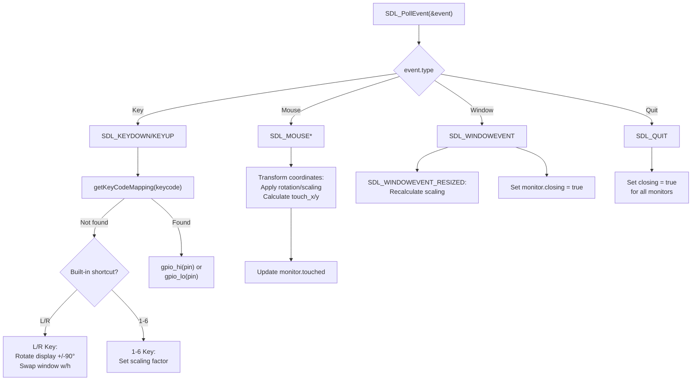
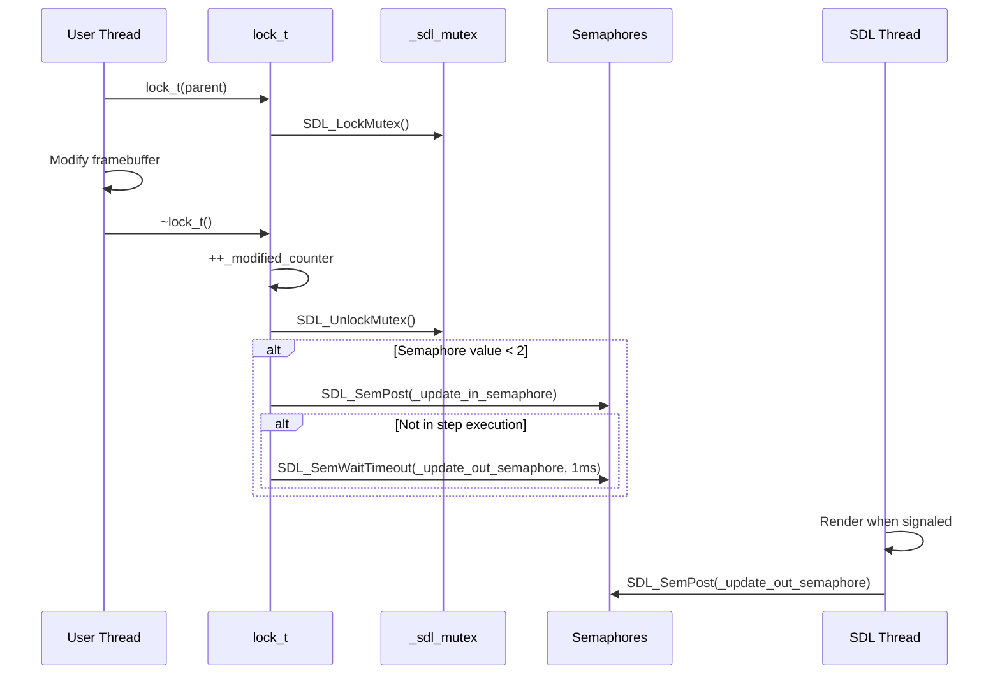
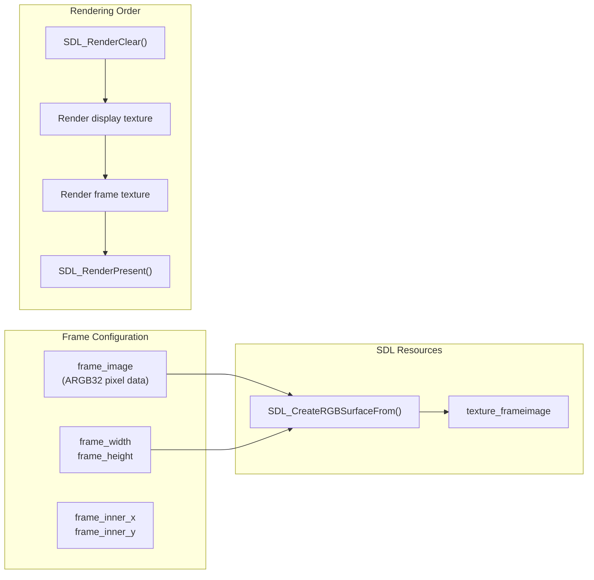
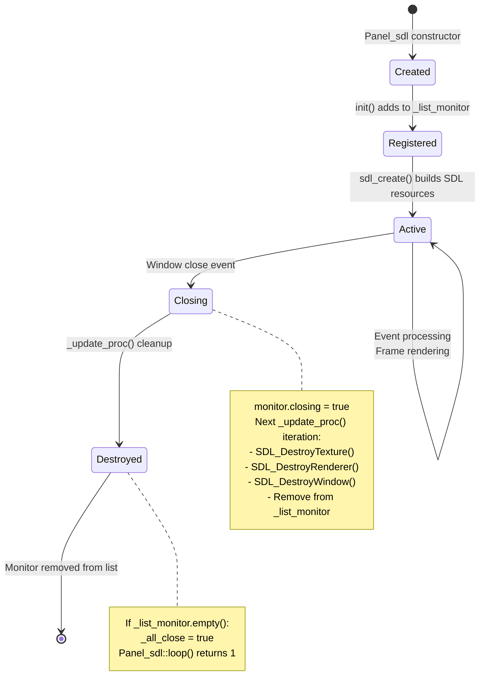

M5GFX SDL Simulation Platform

# SDL Simulation Platform

<details>
<summary>Relevant source files</summary>

The following files were used as context for generating this wiki page:

- [src/lgfx/v1/platforms/sdl/Panel_sdl.cpp](src/lgfx/v1/platforms/sdl/Panel_sdl.cpp)
- [src/lgfx/v1/platforms/sdl/Panel_sdl.hpp](src/lgfx/v1/platforms/sdl/Panel_sdl.hpp)
- [src/lgfx/v1/platforms/sdl/common.cpp](src/lgfx/v1/platforms/sdl/common.cpp)

</details>


This document describes the SDL (Simple DirectMedia Layer) platform implementation in M5GFX, which enables desktop development and testing without physical hardware. The SDL platform provides window management, rendering, mouse-to-touch input mapping, keyboard shortcuts, and debugger integration for rapid prototyping workflows.

For ESP32 hardware platform implementation, see [ESP32 Platform Overview](#5.1). For cross-platform development patterns, see [Cross-Platform Code Patterns](#6.4). For the specific panel driver API, see [Panel Driver Architecture](#4).

---

## Architecture Overview

The SDL platform implementation consists of three primary components: the `Panel_sdl` display driver, platform abstraction layer functions, and the SDL event/rendering loop.



**Sources:** [src/lgfx/v1/platforms/sdl/Panel_sdl.hpp:71-146](), [src/lgfx/v1/platforms/sdl/Panel_sdl.cpp:38-50]()

---

## Panel_sdl Class Structure

The `Panel_sdl` class extends `Panel_FrameBufferBase` to implement an SDL-backed display panel. It maintains a framebuffer in system memory and synchronizes it to an SDL texture for GPU-accelerated rendering.

```mermaid
classDiagram
    class Panel_FrameBufferBase {
        <<abstract>>
        +uint8_t** _lines_buffer
        +init(use_reset) bool
        +display(x, y, w, h) void
    }
    
    class Panel_sdl {
        -SDL_mutex* _sdl_mutex
        -monitor_t monitor
        -rgb888_t* _texturebuf
        -uint_fast16_t _modified_counter
        -uint_fast16_t _texupdate_counter
        -uint_fast16_t _display_counter
        -bool _invalidated
        +init(use_reset) bool
        +setColorDepth(depth) color_depth_t
        +drawPixelPreclipped(x, y, rawcolor) void
        +writeFillRectPreclipped(x, y, w, h, rawcolor) void
        +getTouchRaw(tp, count) uint_fast8_t
        +setWindowTitle(title) void
        +setScaling(sx, sy) void
        +setFrameImage(image, w, h, x, y) void
        -sdl_create(m) void
        -sdl_update() void
        -render_texture(texture, tx, ty, tw, th, angle) void
    }
    
    class monitor_t {
        +SDL_Window* window
        +SDL_Renderer* renderer
        +SDL_Texture* texture
        +SDL_Texture* texture_frameimage
        +Panel_sdl* panel
        +uint_fast16_t frame_width
        +uint_fast16_t frame_height
        +float scaling_x
        +float scaling_y
        +int_fast16_t frame_rotation
        +int_fast16_t frame_angle
        +int_fast16_t touch_x
        +int_fast16_t touch_y
        +bool touched
        +bool closing
    }
    
    class lock_t {
        -Panel_sdl* _parent
        +lock_t(parent)
        +~lock_t()
    }
    
    Panel_FrameBufferBase <|-- Panel_sdl
    Panel_sdl *-- monitor_t
    Panel_sdl +-- lock_t
```

**Sources:** [src/lgfx/v1/platforms/sdl/Panel_sdl.hpp:35-57](), [src/lgfx/v1/platforms/sdl/Panel_sdl.hpp:71-146]()

### Monitor Structure

The `monitor_t` struct encapsulates all SDL resources for a single display window. The library supports multiple simultaneous monitor instances through the `_list_monitor` global list.

| Field | Type | Purpose |
|-------|------|---------|
| `window` | `SDL_Window*` | SDL window handle |
| `renderer` | `SDL_Renderer*` | Hardware-accelerated renderer |
| `texture` | `SDL_Texture*` | Main display texture (RGB24) |
| `texture_frameimage` | `SDL_Texture*` | Optional device frame overlay |
| `frame_width` / `frame_height` | `uint_fast16_t` | Total frame dimensions including borders |
| `frame_inner_x` / `frame_inner_y` | `uint_fast16_t` | Display offset within frame |
| `scaling_x` / `scaling_y` | `float` | Window scaling factors |
| `frame_rotation` | `int_fast16_t` | Target rotation (0-3) |
| `frame_angle` | `int_fast16_t` | Current interpolated angle (0-270) |
| `touch_x` / `touch_y` | `int_fast16_t` | Transformed touch coordinates |
| `touched` | `bool` | Mouse button state |
| `closing` | `bool` | Window close pending |

**Sources:** [src/lgfx/v1/platforms/sdl/Panel_sdl.hpp:35-57]()

---

## Initialization and Thread Model

The SDL platform uses a dual-thread architecture: the main thread runs the user application code, while SDL operations run on a separate thread managed by the `Panel_sdl::main()` entry point.



**Sources:** [src/lgfx/v1/platforms/sdl/Panel_sdl.cpp:296-318](), [src/lgfx/v1/platforms/sdl/Panel_sdl.cpp:243-266]()

### Setup and Teardown Functions

The static lifecycle functions manage global SDL state:

- **`Panel_sdl::setup()`** [src/lgfx/v1/platforms/sdl/Panel_sdl.cpp:243-266](): Initializes SDL video subsystem, creates synchronization semaphores, sets up default key mappings (arrow keys to GPIO 36-39), spawns debugger detection thread.

- **`Panel_sdl::loop()`** [src/lgfx/v1/platforms/sdl/Panel_sdl.cpp:268-282](): Processes SDL events via `_event_proc()`, waits on `_update_in_semaphore` (max 1ms), renders all monitor windows via `_update_proc()`, signals completion via `_update_out_semaphore`. Returns non-zero when `_all_close` flag is set.

- **`Panel_sdl::close()`** [src/lgfx/v1/platforms/sdl/Panel_sdl.cpp:284-294](): Destroys semaphores, calls `SDL_Quit()`, marks `_inited` as false.

**Sources:** [src/lgfx/v1/platforms/sdl/Panel_sdl.cpp:243-294]()

---

## Window Management and Rendering

Each `Panel_sdl` instance creates an SDL window with hardware-accelerated rendering. The panel maintains two textures: the main display texture and an optional frame overlay.

### Window Creation

The `sdl_create()` method [src/lgfx/v1/platforms/sdl/Panel_sdl.cpp:495-535]() initializes SDL resources:



The texture format is `SDL_PIXELFORMAT_RGB24` (RGB888), matching the internal `_texturebuf` storage. The renderer uses hardware acceleration with VSync enabled by default.

**Sources:** [src/lgfx/v1/platforms/sdl/Panel_sdl.cpp:495-535]()

### Frame Buffer to Texture Synchronization

The `sdl_update()` method [src/lgfx/v1/platforms/sdl/Panel_sdl.cpp:537-627]() synchronizes the framebuffer to the SDL texture:

| Counter | Purpose |
|---------|---------|
| `_modified_counter` | Incremented by `lock_t` destructor on any drawing operation |
| `_texupdate_counter` | Updated when framebuffer is copied to `_texturebuf` |
| `_display_counter` | Updated when texture is presented to screen |

The method checks if `_texupdate_counter != _modified_counter`, and if so:

1. Locks `_sdl_mutex`
2. Converts framebuffer pixels to RGB888 using `pixelcopy_t::copy_rgb_fast<bgr888_t, T>` function pointers [src/lgfx/v1/platforms/sdl/Panel_sdl.cpp:547-556]()
3. Copies converted pixels to `_texturebuf`
4. Calls `SDL_UpdateTexture()` to upload to GPU

The color conversion handles multiple source formats:
- `rgb565_2Byte` → `swap565_t`
- `rgb888_3Byte` → `bgr888_t`
- `rgb332_1Byte` → `rgb332_t`
- `grayscale_8bit` → `grayscale_t`

**Sources:** [src/lgfx/v1/platforms/sdl/Panel_sdl.cpp:537-627](), [src/lgfx/v1/platforms/sdl/Panel_sdl.cpp:547-570]()

### Rotation and Scaling

The rendering system supports smooth rotation interpolation [src/lgfx/v1/platforms/sdl/Panel_sdl.cpp:572-584]():

```
target = (frame_rotation) * 90
angle = (((target * 4) + (angle * 4) + (angle < target ? 8 : 0)) >> 3)
```

This incremental approach prevents jarring transitions when rotation changes via the `L`/`R` keyboard shortcuts.

The `render_texture()` method [src/lgfx/v1/platforms/sdl/Panel_sdl.cpp:629-642]() uses `SDL_RenderCopyEx()` with pivot-point rotation:

```
pivot.x = (frame_width/2.0f - tx) * scaling_x
pivot.y = (frame_height/2.0f - ty) * scaling_y
```

This ensures the display rotates around its center, regardless of frame image dimensions.

**Sources:** [src/lgfx/v1/platforms/sdl/Panel_sdl.cpp:572-642]()

---

## Event Handling and Input Mapping

The `_event_proc()` function [src/lgfx/v1/platforms/sdl/Panel_sdl.cpp:84-204]() processes SDL events and maps them to emulated hardware inputs.



**Sources:** [src/lgfx/v1/platforms/sdl/Panel_sdl.cpp:84-204]()

### Keyboard Shortcuts

The system provides two types of keyboard mappings:

**Default GPIO Mappings** [src/lgfx/v1/platforms/sdl/Panel_sdl.cpp:248-253]():
- Arrow keys → GPIO 36-39 (M5Stack button emulation)

**Built-in System Shortcuts** (require modifier key, default `KMOD_NONE`):
- `L` / `R`: Rotate display counterclockwise/clockwise [src/lgfx/v1/platforms/sdl/Panel_sdl.cpp:106-121]()
- `1`-`6`: Set scaling to 1x-6x [src/lgfx/v1/platforms/sdl/Panel_sdl.cpp:124-133]()

Custom mappings can be added via `Panel_sdl::addKeyCodeMapping()` [src/lgfx/v1/platforms/sdl/Panel_sdl.cpp:64-72]().

**Sources:** [src/lgfx/v1/platforms/sdl/Panel_sdl.cpp:64-72](), [src/lgfx/v1/platforms/sdl/Panel_sdl.cpp:106-133](), [src/lgfx/v1/platforms/sdl/Panel_sdl.cpp:248-253]()

### Mouse-to-Touch Coordinate Transformation

The coordinate transformation [src/lgfx/v1/platforms/sdl/Panel_sdl.cpp:148-165]() applies rotation and scaling:

```
// Get window-relative mouse position
SDL_GetMouseState(&x, &y)

// Translate to window center
x -= w / 2.0f
y -= h / 2.0f

// Apply rotation matrix
sf = sin(frame_angle * π / 180)
cf = cos(frame_angle * π / 180)
nx = y * sf + x * cf
ny = y * cf - x * sf

// Scale to frame dimensions
x = (nx * frame_width / w) + (frame_width >> 1)
y = (ny * frame_height / h) + (frame_height >> 1)

// Remove frame border offset
touch_x = x - frame_inner_x
touch_y = y - frame_inner_y
```

This ensures touch coordinates match the logical display coordinate system regardless of window size or rotation.

**Sources:** [src/lgfx/v1/platforms/sdl/Panel_sdl.cpp:148-165]()

---

## Thread Synchronization and Locking

The SDL panel uses mutex-based synchronization to coordinate between the user thread (drawing) and SDL thread (rendering).

### lock_t RAII Guard

The `lock_t` struct [src/lgfx/v1/platforms/sdl/Panel_sdl.cpp:382-399]() implements RAII-style mutex locking:



All drawing methods that modify the framebuffer instantiate a `lock_t` at the beginning [src/lgfx/v1/platforms/sdl/Panel_sdl.cpp:401-435](). This ensures:

1. Mutex protection during pixel writes
2. Automatic counter increment on completion
3. Semaphore signaling to trigger rendering
4. Optional wait for render completion (unless debugger detected)

**Sources:** [src/lgfx/v1/platforms/sdl/Panel_sdl.cpp:382-399](), [src/lgfx/v1/platforms/sdl/Panel_sdl.cpp:401-435]()

---

## Debugger Detection and VSync Control

The SDL platform includes a debugger detection mechanism to improve the debugging experience when stepping through code.

### Detection Thread

The `detectDebugger()` function [src/lgfx/v1/platforms/sdl/Panel_sdl.cpp:207-220]() runs continuously in a separate thread:

```
prev_ms = SDL_GetTicks()
loop:
    SDL_Delay(1)
    ms = SDL_GetTicks()
    if (ms - prev_ms > 64):
        _in_step_exec = _msec_step_exec  // Default 512ms
    else if (_in_step_exec):
        --_in_step_exec
    prev_ms = ms
```

When the time delta exceeds 64ms (indicating a breakpoint or step operation), the `_in_step_exec` flag is set and maintained for approximately 512ms after normal execution resumes.

**Sources:** [src/lgfx/v1/platforms/sdl/Panel_sdl.cpp:207-220]()

### Behavioral Changes During Debugging

When `_in_step_exec` is true:

1. **VSync Disabled** [src/lgfx/v1/platforms/sdl/Panel_sdl.cpp:590-594](): 
   ```
   SDL_RenderSetVSync(monitor.renderer, !step_exec)
   ```
   Prevents waiting 16ms for the next frame when stepping through code.

2. **No Render Wait** [src/lgfx/v1/platforms/sdl/Panel_sdl.cpp:395-398]():
   ```
   if (!_in_step_exec) {
       SDL_SemWaitTimeout(_update_out_semaphore, 1);
   }
   ```
   Drawing operations don't wait for frame rendering to complete.

3. **Forced Display Synchronization** [src/lgfx/v1/platforms/sdl/Panel_sdl.cpp:443-452]():
   When `display()` is called during step execution, it actively polls until rendering completes:
   ```
   do {
       SDL_SemPost(_update_in_semaphore);
       SDL_SemWaitTimeout(_update_out_semaphore, 1);
   } while (_display_counter != _modified_counter);
   ```

This ensures each drawing operation is immediately visible when stepping through code, rather than being batched until the next VSync interval.

**Sources:** [src/lgfx/v1/platforms/sdl/Panel_sdl.cpp:443-452](), [src/lgfx/v1/platforms/sdl/Panel_sdl.cpp:590-594]()

---

## Platform Abstraction Implementation

The SDL platform provides dummy implementations of hardware-specific functions to enable compilation without ESP32 dependencies.

### GPIO Emulation

The GPIO system [src/lgfx/v1/platforms/sdl/common.cpp:36-43]() uses a simple array:

```
static uint8_t _gpio_dummy_values[EMULATED_GPIO_MAX];

void gpio_hi(uint32_t pin) { 
    _gpio_dummy_values[pin & (EMULATED_GPIO_MAX - 1)] = 1; 
}
void gpio_lo(uint32_t pin) { 
    _gpio_dummy_values[pin & (EMULATED_GPIO_MAX - 1)] = 0; 
}
bool gpio_in(uint32_t pin) { 
    return _gpio_dummy_values[pin & (EMULATED_GPIO_MAX - 1)]; 
}
```

The `EMULATED_GPIO_MAX` constant is defined in [src/lgfx/v1/platforms/sdl/common.hpp](). Keyboard events update these values via `gpio_lo()/gpio_hi()` calls.

**Sources:** [src/lgfx/v1/platforms/sdl/common.cpp:36-43]()

### Timing Functions

Timing functions [src/lgfx/v1/platforms/sdl/common.cpp:45-78]() delegate to SDL:

| Function | Implementation |
|----------|----------------|
| `millis()` | `SDL_GetTicks()` |
| `micros()` | `SDL_GetPerformanceCounter() / (SDL_GetPerformanceFrequency() / 1000000)` |
| `delay(ms)` | `SDL_Delay(ms)` for ms >= 1024, else `delayMicroseconds()` |
| `delayMicroseconds(us)` | `SDL_Delay((us/1000) - 1)` + busy-wait loop with `std::this_thread::yield()` |

The microsecond delay uses hybrid approach: coarse delay via SDL, then fine-grained busy-waiting to achieve accurate timing.

**Sources:** [src/lgfx/v1/platforms/sdl/common.cpp:45-78]()

### Bus Interfaces

SPI and I2C bus functions [src/lgfx/v1/platforms/sdl/common.cpp:82-112]() return `cpp::fail(error_t::unknown_err)` immediately. Since the SDL platform doesn't interact with real hardware peripherals, these are intentionally non-functional:

```cpp
namespace spi {
    cpp::result<void, error_t> init(...) { 
        return cpp::fail(error_t::unknown_err); 
    }
    void beginTransaction(...) {}
    void writeBytes(...) {}
}

namespace i2c {
    cpp::result<void, error_t> init(...) { 
        return cpp::fail(error_t::unknown_err); 
    }
    cpp::result<void, error_t> transactionWrite(...) { 
        return cpp::fail(error_t::unknown_err); 
    }
}
```

Code that attempts bus operations will receive errors, but the application can continue running with the display functional.

**Sources:** [src/lgfx/v1/platforms/sdl/common.cpp:82-112]()

---

## Device Frame Emulation

The SDL panel supports rendering an optional "device frame" image that surrounds the display, simulating the physical appearance of M5Stack devices.



**Configuration via `setFrameImage()`** [src/lgfx/v1/platforms/sdl/Panel_sdl.cpp:326-333]():

```cpp
void Panel_sdl::setFrameImage(const void* frame_image, 
                              int frame_width, int frame_height, 
                              int inner_x, int inner_y)
{
    monitor.frame_image = frame_image;
    monitor.frame_width = frame_width;
    monitor.frame_height = frame_height;
    monitor.frame_inner_x = inner_x;
    monitor.frame_inner_y = inner_y;
}
```

The frame image must be 32-bit ARGB format with alpha channel for transparency. During `sdl_create()` [src/lgfx/v1/platforms/sdl/Panel_sdl.cpp:524-532](), a surface is created from the raw pixel data and converted to a texture with `SDL_BLENDMODE_BLEND`.

The display texture is rendered first at `(inner_x, inner_y)` offset, then the frame texture is rendered at `(0, 0)`, creating the appearance of the display inset within the device body.

**Sources:** [src/lgfx/v1/platforms/sdl/Panel_sdl.cpp:326-333](), [src/lgfx/v1/platforms/sdl/Panel_sdl.cpp:524-532](), [src/lgfx/v1/platforms/sdl/Panel_sdl.cpp:614-625]()

---

## Multi-Monitor Support

The SDL platform maintains a global list of monitor instances [src/lgfx/v1/platforms/sdl/Panel_sdl.cpp:50](), enabling multiple simultaneous display windows:

```cpp
static std::list<monitor_t*> _list_monitor;
```

### Monitor Lifecycle



**Window Identification** [src/lgfx/v1/platforms/sdl/Panel_sdl.cpp:52-59]():

The `getMonitorByWindowID()` helper function matches SDL window events to the corresponding `monitor_t`:

```cpp
static monitor_t* const getMonitorByWindowID(uint32_t windowID)
{
    for (auto& m : _list_monitor) {
        if (SDL_GetWindowID(m->window) == windowID) { return m; }
    }
    return nullptr;
}
```

This enables event routing when multiple windows exist simultaneously.

**Sources:** [src/lgfx/v1/platforms/sdl/Panel_sdl.cpp:50-59](), [src/lgfx/v1/platforms/sdl/Panel_sdl.cpp:222-241]()

---

## Color Depth Support

The SDL panel supports multiple color depths with automatic conversion to RGB888 for texture upload.

**Supported Formats** [src/lgfx/v1/platforms/sdl/Panel_sdl.cpp:364-380]():

| Input Format | Bits | Conversion Function |
|--------------|------|---------------------|
| `rgb888_3Byte` | 24 | Direct copy (`bgr888_t → bgr888_t`) |
| `rgb565_2Byte` | 16 | `swap565_t → bgr888_t` |
| `rgb332_1Byte` | 8 | `rgb332_t → bgr888_t` |
| `grayscale_8bit` | 8 | `grayscale_t → bgr888_t` |

The `setColorDepth()` method coerces requests to one of these four formats:

```cpp
color_depth_t Panel_sdl::setColorDepth(color_depth_t depth)
{
    auto bits = depth & color_depth_t::bit_mask;
    if (bits >= 16) {
        depth = (bits > 16) ? rgb888_3Byte : rgb565_2Byte;
    } else {
        depth = (depth == color_depth_t::grayscale_8bit) 
              ? grayscale_8bit : rgb332_1Byte;
    }
    _write_depth = depth;
    _read_depth = depth;
    return depth;
}
```

During rendering, the appropriate `pixelcopy_t::copy_rgb_fast<bgr888_t, T>` function pointer is selected [src/lgfx/v1/platforms/sdl/Panel_sdl.cpp:547-556]() to perform efficient SIMD-optimized conversion.

**Sources:** [src/lgfx/v1/platforms/sdl/Panel_sdl.cpp:364-380](), [src/lgfx/v1/platforms/sdl/Panel_sdl.cpp:547-556]()

---

## Touch Input Interface

The `Panel_sdl` class implements `getTouchRaw()` [src/lgfx/v1/platforms/sdl/Panel_sdl.cpp:455-463]() to provide touch data from mouse input:

```cpp
uint_fast8_t Panel_sdl::getTouchRaw(touch_point_t* tp, uint_fast8_t count)
{
    tp->x = monitor.touch_x;
    tp->y = monitor.touch_y;
    tp->size = monitor.touched ? 1 : 0;
    tp->id = 0;
    return monitor.touched;
}
```

The method returns:
- Touch count (0 or 1)
- Transformed coordinates in `tp->x` / `tp->y`
- Touch pressure simulation in `tp->size` (0 or 1)
- Fixed touch ID of 0

This enables touch-based UI code to work identically on SDL and hardware platforms without modification.

Additionally, the `Touch_sdl` class [src/lgfx/v1/platforms/sdl/Panel_sdl.hpp:60-67]() provides a dummy `ITouch` implementation that can be attached to the panel for API compatibility.

**Sources:** [src/lgfx/v1/platforms/sdl/Panel_sdl.cpp:455-463](), [src/lgfx/v1/platforms/sdl/Panel_sdl.hpp:60-67]()

---

## Memory Management

The SDL panel uses heap allocation for framebuffer and texture storage.

### Allocation Strategy

**Framebuffer Initialization** [src/lgfx/v1/platforms/sdl/Panel_sdl.cpp:644-668]():

```
lineArray = heap_alloc_dma(height * sizeof(uint8_t*))
_texturebuf = heap_alloc_dma(width * height * sizeof(rgb888_t))
width_aligned = (width + 7) & ~7u
framebuffer = heap_alloc_dma(width_aligned * height + 16)

for y in 0..height:
    lineArray[y] = framebuffer + (y * width_aligned)
```

Three allocations occur:
1. **Line pointer array**: Enables per-line addressing
2. **Texture buffer**: RGB888 staging area for SDL texture upload
3. **Framebuffer**: Actual pixel storage in `_write_depth` format

The framebuffer width is aligned to 8-byte boundaries to optimize SIMD operations during pixel copy.

**Deinitialization** [src/lgfx/v1/platforms/sdl/Panel_sdl.cpp:670-683]():

```cpp
void Panel_sdl::deinitFrameBuffer(void)
{
    auto lines = _lines_buffer;
    _lines_buffer = nullptr;
    if (lines != nullptr) {
        heap_free(lines[0]);  // Free framebuffer
        heap_free(lines);     // Free line array
    }
    if (_texturebuf) {
        heap_free(_texturebuf);  // Free texture buffer
        _texturebuf = nullptr;
    }
}
```

**Sources:** [src/lgfx/v1/platforms/sdl/Panel_sdl.cpp:644-683]()

---

## Conditional Compilation

The SDL platform code is conditionally compiled based on platform detection:

```cpp
#if !defined (ARDUINO)
#include "Panel_sdl.hpp"
#if defined ( SDL_h_ )
// SDL implementation
#endif
#endif
```

The `SDL_h_` macro is defined when SDL2 headers are included. This typically occurs in native/desktop build environments configured in [platformio.ini]().

When building for ESP32, these files are excluded from compilation, and the ESP32-specific implementations in `src/lgfx/v1/platforms/esp32/` are used instead.

**Sources:** [src/lgfx/v1/platforms/sdl/Panel_sdl.cpp:21-26](), [src/lgfx/v1/platforms/sdl/common.cpp:21-25]()