M5GFX Sprite and Off-Screen Buffers

# 3.4 Sprite and Off-Screen Buffers

<details>
<summary>Relevant source files</summary>

The following files were used as context for generating this wiki page:

- [src/lgfx/v1/LGFX_Sprite.cpp](src/lgfx/v1/LGFX_Sprite.cpp)
- [src/lgfx/v1/misc/pixelcopy.cpp](src/lgfx/v1/misc/pixelcopy.cpp)
- [src/lgfx/v1/misc/pixelcopy.hpp](src/lgfx/v1/misc/pixelcopy.hpp)
- [src/lgfx/v1/panel/Panel_FrameBufferBase.cpp](src/lgfx/v1/panel/Panel_FrameBufferBase.cpp)
- [src/lgfx/v1/panel/Panel_FrameBufferBase.hpp](src/lgfx/v1/panel/Panel_FrameBufferBase.hpp)

</details>


## Overview

This page documents the sprite and off-screen buffer system in LovyanGFX, which provides RAM-based frame buffers for drawing operations before display output. The system consists of three primary components:

- **`LGFX_Sprite`** - High-level sprite API inheriting from `LGFXBase`
- **`Panel_Sprite`** - Low-level frame buffer implementation inheriting from `Panel_Device`
- **`Panel_FrameBufferBase`** - Base class for frame buffer panels with line-based buffer management

These classes enable off-screen rendering, double buffering, sprite transformations (rotation/zoom/affine), palette-based color management, and BMP file loading. Sprites support the same drawing operations as physical displays but perform them in memory, with the complete buffer transferred to hardware in a single operation.

**Related pages:** Color types and conversion (page 3.2), Pixel copy and transformation (page 3.3), Panel driver architecture (page 4).

## Architecture

#### Diagram: Sprite System Class Structure

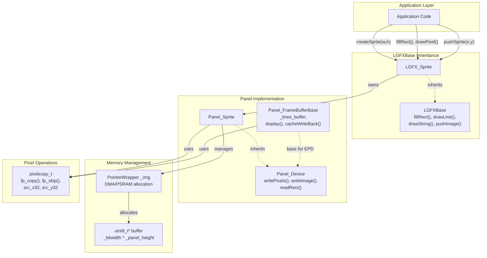

**Sources:** [src/lgfx/v1/LGFX_Sprite.hpp:34-457](), [src/lgfx/v1/LGFX_Sprite.cpp:36-56](), [src/lgfx/v1/panel/Panel_FrameBufferBase.hpp:29-73]()

The sprite system consists of:

- **`LGFX_Sprite`** - Provides the public sprite API and inherits drawing methods from `LGFXBase`. Manages sprite lifecycle, palette storage, and push operations to displays.
- **`Panel_Sprite`** - Implements `Panel_Device` interface for memory-based rendering. Handles buffer allocation via `PointerWrapper`, rotation transforms, and direct pixel access.
- **`Panel_FrameBufferBase`** - Base class for panels with line-based buffers (used by EPD displays). Manages `_lines_buffer` array, cache coherency, and dirty region tracking via `_range_mod`.

## Core Classes

#### Diagram: Class Hierarchy and Key Members

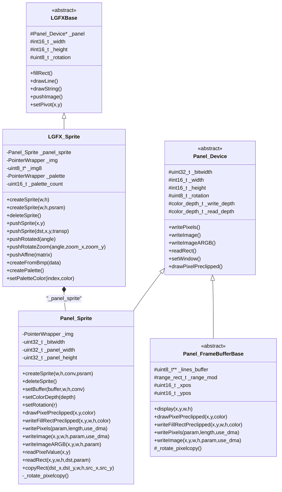

**Sources:** [src/lgfx/v1/LGFX_Sprite.hpp:34-457](), [src/lgfx/v1/LGFX_Sprite.cpp:36-686](), [src/lgfx/v1/panel/Panel_FrameBufferBase.hpp:29-73]()

### LGFX_Sprite

Inherits from `LGFXBase` to provide high-level sprite API. Contains `_panel_sprite` member for buffer management and owns `_img` (buffer reference) and `_palette` (color palette) via `PointerWrapper`. Provides `createSprite()`, `deleteSprite()`, and multiple `pushSprite()` variants for display output with optional transformations.

### Panel_Sprite

Implements `Panel_Device` interface for memory-based rendering. Allocates buffer via `createSprite()` which stores result in `_img`. The `_bitwidth` field accounts for alignment requirements. Implements `drawPixelPreclipped()`, `writeFillRectPreclipped()`, `writePixels()`, and `writeImage()` with rotation handling via `_rotate_pixelcopy()`.

### Panel_FrameBufferBase

Base class for panels with line-based buffers (e.g., EPD displays). Stores buffer as `_lines_buffer` (array of row pointers). Tracks modified regions via `_range_mod` and calls `display()` to flush changes. On ESP32 with cache-enabled PSRAM, calls `Cache_WriteBack_Addr()` to ensure cache coherency before buffer access.

## Memory Management

### Allocation Strategies

`Panel_Sprite::createSprite()` allocates memory via `PointerWrapper::reset()` which selects from multiple allocation sources:

| Strategy | Use Case | Method |
|----------|----------|--------|
| **DMA Memory** | Default allocation for SPI DMA transfers | `createSprite(w,h)` or `createSprite(w,h,false)` |
| **PSRAM** | Large sprites when DMA memory constrained | `createSprite(w,h,true)` |
| **External Buffer** | User-managed or static memory | `setBuffer(buffer,w,h,conv)` |

The `psram` parameter maps to `AllocationSource::Psram` or `AllocationSource::Dma` in the `PointerWrapper::reset()` call.

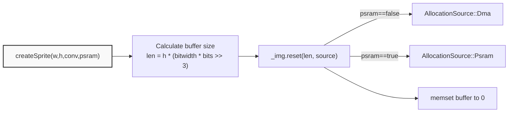

**Sources:** [src/lgfx/v1/LGFX_Sprite.cpp:58-86]()

### Buffer Layout

`Panel_Sprite` organizes memory as a linear row-major array. The `_bitwidth` field stores the actual buffer width after alignment:

```
x_mask = 7 >> (conv->bits >> 1)
_bitwidth = (w + x_mask) & (~x_mask)
```

Alignment examples:
- **8-bit (RGB332):** `x_mask = 7 >> 4 = 0` → no padding
- **4-bit (16-color):** `x_mask = 7 >> 2 = 1` → align to 2-pixel boundaries
- **1-bit (monochrome):** `x_mask = 7 >> 0 = 7` → align to 8-pixel boundaries

Buffer size calculation in `createSprite()`:
```cpp
size_t len = h * (_bitwidth * _write_bits >> 3) + std::max(1, _write_bits >> 3);
```

The extra `std::max(1, _write_bits >> 3)` bytes provide guard space for partial byte writes.

**Sources:** [src/lgfx/v1/LGFX_Sprite.cpp:36-49](), [src/lgfx/v1/LGFX_Sprite.cpp:58-86]()

### Cache Coherency (Panel_FrameBufferBase)

On ESP32-S3 with PSRAM, `Panel_FrameBufferBase::display()` calls `Cache_WriteBack_Addr()` to flush CPU cache before DMA transfers. The function checks `isEmbeddedMemory()` to skip writeback for on-chip RAM.

```cpp
void cacheWriteBack(const void* ptr, uint32_t size) {
  if (!isEmbeddedMemory(ptr)) {
    Cache_WriteBack_Addr((uint32_t)ptr, size);
  }
}
```

This ensures DMA reads the latest pixel data when transferring from PSRAM to display hardware.

**Sources:** [src/lgfx/v1/panel/Panel_FrameBufferBase.cpp:62-72](), [src/lgfx/v1/panel/Panel_FrameBufferBase.cpp:132-165]()

## Color Depth Support

Sprites support the same color depths as physical displays:

| Depth | Type | Bits | Typical Use | Palette Support |
|-------|------|------|-------------|-----------------|
| 1-bit | Monochrome | 1 | B&W graphics, fonts | Yes (2 colors) |
| 2-bit | Grayscale | 2 | Simple grayscale | Yes (4 colors) |
| 4-bit | Grayscale/Palette | 4 | Grayscale or 16-color | Yes (16 colors) |
| 8-bit | RGB332/Palette | 8 | 256-color or paletted | Yes (256 colors) |
| 16-bit | RGB565 | 16 | Standard color display | No |
| 24-bit | RGB888 | 24 | High-quality color | No |

The color depth is set via `setColorDepth()` and affects both read and write operations. Changing color depth after sprite creation causes the sprite to be deleted and recreated.

**Sources:** [src/lgfx/v1/LGFX_Sprite.hpp:308-327](), [src/lgfx/v1/LGFX_Sprite.cpp:88-93]()

## Rotation Support

Sprites support 8 rotation modes (0-7) that combine 90-degree rotations with mirroring:

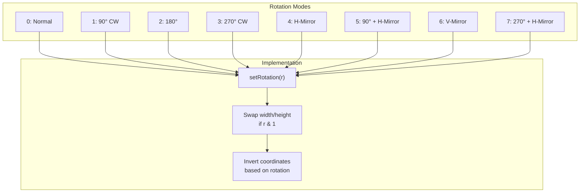

### Rotation Transform Logic

`Panel_Sprite::drawPixelPreclipped()` applies coordinate transforms based on `_rotation`:

```cpp
uint_fast8_t r = _rotation;
if (r) {
  if ((1u << r) & 0b10010110) { y = _height - (y + 1); }  // rotations 1,2,4,7
  if (r & 2)                  { x = _width  - (x + 1); }  // rotations 2,3,6,7
  if (r & 1) { std::swap(x, y); }                         // rotations 1,3,5,7
}
```

This bitmask-based approach avoids conditional branches by using bit patterns to identify rotation modes requiring Y-flip (0b10010110 = rotations 1,2,4,7), X-flip (bit 1), and X/Y swap (bit 0).

**Sources:** [src/lgfx/v1/LGFX_Sprite.cpp:127-164](), [src/lgfx/v1/panel/Panel_FrameBufferBase.cpp:186-207]()

## Pixel Operations

### Direct Pixel Access

The `drawPixelPreclipped()` method writes individual pixels with rotation applied:

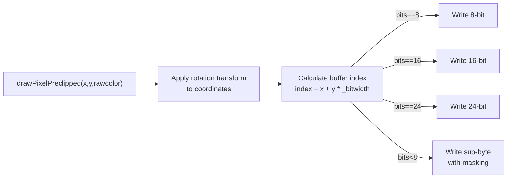

**Sources:** [src/lgfx/v1/LGFX_Sprite.cpp:127-164]()

### Filled Rectangle Operations

The `writeFillRectPreclipped()` method is optimized for bulk filling:

**For full-width rectangles:**
- Creates a single scanline and uses `memcpy()` to replicate it
- If rectangle width equals sprite width, treats as single large buffer

**For sub-byte pixel formats:**
- Uses bit-level masking to handle partial bytes
- Processes left edge mask, middle bytes, and right edge mask separately

**Sources:** [src/lgfx/v1/LGFX_Sprite.cpp:166-274]()

### Pixel Copy with Transformations

`Panel_Sprite::writePixels()` handles sequential pixel writes with optional rotation:

#### Diagram: writePixels() Execution Paths

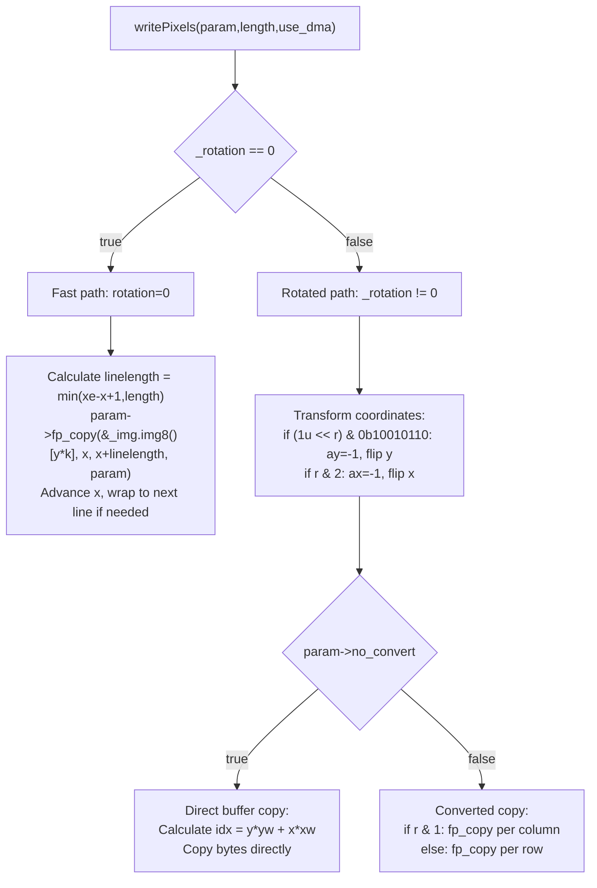

**Fast path:** Copies contiguous scanlines using `fp_copy()` with linear addressing: `&_img.img8()[y * k]` where `k = _bitwidth * bits >> 3`.

**Rotated path:** Calculates per-pixel coordinates with `ax` and `ay` direction multipliers, then either direct-copies bytes (if `no_convert`) or calls `fp_copy()` with adjusted indices.

**Sources:** [src/lgfx/v1/LGFX_Sprite.cpp:329-431](), [src/lgfx/v1/panel/Panel_FrameBufferBase.cpp:289-373]()

## Image Operations

### Writing Images to Sprites

`Panel_Sprite::writeImage()` transfers rectangular image data to the sprite buffer with optional fast paths:

#### Diagram: writeImage() Decision Tree

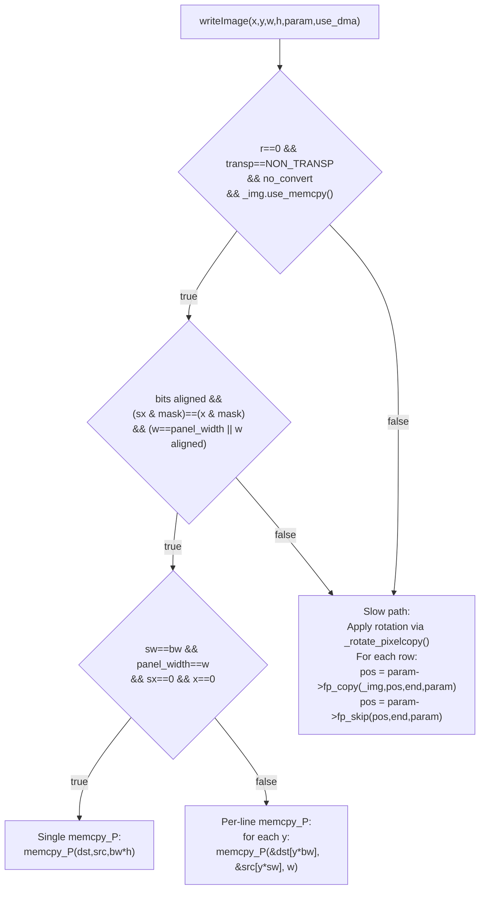

**Fast path requirements:**
- `r == 0` (no rotation)
- `param->transp == pixelcopy_t::NON_TRANSP` (no transparency)
- `param->no_convert == true` (same color format)
- `_img.use_memcpy() == true` (memory supports memcpy)
- Bit alignment matches between source and destination

**Full buffer copy:** When source and destination widths match and no offsets, uses single `memcpy_P()`.

**Per-line copy:** When widths differ, copies each scanline separately with correct stride.

**Slow path:** Calls `_rotate_pixelcopy()` to adjust parameters, then uses `fp_copy()` and `fp_skip()` function pointers for pixel-by-pixel transformation.

**Sources:** [src/lgfx/v1/LGFX_Sprite.cpp:433-491](), [src/lgfx/v1/panel/Panel_FrameBufferBase.cpp:375-421]()

### ARGB Image Blending

The `writeImageARGB()` method handles images with alpha channels:


This method always uses the pixel copy function pointer (`fp_copy`) which performs alpha blending when the source format includes alpha.

**Sources:** [src/lgfx/v1/LGFX_Sprite.cpp:493-515]()

## Reading from Sprites

### Pixel Reading

The `readPixelValue()` method retrieves individual pixel values:

**Algorithm:**
1. Apply inverse rotation to coordinates
2. Check bounds against panel dimensions
3. Calculate buffer index
4. Extract pixel value based on bit depth

**Sources:** [src/lgfx/v1/LGFX_Sprite.cpp:517-545]()

### Rectangle Reading

The `readRect()` method extracts a rectangular region:

**Fast path (no rotation, no conversion, ≥8 bits):**
```
for each row:
    memcpy(&_img[(x + y * _bitwidth) * bytes], dst, width * bytes)
```

**General path:**
- Uses `pixelcopy_t` with sprite buffer as source
- Handles rotation by transforming source coordinates
- Applies color conversion if needed

**Sources:** [src/lgfx/v1/LGFX_Sprite.cpp:547-610]()

## In-Sprite Copy Operations

The `copyRect()` method copies regions within the same sprite:

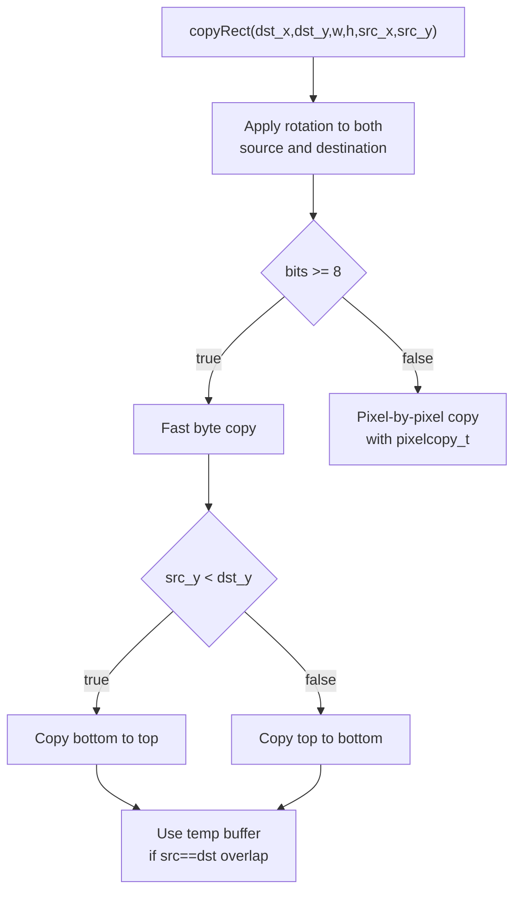

**Key behaviors:**
- Handles overlapping regions correctly
- Uses `memmove()` when buffer supports it
- Uses temporary buffer when necessary to prevent corruption
- For sub-byte formats, uses `pixelcopy_t` for bit-level operations

**Sources:** [src/lgfx/v1/LGFX_Sprite.cpp:612-685]()

## BMP File Loading

The sprite system includes built-in support for loading BMP images:

### Supported BMP Formats

| Feature | Support |
|---------|---------|
| **Bit depths** | 1, 2, 4, 8, 16, 24, 32 |
| **Compression** | Uncompressed (0), RLE8 (1), RLE4 (2) |
| **Color order** | BGR (standard BMP) |
| **Direction** | Top-down (negative height) and bottom-up (positive height) |

### Loading Process

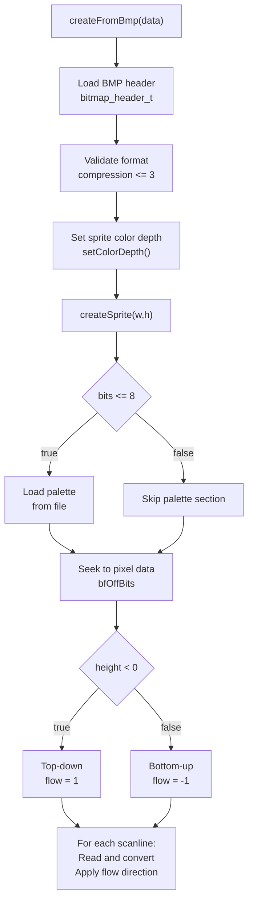

### BMP Data Handling

`LGFX_Sprite::createFromBmp()` loads BMP files using the following format-specific handling:

| Format | Processing |
|--------|-----------|
| **1/2/4/8-bit** | Load palette as `argb8888_t[]`, convert to `bgr888_t`, store in `_palette.img24()`. Decompress RLE8 (compression=1) or RLE4 (compression=2) if needed. |
| **16-bit** | Read as little-endian, swap bytes: `img[i] = (lineBuffer[i<<1]<<8) + lineBuffer[(i<<1)+1]` |
| **24-bit** | Swap BGR to RGB: `img[i*3] = lineBuffer[i*3+2]; img[i*3+1] = lineBuffer[i*3+1]; img[i*3+2] = lineBuffer[i*3]` |
| **32-bit** | Store as 24-bit RGB, discard alpha: copy red/green/blue channels only |

**Scanline alignment:** All formats handle 4-byte aligned scanlines via `buffersize = ((w * bpp + 31) >> 5) << 2`.

**Vertical direction:** Positive height = bottom-up (flow=-1), negative height = top-down (flow=1).

**Sources:** [src/lgfx/v1/LGFX_Sprite.cpp:689-786]()

## Palette Management

For color depths ≤8 bits, sprites can use indexed color with runtime-modifiable palettes. This reduces memory usage while maintaining color flexibility.

### Palette Creation

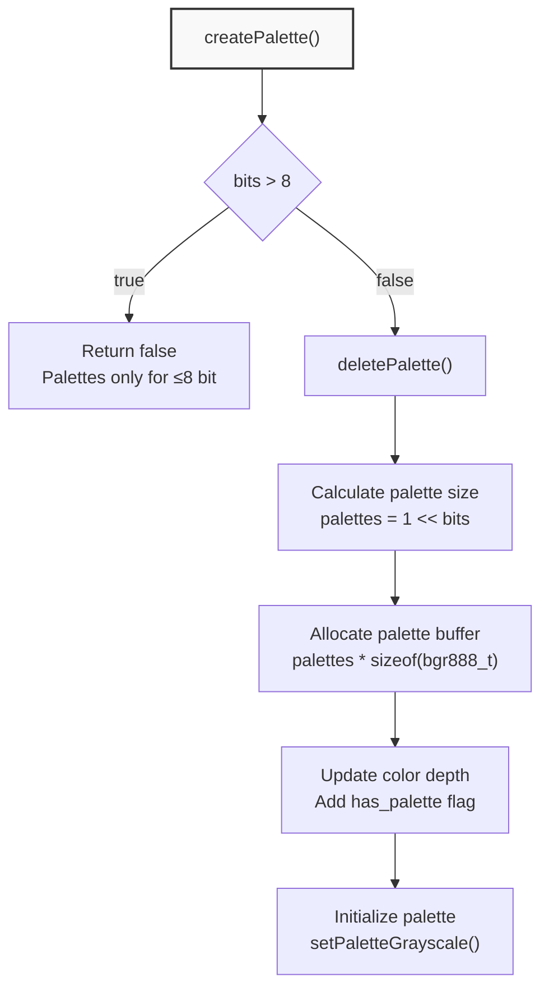

### Palette Operations

| Operation | Method | Description |
|-----------|--------|-------------|
| **Create default** | `createPalette()` | Allocates palette, initializes to grayscale |
| **Create from RGB565** | `createPalette(colors, count)` | Initializes from uint16_t array |
| **Create from RGB888** | `createPalette(colors, count)` | Initializes from uint32_t array |
| **Set grayscale** | `setPaletteGrayscale()` | Linear grayscale gradient |
| **Set entry** | `setPaletteColor(index, color)` | Set individual palette entry |
| **Get index** | `getPaletteIndex(color)` | Find index of closest color |
| **Set bitmap colors** | `setBitmapColor(fg, bg)` | For 1-bit sprites (indices 0,1) |

### Palette Initialization Modes

**Grayscale mode:**
```
For 1-bit: k = 0xFFFFFF → colors: [0x000000, 0xFFFFFF]
For 2-bit: k = 0x555555 → colors: [0x000000, 0x555555, 0xAAAAAA, 0xFFFFFF]
For 4-bit: k = 0x111111 → 16 gray levels
For 8-bit: k = 0x010101 → 256 gray levels
```

**Sources:** [src/lgfx/v1/LGFX_Sprite.hpp:220-306](), [src/lgfx/v1/LGFX_Sprite.cpp:398-417]()

### Palette Color Lookup

The `getPaletteIndex()` method searches for an exact color match in the palette:

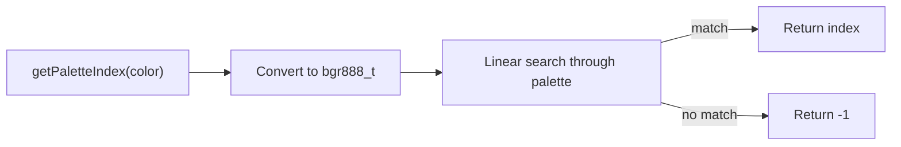

This method performs exact matching only. For closest color matching, applications must implement their own color distance algorithms.

**Sources:** [src/lgfx/v1/LGFX_Sprite.hpp:276-289]()

## Pushing Sprites to Display

The sprite system provides multiple methods for transferring sprite contents to displays with various transformations. All push operations use the parent display's current color depth for output.

### Basic Push Operations

#### Diagram: Push Operation Pipeline

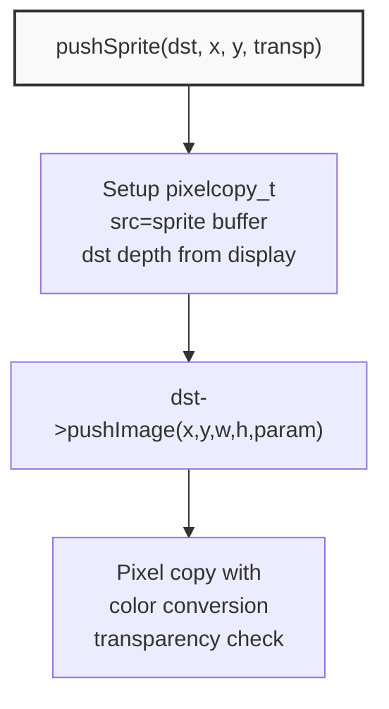

#### Push Methods

| Method | Parameters | Operation |
|--------|------------|-----------|
| `pushSprite(x, y)` | Position only | Direct copy to parent display |
| `pushSprite(dst, x, y)` | Target display | Direct copy to specified display |
| `pushSprite(x, y, transp)` | With transparency | Skip pixels matching transp color |
| `pushSprite(dst, x, y, transp)` | All options | Full control |

**Implementation:**
```
push_sprite(dst, x, y, transp) {
    pixelcopy_t p(_img, dst->getColorDepth(), getColorDepth(), 
                  dst->hasPalette(), _palette, transp);
    dst->pushImage(x, y, _panel_width, _panel_height, &p, use_dma);
}
```

**Sources:** [src/lgfx/v1/LGFX_Sprite.hpp:334-338](), [src/lgfx/v1/LGFX_Sprite.cpp:421-425]()

### Rotated Push Operations

#### Diagram: Rotation and Zoom Pipeline

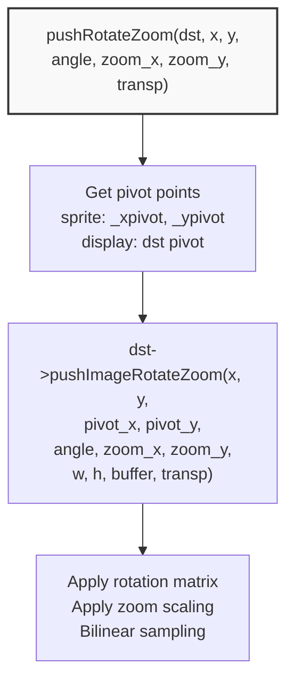

#### Rotation Methods

| Method | Transform | Anti-aliasing |
|--------|-----------|---------------|
| `pushRotated(angle)` | Rotation only | No |
| `pushRotated(angle, transp)` | Rotation + transparency | No |
| `pushRotatedWithAA(angle)` | Rotation only | Yes |
| `pushRotatedWithAA(angle, transp)` | Rotation + transparency | Yes |

**Rotation with zoom:**

| Method | Parameters | Anti-aliasing |
|--------|------------|---------------|
| `pushRotateZoom(angle, zoom_x, zoom_y)` | Zoom factors | No |
| `pushRotateZoom(dst_x, dst_y, angle, zoom_x, zoom_y)` | Position + zoom | No |
| `pushRotateZoomWithAA(angle, zoom_x, zoom_y)` | Zoom factors | Yes |
| `pushRotateZoomWithAA(dst_x, dst_y, angle, zoom_x, zoom_y)` | Position + zoom | Yes |

**Angle units:** Degrees (0-360), clockwise rotation

**Sources:** [src/lgfx/v1/LGFX_Sprite.hpp:340-366](), [src/lgfx/v1/LGFX_Sprite.cpp:427-435]()

### Affine Transform Push Operations

#### Diagram: Affine Transform Matrix

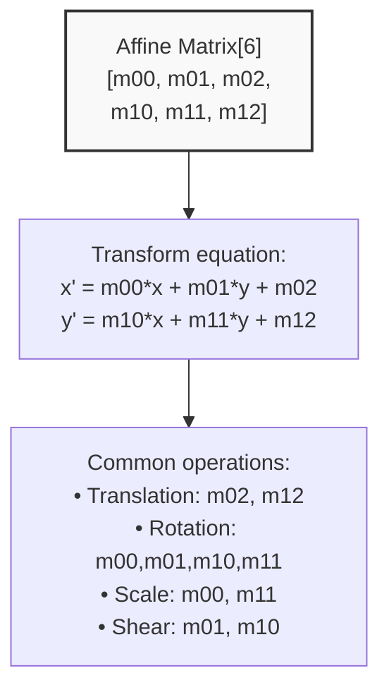

#### Affine Methods

| Method | Anti-aliasing | Description |
|--------|---------------|-------------|
| `pushAffine(matrix)` | No | Arbitrary 2D affine transform |
| `pushAffine(dst, matrix)` | No | To specific display |
| `pushAffine(matrix, transp)` | No | With transparency |
| `pushAffineWithAA(matrix)` | Yes | With anti-aliasing |
| `pushAffineWithAA(dst, matrix, transp)` | Yes | All options |

**Matrix format:**
```
matrix[0] = m00  (x scale / rotation component)
matrix[1] = m01  (x shear / rotation component)
matrix[2] = m02  (x translation)
matrix[3] = m10  (y shear / rotation component)
matrix[4] = m11  (y scale / rotation component)
matrix[5] = m12  (y translation)
```

**Sources:** [src/lgfx/v1/LGFX_Sprite.hpp:368-376](), [src/lgfx/v1/LGFX_Sprite.cpp:437-445]()

### Anti-aliasing in Push Operations

Methods with `WithAA` suffix use bilinear filtering for smoother output:

**Without anti-aliasing:**
- Uses nearest-neighbor sampling
- Faster performance
- Aliased edges (stairstep artifacts)

**With anti-aliasing:**
- Uses bilinear interpolation
- Samples 2x2 pixel neighborhood
- Weighted average based on fractional position
- Smoother edges, slower performance

**Performance impact:** Anti-aliasing is approximately 2-4x slower than nearest-neighbor sampling.

**Sources:** [src/lgfx/v1/misc/pixelcopy.hpp:310-407](), [src/lgfx/v1/misc/pixelcopy.hpp:409-498]()

### Pivot Point Management

Rotation and zoom operations use pivot points:

**Sprite pivot:** Set with `setPivot(x, y)` (inherited from LGFXBase)
- Default: Center of sprite (`_xpivot = width/2`, `_ypivot = height/2`)
- Point within sprite that acts as rotation center

**Display pivot:** From destination display's `getPivotX()`, `getPivotY()`
- Default: Center of display
- Point on display where sprite pivot maps to

**Sources:** [src/lgfx/v1/LGFX_Sprite.cpp:427-435]()

## Pixel Copy Integration

The sprite system relies heavily on the `pixelcopy_t` structure for pixel operations. See [Pixel Copy and Transformation System](#2.4) for details, but key integrations include:

### Function Pointer Dispatch

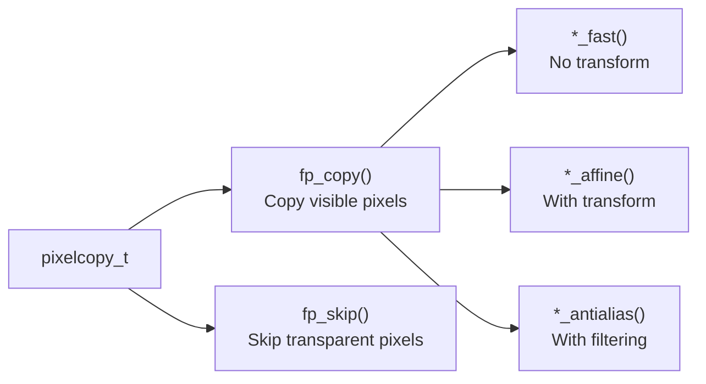

**Sources:** [src/lgfx/v1/misc/pixelcopy.hpp:81-82](), [src/lgfx/v1/misc/pixelcopy.cpp:27-84]()

### Affine Transformation Fields

The `pixelcopy_t` structure maintains state for affine transformations:

| Field | Purpose |
|-------|---------|
| `src_x32`, `src_y32` | Current source position (16.16 fixed-point) |
| `src_x32_add`, `src_y32_add` | Position increment per pixel |
| `FP_SCALE = 16` | Fixed-point scale factor |

These fields enable rotation and scaling when writing images to sprites.

**Sources:** [src/lgfx/v1/misc/pixelcopy.hpp:32-56]()

### Rotation Parameter Transformation

`Panel_Sprite::_rotate_pixelcopy()` and `Panel_FrameBufferBase::_rotate_pixelcopy()` adjust `pixelcopy_t` parameters when writing images to rotated buffers:

#### Diagram: _rotate_pixelcopy() Transform Logic

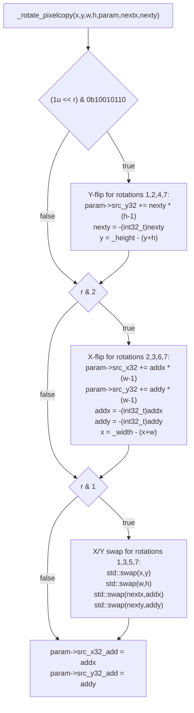

This function modifies `param->src_x32`, `param->src_y32`, `param->src_x32_add`, and `param->src_y32_add` to account for rotation, ensuring image data is written to the correct transformed coordinates.

**Sources:** [src/lgfx/v1/LGFX_Sprite.cpp:294-327](), [src/lgfx/v1/panel/Panel_FrameBufferBase.cpp:254-287]()

## Performance Optimizations

### Fast Path Detection

The sprite implementation includes several fast paths:

**writeImage() fast path:**
- Direct `memcpy()` when no transformation needed
- Up to 10x faster than pixel-by-pixel copy

**writeFillRectPreclipped() optimization:**
- Single scanline replication for solid fills
- Treats full-width fills as single large buffer

**readRect() fast path:**
- Direct `memcpy()` for unrotated, unconverted reads
- Avoids function pointer overhead

### Memory Copy Optimization

The `PointerWrapper` class tracks whether the memory is safe for `memcpy()`:

```
if (_img.use_memcpy()) {
    // Use memcpy/memmove
} else {
    // Use temporary buffer
}
```

This check accounts for memory that may have volatile characteristics or require special handling.

**Sources:** [src/lgfx/v1/LGFX_Sprite.cpp:189-211](), [src/lgfx/v1/LGFX_Sprite.cpp:436-468](), [src/lgfx/v1/LGFX_Sprite.cpp:550-560](), [src/lgfx/v1/LGFX_Sprite.cpp:664-683]()

## Usage Patterns

### Basic Sprite Creation and Usage

```
1. Create sprite with desired dimensions and color depth
2. Draw to sprite using standard LGFXBase methods
3. Push sprite to display
4. Optionally delete sprite to free memory
```

### Double Buffering

```
1. Create sprite matching display dimensions
2. Clear sprite
3. Draw complete frame to sprite
4. Push entire sprite to display
5. Repeat from step 2
```

### Sprite Composition

```
1. Create multiple sprites for different layers
2. Draw each layer independently
3. Push sprites to display with transparency
4. Or composite sprites to a larger sprite before final push
```

### Rotated Rendering

```
1. Create sprite
2. Call setRotation() before drawing
3. Draw operations automatically apply rotation
4. Push sprite to display
```

**Sources:** [src/lgfx/v1/LGFX_Sprite.cpp:1-791]()