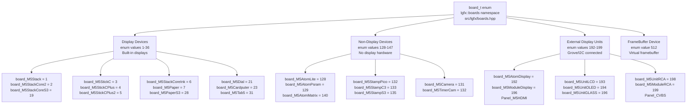
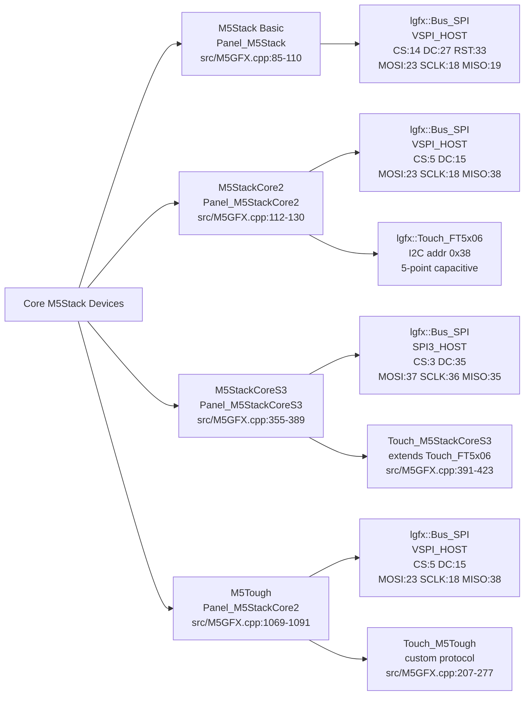
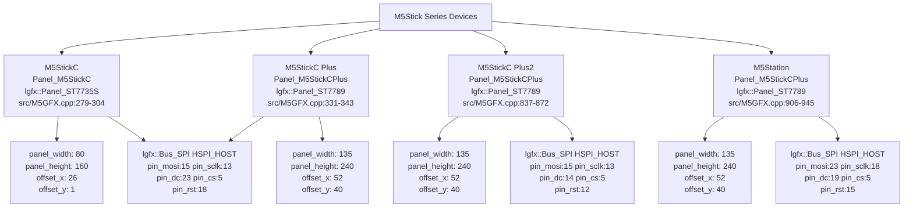
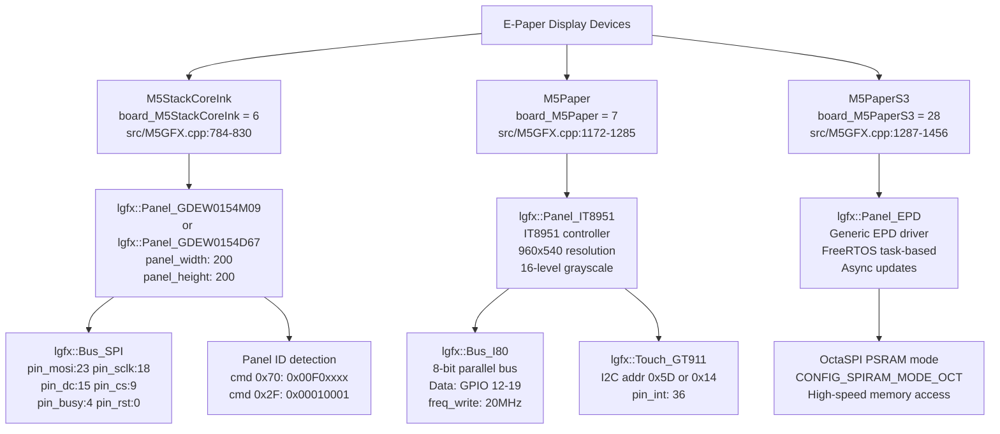
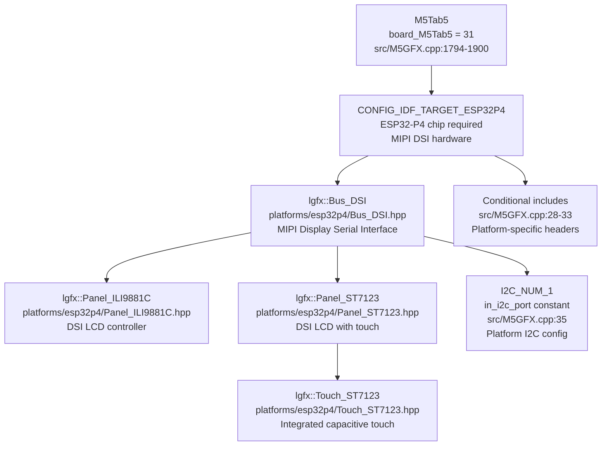
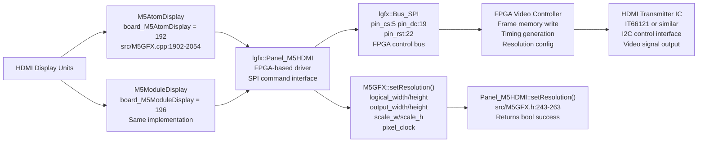
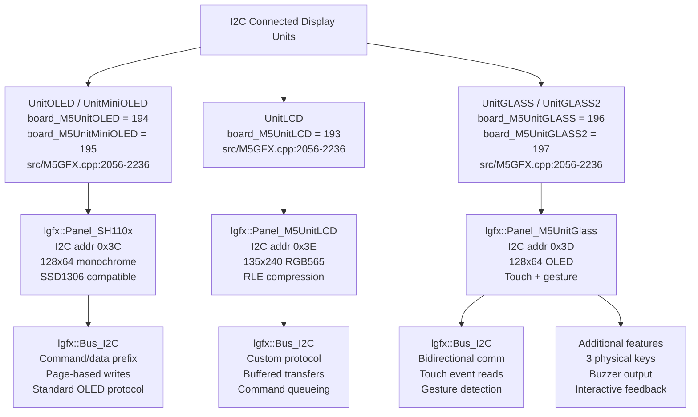
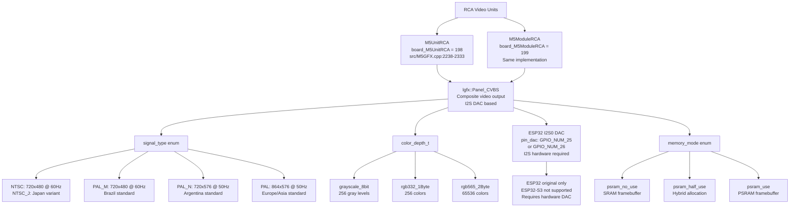
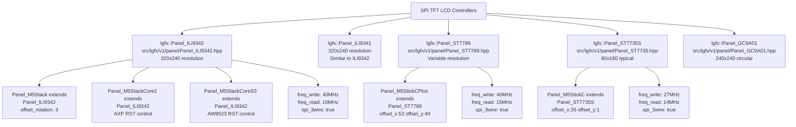
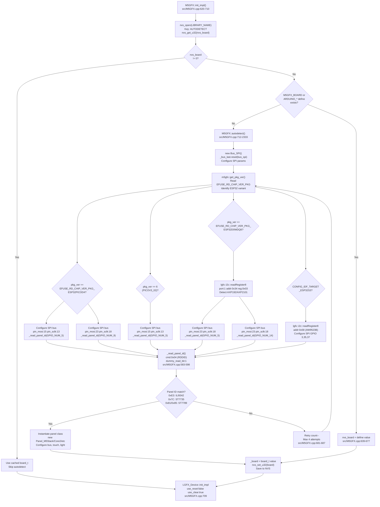

M5GFX Supported Devices and Displays

# Supported Devices and Displays

Relevant source files

The following files were used as context for generating this wiki page:

- [README.md](README.md)
- [idf_component.yml](idf_component.yml)
- [library.json](library.json)
- [library.properties](library.properties)
- [src/M5GFX.cpp](src/M5GFX.cpp)
- [src/M5GFX.h](src/M5GFX.h)
- [src/lgfx/boards.hpp](src/lgfx/boards.hpp)
- [src/lgfx/v1/gitTagVersion.h](src/lgfx/v1/gitTagVersion.h)

This page catalogs all hardware devices and display types supported by M5GFX. The library supports 35+ M5Stack devices across multiple form factors and display technologies.

**Related Pages:**
- Hardware auto-detection algorithm: [M5GFX Class and Board Auto-Detection](#2.1)
- Panel driver implementations: [Panel Driver Architecture](#4)
- Device-specific configurations: [M5Stack Core and Stick Device Classes](#2.2) through [E-Paper Device Detection and Configuration](#2.6)

## Device Enumeration System

Device identification uses the `board_t` enumeration defined in [src/lgfx/boards.hpp:8-76](). All hardware detection, configuration, and runtime behavior branches on this enum value. Devices are organized into four numeric ranges:

**Device Category Architecture**

Sources: [src/lgfx/boards.hpp:8-76]()

## Core M5Stack Devices

Full-featured M5Stack devices with 320x240 ILI9342-based TFT LCD displays connected via SPI.

### M5Stack Core Series Specifications

| Device | `board_t` Value | Panel Class | Resolution | LCD Controller | Touch Controller | Power IC | Key GPIO |
|--------|----------------|-------------|------------|----------------|-----------------|----------|----------|
| M5Stack Basic/Gray/GO/Fire | `board_M5Stack` (1) | `Panel_M5Stack` | 320x240 | ILI9342 | None | None | CS:14, RST:33, DC:27 |
| M5Stack Core2 | `board_M5StackCore2` (2) | `Panel_M5StackCore2` | 320x240 | ILI9342 | FT5x06 (0x38) | AXP192/AXP2101 | CS:5, DC:15 |
| M5Stack CoreS3 | `board_M5StackCoreS3` (19) | `Panel_M5StackCoreS3` | 320x240 | ILI9342 | FT5x06 (0x38) | AW9523B (0x58) | CS:3, DC:35 |
| M5Stack CoreS3 SE | `board_M5StackCoreS3SE` (26) | `Panel_M5StackCoreS3` | 320x240 | ILI9342 | FT5x06 (0x38) | AW9523B (0x58) | CS:3, DC:35 |
| M5Tough | `board_M5Tough` (8) | `Panel_M5StackCore2` | 320x240 | ILI9342 | Custom (0x2E) | AXP192 | CS:5, DC:15 |

Sources: [src/M5GFX.cpp:85-110](), [src/M5GFX.cpp:112-130](), [src/M5GFX.cpp:355-389](), [src/M5GFX.cpp:1103-1120](), [src/lgfx/boards.hpp:10-19]()

**Core Device Implementation Map**

Sources: [src/M5GFX.cpp:85-130](), [src/M5GFX.cpp:355-423](), [src/M5GFX.cpp:1027-1094]()

### Backlight Control Implementations

Each Core device uses different backlight control mechanisms:

| Device | Control Method | Interface | Register | Range | Implementation Class |
|--------|---------------|-----------|----------|-------|---------------------|
| M5Stack Basic | None | N/A | N/A | N/A | No backlight control |
| Core2 (AXP192) | DC3 voltage | I2C 0x34 | 0x27 | 72-104 (8→255 input) | `Light_M5StackCore2` |
| Core2 (AXP2101) | BLDO1 voltage | I2C 0x34 | 0x96 | 0-28 steps | `Light_M5StackCore2_AXP2101` |
| CoreS3 | DLDO1 voltage | I2C 0x34 | 0x99 | 0-28 steps | `Light_M5StackCoreS3` |
| M5Tough | LDO3 voltage | I2C 0x34 | 0x28 | 0-15 steps | `Light_M5Tough` |

Sources: [src/M5GFX.cpp:132-154](), [src/M5GFX.cpp:156-179](), [src/M5GFX.cpp:181-205](), [src/M5GFX.cpp:425-448]()

## M5Stick Series

Compact devices with narrow portrait-oriented displays, powered by PICO-D4 packages.

### M5Stick Device Specifications

| Device | `board_t` Value | Panel Class | Resolution | LCD Controller | Chip Package | Backlight | Power Hold GPIO |
|--------|----------------|-------------|------------|----------------|-------------|-----------|-----------------|
| M5Stick C | `board_M5StickC` (3) | `Panel_M5StickC` | 80x160 | ST7735S | PICO-D4 | AXP192 LDO2 | N/A |
| M5Stick C Plus | `board_M5StickCPlus` (4) | `Panel_M5StickCPlus` | 135x240 | ST7789 | PICO-D4 | AXP192 LDO2 | N/A |
| M5Stick C Plus2 | `board_M5StickCPlus2` (5) | `Panel_M5StickCPlus` | 135x240 | ST7789 | PICOV3_02 (pkg 6) | PWM GPIO 27 | GPIO 4 |
| M5Station | `board_M5Station` (9) | `Panel_M5StickCPlus` | 135x240 | ST7789 | D0WDQ6 | AXP192 LDO3 | N/A |

Sources: [src/M5GFX.cpp:279-304](), [src/M5GFX.cpp:331-343](), [src/M5GFX.cpp:738-782](), [src/M5GFX.cpp:835-878](), [src/M5GFX.cpp:906-945](), [src/lgfx/boards.hpp:12-18]()

**Stick Series Implementation Map**

Sources: [src/M5GFX.cpp:279-304](), [src/M5GFX.cpp:331-343](), [src/M5GFX.cpp:859-869](), [src/M5GFX.cpp:930-936]()

## E-Paper Display Devices

Devices with electrophoretic displays (EPD) for low-power, sunlight-readable applications.

### E-Paper Device Specifications

| Device | `board_t` Value | Panel Class | Resolution | Controller | Grayscale Levels | Chip Package | Power Hold GPIO |
|--------|----------------|-------------|------------|------------|-----------------|--------------|-----------------|
| M5Stack CoreInk | `board_M5StackCoreInk` (6) | `Panel_GDEW0154M09` or `Panel_GDEW0154D67` | 200x200 | GoodDisplay | 4 levels | PICO-D4 | GPIO 12 |
| M5Paper | `board_M5Paper` (7) | `Panel_IT8951` | 960x540 | IT8951 | 16 levels | D0WDQ6 | GPIO 2 |
| M5PaperS3 | `board_M5PaperS3` (28) | `Panel_EPD` | Variable | EPD generic | Multiple | ESP32-S3 OctaSPI | N/A |

Sources: [src/M5GFX.cpp:21-23](), [src/M5GFX.cpp:784-830](), [src/M5GFX.cpp:1172-1285](), [src/M5GFX.cpp:1287-1456](), [src/lgfx/boards.hpp:15-28]()

**E-Paper Device Implementation Map**

Sources: [src/M5GFX.cpp:784-830](), [src/M5GFX.cpp:1172-1285](), [src/M5GFX.cpp:1287-1456](), [src/M5GFX.cpp:39-44]()

### E-Paper Panel Detection

CoreInk uses panel ID detection to identify the specific EPD variant:

| Panel Model | Detection Command | Expected ID | Panel Class |
|-------------|------------------|-------------|-------------|
| GDEW0154M09 | 0x70 | `0x00F0xxxx` | `Panel_GDEW0154M09` |
| GDEW0154D67 | 0x2F | `0x00010001` | `Panel_GDEW0154D67` |

Sources: [src/M5GFX.cpp:796-808]()

## Atom Series Devices

Compact ESP32-based devices in the Atom form factor.

### Atom Display Devices

| Device | `board_t` Value | Display Type | Resolution | Interface | Notes |
|--------|----------------|--------------|------------|-----------|-------|
| M5ATOMS3 | `board_M5AtomS3` (20) | External or none | N/A | I2C/SPI Grove | ESP32-S3, requires external display |
| M5ATOMS3R | `board_M5AtomS3R` (27) | 5x5 RGB LED matrix | N/A | AW9523 I2C | Internal backlight control via GPIO |

Sources: [src/M5GFX.cpp:1458-1554](), [src/lgfx/boards.hpp:20-27]()

### Atom Non-Display Devices

These devices have no integrated display and are detected but not configured with panels:

| Device | `board_t` Value | Display | Chip | Notes |
|--------|----------------|---------|------|-------|
| M5AtomLite | `board_M5AtomLite` (128) | Single RGB LED | ESP32 PICO-D4 | Minimal device |
| M5AtomPsram | `board_M5AtomPsram` (129) | None | ESP32 PICOV3_02 | With PSRAM |
| M5AtomU | `board_M5AtomU` (130) | None | ESP32 PICO-D4 | USB-C variant |
| M5AtomMatrix | `board_M5AtomMatrix` (140) | 5x5 LED matrix | ESP32 PICO-D4 | RGB LED grid |
| M5AtomEcho | `board_M5AtomEcho` (141) | None | ESP32 PICO-D4 | Smart speaker |
| M5AtomS3Lite | `board_M5AtomS3Lite` (136) | None | ESP32-S3 | Minimal S3 |
| M5AtomS3U | `board_M5AtomS3U` (137) | None | ESP32-S3 | S3 USB-C |
| M5AtomS3RExt | `board_M5AtomS3RExt` (142) | None | ESP32-S3 | Extended I/O |
| M5AtomS3RCam | `board_M5AtomS3RCam` (143) | None | ESP32-S3 | Camera module |
| M5AtomEchoS3R | `board_M5AtomEchoS3R` (144) | None | ESP32-S3 | Smart speaker S3 |

Sources: [src/lgfx/boards.hpp:37-57]()

## Specialized Display Devices

Devices with unique form factors or specialized display configurations.

### Specialized Device Specifications

| Device | `board_t` Value | Panel Class | Resolution | LCD Controller | Form Factor | Key Feature |
|--------|----------------|-------------|------------|----------------|-------------|-------------|
| M5Dial | `board_M5Dial` (21) | `Panel_GC9A01` | 240x240 | GC9A01 | Round LCD | Circular display + rotary encoder |
| M5DinMeter | `board_M5DinMeter` (22) | `Panel_ST7789` | 135x240 | ST7789 | DIN rail mount | Industrial mounting |
| M5Cardputer | `board_M5Cardputer` (23) | `Panel_ST7789` | 240x135 | ST7789 | Keyboard | Integrated physical keyboard |
| M5CardputerADV | `board_M5CardputerADV` (33) | `Panel_ST7789` | 240x135 | ST7789 | Keyboard | Advanced keyboard variant |
| M5VAMeter | `board_M5VAMeter` (25) | Variable | Variable | Variable | Meter | Voltage/amperage display |
| M5AirQ | `board_M5AirQ` (24) | Variable | Variable | Variable | Air quality | Environmental sensor display |
| M5StampPLC | `board_M5StampPLC` (30) | External I2C | Variable | N/A | PLC | PI4IO1 GPIO expander (0x43) |
| ArduinoNessoN1 | `board_ArduinoNessoN1` (32) | External I2C | Variable | N/A | Arduino form | PI4IO2 GPIO expander (0x44) |
| M5UnitC6L | `board_M5UnitC6L` (34) | External | Variable | N/A | Compact | ESP32-C6 based |
| M5CoreMP135 | `board_M5CoreMP135` (29) | External | Variable | N/A | Linux MPU | STM32MP135 processor |

Sources: [src/M5GFX.cpp:1556-1792](), [src/lgfx/boards.hpp:21-34]()

### M5Tab5 ESP32-P4 Tablet

The M5Tab5 uses the ESP32-P4's MIPI DSI interface for high-resolution display output.

| Device | `board_t` Value | Panel Options | Interface | Chip | Notes |
|--------|----------------|---------------|-----------|------|-------|
| M5Tab5 | `board_M5Tab5` (31) | `Panel_ILI9881C` or `Panel_ST7123` | MIPI DSI | ESP32-P4 | Tablet form factor, DSI LCD panels |

**M5Tab5 MIPI DSI Implementation**

Sources: [src/M5GFX.cpp:28-33](), [src/M5GFX.cpp:1794-1900](), [src/lgfx/boards.hpp:31]()

## External Display Units

Separate display modules that connect to M5Stack devices via Grove ports or other interfaces.

### HDMI Output Units

HDMI units use FPGA-based video timing generators to produce HDMI signals.

| Unit | `board_t` Value | Panel Class | Max Resolution | SPI Pins | FPGA Control | Notes |
|------|----------------|-------------|----------------|----------|--------------|-------|
| M5AtomDisplay | `board_M5AtomDisplay` (192) | `Panel_M5HDMI` | 1280x720 | CS:5, DC:19, RST:22 | SPI commands | HDMI transmitter with FPGA |
| M5ModuleDisplay | `board_M5ModuleDisplay` (196) | `Panel_M5HDMI` | 1280x720 | CS:5, DC:19, RST:22 | SPI commands | Module format variant |

Sources: [src/M5GFX.cpp:1902-2054](), [src/lgfx/boards.hpp:60-68](), [library.json:4]()

**HDMI Display Implementation Architecture**

Sources: [src/M5GFX.cpp:1902-2054](), [src/M5GFX.h:225-265]()

### I2C Display Units

Compact external displays connected via I2C Grove interface.

| Unit | `board_t` Value | Panel Class | Resolution | LCD Controller | I2C Address | Notes |
|------|----------------|-------------|------------|----------------|-------------|-------|
| UnitOLED | `board_M5UnitOLED` (194) | `Panel_SH110x` | 128x64 | SH1107/SSD1306 | 0x3C | Monochrome OLED |
| UnitMiniOLED | `board_M5UnitMiniOLED` (195) | `Panel_SH110x` | 64x128 or 128x64 | SH1107 | 0x3C | Compact OLED |
| UnitLCD | `board_M5UnitLCD` (193) | `Panel_M5UnitLCD` | 135x240 | Custom protocol | 0x3E | Color LCD, RLE compression |
| UnitGLASS | `board_M5UnitGLASS` (196) | `Panel_M5UnitGlass` | 128x64 | Custom protocol | 0x3D | OLED with touch/gesture |
| UnitGLASS2 | `board_M5UnitGLASS2` (197) | `Panel_M5UnitGlass` | 128x64 | Custom protocol | 0x3D | Updated GLASS variant |

Sources: [src/M5GFX.cpp:2056-2236](), [src/lgfx/boards.hpp:62-66](), [library.json:4]()

**I2C Display Unit Implementation Map**

Sources: [src/M5GFX.cpp:2056-2236]()

### Composite Video Output Units

Generate analog composite video (RCA) via ESP32's I2S DAC peripheral.

| Unit | `board_t` Value | Panel Class | Signal Types | GPIO | Interface | Notes |
|------|----------------|-------------|--------------|------|-----------|-------|
| UnitRCA | `board_M5UnitRCA` (198) | `Panel_CVBS` | NTSC/NTSC_J/PAL/PAL_M/PAL_N | 25 or 26 | I2S0 DAC | Composite video via DAC |
| ModuleRCA | `board_M5ModuleRCA` (199) | `Panel_CVBS` | NTSC/NTSC_J/PAL/PAL_M/PAL_N | 25 or 26 | I2S0 DAC | Module format variant |

Sources: [src/M5GFX.cpp:2238-2333](), [docs/UnitRCA.md:1-200](), [src/lgfx/boards.hpp:67-69]()

**RCA Video Signal Types and Resolutions**

| Signal Type | Max Width | Max Height | Region | Field Rate |
|-------------|-----------|------------|--------|------------|
| NTSC | 720 | 480 | North America | 60 Hz |
| NTSC_J | 720 | 480 | Japan | 60 Hz |
| PAL_M | 720 | 480 | Brazil | 60 Hz |
| PAL_N | 720 | 576 | Argentina | 50 Hz |
| PAL | 864 | 576 | Europe/Asia | 50 Hz |

**RCA Composite Video Implementation**

Sources: [src/M5GFX.cpp:2238-2333](), [docs/UnitRCA.md:22-82](), [docs/UnitRCA.md:85-197]()

**Important:** RCA units require ESP32 (original) with hardware DAC output. They are not compatible with ESP32-S3, which lacks analog DAC capability.

Sources: [docs/UnitRCA.md:5-18]()

## Stamp and Compact Devices

Small form factor devices without integrated displays, primarily for embedded applications.

| Device | `board_t` Value | Chip | Display | Form Factor |
|--------|----------------|------|---------|-------------|
| M5StampPico | `board_M5StampPico` (132) | ESP32-PICO-D4 | None | Ultra-compact stamp |
| M5StampC3 | `board_M5StampC3` (133) | ESP32-C3 RISC-V | None | C3 stamp |
| M5StampC3U | `board_M5StampC3U` (134) | ESP32-C3 | None | C3 USB variant |
| M5StampS3 | `board_M5StampS3` (135) | ESP32-S3 | None | S3 minimal stamp |
| M5Capsule | `board_M5Capsule` (138) | ESP32 | None | Capsule enclosure |
| M5NanoC6 | `board_M5NanoC6` (139) | ESP32-C6 | None | Nano form factor |
| M5PowerHub | `board_M5PowerHub` (145) | ESP32 | None | Power distribution |

Sources: [src/lgfx/boards.hpp:44-57]()

## Camera Devices

Devices with integrated camera modules but no display.

| Device | `board_t` Value | Chip | Camera | Display | Notes |
|--------|----------------|------|--------|---------|-------|
| M5Camera | `board_M5Camera` (131) | ESP32 | Yes | None | ESP32-CAM compatible |
| M5TimerCam | `board_M5TimerCam` (132) | ESP32 PICO-D4 | Yes | None | Low-power camera with battery |

Sources: [src/lgfx/boards.hpp:42-43]()

## Display Technology Summary

M5GFX supports diverse display technologies, each with specific characteristics and implementations.

### Technology Comparison Table

| Technology | Panel Base Class | Bus Type | Typical Resolution | Color Depth | Refresh Rate | Power | Key Devices |
|------------|------------------|----------|-------------------|-------------|--------------|-------|-------------|
| TFT LCD SPI | `Panel_LCD` | SPI | 80x160 to 320x240 | RGB565 (16-bit) | 60 Hz | Active | M5Stack, Core2, CoreS3, StickC |
| TFT LCD DSI | `Panel_ILI9881C`, `Panel_ST7123` | MIPI DSI | Variable (high res) | RGB888 (24-bit) | 60 Hz | Active | M5Tab5 (ESP32-P4) |
| E-Paper | `Panel_EPD`, `Panel_IT8951` | I80/SPI | 200x200 to 960x540 | 4-16 level gray | 1-5 sec | Bistable | CoreInk, Paper, PaperS3 |
| OLED I2C | `Panel_SH110x` | I2C | 64x128, 128x64 | Monochrome | 60 Hz | Low power | UnitOLED, UnitMiniOLED |
| HDMI FPGA | `Panel_M5HDMI` | SPI + FPGA | Up to 1280x720 | RGB888 (24-bit) | 60 Hz | External | AtomDisplay, ModuleDisplay |
| Composite Video | `Panel_CVBS` | I2S DAC | 720x480 to 864x576 | RGB332/RGB565 | 50/60 Hz | Analog | UnitRCA, ModuleRCA |
| Round LCD | `Panel_GC9A01` | SPI | 240x240 circular | RGB565 (16-bit) | 60 Hz | Active | M5Dial |
| Custom I2C LCD | `Panel_M5UnitLCD` | I2C | 135x240 | RGB565 (16-bit) | Variable | Active | UnitLCD |

Sources: [src/M5GFX.cpp:16-26](), [src/M5GFX.cpp:28-44](), [src/M5GFX.cpp:49-51]()

### LCD Controller Implementations

**LCD Controller Class Hierarchy**

Sources: [src/M5GFX.cpp:16-20](), [src/M5GFX.cpp:85-343](), [src/M5GFX.cpp:1556-1792]()

## Platform-Specific Considerations

### ESP32 Chip Package Detection

M5GFX uses chip package version to narrow device category during auto-detection.

| Package Identifier | Efuse Value | Chip | Used In | Detection Code |
|-------------------|-------------|------|---------|----------------|
| ESP32-PICO-D4 | `EFUSE_RD_CHIP_VER_PKG_ESP32PICOD4` | ESP32 | StickC, StickCPlus, CoreInk, AtomLite | [src/M5GFX.cpp:736]() |
| ESP32-PICOV3_02 | Package version 6 | ESP32 | StickCPlus2, AtomPsram | [src/M5GFX.cpp:835]() |
| ESP32-D0WDQ6 | `EFUSE_RD_CHIP_VER_PKG_ESP32D0WDQ6` | ESP32 | M5Stack, Core2, Tough, Paper | [src/M5GFX.cpp:881]() |
| ESP32-S3 | N/A | ESP32-S3 | CoreS3, ATOMS3, PaperS3 | `CONFIG_IDF_TARGET_ESP32S3` [src/M5GFX.cpp:37]() |
| ESP32-C6 | N/A | ESP32-C6 | ArduinoNessoN1, NanoC6 | `CONFIG_IDF_TARGET_ESP32C6` [src/M5GFX.cpp:504]() |
| ESP32-P4 | N/A | ESP32-P4 | M5Tab5 | `CONFIG_IDF_TARGET_ESP32P4` [src/M5GFX.cpp:28]() |

Sources: [src/M5GFX.cpp:732-736](), [src/M5GFX.cpp:28-529]()

### Power Management IC Summary

Many M5Stack devices use dedicated power management ICs for LCD control and backlight.

| Power IC | I2C Address | I2C Port | Used In | Key Registers | Detection Value |
|----------|-------------|----------|---------|---------------|-----------------|
| AXP192 | 0x34 | I2C_NUM_1 | M5Stack series, StickC, Core2 gen1 | 0x27 (DC3), 0x28 (LDO3), 0x96 (GPIO) | Read reg 0x03 = 0x03 |
| AXP2101 | 0x34 | I2C_NUM_1 | Core2 v1.1 | 0x90 (LDOS), 0x96 (BLDO1), 0x99 (DLDO1) | Read reg 0x03 = 0x4A |
| AW9523B | 0x58 | I2C_NUM_1 | CoreS3, ATOMS3R | 0x03 (output), 0x05 (config) | GPIO expander |

Sources: [src/M5GFX.cpp:76-83](), [src/M5GFX.cpp:347-350](), [src/M5GFX.cpp:891-905]()

### GPIO Expander ICs

Some devices use I2C GPIO expanders for additional I/O control.

| Expander IC | Designation | I2C Address | I2C Port | Used In | Purpose |
|------------|------------|-------------|----------|---------|---------|
| PI4IOE5V6408 | pi4io1 | 0x43 | Variable | StampPLC | Industrial I/O, backlight control |
| PI4IOE5V6408 | pi4io2 | 0x44 | I2C_NUM_0 | ArduinoNessoN1 | Arduino I/O expansion, backlight |

Sources: [src/M5GFX.cpp:76-77](), [src/M5GFX.cpp:470-502](), [src/M5GFX.cpp:509-527]()

## Touch Controller Summary

Devices with capacitive touch capability use various touch controller ICs.

| Touch Controller | Class | I2C Address | I2C Port | Max Points | Used In | Features |
|-----------------|-------|-------------|----------|------------|---------|----------|
| FT5x06 | `Touch_FT5x06` | 0x38 | I2C_NUM_1 | 5 points | Core2, CoreS3 | Standard capacitive touch |
| M5Tough Custom | `Touch_M5Tough` | 0x2E | I2C_NUM_1 | 2 points | M5Tough | Custom protocol, robust |
| GT911 | `Touch_GT911` | Variable | I2C_NUM_1 | 5 points | M5Paper | Large format touch |
| CST816S | `Touch_CST816S` | Variable | Variable | 1 point | Various units | Gesture support |
| ST7123 Integrated | `Touch_ST7123` | N/A | N/A | Multi-point | M5Tab5 | Integrated in DSI panel |

Sources: [src/M5GFX.cpp:24-26](), [src/M5GFX.cpp:207-277](), [src/M5GFX.cpp:391-423](), [src/M5GFX.cpp:1049-1090]()

## Auto-Detection Process

The M5GFX library implements comprehensive hardware auto-detection in the `autodetect()` method.

**Hardware Auto-Detection Flow**

Sources: [src/M5GFX.cpp:620-710](), [src/M5GFX.cpp:712-2333]()

### Detection Method Details

1. **NVS Storage Check** [src/M5GFX.cpp:627-635](): Reads previously detected board type from non-volatile storage to speed up subsequent boots.

2. **Compile-Time Defines** [src/M5GFX.cpp:639-677](): Checks for `M5GFX_BOARD` or Arduino board defines (e.g., `ARDUINO_M5STACK_CORE2`).

3. **Package Version Detection** [src/M5GFX.cpp:733](): Reads efuse to identify ESP32 chip package, narrowing possible devices.

4. **I2C Device Probing** [src/M5GFX.cpp:891-905](): Detects power management ICs (AXP192, AXP2101) and GPIO expanders (AW9523B).

5. **LCD Panel ID Reading** [src/M5GFX.cpp:583-598](): Sends SPI command 0x04 (RDDID) to read LCD controller identification.

6. **Panel-Specific Verification**: Checks known panel IDs:
   - `0xE3` → ILI9342C (M5Stack, Core2)
   - `0x81`/`0x85` → ST7789 (StickCPlus)
   - `0x7C` → ST7735 (StickC)
   - `0x00F0xxxx` → GDEW0154M09 (CoreInk)

Sources: [src/M5GFX.cpp:583-598](), [src/M5GFX.cpp:749-778](), [src/M5GFX.cpp:796-808](), [src/M5GFX.cpp:1020-1021]()

## Summary Statistics

**Comprehensive Device Support:**
- **Total Board Types:** 35+ distinct `board_t` values
- **Display Devices:** 25 devices with integrated displays
- **Non-Display Devices:** 18 devices (Atom, Stamp, Camera series)
- **External Display Units:** 9 external display options

**Display Technologies:**
- **TFT LCD SPI:** 8 controller variants
- **E-Paper:** 3 device types (4-16 grayscale levels)
- **OLED I2C:** 2 unit types
- **HDMI:** 2 FPGA-based units
- **Composite Video:** 2 units (5 signal types)
- **DSI:** 2 panel types (ESP32-P4)

**Platform Support:**
- **ESP32 Variants:** ESP32, ESP32-S3, ESP32-C3, ESP32-C6, ESP32-P4
- **Bus Interfaces:** SPI, I2C, I80 parallel, DSI, I2S-DAC
- **Color Depths:** 1-bit (mono), 4-bit gray, 8-bit (RGB332/gray), 16-bit (RGB565), 24-bit (RGB888)
- **Touch Controllers:** 5 types (FT5x06, GT911, CST816S, Custom, ST7123)
- **Power ICs:** 3 types (AXP192, AXP2101, AW9523B)

Sources: [src/lgfx/boards.hpp:8-72](), [library.json:4](), [library.properties:6](), [README.md:11-39]()