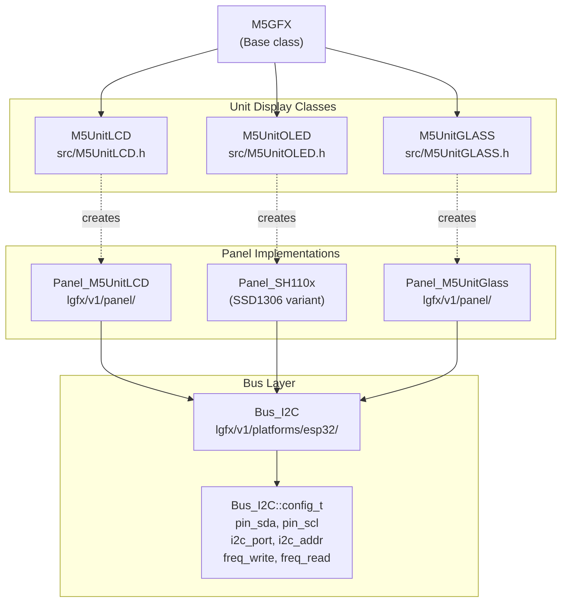
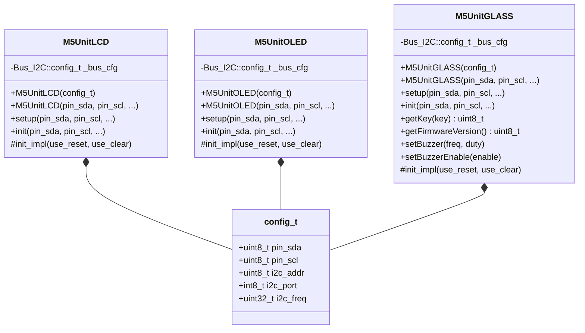
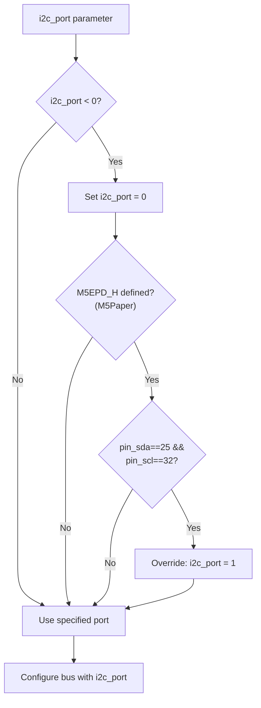

M5GFX Unit Display Device Classes

# Unit Display Device Classes

<details>
<summary>Relevant source files</summary>

The following files were used as context for generating this wiki page:

- [src/M5UnitGLASS.h](src/M5UnitGLASS.h)
- [src/M5UnitLCD.h](src/M5UnitLCD.h)
- [src/M5UnitOLED.h](src/M5UnitOLED.h)

</details>


## Overview

This document covers the M5Stack Unit Display device classes that provide external I2C display units. These compact displays connect to M5Stack devices via Grove/I2C ports (typically Port A) and operate at 400 kHz I2C frequency. The three unit display classes are:

- **M5UnitLCD**: 135×240 color LCD display using `Panel_M5UnitLCD`
- **M5UnitOLED**: 64×128 monochrome OLED using `Panel_SH110x` (SH110x controller)
- **M5UnitGLASS**: 128×64 monochrome display using `Panel_M5UnitGlass` with integrated buttons and buzzer

Each class inherits from `M5GFX` and encapsulates panel driver instantiation, I2C bus configuration, and device-specific initialization logic. For comparison with other display types, see [M5Stack Core and Stick Device Classes](#2.2) for built-in SPI displays, [Atom Display Device Classes](#2.3) for HDMI displays, and [I2C Display Panel Drivers](#4.5) for the underlying panel implementations.
</thinking>

**Sources:** [src/M5UnitLCD.h:1-189](), [src/M5UnitOLED.h:1-188](), [src/M5UnitGLASS.h:1-208]()

---

## Unit Display Class Hierarchy

The unit display classes follow a consistent design pattern where each class inherits from `M5GFX` and wraps a specific panel driver with I2C bus configuration.



**Sources:** [src/M5UnitLCD.h](), [src/M5UnitOLED.h](), [src/M5UnitGLASS.h]()

---

## Unit Display Specifications

| Class | Resolution | I2C Address | Color Depth | Panel Driver | Special Features |
|-------|-----------|-------------|-------------|--------------|------------------|
| `M5UnitLCD` | 135×240 | 0x3E | RGB565 (16-bit) | `Panel_M5UnitLCD` | None |
| `M5UnitOLED` | 64×128 | 0x3C | Grayscale 8-bit | `Panel_SH110x` | Command/data prefix |
| `M5UnitGLASS` | 128×64 | 0x3D | Grayscale 8-bit | `Panel_M5UnitGlass` | Buttons, buzzer |

**Sources:** [src/M5UnitLCD.h:28-32, 82-86, 165-168](), [src/M5UnitOLED.h:28-32, 82-86, 168](), [src/M5UnitGLASS.h:28-32, 82-86]()

---

## Configuration Structure

All unit display classes share a common configuration pattern using the `config_t` structure:



**Sources:** [src/M5UnitLCD.h:41-48](), [src/M5UnitOLED.h:41-48](), [src/M5UnitGLASS.h:41-48]()

---

## M5UnitLCD Class

The `M5UnitLCD` class provides support for the 135×240 pixel color LCD unit display. It uses a custom panel driver that communicates entirely over I2C.

### Default Configuration

| Parameter | Default Value | Macro |
|-----------|--------------|-------|
| I2C Address | 0x3E | `M5UNITLCD_ADDR` |
| I2C Frequency | 400000 Hz | `M5UNITLCD_FREQ` |
| SDA Pin | `M5GFX_PORTA_DEFAULT_SDA` | `M5UNITLCD_SDA` |
| SCL Pin | `M5GFX_PORTA_DEFAULT_SCL` | `M5UNITLCD_SCL` |

### Bus Configuration

The `setup()` method configures the I2C bus with specific frequency settings for read and write operations:

```cpp
// From src/M5UnitLCD.h:144-151
_bus_cfg.freq_write = i2c_freq;
_bus_cfg.freq_read = i2c_freq > 400000 ? 400000 + ((i2c_freq - 400000) >> 1) : i2c_freq;
_bus_cfg.pin_scl = pin_scl;
_bus_cfg.pin_sda = pin_sda;
_bus_cfg.i2c_port = i2c_port;
_bus_cfg.i2c_addr = i2c_addr;
_bus_cfg.prefix_len = 0;
```

Note that read frequency is capped and scaled when write frequency exceeds 400 kHz to ensure reliable communication.

### Panel Configuration

The panel is configured in `init_impl()` with the following settings:

- **memory_width**: 135 pixels
- **memory_height**: 240 pixels  
- **panel_width**: 135 pixels
- **panel_height**: 240 pixels
- **offset_x**: 0
- **offset_rotation**: 0
- **bus_shared**: false

**Sources:** [src/M5UnitLCD.h:1-189]()

---

## M5UnitOLED Class

The `M5UnitOLED` class supports the 64×128 pixel monochrome OLED unit display using the SH110x controller (a variant of the common SSD1306).

### Default Configuration

| Parameter | Default Value | Macro |
|-----------|--------------|-------|
| I2C Address | 0x3C | `M5UNITOLED_ADDR` |
| I2C Frequency | 400000 Hz | `M5UNITOLED_FREQ` |
| SDA Pin | `M5GFX_PORTA_DEFAULT_SDA` | `M5UNITOLED_SDA` |
| SCL Pin | `M5GFX_PORTA_DEFAULT_SCL` | `M5UNITOLED_SCL` |

### Command/Data Prefix Protocol

Unlike `M5UnitLCD`, the OLED uses a command/data prefix protocol to differentiate between control commands and pixel data:

```cpp
// From src/M5UnitOLED.h:151-153
_bus_cfg.prefix_cmd = 0x00;
_bus_cfg.prefix_data = 0x40;
_bus_cfg.prefix_len = 1;
```

This means each I2C transaction is prefixed with:
- `0x00` for command bytes
- `0x40` for data bytes

### Panel Configuration

The `Panel_SH110x` is configured with:

- **panel_width**: 64 pixels
- **panel_height**: 128 pixels (default)
- **offset_x**: 32 (aligns the 64-pixel display within the 128-pixel controller buffer)
- **bus_shared**: false

**Sources:** [src/M5UnitOLED.h:1-188]()

---

## M5UnitGLASS Class

The `M5UnitGLASS` class supports the 128×64 pixel monochrome display with integrated user interface elements (buttons and buzzer).

### Default Configuration

| Parameter | Default Value | Macro |
|-----------|--------------|-------|
| I2C Address | 0x3D | `M5UNITGLASS_ADDR` |
| I2C Frequency | 400000 Hz | `M5UNITGLASS_FREQ` |
| SDA Pin | `M5GFX_PORTA_DEFAULT_SDA` | `M5UNITGLASS_SDA` |
| SCL Pin | `M5GFX_PORTA_DEFAULT_SCL` | `M5UNITGLASS_SCL` |

### Panel Configuration

The display is rotated by default to match the physical orientation:

- **memory_width**: 128 pixels
- **memory_height**: 64 pixels
- **offset_rotation**: 3
- **setRotation(1)**: Applied during initialization

**Sources:** [src/M5UnitGLASS.h:167-169]()

### Additional Hardware Interface

The `M5UnitGLASS` class provides methods to interact with the integrated buttons and buzzer:

| Method | Description | Return Type |
|--------|-------------|-------------|
| `getKey(key)` | Read button state for specified key | `uint8_t` |
| `getFirmwareVersion()` | Query the unit's firmware version | `uint8_t` |
| `setBuzzer(freq, duty)` | Configure buzzer frequency and duty cycle | `void` |
| `setBuzzerEnable(enable)` | Enable or disable buzzer output | `void` |

These methods are implemented by casting the panel pointer to `Panel_M5UnitGlass*` and delegating to panel-specific functionality.

**Sources:** [src/M5UnitGLASS.h:183-203]()

---

## Initialization Flow

The initialization process for all unit displays follows a common pattern:

```mermaid
stateDiagram-v2
    [*] --> Constructor: "new M5UnitXXX(config)"
    
    Constructor --> setup: "setup() called"
    
    state setup {
        [*] --> SetBoardType: "_board = board_M5UnitXXX"
        SetBoardType --> CheckI2CPort: "i2c_port < 0?"
        CheckI2CPort --> SetDefaultPort: "Yes: i2c_port = 0"
        CheckI2CPort --> ConfigureBus: "No"
        SetDefaultPort --> ConfigureBus
        ConfigureBus --> [*]: "Populate _bus_cfg"
    }
    
    setup --> init: "init() called"
    
    state init {
        [*] --> init_impl_check: "Check _panel_last"
        init_impl_check --> ReturnTrue: "Already initialized"
        init_impl_check --> CreatePanel: "Not initialized"
        
        CreatePanel --> CreateBus: "new Panel_XXX()"
        CreateBus --> ConfigurePanel: "new Bus_I2C()"
        ConfigurePanel --> SetPanel: "b->config(_bus_cfg)"
        SetPanel --> DeviceInit: "setPanel(p)"
        DeviceInit --> CheckSuccess: "LGFX_Device::init_impl()"
        
        CheckSuccess --> Success: "true"
        CheckSuccess --> Cleanup: "false"
        
        Success --> StoreRefs: "_panel_last.reset(p)"
        StoreRefs --> ReturnTrue
        
        Cleanup --> DeleteObjects: "delete p, delete b"
        DeleteObjects --> ReturnFalse
    }
    
    init --> [*]: "Display ready"
    ReturnTrue --> [*]
    ReturnFalse --> [*]
```

**Sources:** [src/M5UnitLCD.h:129-184](), [src/M5UnitOLED.h:130-183](), [src/M5UnitGLASS.h:131-181]()

---

## I2C Port Selection Logic

The unit display classes include special logic for automatic I2C port selection on M5Paper devices:



This logic ensures that when connecting to M5Paper's external Port A (pins 25/32), the correct I2C peripheral (port 1) is automatically selected.

**Sources:** [src/M5UnitLCD.h:132-141](), [src/M5UnitOLED.h:133-142](), [src/M5UnitGLASS.h:134-143]()

---

## SDL Simulation Support

All unit display classes support desktop simulation via SDL when `SDL_h_` is defined. In simulation mode:

1. **Panel substitution**: `Panel_sdl` replaces the hardware panel driver
2. **Window creation**: Each display creates a separate SDL window with appropriate scaling
3. **Color depth configuration**: Grayscale displays (OLED, GLASS) set 8-bit grayscale mode

### SDL Configuration Example

```cpp
// From src/M5UnitLCD.h:79-98
auto p = new lgfx::Panel_sdl;
auto cfg = p->config();
cfg.memory_width = 135;
cfg.panel_width  = 135;
cfg.memory_height = 240;
cfg.panel_height  = 240;
cfg.bus_shared = false;
cfg.offset_rotation = 0;
p->config(cfg);

uint_fast8_t scale = 1;
#if defined (M5GFX_SCALE)
  #if M5GFX_SCALE > 1
    scale = M5GFX_SCALE;
  #endif
#endif
p->setScaling(scale, scale);
p->setWindowTitle("UnitLCD");
```

The `M5GFX_SCALE` macro allows compile-time control of the window scaling factor for better desktop visibility.

**Sources:** [src/M5UnitLCD.h:74-106](), [src/M5UnitOLED.h:74-107](), [src/M5UnitGLASS.h:74-108]()

---

## Usage Examples

### Basic M5UnitLCD Usage

```cpp
#include <M5UnitLCD.h>

M5UnitLCD display;

void setup() {
  // Initialize with default pins and address
  display.init();
  
  // Draw test content
  display.fillScreen(TFT_BLACK);
  display.setTextColor(TFT_WHITE);
  display.drawString("Hello", 10, 10);
}
```

### Custom I2C Configuration

```cpp
#include <M5UnitOLED.h>

// Configure custom pins and address
M5UnitOLED display(
  /*pin_sda=*/ 21,
  /*pin_scl=*/ 22,
  /*i2c_freq=*/ 400000,
  /*i2c_port=*/ 1,
  /*i2c_addr=*/ 0x3C
);

void setup() {
  display.init();
  display.setTextSize(2);
  display.drawString("OLED", 0, 0);
}
```

### Using config_t Structure

```cpp
#include <M5UnitGLASS.h>

void setup() {
  M5UnitGLASS::config_t cfg;
  cfg.pin_sda = 32;
  cfg.pin_scl = 33;
  cfg.i2c_addr = 0x3D;
  cfg.i2c_freq = 400000;
  
  M5UnitGLASS display(cfg);
  display.init();
  
  // Check button state
  uint8_t key_state = display.getKey(0);
  
  // Control buzzer
  display.setBuzzer(1000, 128); // 1kHz, 50% duty
  display.setBuzzerEnable(true);
}
```

**Sources:** [src/M5UnitLCD.h:110-127](), [src/M5UnitOLED.h:111-128](), [src/M5UnitGLASS.h:112-128]()

---

## Comparison with Other Display Types

Unit displays differ from other M5GFX-supported displays in several key aspects:

| Aspect | Unit Displays (I2C) | Core Displays | HDMI Displays | DSI Displays |
|--------|-------------------|---------------|---------------|--------------|
| Communication | I2C (100-400 kHz) | SPI (1-80 MHz) | SPI + FPGA | MIPI DSI (500+ Mbps) |
| Resolution | 64×128 to 135×240 | 128×128 to 320×240 | Up to 1280×720 | Up to 1280×800 |
| Refresh Rate | Low (~10 Hz) | Medium-High (60+ Hz) | High (50-60 Hz) | High (60+ Hz) |
| External | Yes (I2C cable) | No (built-in) | Yes (HDMI cable) | No (built-in) |
| Addressability | Yes (0x3C-0x3E) | No | No | No |
| Device Classes | `M5UnitXXX` | `M5Stack`, `M5Core2` | `M5AtomDisplay` | Panel-level only |

For details on SPI-based displays, see [LCD Panel Drivers](#4.1). For HDMI displays, see [HDMI Panel Driver](#4.3).

---

## Summary

The M5Stack Unit Display classes provide a consistent interface for I2C-connected external displays:

- **M5UnitLCD**: 135×240 color LCD at address 0x3E
- **M5UnitOLED**: 64×128 monochrome OLED at address 0x3C with command/data prefixes
- **M5UnitGLASS**: 128×64 monochrome display at address 0x3D with buttons and buzzer

All classes:
- Inherit from `M5GFX` for unified graphics API
- Support flexible I2C configuration via constructor or `config_t`
- Provide automatic I2C port selection for M5Paper compatibility
- Include SDL simulation support for desktop development
- Follow the standard `setup()` → `init()` → `init_impl()` initialization pattern

The I2C communication operates at 400 kHz by default but can be configured higher. The unit displays are ideal for low-speed external display applications where SPI bandwidth is reserved for other peripherals or when multiple addressable displays are needed on a single I2C bus.