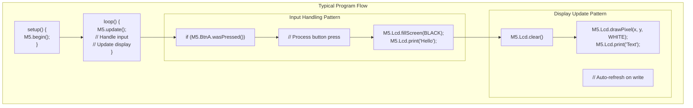

M5Stack API Reference and Keywords

# API Reference and Keywords

<details>
<summary>Relevant source files</summary>

The following files were used as context for generating this wiki page:

- [keywords.txt](keywords.txt)

</details>


This document provides a reference for the M5Stack library's syntax highlighting keywords as defined in `keywords.txt`, which enables Arduino IDE integration for color-coded syntax highlighting. The keywords represent the public API surface exposed to developers working with M5Stack Basic and Gray devices.

**Important:** This library is deprecated. For new projects, use M5GFX and M5Unified libraries. See [Overview](#1) for migration guidance.

For detailed information about the underlying hardware abstraction and system architecture, see [Core Library Architecture](#2). For practical usage examples, see [Getting Started](#3).

**Sources:** [keywords.txt:1-85]()

## Keywords File Format and Arduino IDE Integration

### File Structure

The `keywords.txt` file follows the Arduino IDE keyword specification format, where each line defines a keyword with its highlighting type using tab-separated values:

```
<keyword>    <KEYWORD_TYPE>
```

### Keyword Types and IDE Color Mapping

Keywords define Arduino IDE syntax highlighting and autocomplete behavior:

| Keyword Type | Purpose | IDE Color | Line Range in keywords.txt |
|--------------|---------|-----------|---------------------------|
| `KEYWORD3` | Library and namespace identifiers | Purple/Magenta | [keywords.txt:9-11]() |
| `KEYWORD1` | Data types, classes, objects | Orange/Brown | [keywords.txt:17-21]() |
| `KEYWORD2` | Methods, functions, member functions | Blue | [keywords.txt:27-76]() |
| `LITERAL1` | Constants, enumerations, predefined values | Teal/Cyan | [keywords.txt:78-84]() |

### Keywords to Code Entity Mapping

The following diagram maps keywords in `keywords.txt` to their corresponding code entities in the M5Stack library:

```mermaid
graph TB
    subgraph "keywords.txt"
        KW3["KEYWORD3<br/>M5Stack, M5, m5"]
        KW1["KEYWORD1<br/>Lcd, Speaker, BtnA, BtnB, BtnC"]
        KW2["KEYWORD2<br/>begin, update, isPressed<br/>drawPixel, fillScreen, print"]
        KW_LITERAL["LITERAL1<br/>WHITE, BLACK, RED<br/>GREEN, BLUE, GRAY, INVERT"]
    end
    
    subgraph "src/M5Stack.h"
        M5StackClass["class M5Stack"]
        M5_Object["extern M5Stack M5"]
        LcdMember["M5Display Lcd"]
        SpeakerMember["SPEAKER Speaker"]
        BtnAMember["Button BtnA"]
        BtnBMember["Button BtnB"]
        BtnCMember["Button BtnC"]
        BeginMethod["void begin()"]
        UpdateMethod["void update()"]
    end
    
    subgraph "src/utility/Button.h"
        ButtonClass["class Button"]
        IsPressedMethod["bool isPressed()"]
        WasPressedMethod["bool wasPressed()"]
        PressedForMethod["bool pressedFor(uint32_t)"]
    end
    
    subgraph "src/M5Display.h"
        M5DisplayClass["class M5Display"]
        DrawPixelMethod["void drawPixel(int16_t, int16_t, uint16_t)"]
        FillScreenMethod["void fillScreen(uint16_t)"]
        PrintMethod["size_t print(...)"]
    end
    
    subgraph "Color Constants"
        ColorDefines["#define TFT_WHITE 0xFFFF<br/>#define TFT_BLACK 0x0000<br/>#define TFT_RED 0xF800"]
    end
    
    KW3 --> M5StackClass
    KW3 --> M5_Object
    KW1 --> LcdMember
    KW1 --> SpeakerMember
    KW1 --> BtnAMember
    KW1 --> BtnBMember
    KW1 --> BtnCMember
    KW2 --> BeginMethod
    KW2 --> UpdateMethod
    KW2 --> IsPressedMethod
    KW2 --> WasPressedMethod
    KW2 --> PressedForMethod
    KW2 --> DrawPixelMethod
    KW2 --> FillScreenMethod
    KW2 --> PrintMethod
    KW_LITERAL --> ColorDefines
```



**Sources:** [keywords.txt:1-85]()

## Core API Structure

The M5Stack library exposes its functionality through a hierarchical API structure centered around the global `M5` object and its component subsystems. All keywords defined in `keywords.txt` correspond to public members of this API.

### API Hierarchy from keywords.txt

```mermaid
graph TB
    M5Global["M5<br/>(Global M5Stack instance)<br/>KEYWORD3"]
    M5StackClass["M5Stack class<br/>KEYWORD3"]
    
    subgraph "KEYWORD1 Objects"
        Lcd["M5.Lcd<br/>(M5Display)"]
        Speaker["M5.Speaker<br/>(SPEAKER)"]
        BtnA["M5.BtnA<br/>(Button)"]
        BtnB["M5.BtnB<br/>(Button)"]
        BtnC["M5.BtnC<br/>(Button)"]
    end
    
    subgraph "KEYWORD2 System Methods"
        Begin["begin()"]
        Update["update()"]
        Power["Power"]
    end
    
    subgraph "KEYWORD2 Display Methods"
        FillScreen["fillScreen()"]
        DrawPixel["drawPixel()"]
        Print["print()"]
        SetTextColor["setTextColor()"]
        DrawLine["drawLine()"]
        DrawRect["drawRect()"]
        FillRect["fillRect()"]
        DrawCircle["drawCircle()"]
        FillCircle["fillCircle()"]
        DrawTriangle["drawTriangle()"]
        FillTriangle["fillTriangle()"]
    end
    
    subgraph "KEYWORD2 Button Methods"
        IsPressed["isPressed()"]
        WasPressed["wasPressed()"]
        PressedFor["pressedFor()"]
        IsReleased["isReleased()"]
        WasReleased["wasReleased()"]
        ReleasedFor["releasedFor()"]
        Held["held()"]
        Repeat["repeat()"]
        TimeHeld["timeHeld()"]
    end
    
    subgraph "LITERAL1 Constants"
        Colors["WHITE, BLACK<br/>RED, GREEN, BLUE<br/>GRAY, INVERT"]
    end
    
    M5Global --> M5StackClass
    M5StackClass --> Lcd
    M5StackClass --> Speaker
    M5StackClass --> BtnA
    M5StackClass --> BtnB
    M5StackClass --> BtnC
    M5StackClass --> Begin
    M5StackClass --> Update
    M5StackClass --> Power
    
    Lcd --> FillScreen
    Lcd --> DrawPixel
    Lcd --> Print
    Lcd --> SetTextColor
    Lcd --> DrawLine
    Lcd --> DrawRect
    Lcd --> FillRect
    Lcd --> DrawCircle
    Lcd --> FillCircle
    Lcd --> DrawTriangle
    Lcd --> FillTriangle
    
    BtnA --> IsPressed
    BtnA --> WasPressed
    BtnA --> PressedFor
    BtnA --> IsReleased
    BtnA --> WasReleased
    BtnA --> ReleasedFor
    BtnA --> Held
    BtnA --> Repeat
    BtnA --> TimeHeld
    
    FillScreen -.-> Colors
    DrawPixel -.-> Colors
    SetTextColor -.-> Colors
```



**Sources:** [keywords.txt:9-84]()

## KEYWORD3: Library Identifiers

Library-level keywords that identify the M5Stack namespace and main class in Arduino IDE.

| Keyword | Type | Purpose | Code Entity |
|---------|------|---------|-------------|
| `M5Stack` | KEYWORD3 | Main class identifier | `class M5Stack` in src/M5Stack.h |
| `M5` | KEYWORD3 | Global instance identifier | `extern M5Stack M5` |
| `m5` | KEYWORD3 | Alternate lowercase identifier | Alias for `M5` |

**Sources:** [keywords.txt:9-11]()

## KEYWORD1: Core Data Types and Objects

Hardware subsystem objects exposed as public members of the `M5Stack` class.

| Keyword | Type | Class/Type | Purpose |
|---------|------|------------|---------|
| `Lcd` | KEYWORD1 | `M5Display` | Display and graphics control object |
| `Speaker` | KEYWORD1 | `SPEAKER` | Audio output object |
| `BtnA` | KEYWORD1 | `Button` | Button A input object (GPIO 39) |
| `BtnB` | KEYWORD1 | `Button` | Button B input object (GPIO 38) |
| `BtnC` | KEYWORD1 | `Button` | Button C input object (GPIO 37) |

These objects are accessed as members of the global `M5` object:
- `M5.Lcd` - Display operations
- `M5.Speaker` - Audio output
- `M5.BtnA`, `M5.BtnB`, `M5.BtnC` - Button input

**Sources:** [keywords.txt:17-21]()

## KEYWORD2: Methods and Functions

All public methods available in the M5Stack API, organized by subsystem.

### System Methods

Core initialization and update functions called from Arduino sketch:

| Method | Keyword Type | Purpose | Usage Pattern |
|--------|--------------|---------|---------------|
| `begin` | KEYWORD2 | Initialize hardware subsystems | `M5.begin()` in `setup()` |
| `update` | KEYWORD2 | Update button states and system status | `M5.update()` in `loop()` |
| `Power` | KEYWORD2 | Power management subsystem | `M5.Power.deepSleep()` |

**Sources:** [keywords.txt:27-29]()

### Display and Graphics Methods

Methods available on `M5.Lcd` object for screen operations. All methods are defined as KEYWORD2 in [keywords.txt:43-76]().

#### Screen Control Methods

| Method | Purpose | Usage |
|--------|---------|-------|
| `getBuffer` | Access framebuffer | `M5.Lcd.getBuffer()` |
| `setContrast` | Adjust display contrast | `M5.Lcd.setContrast(level)` |
| `clear` | Clear display | `M5.Lcd.clear()` |
| `update` | Update display buffer | `M5.Lcd.update()` |
| `fillScreen` | Fill entire screen with color | `M5.Lcd.fillScreen(WHITE)` |
| `persistence` | Configure screen persistence | `M5.Lcd.persistence(enable)` |

#### Pixel and Color Methods

| Method | Purpose | Usage |
|--------|---------|-------|
| `setColor` | Set drawing color | `M5.Lcd.setColor(RED)` |
| `drawPixel` | Draw single pixel | `M5.Lcd.drawPixel(x, y, color)` |
| `getPixel` | Read pixel color | `color = M5.Lcd.getPixel(x, y)` |

#### Line Drawing Methods

| Method | Purpose | Usage |
|--------|---------|-------|
| `drawLine` | Draw line between two points | `M5.Lcd.drawLine(x0, y0, x1, y1, color)` |
| `drawFastVLine` | Draw vertical line (optimized) | `M5.Lcd.drawFastVLine(x, y, h, color)` |
| `drawFastHLine` | Draw horizontal line (optimized) | `M5.Lcd.drawFastHLine(x, y, w, color)` |

#### Rectangle Methods

| Method | Purpose | Usage |
|--------|---------|-------|
| `drawRect` | Draw rectangle outline | `M5.Lcd.drawRect(x, y, w, h, color)` |
| `fillRect` | Draw filled rectangle | `M5.Lcd.fillRect(x, y, w, h, color)` |
| `drawRoundRect` | Draw rounded rectangle outline | `M5.Lcd.drawRoundRect(x, y, w, h, r, color)` |
| `fillRoundRect` | Draw filled rounded rectangle | `M5.Lcd.fillRoundRect(x, y, w, h, r, color)` |

#### Circle Methods

| Method | Purpose | Usage |
|--------|---------|-------|
| `drawCircle` | Draw circle outline | `M5.Lcd.drawCircle(x, y, r, color)` |
| `fillCircle` | Draw filled circle | `M5.Lcd.fillCircle(x, y, r, color)` |
| `drawCircleHelper` | Draw circle quadrant (internal) | Used by circle drawing functions |
| `fillCircleHelper` | Fill circle quadrant (internal) | Used by circle filling functions |

#### Triangle Methods

| Method | Purpose | Usage |
|--------|---------|-------|
| `drawTriangle` | Draw triangle outline | `M5.Lcd.drawTriangle(x0, y0, x1, y1, x2, y2, color)` |
| `fillTriangle` | Draw filled triangle | `M5.Lcd.fillTriangle(x0, y0, x1, y1, x2, y2, color)` |

#### Bitmap and Text Methods

| Method | Purpose | Usage |
|--------|---------|-------|
| `drawBitmap` | Draw bitmap image | `M5.Lcd.drawBitmap(x, y, bitmap, w, h, color)` |
| `drawChar` | Draw single character | `M5.Lcd.drawChar(x, y, c, color, bg, size)` |
| `print` | Print text string | `M5.Lcd.print("Hello")` |

#### Text Formatting Methods

| Method | Purpose | Return Type |
|--------|---------|-------------|
| `cursorX` | Get/set X cursor position | `int16_t` |
| `cursorY` | Get/set Y cursor position | `int16_t` |
| `fontSize` | Get font size | `uint8_t` |
| `textWrap` | Enable/disable text wrapping | `void` |
| `fontWidth` | Get font character width | `uint8_t` |
| `fontHeight` | Get font character height | `uint8_t` |
| `setFont` | Set text font | `void` |
| `setTextColor` | Set text color | `void` |
| `setTextSize` | Set text scale | `void` |

**Sources:** [keywords.txt:43-76]()

### Button Input Methods

Methods available on button objects `M5.BtnA`, `M5.BtnB`, `M5.BtnC` for input detection. These buttons map to physical buttons on the M5Stack device (GPIO 39, 38, 37 respectively).

#### Current State Methods

| Method | Return Type | Purpose | Usage |
|--------|-------------|---------|-------|
| `isPressed` | `bool` | Check if button currently pressed | `if (M5.BtnA.isPressed())` |
| `isReleased` | `bool` | Check if button currently released | `if (M5.BtnA.isReleased())` |

#### Edge Detection Methods

| Method | Return Type | Purpose | Usage |
|--------|-------------|---------|-------|
| `wasPressed` | `bool` | Detect press event since last `update()` | `if (M5.BtnA.wasPressed())` |
| `wasReleased` | `bool` | Detect release event since last `update()` | `if (M5.BtnA.wasReleased())` |

#### Duration Check Methods

| Method | Return Type | Purpose | Usage |
|--------|-------------|---------|-------|
| `pressedFor` | `bool` | Check if pressed for specified milliseconds | `if (M5.BtnA.pressedFor(1000))` |
| `releasedFor` | `bool` | Check if released for specified milliseconds | `if (M5.BtnA.releasedFor(500))` |
| `wasReleasefor` | `bool` | Typo variant of `releasedFor` | Legacy compatibility |

#### Advanced Input Methods

| Method | Return Type | Purpose | Usage |
|--------|-------------|---------|-------|
| `held` | `bool` | Detect long press (hold) | `if (M5.BtnA.held())` |
| `repeat` | `bool` | Detect repeated press events | `if (M5.BtnA.repeat())` |
| `timeHeld` | `uint32_t` | Get duration of current press in milliseconds | `duration = M5.BtnA.timeHeld()` |

**Note:** The keyword `wasReleasefor` at [keywords.txt:37]() appears to be a typo and should likely be `wasReleasedFor`.

**Sources:** [keywords.txt:30-42]()

### Power Management

The `Power` keyword refers to the power management subsystem accessed via `M5.Power`. Specific power methods are not enumerated in keywords.txt but the subsystem keyword is defined.

| Keyword | Purpose | Usage |
|---------|---------|-------|
| `Power` | Access power management subsystem | `M5.Power.deepSleep()`, `M5.Power.setBrightness()` |

The power subsystem provides methods for sleep modes, battery monitoring, and backlight control. See [Power Management](#2.3) for detailed API documentation.

**Sources:** [keywords.txt:29]()

## LITERAL1: Constants and Literals

Predefined constants for colors and display modes, highlighted in teal/cyan in Arduino IDE.

### Color Constants

Seven color constants are defined for use with display methods:

| Constant | Keyword Type | Purpose | Usage Example |
|----------|--------------|---------|---------------|
| `WHITE` | LITERAL1 | White color (0xFFFF in RGB565) | `M5.Lcd.fillScreen(WHITE)` |
| `BLACK` | LITERAL1 | Black color (0x0000) | `M5.Lcd.setTextColor(BLACK)` |
| `RED` | LITERAL1 | Red color | `M5.Lcd.drawPixel(x, y, RED)` |
| `GREEN` | LITERAL1 | Green color | `M5.Lcd.fillCircle(x, y, r, GREEN)` |
| `BLUE` | LITERAL1 | Blue color | `M5.Lcd.drawLine(x0, y0, x1, y1, BLUE)` |
| `GRAY` | LITERAL1 | Gray color | `M5.Lcd.fillRect(x, y, w, h, GRAY)` |
| `INVERT` | LITERAL1 | Color inversion mode | Used for special display effects |

These constants map to TFT_eSPI color definitions (e.g., `TFT_WHITE`, `TFT_BLACK`) and are used throughout the display API for color parameters.

**Sources:** [keywords.txt:78-84]()

## Complete Keyword Reference

### Summary Statistics

The `keywords.txt` file defines 77 total keywords across four categories:

| Category | Count | Lines | Purpose |
|----------|-------|-------|---------|
| KEYWORD3 | 3 | [keywords.txt:9-11]() | Library identifiers |
| KEYWORD1 | 5 | [keywords.txt:17-21]() | Object types |
| KEYWORD2 | 62 | [keywords.txt:27-76]() | Methods and functions |
| LITERAL1 | 7 | [keywords.txt:78-84]() | Color constants |

### All KEYWORD2 Methods Listed

Complete enumeration of all 62 methods defined in keywords.txt:

**System & Core (3 methods):**
`begin`, `update`, `Power`

**Button Input (12 methods):**
`isPressed`, `wasPressed`, `pressedFor`, `isReleased`, `wasReleased`, `releasedFor`, `wasReleasefor`, `held`, `repeat`, `timeHeld`, `lastChange`, `lastHeld`

**Display Control (7 methods):**
`getBuffer`, `setContrast`, `clear`, `update`, `fillScreen`, `persistence`, `setColor`

**Drawing Primitives (11 methods):**
`drawPixel`, `getPixel`, `drawLine`, `drawFastVLine`, `drawFastHLine`, `drawRect`, `fillRect`, `drawRoundRect`, `fillRoundRect`, `drawCircleHelper`, `fillCircleHelper`

**Shapes (6 methods):**
`drawCircle`, `fillCircle`, `drawTriangle`, `fillTriangle`, `drawBitmap`, `drawChar`

**Text Operations (11 methods):**
`print`, `cursorX`, `cursorY`, `fontSize`, `textWrap`, `fontWidth`, `fontHeight`, `setFont`, `setTextColor`, `setTextSize`, `textBounds`

**Sources:** [keywords.txt:1-85]()

## API Usage Patterns

The M5Stack API follows consistent patterns for initialization, event handling, and resource management.



**Sources:** [keywords.txt:27-28](), [keywords.txt:30-32](), [keywords.txt:47-51]()