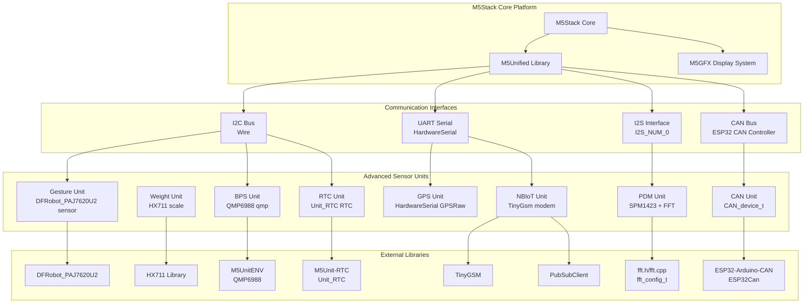
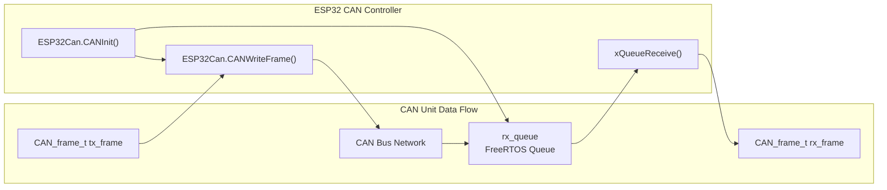
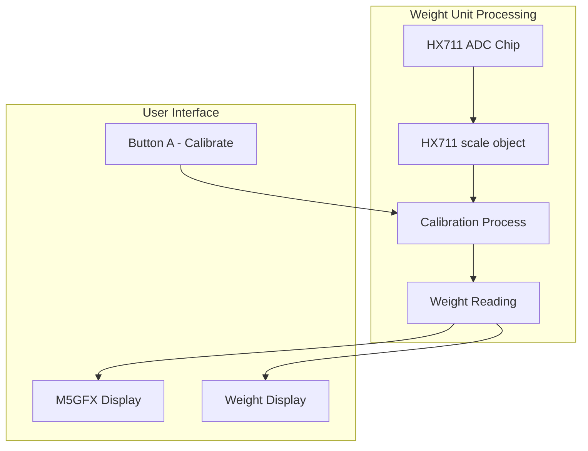
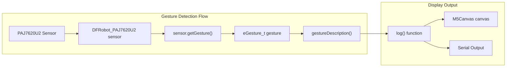
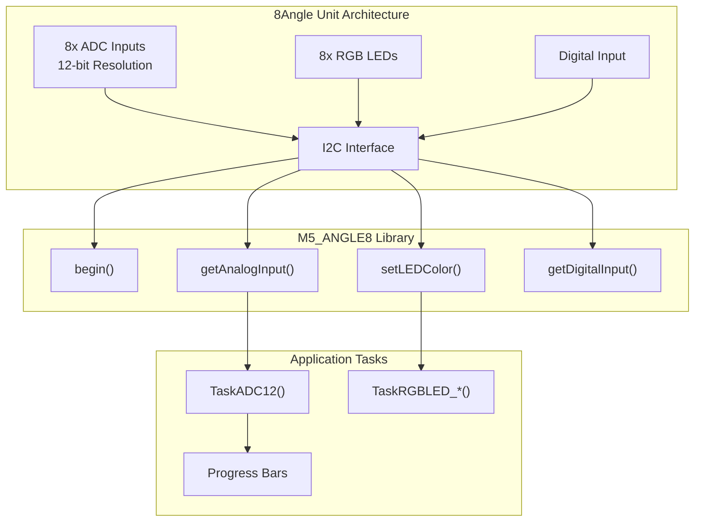
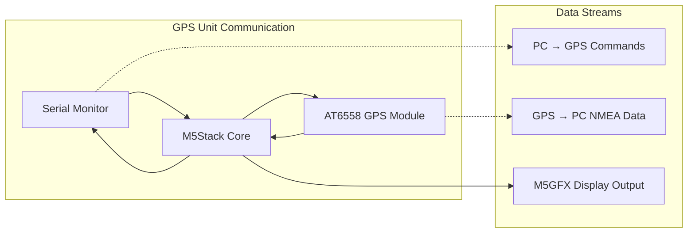
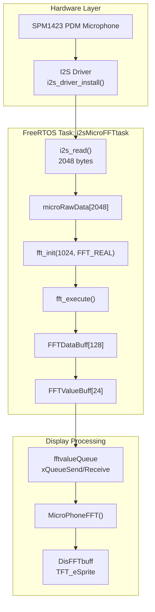
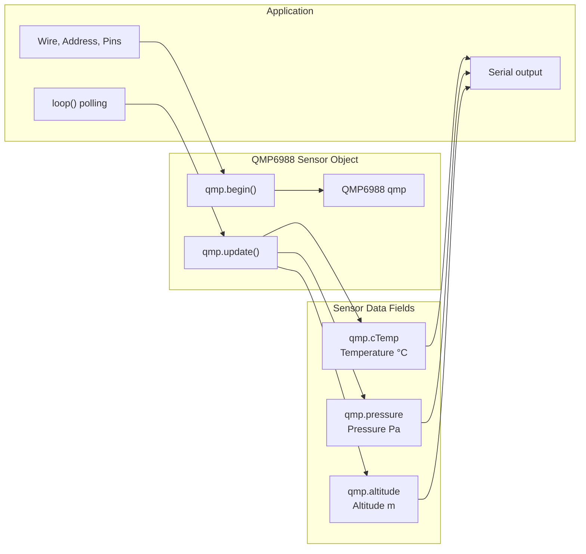
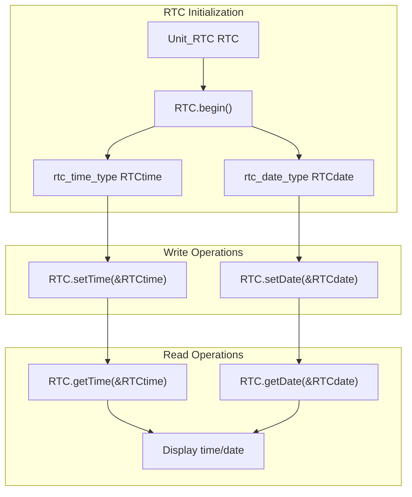
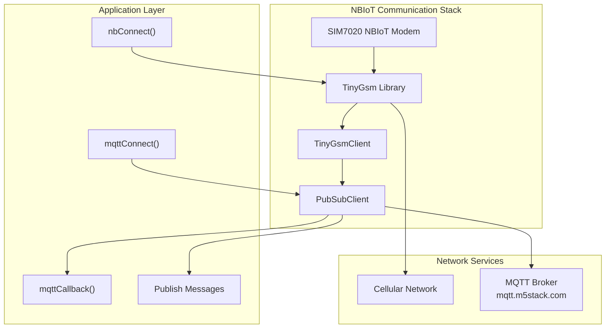

M5Stack Advanced Sensor Units

# Advanced Sensor Units

Relevant source files

The following files were used as context for generating this wiki page:

- [examples/Modules/COM_LoRaWAN915/TFTTerminal.cpp](examples/Modules/COM_LoRaWAN915/TFTTerminal.cpp)
- [examples/Modules/COM_LoRaWAN915/TFTTerminal.h](examples/Modules/COM_LoRaWAN915/TFTTerminal.h)
- [examples/Unit/BPS_QMP6988/BPS_QMP6988.ino](examples/Unit/BPS_QMP6988/BPS_QMP6988.ino)
- [examples/Unit/CAN/CAN.ino](examples/Unit/CAN/CAN.ino)
- [examples/Unit/GESTURE_PAJ7620U2/GESTURE_PAJ7620U2.ino](examples/Unit/GESTURE_PAJ7620U2/GESTURE_PAJ7620U2.ino)
- [examples/Unit/GPS_AT6558/GPSRaw/GPSRaw.ino](examples/Unit/GPS_AT6558/GPSRaw/GPSRaw.ino)
- [examples/Unit/NBIoT_SIM7020/NBIoT_SIM7020.ino](examples/Unit/NBIoT_SIM7020/NBIoT_SIM7020.ino)
- [examples/Unit/PDM_SPM1423/PDM_SPM1423.ino](examples/Unit/PDM_SPM1423/PDM_SPM1423.ino)
- [examples/Unit/PDM_SPM1423/fft.cpp](examples/Unit/PDM_SPM1423/fft.cpp)
- [examples/Unit/PDM_SPM1423/fft.h](examples/Unit/PDM_SPM1423/fft.h)
- [examples/Unit/RTC_BM8563/RTC_BM8563.ino](examples/Unit/RTC_BM8563/RTC_BM8563.ino)
- [examples/Unit/WEIGHT_HX711/WEIGHT_HX711.ino](examples/Unit/WEIGHT_HX711/WEIGHT_HX711.ino)

This page documents sophisticated M5Stack Unit peripherals that provide complex sensor capabilities, specialized communication protocols, and advanced data processing functions. These units typically require external libraries, calibration procedures, or complex initialization sequences.

For basic I/O units like buttons, relays, and simple sensors, see [Basic I/O and Interface Units](#4.1). For audio and video processing units, see [Audio and Media Units](#4.3).

## Unit Architecture Overview

Advanced sensor units in the M5Stack ecosystem are characterized by their use of specialized communication protocols, external driver libraries, and complex data processing capabilities. They integrate with M5Stack cores through standardized interfaces while providing sophisticated functionality.

### Advanced Unit Communication Architecture

Sources: [examples/Unit/CAN/CAN.ino:1-109](), [examples/Unit/WEIGHT_HX711/WEIGHT_HX711.ino:1-62](), [examples/Unit/GESTURE_PAJ7620U2/GESTURE_PAJ7620U2.ino:1-71](), [examples/Unit/PDM_SPM1423/PDM_SPM1423.ino:1-186](), [examples/Unit/BPS_QMP6988/BPS_QMP6988.ino:1-46](), [examples/Unit/RTC_BM8563/RTC_BM8563.ino:1-57](), [examples/Unit/GPS_AT6558/GPSRaw/GPSRaw.ino:1-56](), [examples/Unit/NBIoT_SIM7020/NBIoT_SIM7020.ino:1-140]()

## CAN Bus Communication Unit

The CAN Unit provides Controller Area Network (CAN) bus communication capabilities for automotive and industrial applications. It uses the `ESP32CAN` library and requires proper termination resistors for reliable operation.

### Hardware Configuration

| Parameter | Value | Description |
|-----------|-------|-------------|
| TX Pin | GPIO 26 | CAN transmit pin |
| RX Pin | GPIO 36 | CAN receive pin |
| Speed | 125 KBPS | Default communication speed |
| Queue Size | 10 frames | Receive buffer size |

### Key Components

The CAN unit implementation uses several key structures and functions:

- `CAN_device_t CAN_cfg` - Configuration structure for CAN parameters
- `CAN_frame_t` - Frame structure for CAN messages
- `ESP32Can.CANInit()` - Initialize CAN controller
- `ESP32Can.CANWriteFrame()` - Send CAN frames
- `xQueueReceive()` - Receive CAN frames from queue

Sources: [examples/Unit/CAN/CAN.ino:23-48](), [examples/Unit/CAN/CAN.ino:60-107]()

## Weight Sensing Unit (HX711)

The Weight Unit uses the HX711 24-bit ADC for precise weight measurement applications. It requires calibration and provides functions for tare operations and scale factor adjustment.

### Configuration and Calibration

The HX711 weight sensor requires proper initialization and calibration:

- **Data Pin**: GPIO 36 (`LOADCELL_DOUT_PIN`)
- **Clock Pin**: GPIO 26 (`LOADCELL_SCK_PIN`)
- **Scale Factor**: 61.2f (ADC value per gram)
- **Calibration**: `scale.tare()` for zero offset

### Core Functions

| Function | Purpose |
|----------|---------|
| `scale.begin()` | Initialize HX711 with pin configuration |
| `scale.set_scale()` | Set conversion factor from ADC to weight |
| `scale.tare()` | Set current reading as zero reference |
| `scale.get_units()` | Get weight reading in grams |

Sources: [examples/Unit/WEIGHT_HX711/WEIGHT_HX711.ino:22-44](), [examples/Unit/WEIGHT_HX711/WEIGHT_HX711.ino:46-62]()

## Gesture Detection Unit (PAJ7620U2)

The Gesture Unit uses the PAJ7620U2 sensor to detect hand gestures including directional swipes, waves, and circular motions. It communicates via I2C and provides real-time gesture recognition.

### Supported Gestures

The `DFRobot_PAJ7620U2` library recognizes the following gesture types:

| Gesture Type | Enum Value | Description |
|--------------|------------|-------------|
| Right/Left/Up/Down | `eGestureRight` etc. | Directional swipes |
| Forward/Backward | `eGestureForward` etc. | Depth movements |
| Clockwise/Anti-Clockwise | `eGestureClockwise` etc. | Circular motions |
| Wave variants | `eGestureWave*` | Different wave patterns |

### Implementation Structure

Sources: [examples/Unit/GESTURE_PAJ7620U2/GESTURE_PAJ7620U2.ino:21-49](), [examples/Unit/GESTURE_PAJ7620U2/GESTURE_PAJ7620U2.ino:52-71]()

## Multi-channel Angle Sensor Unit

The 8Angle Unit provides eight independent analog inputs with RGB LED feedback. It uses the `M5_ANGLE8` library and supports 12-bit ADC resolution with programmable LED control.

### Hardware Specifications

| Feature | Specification |
|---------|---------------|
| ADC Channels | 8 channels (`ANGLE8_TOTAL_ADC`) |
| ADC Resolution | 12-bit (4096 levels) |
| LED Count | 8 RGB LEDs (`ANGLE8_TOTAL_LED`) |
| I2C Address | `ANGLE8_I2C_ADDR` |
| LED Brightness | 0-255 levels |

### Key Functions

The `M5_ANGLE8` class provides these primary methods:

- `angle8.begin()` - Initialize I2C communication
- `angle8.getAnalogInput(channel, resolution)` - Read ADC value
- `angle8.setLEDColor(led, color, brightness)` - Control RGB LEDs
- `angle8.getDigitalInput()` - Read digital input state
- `angle8.getVersion()` - Get firmware version

Sources: [examples/Unit/Angle8/Angle8.ino:21-46](), [examples/Unit/Angle8/Angle8.ino:99-133]()

## GPS Location Unit

The GPS Unit uses the AT6558 GNSS receiver to provide location data via UART communication. The implementation demonstrates raw NMEA data streaming and can be extended with GPS parsing libraries.

### Communication Setup

| Parameter | Value |
|-----------|-------|
| Hardware Serial | `HardwareSerial GPSRaw(2)` |
| Baud Rate | 9600 bps |
| Protocol | NMEA 0183 sentences |
| Data Format | ASCII text strings |

### Data Flow

The GPS unit example shows bidirectional data flow between the M5Stack and GPS module:

Sources: [examples/Unit/GPS_AT6558/GPSRaw/GPSRaw.ino:17-26](), [examples/Unit/GPS_AT6558/GPSRaw/GPSRaw.ino:41-55]()

## PDM Microphone Unit with FFT Processing

The PDM Unit uses the SPM1423 MEMS microphone with I2S interface to capture audio data and perform real-time Fast Fourier Transform (FFT) analysis for frequency spectrum visualization. This unit demonstrates advanced signal processing on ESP32 using FreeRTOS tasks.

### Hardware Configuration

| Parameter | Value | Description |
|-----------|-------|-------------|
| Interface | I2S (I2S_NUM_0) | Digital audio interface |
| Clock Pin | GPIO 22 (PIN_CLK) | I2S word select/clock |
| Data Pin | GPIO 21 (PIN_DATA) | PDM data input |
| Sample Rate | 44100 Hz | Audio sampling frequency |
| Bits Per Sample | 16-bit | ADC resolution |
| Mode | I2S_MODE_PDM | Pulse Density Modulation |

### FFT Processing Architecture

The PDM unit uses a dedicated FreeRTOS task for audio processing with FFT analysis:

### FFT Implementation Details

The FFT processing uses a custom `fft_config_t` structure with the following workflow:

1. **Data Acquisition**: Read 2048 bytes (1024 samples) via `i2s_read()` at [examples/Unit/PDM_SPM1423/PDM_SPM1423.ino:94]()
2. **Pre-processing**: Map 16-bit ADC values to float range via [examples/Unit/PDM_SPM1423/PDM_SPM1423.ino:98-100]()
3. **FFT Execution**: Perform real FFT using `fft_execute()` at [examples/Unit/PDM_SPM1423/PDM_SPM1423.ino:101]()
4. **Magnitude Calculation**: Compute frequency bin magnitudes at [examples/Unit/PDM_SPM1423/PDM_SPM1423.ino:103-111]()
5. **Binning**: Average into 24 display bins at [examples/Unit/PDM_SPM1423/PDM_SPM1423.ino:113-120]()
6. **Visualization**: Render as bar graph at [examples/Unit/PDM_SPM1423/PDM_SPM1423.ino:155-166]()

### FFT Library API

The custom FFT library ([examples/Unit/PDM_SPM1423/fft.h](), [examples/Unit/PDM_SPM1423/fft.cpp]()) provides these core functions:

| Function | Purpose |
|----------|---------|
| `fft_init(size, type, direction, input, output)` | Initialize FFT configuration structure |
| `fft_execute(config)` | Perform FFT computation |
| `fft_destroy(config)` | Free FFT resources |
| `rfft(x, y, twiddle_factors, n)` | Real-valued forward FFT |

The implementation uses split-radix FFT algorithm for improved performance on power-of-2 sizes.

Sources: [examples/Unit/PDM_SPM1423/PDM_SPM1423.ino:1-186](), [examples/Unit/PDM_SPM1423/fft.h:1-72](), [examples/Unit/PDM_SPM1423/fft.cpp:1-656]()

## Barometric Pressure Sensor Unit (QMP6988)

The BPS Unit provides high-precision barometric pressure and temperature measurements using the QMP6988 sensor from M5UnitENV library. This unit supports altitude estimation based on pressure readings.

### Hardware Configuration

| Parameter | Value | Description |
|-----------|-------|-------------|
| Interface | I2C (Wire) | Communication protocol |
| I2C Address | `QMP6988_SLAVE_ADDRESS_L` | Device address |
| SDA Pin | GPIO 32 | I2C data line |
| SCL Pin | GPIO 33 | I2C clock line |
| I2C Speed | 400 kHz | Fast mode |

### QMP6988 Data Structure

The `QMP6988` class provides sensor measurements via the `update()` method:

### Key Functions

| Function | Purpose |
|----------|---------|
| `qmp.begin(&Wire, address, sda, scl, speed)` | Initialize I2C communication with custom pins |
| `qmp.update()` | Trigger new sensor reading |
| `qmp.cTemp` | Read temperature in Celsius |
| `qmp.pressure` | Read pressure in Pascals |
| `qmp.altitude` | Read calculated altitude in meters |

Sources: [examples/Unit/BPS_QMP6988/BPS_QMP6988.ino:1-46]()

## Real-Time Clock Unit (BM8563)

The RTC Unit provides battery-backed real-time clock functionality using the BM8563 I2C RTC chip. It maintains time and date even when the M5Stack is powered off, making it suitable for data logging and time-stamped applications.

### Hardware Configuration

| Parameter | Value | Description |
|-----------|-------|-------------|
| Interface | I2C (Wire) | Communication protocol |
| RTC Chip | BM8563 | Real-time clock IC |
| Battery Backup | Yes | Maintains time without power |
| I2C Bus | Standard M5 bus | Shared with other I2C units |

### RTC Data Structures

The `Unit_RTC` class uses two structures for time and date management:

**Time Structure (`rtc_time_type`)**:
- `Hours` (0-23)
- `Minutes` (0-59)
- `Seconds` (0-59)

**Date Structure (`rtc_date_type`)**:
- `Year` (2000-2099)
- `Month` (1-12)
- `Date` (1-31)
- `WeekDay` (0-6)

### RTC Operations Flow

### Key Functions

| Function | Purpose |
|----------|---------|
| `RTC.begin()` | Initialize RTC communication |
| `RTC.setTime(&RTCtime)` | Write time to RTC |
| `RTC.setDate(&RTCdate)` | Write date to RTC |
| `RTC.getTime(&RTCtime)` | Read current time from RTC |
| `RTC.getDate(&RTCdate)` | Read current date from RTC |

The example demonstrates setting an initial time/date at [examples/Unit/RTC_BM8563/RTC_BM8563.ino:31-43]() and continuously reading/displaying at [examples/Unit/RTC_BM8563/RTC_BM8563.ino:48-55]().

Sources: [examples/Unit/RTC_BM8563/RTC_BM8563.ino:1-57]()

## NBIoT Cellular Communication Unit

The NBIoT Unit provides cellular connectivity using the SIM7020 module with MQTT communication capabilities. It integrates with the TinyGSM library for modem control and PubSubClient for MQTT messaging.

### Network Configuration

| Parameter | Value |
|-----------|-------|
| Hardware Serial | `Serial1` |
| Baud Rate | 115200 bps |
| TX Pin | GPIO 17 |
| RX Pin | GPIO 16 |
| Modem Type | SIM7020 (NBIoT) |

### MQTT Integration

The NBIoT unit demonstrates IoT connectivity with these components:

- **TinyGsm modem** - Cellular modem control
- **TinyGsmClient tcpClient** - TCP/IP networking
- **PubSubClient mqttClient** - MQTT messaging protocol
- **mqttCallback()** - Message reception handler
- **mqttConnect()** - MQTT broker connection

Sources: [examples/Unit/NBIoT_SIM7020/NBIoT_SIM7020.ino:23-80](), [examples/Unit/NBIoT_SIM7020/NBIoT_SIM7020.ino:109-139]()

## Integration Patterns

Advanced sensor units follow common integration patterns with M5Stack cores:

### Library Dependencies

All advanced sensor units require external libraries beyond the base M5Stack library:

| Unit | Primary Library | Additional Dependencies |
|------|----------------|-------------------------|
| CAN | ESP32-Arduino-CAN | None |
| Weight | HX711 | None |
| Gesture | DFRobot_PAJ7620U2 | None |
| 8Angle | M5Unit-8Angle | None |
| GPS | None (raw UART) | Optional: GPS parsing libraries |
| NBIoT | TinyGSM | PubSubClient for MQTT |

### Display Integration

All units integrate with the M5GFX display system using consistent patterns:

- `M5GFX display` - Main display object
- `M5Canvas canvas` - Off-screen rendering buffer
- `canvas.setColorDepth(1)` - Monochrome mode for efficiency
- `canvas.pushSprite(0, 0)` - Update display content

Sources: [examples/Unit/CAN/CAN.ino:12-18](), [examples/Unit/WEIGHT_HX711/WEIGHT_HX711.ino:9-17](), [examples/Unit/GESTURE_PAJ7620U2/GESTURE_PAJ7620U2.ino:9-17](), [examples/Unit/Angle8/Angle8.ino:9-17](), [examples/Unit/NBIoT_SIM7020/NBIoT_SIM7020.ino:9-14]()