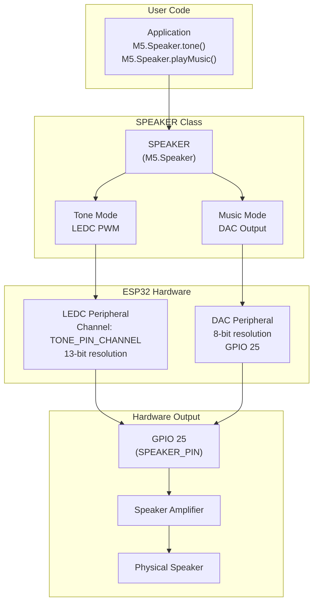
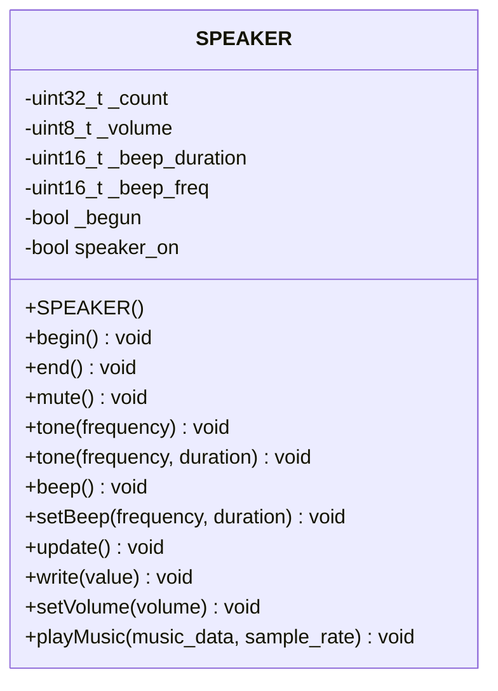
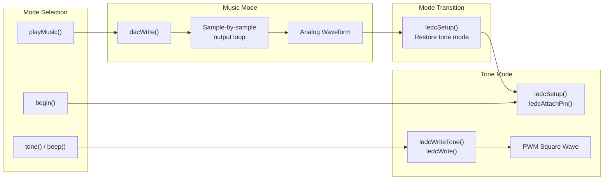
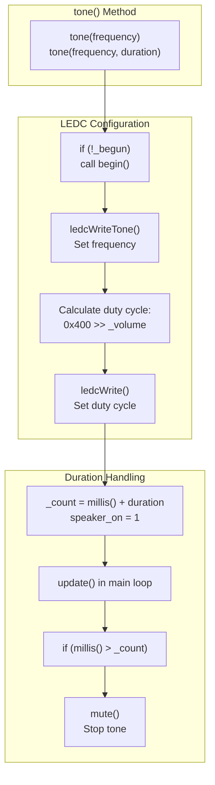
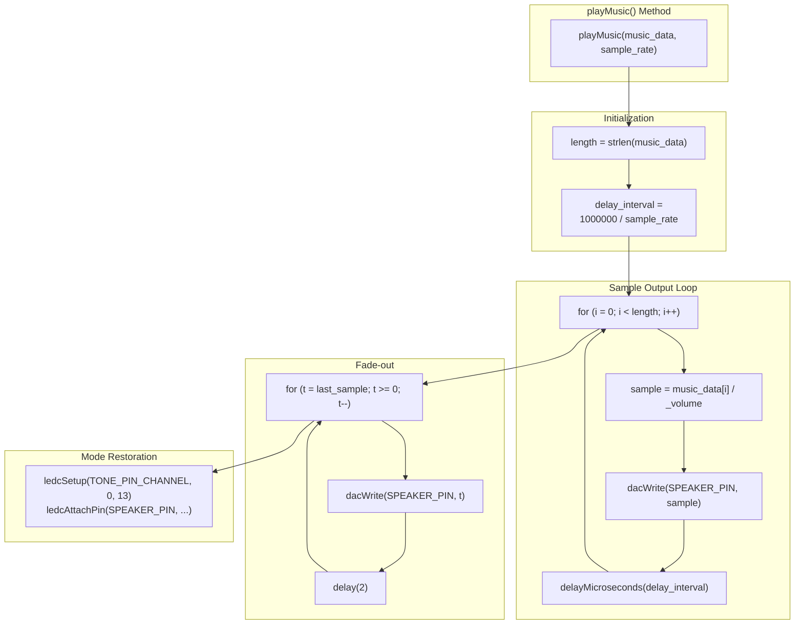

M5Stack Audio System

# Audio System

<details>
<summary>Relevant source files</summary>

The following files were used as context for generating this wiki page:

- [src/M5Display.cpp](src/M5Display.cpp)
- [src/M5Display.h](src/M5Display.h)
- [src/rom/miniz.h](src/rom/miniz.h)
- [src/utility/Speaker.cpp](src/utility/Speaker.cpp)
- [src/utility/Speaker.h](src/utility/Speaker.h)
- [src/utility/pngle.c](src/utility/pngle.c)
- [src/utility/pngle.h](src/utility/pngle.h)

</details>


## Purpose and Scope

This document describes the audio output subsystem in the M5Stack Core library, which provides tone generation and music playback capabilities through the built-in speaker. The audio system uses the ESP32's LEDC PWM peripheral for tone synthesis and the DAC (Digital-to-Analog Converter) for playing back pre-recorded audio samples.

For power management of the speaker amplifier, see [Power Management](#2.3). For general M5Stack initialization that enables the speaker, see [M5Stack Class and Initialization](#2.1).

## Hardware Architecture

The audio subsystem interfaces with the ESP32's built-in audio peripherals to drive the M5Stack's speaker. The system operates in two distinct modes depending on the type of audio output required.



**Hardware Configuration:**
- **Speaker Pin:** GPIO 25 (defined as `SPEAKER_PIN` in Config.h)
- **LEDC Channel:** `TONE_PIN_CHANNEL` (for PWM tone generation)
- **DAC Channel:** DAC1 (GPIO 25 on ESP32)
- **PWM Resolution:** 13-bit (0-8191)
- **DAC Resolution:** 8-bit (0-255)

Sources: [src/utility/Speaker.h:1-41](), [src/utility/Speaker.cpp:1-124]()

## SPEAKER Class Interface

The `SPEAKER` class provides a unified interface for audio output, encapsulating both tone generation and music playback functionality. The class maintains internal state for volume control, timed tone playback, and output mode switching.



**Class Members:**

| Member | Type | Purpose |
|--------|------|---------|
| `_count` | `uint32_t` | Timestamp for tone duration expiration |
| `_volume` | `uint8_t` | Internal volume level (1-11, inverted) |
| `_beep_duration` | `uint16_t` | Default beep duration in milliseconds |
| `_beep_freq` | `uint16_t` | Default beep frequency in Hz |
| `_begun` | `bool` | Initialization state flag |
| `speaker_on` | `bool` | Active tone playback flag |

Sources: [src/utility/Speaker.h:15-40](), [src/utility/Speaker.cpp:4-7]()

## Audio Output Modes

The audio subsystem operates in two mutually exclusive modes, switching between them based on the audio output function called. The mode transition is handled automatically by the implementation.



**Mode Characteristics:**

| Mode | Hardware | Output Type | Use Case | API Functions |
|------|----------|-------------|----------|---------------|
| **Tone Mode** | LEDC PWM | Square wave at specified frequency | Simple tones, beeps, alerts | `tone()`, `beep()` |
| **Music Mode** | DAC | Arbitrary waveform from samples | Pre-recorded audio, melodies | `playMusic()` |

Sources: [src/utility/Speaker.cpp:9-23](), [src/utility/Speaker.cpp:38-56](), [src/utility/Speaker.cpp:98-123]()

## Tone Generation with LEDC PWM

Tone generation uses the ESP32's LEDC (LED Control) peripheral to produce square wave signals at precise frequencies. The LEDC peripheral provides hardware PWM generation without CPU overhead once configured.

### Initialization Sequence

The `begin()` method initializes the LEDC peripheral with version-specific API calls:

**ESP32 Arduino Core 3.x (ESP-IDF 5+):**
```
ledcAttach(SPEAKER_PIN, 30000, 8)  // Pin, frequency, resolution
```

**ESP32 Arduino Core 2.x (Legacy):**
```
ledcSetup(TONE_PIN_CHANNEL, 0, 13)      // Channel, frequency, resolution
ledcAttachPin(SPEAKER_PIN, TONE_PIN_CHANNEL)
```

The system uses 13-bit resolution (0-8191 duty cycle range) for precise volume control through PWM duty cycle manipulation.

Sources: [src/utility/Speaker.cpp:12-19]()

### Frequency and Volume Control



**Duty Cycle Formula:**
- User volume: 0 (silent) to 10 (maximum)
- Internal `_volume`: `11 - user_volume` (range: 11 to 1)
- Duty cycle: `0x400 >> _volume` (right-shift 1024 by volume)
- Examples:
  - Volume 10 → `_volume=1` → duty = `0x400 >> 1` = 512 (50%)
  - Volume 5 → `_volume=6` → duty = `0x400 >> 6` = 16 (1.6%)
  - Volume 0 → `_volume=11` → duty = `0x400 >> 11` = 0 (silent)

Sources: [src/utility/Speaker.cpp:38-56](), [src/utility/Speaker.cpp:72-74]()

## Music Playback with DAC

The `playMusic()` method provides sample-based audio playback using the ESP32's 8-bit DAC on GPIO 25. This mode supports arbitrary waveforms stored as byte arrays, suitable for pre-recorded audio or synthesized music.

### Playback Architecture



**Key Implementation Details:**

1. **Sample Rate Timing:** Uses `delayMicroseconds()` with calculated interval = `1000000 / sample_rate` microseconds
2. **Volume Application:** Each sample divided by `_volume` (range 1-11)
3. **Data Format:** Unsigned 8-bit samples (0-255), mono audio
4. **Fade-out:** Linear fade from last sample to zero with 2ms steps
5. **Mode Switching:** Automatically restores LEDC configuration after playback

**Blocking Behavior:** The `playMusic()` method blocks until all samples are played. For non-blocking audio, consider implementing a sample streaming approach with FreeRTOS tasks.

Sources: [src/utility/Speaker.cpp:98-123]()

## Volume Control Implementation

The volume control system uses an inverted internal representation to simplify the duty cycle and sample amplitude calculations through bit-shifting and division operations.

**Volume Mapping:**

| User Volume | Internal `_volume` | Duty Cycle (Tone Mode) | Sample Divisor (Music Mode) |
|-------------|-------------------|------------------------|----------------------------|
| 10 (max) | 1 | 512 (50.0%) | ÷1 (100%) |
| 9 | 2 | 256 (25.0%) | ÷2 (50%) |
| 8 | 3 | 128 (12.5%) | ÷3 (33%) |
| 5 | 6 | 16 (1.6%) | ÷6 (17%) |
| 1 | 10 | 1 (0.1%) | ÷10 (10%) |
| 0 (mute) | 11 | 0 (0.0%) | ÷11 (9%) |

The `setVolume()` method [src/utility/Speaker.cpp:72-74]() performs the inversion: `_volume = 11 - volume`.

Sources: [src/utility/Speaker.cpp:72-74](), [src/utility/Speaker.cpp:38-56](), [src/utility/Speaker.cpp:98-123]()

## API Reference

### Initialization and Control

| Method | Parameters | Return | Description |
|--------|-----------|--------|-------------|
| `SPEAKER()` | - | - | Constructor, initializes default volume (8) and state |
| `begin()` | - | `void` | Initializes LEDC PWM, plays startup beep (1000Hz, 100ms) |
| `end()` | - | `void` | Mutes speaker and detaches LEDC pin |
| `mute()` | - | `void` | Stops all audio output, sets frequency to 0Hz |
| `update()` | - | `void` | Checks timed tone expiration, must be called in `loop()` |

Sources: [src/utility/Speaker.cpp:4-36](), [src/utility/Speaker.cpp:76-92]()

### Tone Generation

| Method | Parameters | Return | Description |
|--------|-----------|--------|-------------|
| `tone()` | `frequency` (Hz) | `void` | Plays continuous tone at specified frequency |
| `tone()` | `frequency` (Hz), `duration` (ms) | `void` | Plays tone for specified duration |
| `beep()` | - | `void` | Plays configured beep sound |
| `setBeep()` | `frequency` (Hz), `duration` (ms) | `void` | Configures default beep parameters |

Sources: [src/utility/Speaker.cpp:38-70]()

### Music Playback

| Method | Parameters | Return | Description |
|--------|-----------|--------|-------------|
| `playMusic()` | `music_data` (uint8_t*), `sample_rate` (Hz) | `void` | Plays audio samples via DAC (blocking) |
| `write()` | `value` (0-255) | `void` | Direct DAC output for custom audio synthesis |
| `setVolume()` | `volume` (0-10) | `void` | Sets output volume level |

**Note:** `playMusic()` expects null-terminated data (`strlen()` is used internally).

Sources: [src/utility/Speaker.cpp:94-123]()

## Usage Patterns

### Basic Tone Generation

```cpp
M5.begin();
M5.Speaker.begin();

// Continuous tone
M5.Speaker.tone(440);  // Play A4 (440 Hz)
delay(1000);
M5.Speaker.mute();

// Timed tone (requires update() in loop)
M5.Speaker.tone(880, 500);  // Play A5 for 500ms

void loop() {
    M5.update();  // Handles speaker timing
}
```

### Volume Control

```cpp
M5.Speaker.setVolume(10);  // Maximum volume
M5.Speaker.beep();

M5.Speaker.setVolume(3);   // Lower volume
M5.Speaker.tone(1000, 200);
```

### Custom Beep Configuration

```cpp
// Configure beep: 2000 Hz for 150ms
M5.Speaker.setBeep(2000, 150);

// Use configured beep
if (buttonPressed) {
    M5.Speaker.beep();
}
```

### Music Playback

```cpp
// Pre-recorded audio samples (8-bit unsigned, mono)
const uint8_t melody[] = {
    128, 145, 162, 178, 192, 203, 210, 213,  // Rising tone
    210, 203, 192, 178, 162, 145, 128, 0     // Falling tone
};

M5.Speaker.setVolume(8);
M5.Speaker.playMusic(melody, 8000);  // 8 kHz sample rate
// Note: playMusic() blocks until complete
```

### Direct DAC Control

```cpp
// Custom waveform generation
for (int i = 0; i < 360; i++) {
    uint8_t sample = 128 + sin(i * DEG_TO_RAD) * 127;
    M5.Speaker.write(sample);
    delayMicroseconds(125);  // 8 kHz sample rate
}

// Restore tone mode after DAC usage
M5.Speaker.begin();
```

Sources: [src/utility/Speaker.cpp:1-124](), [src/utility/Speaker.h:1-41]()

## ESP-IDF Version Compatibility

The SPEAKER class includes conditional compilation to support both ESP32 Arduino Core 2.x (ESP-IDF 4.x) and 3.x (ESP-IDF 5.x) APIs for LEDC control.

**API Differences:**

| Operation | ESP-IDF 5.x (Arduino 3.x) | ESP-IDF 4.x (Arduino 2.x) |
|-----------|---------------------------|---------------------------|
| **Attach PWM** | `ledcAttach(pin, freq, res)` | `ledcSetup(channel, freq, res)`<br/>`ledcAttachPin(pin, channel)` |
| **Write Tone** | `ledcWriteTone(pin, freq)` | `ledcWriteTone(channel, freq)` |
| **Write Duty** | `ledcWrite(pin, duty)` | `ledcWrite(channel, duty)` |
| **Detach** | `ledcDetach(pin)` | `ledcDetachPin(pin)` |

The conditional compilation uses `#if defined(ESP_IDF_VERSION_MAJOR) && (ESP_IDF_VERSION_MAJOR >= 5)` to select the appropriate API at compile time.

Sources: [src/utility/Speaker.cpp:12-19](), [src/utility/Speaker.cpp:28-32](), [src/utility/Speaker.cpp:41-49](), [src/utility/Speaker.cpp:77-81](), [src/utility/Speaker.cpp:113-119]()