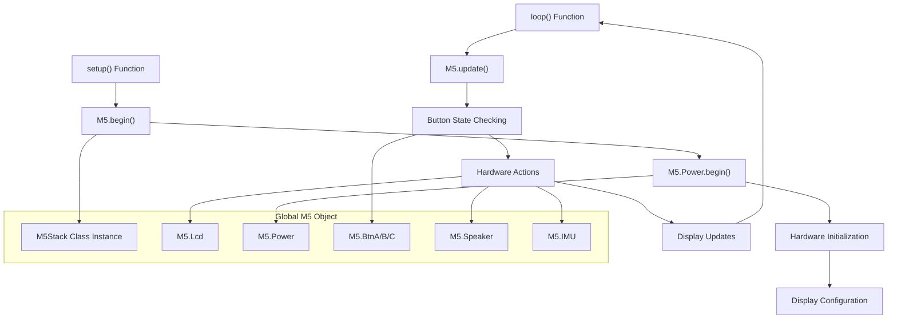
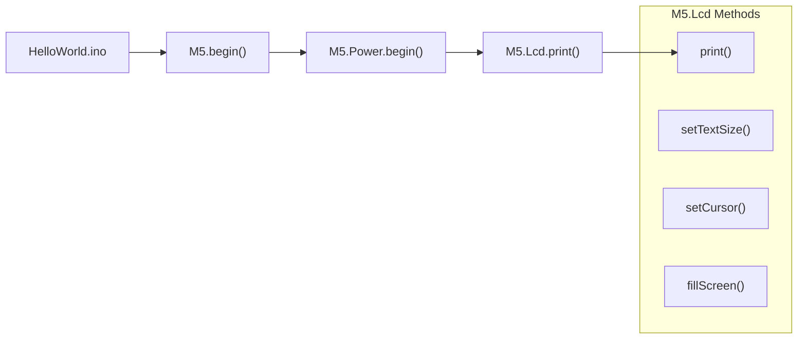
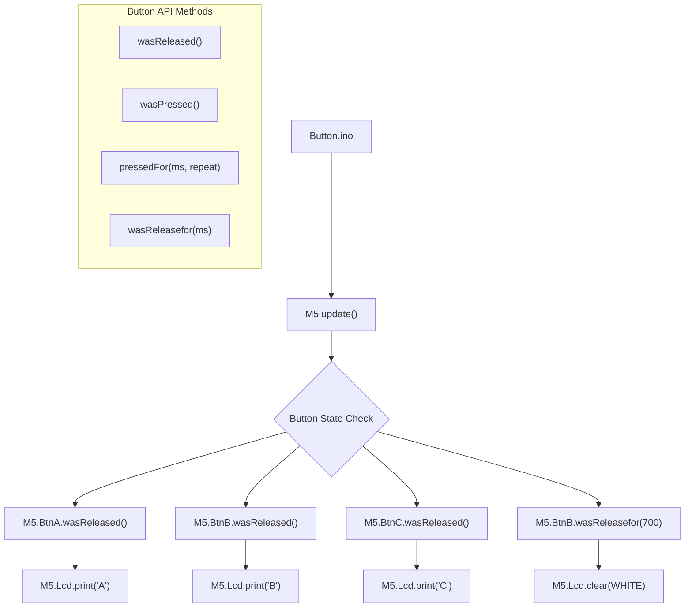
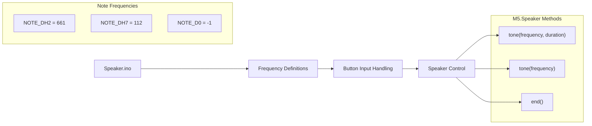
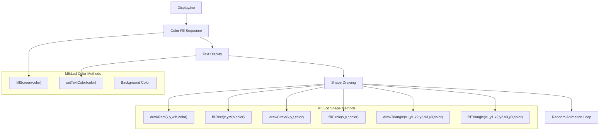
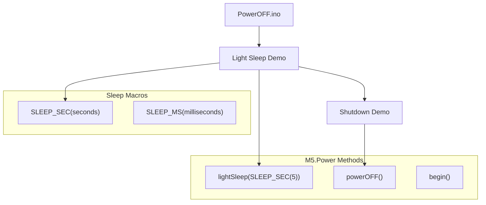
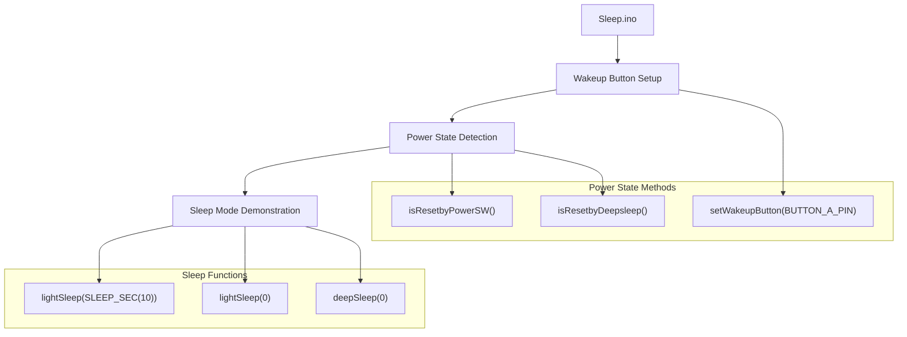
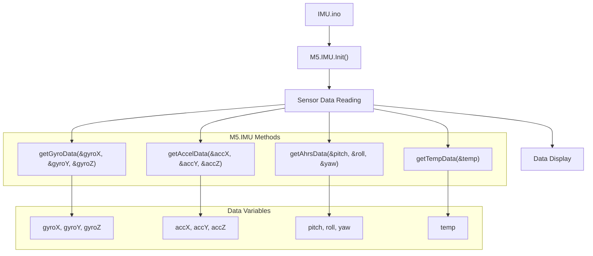
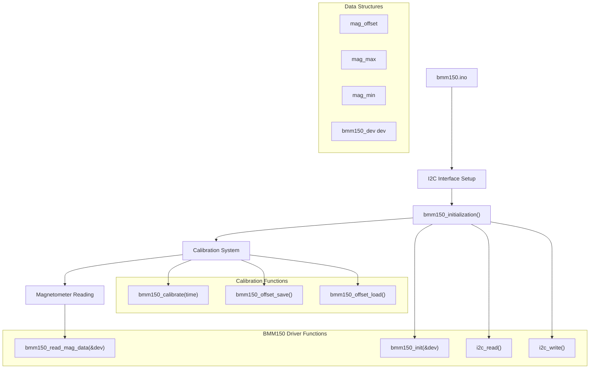
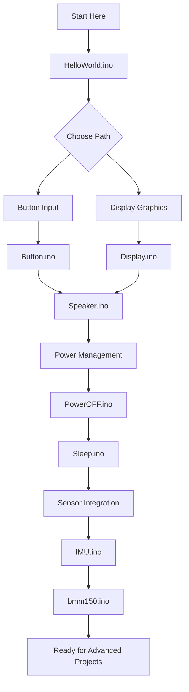

M5Stack Basic Examples and Tutorials

# Basic Examples and Tutorials

Relevant source files

The following files were used as context for generating this wiki page:

- [examples/Basics/Button/Button.ino](examples/Basics/Button/Button.ino)
- [examples/Basics/Display/Display.ino](examples/Basics/Display/Display.ino)
- [examples/Basics/HelloWorld/HelloWorld.ino](examples/Basics/HelloWorld/HelloWorld.ino)
- [examples/Basics/IMU/IMU.ino](examples/Basics/IMU/IMU.ino)
- [examples/Basics/PowerOFF/PowerOFF.ino](examples/Basics/PowerOFF/PowerOFF.ino)
- [examples/Basics/Sleep/Sleep.ino](examples/Basics/Sleep/Sleep.ino)
- [examples/Basics/Speaker/Speaker.ino](examples/Basics/Speaker/Speaker.ino)
- [examples/Basics/bmm150/bmm150.ino](examples/Basics/bmm150/bmm150.ino)

This page provides a comprehensive guide to the basic examples included in the M5Stack library, covering fundamental operations like display control, button input, speaker output, power management, and sensor integration. These examples serve as the foundation for understanding M5Stack hardware interaction and establishing development patterns.

For hardware testing and validation procedures, see [Hardware Testing and Validation](#3.2). For detailed API reference, see [API Reference and Keywords](#7.1).

## Purpose and Scope

The basic examples demonstrate core M5Stack functionality through progressively complex tutorials. They establish common patterns for hardware initialization, main loop structure, and peripheral control that are essential for all M5Stack development.

## Example Structure and Common Patterns

All M5Stack examples follow a consistent structure built around the global `M5` object and standard Arduino framework patterns.

### Core Example Architecture

Sources: [examples/Basics/HelloWorld/HelloWorld.ino:19-27](), [examples/Basics/PowerOFF/PowerOFF.ino:19-21](), [examples/Basics/Speaker/Speaker.ino:46-48]()

### Standard Initialization Pattern

Every M5Stack example begins with the same initialization sequence:

| Step | Function Call | Purpose |
|------|---------------|---------|
| 1 | `M5.begin()` | Initialize core M5Stack hardware |
| 2 | `M5.Power.begin()` | Initialize power management system |
| 3 | Display setup | Configure LCD properties |
| 4 | Hardware-specific init | Initialize sensors, peripherals |

Sources: [examples/Basics/HelloWorld/HelloWorld.ino:20-21](), [examples/Basics/Button/Button.ino:21-22](), [examples/Basics/IMU/IMU.ino:35-38]()

## Fundamental Hardware Control Examples

### Hello World - Basic Display Output

The simplest example demonstrates basic initialization and text display using the `M5.Lcd` interface.

Sources: [examples/Basics/HelloWorld/HelloWorld.ino:25]()

### Button Input Handling

The button example demonstrates the M5Stack button API with different press detection methods.

Sources: [examples/Basics/Button/Button.ino:42-54]()

### Speaker Audio Output

The speaker example shows audio generation using frequency-based tone control.

Sources: [examples/Basics/Speaker/Speaker.ino:15-41](), [examples/Basics/Speaker/Speaker.ino:63-72]()

### Display Graphics and Colors

The display example demonstrates comprehensive LCD control including colors, shapes, and text formatting.

Sources: [examples/Basics/Display/Display.ino:22-61](), [examples/Basics/Display/Display.ino:68-74]()

## Power Management Examples

### Basic Power Control

The PowerOFF example demonstrates essential power management features including sleep modes and shutdown.

Sources: [examples/Basics/PowerOFF/PowerOFF.ino:29-31](), [examples/Basics/PowerOFF/PowerOFF.ino:45-47]()

### Advanced Sleep Management

The Sleep example shows comprehensive power state management with wake-up detection.

Sources: [examples/Basics/Sleep/Sleep.ino:22-23](), [examples/Basics/Sleep/Sleep.ino:35-41](), [examples/Basics/Sleep/Sleep.ino:57-71]()

## Advanced Sensor Integration

### IMU Sensor Data Reading

The IMU example demonstrates reading and displaying motion sensor data from the built-in IMU.

Sources: [examples/Basics/IMU/IMU.ino:38](), [examples/Basics/IMU/IMU.ino:55-63]()

### Magnetometer with Calibration

The BMM150 example shows advanced sensor integration with calibration procedures and data persistence.

Sources: [examples/Basics/bmm150/bmm150.ino:53-82](), [examples/Basics/bmm150/bmm150.ino:135-172](), [examples/Basics/bmm150/bmm150.ino:84-99]()

## Example Progression Path

The examples are designed to build upon each other in complexity and demonstrate different aspects of M5Stack development:

| Example | Complexity | Key Concepts | Prerequisites |
|---------|------------|--------------|---------------|
| HelloWorld | Beginner | Basic initialization, text display | None |
| Button | Beginner | Input handling, button states | HelloWorld |
| Display | Beginner | Graphics, colors, shapes | HelloWorld |
| Speaker | Beginner | Audio output, frequency control | Button |
| PowerOFF | Intermediate | Power management, sleep modes | Button |
| Sleep | Intermediate | Advanced power states, wake detection | PowerOFF |
| IMU | Intermediate | Sensor data, real-time display | Display |
| BMM150 | Advanced | I2C communication, calibration, persistence | IMU |

### Learning Path Recommendations

Sources: [examples/Basics/HelloWorld/HelloWorld.ino](), [examples/Basics/Button/Button.ino](), [examples/Basics/Display/Display.ino](), [examples/Basics/Speaker/Speaker.ino](), [examples/Basics/PowerOFF/PowerOFF.ino](), [examples/Basics/Sleep/Sleep.ino](), [examples/Basics/IMU/IMU.ino](), [examples/Basics/bmm150/bmm150.ino]()