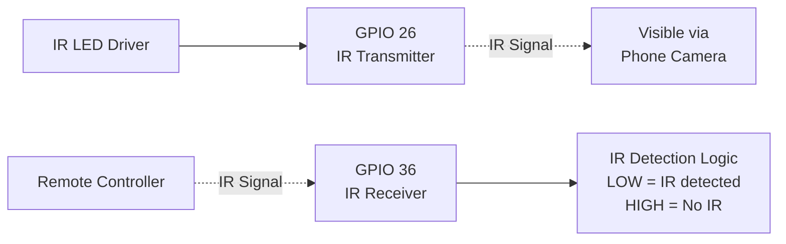
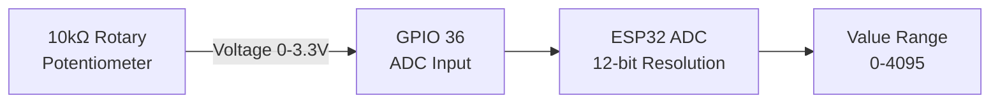
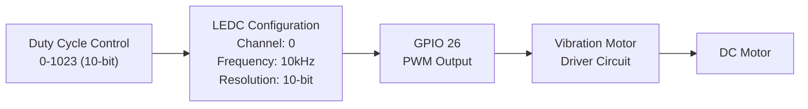
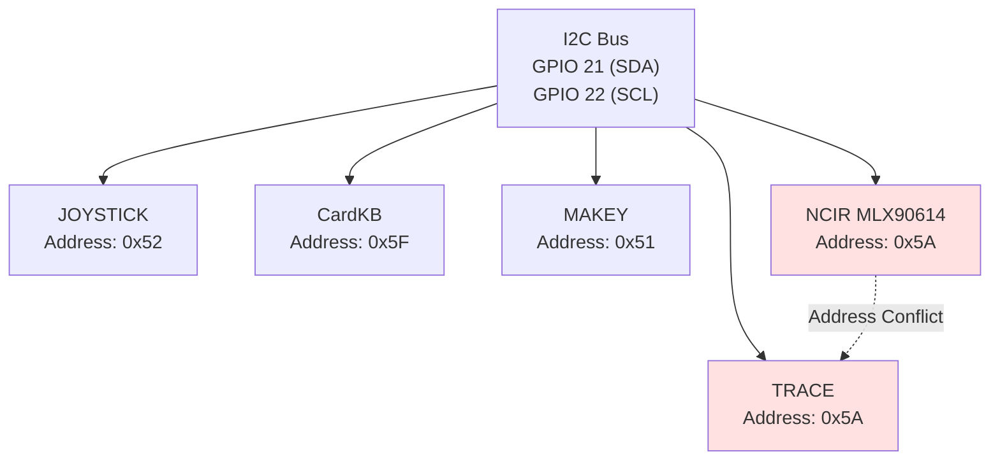
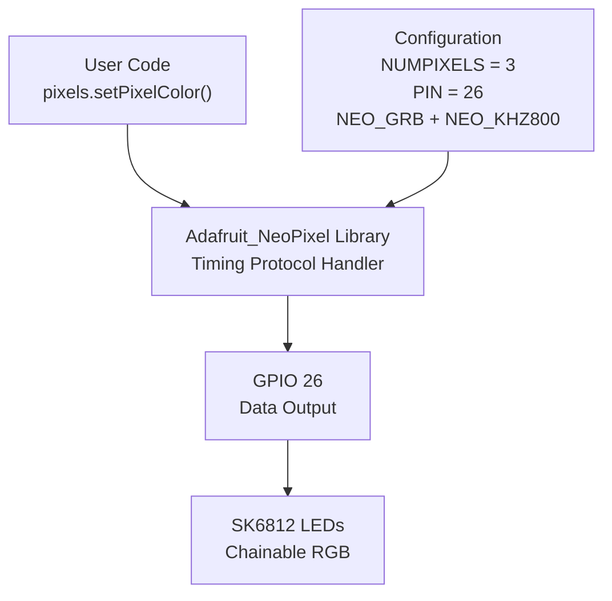

M5Stack Basic I/O and Interface Units

# Basic I/O and Interface Units

<details>
<summary>Relevant source files</summary>

The following files were used as context for generating this wiki page:

- [examples/Unit/ANGLE/ANGLE.ino](examples/Unit/ANGLE/ANGLE.ino)
- [examples/Unit/BUTTON/BUTTON.ino](examples/Unit/BUTTON/BUTTON.ino)
- [examples/Unit/CardKB/CardKB.ino](examples/Unit/CardKB/CardKB.ino)
- [examples/Unit/DUAL_BUTTON/DUAL_BUTTON.ino](examples/Unit/DUAL_BUTTON/DUAL_BUTTON.ino)
- [examples/Unit/EARTH/EARTH.ino](examples/Unit/EARTH/EARTH.ino)
- [examples/Unit/IR/IR.ino](examples/Unit/IR/IR.ino)
- [examples/Unit/JOYSTICK/JOYSTICK.ino](examples/Unit/JOYSTICK/JOYSTICK.ino)
- [examples/Unit/MAKEY/MAKEY.ino](examples/Unit/MAKEY/MAKEY.ino)
- [examples/Unit/NCIR_MLX90614/NCIR_MLX90614.ino](examples/Unit/NCIR_MLX90614/NCIR_MLX90614.ino)
- [examples/Unit/RGB_SK6812/RGB_SK6812.ino](examples/Unit/RGB_SK6812/RGB_SK6812.ino)
- [examples/Unit/TRACE/TRACE.ino](examples/Unit/TRACE/TRACE.ino)
- [examples/Unit/VIBRATOR/VIBRATOR.ino](examples/Unit/VIBRATOR/VIBRATOR.ino)

</details>


## Purpose and Scope

This page documents M5Stack Units that use simple GPIO, analog, PWM, or I2C interfaces requiring minimal configuration. These units provide fundamental input/output capabilities and can be integrated with straightforward `digitalRead()`, `analogRead()`, `Wire` library operations, or basic external libraries. 

For complex sensor units requiring specialized protocols, state machines, or FreeRTOS integration (CAN, WEIGHT/HX711, GESTURE, PDM, GPS, NBIoT, COLOR, ToF, DAC), see [Advanced Sensor Units](#4.2). For motor control and servo modules using PCA9685 or encoder feedback, see [Motor Control and Robotics](#5.2).

**Units covered in this document:**
- **GPIO Digital I/O**: BUTTON, DUAL_BUTTON, IR transmitter/receiver
- **Analog Input**: ANGLE (potentiometer), EARTH (moisture sensor)
- **PWM Output**: VIBRATOR (motor control)
- **Simple I2C**: JOYSTICK, CardKB, MAKEY, NCIR (MLX90614), TRACE
- **External Library-Based**: RGB LEDs (SK6812/NeoPixel)

---

## Pin Assignment and Port Usage

M5Stack Units connect to the Core device via two primary expansion ports: **Port A (I2C Grove connector)** using GPIO 21/22, and **Port B** using GPIO 26/36. These pins are shared across all basic units, requiring careful selection of compatible units when multiple units are used simultaneously.

### M5Stack Unit Pin Allocation Diagram

```mermaid
graph TB
    subgraph "M5Stack Core ESP32"
        GPIO21["GPIO 21<br/>(I2C SDA)"]
        GPIO22["GPIO 22<br/>(I2C SCL)"]
        GPIO36["GPIO 36<br/>(Analog/Digital Input)"]
        GPIO26["GPIO 26<br/>(Digital I/O / PWM)"]
        GPIO25["GPIO 25<br/>(DAC / Speaker)"]
    end
    
    subgraph "Port A (Grove I2C)"
        JOYSTICK["JOYSTICK<br/>I2C 0x52"]
        CardKB["CardKB<br/>I2C 0x5F"]
        MAKEY["MAKEY<br/>I2C 0x51"]
        NCIR["NCIR MLX90614<br/>I2C 0x5A"]
        TRACE["TRACE<br/>I2C 0x5A"]
    end
    
    subgraph "Port B (GPIO 26/36)"
        BUTTON_Unit["BUTTON<br/>GPIO 36 Input"]
        DUAL_BTN1["DUAL_BUTTON<br/>GPIO 36 + 26 Input"]
        IR_Unit["IR Receiver<br/>GPIO 36 Input"]
        IR_Send["IR Sender<br/>GPIO 26 Output"]
        ANGLE_Unit["ANGLE<br/>GPIO 36 Analog"]
        EARTH_Unit["EARTH<br/>GPIO 36 Analog<br/>GPIO 26 Digital"]
        VIBRATOR_Unit["VIBRATOR<br/>GPIO 26 PWM"]
        RGB_Unit["RGB SK6812<br/>GPIO 26 Data"]
    end
    
    GPIO21 --> JOYSTICK
    GPIO21 --> CardKB
    GPIO21 --> MAKEY
    GPIO21 --> NCIR
    GPIO21 --> TRACE
    GPIO22 --> JOYSTICK
    GPIO22 --> CardKB
    GPIO22 --> MAKEY
    GPIO22 --> NCIR
    GPIO22 --> TRACE
    
    GPIO36 --> BUTTON_Unit
    GPIO36 --> DUAL_BTN1
    GPIO36 --> IR_Unit
    GPIO36 --> ANGLE_Unit
    GPIO36 --> EARTH_Unit
    
    GPIO26 --> DUAL_BTN1
    GPIO26 --> IR_Send
    GPIO26 --> EARTH_Unit
    GPIO26 --> VIBRATOR_Unit
    GPIO26 --> RGB_Unit
    
    style GPIO21 fill:#e1f5ff
    style GPIO22 fill:#e1f5ff
    style GPIO36 fill:#fff4e1
    style GPIO26 fill:#e8f5e9
```



**Sources:** [examples/Unit/BUTTON/BUTTON.ino:22](), [examples/Unit/DUAL_BUTTON/DUAL_BUTTON.ino:22-23](), [examples/Unit/JOYSTICK/JOYSTICK.ino:24](), [examples/Unit/IR/IR.ino:15-16](), [examples/Unit/VIBRATOR/VIBRATOR.ino:15](), [examples/Unit/ANGLE/ANGLE.ino:15](), [examples/Unit/CardKB/CardKB.ino:15](), [examples/Unit/MAKEY/MAKEY.ino:30](), [examples/Unit/EARTH/EARTH.ino:21-22](), [examples/Unit/NCIR_MLX90614/NCIR_MLX90614.ino:28](), [examples/Unit/RGB_SK6812/RGB_SK6812.ino:17](), [examples/Unit/TRACE/TRACE.ino:22]()

### Pin Function Summary

| GPIO Pin | Primary Function | Compatible Units | Interface Type | Notes |
|----------|-----------------|------------------|----------------|-------|
| **21** | I2C SDA | JOYSTICK, CardKB, MAKEY, NCIR, TRACE | I2C Data | Shared bus, requires unique I2C addresses |
| **22** | I2C SCL | JOYSTICK, CardKB, MAKEY, NCIR, TRACE | I2C Clock | Shared bus |
| **36** | Input Only | BUTTON, DUAL_BUTTON, IR RX, ANGLE, EARTH | Digital/Analog Input | Input-only GPIO, no pull-up capability |
| **26** | Bidirectional I/O | DUAL_BUTTON, IR TX, EARTH, VIBRATOR, RGB | Digital/PWM/Serial | Supports output modes |
| **25** | DAC Output | Speaker (not Unit) | Analog Audio | Disabled via `dacWrite(25, 0)` to prevent noise |

**Important Constraints:**
- **GPIO 36** is input-only and lacks internal pull-up resistors, requiring external pull-ups for buttons
- **Port B conflicts**: Only one GPIO 26 output unit can be active simultaneously (VIBRATOR, IR TX, RGB, or EARTH digital output)
- **I2C address conflicts**: NCIR (0x5A) and TRACE (0x5A) share the same address and cannot be used together
- **Speaker interference**: `dacWrite(25, 0)` is commonly called in Unit examples to disable DAC noise on GPIO 25

**Sources:** [examples/Unit/BUTTON/BUTTON.ino:22](), [examples/Unit/ANGLE/ANGLE.ino:25](), [examples/Unit/JOYSTICK/JOYSTICK.ino:23]()

---

## GPIO Digital I/O Units

These units use simple digital input/output operations via `pinMode()`, `digitalRead()`, and `digitalWrite()` without requiring I2C communication or analog conversion.

### BUTTON Unit

Single-button unit connected to **GPIO 36** providing basic press/release detection. The unit outputs **LOW (0)** when pressed and **HIGH (1)** when released.

**Initialization Pattern:**
```cpp
pinMode(36, INPUT);  // Configure GPIO 36 as input
int button_state = digitalRead(36);  // Read current state
```

**State Logic:**
- `digitalRead(36) == 0`: Button pressed
- `digitalRead(36) == 1`: Button released

**Example Implementation:**
[examples/Unit/BUTTON/BUTTON.ino:22]() configures the pin mode, and [examples/Unit/BUTTON/BUTTON.ino:32-55]() implements debouncing by comparing `cur_value` with `last_value` to detect state changes before updating the display.

**Sources:** [examples/Unit/BUTTON/BUTTON.ino:1-57]()

---

### DUAL_BUTTON Unit

Two-button unit using **GPIO 36** (Button 1) and **GPIO 26** (Button 2), enabling dual-input scenarios like left/right control or confirm/cancel interfaces.

**Initialization Pattern:**
```cpp
pinMode(36, INPUT);  // Button 1
pinMode(26, INPUT);  // Button 2
```

**Dual Input Reading:**
[examples/Unit/DUAL_BUTTON/DUAL_BUTTON.ino:33-34]() demonstrates simultaneous reading:
```cpp
cur_value1 = digitalRead(36);
cur_value2 = digitalRead(26);
```

Each button maintains independent state tracking with separate `last_value1` and `last_value2` variables for debouncing ([examples/Unit/DUAL_BUTTON/DUAL_BUTTON.ino:41-71]()).

**Sources:** [examples/Unit/DUAL_BUTTON/DUAL_BUTTON.ino:1-73]()

---

### IR Unit (Infrared Transmitter/Receiver)

Infrared communication unit with **GPIO 36** as IR receiver input and **GPIO 26** as IR transmitter output. Commonly used for remote control applications or line-of-sight communication.

#### Hardware Configuration



**Sources:** [examples/Unit/IR/IR.ino:15-16](), [examples/Unit/IR/IR.ino:25-30]()

#### Transmitter (GPIO 26)

Continuous IR transmission is enabled by setting GPIO 26 to HIGH:
```cpp
pinMode(ir_send_pin, OUTPUT);
digitalWrite(ir_send_pin, 1);  // Transmit IR continuously
```

[examples/Unit/IR/IR.ino:26-30]() notes that the IR transmission is visible through a mobile phone camera, as phone cameras can detect infrared wavelengths.

#### Receiver (GPIO 36)

The IR receiver outputs **LOW (0)** when IR light is detected, **HIGH (1)** otherwise:
```cpp
pinMode(ir_recv_pin, INPUT);
int ir_detected = (digitalRead(ir_recv_pin) == 0);
```

Detection logic at [examples/Unit/IR/IR.ino:41-48]() monitors for state changes to display "detected!" messages when remote control signals are received.

**Sources:** [examples/Unit/IR/IR.ino:1-52]()

---

### EARTH Unit (Digital Mode)

The EARTH unit (moisture sensor) supports both analog and digital interfaces. In digital mode, **GPIO 26** outputs HIGH when moisture is detected, LOW when dry.

**Digital Configuration:**
```cpp
pinMode(26, INPUT);
int moisture_detected = digitalRead(26);
```

[examples/Unit/EARTH/EARTH.ino:21-29]() demonstrates simultaneous analog (GPIO 36) and digital (GPIO 26) readings, with the digital output providing a simple threshold-based wet/dry indicator.

**Sources:** [examples/Unit/EARTH/EARTH.ino:1-32]()

---

## Analog Input Units

These units utilize the ESP32's 12-bit ADC (Analog-to-Digital Converter) on **GPIO 36** to measure variable resistance or voltage levels, returning values from 0 to 4095.

### ANGLE Unit (Potentiometer)

Rotary potentiometer unit providing angular position measurement from 0° to ~270° mapped to ADC values 0-4095.

#### Analog Reading Pattern



**Sources:** [examples/Unit/ANGLE/ANGLE.ino:15](), [examples/Unit/ANGLE/ANGLE.ino:32]()

**Implementation:**
[examples/Unit/ANGLE/ANGLE.ino:32]() reads the analog value:
```cpp
int sensorPin = 36;
int cur_sensorValue = analogRead(sensorPin);  // Returns 0-4095
```

**Debouncing Strategy:**
[examples/Unit/ANGLE/ANGLE.ino:34-38]() implements noise filtering by only updating the display when the value change exceeds a threshold:
```cpp
if (abs(cur_sensorValue - last_sensorValue) > 10) {  // 10-count hysteresis
    M5.Lcd.fillRect(0, 25, 100, 25, BLACK);
    M5.Lcd.print(cur_sensorValue);
    last_sensorValue = cur_sensorValue;
}
```

This 10-count threshold prevents display flicker from ADC noise.

**Sources:** [examples/Unit/ANGLE/ANGLE.ino:1-41]()

---

### EARTH Unit (Analog Mode)

Soil moisture sensor providing analog resistance measurement via **GPIO 36**. Higher values indicate drier soil, lower values indicate more moisture.

**Analog Reading:**
```cpp
int moisture_value = analogRead(36);  // 0 (wet) to 4095 (dry)
```

[examples/Unit/EARTH/EARTH.ino:28]() reads the analog value in the main loop without debouncing, suitable for slow-changing moisture levels. The unit also provides a digital threshold output on GPIO 26 for simple wet/dry detection.

**Dual-Mode Operation Table:**

| Interface | GPIO Pin | Function | Value Interpretation |
|-----------|----------|----------|----------------------|
| Analog | 36 | Continuous moisture level | 0-4095 (low = wet, high = dry) |
| Digital | 26 | Threshold detection | 0 = dry, 1 = moisture detected |

**Sources:** [examples/Unit/EARTH/EARTH.ino:1-32]()

---

## PWM Output Units

These units use the ESP32's LED Control (LEDC) peripheral to generate Pulse Width Modulation (PWM) signals for motor control or LED brightness modulation.

### VIBRATOR Unit (Motor Driver)

Vibration motor controlled via PWM on **GPIO 26**, commonly used for haptic feedback or alert notifications.

#### LEDC PWM Configuration



**Sources:** [examples/Unit/VIBRATOR/VIBRATOR.ino:15-31](), [examples/Unit/VIBRATOR/VIBRATOR.ino:36-39]()

**LEDC Setup:**
[examples/Unit/VIBRATOR/VIBRATOR.ino:26-31]() configures the PWM parameters:
```cpp
int freq = 10000;        // 10 kHz PWM frequency
int ledChannel = 0;      // LEDC channel 0
int resolution = 10;     // 10-bit resolution (0-1023)

ledcSetup(ledChannel, freq, resolution);
ledcAttachPin(motor_pin, ledChannel);  // Bind channel to GPIO 26
```

**Motor Control:**
[examples/Unit/VIBRATOR/VIBRATOR.ino:36-39]() demonstrates on/off control:
```cpp
ledcWrite(ledChannel, 512);  // 50% duty cycle - motor on
delay(1000);
ledcWrite(ledChannel, 0);    // 0% duty cycle - motor off
delay(1000);
```

**PWM Duty Cycle Mapping:**
- `0`: Motor off (0% duty)
- `512`: Half speed (50% duty)
- `1023`: Full speed (100% duty)

**Sources:** [examples/Unit/VIBRATOR/VIBRATOR.ino:1-41]()

---

## Simple I2C Units

These units communicate via the I2C bus (GPIO 21 SDA, GPIO 22 SCL) using the `Wire` library. Each unit has a unique I2C address allowing multiple units to share the same bus.

### I2C Bus Initialization

All I2C units require `Wire.begin()` before communication:
```cpp
Wire.begin(21, 22, 400000UL);  // SDA=21, SCL=22, 400kHz clock
```

[examples/Unit/JOYSTICK/JOYSTICK.ino:24]() demonstrates explicit pin and frequency specification. Some examples use `Wire.begin()` without parameters, relying on default I2C pins.

### I2C Address Map



**Sources:** [examples/Unit/JOYSTICK/JOYSTICK.ino:15](), [examples/Unit/CardKB/CardKB.ino:15](), [examples/Unit/MAKEY/MAKEY.ino:110](), [examples/Unit/NCIR_MLX90614/NCIR_MLX90614.ino:28](), [examples/Unit/TRACE/TRACE.ino:22]()

**Address Conflict Warning:** NCIR (MLX90614) and TRACE units both use address 0x5A and cannot be used simultaneously on the same I2C bus.

---

### JOYSTICK Unit

Analog joystick with integrated button, communicating via I2C address **0x52**. Returns 3 bytes: X-axis (0-255), Y-axis (0-255), and button state (0/1).

#### Data Reading Pattern

**Request and Parse:**
[examples/Unit/JOYSTICK/JOYSTICK.ino:31-38]() demonstrates the communication protocol:
```cpp
#define JOY_ADDR (0x52)

Wire.requestFrom(JOY_ADDR, 3);  // Request 3 bytes
if (Wire.available()) {
    x_data = Wire.read();       // Byte 0: X-axis (0-255)
    y_data = Wire.read();       // Byte 1: Y-axis (0-255)
    button_data = Wire.read();  // Byte 2: Button (0=pressed, 1=released)
}
```

**Value Ranges:**
- **X-axis**: 0 (full left) to 255 (full right), ~127 at center
- **Y-axis**: 0 (full down) to 255 (full up), ~127 at center
- **Button**: 0 (pressed) to 1 (released)

**Sources:** [examples/Unit/JOYSTICK/JOYSTICK.ino:1-49]()

---

### CardKB Unit (Mini Keyboard)

Full QWERTY mini keyboard communicating via I2C address **0x5F**. Returns ASCII character codes when keys are pressed, or 0x00 when no key is active.

#### Keyboard Input Protocol

**Character Reading:**
[examples/Unit/CardKB/CardKB.ino:27-35]() implements the input loop:
```cpp
#define CARDKB_ADDR (0x5F)

Wire.requestFrom(CARDKB_ADDR, 1);  // Request 1 byte
while (Wire.available()) {
    char c = Wire.read();           // ASCII character or 0x00
    if (c != 0) {
        M5.Lcd.printf("%c", c);     // Display character
    }
}
```

**Key Mapping:**
- Alphanumeric keys return standard ASCII codes (A-Z, 0-9)
- Special keys (Enter, Space, Backspace) return their ASCII equivalents
- No key pressed returns `0x00` (null character)

**Sources:** [examples/Unit/CardKB/CardKB.ino:1-37]()

---

### MAKEY Unit (Capacitive Touch Piano)

Capacitive touch sensor array with 8 keys, communicating via I2C address **0x51**. Returns 2 bytes representing the 8-bit touch state, where each bit corresponds to one key.

#### Touch State Decoding


**Sources:** [examples/Unit/MAKEY/MAKEY.ino:110-115](), [examples/Unit/MAKEY/MAKEY.ino:34-105]()

**Data Reading:**
[examples/Unit/MAKEY/MAKEY.ino:110-115]() reads the touch states:
```cpp
Wire.requestFrom(0x51, 2);
while (Wire.available()) {
    Key1 = Wire.read();  // Byte 1: Keys 0-7 state
    Key2 = Wire.read();  // Byte 2: Reserved/unused
}
```

**Touch State Extraction:**
[examples/Unit/MAKEY/MAKEY.ino:42-47]() demonstrates bit masking to check individual keys:
```cpp
if ((Key1 & (0x01 << 0)) == 0x00) {
    // Key 0 not touched
} else {
    // Key 0 touched
    M5.Speaker.tone(NOTE_DL1, 20);  // Play tone
}
```

Each of the 8 keys can trigger a different musical note, creating a simple piano interface ([examples/Unit/MAKEY/MAKEY.ino:15-22]() defines note frequencies).

**Sources:** [examples/Unit/MAKEY/MAKEY.ino:1-119]()

---

### NCIR Unit (MLX90614 Non-Contact Infrared Thermometer)

Non-contact infrared temperature sensor using I2C address **0x5A**. Reads object temperature from the MLX90614's internal register and converts the raw value to Celsius.

#### Temperature Reading Protocol

**MLX90614 Register Access:**
[examples/Unit/NCIR_MLX90614/NCIR_MLX90614.ino:28-36]() implements the read sequence:
```cpp
Wire.beginTransmission(0x5A);    // MLX90614 I2C address
Wire.write(0x07);                // Register 0x07: Object temperature
Wire.endTransmission(false);     // Repeated start (don't release bus)
Wire.requestFrom(0x5A, 2);       // Request 2 bytes (16-bit value)

result = Wire.read();            // Low byte
result |= Wire.read() << 8;      // High byte
```

**Temperature Conversion:**
[examples/Unit/NCIR_MLX90614/NCIR_MLX90614.ino:38]() converts the raw 16-bit value to Celsius:
```cpp
temperature = result * 0.02 - 273.15;  // Kelvin to Celsius
```

The MLX90614 stores temperature in units of 0.02K, requiring multiplication by 0.02 to get Kelvin, then subtracting 273.15 to convert to Celsius.

**Register 0x07** specifically reads object temperature (Ta). Alternative registers:
- 0x06: Ambient temperature
- 0x07: Object temperature (used in example)

**Sources:** [examples/Unit/NCIR_MLX90614/NCIR_MLX90614.ino:1-43]()

---

### TRACE Unit (Line Following Sensor Array)

4-channel line detection sensor array using I2C address **0x5A**. Returns a single byte where bits 0-3 represent the four sensor states (0=black line detected, 1=white surface).

#### Sensor Data Format

**4-Bit State Reading:**
[examples/Unit/TRACE/TRACE.ino:22-28]() reads the sensor byte:
```cpp
Wire.beginTransmission(0x5a);
Wire.write(0x00);                // Register 0x00: Sensor state
Wire.endTransmission();
Wire.requestFrom(0x5a, 1);       // Request 1 byte

value = Wire.read();              // Bits 0-3 = Sensor 0-3 state
```

**Bit Extraction (Optional):**
[examples/Unit/TRACE/TRACE.ino:32-44]() shows how to split the byte into individual sensor values:
```cpp
SensorArray[3] = (value & 0x08) >> 3;  // Bit 3 -> Sensor 3
SensorArray[2] = (value & 0x04) >> 2;  // Bit 2 -> Sensor 2
SensorArray[1] = (value & 0x02) >> 1;  // Bit 1 -> Sensor 1
SensorArray[0] = (value & 0x01) >> 0;  // Bit 0 -> Sensor 0
```

**Line Following Application:**
The 4-sensor array is typically used for line-following robots, where the combination of sensor states indicates the line position relative to the robot:

| Sensor Pattern | Interpretation |
|----------------|----------------|
| `0000` (0x00) | All sensors on black line |
| `1111` (0x0F) | All sensors on white surface |
| `0110` (0x06) | Line centered between sensors 1 and 2 |
| `1000` (0x08) | Line far left |
| `0001` (0x01) | Line far right |

**Sources:** [examples/Unit/TRACE/TRACE.ino:1-67]()

---

## External Library Integration

Some units require external libraries for protocol handling, particularly addressable RGB LEDs which use precise timing protocols beyond standard GPIO operations.

### RGB Unit (SK6812/WS2812 Addressable LEDs)

Addressable RGB LED strip controlled via **GPIO 26** using the Adafruit_NeoPixel library. The SK6812 protocol requires precise timing for data transmission, handled by the external library.

#### NeoPixel Library Integration



**Sources:** [examples/Unit/RGB_SK6812/RGB_SK6812.ino:17-21](), [examples/Unit/RGB_SK6812/RGB_SK6812.ino:36-40]()

**Library Configuration:**
[examples/Unit/RGB_SK6812/RGB_SK6812.ino:17-21]() initializes the NeoPixel object:
```cpp
#define PIN (26)
#define NUMPIXELS (3)

Adafruit_NeoPixel pixels = Adafruit_NeoPixel(
    NUMPIXELS,              // Number of LEDs
    PIN,                    // Control pin
    NEO_GRB + NEO_KHZ800    // GRB color order, 800kHz protocol
);

pixels.begin();             // Initialize library
```

**LED Control:**
[examples/Unit/RGB_SK6812/RGB_SK6812.ino:36-40]() demonstrates per-pixel color control:
```cpp
pixels.setPixelColor(i, pixels.Color(100, 0, 0));    // Red
pixels.setPixelColor(j, pixels.Color(0, 100, 0));    // Green
pixels.setPixelColor(k, pixels.Color(0, 0, 100));    // Blue
pixels.show();  // Update hardware with new colors
```

**Color Format:**
- `pixels.Color(R, G, B)`: RGB values 0-255
- Colors are buffered and only updated when `pixels.show()` is called
- Multiple LEDs can be updated before calling `show()` for synchronized updates

**SK6812 vs WS2812:**
Both LED types are compatible with the Adafruit_NeoPixel library. SK6812 includes an additional white channel (RGBW) but the 3-LED unit example uses RGB mode only.

**Library Dependency:**
The example requires the external library: `Adafruit_NeoPixel` (https://github.com/adafruit/Adafruit_NeoPixel), specified in [examples/Unit/RGB_SK6812/RGB_SK6812.ino:11]().

**Sources:** [examples/Unit/RGB_SK6812/RGB_SK6812.ino:1-49]()

---

## Common Initialization Patterns

### Standard Unit Setup Sequence

Most basic I/O units follow this initialization pattern in `setup()`:

```cpp
void setup() {
    M5.begin();                  // Initialize M5Stack core
    M5.Power.begin();            // Initialize power management
    
    // Configure GPIO pins
    pinMode(36, INPUT);          // For input units
    pinMode(26, OUTPUT);         // For output units
    
    // I2C initialization (if needed)
    Wire.begin(21, 22, 400000UL);
    
    // Disable speaker noise
    dacWrite(25, 0);             // Common in analog/I2C examples
    
    // Display setup
    M5.Lcd.setTextSize(2);
    M5.Lcd.println("Unit Test");
}
```

### Speaker Noise Suppression

Many examples include `dacWrite(25, 0)` to disable DAC output on GPIO 25, preventing electrical noise from interfering with sensitive analog or I2C operations. This is seen in:
- [examples/Unit/JOYSTICK/JOYSTICK.ino:23]()
- [examples/Unit/ANGLE/ANGLE.ino:25]()
- [examples/Unit/EARTH/EARTH.ino:22]()

### I2C Clock Speed

I2C units typically use 400kHz (fast mode) clock speed for improved communication performance. Standard mode (100kHz) is sufficient but slower. [examples/Unit/JOYSTICK/JOYSTICK.ino:24]() explicitly sets 400kHz: `Wire.begin(21, 22, 400000UL)`.

---

## Unit Compatibility Matrix

| Unit 1 | Unit 2 | Compatible? | Notes |
|--------|--------|-------------|-------|
| BUTTON (GPIO 36) | JOYSTICK (I2C) | ✓ Yes | Different interfaces |
| DUAL_BUTTON (GPIO 26+36) | ANGLE (GPIO 36) | ✗ No | GPIO 36 conflict |
| VIBRATOR (GPIO 26 PWM) | IR TX (GPIO 26) | ✗ No | GPIO 26 conflict |
| NCIR (I2C 0x5A) | TRACE (I2C 0x5A) | ✗ No | I2C address conflict |
| CardKB (I2C 0x5F) | JOYSTICK (I2C 0x52) | ✓ Yes | Different I2C addresses |
| RGB (GPIO 26) | CardKB (I2C) | ✓ Yes | Different interfaces |
| ANGLE (GPIO 36) | VIBRATOR (GPIO 26) | ✓ Yes | Different GPIO pins |

**Sources:** [examples/Unit/BUTTON/BUTTON.ino:22](), [examples/Unit/DUAL_BUTTON/DUAL_BUTTON.ino:22-23](), [examples/Unit/JOYSTICK/JOYSTICK.ino:15](), [examples/Unit/VIBRATOR/VIBRATOR.ino:15](), [examples/Unit/CardKB/CardKB.ino:15](), [examples/Unit/NCIR_MLX90614/NCIR_MLX90614.ino:28](), [examples/Unit/TRACE/TRACE.ino:22]()