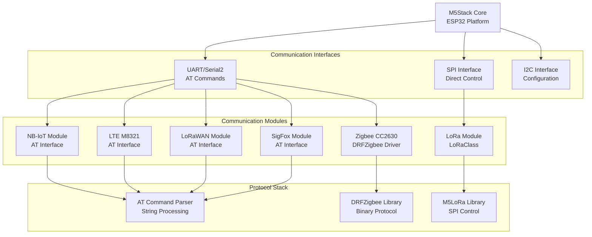
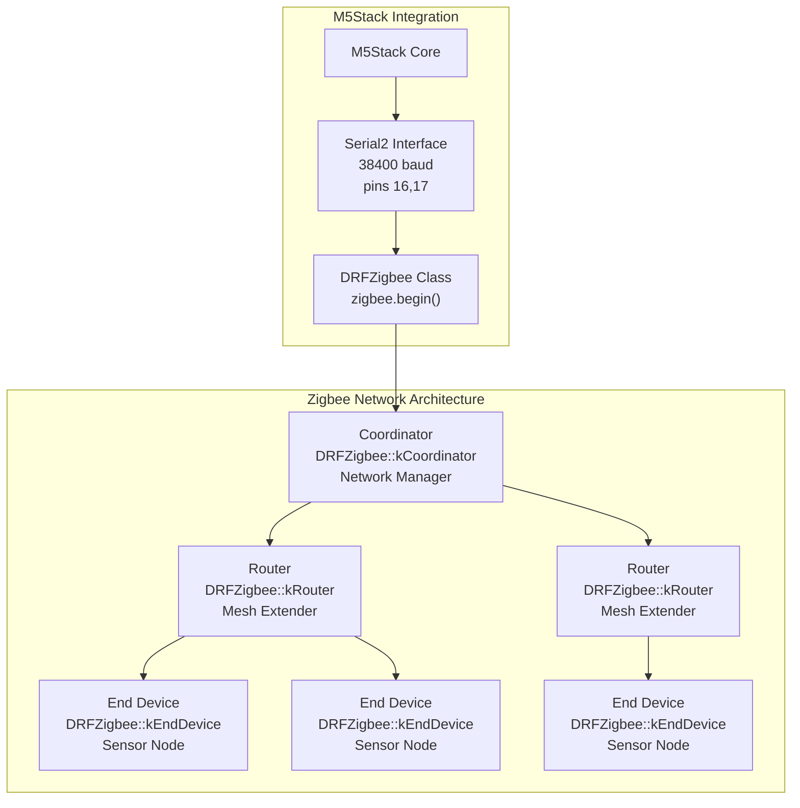
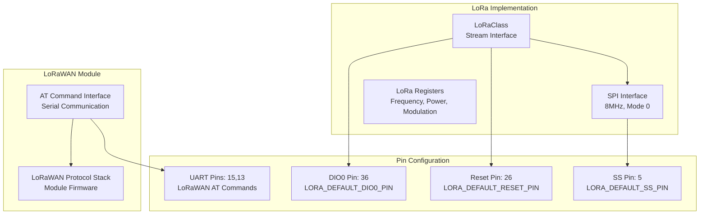
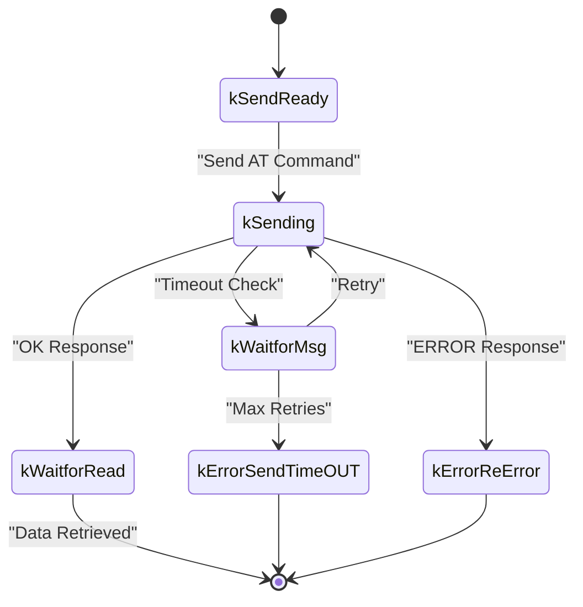
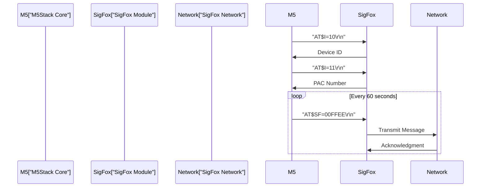

M5Stack Communication Modules

# Communication Modules

Relevant source files

The following files were used as context for generating this wiki page:

- [examples/Modules/BALA2/BALA2.ino](examples/Modules/BALA2/BALA2.ino)
- [examples/Modules/COM_LoRaWAN/LoRaWAN_Receive/LoRaWAN_Receive.ino](examples/Modules/COM_LoRaWAN/LoRaWAN_Receive/LoRaWAN_Receive.ino)
- [examples/Modules/COM_LoRaWAN/LoRaWAN_Send/LoRaWAN_Send.ino](examples/Modules/COM_LoRaWAN/LoRaWAN_Send/LoRaWAN_Send.ino)
- [examples/Modules/COM_NB-IoT/COM_NB-IoT.ino](examples/Modules/COM_NB-IoT/COM_NB-IoT.ino)
- [examples/Modules/COM_SigFox/COM_SigFox.ino](examples/Modules/COM_SigFox/COM_SigFox.ino)
- [examples/Modules/GoPLUS2/GoPLUS2.ino](examples/Modules/GoPLUS2/GoPLUS2.ino)
- [examples/Modules/LTE_M8321/LTE_M8321.ino](examples/Modules/LTE_M8321/LTE_M8321.ino)
- [examples/Unit/COLOR_TCS3472/COLOR_TCS3472.ino](examples/Unit/COLOR_TCS3472/COLOR_TCS3472.ino)
- [examples/Unit/DAC_MCP4725/DAC_MCP4725.ino](examples/Unit/DAC_MCP4725/DAC_MCP4725.ino)
- [examples/Unit/ToF_VL53L0X/ToF_VL53L0X.ino](examples/Unit/ToF_VL53L0X/ToF_VL53L0X.ino)
- [examples/Unit/Zigbee_CC2630/P2P_TEST/P2P_TEST.ino](examples/Unit/Zigbee_CC2630/P2P_TEST/P2P_TEST.ino)
- [examples/Unit/Zigbee_CC2630/RSSI_TEST/RSSI_TEST.ino](examples/Unit/Zigbee_CC2630/RSSI_TEST/RSSI_TEST.ino)

This document covers the M5Stack Communication Modules - larger, complex hardware systems that provide wireless communication capabilities including Zigbee mesh networking, LoRa/LoRaWAN long-range radio, cellular connectivity (NB-IoT, LTE), and specialized radio protocols like SigFox. These modules integrate multiple communication functions and typically use AT command interfaces or dedicated driver libraries.

For basic I/O and simple sensor communication, see [Basic I/O and Interface Units](#4.1). For network connectivity and IoT applications, see [Network and IoT Modules](#5.3).

## Module Architecture Overview

Communication modules in the M5Stack ecosystem provide comprehensive wireless connectivity solutions that extend beyond simple sensor interfaces. Each module integrates radio hardware, protocol stacks, and communication management.

**Sources:** [examples/Unit/Zigbee_CC2630/P2P_TEST/P2P_TEST.ino:76-78](), [examples/Modules/COM_NB-IoT/COM_NB-IoT.ino:284](), [examples/Modules/LTE_M8321/LTE_M8321.ino:280](), [src/M5LoRa.cpp:84]()

## Zigbee Mesh Networking

The Zigbee CC2630 module provides IEEE 802.15.4-based mesh networking with support for Coordinator, Router, and End Device roles. It uses the `DRFZigbee` library for high-level network management.

### Zigbee Network Topology

**Sources:** [examples/Unit/Zigbee_CC2630/P2P_TEST/P2P_TEST.ino:20](), [examples/Unit/Zigbee_CC2630/P2P_TEST/P2P_TEST.ino:76-78](), [examples/Unit/Zigbee_CC2630/P2P_TEST/P2P_TEST.ino:226](), [examples/Unit/Zigbee_CC2630/P2P_TEST/P2P_TEST.ino:260](), [examples/Unit/Zigbee_CC2630/P2P_TEST/P2P_TEST.ino:286]()

### Zigbee Configuration

| Parameter | Function | Code Reference |
|-----------|----------|----------------|
| Device Type | `arg->main_pointType` | `DRFZigbee::kCoordinator`, `DRFZigbee::kRouter`, `DRFZigbee::kEndDevice` |
| PAN ID | `arg->main_PANID` | `DRFZigbee::swap<uint16_t>(0x1617)` |
| Channel | `arg->main_channel` | Channel 20 (2.4GHz band) |
| Transmission Mode | `arg->main_transmissionMode` | `DRFZigbee::kN2Ntransmission` |
| Antenna | `arg->main_ATN` | `DRFZigbee::kANTEXP` |

**Sources:** [examples/Unit/Zigbee_CC2630/P2P_TEST/P2P_TEST.ino:226](), [examples/Unit/Zigbee_CC2630/P2P_TEST/P2P_TEST.ino:261-264](), [examples/Unit/Zigbee_CC2630/P2P_TEST/P2P_TEST.ino:287-288]()

## LoRa Long-Range Communication

The M5Stack LoRa implementation provides both direct LoRa radio control and LoRaWAN protocol support through different interfaces.

### LoRa Module Architecture

**Sources:** [src/M5LoRa.h:17-19](), [src/M5LoRa.cpp:54-65](), [examples/Modules/COM_LoRaWAN/LoRaWAN_Send/LoRaWAN_Send.ino:58]()

### LoRa Configuration Parameters

| Parameter | Method | Description |
|-----------|--------|-------------|
| Frequency | `setFrequency(long frequency)` | Operating frequency in Hz |
| TX Power | `setTxPower(int level)` | Transmission power (2-17 dBm) |
| Spreading Factor | `setSpreadingFactor(int sf)` | SF6-SF12 (6-12) |
| Bandwidth | `setSignalBandwidth(long sbw)` | 7.8kHz - 500kHz |
| Coding Rate | `setCodingRate4(int denominator)` | 4/5 to 4/8 |
| Sync Word | `setSyncWord(int sw)` | Network identifier |

**Sources:** [src/M5LoRa.cpp:327-335](), [src/M5LoRa.cpp:305-325](), [src/M5LoRa.cpp:337-355](), [src/M5LoRa.cpp:357-384](), [src/M5LoRa.cpp:386-397](), [src/M5LoRa.cpp:404-406]()

## Cellular Communication Modules

The M5Stack supports multiple cellular communication standards through dedicated modules using AT command interfaces.

### Cellular Module Comparison

| Module | Technology | Interface | Pins | Baud Rate | Use Case |
|--------|------------|-----------|------|-----------|----------|
| NB-IoT | NB-IoT Cat-M1 | UART | 5, 13 | 115200 | IoT sensors, low power |
| LTE M8321 | 2G/3G/4G LTE | UART | 16, 17 | 115200 | Voice, data, SMS |

**Sources:** [examples/Modules/COM_NB-IoT/COM_NB-IoT.ino:284](), [examples/Modules/LTE_M8321/LTE_M8321.ino:280]()

### AT Command Framework

Both cellular modules use a common AT command processing framework with state machine management:

**Sources:** [examples/Modules/COM_NB-IoT/COM_NB-IoT.ino:39-48](), [examples/Modules/LTE_M8321/LTE_M8321.ino:35-44](), [examples/Modules/COM_NB-IoT/COM_NB-IoT.ino:101-143]()

### NB-IoT Module Features

The NB-IoT module provides low-power cellular connectivity optimized for IoT applications:

- **Signal Quality Monitoring**: `AT+CSQ` command for RSSI measurement
- **Network Registration**: `AT+CREG?` for network status  
- **Operator Selection**: `AT+COPS?` for carrier information
- **Multi-threaded Processing**: FreeRTOS task for AT command handling

**Sources:** [examples/Modules/COM_NB-IoT/COM_NB-IoT.ino:320](), [examples/Modules/COM_NB-IoT/COM_NB-IoT.ino:345](), [examples/Modules/COM_NB-IoT/COM_NB-IoT.ino:354](), [examples/Modules/COM_NB-IoT/COM_NB-IoT.ino:65-148]()

### LTE Module Voice and Data

The LTE M8321 module supports full cellular functionality including voice calls:

- **Multi-band Support**: GSM/GPRS, WCDMA, TD-SCDMA, LTE
- **Signal Strength Analysis**: Technology-specific RSSI calculation
- **SIM Card Detection**: `AT^CARDMODE` for card type identification
- **Voice Call Capability**: `ATD` command for dialing

**Sources:** [examples/Modules/LTE_M8321/LTE_M8321.ino:323-349](), [examples/Modules/LTE_M8321/LTE_M8321.ino:378-434](), [examples/Modules/LTE_M8321/LTE_M8321.ino:352]()

## SigFox LPWAN Communication

The SigFox module provides ultra-low-power wide-area network connectivity for IoT applications requiring minimal data transmission.

### SigFox Communication Pattern

**Sources:** [examples/Modules/COM_SigFox/COM_SigFox.ino:47-68](), [examples/Modules/COM_SigFox/COM_SigFox.ino:71-93](), [examples/Modules/COM_SigFox/COM_SigFox.ino:42-44]()

## Communication Module Integration

All communication modules integrate with the M5Stack core through standardized interfaces and follow common patterns for initialization, configuration, and data handling.

### Common Integration Patterns

| Pattern | Implementation | Examples |
|---------|----------------|----------|
| UART Communication | `Serial2.begin()` with module-specific baud rates | NB-IoT, LTE, LoRaWAN, SigFox |
| AT Command Processing | State machine with timeout and retry logic | Cellular and LoRaWAN modules |
| SPI Direct Control | Register-level access for real-time control | LoRa radio module |
| Binary Protocol | Custom driver libraries for complex protocols | Zigbee mesh networking |

**Sources:** [examples/Modules/COM_NB-IoT/COM_NB-IoT.ino:284](), [examples/Modules/LTE_M8321/LTE_M8321.ino:280](), [src/M5LoRa.cpp:84](), [examples/Unit/Zigbee_CC2630/P2P_TEST/P2P_TEST.ino:76-78]()