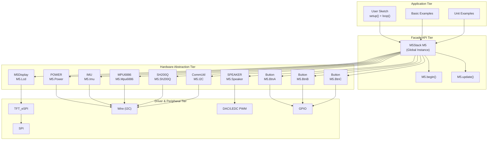
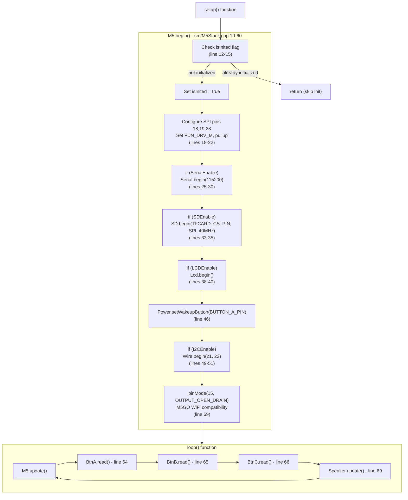
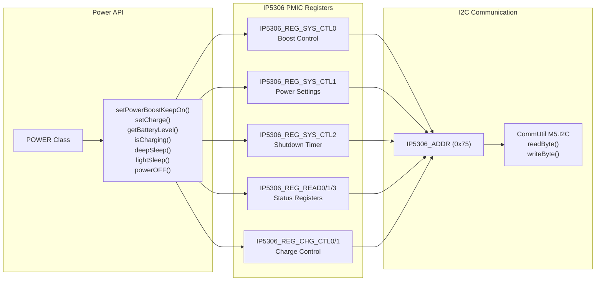

M5Stack Core Library Architecture

# Core Library Architecture

<details>
<summary>Relevant source files</summary>

The following files were used as context for generating this wiki page:

- [.clang-format](.clang-format)
- [.github/ISSUE_TEMPLATE/bug-report.yml](.github/ISSUE_TEMPLATE/bug-report.yml)
- [.github/workflows/Arduino-Lint-Check.yml](.github/workflows/Arduino-Lint-Check.yml)
- [.github/workflows/clang-format-check.yml](.github/workflows/clang-format-check.yml)
- [README.md](README.md)
- [docs/getting_started_cn.md](docs/getting_started_cn.md)
- [docs/getting_started_ja.md](docs/getting_started_ja.md)
- [library.json](library.json)
- [library.properties](library.properties)
- [src/M5Stack.cpp](src/M5Stack.cpp)
- [src/M5Stack.h](src/M5Stack.h)
- [src/gitTagVersion.h](src/gitTagVersion.h)
- [src/utility/Power.cpp](src/utility/Power.cpp)
- [src/utility/Power.h](src/utility/Power.h)

</details>


**⚠️ DEPRECATION NOTICE**: This library (version 0.4.6) is officially deprecated. For new projects, use [M5GFX](https://github.com/m5stack/M5GFX) for graphics and [M5Unified](https://github.com/m5stack/M5Unified) for device control. See page 1 (Overview) for migration information.

This document provides a high-level architectural overview of the M5Stack Core Library, covering the primary system components and their interactions. The library serves as a hardware abstraction layer for M5Stack Basic and Gray devices, built on the ESP32 platform.

For detailed information about specific subsystems, see: [M5Stack Class and Initialization](#2.1), [Display and Graphics System](#2.2), [Power Management](#2.3), [Audio System](#2.4), [IMU and Motion Sensing](#2.5), and [I2C Communication Utilities](#2.6).

Sources: [README.md:1-11](), [library.properties:1-11]()

## System Overview

The M5Stack library implements a **facade pattern** with the `M5Stack` class as the central coordinator. A global instance `M5` provides unified access to all hardware subsystems. The architecture is layered in three tiers: application code interacts with the `M5` object, which delegates to hardware abstraction modules (`M5Display`, `POWER`, `Button`, `SPEAKER`, `IMU`), which in turn use low-level drivers and ESP32 peripherals.

### Three-Tier Architecture Diagram



Sources: [src/M5Stack.h:118-170](), [src/M5Stack.cpp:7-15](), [src/M5Stack.cpp:62-70]()

## M5Stack Class Structure

The `M5Stack` class (defined in [src/M5Stack.h:118-170]()) serves as the primary facade and aggregates all hardware subsystems. A global instance `extern M5Stack M5` ([src/M5Stack.cpp:94]()) provides the main entry point. The class contains public member objects for each subsystem, following a composition pattern.

### M5Stack Class Member Objects and Methods

| Member Object | Type | GPIO/Address | Description |
|---------------|------|--------------|-------------|
| `Lcd` | `M5Display` | SPI (CS:14, DC:27, RST:33) | Display interface extending TFT_eSPI |
| `Power` | `POWER` | I2C 0x75 | IP5306 power management |
| `BtnA` | `Button` | GPIO 39 | Left hardware button |
| `BtnB` | `Button` | GPIO 38 | Middle hardware button |
| `BtnC` | `Button` | GPIO 37 | Right hardware button |
| `Speaker` | `SPEAKER` | GPIO 25 (DAC) | Audio output via DAC/PWM |
| `Imu` | `IMU` | I2C 0x68 | Generic IMU interface |
| `Mpu6886` | `MPU6886` | I2C 0x68 | MPU6886 IMU driver |
| `Sh200Q` | `SH200Q` | I2C 0x6C | SH200Q IMU driver |
| `I2C` | `CommUtil` | I2C (SDA:21, SCL:22) | I2C helper utilities |

**Core Methods:**
- `void begin(bool LCDEnable, bool SDEnable, bool SerialEnable, bool I2CEnable)` - Initialize all subsystems ([src/M5Stack.cpp:10-60]())
- `void update()` - Poll buttons and update speaker state, called in `loop()` ([src/M5Stack.cpp:62-70]())

**Deprecated Methods:** `setPowerBoostKeepOn()`, `setWakeupButton()`, `powerOFF()` redirect to `M5.Power.*` equivalents for backward compatibility ([src/M5Stack.cpp:76-92]())

**Global Aliases:** The library provides lowercase macros for convenience: `m5`, `lcd`, `imu`, etc. ([src/M5Stack.h:173-180]())

### M5Stack Class Composition Diagram

```mermaid
graph LR
    subgraph M5StackClass["M5Stack Class Definition"]
        Constructor["M5Stack()"]
        BeginMethod["begin(LCDEnable, SDEnable,<br/>SerialEnable, I2CEnable)"]
        UpdateMethod["update()"]
        IsInitedFlag["private: bool isInited"]
    end
    
    subgraph PublicMembers["Public Member Objects"]
        LcdMember["M5Display Lcd"]
        PowerMember["POWER Power"]
        BtnAMember["Button BtnA<br/>(BUTTON_A_PIN=39)"]
        BtnBMember["Button BtnB<br/>(BUTTON_B_PIN=38)"]
        BtnCMember["Button BtnC<br/>(BUTTON_C_PIN=37)"]
        SpeakerMember["SPEAKER Speaker"]
        ImuMember["IMU Imu"]
        I2CMember["CommUtil I2C"]
        Mpu6886Member["MPU6886 Mpu6886"]
        Sh200QMember["SH200Q Sh200Q"]
    end
    
    subgraph GlobalInstance["Global Singleton"]
        ExternM5["extern M5Stack M5"]
    end
    
    M5StackClass --> PublicMembers
    ExternM5 --> M5StackClass
```



Sources: [src/M5Stack.h:118-170](), [src/M5Stack.h:172-184](), [src/M5Stack.cpp:7-15](), [src/M5Stack.cpp:94]()

## Hardware Abstraction Layers

The M5Stack library implements a clear separation between high-level APIs and low-level hardware drivers. Each major subsystem provides its own abstraction layer that handles hardware-specific details.

### Hardware Abstraction Stack

| Layer | Components | Purpose |
|-------|------------|---------|
| **Application API** | `M5.Lcd`, `M5.Power`, `M5.BtnA/B/C` | User-friendly interface methods |
| **Subsystem Classes** | `M5Display`, `POWER`, `Button`, `SPEAKER` | Hardware abstraction and state management |
| **Driver Layer** | `TFT_eSPI`, `IP5306`, `MPU6886`, `SH200Q` | Hardware-specific communication protocols |
| **Communication** | `I2C`, `SPI`, `GPIO` | Low-level protocol implementation |
| **Hardware** | ESP32, ILI9341 LCD, IP5306 PMIC, IMU sensors | Physical devices |

Sources: [src/M5Stack.h:101-117](), [src/utility/Power.h:18-76]()

## Initialization and Startup Sequence

The `M5.begin()` method ([src/M5Stack.cpp:10-60]()) initializes hardware subsystems in a specific order. It uses a flag `isInited` to prevent double initialization. The method accepts four boolean parameters to selectively enable subsystems.

### begin() Method Signature and Defaults

```cpp
void M5Stack::begin(bool LCDEnable = true, 
                    bool SDEnable = true, 
                    bool SerialEnable = true, 
                    bool I2CEnable = false)
```

**Default Behavior:** LCD, SD card, and Serial are enabled by default. I2C must be explicitly enabled (typically required for IMU and power management features).

### Initialization Sequence Diagram



**Key Initialization Steps:**
1. **SPI GPIO Configuration** ([src/M5Stack.cpp:18-22]()): Pins 18, 19, 23 set to high drive strength with pullups for reliable SPI communication
2. **Serial Port** ([src/M5Stack.cpp:25-30]()): 115200 baud UART0 for debugging
3. **SD Card** ([src/M5Stack.cpp:33-35]()): TFCARD_CS_PIN chip select, 40MHz SPI clock
4. **LCD Display** ([src/M5Stack.cpp:38-40]()): Initializes M5Display and underlying TFT_eSPI driver
5. **Power Wakeup** ([src/M5Stack.cpp:46]()): Sets Button A (GPIO 39) as deep sleep wakeup source
6. **I2C Bus** ([src/M5Stack.cpp:49-51]()): SDA=21, SCL=22 for IMU and IP5306 communication
7. **GPIO 15 Open-Drain** ([src/M5Stack.cpp:59]()): Prevents interference with M5GO accessories

Sources: [src/M5Stack.cpp:10-60](), [src/M5Stack.cpp:62-70]()

## Power Management Integration

The power management system is built around the IP5306 Power Management IC (PMIC), which provides battery charging, power boost control, and low-power sleep modes. The `POWER` class abstracts all IP5306 operations through I2C communication.

### Power System Architecture



Sources: [src/utility/Power.h:18-76](), [src/utility/Power.cpp:27-82]()

## Compatibility and Legacy Support

The M5Stack library maintains backward compatibility through deprecated method stubs and global aliases. Legacy power management methods in the main `M5Stack` class redirect to the newer `POWER` class implementation.

### Backward Compatibility Methods

| Deprecated Method | New Implementation | Location |
|-------------------|-------------------|----------|
| `M5.setPowerBoostKeepOn()` | `M5.Power.setPowerBoostKeepOn()` | [src/M5Stack.cpp:76-78]() |
| `M5.setWakeupButton()` | `M5.Power.setWakeupButton()` | [src/M5Stack.cpp:83-85]() |
| `M5.powerOFF()` | `M5.Power.deepSleep()` | [src/M5Stack.cpp:90-92]() |

The library also provides lowercase aliases for convenience: `m5`, `lcd`, `imu`, etc. are all mapped to their respective capitalized versions through preprocessor definitions.

Sources: [src/M5Stack.h:164-184](), [src/M5Stack.cpp:72-93]()