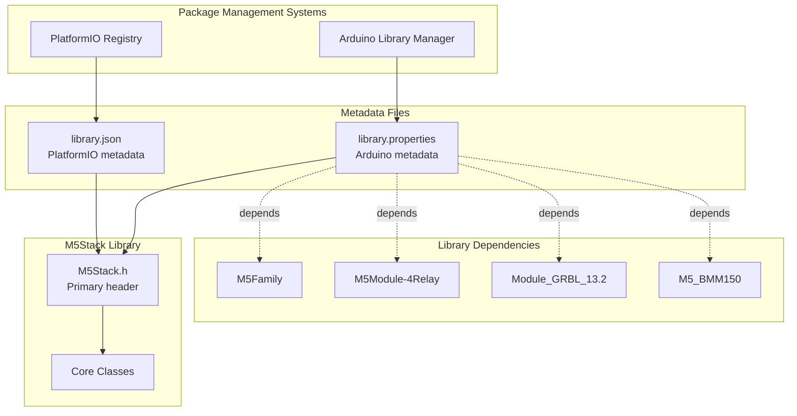
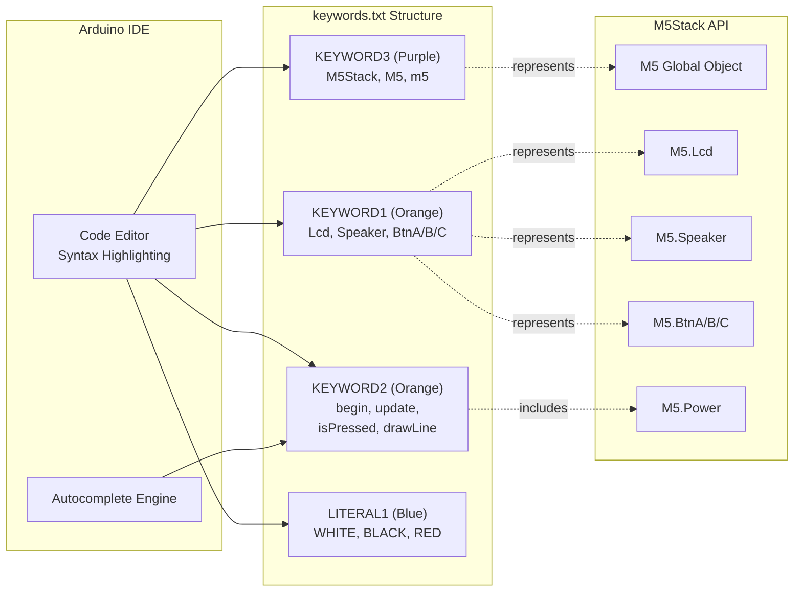
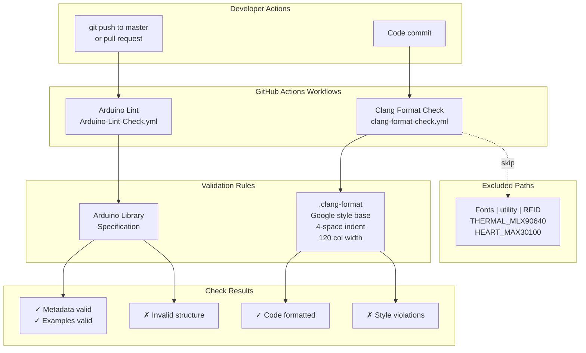
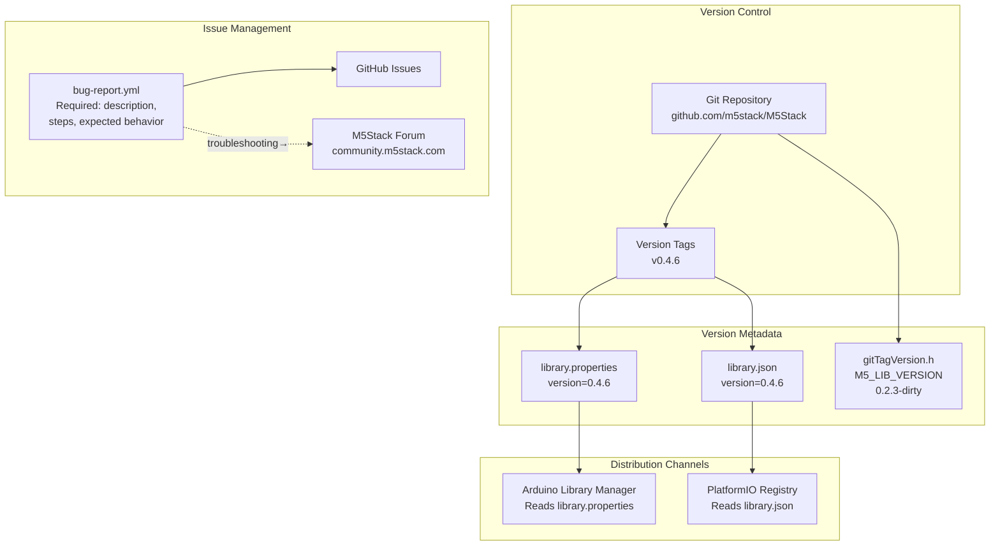

M5Stack Development Reference

# Development Reference

<details>
<summary>Relevant source files</summary>

The following files were used as context for generating this wiki page:

- [.clang-format](.clang-format)
- [.github/ISSUE_TEMPLATE/bug-report.yml](.github/ISSUE_TEMPLATE/bug-report.yml)
- [.github/workflows/Arduino-Lint-Check.yml](.github/workflows/Arduino-Lint-Check.yml)
- [.github/workflows/clang-format-check.yml](.github/workflows/clang-format-check.yml)
- [README.md](README.md)
- [docs/getting_started_cn.md](docs/getting_started_cn.md)
- [docs/getting_started_ja.md](docs/getting_started_ja.md)
- [keywords.txt](keywords.txt)
- [library.json](library.json)
- [library.properties](library.properties)
- [src/gitTagVersion.h](src/gitTagVersion.h)

</details>


This document provides reference materials for developers working with or contributing to the M5Stack library. It covers library metadata and configuration, API documentation conventions, build system integration, continuous integration workflows, and version management practices.

**Note:** This library is officially deprecated. New development should use M5GFX (<https://github.com/m5stack/M5GFX>) for graphics and M5Unified (<https://github.com/m5stack/M5Unified>) for device control. See [Overview](#1) for migration guidance.

For information about using the library's API in applications, see [Core Library Architecture](#2) and [Getting Started](#3).

## Library Metadata and Package Configuration

The M5Stack library uses two primary metadata files to define package information for Arduino Library Manager and PlatformIO package management systems.

### Arduino Library Manager Configuration

The [library.properties:1-11]() file defines the library package for Arduino IDE and Arduino CLI:

| Property | Value | Purpose |
|----------|-------|---------|
| `name` | M5Stack | Package identifier in Arduino Library Manager |
| `version` | 0.4.6 | Semantic version number |
| `architectures` | esp32 | Restricts compilation to ESP32 platform |
| `includes` | M5Stack.h | Primary header for auto-include detection |
| `depends` | M5Family, M5Module-4Relay, Module_GRBL_13.2, M5_BMM150 | Required library dependencies |
| `category` | Device Control | Arduino Library Manager category |

The `depends` field [library.properties:11]() specifies four external dependencies that must be installed for full functionality:
- **M5Family**: Shared components for M5Stack product family
- **M5Module-4Relay**: Support for 4-relay module hardware
- **Module_GRBL_13.2**: GRBL CNC controller integration
- **M5_BMM150**: BMM150 magnetometer sensor driver

### PlatformIO Package Configuration

The [library.json:1-17]() file provides equivalent metadata for PlatformIO:

```
{
  "name": "M5Stack",
  "version": "0.4.6",
  "frameworks": "arduino",
  "platforms": "espressif32",
  "headers": "M5Stack.h"
}
```

This configuration targets the ESP32 platform via the `espressif32` platform identifier and Arduino framework.



**Library Metadata and Dependency Structure**

Sources: [library.properties:1-11](), [library.json:1-17]()

## API Documentation and IDE Integration

### Syntax Highlighting Keywords

The [keywords.txt:1-85]() file defines syntax highlighting rules for the Arduino IDE and compatible editors. Keywords are categorized into four classes:

| Keyword Class | Arduino Color | Usage |
|--------------|---------------|-------|
| `KEYWORD1` | Orange | Data types and objects (Lcd, Speaker, BtnA, BtnB, BtnC) |
| `KEYWORD2` | Orange | Methods and functions (begin, update, isPressed, etc.) |
| `KEYWORD3` | Purple | Library names (M5Stack, M5, m5) |
| `LITERAL1` | Blue | Constants (WHITE, BLACK, RED, GREEN, BLUE, etc.) |

**Key Classes** (KEYWORD1) [keywords.txt:17-21]():
- `Lcd`: Display interface via M5.Lcd
- `Speaker`: Audio output via M5.Speaker  
- `BtnA`, `BtnB`, `BtnC`: Hardware button interfaces

**Core Methods** (KEYWORD2) [keywords.txt:27-76]():
- Initialization: `begin`, `update`
- Button state: `isPressed`, `wasPressed`, `pressedFor`, `isReleased`, `wasReleased`, `releasedFor`, `held`, `repeat`, `timeHeld`
- Display operations: `fillScreen`, `drawPixel`, `drawLine`, `drawRect`, `drawCircle`, `drawTriangle`, `setTextColor`, `setFont`
- Power management: `Power` (accessor method)

**Color Constants** (LITERAL1) [keywords.txt:78-84]():
- Basic colors: `WHITE`, `BLACK`, `GRAY`, `RED`, `GREEN`, `BLUE`
- Special modes: `INVERT`



**IDE Integration via keywords.txt**

Sources: [keywords.txt:1-85]()

## Continuous Integration and Code Quality

The repository implements two automated CI/CD workflows using GitHub Actions to maintain code quality standards.

### Arduino Lint Workflow

The [.github/workflows/Arduino-Lint-Check.yml:1-17]() workflow validates library structure and metadata:

- **Trigger**: Push to master branch or pull requests
- **Compliance level**: `strict` [.github/workflows/Arduino-Lint-Check.yml:16]()
- **Validation**: Checks library.properties format, example sketch structure, and Arduino Library Specification compliance
- **Update policy**: `update` for library-manager [.github/workflows/Arduino-Lint-Check.yml:15]()

### Clang Format Workflow

The [.github/workflows/clang-format-check.yml:1-24]() workflow enforces code formatting standards:

- **Formatter**: clang-format version 13 [.github/workflows/clang-format-check.yml:21]()
- **Style base**: Google style with custom overrides (see [.clang-format:1-168]())
- **Check path**: Root directory `./` [.github/workflows/clang-format-check.yml:10]()
- **Exclusions**: Fonts, utility libraries, third-party modules [.github/workflows/clang-format-check.yml:11]()

**Key formatting rules** from [.clang-format:1-168]():
- Line width: 120 columns [.clang-format:53]()
- Indent width: 4 spaces [.clang-format:88]()
- Brace style: Custom with functions on new line [.clang-format:32]()
- Pointer alignment: Left (`int* ptr`) [.clang-format:109]()
- Include sorting: Disabled to preserve manual ordering [.clang-format:139]()



**CI/CD Workflow Architecture**

Sources: [.github/workflows/Arduino-Lint-Check.yml:1-17](), [.github/workflows/clang-format-check.yml:1-24](), [.clang-format:1-168]()

### Code Formatting Configuration

The `.clang-format` file [.clang-format:1-168]() defines detailed C++ formatting rules based on Google style:

| Category | Setting | Value |
|----------|---------|-------|
| Base style | BasedOnStyle | Google |
| Column limit | ColumnLimit | 120 |
| Indentation | IndentWidth | 4 spaces |
| Brace wrapping | AfterFunction | true (new line) |
| Pointer style | PointerAlignment | Left |
| Include blocks | SortIncludes | false (manual order) |
| Line endings | UseCRLF | false (Unix LF) |
| Alignment | AlignConsecutiveMacros | true |
| Alignment | AlignConsecutiveAssignments | true |

**Special formatting rules**:
- Functions break after return type [.clang-format:32]()
- Constructor initializers use before-colon style [.clang-format:50]()
- Short blocks never on single line [.clang-format:15]()
- Template declarations always break [.clang-format:24]()

## Version Management

### Version Tracking

The library version is maintained in three locations for consistency:

1. **library.properties**: `version=0.4.6` [library.properties:2]()
2. **library.json**: `"version": "0.4.6"` [library.json:13]()
3. **gitTagVersion.h**: `#define M5_LIB_VERSION F("0.2.3-dirty")` [src/gitTagVersion.h:1]()

Note: The gitTagVersion.h file shows version `0.2.3-dirty`, which appears outdated relative to the package metadata version `0.4.6`. This discrepancy suggests the gitTagVersion.h file may be auto-generated or manually maintained separately.

### Semantic Versioning

The library follows semantic versioning (MAJOR.MINOR.PATCH):
- Current version: **0.4.6** indicates pre-1.0 development status
- MAJOR version 0: API not yet stable, breaking changes possible
- Version history available via Git tags

## Bug Reporting and Issue Templates

The repository provides a structured bug report template at [.github/ISSUE_TEMPLATE/bug-report.yml:1-86]() to guide users in submitting complete issue reports. The template enforces:

**Required fields** [.github/ISSUE_TEMPLATE/bug-report.yml:20-45]():
- Bug description
- Reproduction steps
- Expected behavior

**Optional context** [.github/ISSUE_TEMPLATE/bug-report.yml:54-75]():
- Screenshots
- Environment details (OS, IDE version, library version)
- Additional context

**Pre-submission checklist** [.github/ISSUE_TEMPLATE/bug-report.yml:77-85]():
- Searched existing issues
- Report contains necessary details

The template header [.github/ISSUE_TEMPLATE/bug-report.yml:11-19]() directs users to:
- Use community forum (https://community.m5stack.com) for troubleshooting, not GitHub issues
- Submit UIFLOW questions to forum UIFLOW section
- Limit issues to Arduino/PlatformIO problems on Gray, Fire, and Basic products



**Version Management and Issue Tracking Architecture**

Sources: [library.properties:2](), [library.json:13](), [src/gitTagVersion.h:1](), [.github/ISSUE_TEMPLATE/bug-report.yml:1-86]()

## Documentation Resources

The repository includes multilingual documentation in the `docs/` directory:

- **English**: [README.md:1-118]() (root level)
- **Chinese**: [docs/getting_started_cn.md:1-35]()
- **Japanese**: [docs/getting_started_ja.md:1-142]()

Each localized README provides:
- Hardware specification references
- Pin mapping diagrams (M-BUS connections)
- Quick start guides for UIFlow, MicroPython, and Arduino IDE
- Links to official M5Stack documentation site
- Example applications and use cases

The Chinese documentation [docs/getting_started_cn.md:9-11]() and Japanese documentation [docs/getting_started_ja.md:32-34]() provide direct links to hardware specifications and pin maps on the official M5Stack docs site (https://docs.m5stack.com).

## Development Workflow Summary

To develop or contribute to the M5Stack library:

1. **Clone repository**: `git clone https://github.com/m5stack/M5Stack`
2. **Install dependencies**: Ensure M5Family, M5Module-4Relay, Module_GRBL_13.2, and M5_BMM150 libraries are installed
3. **Format code**: Apply `.clang-format` rules before committing (clang-format version 13)
4. **Validate**: Ensure Arduino Lint passes with strict compliance
5. **Update version**: Modify version numbers in both library.properties and library.json for releases
6. **Submit PR**: Pull requests trigger automated lint and format checks

**Platform requirements**:
- Architecture: ESP32 only [library.properties:9]()
- Framework: Arduino [library.json:14]()
- Platform: espressif32 [library.json:15]()

Sources: [library.properties:1-11](), [library.json:1-17](), [.clang-format:1-168](), [.github/workflows/Arduino-Lint-Check.yml:1-17](), [.github/workflows/clang-format-check.yml:1-24]()