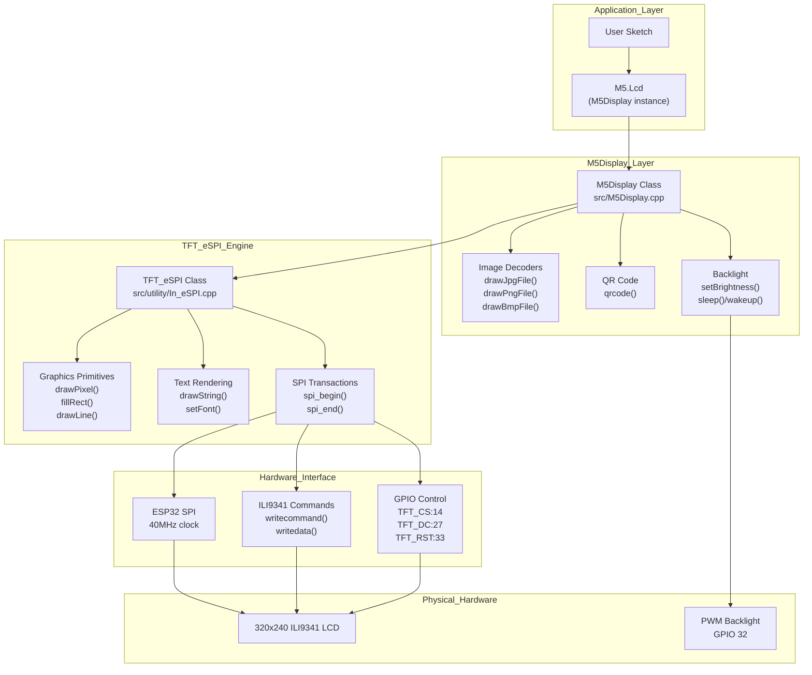
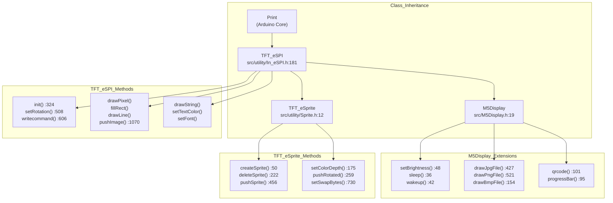
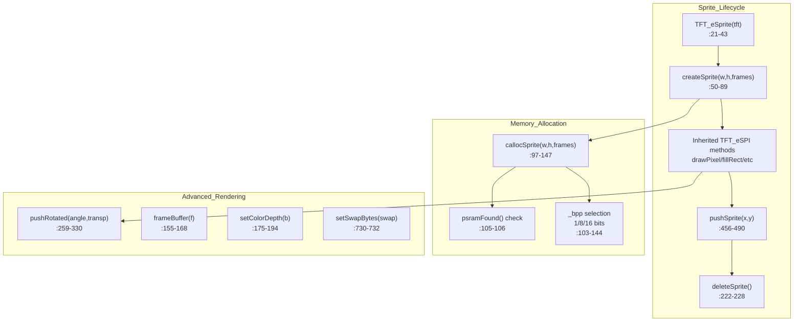
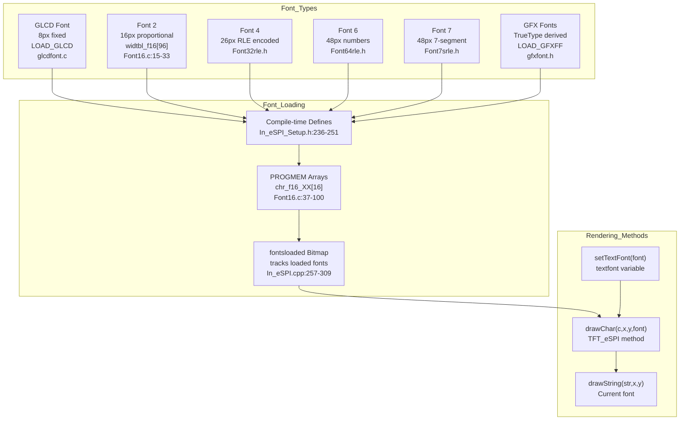
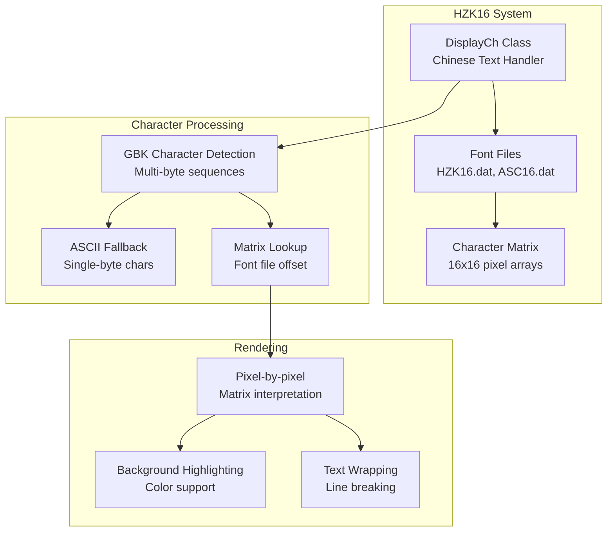
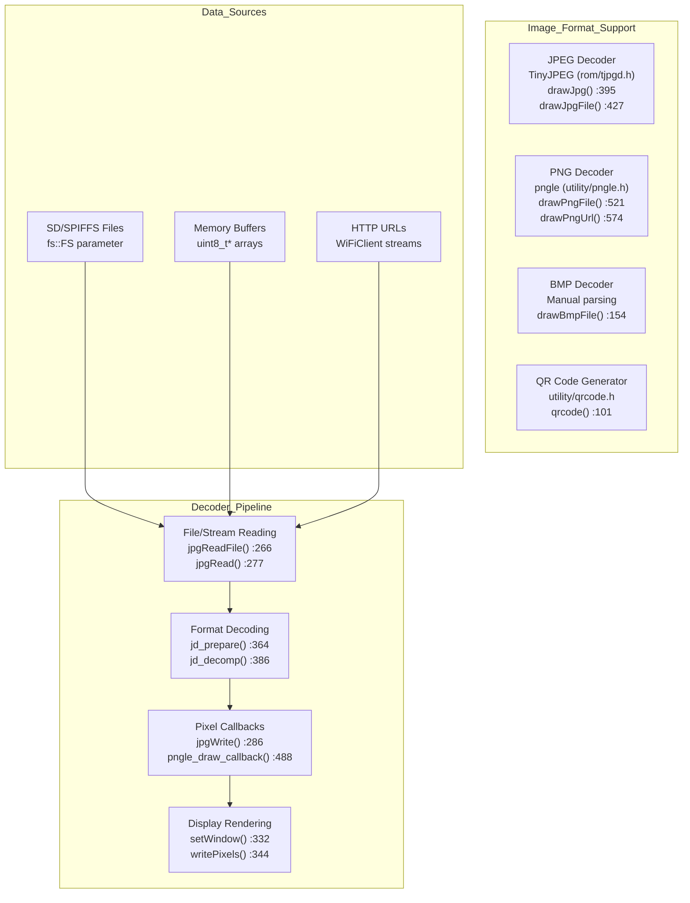

M5Stack Display and Graphics System

# Display and Graphics System

<details>
<summary>Relevant source files</summary>

The following files were used as context for generating this wiki page:

- [examples/Modules/BaseX/BaseX.cpp](examples/Modules/BaseX/BaseX.cpp)
- [examples/Modules/BaseX/BaseX.h](examples/Modules/BaseX/BaseX.h)
- [examples/Modules/BaseX/BaseX.ino](examples/Modules/BaseX/BaseX.ino)
- [src/Fonts/Font16.c](src/Fonts/Font16.c)
- [src/Fonts/Font7srle.c](src/Fonts/Font7srle.c)
- [src/M5Display.cpp](src/M5Display.cpp)
- [src/M5Display.h](src/M5Display.h)
- [src/M5Faces.cpp](src/M5Faces.cpp)
- [src/M5Faces.h](src/M5Faces.h)
- [src/rom/miniz.h](src/rom/miniz.h)
- [src/utility/CommUtil.cpp](src/utility/CommUtil.cpp)
- [src/utility/CommUtil.h](src/utility/CommUtil.h)
- [src/utility/ILI9341_Defines.h](src/utility/ILI9341_Defines.h)
- [src/utility/ILI9341_Init.h](src/utility/ILI9341_Init.h)
- [src/utility/ILI9341_Rotation.h](src/utility/ILI9341_Rotation.h)
- [src/utility/In_eSPI.cpp](src/utility/In_eSPI.cpp)
- [src/utility/In_eSPI.h](src/utility/In_eSPI.h)
- [src/utility/In_eSPI_Setup.h](src/utility/In_eSPI_Setup.h)
- [src/utility/MPU9250.cpp](src/utility/MPU9250.cpp)
- [src/utility/MPU9250.h](src/utility/MPU9250.h)
- [src/utility/Speaker.cpp](src/utility/Speaker.cpp)
- [src/utility/Speaker.h](src/utility/Speaker.h)
- [src/utility/Sprite.cpp](src/utility/Sprite.cpp)
- [src/utility/Sprite.h](src/utility/Sprite.h)
- [src/utility/pngle.c](src/utility/pngle.c)
- [src/utility/pngle.h](src/utility/pngle.h)

</details>


The Display and Graphics System provides comprehensive 2D graphics rendering, text display, and image processing capabilities for M5Stack devices. This system manages the 320x240 ILI9341 LCD panel, handles multiple font formats including Unicode support, provides off-screen rendering through sprites, and enables image display from various sources.

For power management of the display backlight, see [Power Management](#2.3). For higher-level M5Stack device initialization that includes display setup, see [M5Stack Class and Initialization](#2.1).

## Architecture Overview

The graphics system is built on a layered architecture that abstracts hardware communication while providing rich graphics capabilities. The `M5Display` class extends `TFT_eSPI` with M5Stack-specific features including brightness control, image decoders, and QR code generation.

### System Architecture Diagram



Sources: [src/M5Display.h:1-115](), [src/M5Display.cpp:1-661](), [src/utility/In_eSPI.h:180-310](), [src/utility/In_eSPI.cpp:180-560]()

### Class Hierarchy and Inheritance



Sources: [src/M5Display.h:19-115](), [src/utility/In_eSPI.h:181-310](), [src/utility/Sprite.h:12-162](), [src/M5Display.cpp:12-661](), [src/utility/In_eSPI.cpp:181-600](), [src/utility/Sprite.cpp:21-900]()

## Core Components

### TFT_eSPI Graphics Engine

The `TFT_eSPI` class [src/utility/In_eSPI.h:181]() serves as the foundation of the graphics system, providing comprehensive 2D graphics primitives and hardware abstraction.

| Component | File Location | Line Numbers | Key Functions |
|-----------|---------------|--------------|---------------|
| Core Engine | src/utility/In_eSPI.cpp | 181-561 | `TFT_eSPI()`, `begin()`, `init()` |
| SPI Transactions | src/utility/In_eSPI.cpp | 53-131 | `spi_begin()`, `spi_end()`, `spi_begin_read()` |
| Command/Data | src/utility/In_eSPI.cpp | 606-632 | `writecommand()`, `writedata()` |
| ILI9341 Init | src/utility/ILI9341_Init.h | 9-125 | Initialization sequence |
| Rotation | src/utility/ILI9341_Rotation.h | 4-82 | Screen orientation configuration |
| Pin Setup | src/utility/In_eSPI_Setup.h | 187-195 | GPIO pin assignments |

**SPI Transaction Management:**

The library uses transaction-based SPI for thread safety with ESP32's `beginTransaction()` and `endTransaction()`:
- `spi_begin()` [src/utility/In_eSPI.cpp:53-68]() - Acquires SPI bus, sets CS low
- `spi_end()` [src/utility/In_eSPI.cpp:70-88]() - Releases SPI bus, sets CS high
- Configurable SPI frequency up to 40MHz via `SPI_FREQUENCY` [src/utility/In_eSPI_Setup.h:275]()

**Color Format Support:**
- 16-bit RGB565 (default): 5 bits red, 6 bits green, 5 bits blue
- 8-bit RGB332: 3 bits red, 3 bits green, 2 bits blue
- 1-bit monochrome for memory-efficient sprites

**Display Rotation:**

The `setRotation(m)` function [src/utility/In_eSPI.cpp:508-560]() supports 8 rotation modes (0-7), where:
- Modes 0-3: Standard rotations (0°, 90°, 180°, 270°)
- Modes 4-7: Mirrored rotations
- Width and height swap automatically for 90° and 270° rotations

Sources: [src/utility/In_eSPI.cpp:53-632](), [src/utility/In_eSPI.h:181-310](), [src/utility/ILI9341_Init.h:9-125](), [src/utility/ILI9341_Rotation.h:4-82](), [src/utility/In_eSPI_Setup.h:187-195]()

### Sprite System (Off-screen Rendering)

The `TFT_eSprite` class [src/utility/Sprite.h:12]() provides memory-based canvas functionality for complex graphics operations and smooth animations.



**Key Sprite Functions with Line Numbers:**

| Function | Location | Description |
|----------|----------|-------------|
| `TFT_eSprite(TFT_eSPI *tft)` | [src/utility/Sprite.cpp:21-43]() | Constructor, stores pointer to parent TFT |
| `createSprite(w, h, frames)` | [src/utility/Sprite.cpp:50-89]() | Allocates sprite memory, returns pointer |
| `callocSprite(w, h, frames)` | [src/utility/Sprite.cpp:97-147]() | Internal memory allocation with PSRAM support |
| `setColorDepth(bits)` | [src/utility/Sprite.cpp:175-194]() | Sets 1/8/16 bit color depth |
| `pushSprite(x, y)` | [src/utility/Sprite.cpp:456-468]() | Renders sprite to display |
| `pushSprite(x, y, transp)` | [src/utility/Sprite.cpp:475-490]() | Renders with transparency |
| `pushRotated(angle, transp)` | [src/utility/Sprite.cpp:259-330]() | Renders with rotation around pivot |
| `deleteSprite()` | [src/utility/Sprite.cpp:222-228]() | Frees allocated memory |

**Memory Management Details:**

The sprite system automatically selects between main RAM and PSRAM:
- For ESP32 with PSRAM: Uses `ps_calloc()` [src/utility/Sprite.cpp:106]() for large sprites
- Without PSRAM: Uses standard `calloc()` [src/utility/Sprite.cpp:109]()
- Memory size calculation varies by color depth:
  - 16-bit: `w * h * 2` bytes [src/utility/Sprite.cpp:109]()
  - 8-bit: `w * h` bytes [src/utility/Sprite.cpp:118]()
  - 1-bit: `((w+7)/8) * h` bytes [src/utility/Sprite.cpp:128-143]()

**Rotation Feature:**

The `pushRotated(angle, transp)` function [src/utility/Sprite.cpp:259-330]() provides real-time rotation:
- Uses sine/cosine lookup for rotation matrix [src/utility/Sprite.cpp:263-265]()
- Calculates bounding box via `getRotatedBounds()` [src/utility/Sprite.cpp:275-276]()
- Supports transparent color for masked rendering [src/utility/Sprite.cpp:318-319]()
- Can rotate to display or to another sprite [src/utility/Sprite.cpp:336-404]()

Sources: [src/utility/Sprite.cpp:21-450](), [src/utility/Sprite.h:12-162]()

### Font System Architecture

The display system supports multiple font formats and character encodings for international text display.



**Built-in Font Specifications:**

| Font ID | Macro | Height | Character Set | Width Table | Data Structure |
|---------|-------|--------|---------------|-------------|----------------|
| 1 (GLCD) | LOAD_GLCD | 8px | ASCII 32-127 | Fixed 6px | [src/Fonts/glcdfont.c]() |
| 2 | LOAD_FONT2 | 16px | ASCII 32-127 | [src/Fonts/Font16.c:15-33]() | `chr_f16_XX[16]` per char |
| 4 | LOAD_FONT4 | 26px | ASCII 32-127 | RLE encoded | [src/Fonts/Font32rle.h]() |
| 6 | LOAD_FONT6 | 48px | Digits 0-9, :-.apm | RLE encoded | [src/Fonts/Font64rle.h]() |
| 7 | LOAD_FONT7 | 48px | Digits 0-9, :-. | RLE encoded | [src/Fonts/Font7srle.h]() |
| 8 | LOAD_FONT8 | 75px | Digits 0-9, :-. | RLE encoded | [src/Fonts/Font72rle.h]() |

**Font Loading Configuration:**

Fonts are enabled at compile time in [src/utility/In_eSPI_Setup.h:236-251]():
```cpp
#define LOAD_GLCD   // Font 1 - Original Adafruit 8px
#define LOAD_FONT2  // Font 2 - 16px proportional  
#define LOAD_FONT4  // Font 4 - 26px RLE
#define LOAD_FONT6  // Font 6 - 48px large numbers
#define LOAD_FONT7  // Font 7 - 48px 7-segment
#define LOAD_FONT8  // Font 8 - 75px large numbers
#define LOAD_GFXFF  // GFX Free Fonts
```

The `fontsloaded` bitmap [src/utility/In_eSPI.cpp:279-309]() tracks which fonts are available:
```cpp
#ifdef LOAD_GLCD
    fontsloaded = 0x0002;  // Bit 1 set
#endif
#ifdef LOAD_FONT2
    fontsloaded |= 0x0004;  // Bit 2 set
#endif
// ... etc
```

**Font 2 Character Storage:**

Font 2 [src/Fonts/Font16.c]() uses a proportional width table and per-character bitmap arrays:

- Width table `widtbl_f16[96]` [src/Fonts/Font16.c:15-33](): One byte per character
- Character bitmaps `chr_f16_XX[16]`: 16 bytes (rows) per character
- Row format: MSB = leftmost pixel
- Example space character `chr_f16_20[16]` [src/Fonts/Font16.c:37-41](): All zeros

**RLE (Run-Length Encoded) Fonts:**

Fonts 4, 6, 7, 8 use RLE compression to reduce FLASH usage:
- Encodes runs of consecutive pixels
- Requires `LOAD_RLE` flag [src/utility/In_eSPI.h:71-85]()
- Decoded during rendering for efficiency

**GFX Free Fonts:**

The `LOAD_GFXFF` option [src/utility/In_eSPI_Setup.h:250-251]() enables Adafruit GFX font format:
- TrueType-derived fonts in multiple sizes
- Includes 48 fonts: FreeMono, FreeSans, FreeSerif families
- Custom fonts: Orbitron, Roboto, Satisfy, Yellowtail
- Defined in [src/utility/In_eSPI.h:495-575]()

Sources: [src/Fonts/Font16.c:1-100](), [src/utility/In_eSPI_Setup.h:236-251](), [src/utility/In_eSPI.cpp:279-309](), [src/utility/In_eSPI.h:61-575]()

### Chinese Text Support (HZK16)

The `DisplayCh` class extends the graphics system with Chinese character support using HZK16 and ASC16 font files.



**HZK16 Usage Example:**
```cpp
DisplayCh display;
display.loadHzk16(InternalHzk16);  // or ExternalHzk16 for SD card
display.setTextColor(WHITE);
display.writeHzk("你好世界");  // "Hello World" in Chinese
```

Sources: [examples/Advanced/Display/HZK16/display_ch.h:1-77](), [examples/Advanced/Display/HZK16/display_ch.cpp:150-400]()

## Hardware Interface

### Display Configuration

The M5Stack uses an ILI9341-compatible 320x240 LCD panel with specific pin assignments optimized for the ESP32 platform.

| Signal | M5Stack Pin | Function |
|--------|-------------|----------|
| TFT_MISO | GPIO 19 | SPI Data Input |
| TFT_MOSI | GPIO 23 | SPI Data Output |
| TFT_SCLK | GPIO 18 | SPI Clock |
| TFT_CS | GPIO 14 | Chip Select |
| TFT_DC | GPIO 27 | Data/Command |
| TFT_RST | GPIO 33 | Reset |
| TFT_BL | GPIO 32 | Backlight Control |

**SPI Configuration:**
- Frequency: 40MHz (configurable up to 80MHz)
- Mode: SPI_MODE0 for most displays, SPI_MODE3 for ST7789
- Transaction support for thread safety
- Hardware CS control available

Sources: [src/utility/In_eSPI_Setup.h:187-195](), [src/utility/ILI9341_Defines.h:1-153]()

### Initialization Sequence

The display initialization follows a precise sequence to configure the ILI9341 controller.

```mermaid
graph TD
    subgraph "Hardware_Setup"
        Constructor["TFT_eSPI()<br/>:181-310"]
        PinInit["GPIO Pin Setup<br/>CS/DC/RST OUTPUT<br/>:185-213"]
        ParallelLUT["Parallel Mode LUT<br/>xset_mask[256]<br/>:219-229"]
    end
    
    subgraph "SPI_Initialization"
        SPIBegin["spi.begin()<br/>:350-358"]
        SPIFreq["Set SPI Frequency<br/>SPI_FREQUENCY 40MHz<br/>:370"]
        Transactions["Enable Transactions<br/>locked=true<br/>:362-363"]
    end
    
    subgraph "Display_Reset"
        M5VersionCheck["M5Stack LCD Version<br/>pinMode INPUT_PULLDOWN<br/>:400-405"]
        HardwareReset["Hardware Reset Pulse<br/>RST LOW 20ms<br/>:407-411"]
        SoftwareReset["ILI9341_SWRST<br/>Alternative reset<br/>:413-415"]
        ResetDelay["Wait 150ms<br/>:420"]
    end
    
    subgraph "ILI9341_Commands"
        PowerConfig["Power Control<br/>PWCTR1/2, VMCTR1/2<br/>ILI9341_Init.h:45-56"]
        MemoryAccess["MADCTL Config<br/>Rotation & color order<br/>:59-64"]
        PixelFormat["PIXFMT 16-bit RGB565<br/>:66-67"]
        FrameRate["Frame Rate 100Hz<br/>FRMCTR1<br/>:69-71"]
        DisplayFunc["Display Function<br/>DFUNCTR<br/>:73-76"]
    end
    
    subgraph "Final_Config"
        SleepOut["Exit Sleep<br/>SLPOUT<br/>:78"]
        DisplayOn["Display On<br/>DISPON<br/>:80"]
        SetRotation["setRotation(1)<br/>Landscape mode<br/>:489"]
        BacklightOn["Backlight PWM<br/>ledcAttach/Write<br/>M5Display.cpp:22-28"]
    end
    
    Constructor --> PinInit
    PinInit --> ParallelLUT
    ParallelLUT --> SPIBegin
    SPIBegin --> SPIFreq
    SPIFreq --> Transactions
    Transactions --> M5VersionCheck
    M5VersionCheck --> HardwareReset
    HardwareReset --> SoftwareReset
    SoftwareReset --> ResetDelay
    ResetDelay --> PowerConfig
    PowerConfig --> MemoryAccess
    MemoryAccess --> PixelFormat
    PixelFormat --> FrameRate
    FrameRate --> DisplayFunc
    DisplayFunc --> SleepOut
    SleepOut --> DisplayOn
    DisplayOn --> SetRotation
    SetRotation --> BacklightOn
```



**Initialization Function Details:**

The `TFT_eSPI::init()` function [src/utility/In_eSPI.cpp:324-501]() executes the following steps:

1. **Pin Configuration** [src/utility/In_eSPI.cpp:185-213]():
   - Sets CS, DC, RST pins to OUTPUT mode
   - Sets initial states: CS high (inactive), DC high (data mode), RST high

2. **ESP32 Parallel Mode Setup** [src/utility/In_eSPI.cpp:215-240]() (if enabled):
   - Creates lookup table `xset_mask[256]` for fast GPIO writes
   - Pre-calculates bit patterns for 8-bit data bus (D0-D7)
   - Example: `xset_mask[0xFF] = (1<<D7)|(1<<D6)|...|(1<<D0)`

3. **SPI Initialization** [src/utility/In_eSPI.cpp:350-384]():
   - ESP8266: Calls `spi.begin()` directly
   - ESP32: `spi.begin(TFT_SCLK, TFT_MISO, TFT_MOSI, -1)`
   - Sets transaction flags and SPI mode

4. **M5Stack LCD Version Detection** [src/utility/In_eSPI.cpp:400-405]():
   ```cpp
   pinMode(TFT_RST, INPUT_PULLDOWN);
   delay(1);
   bool lcd_version = digitalRead(TFT_RST);  // ILI9341 vs ILI9342C
   pinMode(TFT_RST, OUTPUT);
   ```

5. **Hardware Reset** [src/utility/In_eSPI.cpp:407-416]():
   - Pulls RST high for 5ms
   - Pulls RST low for 20ms (reset pulse)
   - Pulls RST high again
   - Or sends software reset `TFT_SWRST` if RST not available

6. **ILI9341 Register Initialization** [src/utility/ILI9341_Init.h:10-82]():
   - Power control registers (0xC0, 0xC1, 0xC5, 0xC7)
   - Memory access control (0x36) - rotation and color order
   - Pixel format (0x3A) - sets to 16-bit RGB565
   - Frame rate control (0xB1) - 100Hz refresh
   - Display function control (0xB6)
   - Sleep out (0x11) and display on (0x29)

7. **Post-Initialization** [src/M5Display.cpp:15-33]():
   - `M5Display::begin()` calls `TFT_eSPI::begin()`
   - Sets rotation to 1 (landscape) [src/M5Display.cpp:17]()
   - Fills screen black [src/M5Display.cpp:18]()
   - Configures backlight PWM at 44.1kHz, 8-bit resolution
   - Sets initial brightness to 80/255 (≈31%)

**M5Stack-Specific ILI9341 vs ILI9342C:**

The M5Stack includes two LCD driver variants. The detection logic [src/utility/In_eSPI.cpp:400-405]() determines which initialization sequence to use:
- ILI9341: Older M5Stack models [src/utility/ILI9341_Init.h]()
- ILI9342C: Newer models (inverted colors) [src/utility/ILI9342C_Init.h]()

If `lcd_version` is true, inverts display via `writecommand(TFT_INVON)` [src/utility/In_eSPI.cpp:476]().

Sources: [src/utility/In_eSPI.cpp:181-501](), [src/M5Display.cpp:15-33](), [src/utility/ILI9341_Init.h:1-82](), [src/utility/ILI9341_Rotation.h:1-82]()

## Image and Media Support

### Image Decoder Architecture

The M5Display class implements decoders for multiple image formats through a common streaming architecture.



### JPEG Implementation

The JPEG decoder [src/M5Display.cpp:231-465]() uses the ESP32 ROM TinyJPEG library for efficient decompression.

**JPEG Decoder Data Structures:**

The `jpg_file_decoder_t` struct [src/M5Display.cpp:250-264]() contains:
- Source data: file pointer or memory buffer
- Display window: `x`, `y`, `maxWidth`, `maxHeight`
- Offset/cropping: `offX`, `offY`
- Scale factor: `jpeg_div_t` enum (JPEG_DIV_NONE/2/4/8) [src/M5Display.h:11-17]()
- Output dimensions: calculated after `jd_prepare()`

**JPEG Decoding Process:**

1. **Preparation** [src/M5Display.cpp:364-368]():
   - `jd_prepare()` reads JPEG header
   - Calculates scaled dimensions based on `scale` parameter
   - Validates offset parameters

2. **Decompression** [src/M5Display.cpp:386]():
   - `jd_decomp()` decodes MCU blocks (8x8 or 16x16 pixels)
   - Calls `jpgWrite()` callback [src/M5Display.cpp:286-357]() for each block
   - Streaming approach minimizes memory usage

3. **Rendering** [src/M5Display.cpp:329-355]():
   - Sets display window via `setWindow()`
   - Converts RGB888 to RGB565 via `jpgColor()` macro [src/M5Display.cpp:233-236]()
   - Buffers 32 pixels before SPI transfer for efficiency

**JPEG API Functions:**

| Function | Location | Parameters | Description |
|----------|----------|------------|-------------|
| `drawJpg()` | [src/M5Display.cpp:395-425]() | Memory buffer | Decode JPEG from RAM |
| `drawJpgFile()` | [src/M5Display.cpp:427-465]() | File system path | Decode JPEG from file |

### PNG Implementation

The PNG decoder [src/M5Display.cpp:470-660]() uses the pngle library [src/utility/pngle.c]() for incremental decompression.

**PNG Decoder Features:**

The `png_file_decoder_t` struct [src/M5Display.cpp:475-486]() provides:
- Display positioning: `x`, `y`, `maxWidth`, `maxHeight`
- Offset and scaling: `offX`, `offY`, `scale` (floating point)
- Alpha threshold: `alphaThreshold` (0-255) for transparency cutoff

**PNG Decoding Process:**

1. **Initialization** [src/M5Display.cpp:531-553]():
   - `pngle_new()` creates decoder instance
   - Sets user data and draw callback via `pngle_set_draw_callback()`

2. **Incremental Feeding** [src/M5Display.cpp:559-568]():
   - Reads 1KB chunks from file/stream
   - `pngle_feed()` processes PNG data incrementally
   - Handles DEFLATE decompression via miniz [src/rom/miniz.h]()

3. **Pixel Rendering** [src/M5Display.cpp:488-519]():
   - `pngle_draw_callback()` called for each pixel
   - Alpha channel support with configurable threshold
   - Optional scaling via floating-point multiplication

**PNG API Functions:**

| Function | Location | Parameters | Description |
|----------|----------|------------|-------------|
| `drawPngFile()` | [src/M5Display.cpp:521-572]() | File system path | Decode PNG from file |
| `drawPngUrl()` | [src/M5Display.cpp:574-660]() | HTTP URL | Decode PNG from web (WiFi required) |

The URL-based PNG decoder [src/M5Display.cpp:574-660]() requires WiFi and uses `HTTPClient`:
- Checks WiFi connection status [src/M5Display.cpp:582-585]()
- Streams data from HTTP response [src/M5Display.cpp:629-649]()
- Conditionally compiled via `M5_WIFI_ENABLED` [src/M5Display.cpp:578-659]()

### BMP Implementation

The BMP decoder [src/M5Display.cpp:154-213]() implements manual parsing for 24-bit uncompressed BMP files.

**BMP Decoding Process:**

1. **Header Validation** [src/M5Display.cpp:172-181]():
   - Verifies BMP signature `0x4D42` ("BM")
   - Checks for 24-bit color depth and no compression
   - Extracts width and height

2. **Line-by-line Rendering** [src/M5Display.cpp:190-205]():
   - BMPs are stored bottom-up, so renders from `y + h - 1` downward
   - Reads entire scanline into buffer
   - Converts BGR888 to RGB565 in-place [src/M5Display.cpp:196-199]()
   - Handles 4-byte row padding [src/M5Display.cpp:187]()

**Helper Functions:**
- `read16()` [src/M5Display.cpp:137-142]() - Reads 16-bit little-endian value
- `read32()` [src/M5Display.cpp:144-151]() - Reads 32-bit little-endian value

### QR Code Generation

The QR code generator [src/M5Display.cpp:101-131]() uses the qrcode library [src/utility/qrcode.h]().

**QR Code Implementation:**

```cpp
void M5Display::qrcode(const char *string, uint16_t x, uint16_t y,
                       uint8_t width, uint8_t version)
```

**Generation Process:**

1. **QR Code Creation** [src/M5Display.cpp:104-106]():
   - Allocates buffer based on version: `qrcode_getBufferSize(version)`
   - Initializes QR code data via `qrcode_initText()`

2. **Scaling Calculation** [src/M5Display.cpp:109-112]():
   - Calculates pixel thickness: `width / qrcode.size`
   - Centers QR code within specified width
   - Fills background with white

3. **Module Rendering** [src/M5Display.cpp:115-122]():
   - Iterates through QR code modules (bits)
   - Uses `qrcode_getModule()` to read each module
   - Draws filled rectangles for black modules

**API:**
- `qrcode(const char*, x, y, width, version)` [src/M5Display.cpp:101-123]()
- `qrcode(const String&, x, y, width, version)` [src/M5Display.cpp:125-131]()

Sources: [src/M5Display.cpp:101-660](), [src/M5Display.h:11-112](), [src/utility/pngle.h:1-100](), [src/utility/qrcode.h](), [src/rom/miniz.h:1-150]()

### Color Format Support

The graphics system supports multiple color formats for different memory and performance requirements.

| Color Format | Bits per Pixel | Colors | Memory Usage (320x240) |
|--------------|----------------|--------|------------------------|
| RGB565 | 16 | 65,536 | 150KB |
| RGB332 | 8 | 256 | 75KB |
| Monochrome | 1 | 2 | 9.6KB |

**Color Conversion Functions:**
- `color565(r, g, b)` - Convert 24-bit RGB to 16-bit
- `setSwapBytes(swap)` - Handle endianness for image data
- Predefined color constants: `TFT_BLACK`, `TFT_WHITE`, `TFT_RED`, etc.

Sources: [src/utility/In_eSPI.h:580-610](), [src/utility/ILI9341_Defines.h:8-47]()

## Configuration and Setup

### Compile-time Configuration

Display features are configured through preprocessor definitions in the setup file.

```cpp
// Display driver selection
#define ILI9341_DRIVER

// M5Stack specific configuration
#define M5STACK

// Font loading options
#define LOAD_GLCD    // 8-pixel font
#define LOAD_FONT2   // 16-pixel font
#define LOAD_FONT4   // 26-pixel font
#define LOAD_GFXFF   // GFX Free Fonts

// Performance settings
#define SPI_FREQUENCY 40000000  // 40MHz SPI clock
#define SPI_READ_FREQUENCY 16000000

// Advanced features
#define SMOOTH_FONT  // Anti-aliased fonts
#define TFT_SDA_READ // Bidirectional SPI
```

### Runtime Display Management

The display integrates with the M5Stack power management system for optimal battery usage.

**Display Control Functions:**
- `setBrightness(level)` - PWM backlight control (0-255)
- `sleep()` / `wakeup()` - Power management integration
- `invertDisplay(invert)` - Color inversion for special modes

**Performance Optimization:**
- Transaction-based SPI for multi-threading
- DMA support for large transfers
- Sprite buffering for complex animations
- Clipping optimization for partial updates

Sources: [src/utility/In_eSPI_Setup.h:1-300](), [examples/Advanced/Display/JpegDraw/JpegDraw.ino:7-8]()