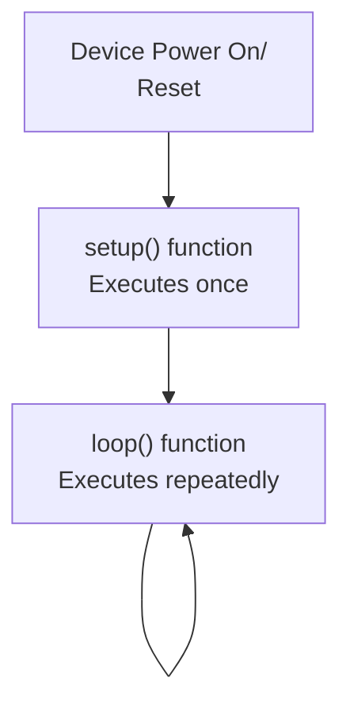
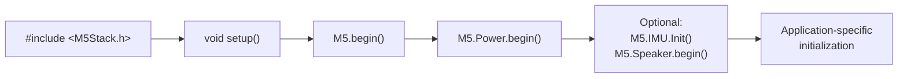
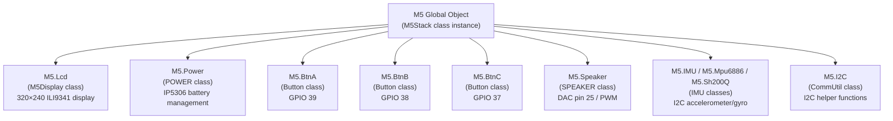
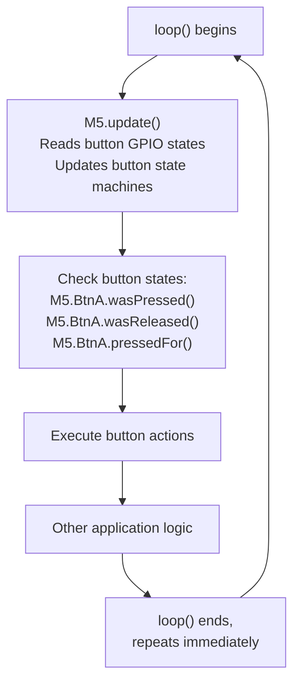
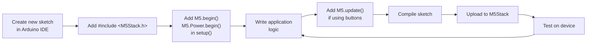

M5Stack Getting Started

# Getting Started

<details>
<summary>Relevant source files</summary>

The following files were used as context for generating this wiki page:

- [examples/Basics/Button/Button.ino](examples/Basics/Button/Button.ino)
- [examples/Basics/Display/Display.ino](examples/Basics/Display/Display.ino)
- [examples/Basics/HelloWorld/HelloWorld.ino](examples/Basics/HelloWorld/HelloWorld.ino)
- [examples/Basics/IMU/IMU.ino](examples/Basics/IMU/IMU.ino)
- [examples/Basics/PowerOFF/PowerOFF.ino](examples/Basics/PowerOFF/PowerOFF.ino)
- [examples/Basics/Sleep/Sleep.ino](examples/Basics/Sleep/Sleep.ino)
- [examples/Basics/Speaker/Speaker.ino](examples/Basics/Speaker/Speaker.ino)
- [examples/Basics/bmm150/bmm150.ino](examples/Basics/bmm150/bmm150.ino)

</details>


This page provides an introduction to using the M5Stack library for developing applications on the M5Stack Core Basic and Gray devices. It covers basic setup, the Arduino sketch structure, hardware initialization patterns, and references to example code.

**Important**: This library is officially deprecated. For new projects, migrate to [M5Unified](https://github.com/m5stack/M5Unified) and [M5GFX](https://github.com/m5stack/M5GFX) libraries. See [Overview](#1) for migration details.

For detailed documentation of specific subsystems, see [Core Library Architecture](#2). For step-by-step tutorials with example code, see [Basic Examples and Tutorials](#3.1).

---

## Library Installation

The M5Stack library is available through the Arduino Library Manager and PlatformIO Library Registry.

**Arduino IDE**:
1. Open Sketch → Include Library → Manage Libraries
2. Search for "M5Stack"
3. Install the library (version 0.4.6)

**PlatformIO**:
Add to `platformio.ini`:
```ini
lib_deps = m5stack/M5Stack@^0.4.6
```

The library automatically includes dependencies: M5Family, M5Module-4Relay, Module_GRBL_13.2, and M5_BMM150.

Sources: [library.properties](), [library.json]()

---

## Arduino Sketch Structure

All M5Stack programs follow the standard Arduino sketch pattern with two main functions:



**Typical initialization sequence**:



Sources: [examples/Basics/HelloWorld/HelloWorld.ino:15-27](), [examples/Basics/Display/Display.ino:15-18](), [examples/Basics/IMU/IMU.ino:30-46]()

---

## Minimal Program Example

The simplest M5Stack program requires only three lines of initialization:

[examples/Basics/HelloWorld/HelloWorld.ino:1-34]()

**Key components**:
- `#include <M5Stack.h>`: Includes the M5Stack library header
- `M5.begin()`: Initializes LCD, serial port, I2C bus, and button GPIO
- `M5.Power.begin()`: Initializes the IP5306 power management IC
- `M5.Lcd.print()`: Outputs text to the 320×240 LCD display

The `loop()` function can be empty if no continuous processing is needed.

Sources: [examples/Basics/HelloWorld/HelloWorld.ino]()

---

## The M5 Global Object

The `M5` global object provides access to all hardware subsystems through member objects:



All subsystems are accessed through this single global instance. You never need to create M5Stack objects manually.

Sources: [examples/Basics/Display/Display.ino:19-61](), [examples/Basics/Button/Button.ino:41-54](), [examples/Basics/Speaker/Speaker.ino:59-73](), [examples/Basics/IMU/IMU.ino:52-96]()

---

## Hardware Initialization Patterns

### Basic Initialization

Most programs require only core initialization:

| Function | Purpose | Required |
|----------|---------|----------|
| `M5.begin()` | Initialize LCD, Serial, I2C, buttons | Yes |
| `M5.Power.begin()` | Initialize IP5306 power IC | Yes |

[examples/Basics/HelloWorld/HelloWorld.ino:19-21]()

### Extended Initialization

Programs using additional hardware require subsystem initialization:

| Subsystem | Initialization | Example |
|-----------|---------------|---------|
| IMU | `M5.IMU.Init()` | [examples/Basics/IMU/IMU.ino:38]() |
| Magnetometer | `bmm150_initialization()` | [examples/Basics/bmm150/bmm150.ino:53-82]() |
| Speaker | Automatic (no init required) | [examples/Basics/Speaker/Speaker.ino:46-52]() |
| Display | Automatic (initialized by M5.begin()) | [examples/Basics/Display/Display.ino:19-21]() |

### M5.begin() Parameters

The `M5.begin()` function accepts optional parameters:

```cpp
M5.begin(bool LCDEnable, bool SDEnable, bool SerialEnable, bool I2CEnable);
```

Default is `M5.begin(true, true, true, true)` which enables all subsystems.

Example for minimal power consumption:
```cpp
M5.begin(true, false, true, false);  // LCD + Serial only
```

Sources: [examples/Basics/bmm150/bmm150.ino:102-103]()

---

## The Update Pattern

Programs that use buttons must call `M5.update()` in the `loop()` function to read button states:



**Button state methods**:
- `wasPressed()`: Returns true once when button is first pressed
- `wasReleased()`: Returns true once when button is released
- `pressedFor(ms)`: Returns true if button held for specified milliseconds
- `wasReleasefor(ms)`: Returns true if button was held for specified milliseconds then released

Sources: [examples/Basics/Button/Button.ino:41-54](), [examples/Basics/Speaker/Speaker.ino:59-73]()

---

## Core Hardware Subsystems Overview

### Display System

The `M5.Lcd` object provides graphics primitives and text rendering:

| Category | Methods | Example |
|----------|---------|---------|
| Fill | `fillScreen(color)` | [examples/Basics/Display/Display.ino:22-31]() |
| Shapes | `drawRect()`, `fillRect()`, `drawCircle()`, `fillCircle()`, `drawTriangle()`, `fillTriangle()` | [examples/Basics/Display/Display.ino:43-61]() |
| Text | `print()`, `println()`, `printf()`, `setCursor()`, `setTextColor()`, `setTextSize()` | [examples/Basics/Display/Display.ino:33-39]() |

For detailed documentation, see [Display and Graphics System](#2.2).

### Power Management

The `M5.Power` object controls battery, sleep modes, and power states:

| Function | Purpose | Example |
|----------|---------|---------|
| `lightSleep(duration)` | Sleep for specified time, then resume | [examples/Basics/Sleep/Sleep.ino:57]() |
| `deepSleep(duration)` | Deep sleep, CPU resets on wake | [examples/Basics/Sleep/Sleep.ino:71]() |
| `powerOFF()` | Shutdown device | [examples/Basics/PowerOFF/PowerOFF.ino:46]() |
| `setWakeupButton(pin)` | Configure wake button | [examples/Basics/Sleep/Sleep.ino:22]() |

For detailed documentation, see [Power Management](#2.3).

### Audio Output

The `M5.Speaker` object generates tones and plays audio:

| Function | Purpose | Example |
|----------|---------|---------|
| `tone(frequency, duration)` | Play tone at specified Hz | [examples/Basics/Speaker/Speaker.ino:63]() |
| `tone(frequency)` | Play continuous tone | [examples/Basics/Speaker/Speaker.ino:67]() |
| `end()` | Stop audio output | [examples/Basics/Speaker/Speaker.ino:71]() |

For detailed documentation, see [Audio System](#2.4).

### Motion Sensing

The `M5.IMU` object provides accelerometer and gyroscope data:

| Function | Purpose | Example |
|----------|---------|---------|
| `Init()` | Initialize IMU sensor | [examples/Basics/IMU/IMU.ino:38]() |
| `getGyroData(x, y, z)` | Read gyroscope (°/s) | [examples/Basics/IMU/IMU.ino:55]() |
| `getAccelData(x, y, z)` | Read accelerometer (G) | [examples/Basics/IMU/IMU.ino:56-58]() |
| `getAhrsData(pitch, roll, yaw)` | Read attitude angles (°) | [examples/Basics/IMU/IMU.ino:59-61]() |
| `getTempData(temp)` | Read temperature (°C) | [examples/Basics/IMU/IMU.ino:62-63]() |

For detailed documentation, see [IMU and Motion Sensing](#2.5).

Sources: [examples/Basics/Display/Display.ino](), [examples/Basics/Sleep/Sleep.ino](), [examples/Basics/PowerOFF/PowerOFF.ino](), [examples/Basics/Speaker/Speaker.ino](), [examples/Basics/IMU/IMU.ino]()

---

## Common Code Patterns

### Pattern 1: Display Output

```cpp
void setup() {
    M5.begin();
    M5.Power.begin();
    
    M5.Lcd.setTextColor(WHITE);
    M5.Lcd.setTextSize(2);
    M5.Lcd.setCursor(10, 10);
    M5.Lcd.println("Application Title");
}
```

Sources: [examples/Basics/Display/Display.ino:19-39]()

### Pattern 2: Button Input with Actions

```cpp
void loop() {
    M5.update();
    
    if (M5.BtnA.wasPressed()) {
        // Action for button A
    } else if (M5.BtnB.wasPressed()) {
        // Action for button B
    } else if (M5.BtnC.wasPressed()) {
        // Action for button C
    }
}
```

Sources: [examples/Basics/Button/Button.ino:41-54](), [examples/Basics/Speaker/Speaker.ino:59-73]()

### Pattern 3: Sensor Reading with Display

```cpp
void loop() {
    float x, y, z;
    M5.IMU.getAccelData(&x, &y, &z);
    
    M5.Lcd.setCursor(0, 20);
    M5.Lcd.printf("X: %.2f  Y: %.2f  Z: %.2f", x, y, z);
    
    delay(100);
}
```

Sources: [examples/Basics/IMU/IMU.ino:52-96]()

### Pattern 4: Power Management

```cpp
void setup() {
    M5.begin();
    M5.Power.begin();
    M5.Power.setWakeupButton(BUTTON_A_PIN);
}

void loop() {
    M5.update();
    if (M5.BtnA.wasPressed()) {
        M5.Power.deepSleep(SLEEP_SEC(300));  // Sleep 5 minutes
    }
}
```

Sources: [examples/Basics/Sleep/Sleep.ino:19-72](), [examples/Basics/PowerOFF/PowerOFF.ino:19-48]()

---

## Available Example Programs

The library includes 50+ example programs organized by functionality:

| Category | Examples | Location |
|----------|----------|----------|
| **Basics** | HelloWorld, Display, Button, Speaker, IMU, Sleep, PowerOFF, BMM150 | `examples/Basics/` |
| **Units** | Button, Joystick, CardKB, GPS, CAN, Weight, Color, ToF, etc. | `examples/Unit/` |
| **Modules** | LTE, GSM, LoRa, Zigbee, Servo, BALA2, W5500 Ethernet | `examples/Modules/` |
| **Advanced** | WiFiManager, SD Card, Factory Test | `examples/Advanced/` |

For detailed walk-throughs of basic examples, see [Basic Examples and Tutorials](#3.1).

For comprehensive hardware testing, see [Hardware Testing and Validation](#3.2).

Sources: Repository structure from [examples/]() directory

---

## Development Workflow



**Common pitfalls**:
1. Forgetting `M5.update()` in `loop()` when using buttons
2. Forgetting `M5.Power.begin()` when using power management features
3. Not calling subsystem-specific initialization (e.g., `M5.IMU.Init()`)
4. Using blocking `delay()` calls that prevent button updates

Sources: General pattern observed across [examples/Basics/]() files

---

## Next Steps

- **Learn by example**: Work through [Basic Examples and Tutorials](#3.1) for step-by-step guides
- **Validate hardware**: Use [Hardware Testing and Validation](#3.2) to test your M5Stack device
- **Explore Units**: See [M5Stack Units](#4) for sensor and actuator modules
- **Explore Modules**: See [M5Stack Modules](#5) for expansion boards and communication peripherals
- **API reference**: See [Core Library Architecture](#2) for detailed subsystem documentation
- **Migration path**: For new projects, see [Overview](#1) for M5Unified/M5GFX migration

Sources: Repository organization and table of contents structure