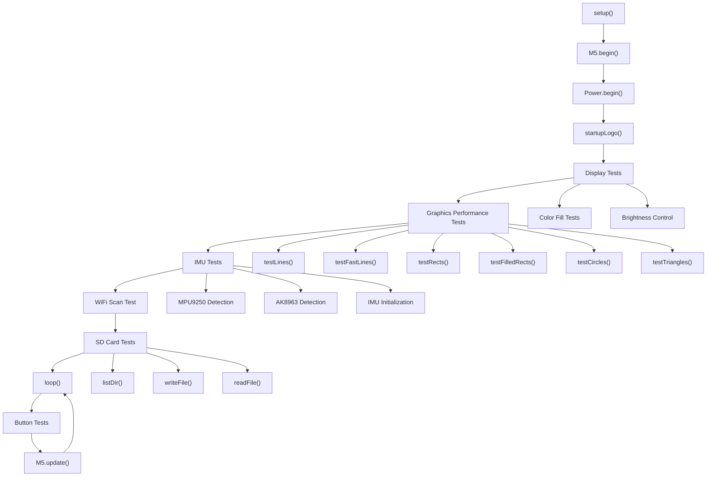
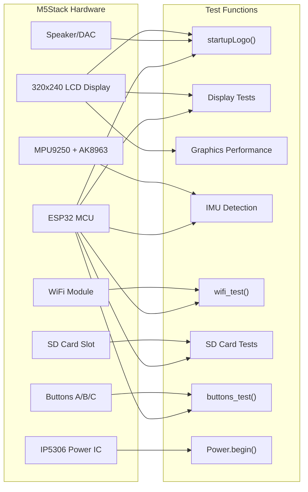
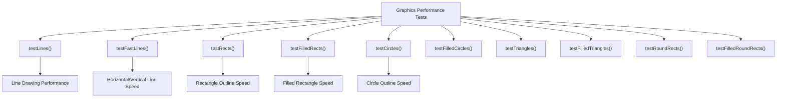
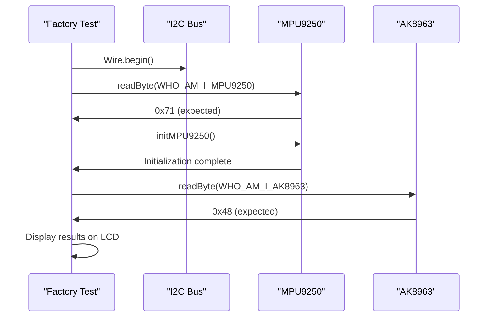
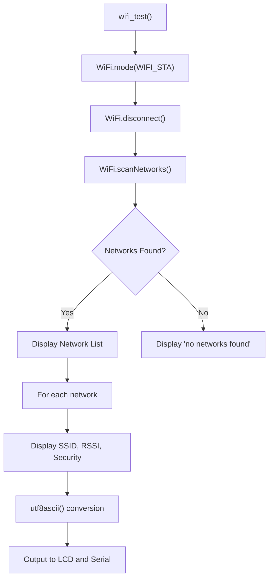
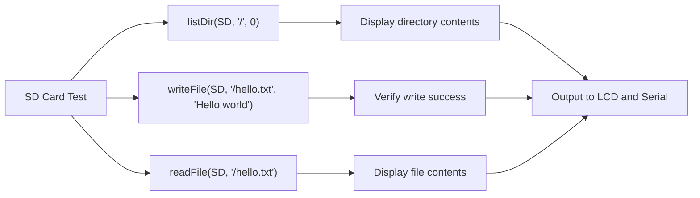
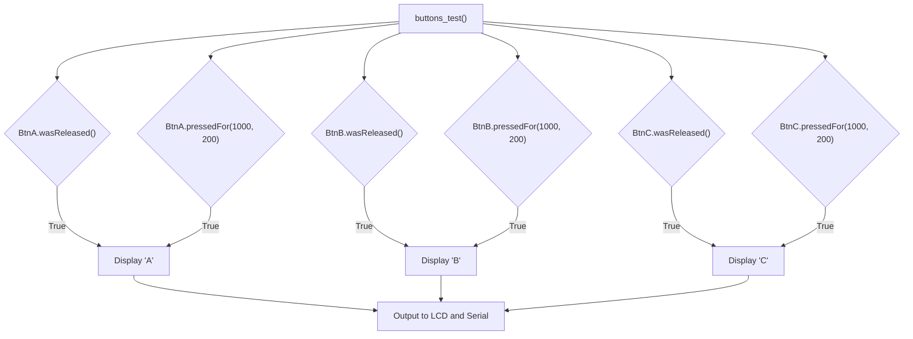
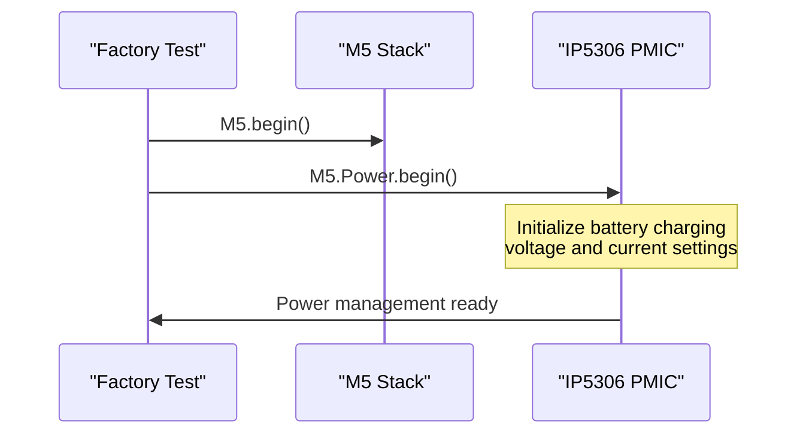
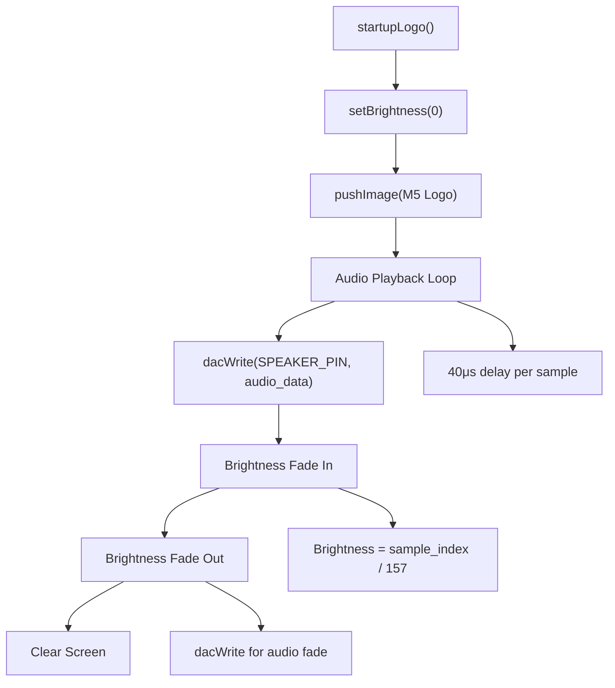

M5Stack Hardware Testing and Validation

# Hardware Testing and Validation

Relevant source files

The following files were used as context for generating this wiki page:

- [examples/Basics/FactoryTest/FactoryTest.ino](examples/Basics/FactoryTest/FactoryTest.ino)

This document covers the comprehensive hardware testing and validation procedures for M5Stack Basic and Gray devices. The factory test suite provides systematic validation of all major hardware components including display, sensors, communication modules, storage, and input devices.

For basic usage examples without hardware validation focus, see [Basic Examples and Tutorials](#3.1). For power management implementation details, see [Power Management](#2.3).

## Purpose and Scope

The M5Stack factory test suite serves as both a manufacturing quality control tool and a diagnostic utility for developers. It provides:

- **Component Validation**: Systematic testing of display, IMU, WiFi, SD card, buttons, and power management
- **Performance Benchmarking**: Graphics performance measurement and sensor calibration verification  
- **Integration Testing**: Verification that all hardware subsystems work together correctly
- **Diagnostic Tool**: Identification of faulty components or connection issues

## Factory Test Architecture

The factory test system follows a sequential validation approach, testing each hardware subsystem independently before proceeding to integration tests.

### Test Execution Flow

Sources: [examples/Basics/FactoryTest/FactoryTest.ino:467-686]()

### Hardware Component Test Mapping

Sources: [examples/Basics/FactoryTest/FactoryTest.ino:1-686]()

## Component Testing Procedures

### Display and Graphics Validation

The display testing sequence validates both basic functionality and performance characteristics:

| Test Phase | Function | Purpose | Expected Result |
|------------|----------|---------|-----------------|
| Basic Display | Color fills | Pixel functionality | Full screen colors (WHITE, RED, GREEN, BLUE, BLACK) |
| Brightness Control | `setBrightness()` | Backlight control | Smooth brightness transitions |
| Graphics Performance | `testLines()` | Line drawing speed | Performance benchmarks in microseconds |
| Shape Rendering | `testRects()`, `testCircles()`, `testTriangles()` | Geometry accuracy | Correct shape rendering |

The graphics performance tests measure rendering speed for different primitives:

Sources: [examples/Basics/FactoryTest/FactoryTest.ino:265-455](), [examples/Basics/FactoryTest/FactoryTest.ino:517-589]()

### IMU and Motion Sensor Testing

The IMU validation tests both the accelerometer/gyroscope (MPU9250) and magnetometer (AK8963):

The test validates sensor presence and communication:
- **MPU9250 Detection**: Reads WHO_AM_I register, expects `0x71`
- **AK8963 Detection**: Reads WHO_AM_I register, expects `0x48`
- **Initialization**: Configures sensors for active data mode

Sources: [examples/Basics/FactoryTest/FactoryTest.ino:613-658]()

### WiFi Connectivity Testing

The WiFi test performs a network scan to validate radio functionality:

The scan results include:
- Network count
- SSID names (with UTF-8 to ASCII conversion)
- Signal strength (RSSI)
- Security status (open/encrypted)

Sources: [examples/Basics/FactoryTest/FactoryTest.ino:182-225](), [examples/Basics/FactoryTest/FactoryTest.ino:605-664]()

### SD Card Storage Testing

The SD card validation performs file system operations to verify storage functionality:

| Operation | Function | Test Purpose |
|-----------|----------|--------------|
| Directory Listing | `listDir()` | File system access |
| File Writing | `writeFile()` | Write capability |
| File Reading | `readFile()` | Read capability |

Sources: [examples/Basics/FactoryTest/FactoryTest.ino:50-127](), [examples/Basics/FactoryTest/FactoryTest.ino:666-673]()

### Button Input Testing

Button testing runs continuously in the main loop, detecting both quick presses and long holds:

The button test detects:
- Single button releases (`wasReleased()`)
- Long press events (`pressedFor(1000, 200)`)
- Outputs button identifier to both LCD and Serial

Sources: [examples/Basics/FactoryTest/FactoryTest.ino:129-142](), [examples/Basics/FactoryTest/FactoryTest.ino:684-685]()

## Power Management Validation

Power system initialization validates the IP5306 power management IC:

The power management test:
- Initializes the IP5306 power management IC
- Configures battery charging parameters
- Validates I2C communication with power chip (GPIO21, GPIO22)

Sources: [examples/Basics/FactoryTest/FactoryTest.ino:478-486]()

## Startup Sequence and Audio Testing

The startup sequence tests both audio output and display synchronization:

The startup test validates:
- DAC audio output through speaker
- LCD brightness control synchronization
- Image display capabilities
- Timing accuracy for audio playback

Sources: [examples/Basics/FactoryTest/FactoryTest.ino:22-47](), [examples/Basics/FactoryTest/FactoryTest.ino:493]()

## Test Results and Validation Criteria

### Expected Outcomes

| Component | Pass Criteria | Failure Indicators |
|-----------|---------------|-------------------|
| Display | All colors display correctly, graphics tests complete | Black screen, color distortion, test timeouts |
| IMU | MPU9250 returns 0x71, AK8963 returns 0x48 | Wrong device IDs, I2C communication failure |
| WiFi | Network scan returns available networks | Scan failure, no networks detected |
| SD Card | File operations succeed | Mount failure, read/write errors |
| Buttons | All three buttons respond to input | No response, stuck buttons |
| Audio | Startup sound plays correctly | No audio output, distorted sound |
| Power | Power IC initializes successfully | I2C communication failure |

### Diagnostic Output

The factory test provides dual output streams:
- **Serial Console**: Detailed technical information and timing data
- **LCD Display**: Visual confirmation and user-friendly status messages

Both outputs use UTF-8 to ASCII conversion for proper character display using the `utf8ascii()` function.

Sources: [examples/Basics/FactoryTest/FactoryTest.ino:146-180]()

## Usage Instructions

1. **Flash the Factory Test**: Upload `FactoryTest.ino` to the M5Stack device
2. **Monitor Output**: Connect serial monitor at 115200 baud for detailed logs
3. **Observe LCD**: Watch the display for visual test confirmation
4. **Test Buttons**: Press buttons A, B, and C during the button test phase
5. **Verify Components**: Check that all expected hardware responses occur

The test runs automatically through all hardware components, then enters an interactive button testing loop. The comprehensive validation ensures all M5Stack hardware subsystems are functioning correctly.

Sources: [examples/Basics/FactoryTest/FactoryTest.ino:467-686]()