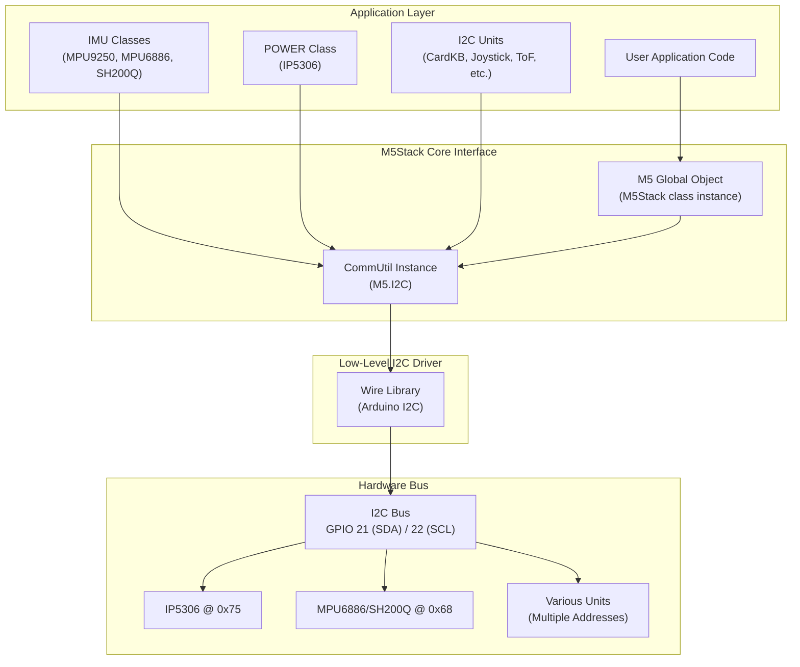
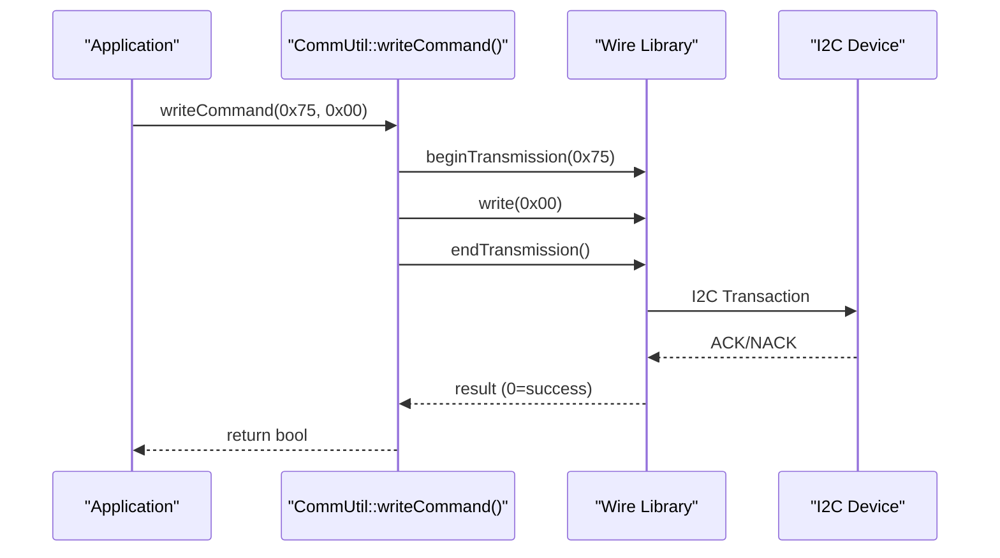
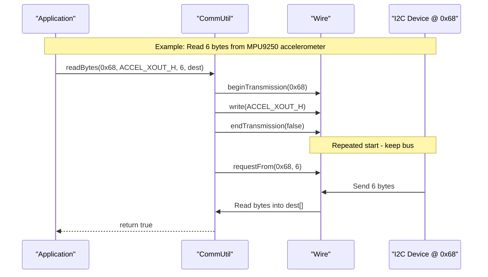
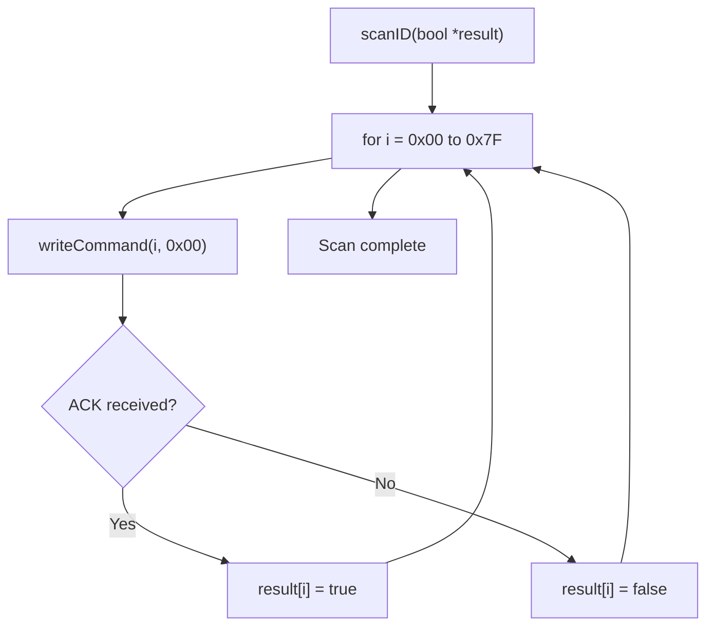
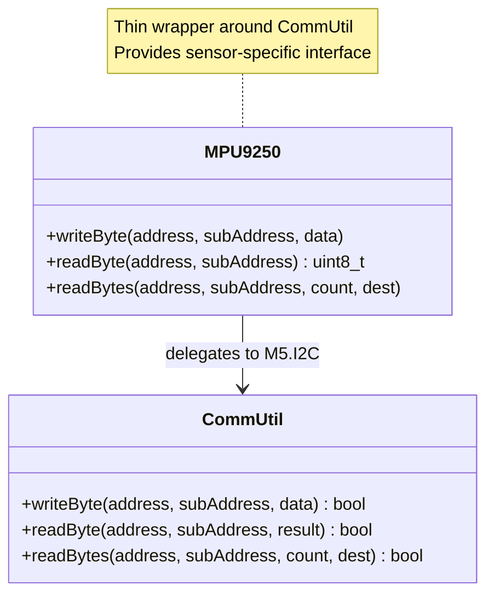
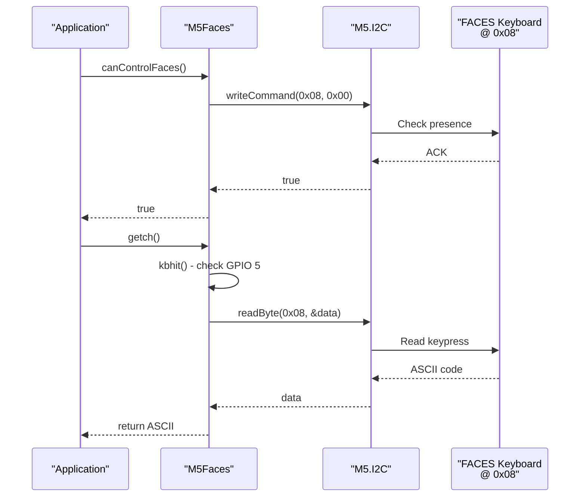
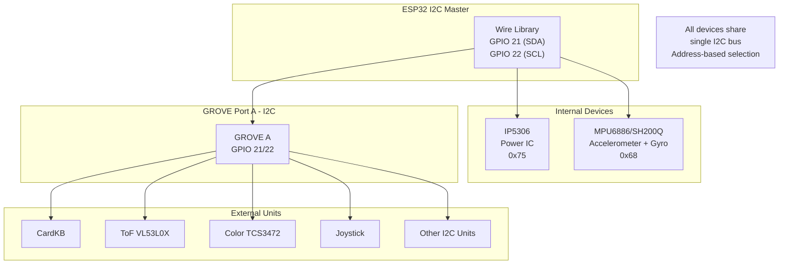

M5Stack I2C Communication Utilities

# I2C Communication Utilities

<details>
<summary>Relevant source files</summary>

The following files were used as context for generating this wiki page:

- [src/M5Faces.cpp](src/M5Faces.cpp)
- [src/M5Faces.h](src/M5Faces.h)
- [src/utility/CommUtil.cpp](src/utility/CommUtil.cpp)
- [src/utility/CommUtil.h](src/utility/CommUtil.h)
- [src/utility/MPU9250.cpp](src/utility/MPU9250.cpp)
- [src/utility/MPU9250.h](src/utility/MPU9250.h)
- [src/utility/Sprite.cpp](src/utility/Sprite.cpp)
- [src/utility/Sprite.h](src/utility/Sprite.h)

</details>


## Purpose and Scope

This page documents the `CommUtil` class, which provides helper functions for I2C (Inter-Integrated Circuit) communication in the M5Stack library. The `CommUtil` class abstracts the Arduino Wire library to simplify reading and writing data to I2C devices connected to the M5Stack Core.

The `CommUtil` class is accessible globally via `M5.I2C` after calling `M5.begin()`. It is used internally by multiple M5Stack components including the power management IC (IP5306), IMU sensors (MPU6886, SH200Q, MPU9250), and various Units/Modules. For information about specific sensor implementations that use these utilities, see [IMU and Motion Sensing](#2.5).

**Sources:** [src/utility/CommUtil.h](), [src/utility/CommUtil.cpp]()

---

## CommUtil Class Architecture

The `CommUtil` class provides a simplified interface to the Arduino Wire library for I2C communication. It is instantiated as a member of the global `M5Stack` object and accessed via `M5.I2C`.

### Class Structure



**Sources:** [src/utility/CommUtil.h:14-30](), [src/M5Stack.h](), [src/utility/MPU9250.cpp:561-574]()

### Method Summary

| Method | Purpose | Return Type |
|--------|---------|-------------|
| `writeCommand(address, subAddress)` | Send command byte to I2C device | `bool` |
| `writeByte(address, subAddress, data)` | Write single data byte to register | `bool` |
| `writeBytes(address, subAddress, data, length)` | Write multiple bytes to register | `bool` |
| `readByte(address, result)` | Read single byte without register address | `bool` |
| `readByte(address, subAddress, result)` | Read single byte from register | `bool` |
| `readBytes(address, count, dest)` | Read multiple bytes without register | `bool` |
| `readBytes(address, subAddress, count, dest)` | Read multiple bytes from register | `bool` |
| `scanID(result)` | Scan all I2C addresses (0x00-0x7F) | `void` |

**Sources:** [src/utility/CommUtil.h:17-26]()

---

## Write Operations

The `CommUtil` class provides three write methods for different use cases. All write operations return `true` on success or `false` if the I2C transaction fails.

### writeCommand()

Sends a command byte (register address) to an I2C device without additional data. Useful for triggering device operations.

**Implementation Flow:**



**Example Usage:**
```cpp
// From M5Faces keyboard interface
bool canControl = M5.I2C.writeCommand(KEYBOARD_I2C_ADDR, READI2CSUBADDR);
```

**Sources:** [src/utility/CommUtil.cpp:21-33](), [src/M5Faces.cpp:15-17]()

### writeByte()

Writes a single data byte to a specific register address on an I2C device. This is the most common write operation for configuring sensor registers.

**Implementation Details:**
- Begins I2C transmission to the device address
- Writes the register address (subAddress)
- Writes the data byte
- Ends transmission and checks for errors
- Returns `true` if `Wire.endTransmission()` returns 0 (success)

**Sources:** [src/utility/CommUtil.cpp:36-49]()

### writeBytes()

Writes multiple bytes sequentially to an I2C device starting at a register address. Useful for bulk configuration or data transfer.

**Implementation:**
- Iterates through data array, writing each byte to the Wire buffer
- All bytes are sent in a single I2C transaction
- Optional debug output available via `I2C_DEBUG_TO_SERIAL` macro

**Sources:** [src/utility/CommUtil.cpp:52-76]()

---

## Read Operations

The `CommUtil` class provides four read methods with different parameter combinations for flexibility.

### Single Byte Read Operations

#### readByte(address, result) - No Register Address

Reads a single byte directly from device without specifying a register. Used when device auto-increments or has single-byte protocol.


**Sources:** [src/utility/CommUtil.cpp:78-94]()

#### readByte(address, subAddress, result) - With Register Address

Reads a single byte from a specific register. This is the standard I2C register read pattern.

**Transaction Flow:**
1. `Wire.beginTransmission(address)` - Start communication
2. `Wire.write(subAddress)` - Write register address
3. `Wire.endTransmission(false)` - Repeated start (keep bus)
4. `Wire.requestFrom(address, 1)` - Request 1 byte
5. `Wire.read()` - Read the byte
6. Store result in pointer parameter

**Example Usage:**
```cpp
// From MPU9250 implementation
uint8_t MPU9250::readByte(uint8_t address, uint8_t subAddress) {
    uint8_t result;
    M5.I2C.readByte(address, subAddress, &result);
    return result;
}
```

**Sources:** [src/utility/CommUtil.cpp:96-116](), [src/utility/MPU9250.cpp:565-569]()

### Multi-Byte Read Operations

#### readBytes(address, subAddress, count, dest)

Reads multiple sequential bytes from an I2C device starting at a specific register address. Most commonly used for reading sensor data arrays.

**Register Read Pattern:**



**Implementation Details:**
- Uses repeated start (`endTransmission(false)`) to keep bus ownership
- Reads all available bytes from Wire buffer into destination array
- Returns `true` only if both transaction and request succeed

**Sources:** [src/utility/CommUtil.cpp:118-145]()

#### readBytes(address, count, dest) - No Register Address

Reads multiple bytes without specifying register address. Used for devices with auto-increment or stream protocols.

**Sources:** [src/utility/CommUtil.cpp:147-157]()

---

## Device Scanning

### scanID() Method

The `scanID()` method scans all possible 7-bit I2C addresses (0x00 to 0x7F) to detect connected devices. This is useful for debugging and device discovery.

**Scan Implementation:**



**Usage Pattern:**
```cpp
bool devices[128];
M5.I2C.scanID(devices);

for (int i = 0; i < 128; i++) {
    if (devices[i]) {
        Serial.printf("Device found at 0x%02X\n", i);
    }
}
```

**Common M5Stack I2C Addresses:**
| Address | Device |
|---------|--------|
| 0x68 | MPU6886, SH200Q, MPU9250 |
| 0x75 | IP5306 Power Management IC |
| 0x0C | AK8963 Magnetometer |
| 0x08 | FACES Keyboard |
| Various | Units (CardKB, ToF, Color Sensor, etc.) |

**Sources:** [src/utility/CommUtil.cpp:159-163](), [src/M5Faces.cpp:8]()

---

## Integration with Hardware Components

### MPU9250 IMU Integration

The MPU9250 IMU class demonstrates typical usage of `CommUtil` for sensor communication. All I2C operations are delegated to `M5.I2C`.

**MPU9250 I2C Wrapper Methods:**



**Implementation:**
```cpp
// MPU9250 delegates all I2C to CommUtil
void MPU9250::writeByte(uint8_t address, uint8_t subAddress, uint8_t data) {
    M5.I2C.writeByte(address, subAddress, data);
}

uint8_t MPU9250::readByte(uint8_t address, uint8_t subAddress) {
    uint8_t result;
    M5.I2C.readByte(address, subAddress, &result);
    return result;
}

void MPU9250::readBytes(uint8_t address, uint8_t subAddress, 
                        uint8_t count, uint8_t* dest) {
    M5.I2C.readBytes(address, subAddress, count, dest);
}
```

**Sources:** [src/utility/MPU9250.cpp:561-574](), [src/utility/MPU9250.h:244-246]()

### M5Faces Keyboard Integration

The M5Faces keyboard interface uses `CommUtil` to communicate with the keyboard expansion at I2C address 0x08.

**Keyboard Communication Flow:**



**Sources:** [src/M5Faces.cpp:15-40](), [src/M5Faces.h:9-17]()

---

## I2C Bus Architecture

### Shared Bus Topology

The M5Stack Core uses a single shared I2C bus for all internal and external devices. Understanding this architecture is crucial for avoiding address conflicts and managing bus timing.



**Key Considerations:**
- **Address Conflicts:** Each device must have unique 7-bit address
- **Bus Speed:** Default 100 kHz (standard mode), 400 kHz supported (fast mode)
- **Pull-up Resistors:** Required on SDA/SCL lines (typically 4.7kΩ)
- **Bus Capacitance:** Total capacitance limits number of devices

**Sources:** Based on Diagram 6 from high-level overview, [src/utility/CommUtil.h]()

---

## Debug Features

### I2C_DEBUG_TO_SERIAL Macro

The `CommUtil` implementation includes conditional debug output that can be enabled by defining `I2C_DEBUG_TO_SERIAL` before including the source file.

**Debug Output Format:**
```
writeCommand:send to 0x75 [0x00] result:OK
writeByte:send to 0x68 [0x1B] data=0x00 result:OK
writeBytes:send to 0x68 [0x13] data=00 01 02 03 result:OK
readByte:read from 0x68 [0x75] requestByte=1 receive=71
readBytes:read from 0x68 [0x3B] requestByte=6 receive=01 23 45 67 89 AB (len:6)
```

**Usage:**
```cpp
// In CommUtil.cpp, uncomment line 15:
#define I2C_DEBUG_TO_SERIAL

// All I2C operations will print to Serial
```

**Sources:** [src/utility/CommUtil.cpp:14-15](), [src/utility/CommUtil.cpp:27-73]()

---

## Usage Patterns

### Pattern 1: Single Register Read

Reading a configuration or status register:

```cpp
// Read WHO_AM_I register from MPU9250
uint8_t whoAmI;
if (M5.I2C.readByte(MPU9250_ADDRESS, WHO_AM_I_MPU9250, &whoAmI)) {
    Serial.printf("Device ID: 0x%02X\n", whoAmI);
}
```

**Sources:** [src/utility/MPU9250.h:166](), [src/utility/CommUtil.cpp:96-116]()

### Pattern 2: Multi-Register Sequential Read

Reading sensor data arrays (common pattern for accelerometer, gyroscope data):

```cpp
// Read 6 bytes of accelerometer data
uint8_t rawData[6];
M5.I2C.readBytes(MPU9250_ADDRESS, ACCEL_XOUT_H, 6, &rawData[0]);

// Convert to 16-bit values
int16_t accelX = ((int16_t)rawData[0] << 8) | rawData[1];
int16_t accelY = ((int16_t)rawData[2] << 8) | rawData[3];
int16_t accelZ = ((int16_t)rawData[4] << 8) | rawData[5];
```

**Sources:** [src/utility/MPU9250.cpp:64-73](), [src/utility/CommUtil.cpp:118-145]()

### Pattern 3: Write Configuration

Configuring device registers:

```cpp
// Configure MPU9250 gyroscope full scale range
uint8_t config = M5.I2C.readByte(MPU9250_ADDRESS, GYRO_CONFIG, &config);
config &= ~0x18;              // Clear scale bits
config |= (Gscale << 3);      // Set new scale
M5.I2C.writeByte(MPU9250_ADDRESS, GYRO_CONFIG, config);
```

**Sources:** [src/utility/MPU9250.cpp:183-193](), [src/utility/CommUtil.cpp:36-49]()

### Pattern 4: Device Detection

Checking if device is present on bus:

```cpp
// Check if FACES keyboard is connected
bool keyboardPresent = M5.I2C.writeCommand(KEYBOARD_I2C_ADDR, 0x00);
if (keyboardPresent) {
    Serial.println("FACES keyboard detected");
}
```

**Sources:** [src/M5Faces.cpp:15-17](), [src/utility/CommUtil.cpp:21-33]()

---

## Error Handling

All `CommUtil` read and write methods return `bool` to indicate success or failure:
- `true`: I2C transaction completed successfully (ACK received)
- `false`: I2C transaction failed (NACK, timeout, or bus error)

**Best Practice:**
Always check return values for critical operations:

```cpp
if (!M5.I2C.writeByte(device_addr, register_addr, value)) {
    Serial.println("I2C write failed!");
    // Handle error - retry or report
}
```

**Common Failure Causes:**
- Device not connected or powered
- Incorrect device address
- Bus contention or electrical noise
- Missing or incorrect pull-up resistors
- Device in sleep or reset state

**Sources:** [src/utility/CommUtil.cpp:25-75]()