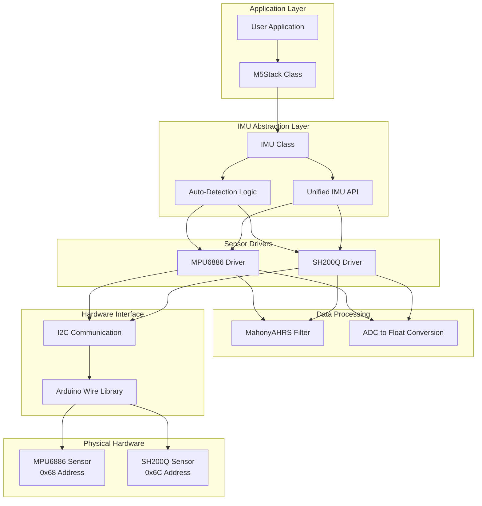
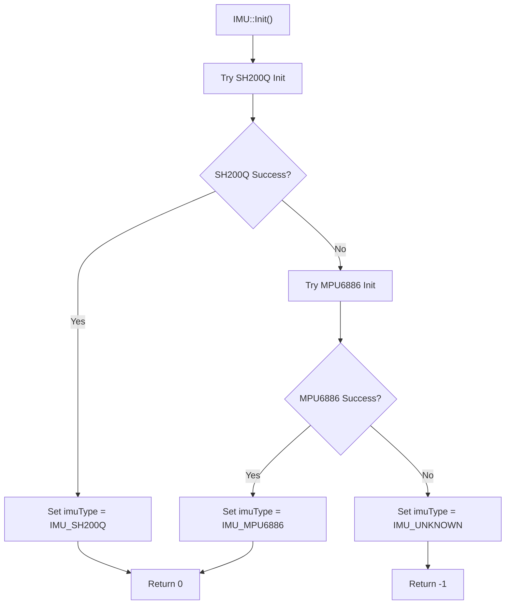
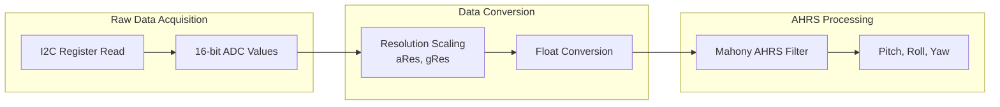
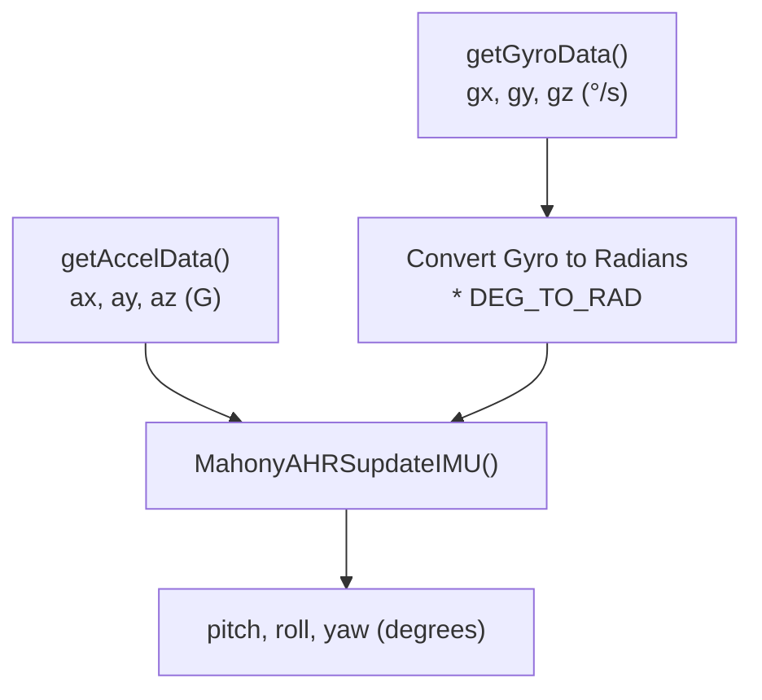

M5Stack IMU and Motion Sensing

# IMU and Motion Sensing

Relevant source files

The following files were used as context for generating this wiki page:

- [src/M5Faces.cpp](src/M5Faces.cpp)
- [src/M5Faces.h](src/M5Faces.h)
- [src/utility/CommUtil.cpp](src/utility/CommUtil.cpp)
- [src/utility/CommUtil.h](src/utility/CommUtil.h)
- [src/utility/MPU9250.cpp](src/utility/MPU9250.cpp)
- [src/utility/MPU9250.h](src/utility/MPU9250.h)
- [src/utility/Sprite.cpp](src/utility/Sprite.cpp)
- [src/utility/Sprite.h](src/utility/Sprite.h)

This document covers the IMU (Inertial Measurement Unit) and motion sensing system in the M5Stack library. The IMU subsystem provides a unified interface for accessing accelerometer, gyroscope, and temperature data from multiple IMU sensor types, along with AHRS (Attitude and Heading Reference System) processing for orientation calculations.

For information about power management features, see [Power Management](#2.3). For display and graphics capabilities, see [Display and Graphics System](#2.2).

## System Architecture

The IMU system is built as a hardware abstraction layer that automatically detects and interfaces with different IMU sensors. The architecture consists of three main layers: the unified IMU interface, sensor-specific drivers, and the underlying I2C communication protocol.

### IMU Abstraction Layer Architecture

Sources: [src/IMU.h:9-38](), [src/IMU.cpp:12-29](), [src/utility/MPU6886.h:57-98](), [src/utility/SH200Q.h:31-75]()

## Supported IMU Sensors

The M5Stack library supports two IMU sensor types with different capabilities and specifications:

| Feature | MPU6886 | SH200Q |
|---------|---------|---------|
| **I2C Address** | 0x68 | 0x6C |
| **Accelerometer Ranges** | ±2G, ±4G, ±8G, ±16G | ±4G, ±8G, ±16G |
| **Gyroscope Ranges** | ±250°/s, ±500°/s, ±1000°/s, ±2000°/s | ±125°/s, ±250°/s, ±500°/s, ±1000°/s, ±2000°/s |
| **Default Config** | ±8G, ±2000°/s | ±8G, ±2000°/s |
| **FIFO Support** | Yes (1024 bytes) | No |
| **Sample Rate** | 500Hz | 256Hz (Accel), 500Hz (Gyro) |
| **Temperature Formula** | `temp/326.8 + 25.0` | `temp/333.87 + 21.0` |

Sources: [src/utility/MPU6886.h:59-61](), [src/utility/SH200Q.h:33-41](), [src/utility/MPU6886.cpp:35-36](), [src/utility/SH200Q.cpp:66-67]()

## IMU Initialization and Auto-Detection

The IMU system automatically detects which sensor is present during initialization by attempting to communicate with each sensor type in sequence.

### Initialization Flow

Sources: [src/IMU.cpp:12-29](), [src/IMU.h:11]()

The initialization process first attempts to initialize the SH200Q sensor, and if that fails, tries the MPU6886. The `imuType` member variable stores the detected sensor type for routing subsequent API calls.

## Data Access Methods

The IMU class provides multiple methods for accessing sensor data, with both raw ADC values and scaled floating-point values.

### Data Access API

| Method | Return Type | Description |
|--------|-------------|-------------|
| `getAccelAdc()` | `int16_t*` | Raw accelerometer ADC values |
| `getAccelData()` | `float*` | Scaled accelerometer data in G |
| `getGyroAdc()` | `int16_t*` | Raw gyroscope ADC values |
| `getGyroData()` | `float*` | Scaled gyroscope data in °/s |
| `getTempAdc()` | `int16_t*` | Raw temperature ADC value |
| `getTempData()` | `float*` | Temperature in °C |
| `getAhrsData()` | `float*` | Computed pitch, roll, yaw in degrees |

Sources: [src/IMU.h:20-28](), [src/IMU.cpp:47-109]()

### Data Processing Pipeline

Sources: [src/utility/MPU6886.cpp:204-224](), [src/utility/SH200Q.cpp:212-236](), [src/IMU.cpp:95-109]()

## AHRS Processing

The Attitude and Heading Reference System (AHRS) processing converts raw accelerometer and gyroscope data into orientation angles using the Mahony filter algorithm.

### AHRS Data Flow

The AHRS processing follows this sequence:
1. Read scaled accelerometer data (ax, ay, az) in G
2. Read scaled gyroscope data (gx, gy, gz) in °/s  
3. Convert gyroscope data from degrees to radians
4. Pass data to `MahonyAHRSupdateIMU()` function
5. Receive computed pitch, roll, and yaw angles in degrees

Sources: [src/IMU.cpp:95-109](), [src/utility/MPU6886.cpp:132-145](), [src/utility/SH200Q.cpp:252-266]()

## FIFO Support

FIFO (First In, First Out) buffering is available on the MPU6886 sensor for continuous data collection without CPU intervention. The SH200Q does not support FIFO operations.

### FIFO Operations

| Method | Description | MPU6886 Support | SH200Q Support |
|--------|-------------|-----------------|----------------|
| `setFIFOEnable()` | Enable/disable FIFO | ✓ | ✗ |
| `ReadFIFO()` | Read single FIFO byte | ✓ | ✗ |
| `ReadFIFOBuff()` | Read FIFO buffer | ✓ | ✗ |
| `ReadFIFOCount()` | Get FIFO data count | ✓ | ✗ |
| `RestFIFO()` | Reset FIFO | ✓ | ✗ |

Sources: [src/IMU.cpp:111-155](), [src/utility/MPU6886.cpp:244-282]()

The MPU6886 FIFO can store up to 1024 bytes of sensor data, with the FIFO configured to run at 500Hz output rate when enabled via register configuration.

## Register Configuration

Both IMU sensors require specific register configurations during initialization to set sampling rates, full-scale ranges, and filtering options.

### MPU6886 Key Configuration

- **Power Management**: Clock source selection and sleep mode control
- **Accelerometer Config**: ±8G full-scale range (default)
- **Gyroscope Config**: ±2000°/s full-scale range (default)  
- **Sample Rate**: 1kHz internal, 500Hz FIFO output
- **Digital Low Pass Filter**: 1kHz bandwidth

Sources: [src/utility/MPU6886.cpp:44-98]()

### SH200Q Key Configuration

- **ADC Reset**: Specific reset sequence for ADC calibration
- **Accelerometer ODR**: 256Hz output data rate
- **Gyroscope ODR**: 500Hz output data rate
- **DLPF**: 50Hz digital low-pass filter
- **Range Settings**: ±8G accelerometer, ±2000°/s gyroscope

Sources: [src/utility/SH200Q.cpp:95-118]()

## Integration with M5Stack Class

The IMU system integrates with the main M5Stack class through the global `M5.IMU` object, providing seamless access to motion sensing capabilities alongside other M5Stack features.

Sources: [src/IMU.cpp:6-7]()