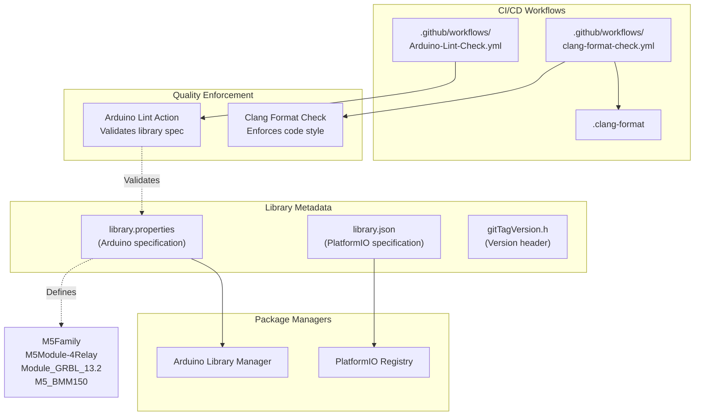
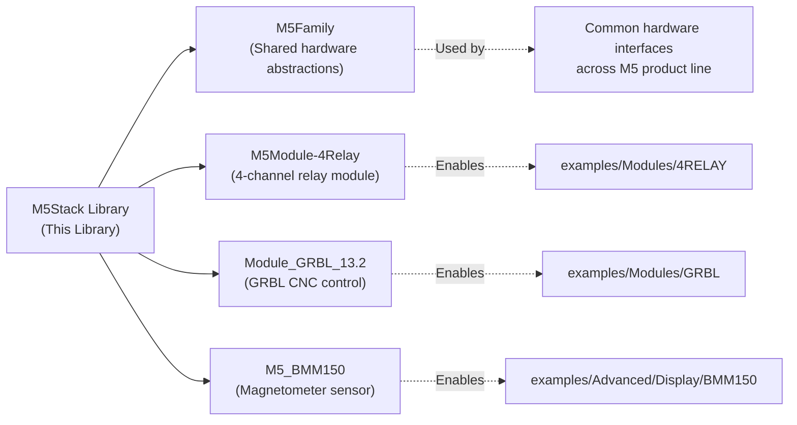
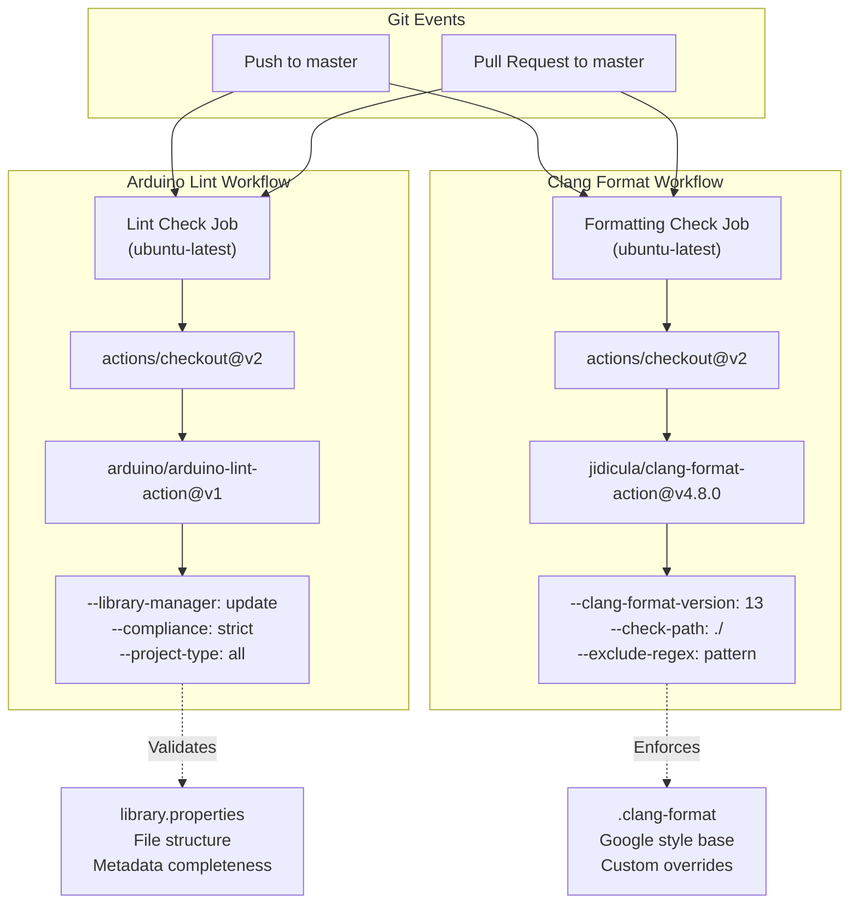

M5Stack Library Configuration and Build System

# Library Configuration and Build System

<details>
<summary>Relevant source files</summary>

The following files were used as context for generating this wiki page:

- [.clang-format](.clang-format)
- [.github/ISSUE_TEMPLATE/bug-report.yml](.github/ISSUE_TEMPLATE/bug-report.yml)
- [.github/workflows/Arduino-Lint-Check.yml](.github/workflows/Arduino-Lint-Check.yml)
- [.github/workflows/clang-format-check.yml](.github/workflows/clang-format-check.yml)
- [README.md](README.md)
- [docs/getting_started_cn.md](docs/getting_started_cn.md)
- [docs/getting_started_ja.md](docs/getting_started_ja.md)
- [library.json](library.json)
- [library.properties](library.properties)
- [src/gitTagVersion.h](src/gitTagVersion.h)

</details>


This document describes the library metadata, dependency management, version control, and continuous integration workflows used to package and distribute the M5Stack library. It covers the Arduino Library Manager integration (`library.properties`), PlatformIO support (`library.json`), CI/CD pipelines for code quality enforcement, and version management strategies. For information about the library's API and programming interface, see [API Reference and Keywords](#6.1). For examples of using the library in applications, see [Getting Started](#3).

## Overview

The M5Stack library is distributed through two primary package managers: Arduino Library Manager and PlatformIO Library Manager. Each requires specific metadata files and adheres to different specification formats. The repository also implements automated quality control through GitHub Actions workflows that enforce code formatting standards and library specification compliance.



**Diagram: Library Configuration and Distribution Architecture**

Sources: [library.properties:1-11](), [library.json:1-17](), [.github/workflows/Arduino-Lint-Check.yml:1-17](), [.github/workflows/clang-format-check.yml:1-24]()

## Library Metadata Files

### Arduino Library Properties

The `library.properties` file defines metadata for Arduino Library Manager integration following the Arduino library specification format. This file is mandatory for libraries published through the Arduino ecosystem.

| Property | Value | Purpose |
|----------|-------|---------|
| `name` | M5Stack | Library identifier in Arduino Library Manager |
| `version` | 0.4.6 | Semantic version number (MAJOR.MINOR.PATCH) |
| `author` | M5Stack | Author/organization name |
| `maintainer` | M5Stack | Current maintainer contact |
| `sentence` | Library for M5Stack Core development kit | Short description (< 80 chars) |
| `paragraph` | See more on http://M5Stack.com | Extended description |
| `category` | Device Control | Arduino library category classification |
| `url` | https://github.com/m5stack/m5stack | Repository homepage |
| `architectures` | esp32 | Target platform (ESP32 only) |
| `includes` | M5Stack.h | Primary header file for auto-include |
| `depends` | M5Family,M5Module-4Relay,Module_GRBL_13.2,M5_BMM150 | Comma-separated dependency list |

The `architectures=esp32` field restricts compilation to ESP32 targets, preventing compilation attempts on incompatible platforms like AVR or SAMD21.

Sources: [library.properties:1-11]()

### PlatformIO Library Manifest

The `library.json` file provides equivalent metadata for PlatformIO Library Manager using JSON format. This enables installation via PlatformIO's package management system.

```json
{
  "name": "M5Stack",
  "description": "Library for M5Stack Core development kit",
  "keywords": "M5Stack",
  "authors": {
    "name": "M5Stack",
    "url": "http://www.m5stack.com"
  },
  "repository": {
    "type": "git",
    "url": "https://github.com/m5stack/m5stack.git"
  },
  "version": "0.4.6",
  "frameworks": "arduino",
  "platforms": "espressif32",
  "headers": "M5Stack.h"
}
```

Key differences from Arduino format:
- **Frameworks**: Specifies `"arduino"` (Arduino framework) rather than bare ESP-IDF
- **Platforms**: Uses `"espressif32"` (PlatformIO platform name) instead of `"esp32"` (Arduino architecture)
- **Headers**: Singular `"headers"` field instead of `"includes"`
- **Dependencies**: Not specified in this file; PlatformIO resolves dependencies through library registry metadata

Sources: [library.json:1-17]()

## Dependency Management

The library declares four external dependencies in `library.properties`:



**Diagram: External Library Dependencies**

These dependencies are automatically resolved by Arduino Library Manager when users install the M5Stack library. The dependency chain enables:

1. **M5Family**: Provides cross-device compatibility abstractions used by multiple M5 products
2. **M5Module-4Relay**: Required for 4-relay module examples
3. **Module_GRBL_13.2**: Enables CNC/GRBL control module functionality
4. **M5_BMM150**: Supports BMM150 magnetometer sensor integration

Arduino Library Manager fetches these dependencies recursively during installation. Users can manually install them via:
```
Sketch > Include Library > Manage Libraries
```

Sources: [library.properties:11]()

## Version Management

The library maintains version information in two locations:

### Release Version (library.properties)

The canonical release version `0.4.6` is defined in both metadata files. This version follows semantic versioning:
- **Major** (0): Breaking API changes
- **Minor** (4): New features, backward compatible
- **Patch** (6): Bug fixes, backward compatible

The version is manually updated before each release and must match between `library.properties` and `library.json`.

Sources: [library.properties:2](), [library.json:13]()

### Git Version Header

The `gitTagVersion.h` header contains a preprocessor macro with git metadata:

```cpp
#define M5_LIB_VERSION F("0.2.3-dirty")
```

The `-dirty` suffix indicates uncommitted local changes exist. This macro can be used in firmware to display version information at runtime:

```cpp
M5.Lcd.printf("Library Version: %s", M5_LIB_VERSION);
```

**Note**: The version in `gitTagVersion.h` (0.2.3) is outdated compared to `library.properties` (0.4.6), suggesting this file is not part of the release process and may be auto-generated during development.

Sources: [src/gitTagVersion.h:1]()

## Continuous Integration Workflows

The repository implements two GitHub Actions workflows for automated quality control:



**Diagram: CI/CD Pipeline Architecture**

Sources: [.github/workflows/Arduino-Lint-Check.yml:1-17](), [.github/workflows/clang-format-check.yml:1-24]()

### Arduino Lint Check

The Arduino Lint workflow validates library specification compliance using the official Arduino lint action.

**Workflow Configuration:**
```yaml
name: Arduino Lint
on:
  push:
    branches: [ master ]
  pull_request:
    branches: [ master ]
jobs:
  lint:
    runs-on: ubuntu-latest
    steps:
      - uses: actions/checkout@v2
      - uses: arduino/arduino-lint-action@v1
        with:
          library-manager: update
          compliance: strict
          project-type: all
```

**Validation Checks:**
- `library-manager: update` - Validates against latest Arduino Library Specification
- `compliance: strict` - Enforces strict compliance (errors on warnings)
- `project-type: all` - Validates library, sketch, and platform specifications

The workflow checks:
1. `library.properties` format and required fields
2. File structure (src/, examples/ directories)
3. README.md presence and format
4. LICENSE file existence
5. Example sketch validity
6. Metadata consistency

Failures block pull request merges, ensuring specification compliance before code reaches the master branch.

Sources: [.github/workflows/Arduino-Lint-Check.yml:1-17]()

### Clang Format Check

The Clang Format workflow enforces consistent code styling across the codebase using Clang Format v13 with a custom configuration based on Google style.

**Workflow Configuration:**
```yaml
name: Clang Format
on: [push, pull_request]
jobs:
  formatting-check:
    runs-on: ubuntu-latest
    strategy:
      matrix:
        path:
          - check: './'
            exclude: '(Fonts|utility|RFID|THERMAL_MLX90640|HEART_MAX30100|Display|AC-SOCKET|BALA2)'
```

**Exclusion Strategy:**
The workflow excludes specific directories containing:
- **Fonts**: Generated font data (not manually formatted)
- **utility**: Third-party libraries with external formatting
- **RFID, THERMAL_MLX90640, HEART_MAX30100**: Legacy hardware drivers
- **Display**: External display libraries
- **AC-SOCKET, BALA2**: Module examples with specific formatting

This matrix-based approach allows multiple check/exclude path combinations in a single workflow.

Sources: [.github/workflows/clang-format-check.yml:1-24]()

### Clang Format Configuration

The `.clang-format` file defines 150+ style rules based on Google C++ style with M5Stack-specific customizations:

**Key Configuration Overrides:**

| Setting | Value | Purpose |
|---------|-------|---------|
| `BasedOnStyle` | Google | Inherits Google C++ style guide defaults |
| `ColumnLimit` | 120 | Maximum line length (extended from Google's 80) |
| `IndentWidth` | 4 | Tab width (Google default is 2) |
| `AllowShortFunctionsOnASingleLine` | false | Forces function bodies to multi-line format |
| `AlignConsecutiveAssignments` | true | Aligns `=` operators in consecutive assignments |
| `AlignConsecutiveMacros` | true | Aligns `#define` macro definitions |
| `BreakBeforeBraces` | Custom | Custom brace placement rules |
| `AfterFunction` | true | Places opening brace on new line for functions |

**Notable Exclusions:**
```yaml
BreakBeforeBraces: Custom
BraceWrapping:
  AfterFunction:   true    # void foo()\n{
  AfterClass:      false   # class Foo {
  AfterControlStatement: false  # if (x) {
```

Functions use Allman style (brace on new line), while classes and control statements use K&R style (brace on same line).

Sources: [.clang-format:1-168]()

## Build System Integration

### Arduino IDE Integration

**Installation via Library Manager:**
1. Open Arduino IDE
2. Navigate to `Sketch > Include Library > Manage Libraries`
3. Search for "M5Stack"
4. Click "Install" (automatically resolves dependencies)

**Manual Installation:**
1. Download repository as ZIP
2. `Sketch > Include Library > Add .ZIP Library`
3. Manually install dependencies: M5Family, M5Module-4Relay, Module_GRBL_13.2, M5_BMM150

**Board Configuration:**
- **Board**: ESP32 Dev Module (or M5Stack-specific board definition)
- **Upload Speed**: 921600
- **Flash Frequency**: 80MHz
- **Partition Scheme**: Default 4MB with spiffs

The `architectures=esp32` field in `library.properties` ensures the library only appears for ESP32 board selections.

Sources: [library.properties:9](), [README.md:56]()

### PlatformIO Integration

**Installation via platformio.ini:**
```ini
[env:m5stack-core-esp32]
platform = espressif32
board = m5stack-core-esp32
framework = arduino
lib_deps =
    M5Stack
```

PlatformIO automatically:
1. Downloads `library.json` from registry
2. Resolves transitive dependencies
3. Links library headers to project
4. Configures build flags for ESP32 platform

**Manual Installation:**
```bash
pio lib install "M5Stack"
```

The `"platforms": "espressif32"` field restricts installation to ESP32-based projects.

Sources: [library.json:15](), [README.md:75]()

## Deprecation Status and Migration

The library is officially deprecated as indicated by the prominent warning in README.md:

```markdown
# 🚫 Deprecated — Use M5GFX & M5Unified
```

**Migration Targets:**
- **M5GFX**: Replaces display and graphics functionality (TFT_eSPI wrapper)
- **M5Unified**: Replaces hardware abstraction (power, buttons, IMU, speaker)

The metadata files (`library.properties`, `library.json`) remain maintained at version 0.4.6 for legacy support, but no new features are planned. Users should migrate to the modular M5GFX + M5Unified architecture for new projects.

**CI/CD Status:**
Both workflows continue to run, ensuring:
- Existing code remains specification-compliant (Arduino Lint badge: [](https://github.com/m5stack/M5Stack/actions/workflows/Arduino-Lint-Check.yml))
- Code formatting consistency is maintained (Clang Format badge: [](https://github.com/m5stack/M5Stack/actions/workflows/clang-format-check.yml))

Sources: [README.md:1-14]()