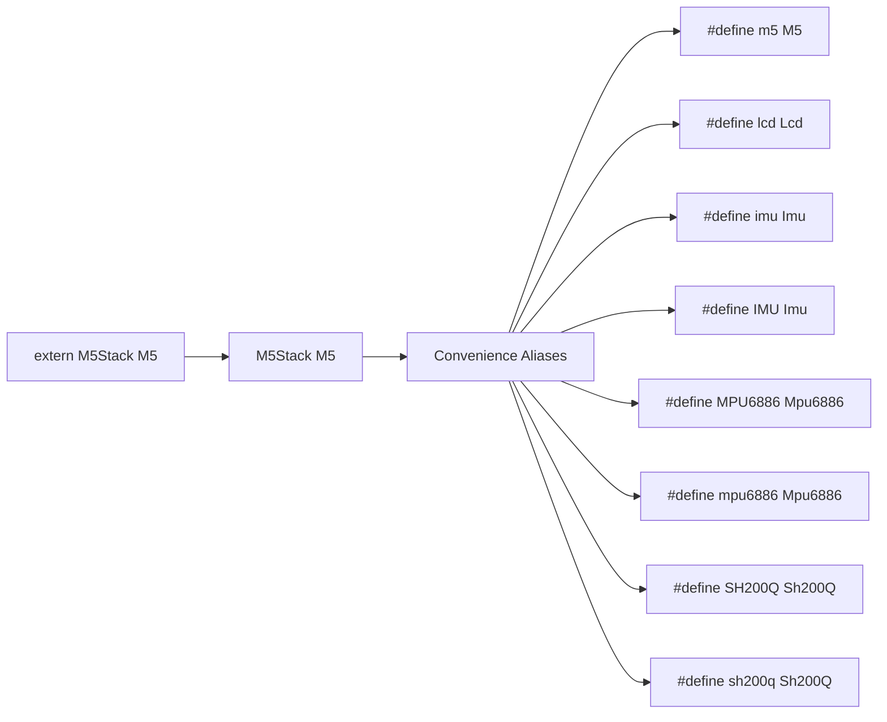
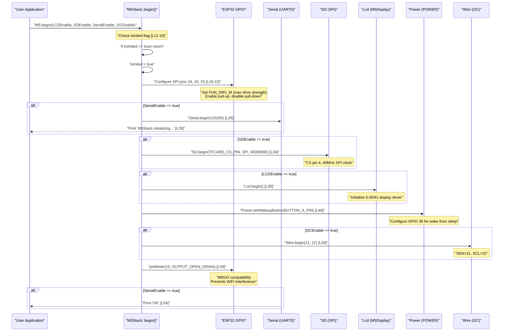
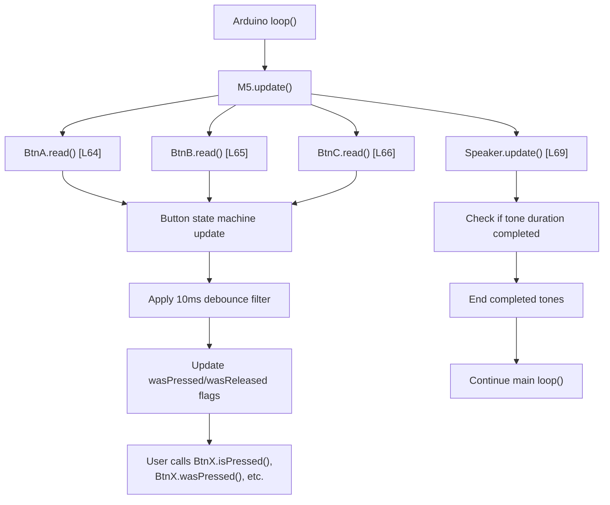
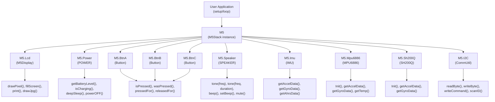

M5Stack M5Stack Class and Initialization

# M5Stack Class and Initialization

<details>
<summary>Relevant source files</summary>

The following files were used as context for generating this wiki page:

- [src/M5Stack.cpp](src/M5Stack.cpp)
- [src/M5Stack.h](src/M5Stack.h)
- [src/utility/Power.cpp](src/utility/Power.cpp)
- [src/utility/Power.h](src/utility/Power.h)

</details>


This document covers the core `M5Stack` class that serves as the main hardware abstraction interface for M5Stack Basic and Gray devices. It explains the class structure, the global `M5` instance, initialization process, and the primary interface for accessing hardware subsystems.

For detailed information about specific subsystems, refer to [Display and Graphics System](#2.2), [Power Management](#2.3), and [IMU and Motion Sensing](#2.4).

## M5Stack Class Architecture

The `M5Stack` class acts as the central coordinator and hardware abstraction layer, providing unified access to all device subsystems through a single global instance.

### Class Structure and Components

M5Stack Class Diagram

```mermaid
classDiagram
    class M5Stack {
        -bool isInited
        +M5Stack()
        +void begin(bool LCDEnable, bool SDEnable, bool SerialEnable, bool I2CEnable)
        +void update()
        +void setPowerBoostKeepOn(bool en)
        +void setWakeupButton(uint8_t button)
        +void powerOFF()
    }
    
    class M5Display {
        +void begin()
        +void setBrightness(uint8_t brightness)
        +void drawPixel(int16_t x, int16_t y, uint16_t color)
        +void fillScreen(uint16_t color)
        +size_t print(const char*)
    }
    
    class POWER {
        +void begin()
        +bool setPowerBoostKeepOn(bool en)
        +bool isChargeFull()
        +int8_t getBatteryLevel()
        +void deepSleep(uint64_t time_in_us)
        +void powerOFF()
    }
    
    class Button {
        +void read()
        +bool isPressed()
        +bool wasPressed()
        +bool pressedFor(uint32_t ms)
    }
    
    class SPEAKER {
        +void tone(uint32_t freq)
        +void beep()
        +void update()
    }
    
    class IMU {
        +void getAccelData(float* ax, float* ay, float* az)
        +void getGyroData(float* gx, float* gy, float* gz)
        +void getAhrsData(float* pitch, float* roll, float* yaw)
    }
    
    class MPU6886 {
        +void Init()
        +void getAccelData(float* ax, float* ay, float* az)
        +void getGyroData(float* gx, float* gy, float* gz)
    }
    
    class SH200Q {
        +void Init()
        +void getAccelData(float* ax, float* ay, float* az)
        +void getGyroData(float* gx, float* gy, float* gz)
    }
    
    class CommUtil {
        +bool readByte(uint8_t address, uint8_t subAddress, uint8_t* data)
        +bool writeByte(uint8_t address, uint8_t subAddress, uint8_t data)
        +bool writeCommand(uint8_t address, uint8_t subAddress)
    }
    
    M5Stack *-- M5Display : "Lcd"
    M5Stack *-- POWER : "Power"
    M5Stack *-- Button : "BtnA (GPIO39)"
    M5Stack *-- Button : "BtnB (GPIO38)"
    M5Stack *-- Button : "BtnC (GPIO37)"
    M5Stack *-- SPEAKER : "Speaker"
    M5Stack *-- IMU : "Imu"
    M5Stack *-- MPU6886 : "Mpu6886"
    M5Stack *-- SH200Q : "Sh200Q"
    M5Stack *-- CommUtil : "I2C"
```



The `M5Stack` class constructor initializes the `isInited` flag to `false` [src/M5Stack.cpp:7-8](), providing initialization-once protection. All hardware subsystem objects are initialized as member variables with direct instantiation [src/M5Stack.h:129-159]().

Sources: [src/M5Stack.h:118-170](), [src/M5Stack.cpp:7-8]()
</thinking>

### Hardware Subsystem Interface

| Subsystem | Member Variable | Type | Purpose | GPIO/Hardware |
|-----------|----------------|------|---------|---------------|
| Display | `Lcd` | `M5Display` | 320x240 TFT LCD control and graphics | SPI: MOSI=23, MISO=19, CLK=18, CS=14 |
| Power Management | `Power` | `POWER` | Battery, charging, and power states | I2C: 0x75 (IP5306) |
| Button A | `BtnA` | `Button` | Left hardware button | GPIO 39 (INPUT, pull-up) |
| Button B | `BtnB` | `Button` | Center hardware button | GPIO 38 (INPUT, pull-up) |
| Button C | `BtnC` | `Button` | Right hardware button | GPIO 37 (INPUT, pull-up) |
| Audio | `Speaker` | `SPEAKER` | Built-in speaker control | GPIO 25 (DAC output) |
| Motion Sensors | `Imu` | `IMU` | Accelerometer and gyroscope interface | I2C: 0x68 (MPU6886/SH200Q) |
| IMU Driver 1 | `Mpu6886` | `MPU6886` | MPU6886 sensor driver | I2C: 0x68 |
| IMU Driver 2 | `Sh200Q` | `SH200Q` | SH200Q sensor driver | I2C: 0x68 |
| I2C Communication | `I2C` | `CommUtil` | I2C bus utilities | SDA=21, SCL=22 |

Button objects are instantiated with `DEBOUNCE_MS` set to `10` milliseconds [src/M5Stack.h:135-144]() to provide stable input readings.

Sources: [src/M5Stack.h:129-159](), [src/M5Stack.h:135]()

### Hardware Subsystem Interface

| Subsystem | Member Variable | Type | Purpose |
|-----------|----------------|------|---------|
| Display | `Lcd` | `M5Display` | 320x240 TFT LCD control and graphics |
| Power Management | `Power` | `POWER` | Battery, charging, and power states |
| Button A | `BtnA` | `Button` | Left hardware button |
| Button B | `BtnB` | `Button` | Center hardware button |
| Button C | `BtnC` | `Button` | Right hardware button |
| Audio | `Speaker` | `SPEAKER` | Built-in speaker control |
| Motion Sensors | `Imu` | `IMU` | Accelerometer and gyroscope interface |
| IMU Driver 1 | `Mpu6886` | `MPU6886` | MPU6886 sensor driver |
| IMU Driver 2 | `Sh200Q` | `SH200Q` | SH200Q sensor driver |
| I2C Communication | `I2C` | `CommUtil` | I2C bus utilities |

Sources: [src/M5Stack.h:129-159]()

## Global M5 Instance and Aliases

The library provides a global `M5Stack` instance and convenience aliases for easier access to common components.

### Global Instance Declaration



The global instance is declared as `extern M5Stack M5` and defined as `M5Stack M5` in the implementation. Several preprocessor aliases provide alternative naming conventions:

- `m5` → `M5` (lowercase alternative)
- `lcd` → `Lcd` (direct LCD access)
- `imu`/`IMU` → `Imu` (IMU access variants)
- `mpu6886`/`MPU6886` → `Mpu6886` (MPU6886 driver variants)
- `sh200q`/`SH200Q` → `Sh200Q` (SH200Q driver variants)

Sources: [src/M5Stack.h:172-183](), [src/M5Stack.cpp:94]()

## Initialization Process

The `begin()` method initializes all hardware subsystems in a specific order to ensure proper device startup.

### Initialization Sequence

M5Stack begin() Initialization Flow



The initialization sequence includes critical hardware setup operations:

1. **Initialization Guard** [src/M5Stack.cpp:12-16](): The `isInited` flag prevents multiple initialization attempts. Once set to `true`, subsequent calls to `begin()` return immediately without re-initializing hardware.

2. **SPI Pin Configuration** [src/M5Stack.cpp:18-22](): GPIO pins 18 (CLK), 19 (MISO), and 23 (MOSI) are configured with maximum drive strength (`FUN_DRV_M`) and pull-up resistors enabled. This ensures reliable SPI communication with the LCD and SD card.

3. **GPIO 15 Open-Drain Mode** [src/M5Stack.cpp:59](): This pin is configured as open-drain output to maintain compatibility with M5GO accessories and prevent interference with WiFi operation.

### Initialization Parameters

| Parameter | Type | Default | Purpose | Notes |
|-----------|------|---------|---------|-------|
| `LCDEnable` | `bool` | `true` | Initialize the 320x240 ILI9341 TFT display | Calls `Lcd.begin()` |
| `SDEnable` | `bool` | `true` | Initialize SD card on shared SPI bus | CS pin 4, 40MHz clock |
| `SerialEnable` | `bool` | `true` | Initialize Serial port at 115200 baud | UART0, prints status messages |
| `I2CEnable` | `bool` | `false` | Initialize I2C bus on pins 21 (SDA) / 22 (SCL) | Required for Power IC and IMU access |

**Important**: The `I2CEnable` parameter defaults to `false` for backward compatibility. Applications that need to use the Power management features (battery level, charging status) or IMU sensors must explicitly call `M5.begin()` with `I2CEnable = true`, or manually call `Wire.begin(21, 22)` after initialization [src/M5Stack.cpp:49-51]().

Sources: [src/M5Stack.cpp:10-60](), [src/M5Stack.h:121-122]()

## Main Loop Integration

The `update()` method must be called regularly in the main loop to maintain hardware state and process input events.

### Update Process Flow

M5Stack update() Execution Sequence



The `update()` method [src/M5Stack.cpp:62-70]() performs these operations in sequence:

1. **Button State Update** [src/M5Stack.cpp:64-66](): Calls `read()` on each of the three `Button` objects (`BtnA`, `BtnB`, `BtnC`). Each button applies a 10ms debounce filter and updates internal state flags (`_state`, `_lastChange`, `_wasPressed`, `_wasReleased`).

2. **Speaker Tone Management** [src/M5Stack.cpp:69](): Calls `Speaker.update()` to check if any active tone has reached its duration limit. If complete, the tone is automatically ended.

3. **State Query Preparation**: After `update()` completes, user code can call button query methods like `isPressed()`, `wasPressed()`, `wasReleased()`, and `pressedFor()` to detect user input events.

**Best Practice**: Call `M5.update()` at the beginning of every `loop()` iteration to ensure button states and speaker timing remain synchronized with hardware events.

Sources: [src/M5Stack.cpp:62-70](), [src/M5Stack.h:125-126]()

## Hardware Abstraction Interface

The M5Stack class provides a unified interface to access all hardware components through member objects.

### Component Access Pattern

Hardware Subsystem Access Through M5 Global Object



All hardware subsystems are accessed through public member variables of the global `M5` object [src/M5Stack.h:129-159](). This facade pattern provides a unified interface that simplifies hardware access and hides low-level driver complexity.

Sources: [src/M5Stack.h:129-159]()

### Legacy Compatibility Methods

The `M5Stack` class includes three deprecated methods that redirect to the `POWER` subsystem for backward compatibility with older code:

| Deprecated Method | Current Equivalent | Function |
|-------------------|-------------------|----------|
| `M5.setPowerBoostKeepOn(bool en)` | `M5.Power.setPowerBoostKeepOn(bool en)` | Keep power boost enabled when load drops |
| `M5.setWakeupButton(uint8_t button)` | `M5.Power.setWakeupButton(uint8_t button)` | Configure GPIO for wake from deep sleep |
| `M5.powerOFF()` | `M5.Power.deepSleep()` | Enter deep sleep mode |

**Implementation**: Each deprecated method [src/M5Stack.cpp:76-92]() simply calls the corresponding `M5.Power.*` method. For example:

```cpp
void M5Stack::setPowerBoostKeepOn(bool en) {
    M5.Power.setPowerBoostKeepOn(en);  // Forward to Power class
}
```

These methods are marked with `__attribute__((deprecated))` [src/M5Stack.h:164-166]() and will trigger compiler warnings. New code should use the `M5.Power.*` methods directly. These legacy methods will be removed in a future major version release.

Sources: [src/M5Stack.cpp:76-92](), [src/M5Stack.h:164-166]()

## ESP32 Platform Requirement

The library includes a compile-time check to ensure it only compiles on ESP32-based platforms:

```cpp
#if defined(ESP32)
// M5Stack library code
#else
#error "This library only supports boards with ESP32 processor."
#endif
```

This ensures the hardware-specific code only runs on compatible microcontrollers.

Sources: [src/M5Stack.h:99-184]()