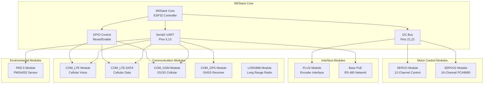
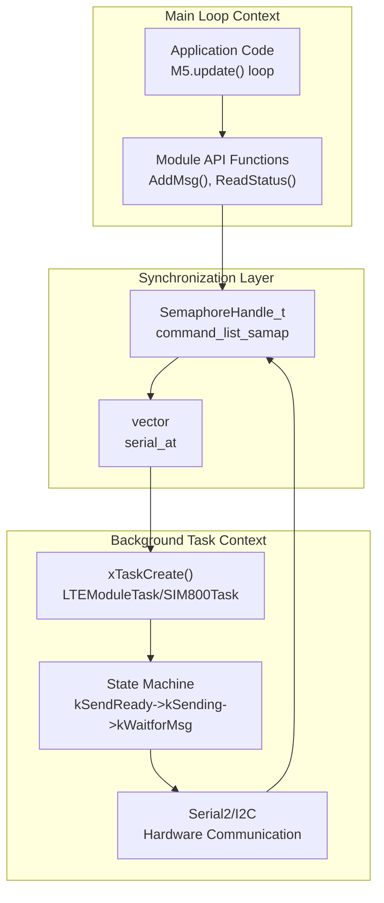
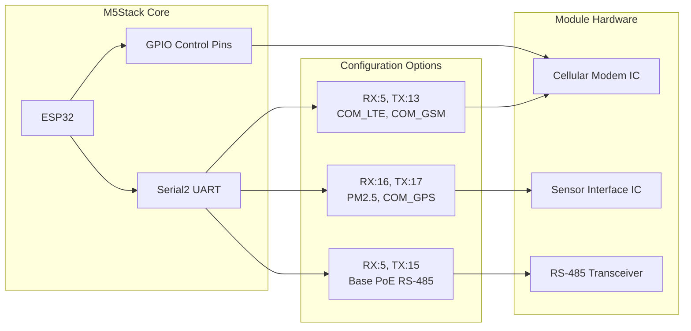

M5Stack M5Stack Modules

# M5Stack Modules

Relevant source files

The following files were used as context for generating this wiki page:

- [examples/Modules/Base_PoE/RS_485/RS_485.ino](examples/Modules/Base_PoE/RS_485/RS_485.ino)
- [examples/Modules/COM_GPS/COM_GPS.ino](examples/Modules/COM_GPS/COM_GPS.ino)
- [examples/Modules/COM_GSM/COM_GSM.ino](examples/Modules/COM_GSM/COM_GSM.ino)
- [examples/Modules/COM_LTE-DATA/COM_LTE-DATA.ino](examples/Modules/COM_LTE-DATA/COM_LTE-DATA.ino)
- [examples/Modules/COM_LTE/COM_LTE.ino](examples/Modules/COM_LTE/COM_LTE.ino)
- [examples/Modules/LORA868_SX1276/LoRa868Duplex/LoRa868Duplex.ino](examples/Modules/LORA868_SX1276/LoRa868Duplex/LoRa868Duplex.ino)
- [examples/Modules/PLUS/PLUS.ino](examples/Modules/PLUS/PLUS.ino)
- [examples/Modules/PM2.5_PMSA003/PM2.5_PMSA003.ino](examples/Modules/PM2.5_PMSA003/PM2.5_PMSA003.ino)
- [examples/Modules/SERVO/SERVO.ino](examples/Modules/SERVO/SERVO.ino)
- [examples/Modules/SERVO2_PCA9685/SERVO2_PCA9685.ino](examples/Modules/SERVO2_PCA9685/SERVO2_PCA9685.ino)

M5Stack Modules are complex, multi-functional hardware expansion boards that extend M5Stack Core capabilities through sophisticated integrated circuits and communication protocols. Unlike the simpler M5Stack Units documented in page [4](#4), modules typically integrate multiple subsystems, require complex initialization sequences, and often implement real-time processing using FreeRTOS tasks.

This page provides an overview of M5Stack Modules architecture and integration patterns. Detailed documentation for specific module categories can be found in:
- **Communication Modules** ([5.1](#5.1)): Wireless and cellular modules with AT command processing
- **Motor Control and Robotics** ([5.2](#5.2)): Servo control and balancing robot systems  
- **Network and IoT Modules** ([5.3](#5.3)): Ethernet, GPS, and environmental sensor modules

## Module Architecture Overview

M5Stack Modules follow a layered architecture pattern that abstracts complex hardware functionality through standardized communication interfaces. The modules integrate with the M5Stack Core through UART, I2C, or SPI protocols and often implement internal state machines for autonomous operation.

**Sources:** [examples/Modules/COM_LTE/COM_LTE.ino:286](), [examples/Modules/SERVO/SERVO.ino:30](), [examples/Modules/PM2.5_PMSA003/PM2.5_PMSA003.ino:42]()

## FreeRTOS Task-Based Module Architecture

M5Stack Modules frequently implement asynchronous processing using FreeRTOS tasks to handle time-sensitive operations without blocking the main application loop. This architectural pattern is essential for communication modules that must process incoming data streams and manage command timeouts.

### Task-Based Processing Pattern

The following pattern is used across multiple module types, particularly communication modules:

This architecture separates application logic from hardware communication timing, enabling non-blocking operation while maintaining deterministic response handling. Communication modules use this pattern extensively (detailed in [5.1](#5.1)), while motor control modules implement simpler synchronous patterns.

**Sources:** [examples/Modules/COM_LTE/COM_LTE.ino:68-151](), [examples/Modules/COM_LTE/COM_LTE.ino:314-316](), [examples/Modules/COM_GSM/COM_GSM.ino:67-150]()

## Module Categories and Communication Interfaces

M5Stack Modules utilize different communication protocols based on their functional requirements. The following table summarizes the primary module categories:

| Category | Example Modules | Interface | Key Features |
|----------|----------------|-----------|--------------|
| Communication | COM_LTE, COM_GSM, LoRa868 | UART (Serial2) | AT command processing, FreeRTOS tasks |
| Motor Control | SERVO, SERVO2, BALA2 | I2C, GPIO | PWM generation, multi-channel control |
| Network/IoT | Base PoE, COM_GPS, PM2.5 | UART, I2C | RS-485, NMEA parsing, sensor integration |
| Interface | PLUS Module | I2C | Rotary encoder, digital input |

Detailed documentation for each category:
- Communication module architecture and AT command processing: See [5.1](#5.1)
- Motor control systems and robotics modules: See [5.2](#5.2)  
- Network connectivity and environmental sensors: See [5.3](#5.3)

**Sources:** [examples/Modules/SERVO/SERVO.ino:20](), [examples/Modules/COM_LTE/COM_LTE.ino:286](), [examples/Modules/PM2.5_PMSA003/PM2.5_PMSA003.ino:42](), [examples/Modules/PLUS/PLUS.ino:19]()

## Hardware Communication Patterns

M5Stack Modules interface with the M5Stack Core through standardized communication protocols. Understanding these patterns is essential for module integration.

### UART-Based Module Communication

UART-based modules use `Serial2` with configurable TX/RX pins to accommodate different module configurations:

**Sources:** [examples/Modules/COM_LTE/COM_LTE.ino:286](), [examples/Modules/PM2.5_PMSA003/PM2.5_PMSA003.ino:42](), [examples/Modules/Base_PoE/RS_485/RS_485.ino:23](), [examples/Modules/COM_GPS/COM_GPS.ino:31]()

### I2C-Based Module Communication

I2C modules share the standard I2C bus (SDA:21, SCL:22) and use unique addresses for device selection:

| Module | I2C Address | Data Type | Access Pattern |
|--------|-------------|-----------|----------------|
| SERVO | 0x53 | Command registers | `Wire.beginTransmission()` |
| SERVO2 (PCA9685) | 0x40 | PWM control | `Adafruit_PWMServoDriver` |
| PLUS | 0x62 | Encoder state | `Wire.requestFrom()` |

**Sources:** [examples/Modules/SERVO/SERVO.ino:20](), [examples/Modules/SERVO2_PCA9685/SERVO2_PCA9685.ino:21](), [examples/Modules/PLUS/PLUS.ino:19]()

## Module Integration Patterns

M5Stack Modules follow consistent integration patterns that enable reliable communication and error handling:

1. **Hardware Initialization**: Reset sequences using GPIO control pins
2. **Communication Setup**: Protocol-specific initialization (UART baud rates, I2C addresses)
3. **Task Management**: FreeRTOS task creation for asynchronous processing
4. **State Synchronization**: Semaphore-based resource protection
5. **Error Recovery**: Timeout handling and retry mechanisms

These patterns ensure robust operation in embedded environments while maintaining compatibility with the M5Stack ecosystem.

**Sources:** [examples/Modules/COM_LTE/COM_LTE.ino:314-316](), [examples/Modules/SERVO/SERVO.ino:24-30](), [examples/Modules/PM2.5_PMSA003/PM2.5_PMSA003.ino:39-55]()