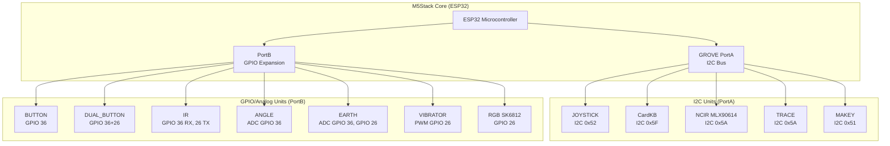
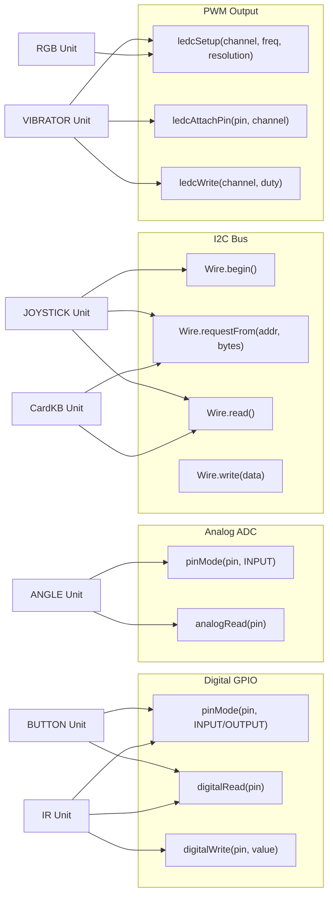
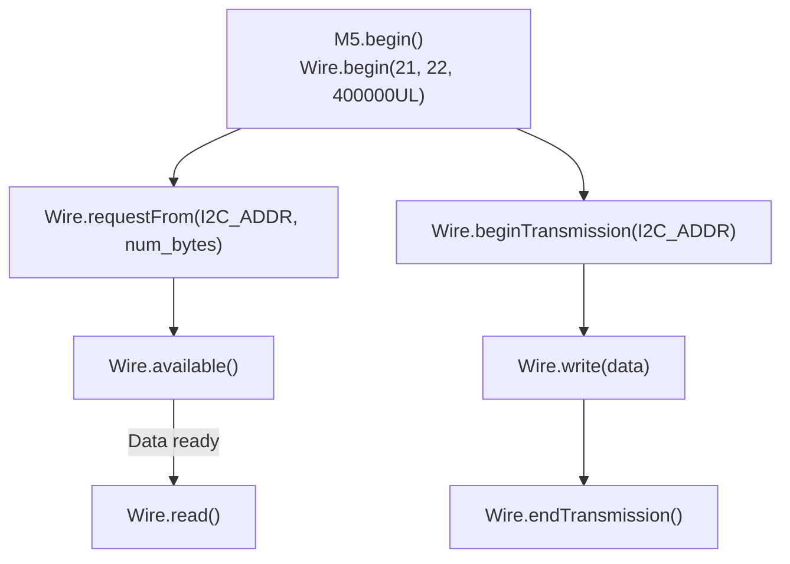
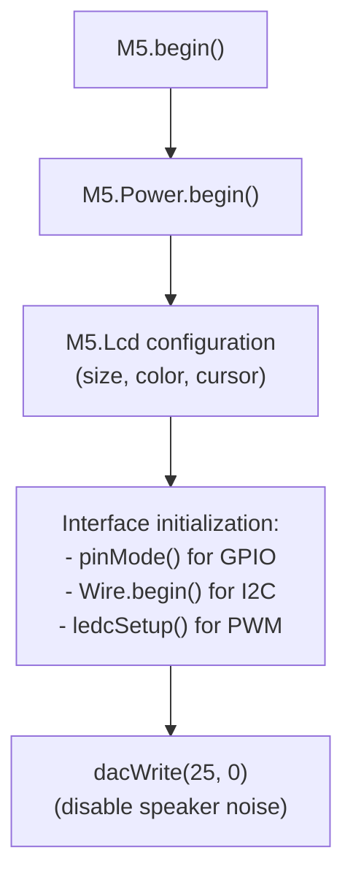

M5Stack M5Stack Units

# M5Stack Units

<details>
<summary>Relevant source files</summary>

The following files were used as context for generating this wiki page:

- [examples/Unit/ANGLE/ANGLE.ino](examples/Unit/ANGLE/ANGLE.ino)
- [examples/Unit/BUTTON/BUTTON.ino](examples/Unit/BUTTON/BUTTON.ino)
- [examples/Unit/CardKB/CardKB.ino](examples/Unit/CardKB/CardKB.ino)
- [examples/Unit/DUAL_BUTTON/DUAL_BUTTON.ino](examples/Unit/DUAL_BUTTON/DUAL_BUTTON.ino)
- [examples/Unit/EARTH/EARTH.ino](examples/Unit/EARTH/EARTH.ino)
- [examples/Unit/IR/IR.ino](examples/Unit/IR/IR.ino)
- [examples/Unit/JOYSTICK/JOYSTICK.ino](examples/Unit/JOYSTICK/JOYSTICK.ino)
- [examples/Unit/MAKEY/MAKEY.ino](examples/Unit/MAKEY/MAKEY.ino)
- [examples/Unit/NCIR_MLX90614/NCIR_MLX90614.ino](examples/Unit/NCIR_MLX90614/NCIR_MLX90614.ino)
- [examples/Unit/RGB_SK6812/RGB_SK6812.ino](examples/Unit/RGB_SK6812/RGB_SK6812.ino)
- [examples/Unit/TRACE/TRACE.ino](examples/Unit/TRACE/TRACE.ino)
- [examples/Unit/VIBRATOR/VIBRATOR.ino](examples/Unit/VIBRATOR/VIBRATOR.ino)

</details>


## Purpose and Scope

This document provides an overview of M5Stack Units, which are small modular sensor and actuator peripherals designed to connect to the M5Stack Core via standardized ports. Units enable rapid prototyping by providing pre-assembled hardware modules with simple interfaces.

This page covers:
- Unit hardware architecture and connection methods
- Interface types (GPIO, I2C, analog, PWM) and their characteristics
- General integration patterns and code examples
- Pin assignments and hardware resource allocation

For detailed documentation of specific Units and their APIs, see:
- **[Basic I/O and Interface Units](#4.1)** - Simple GPIO, analog, and I2C Units
- **[Advanced Sensor Units](#4.2)** - Complex Units with specialized protocols

For documentation of larger expansion boards that provide more sophisticated functionality, see **[M5Stack Modules](#5)**.

---

## Hardware Architecture and Connection Ports

M5Stack Units connect to the Core device through two primary expansion ports: **GROVE PortA** (I2C bus) and **PortB** (GPIO). These ports provide standardized physical and electrical interfaces for rapid integration.

### Physical Connection Diagram



**Sources:** [examples/Unit/JOYSTICK/JOYSTICK.ino:15](), [examples/Unit/CardKB/CardKB.ino:15](), [examples/Unit/BUTTON/BUTTON.ino:22](), [examples/Unit/DUAL_BUTTON/DUAL_BUTTON.ino:22-23](), [examples/Unit/ANGLE/ANGLE.ino:15]()

### GPIO Pin Assignments

The following table shows the standard GPIO assignments used by Units connected to PortB:

| Pin | Primary Function | Secondary Function | Example Units |
|-----|------------------|-------------------|---------------|
| GPIO 36 | Analog Input (ADC1_CH0) | Digital Input | BUTTON, ANGLE, EARTH, IR (RX) |
| GPIO 26 | Digital Output/Input | PWM Output, DAC | DUAL_BUTTON, VIBRATOR, IR (TX), RGB LEDs |
| GPIO 21 | I2C SDA (PortA) | - | All I2C Units |
| GPIO 22 | I2C SCL (PortA) | - | All I2C Units |

**Sources:** [examples/Unit/BUTTON/BUTTON.ino:22](), [examples/Unit/ANGLE/ANGLE.ino:15](), [examples/Unit/VIBRATOR/VIBRATOR.ino:15](), [examples/Unit/IR/IR.ino:15-16]()

---

## Interface Type Classification

Units are categorized by their communication interface, which determines how the M5Stack Core interacts with them. The interface type affects initialization code, data reading patterns, and hardware resource requirements.

### Interface Types and Code Patterns



**Sources:** [examples/Unit/BUTTON/BUTTON.ino:22,32](), [examples/Unit/ANGLE/ANGLE.ino:24,32](), [examples/Unit/JOYSTICK/JOYSTICK.ino:24,31-36](), [examples/Unit/VIBRATOR/VIBRATOR.ino:26-31]()

### Units by Interface Type

| Interface Type | Units | Key Characteristics | Shared Resource |
|----------------|-------|---------------------|-----------------|
| **Digital GPIO** | BUTTON, DUAL_BUTTON, IR, EARTH | Simple on/off states, button detection | Individual GPIO pins |
| **Analog ADC** | ANGLE, EARTH | Variable voltage reading (0-4095 range) | ADC channels on GPIO 36 |
| **I2C Bus** | JOYSTICK, CardKB, NCIR, TRACE, MAKEY | Multi-byte data, addressable devices | Wire bus (GPIO 21/22) |
| **PWM/LEDC** | VIBRATOR, RGB LEDs | Variable duty cycle output for control | LEDC channels |
| **Serial Protocol** | RGB SK6812 | Timing-based data transmission | GPIO pin for data |

**Sources:** [examples/Unit/BUTTON/BUTTON.ino](), [examples/Unit/ANGLE/ANGLE.ino](), [examples/Unit/JOYSTICK/JOYSTICK.ino](), [examples/Unit/VIBRATOR/VIBRATOR.ino](), [examples/Unit/RGB_SK6812/RGB_SK6812.ino]()

---

## Digital GPIO Units

Digital GPIO Units use binary logic levels for input or output operations. They are the simplest interface type and require minimal initialization.

### Code Pattern: Digital Input (Button Detection)

The standard pattern for reading digital Units involves:
1. Configure pin mode with `pinMode(pin, INPUT)`
2. Read state with `digitalRead(pin)`
3. Implement debouncing logic to filter transient states

**Example: BUTTON Unit**

```
Setup:
- pinMode(36, INPUT)

Loop:
- cur_value = digitalRead(36)
- Compare with last_value for state change detection
- 0 = button pressed, 1 = button released
```

**Sources:** [examples/Unit/BUTTON/BUTTON.ino:22,32,39-55]()

**Example: DUAL_BUTTON Unit**

The DUAL_BUTTON Unit extends this pattern to monitor two independent buttons:

```
Setup:
- pinMode(36, INPUT)  // Button 1
- pinMode(26, INPUT)  // Button 2

Loop:
- cur_value1 = digitalRead(36)
- cur_value2 = digitalRead(26)
- Independent state tracking for each button
```

**Sources:** [examples/Unit/DUAL_BUTTON/DUAL_BUTTON.ino:22-23,33-34]()

### Code Pattern: Digital Output and Input (IR Unit)

The IR Unit demonstrates bidirectional GPIO usage:
- GPIO 26: Output for IR LED transmission
- GPIO 36: Input for IR receiver detection

```
Setup:
- pinMode(36, INPUT)        // IR receiver
- pinMode(26, OUTPUT)       // IR transmitter
- digitalWrite(26, 1)       // Enable IR LED

Loop:
- cur_value = digitalRead(36)
- 0 = IR signal detected
- 1 = no IR signal
```

**Sources:** [examples/Unit/IR/IR.ino:15-16,25-26,30,41-48]()

---

## Analog ADC Units

Analog Units use the ESP32's ADC (Analog-to-Digital Converter) to measure variable voltage levels. The ADC converts the analog signal to a 12-bit digital value (0-4095).

### Code Pattern: Analog Reading

**Example: ANGLE Unit (Potentiometer)**

```
Setup:
- pinMode(36, INPUT)
- dacWrite(25, 0)  // Disable speaker noise

Loop:
- cur_value = analogRead(36)
- Returns value 0-4095 representing rotation angle
- Implement debouncing with threshold comparison
```

The ANGLE Unit reads a potentiometer position. The example implements software debouncing by comparing the current reading with the previous value and only updating the display if the change exceeds a threshold:

```cpp
if (abs(cur_sensorValue - last_sensorValue) > 10) {
    // Value changed significantly, update display
}
```

**Sources:** [examples/Unit/ANGLE/ANGLE.ino:15,24-25,32-39]()

**Example: EARTH Unit (Soil Moisture Sensor)**

The EARTH Unit provides both analog and digital outputs:
- GPIO 36: Analog voltage proportional to soil moisture
- GPIO 26: Digital output (threshold detection)

```
Setup:
- pinMode(26, INPUT)
- dacWrite(25, 0)

Loop:
- analog_value = analogRead(36)
- digital_state = digitalRead(26)
```

**Sources:** [examples/Unit/EARTH/EARTH.ino:21-23,28-29]()

---

## I2C Bus Units

I2C Units share a common two-wire communication bus, allowing multiple devices to coexist using unique 7-bit addresses. The Wire library provides the interface for I2C communication.

### I2C Communication Pattern



**Sources:** [examples/Unit/JOYSTICK/JOYSTICK.ino:24,31-36](), [examples/Unit/NCIR_MLX90614/NCIR_MLX90614.ino:28-36]()

### I2C Address Map

| Unit | I2C Address | Data Format | Example File |
|------|-------------|-------------|--------------|
| JOYSTICK | 0x52 | 3 bytes: X, Y, Button | [examples/Unit/JOYSTICK/JOYSTICK.ino:15]() |
| CardKB | 0x5F | 1 byte: Key code | [examples/Unit/CardKB/CardKB.ino:15]() |
| NCIR (MLX90614) | 0x5A | 2 bytes: Temperature | [examples/Unit/NCIR_MLX90614/NCIR_MLX90614.ino:28]() |
| TRACE | 0x5A | 1 byte: Sensor states | [examples/Unit/TRACE/TRACE.ino:22]() |
| MAKEY | 0x51 | 2 bytes: Key states | [examples/Unit/MAKEY/MAKEY.ino:110]() |

**Note:** Multiple Units at the same address (e.g., NCIR and TRACE both at 0x5A) cannot be used simultaneously on the same I2C bus.

**Sources:** [examples/Unit/JOYSTICK/JOYSTICK.ino:15](), [examples/Unit/CardKB/CardKB.ino:15](), [examples/Unit/NCIR_MLX90614/NCIR_MLX90614.ino:28]()

### Code Pattern: I2C Request/Read

**Example: JOYSTICK Unit**

The JOYSTICK Unit provides X/Y axis position and button state over I2C:

```
Initialization:
- Wire.begin(21, 22, 400000UL)

Reading Data:
- Wire.requestFrom(0x52, 3)
- x_data = Wire.read()      // X-axis (0-255)
- y_data = Wire.read()      // Y-axis (0-255)  
- button_data = Wire.read() // Button state
```

**Sources:** [examples/Unit/JOYSTICK/JOYSTICK.ino:15,24,31-37]()

**Example: CardKB Unit (Keyboard)**

The CardKB Unit streams key codes when keys are pressed:

```
Loop:
- Wire.requestFrom(0x5F, 1)
- if (Wire.available())
    - char c = Wire.read()
    - if (c != 0) { process key }
```

**Sources:** [examples/Unit/CardKB/CardKB.ino:15,27-35]()

### Code Pattern: I2C Write/Read (Register Access)

**Example: NCIR MLX90614 (Temperature Sensor)**

The NCIR Unit uses register-based I2C communication:

```
Reading Temperature:
- Wire.beginTransmission(0x5A)
- Wire.write(0x07)              // Register address
- Wire.endTransmission(false)    // Keep bus active
- Wire.requestFrom(0x5A, 2)
- result = Wire.read()
- result |= Wire.read() << 8
- temperature = result * 0.02 - 273.15
```

**Sources:** [examples/Unit/NCIR_MLX90614/NCIR_MLX90614.ino:28-38]()

---

## PWM/LEDC Units

PWM (Pulse Width Modulation) Units use the ESP32's LEDC (LED Control) peripheral to generate variable duty cycle signals for motor control, vibration, or LED brightness control.

### LEDC Configuration Pattern


### Code Pattern: VIBRATOR Unit

The VIBRATOR Unit uses PWM to control vibration motor intensity:

```
Setup:
- ledcSetup(channel, freq, resolution)
  - channel: 0
  - freq: 10000 Hz
  - resolution: 10 bits (0-1023 range)
- ledcAttachPin(26, channel)

Control:
- ledcWrite(channel, 512)  // 50% duty cycle (vibrate)
- ledcWrite(channel, 0)    // 0% duty cycle (stop)
```

**Sources:** [examples/Unit/VIBRATOR/VIBRATOR.ino:15-31,36-39]()

---

## Serial Protocol Units (RGB LEDs)

Some Units use specialized serial protocols that require precise timing control. The RGB SK6812 LED Unit uses the Adafruit NeoPixel library to generate the WS2812-compatible protocol.

### Code Pattern: RGB SK6812 Unit

```
Initialization:
- #include <Adafruit_NeoPixel.h>
- Adafruit_NeoPixel pixels(NUM_LEDS, PIN, NEO_GRB + NEO_KHZ800)
- pixels.begin()

Control:
- pixels.setPixelColor(index, pixels.Color(R, G, B))
- pixels.show()  // Update hardware
```

**Sources:** [examples/Unit/RGB_SK6812/RGB_SK6812.ino:14-15,17-18,20-28,36-39]()

---

## General Integration Pattern

All Unit examples follow a consistent integration pattern:

### Standard Setup Sequence



**Sources:** [examples/Unit/BUTTON/BUTTON.ino:20-27](), [examples/Unit/JOYSTICK/JOYSTICK.ino:19-24](), [examples/Unit/ANGLE/ANGLE.ino:22-27]()

### Standard Loop Pattern

The loop function typically:
1. Read sensor/input data from the Unit
2. Process or transform the data
3. Update display with new values
4. Implement state change detection or debouncing
5. Add appropriate delays for timing

**Example Structure:**
```
void loop() {
    // Read from Unit
    current_value = readUnit();
    
    // Detect changes (debouncing)
    if (current_value != last_value) {
        // Update display
        M5.Lcd.fillRect(...);  // Clear old value
        M5.Lcd.print(current_value);
        last_value = current_value;
    }
    
    delay(timing);
}
```

**Sources:** [examples/Unit/BUTTON/BUTTON.ino:30-56](), [examples/Unit/ANGLE/ANGLE.ino:30-40](), [examples/Unit/JOYSTICK/JOYSTICK.ino:28-48]()

---

## Hardware Considerations

### Speaker Noise Suppression

Many Unit examples disable the speaker to prevent noise interference using `dacWrite(25, 0)`. This is particularly important for analog readings and I2C communication.

**Sources:** [examples/Unit/JOYSTICK/JOYSTICK.ino:23](), [examples/Unit/ANGLE/ANGLE.ino:25](), [examples/Unit/EARTH/EARTH.ino:22]()

### I2C Bus Speed

I2C Units typically initialize the Wire library with 400kHz speed for faster communication:

```cpp
Wire.begin(21, 22, 400000UL);
```

**Sources:** [examples/Unit/JOYSTICK/JOYSTICK.ino:24]()

### GPIO Resource Conflicts

Be aware that GPIO 36 and 26 are shared among multiple Unit types. Only one Unit can use a specific GPIO pin at a time. When using multiple Units:
- I2C Units can coexist if they have different addresses
- GPIO Units require different physical connections or time-multiplexing

**Sources:** [examples/Unit/BUTTON/BUTTON.ino:22](), [examples/Unit/DUAL_BUTTON/DUAL_BUTTON.ino:22-23](), [examples/Unit/IR/IR.ino:15-16]()