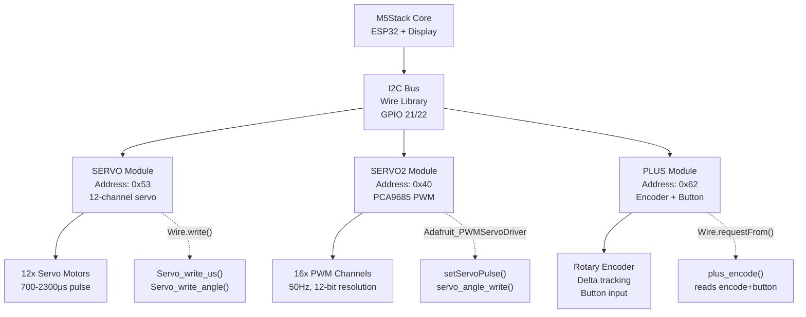
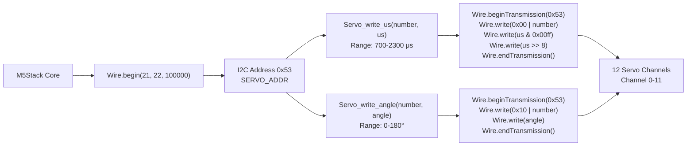
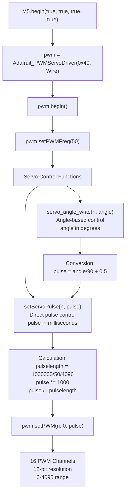
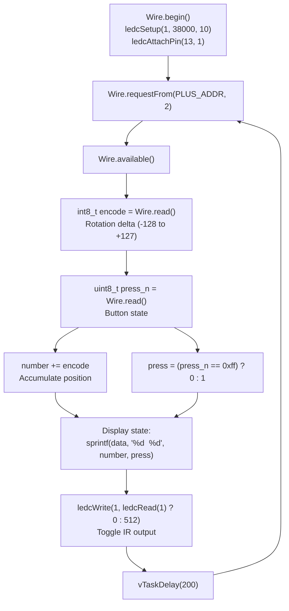
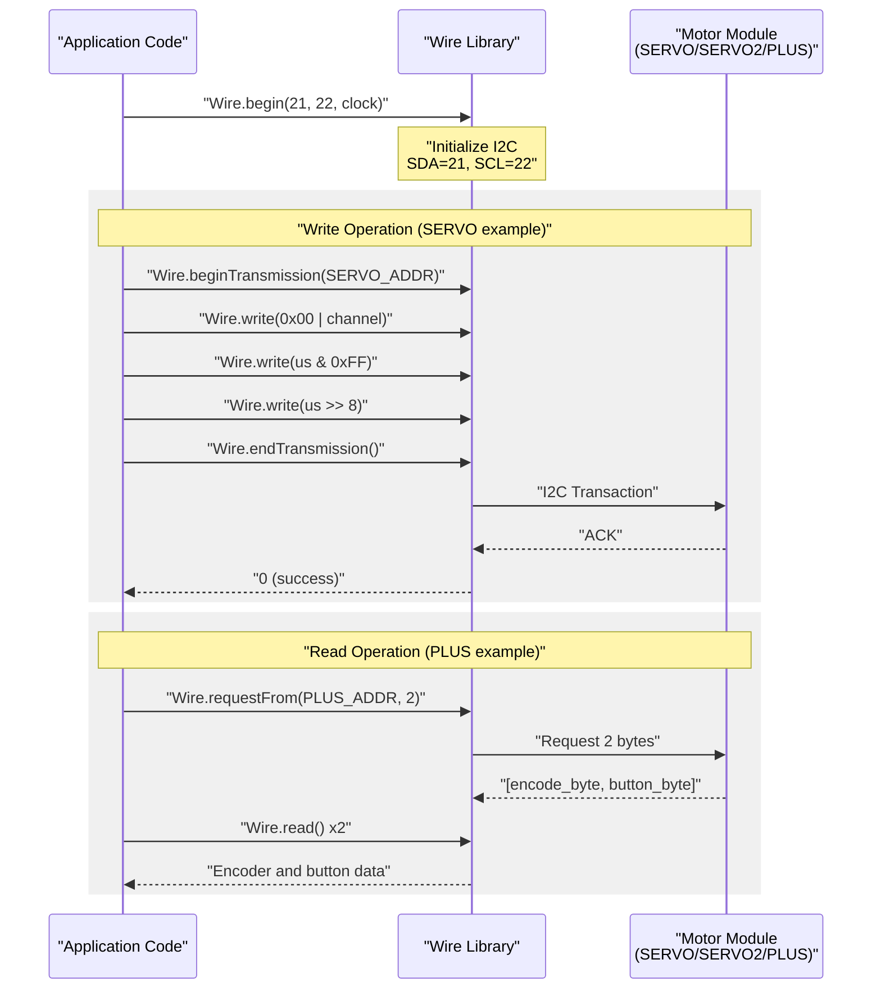
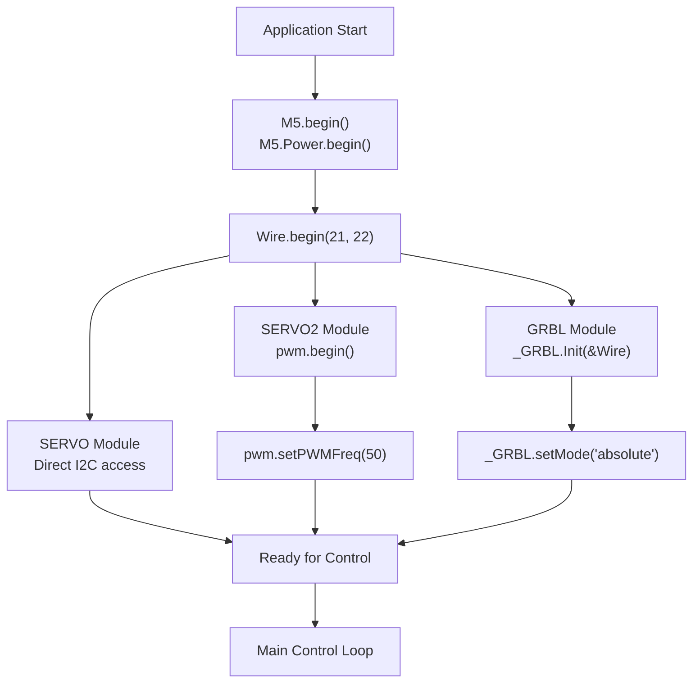
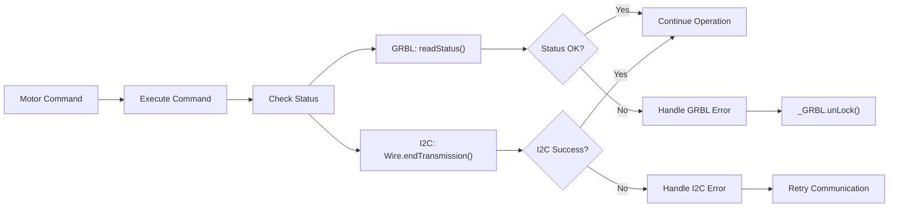

M5Stack Motor Control and Robotics

# Motor Control and Robotics

Relevant source files

The following files were used as context for generating this wiki page:

- [examples/Modules/Base_PoE/RS_485/RS_485.ino](examples/Modules/Base_PoE/RS_485/RS_485.ino)
- [examples/Modules/COM_GPS/COM_GPS.ino](examples/Modules/COM_GPS/COM_GPS.ino)
- [examples/Modules/COM_GSM/COM_GSM.ino](examples/Modules/COM_GSM/COM_GSM.ino)
- [examples/Modules/COM_LTE-DATA/COM_LTE-DATA.ino](examples/Modules/COM_LTE-DATA/COM_LTE-DATA.ino)
- [examples/Modules/COM_LTE/COM_LTE.ino](examples/Modules/COM_LTE/COM_LTE.ino)
- [examples/Modules/LORA868_SX1276/LoRa868Duplex/LoRa868Duplex.ino](examples/Modules/LORA868_SX1276/LoRa868Duplex/LoRa868Duplex.ino)
- [examples/Modules/PLUS/PLUS.ino](examples/Modules/PLUS/PLUS.ino)
- [examples/Modules/PM2.5_PMSA003/PM2.5_PMSA003.ino](examples/Modules/PM2.5_PMSA003/PM2.5_PMSA003.ino)
- [examples/Modules/SERVO/SERVO.ino](examples/Modules/SERVO/SERVO.ino)
- [examples/Modules/SERVO2_PCA9685/SERVO2_PCA9685.ino](examples/Modules/SERVO2_PCA9685/SERVO2_PCA9685.ino)

This document covers the motor control and robotics capabilities within the M5Stack ecosystem. It details the servo control modules, stepper motor systems, and position feedback mechanisms that enable robotic applications and precise motion control.

For wireless communication modules used in robotics applications, see [Communication Modules](#5.1). For sensor integration in robotics systems, see [Advanced Sensor Units](#4.2).

## System Overview

The M5Stack platform provides multiple motor control solutions through dedicated modules that communicate via I2C protocol. These modules support servo motors, encoder feedback systems, and other robotics peripherals for building robotic applications.

**Note**: The M5Stack ecosystem includes additional robotics modules such as BALA2 (balancing robot with IMU feedback), GoPlus2 (motor control with IR/ADC), and GRBL stepper motor controllers. This documentation focuses on the modules with current example implementations.

**M5Stack Motor Control Modules - System Architecture**

Sources: [examples/Modules/SERVO/SERVO.ino:20-49](), [examples/Modules/SERVO2_PCA9685/SERVO2_PCA9685.ino:21-68](), [examples/Modules/PLUS/PLUS.ino:18-49]()

## Servo Control Systems

### Basic SERVO Module

The SERVO module provides 12-channel servo control through I2C communication at address `0x53`. It supports both microsecond pulse width and angle-based control methods.

**SERVO Module Control Functions**

| Function | Purpose | Parameters | I2C Command Format |
|----------|---------|------------|-------------------|
| `Servo_write_us()` | Control by pulse width | `uint8_t number`, `uint16_t us` | `0x00 \| number`, `us & 0xFF`, `us >> 8` |
| `Servo_write_angle()` | Control by angle | `uint8_t number`, `uint8_t angle` | `0x10 \| number`, `angle` |

**SERVO Module Communication Protocol**

The SERVO module uses a simple I2C protocol where the command byte encodes both the operation type (pulse vs angle) and the channel number. The pulse width method provides finer control with 700-2300μs range, while the angle method simplifies control to 0-180 degrees.

Sources: [examples/Modules/SERVO/SERVO.ino:20-63]()

### SERVO2 PCA9685 Module

The SERVO2 module uses the PCA9685 PWM controller chip at I2C address `0x40` to provide 16-channel servo control with 12-bit resolution and hardware-generated PWM signals at 50Hz.

**SERVO2 Module Configuration Constants**

| Constant | Value | Description |
|----------|-------|-------------|
| `SERVOMIN` | 102 | Minimum pulse length count (out of 4096) |
| `SERVOMAX` | 512 | Maximum pulse length count (out of 4096) |
| `USMIN` | 500 | Minimum microsecond length (~102 counts) |
| `USMAX` | 2500 | Maximum microsecond length (~512 counts) |
| `SERVO_FREQ` | 50 | PWM frequency in Hz for analog servos |

**SERVO2 Module Initialization and Control Flow**

The PCA9685 provides hardware-based PWM generation, offloading the timing from the ESP32. Each channel supports 12-bit resolution (0-4095) at 50Hz, suitable for standard analog servos. The conversion functions translate between millisecond pulses and PWM counts.

Sources: [examples/Modules/SERVO2_PCA9685/SERVO2_PCA9685.ino:1-81]()

## Additional Robotics Modules

The M5Stack ecosystem includes additional robotics modules beyond the servo and encoder systems documented above. While these modules are mentioned in the ecosystem documentation, current example implementations are not available in this library version:

### Stepper Motor Control (GRBL Module)

The GRBL modules implement CNC-style stepper motor control with support for G-code commands and precise 3-axis positioning. These modules typically use I2C addresses 0x70 and 0x71 and support both direct motor control and G-code command interfaces for CNC applications.

**Note**: Example code for GRBL modules is not currently available in this library version. Users should refer to the Module_GRBL_13.2 documentation or external GRBL controller libraries for implementation details.

### Balancing Robot (BALA2 Module)

The BALA2 module is designed for self-balancing robot applications, integrating motor control with IMU sensor feedback for real-time balance control. This module combines motor drivers with sensor fusion algorithms to maintain stability.

### Multi-Function Control (GoPlus2 Module)

The GoPlus2 module provides integrated motor control along with additional peripherals including IR sensors, ADC inputs, and multiple motor driver channels for versatile robotics applications.

**Note**: These modules represent the broader M5Stack robotics ecosystem. For current implementation examples, refer to the M5Stack community resources and official module documentation at https://docs.m5stack.com.

## Position Feedback and Encoders

### PLUS Module Encoder

The PLUS module provides rotary encoder functionality with integrated button input at I2C address `0x62`. The module tracks relative rotation position and button press state, suitable for user interface controls and position feedback in robotics applications.

**PLUS Module Hardware Configuration**

| Component | Pin/Address | Configuration | Purpose |
|-----------|------------|---------------|---------|
| I2C Interface | Address 0x62 | Standard I2C on GPIO 21/22 | Encoder data communication |
| IR Output | GPIO 13 | 38kHz PWM via LEDC channel 1 | Infrared transmission |
| Encoder Output | 2-byte response | `[int8_t encode, uint8_t press]` | Rotation delta and button state |

**PLUS Module Data Flow**

The encoder returns a signed 8-bit delta value representing the rotation since the last read, allowing position tracking through accumulation. The button state byte returns `0xff` when not pressed and other values when pressed. The module also includes IR transmission capability via GPIO 13 with 38kHz PWM modulation.

Sources: [examples/Modules/PLUS/PLUS.ino:1-61]()

## Communication Protocols

### I2C Protocol Implementation

All motor control modules use I2C communication on the standard M5Stack I2C bus (GPIO 21/22) with module-specific addressing and command structures.

**Motor Control Module I2C Protocol Summary**

| Module Type | I2C Address | Clock Speed | Data Format | Response Type |
|-------------|-------------|-------------|-------------|---------------|
| SERVO | 0x53 | 100kHz | `[cmd\|channel, data_low, data_high]` | Write-only (ACK) |
| SERVO2 (PCA9685) | 0x40 | Default (100kHz) | PCA9685 register writes | Register ACK |
| PLUS | 0x62 | Default (100kHz) | Request 2 bytes | `[encode, button]` |

**I2C Transaction Flow for Motor Control**

The SERVO module uses direct I2C writes at 100kHz, while SERVO2 uses the Adafruit PCA9685 library which abstracts the register-level I2C communication. The PLUS module uses I2C read requests to poll encoder state.

Sources: [examples/Modules/SERVO/SERVO.ino:30-49](), [examples/Modules/SERVO2_PCA9685/SERVO2_PCA9685.ino:21-61](), [examples/Modules/PLUS/PLUS.ino:36-49]()

## Integration Patterns

### Initialization Sequence

Standard initialization pattern for motor control modules:

1. **M5Stack Core Setup**: `M5.begin()`, `M5.Power.begin()`
2. **I2C Initialization**: `Wire.begin(21, 22)`
3. **Module Initialization**: Module-specific init functions
4. **Configuration**: Set operating modes and parameters

### Error Handling and Status Monitoring

Sources: [examples/Modules/SERVO/SERVO.ino:1-63](), [examples/Modules/SERVO2_PCA9685/SERVO2_PCA9685.ino:1-81](), [examples/Modules/StepmotorGRBL13.2_M035/xyz_control/xyz_control.ino:1-74](), [examples/Modules/StepmotorGRBL13.2_M035/multi_control/multi_control.ino:1-85](), [examples/Modules/PLUS/PLUS.ino:1-61]()