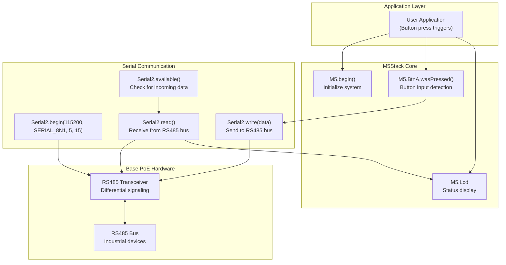
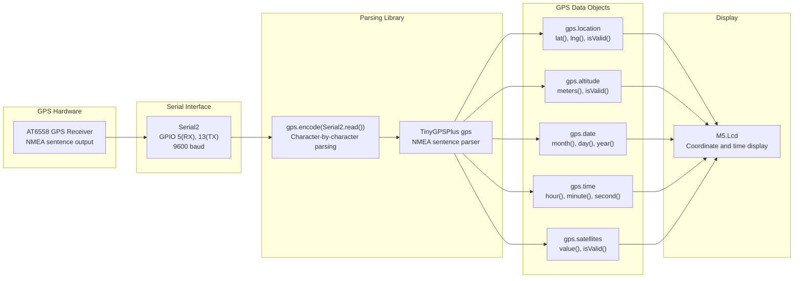
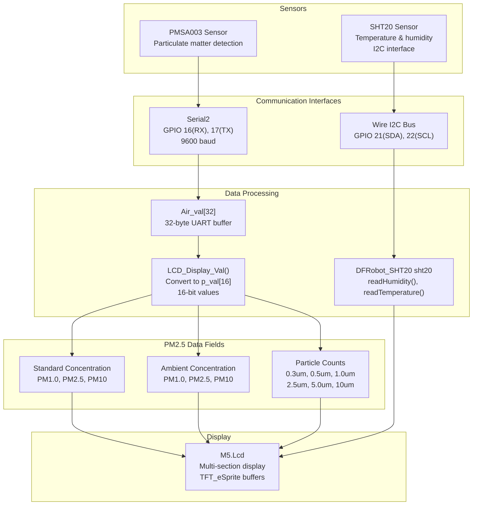
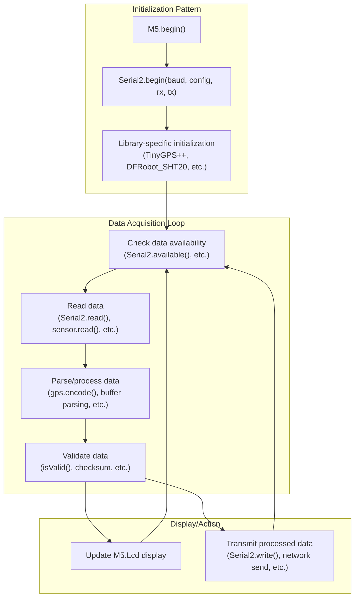

M5Stack Network and IoT Modules

# Network and IoT Modules

<details>
<summary>Relevant source files</summary>

The following files were used as context for generating this wiki page:

- [examples/Modules/Base_PoE/RS_485/RS_485.ino](examples/Modules/Base_PoE/RS_485/RS_485.ino)
- [examples/Modules/COM_GPS/COM_GPS.ino](examples/Modules/COM_GPS/COM_GPS.ino)
- [examples/Modules/COM_GSM/COM_GSM.ino](examples/Modules/COM_GSM/COM_GSM.ino)
- [examples/Modules/COM_LTE-DATA/COM_LTE-DATA.ino](examples/Modules/COM_LTE-DATA/COM_LTE-DATA.ino)
- [examples/Modules/COM_LTE/COM_LTE.ino](examples/Modules/COM_LTE/COM_LTE.ino)
- [examples/Modules/LORA868_SX1276/LoRa868Duplex/LoRa868Duplex.ino](examples/Modules/LORA868_SX1276/LoRa868Duplex/LoRa868Duplex.ino)
- [examples/Modules/PLUS/PLUS.ino](examples/Modules/PLUS/PLUS.ino)
- [examples/Modules/PM2.5_PMSA003/PM2.5_PMSA003.ino](examples/Modules/PM2.5_PMSA003/PM2.5_PMSA003.ino)
- [examples/Modules/SERVO/SERVO.ino](examples/Modules/SERVO/SERVO.ino)
- [examples/Modules/SERVO2_PCA9685/SERVO2_PCA9685.ino](examples/Modules/SERVO2_PCA9685/SERVO2_PCA9685.ino)

</details>


## Purpose and Scope

This page documents M5Stack modules that provide network connectivity and IoT sensing capabilities through wired interfaces and environmental sensors. The focus is on:

- **Base PoE Module** with RS485 industrial communication
- **COM.GPS Module** for location services using AT6558 GPS receiver
- **PM2.5 Air Quality Kit** with PMSA003 particulate matter sensor
- **W5500 Ethernet Module** for wired network connectivity (mentioned in module ecosystem)

For wireless communication modules (LTE, GSM, NB-IoT, LoRa, Zigbee, SigFox), see [Communication Modules](#5.1). For motor control and servo modules, see [Motor Control and Robotics](#5.2).

---

## Base PoE Module with RS485

The Base PoE module provides industrial-grade RS485 serial communication capabilities along with Power over Ethernet functionality. This module enables M5Stack to communicate with industrial sensors and actuators using the RS485 differential signaling standard.

### Hardware Configuration

The module uses `Serial2` configured on GPIO pins 5 (RX) and 15 (TX) for RS485 communication, running at 115200 baud with 8N1 protocol.

| Parameter | Value | Description |
|-----------|-------|-------------|
| Interface | Serial2 | UART interface for RS485 |
| Baud Rate | 115200 | Standard industrial rate |
| RX Pin | GPIO 5 | Receive pin |
| TX Pin | GPIO 15 | Transmit pin |
| Protocol | 8N1 | 8 data bits, no parity, 1 stop bit |

### RS485 Communication Pattern



**Diagram: Base PoE RS485 Communication Flow**

### Implementation Example

The RS485 example demonstrates bidirectional communication where button presses send data and incoming messages are displayed with visual feedback:

[examples/Modules/Base_PoE/RS_485/RS_485.ino:16-24]()
- Initializes M5Stack with display and power management
- Configures `Serial2` with GPIO 5 (RX) and GPIO 15 (TX)

[examples/Modules/Base_PoE/RS_485/RS_485.ino:28-38]()
- Button A press sends character 'a' over RS485
- Green indicator shows transmission status

[examples/Modules/Base_PoE/RS_485/RS_485.ino:39-48]()
- Checks `Serial2.available()` for incoming data
- Reads and displays received messages

**Sources:** [examples/Modules/Base_PoE/RS_485/RS_485.ino:1-50]()

---

## COM.GPS Module

The COM.GPS module integrates an AT6558 GPS receiver to provide geolocation and timing services. It uses UART communication with NMEA sentence parsing via the TinyGPS++ library.

### GPS Module Architecture



**Diagram: GPS Data Processing Pipeline**

### GPS Data Extraction

The module provides access to multiple GPS data fields through the `TinyGPSPlus` object:

| GPS Data Field | Access Method | Description |
|----------------|---------------|-------------|
| Latitude | `gps.location.lat()` | Decimal degrees, 6 decimal places |
| Longitude | `gps.location.lng()` | Decimal degrees, 6 decimal places |
| Altitude | `gps.altitude.meters()` | Elevation in meters |
| Satellites | `gps.satellites.value()` | Number of satellites in view |
| Date | `gps.date.month/day/year()` | UTC date components |
| Time | `gps.time.hour/minute/second()` | UTC time components |
| Validity | `isValid()` | Check if data is valid before use |

### Implementation Pattern

[examples/Modules/COM_GPS/COM_GPS.ino:28-32]()
- Initializes `Serial2` at 9600 baud for GPS NMEA data
- Creates `TinyGPSPlus gps` object for parsing

[examples/Modules/COM_GPS/COM_GPS.ino:45-52]()
- The `smartDelay()` function continuously feeds serial data to the GPS parser
- Uses `gps.encode(Serial2.read())` for character-by-character parsing
- Non-blocking design maintains responsiveness

[examples/Modules/COM_GPS/COM_GPS.ino:54-118]()
- The `displayInfo()` function extracts and displays GPS data
- Always checks `isValid()` before accessing data fields
- Handles invalid states gracefully with "INVALID" display

**Example Usage Pattern:**

```cpp
// Initialization
Serial2.begin(9600, SERIAL_8N1, 5, 13);
TinyGPSPlus gps;

// In loop - continuous parsing
while (Serial2.available() > 0) {
    gps.encode(Serial2.read());
}

// Access parsed data
if (gps.location.isValid()) {
    double lat = gps.location.lat();
    double lng = gps.location.lng();
}
```

**Sources:** [examples/Modules/COM_GPS/COM_GPS.ino:1-119]()

---

## PM2.5 Air Quality Sensor Kit

The PM2.5 Air Quality Kit combines a PMSA003 particulate matter sensor with an SHT20 temperature/humidity sensor to provide comprehensive environmental monitoring. The system uses UART for particulate data and I2C for temperature/humidity readings.

### Sensor System Architecture



**Diagram: PM2.5 Air Quality Sensor Data Flow**

### PMSA003 Data Protocol

The PMSA003 sensor outputs 32 bytes per frame via UART, containing particulate matter measurements and particle counts:

| Byte Range | Data Field | Description |
|------------|------------|-------------|
| 0-3 | Frame header | Start bytes and frame length |
| 4-5 | PM1.0 Standard | PM1.0 concentration (μg/m³) - standard |
| 6-7 | PM2.5 Standard | PM2.5 concentration (μg/m³) - standard |
| 8-9 | PM10 Standard | PM10 concentration (μg/m³) - standard |
| 10-11 | PM1.0 Ambient | PM1.0 concentration (μg/m³) - ambient |
| 12-13 | PM2.5 Ambient | PM2.5 concentration (μg/m³) - ambient |
| 14-15 | PM10 Ambient | PM10 concentration (μg/m³) - ambient |
| 16-27 | Particle Counts | Counts for 0.3um, 0.5um, 1.0um, 2.5um, 5.0um, 10um |
| 28-29 | Reserved | Reserved bytes |
| 30-31 | Checksum | Data verification |

### Data Processing Implementation

[examples/Modules/PM2.5_PMSA003/PM2.5_PMSA003.ino:38-56]()
- Initializes both Serial2 (PMSA003) and I2C (SHT20)
- GPIO 13 controls sensor power enable
- Creates sprite buffers for flicker-free display

[examples/Modules/PM2.5_PMSA003/PM2.5_PMSA003.ino:64-74]()
- `LCD_Display_Val()` converts 32-byte buffer into 16 16-bit values
- Combines pairs of bytes (high/low) into `p_val[]` array
- Values at `p_val[2-4]` are standard concentrations, `p_val[5-7]` are ambient

[examples/Modules/PM2.5_PMSA003/PM2.5_PMSA003.ino:163-180]()
- `TempHumRead()` uses `DFRobot_SHT20` library
- Calls `sht20.readHumidity()` and `sht20.readTemperature()`
- Displays environmental data alongside particulate measurements

[examples/Modules/PM2.5_PMSA003/PM2.5_PMSA003.ino:182-196]()
- Main loop accumulates serial data into `Air_val[]` buffer
- When 32 bytes received, triggers display update
- Combines particulate and environmental data in single interface

### Display Organization

The display is organized into three sections:

1. **Standard Concentration** (left): PM1.0, PM2.5, PM10 values for standard particle density
2. **Ambient Concentration** (right): PM1.0, PM2.5, PM10 values for ambient conditions
3. **Particle Counts** (center-bottom): Individual counts for different particle sizes
4. **Environmental Data** (bottom): Temperature and humidity from SHT20

[examples/Modules/PM2.5_PMSA003/PM2.5_PMSA003.ino:76-122]()
- Standard and ambient PM concentrations displayed side-by-side
- Color-coded sections (red headers, white data) for readability

**Sources:** [examples/Modules/PM2.5_PMSA003/PM2.5_PMSA003.ino:1-197]()

---

## W5500 Ethernet Module

The W5500 Ethernet module provides wired network connectivity for M5Stack applications. While not included in the provided example files, this module is part of the M5Stack ecosystem and enables:

- **TCP/IP stack** hardware implementation
- **Web server** hosting capabilities
- **MQTT client** for IoT data publishing
- **HTTP client** for API integration
- **SPI interface** communication with ESP32

The W5500 chip implements a full hardwired TCP/IP stack, offloading network processing from the ESP32 and enabling reliable wired connectivity for industrial and embedded applications.

**Note:** For implementation details and example code, refer to the M5Stack W5500 module documentation in the official M5Stack repository.

---

## Module Comparison and Selection Guide

The following table summarizes the network and IoT modules to assist in selecting the appropriate module for your application:

| Module | Interface | Data Rate | Primary Use Case | Power Requirement |
|--------|-----------|-----------|------------------|-------------------|
| **Base PoE (RS485)** | Serial2 (UART) | 115200 baud | Industrial automation, sensor networks | PoE (Power over Ethernet) |
| **COM.GPS** | Serial2 (UART) | 9600 baud | Location tracking, time synchronization | 3.3V via M5Stack |
| **PM2.5 Kit** | Serial2 (UART) + I2C | 9600 baud (UART) | Environmental monitoring, air quality | 5V via M5Stack |
| **W5500 Ethernet** | SPI | Up to 80 Mbps | Wired networking, web servers | 3.3V via M5Stack |

### Common Integration Patterns

All network and IoT modules share common integration patterns with the M5Stack core:



**Diagram: Common Module Integration Pattern**

### Serial2 Pin Configuration Reference

Most network and IoT modules use `Serial2` with different pin configurations:

| Module | RX Pin | TX Pin | Baud Rate | Protocol |
|--------|--------|--------|-----------|----------|
| Base PoE (RS485) | GPIO 5 | GPIO 15 | 115200 | 8N1 |
| COM.GPS | GPIO 5 | GPIO 13 | 9600 | 8N1 |
| PM2.5 Kit | GPIO 16 | GPIO 17 | 9600 | 8N1 |

**Note:** Pin configurations are set during `Serial2.begin()` call and must match the physical connections on the module.

**Sources:** [examples/Modules/Base_PoE/RS_485/RS_485.ino:23](), [examples/Modules/COM_GPS/COM_GPS.ino:31](), [examples/Modules/PM2.5_PMSA003/PM2.5_PMSA003.ino:42]()

---

## Related Documentation

- For wireless communication modules (LTE, GSM, LoRa, Zigbee), see [Communication Modules](#5.1)
- For motor and servo control modules, see [Motor Control and Robotics](#5.2)
- For basic I/O and sensor units, see [Basic I/O and Interface Units](#4.1)
- For WiFi and network configuration, see the Advanced Examples section in [Getting Started](#3)