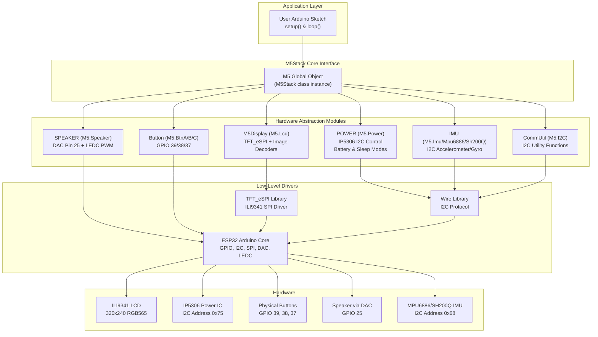
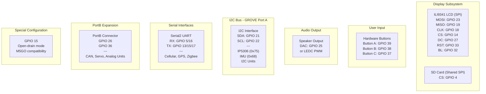
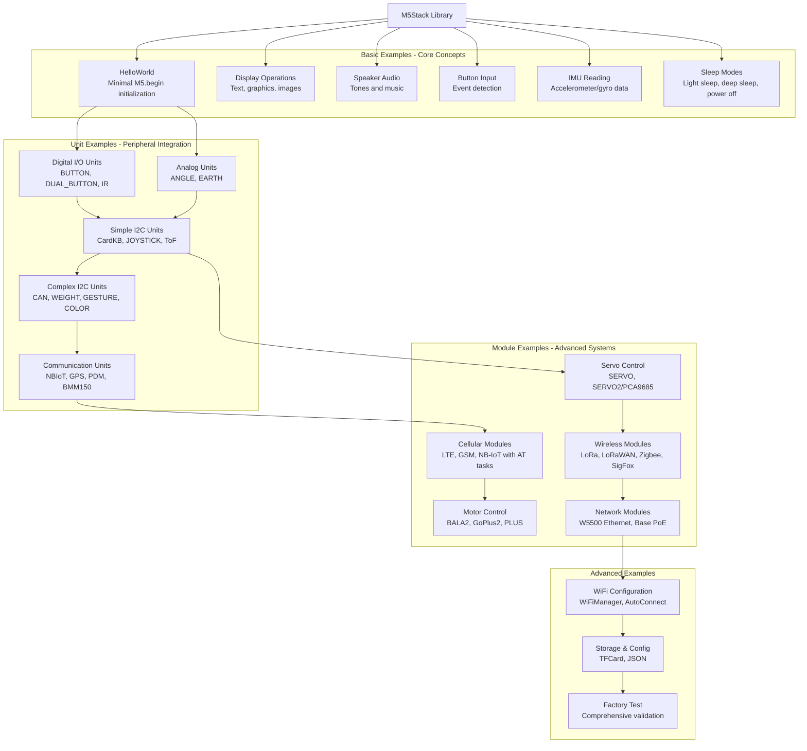

M5Stack Overview

# Overview

<details>
<summary>Relevant source files</summary>

The following files were used as context for generating this wiki page:

- [.clang-format](.clang-format)
- [.github/ISSUE_TEMPLATE/bug-report.yml](.github/ISSUE_TEMPLATE/bug-report.yml)
- [.github/workflows/Arduino-Lint-Check.yml](.github/workflows/Arduino-Lint-Check.yml)
- [.github/workflows/clang-format-check.yml](.github/workflows/clang-format-check.yml)
- [README.md](README.md)
- [docs/getting_started_cn.md](docs/getting_started_cn.md)
- [docs/getting_started_ja.md](docs/getting_started_ja.md)
- [library.json](library.json)
- [library.properties](library.properties)
- [src/gitTagVersion.h](src/gitTagVersion.h)

</details>


## ⚠️ DEPRECATED - Migration Required

**This library is officially deprecated and in maintenance-only mode.** The M5Stack library (version 0.4.6) should not be used for new projects. All development has shifted to a modular architecture:

- **[M5GFX](https://github.com/m5stack/M5GFX)** - High-performance graphics and display driver library
- **[M5Unified](https://github.com/m5stack/M5Unified)** - Unified base library for I/O, peripherals, power management, and audio

**Why Migrate:**
- M5Stack library only supports Basic and Gray models (discontinued/EOL hardware)
- M5Unified supports all current M5Stack products (Core2, CoreS3, StickC Plus, etc.)
- M5GFX provides superior graphics performance and memory efficiency
- Active feature development only occurs in the new libraries
- Better multi-device abstraction and API consistency

**Legacy Support:** While the library remains functional for existing Basic/Gray projects, it receives only critical bug fixes. The examples and documentation remain available for reference.

## Library Purpose and Scope

The M5Stack library provides hardware abstraction for ESP32-based M5Stack Core devices (Basic and Gray variants) through a unified `M5Stack` class interface. It encapsulates:
- Display control via `M5Display` (TFT_eSPI wrapper)
- Power management via `POWER` class (IP5306 I2C control)
- Button input via `Button` classes
- Audio output via `SPEAKER` class (DAC/PWM)
- Motion sensing via IMU classes (MPU6886/SH200Q)

Sources: [README.md:1-18](), [library.properties:1-11]()

For detailed information about specific subsystems, see:
- Core library components: [Core Library Architecture](#2)
- Getting started with examples: [Getting Started](#3) 
- M5Stack Units peripherals: [M5Stack Units](#4)
- M5Stack Modules: [M5Stack Modules](#5)

## Library Architecture

### Core Component Hierarchy

The M5Stack library implements a facade pattern where the `M5Stack` class (instantiated as global `M5` object) provides unified access to all hardware subsystems. This three-tier architecture separates application code from hardware-specific drivers.

**Diagram: M5Stack Component Architecture**



**Key Classes:**
- `M5Stack` - Main facade class providing `M5.begin()` and `M5.update()` methods
- `M5Display` - Extends TFT_eSPI with BMP/JPEG/PNG/QR support
- `POWER` - Manages IP5306 power IC via I2C at address 0x75
- `Button` - State machine for hardware buttons on GPIO 39, 38, 37
- `SPEAKER` - Audio control using DAC on GPIO 25 and LEDC PWM
- `IMU` - Interface to MPU6886 or SH200Q accelerometer/gyroscope at I2C 0x68
- `CommUtil` - I2C helper functions for device communication

Sources: [README.md:21-26](), [library.properties:1-11]()

## Supported Hardware

### M5Stack Core Models

The library supports M5Stack Basic and Gray models only. All are now discontinued or EOL:

| Model | Status | IMU Sensor | Documentation |
|-------|--------|------------|---------------|
| Basic v2.7 | EOL | MPU6886 or SH200Q | [docs.m5stack.com](https://docs.m5stack.com/en/core/basic_v2.7) |
| Basic v2.6 | EOL | MPU6886 | [docs.m5stack.com](https://docs.m5stack.com/en/core/basic_v2.6) |
| Basic v1.0 | EOL | MPU9250 | [docs.m5stack.com](https://docs.m5stack.com/en/core/basic) |
| Gray v1.0 | EOL | MPU9250 | [docs.m5stack.com](https://docs.m5stack.com/en/core/gray) |

**Note:** Model version may be printed on the PCB near the SD card slot.

Sources: [README.md:39-42](), [README.md:58-60]()

### Hardware Specifications

**Diagram: GPIO Pin Assignment and Resource Allocation**



**Core Components:**

| Component | Hardware | Interface | Notes |
|-----------|----------|-----------|-------|
| MCU | ESP32 | - | Dual-core 240MHz, WiFi, Bluetooth |
| Display | ILI9341 | SPI | 320x240 RGB565, 262K colors |
| Power IC | IP5306 | I2C (0x75) | Battery management, charging |
| IMU | MPU6886 or SH200Q | I2C (0x68) | 6-axis accelerometer + gyroscope |
| Buttons | 3× momentary | GPIO | Pull-up with debounce |
| Speaker | Magnetic | DAC/PWM | Via amplifier circuit |
| SD Card | MicroSD | SPI (shared) | FAT32 filesystem |
| GROVE Port | 4-pin connector | I2C | Standard GROVE interface |
| M-BUS | Bottom connector | Multi-protocol | Expansion for modules |

**Resource Sharing:**
- SPI bus shared between LCD (CS: GPIO 14) and SD card (CS: GPIO 4)
- I2C bus shared by IP5306, IMU, and all I2C-based Units
- Serial2 TX pin configurable (GPIO 13/15/17) to avoid conflicts with different modules
- GPIO 15 must be open-drain to prevent WiFi interference with M5GO accessories

Sources: [docs/getting_started_ja.md:37-64](), [README.md:47-48]()

## Development Environment

### Library Installation

**Arduino Library Manager:**
- Library name: "M5Stack"
- Current version: 0.4.6
- Category: Device Control
- Architecture: ESP32 only

**PlatformIO:**
```json
{
  "name": "M5Stack",
  "version": "0.4.6",
  "frameworks": "arduino",
  "platforms": "espressif32"
}
```

Sources: [library.properties:1-11](), [library.json:1-17]()

### Dependencies

The library requires the following dependencies (automatically installed via Arduino Library Manager):

| Dependency | Purpose |
|------------|---------|
| M5Family | Base framework for M5 device family |
| M5Module-4Relay | Support for 4-relay module |
| Module_GRBL_13.2 | GRBL CNC module support |
| M5_BMM150 | BMM150 magnetometer driver |
| TFT_eSPI | Display driver (external dependency) |
| ESP32 Arduino Core | ESP32 hardware abstraction |

Sources: [library.properties:11]()

### Continuous Integration

The repository uses GitHub Actions for automated quality checks:

**Arduino Lint** (`.github/workflows/Arduino-Lint-Check.yml`):
- Validates library structure and metadata
- Runs on push and pull requests to master branch
- Enforces strict compliance with Arduino library specification

**Clang Format** (`.github/workflows/clang-format-check.yml`):
- Enforces consistent code style
- Clang-format version 13
- Excludes legacy code: Fonts, utility, RFID, THERMAL_MLX90640, etc.
- 120-character line limit, Google-based style

Sources: [.github/workflows/Arduino-Lint-Check.yml:1-17](), [.github/workflows/clang-format-check.yml:1-24](), [.clang-format:1-168]()

### Documentation and Resources

**Multi-language Documentation:**
- English: [README.md]()
- Chinese: [docs/getting_started_cn.md]()
- Japanese: [docs/getting_started_ja.md]()

**Additional Resources:**
- Quick Start: [UIFlow](https://docs.m5stack.com/en/quick_start/m5core/uiflow), [Arduino IDE](https://docs.m5stack.com/en/quick_start/m5core/arduino)
- MicroPython API: [docs.m5stack.com](https://docs.m5stack.com/en/mpy/display/m5stack_lvgl)
- Hardware Comparison: [M5Core Products](https://docs.m5stack.com/en/products_selector/m5core_compare)

Sources: [README.md:16](), [README.md:50-60](), [docs/getting_started_cn.md:1-35](), [docs/getting_started_ja.md:1-142]()

## Example Ecosystem

The repository includes 50+ examples organized by complexity and hardware integration:

**Diagram: Example Structure and Learning Path**



**Example Categories:**
- **Basic**: Core hardware functionality (display, audio, buttons, IMU, power management)
- **Units**: Small sensor/actuator modules via GPIO, I2C, or analog interfaces
- **Modules**: Complex peripherals (cellular modems, motor controllers, network interfaces)
- **Advanced**: System integration (WiFi configuration, storage, comprehensive testing)

The Factory Test example provides comprehensive hardware validation including display tests, IMU communication, WiFi scanning, SD card operations, and button testing.

Sources: [README.md:30-31](), [README.md:62-118]()

## Usage Pattern

The library follows the standard Arduino initialization and update pattern:

```cpp
#include "M5Stack.h"

void setup() {
    M5.begin();  // Initialize all hardware subsystems
    // M5.Lcd, M5.Power, buttons, speaker, IMU now available
}

void loop() {
    M5.update(); // Poll button states and update system status
    // Application logic
}
```

**Key Methods:**
- `M5.begin()` - Initializes display, power management, buttons, speaker, and IMU
- `M5.update()` - Must be called in loop() to update button states
- `M5.Lcd.*` - Display operations (extends TFT_eSPI)
- `M5.Power.*` - Battery level, sleep modes, shutdown
- `M5.BtnA/B/C.*` - Button state queries (isPressed, wasPressed, etc.)
- `M5.Speaker.*` - Audio output (tone, setVolume, etc.)
- `M5.Imu.*` - Motion sensor data (getAccelData, getGyroData, etc.)

Sources: [README.md:28-31]()

## Legacy Status and Migration Path

This library (M5Stack v0.4.6) is in maintenance mode and not recommended for new development. The key limitations include:

- **Limited Hardware Support**: Only supports Basic and Gray models
- **Outdated Graphics Engine**: Uses older TFT_eSPI integration
- **No Active Feature Development**: Focus on bug fixes only

**Recommended Migration**: For new projects, use [M5Unified](https://github.com/M5Stack/M5Unified) and [M5GFX](https://github.com/M5Stack/M5GFX) which provide:
- Support for all current M5Stack products
- Modern graphics rendering engine
- Active development and feature updates
- Improved performance and memory usage

Sources: [README.md:10-11]()