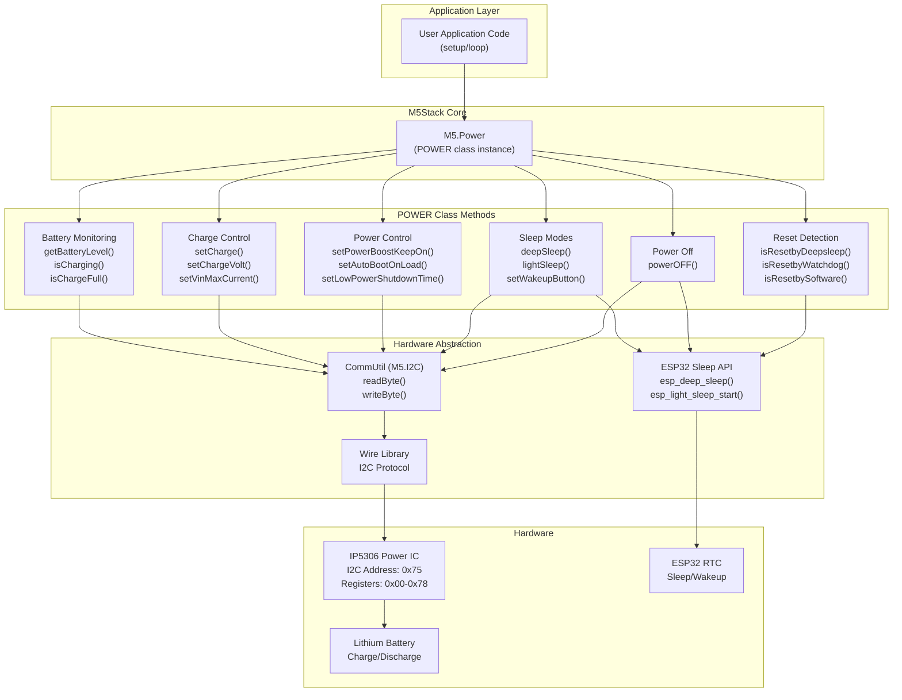
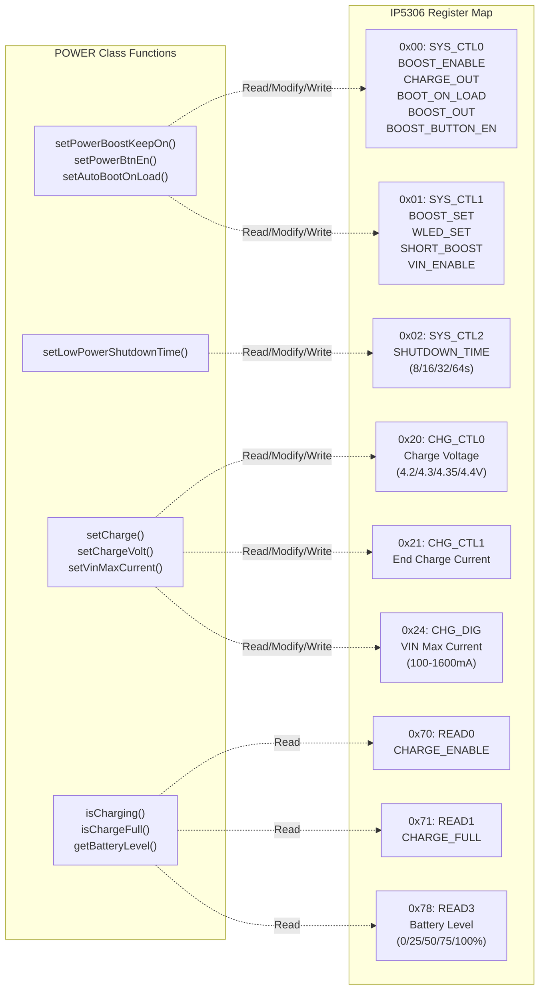
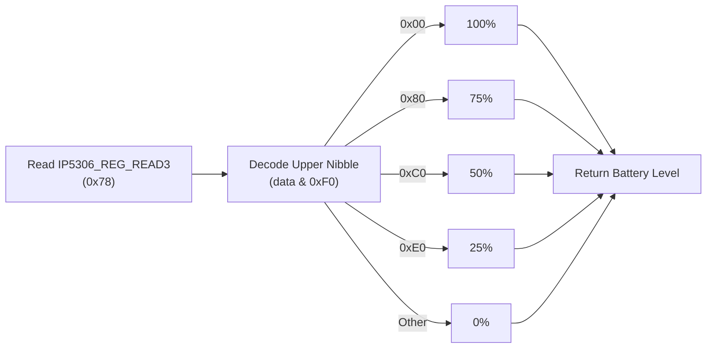
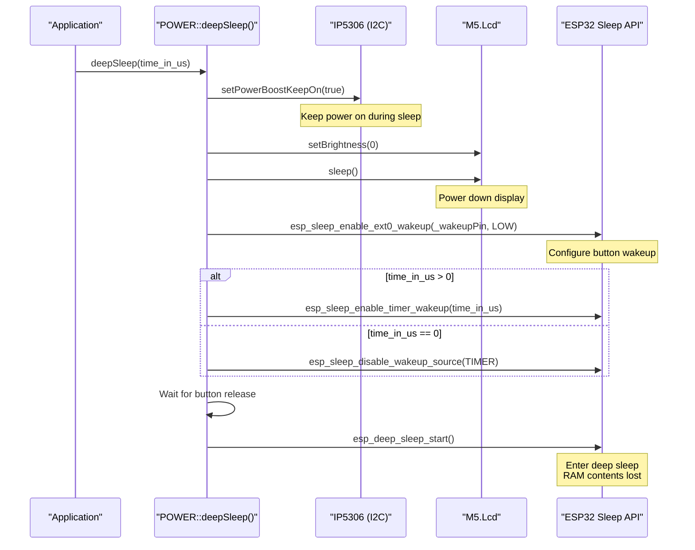
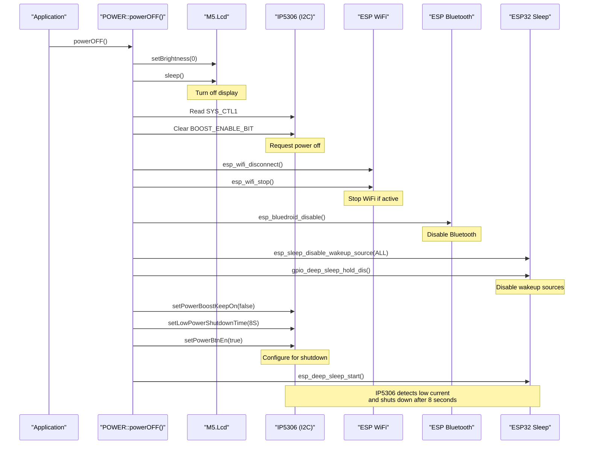
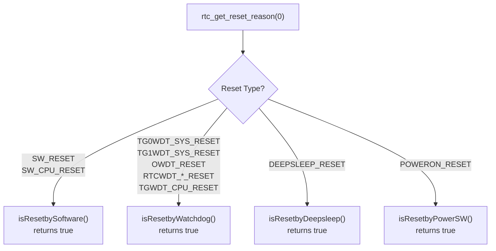
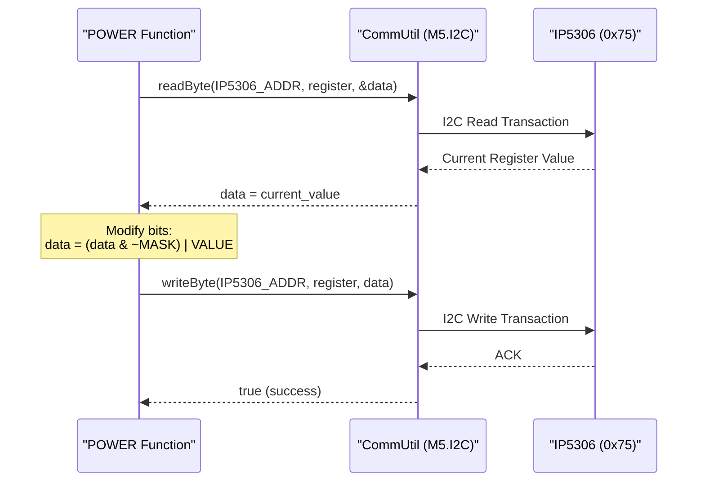

M5Stack Power Management

# Power Management

<details>
<summary>Relevant source files</summary>

The following files were used as context for generating this wiki page:

- [src/M5Stack.cpp](src/M5Stack.cpp)
- [src/M5Stack.h](src/M5Stack.h)
- [src/utility/Power.cpp](src/utility/Power.cpp)
- [src/utility/Power.h](src/utility/Power.h)

</details>


## Purpose and Scope

This document describes the power management subsystem of the M5Stack library, implemented through the `POWER` class. This class provides control over the IP5306 power management IC, which handles battery charging, power boost conversion, and low-power modes. The document covers battery level monitoring, charge control, sleep modes (light sleep and deep sleep), power-off functionality, and reset reason detection.

For information about the initialization sequence and how the `POWER` class integrates with the main M5Stack object, see [M5Stack Class and Initialization](#2.1).

---

## Architecture Overview

The power management system is built around the IP5306 power IC, which is controlled via I2C at address `0x75`. The `POWER` class abstracts the register-level operations and provides high-level functions for battery monitoring, charging control, and power state management.

**Diagram: Power Management Architecture**



**Sources:** [src/utility/Power.h:1-76](), [src/utility/Power.cpp:1-451](), [src/M5Stack.h:24-35](), [src/M5Stack.cpp:46-47]()

---

## IP5306 Power IC Integration

The IP5306 is a multi-function power management IC that provides battery charging, boost conversion, and power path management. It communicates via I2C at address `0x75` (117 decimal) and exposes multiple configuration registers.

**Diagram: IP5306 Register Map and Functions**



**Sources:** [src/utility/Power.cpp:27-82]()

### Initialization Sequence

The `POWER::begin()` method initializes the IP5306 with default settings:

| Configuration | Value | Register |
|--------------|-------|----------|
| VIN Max Current | 400mA | CHG_DIG (0x24) |
| Charge Voltage | 4.2V | CHG_CTL0 (0x20) |
| End Charge Current | 200mA | CHG_CTL1 (0x21) |
| Voltage Compensation | +28mV | 0x22 |
| Charge CC Mode | Enabled | 0x23 |

The initialization is typically called from `M5Stack::begin()` via `Power.setWakeupButton(BUTTON_A_PIN)`, which triggers I2C initialization if not already done.

**Sources:** [src/utility/Power.cpp:88-113](), [src/M5Stack.cpp:46-50]()

---

## Battery Management

### Battery Level Detection

The `getBatteryLevel()` method reads register `0x78` (IP5306_REG_READ3) and decodes the upper nibble to determine battery percentage:



**Sources:** [src/utility/Power.cpp:303-320]()

### Charging Status

| Method | Register | Bit | Description |
|--------|----------|-----|-------------|
| `isCharging()` | IP5306_REG_READ0 (0x70) | CHARGE_ENABLE_BIT (0x08) | Returns `true` if battery is currently charging |
| `isChargeFull()` | IP5306_REG_READ1 (0x71) | CHARGE_FULL_BIT (0x08) | Returns `true` if battery charge is complete |

Both methods use read-only status registers that reflect the current state of the IP5306 hardware.

**Sources:** [src/utility/Power.cpp:282-300]()

### Charge Control

The charge control functions modify IP5306 configuration registers to adjust charging behavior:

**`setCharge(bool en)`**: Enables or disables charging by setting/clearing `CHARGE_OUT_BIT` in `IP5306_REG_SYS_CTL0`. When charge is complete, toggling this bit (disable → enable) can restart charging.

**`setChargeVolt(uint8_t volt)`**: Sets the battery charge termination voltage. Valid values:
- `BAT_4_2V` (0x00): 4.2V (default)
- `BAT_4_3V` (0x01): 4.3V
- `BAT_4_3_5V` (0x02): 4.35V
- `BAT_4_4V` (0x03): 4.4V

**`setVinMaxCurrent(uint8_t cur)`**: Limits the input current from VIN (USB). Values are bitflags that can be combined:
- `CURRENT_100MA` (0x01)
- `CURRENT_200MA` (0x02)
- `CURRENT_400MA` (0x04)
- `CURRENT_800MA` (0x08)
- `CURRENT_1600MA` (0x10)

**Sources:** [src/utility/Power.cpp:70-82](), [src/utility/Power.cpp:252-279]()

---

## Power Control Functions

### Power Boost Control

The IP5306 provides a 5V boost converter to power the ESP32 and peripherals. Several functions control its behavior:

**`setPowerBoostKeepOn(bool en)`**: When enabled, keeps the boost output active even under light load conditions. This is critical for preventing automatic shutdown during sleep modes. The function modifies `BOOST_OUT_BIT` in `IP5306_REG_SYS_CTL0`.

**`setAutoBootOnLoad(bool en)`**: When enabled (default), the IP5306 automatically turns on when sufficient load is detected. Modifies `BOOT_ON_LOAD_BIT` in `IP5306_REG_SYS_CTL0`.

**`setPowerBtnEn(bool en)`**: Enables or disables the power button functionality on the IP5306. Modifies `BOOST_BUTTON_EN_BIT` in `IP5306_REG_SYS_CTL0`.

**Sources:** [src/utility/Power.cpp:115-163](), [src/utility/Power.cpp:216-250]()

### Shutdown Timer Configuration

**`setLowPowerShutdownTime(ShutdownTime time)`**: Configures how long the IP5306 waits before auto-shutdown when load is too low. This prevents unwanted shutdowns during sleep modes.

| Enum Value | Shutdown Delay | Register Bits |
|-----------|----------------|---------------|
| `SHUTDOWN_8S` | 8 seconds | 0x00 |
| `SHUTDOWN_16S` | 16 seconds | 0x08 |
| `SHUTDOWN_32S` | 32 seconds | 0x04 |
| `SHUTDOWN_64S` | 64 seconds | 0x0C |

The function performs read-modify-write on `IP5306_REG_SYS_CTL2`, masking and setting the `SHUTDOWNTIME_MASK` bits.

**Sources:** [src/utility/Power.cpp:53-58](), [src/utility/Power.cpp:165-197]()

### Additional Control Functions

| Function | Register | Bit | Purpose |
|----------|----------|-----|---------|
| `setPowerBoostOnOff()` | SYS_CTL1 | BOOST_SET_BIT | Alternative boost control |
| `setPowerBoostSet()` | SYS_CTL1 | SHORT_BOOST_BIT | Short circuit boost protection |
| `setPowerVin()` | SYS_CTL1 | VIN_ENABLE_BIT | Enable/disable VIN input |
| `setPowerWLEDSet()` | SYS_CTL1 | WLED_SET_BIT | Control LED functionality |

**Sources:** [src/utility/Power.cpp:115-153]()

---

## Sleep Modes

The M5Stack supports two ESP32 sleep modes, both integrated with the IP5306 power management:

### Deep Sleep

**`deepSleep(uint64_t time_in_us = 0)`**: Enters ESP32 deep sleep mode with minimum power consumption. The ESP32 shuts down most peripherals and can only be woken by specific sources.

**Diagram: Deep Sleep Sequence**



**Key Characteristics:**
- **Power Consumption**: ~10μA (ESP32) + IP5306 quiescent current
- **Wakeup Sources**: External GPIO (button) and/or timer
- **State Preservation**: None - full reboot on wakeup, `setup()` runs again
- **Return Path**: Device resets, `isResetbyDeepsleep()` returns `true`

**Sources:** [src/utility/Power.cpp:358-380]()

### Light Sleep

**`lightSleep(uint64_t time_in_us = 0)`**: Enters ESP32 light sleep mode with moderate power savings but faster wakeup and RAM retention.

**Key Characteristics:**
- **Power Consumption**: ~0.8mA (higher than deep sleep)
- **Wakeup Sources**: External GPIO (button) and/or timer
- **State Preservation**: RAM contents preserved, execution resumes after `esp_light_sleep_start()`
- **Return Path**: Function returns to caller, no reset

**Differences from Deep Sleep:**

| Aspect | Deep Sleep | Light Sleep |
|--------|-----------|-------------|
| Function Call | `esp_deep_sleep_start()` | `esp_light_sleep_start()` |
| Returns | Never (resets ESP32) | Returns after wakeup |
| RAM | Lost | Preserved |
| Wakeup Time | ~300ms | ~1-2ms |
| Power | ~10μA | ~0.8mA |
| Post-Wakeup | LCD restored automatically | LCD restored automatically |

**Sources:** [src/utility/Power.cpp:386-411]()

### Wakeup Button Configuration

**`setWakeupButton(uint8_t button)`**: Stores the GPIO pin number that will wake the device from sleep. Default is `BUTTON_A_PIN` (GPIO 39), set during `M5Stack::begin()`.

The wakeup button is configured for `EXT0` wakeup (single GPIO) with `LOW` trigger level. Both sleep functions wait for button release before entering sleep to avoid immediate re-wakeup.

**Sources:** [src/utility/Power.cpp:322-324](), [src/M5Stack.cpp:46-47]()

### Helper Macros

The library provides time conversion macros for sleep duration specification:

```cpp
SLEEP_MSEC(ms)  // Milliseconds to microseconds
SLEEP_SEC(sec)  // Seconds to microseconds
SLEEP_MIN(min)  // Minutes to microseconds
SLEEP_HR(hr)    // Hours to microseconds
```

Example usage:
```cpp
M5.Power.deepSleep(SLEEP_MIN(5));  // Sleep for 5 minutes
```

**Sources:** [src/utility/Power.h:13-16]()

---

## Power-Off Functionality

**`powerOFF()`**: Performs a complete shutdown of the M5Stack device by configuring the IP5306 for low-current shutdown and entering deep sleep without wakeup sources.

**Diagram: Power-Off Sequence**



**Shutdown Conditions:**

To ensure the IP5306 actually powers off (rather than staying on due to load current), the function:
1. Turns off all major power consumers (LCD, WiFi, Bluetooth)
2. Disables all wakeup sources (prevents ESP32 from waking)
3. Sets `setPowerBoostKeepOn(false)` to allow shutdown
4. Sets shutdown time to 8 seconds (minimum)
5. Enables power button to allow manual turn-on

The ESP32 enters deep sleep and waits for the IP5306 to detect low current and cut power. To turn the device back on, press the power button on the IP5306.

**Sources:** [src/utility/Power.cpp:417-450]()

---

## Reset Reason Detection

The `POWER` class provides methods to determine why the ESP32 was reset/rebooted. These use the ESP-IDF `rtc_get_reset_reason()` API to query the RTC reset reason register.

**Diagram: Reset Reason Detection Flow**



**Reset Detection Methods:**

| Method | Reset Reasons | Use Case |
|--------|--------------|----------|
| `isResetbySoftware()` | `SW_RESET`, `SW_CPU_RESET` | Detect if `reset()` was called |
| `isResetbyWatchdog()` | `TG0WDT_SYS_RESET`, `TG1WDT_SYS_RESET`, `OWDT_RESET`, `RTCWDT_*_RESET`, `TGWDT_CPU_RESET` | Detect if watchdog timer caused reset (crash/hang) |
| `isResetbyDeepsleep()` | `DEEPSLEEP_RESET` | Detect if waking from `deepSleep()` |
| `isResetbyPowerSW()` | `POWERON_RESET` | Detect if powered on by button press |

**Common Pattern:**
```cpp
void setup() {
    M5.begin();
    
    if (M5.Power.isResetbyDeepsleep()) {
        // Waking from sleep - restore state
    } else if (M5.Power.isResetbyPowerSW()) {
        // Fresh boot - initialize defaults
    } else if (M5.Power.isResetbyWatchdog()) {
        // Crash recovery - log error
    }
}
```

**Sources:** [src/utility/Power.cpp:326-352]()

---

## Software Reset

**`reset()`**: Triggers an immediate software reset of the ESP32 by calling `esp_restart()`. This performs a warm reboot - all RAM is cleared and `setup()` runs again, but peripherals remain powered.

After reset, `isResetbySoftware()` will return `true`, allowing the application to detect programmatic resets.

**Sources:** [src/utility/Power.cpp:326-328]()

---

## IP5306 I2C Communication

All IP5306 register access uses the `CommUtil` class (`M5.I2C`) for I2C operations at address `0x75`. The typical pattern is read-modify-write:



**Error Handling:** All `POWER` methods that modify IP5306 registers return `bool` to indicate success/failure. A return value of `false` indicates I2C communication failure, which can occur if:
- The IP5306 is not I2C-controllable (older hardware versions)
- I2C bus is not initialized
- Hardware communication fault

**IP5306 Compatibility Check:**

**`canControl()`**: Returns `true` if the IP5306 responds to I2C commands. Some older M5Stack units have non-I2C IP5306 variants that cannot be software-controlled. This method attempts to write a command to `IP5306_REG_READ0` and checks for ACK.

**Sources:** [src/utility/Power.cpp:290-292](), [src/utility/Power.cpp:100-112]()

---

## Deprecated Functions

The following methods are marked as deprecated and may be removed in future releases:

| Deprecated Method | Reason | Alternative |
|------------------|--------|-------------|
| `setKeepLightLoad(bool)` | Non-functional due to IP5306 hardware limitations | None - function is stubbed |
| `setLowPowerShutdown(bool)` | Misleading name, delegates to `setPowerBoostKeepOn()` | Use `setPowerBoostKeepOn()` directly |

Additionally, the `M5Stack` class provides deprecated wrapper methods for compatibility:
- `M5Stack::setPowerBoostKeepOn()` → use `M5.Power.setPowerBoostKeepOn()`
- `M5Stack::setWakeupButton()` → use `M5.Power.setWakeupButton()`
- `M5Stack::powerOFF()` → use `M5.Power.deepSleep()` or `M5.Power.powerOFF()`

**Sources:** [src/utility/Power.h:33-36](), [src/M5Stack.h:164-166](), [src/M5Stack.cpp:72-92]()

---

## Summary Table: POWER Class Methods

| Category | Method | Description |
|----------|--------|-------------|
| **Initialization** | `begin()` | Initialize IP5306 with default settings |
| | `canControl()` | Check if IP5306 is I2C-controllable |
| **Battery Status** | `getBatteryLevel()` | Get battery level (0/25/50/75/100) |
| | `isCharging()` | Check if battery is charging |
| | `isChargeFull()` | Check if battery is fully charged |
| **Charge Control** | `setCharge(bool)` | Enable/disable battery charging |
| | `setChargeVolt(uint8_t)` | Set charge termination voltage (4.2-4.4V) |
| | `setVinMaxCurrent(uint8_t)` | Limit VIN input current (100-1600mA) |
| **Power Control** | `setPowerBoostKeepOn(bool)` | Keep boost output active under light load |
| | `setAutoBootOnLoad(bool)` | Auto power-on when load detected |
| | `setLowPowerShutdownTime(ShutdownTime)` | Set auto-shutdown delay (8-64s) |
| | `setPowerBtnEn(bool)` | Enable/disable power button |
| **Sleep Modes** | `deepSleep(uint64_t)` | Enter deep sleep (RAM lost, full reset) |
| | `lightSleep(uint64_t)` | Enter light sleep (RAM preserved) |
| | `setWakeupButton(uint8_t)` | Configure GPIO for sleep wakeup |
| **Power Off** | `powerOFF()` | Complete device shutdown |
| **Reset** | `reset()` | Software reset (warm reboot) |
| | `isResetbyDeepsleep()` | Check if waking from deep sleep |
| | `isResetbyWatchdog()` | Check if reset by watchdog timer |
| | `isResetbySoftware()` | Check if software reset |
| | `isResetbyPowerSW()` | Check if powered on by button |

**Sources:** [src/utility/Power.h:18-76](), [src/utility/Power.cpp:1-451]()