M5Unified Advanced Examples

# Advanced Examples

<details>
<summary>Relevant source files</summary>

The following files were used as context for generating this wiki page:

- [examples/Advanced/Bluetooth_with_ESP32A2DP/Bluetooth_with_ESP32A2DP.ino](examples/Advanced/Bluetooth_with_ESP32A2DP/Bluetooth_with_ESP32A2DP.ino)
- [examples/Advanced/MP3_with_ESP8266Audio/MP3_with_ESP8266Audio.ino](examples/Advanced/MP3_with_ESP8266Audio/MP3_with_ESP8266Audio.ino)
- [examples/Basic/Rtc/Rtc.ino](examples/Basic/Rtc/Rtc.ino)
- [examples/Basic/Speaker/Speaker.ino](examples/Basic/Speaker/Speaker.ino)
- [src/utility/rtc/PCF8563_Class.cpp](src/utility/rtc/PCF8563_Class.cpp)
- [src/utility/rtc/PCF8563_Class.hpp](src/utility/rtc/PCF8563_Class.hpp)
- [src/utility/rtc/RTC_Base.hpp](src/utility/rtc/RTC_Base.hpp)
- [src/utility/rtc/RX8130_Class.hpp](src/utility/rtc/RX8130_Class.hpp)

</details>


This section documents advanced integration patterns demonstrated in the M5Unified example programs. These examples show how to combine M5Unified subsystems with external libraries to implement complex functionality including Bluetooth audio streaming, MP3 playback, real-time clock synchronization, and audio visualization.

For basic usage patterns, see [Basic Usage Examples](#1.3). For audio system architecture details, see [Audio System Architecture](#4).

## Architecture Overview

The advanced examples demonstrate three key integration patterns:

**Adapter Pattern for External Libraries**: Custom adapter classes wrap external audio libraries (ESP32-A2DP, ESP8266Audio) to interface with `M5.Speaker`, enabling seamless integration with M5Unified's virtual channel system and I2S configuration.

**Triple Buffering Strategy**: Audio examples implement three-buffer rotation to prevent glitches during continuous playback. While one buffer plays and another is being written, a third is available for FFT analysis without interrupting audio flow.

**Unified Resource Management**: Examples leverage M5Unified's centralized initialization (`M5.begin()`), board detection, and display management to write hardware-agnostic code that runs on 19+ different M5Stack boards.

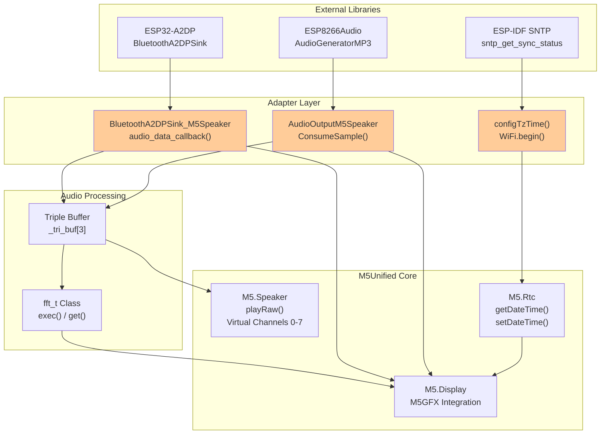

**Sources**: [examples/Advanced/Bluetooth_with_ESP32A2DP/Bluetooth_with_ESP32A2DP.ino:1-677](), [examples/Advanced/MP3_with_ESP8266Audio/MP3_with_ESP8266Audio.ino:1-512](), [examples/Basic/Rtc/Rtc.ino:1-165]()

---

## Bluetooth Audio Streaming (BluetoothA2DPSink_M5Speaker)

The Bluetooth A2DP example demonstrates wireless audio streaming with real-time visualization. It adapts the ESP32-A2DP library to work with M5Unified's speaker system while providing metadata display and spectrum analysis.

### Adapter Class Architecture

The `BluetoothA2DPSink_M5Speaker` class extends `BluetoothA2DPSink` from the ESP32-A2DP library, overriding callback methods to route audio to `M5.Speaker` instead of directly controlling I2S hardware.

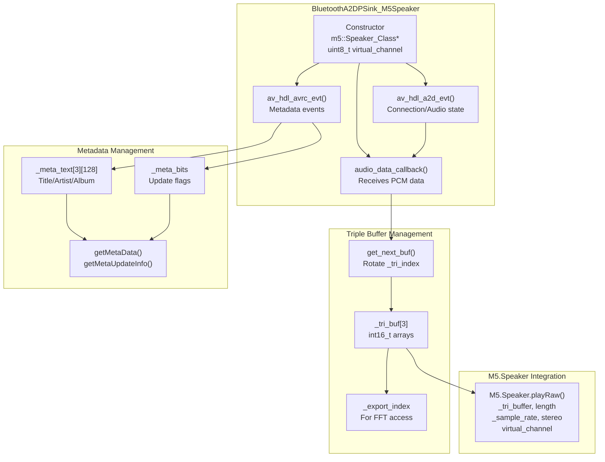

**Key Implementation Details:**

| Component | Purpose | Location |
|-----------|---------|----------|
| `audio_data_callback()` | Receives stereo PCM data from Bluetooth, splits into two halves, sends each to `M5.Speaker.playRaw()` | [examples/Advanced/Bluetooth_with_ESP32A2DP/Bluetooth_with_ESP32A2DP.ino:160-167]() |
| `get_next_buf()` | Allocates/reuses buffers with `heap_caps_malloc()`, rotates `_tri_index` | [examples/Advanced/Bluetooth_with_ESP32A2DP/Bluetooth_with_ESP32A2DP.ino:140-158]() |
| `av_hdl_avrc_evt()` | Parses AVRCP metadata (title, artist, album) into `_meta_text[]` | [examples/Advanced/Bluetooth_with_ESP32A2DP/Bluetooth_with_ESP32A2DP.ino:111-138]() |
| `av_hdl_a2d_evt()` | Detects sample rate from SBC codec configuration (16k/32k/44.1k/48kHz) | [examples/Advanced/Bluetooth_with_ESP32A2DP/Bluetooth_with_ESP32A2DP.ino:62-109]() |
| `getBuffer()` | Returns `_tri_buf[_export_index]` for FFT analysis without blocking audio | [examples/Advanced/Bluetooth_with_ESP32A2DP/Bluetooth_with_ESP32A2DP.ino:26]() |

### Triple Buffer Strategy

The triple buffer system enables simultaneous audio playback, data reception, and FFT analysis:

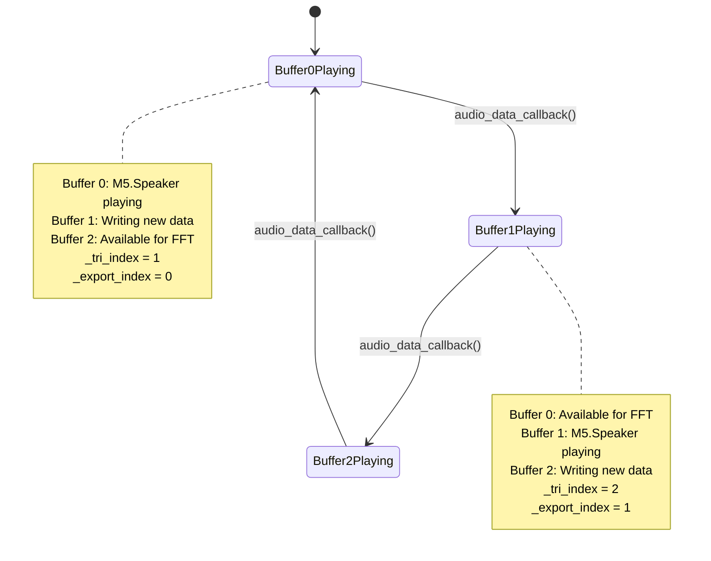

The `audio_data_callback()` receives data in chunks, splits each chunk in half, and submits both halves separately to reduce memory requirements:

```
length >>= 1;  // Divide by 2
M5.Speaker.playRaw(get_next_buf(data, length), length >> 1, ...);
M5.Speaker.playRaw(get_next_buf(&data[length], length), length >> 1, ...);
```

**Sources**: [examples/Advanced/Bluetooth_with_ESP32A2DP/Bluetooth_with_ESP32A2DP.ino:16-168]()

### Configuration and Initialization

The example configures external speaker devices and custom I2S parameters before starting Bluetooth:

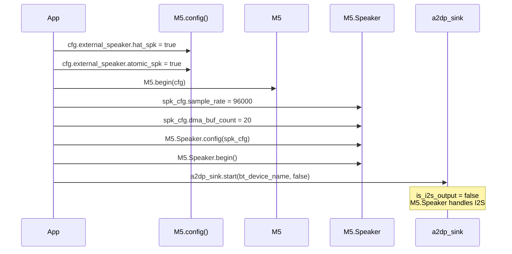

The `is_i2s_output = false` setting in the constructor disables ESP32-A2DP's internal I2S control, delegating it to M5Unified:

**Sources**: [examples/Advanced/Bluetooth_with_ESP32A2DP/Bluetooth_with_ESP32A2DP.ino:570-609]()

---

## MP3 File Playback (AudioOutputM5Speaker)

The MP3 playback example demonstrates SD card audio file playback with visualization. It adapts the ESP8266Audio library's `AudioOutput` interface to work with `M5.Speaker`.

### Adapter Class Implementation

The `AudioOutputM5Speaker` class implements the `AudioOutput` abstract interface, buffering samples and submitting complete buffers to `M5.Speaker.playRaw()`.

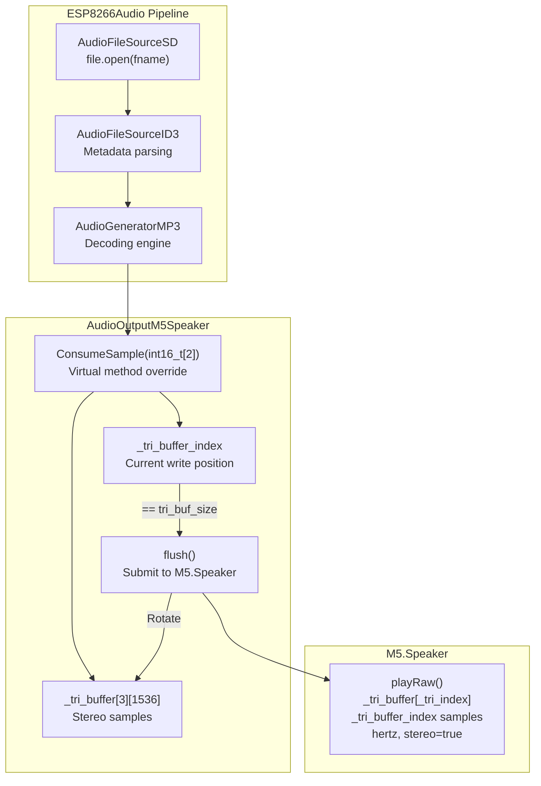

**Key Implementation Details:**

| Method | Purpose | Behavior |
|--------|---------|----------|
| `ConsumeSample()` | Called by MP3 decoder for each stereo sample pair | Writes to `_tri_buffer[_tri_index]`, calls `flush()` when buffer full | [examples/Advanced/MP3_with_ESP8266Audio/MP3_with_ESP8266Audio.ino:38-51]() |
| `flush()` | Submits complete buffer to speaker | Calls `playRaw()`, rotates `_tri_index`, resets `_tri_buffer_index` | [examples/Advanced/MP3_with_ESP8266Audio/MP3_with_ESP8266Audio.ino:52-60]() |
| `stop()` | Stops playback on current channel | Calls `flush()` then `M5.Speaker.stop(_virtual_ch)` | [examples/Advanced/MP3_with_ESP8266Audio/MP3_with_ESP8266Audio.ino:61-66]() |
| `getBuffer()` | Returns oldest complete buffer for FFT | Returns `_tri_buffer[(_tri_index + 2) % 3]` | [examples/Advanced/MP3_with_ESP8266Audio/MP3_with_ESP8266Audio.ino:68]() |

**Sources**: [examples/Advanced/MP3_with_ESP8266Audio/MP3_with_ESP8266Audio.ino:28-77]()

### Metadata Callback Integration

The example registers a metadata callback with `AudioFileSourceID3` to display track information during playback:

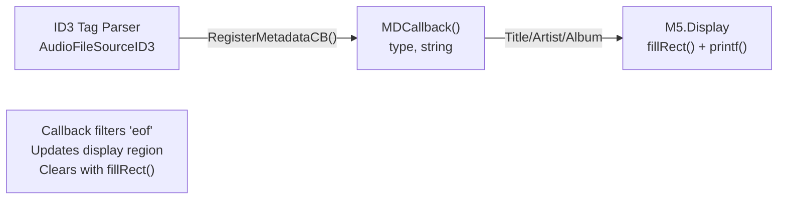

The callback implementation filters out EOF events and updates specific display regions without full screen refresh:

**Sources**: [examples/Advanced/MP3_with_ESP8266Audio/MP3_with_ESP8266Audio.ino:186-200](), [examples/Advanced/MP3_with_ESP8266Audio/MP3_with_ESP8266Audio.ino:215-223]()

### Playback Control Flow

```mermaid
sequenceDiagram
    participant Setup
    participant SD
    participant Play as play(fname)
    participant Loop
    participant MP3 as mp3.loop()
    
    Setup->>SD: SD.begin(GPIO_NUM_4, SPI, 25MHz)
    Setup->>Play: play(filename[0])
    
    Play->>SD: file.open(fname)
    Play->>Play: id3 = new AudioFileSourceID3(&file)
    Play->>Play: id3->RegisterMetadataCB(MDCallback)
    Play->>MP3: mp3.begin(id3, &out)
    
    loop Main Loop
        Loop->>Loop: gfxLoop(&M5.Display)
        Loop->>MP3: mp3.loop()
        MP3->>MP3: Decode chunk
        MP3->>Play: ConsumeSample() calls
        Loop->>Loop: M5.update()
        alt BtnA.wasClicked()
            Loop->>Play: stop()
            Loop->>Play: play(next file)
        end
    end
```

The `mp3.loop()` method must be called continuously to decode and stream audio. It returns `false` when the file ends:

**Sources**: [examples/Advanced/MP3_with_ESP8266Audio/MP3_with_ESP8266Audio.ino:438-511]()

---

## RTC with NTP Synchronization

The RTC example demonstrates network time synchronization using WiFi and SNTP (Simple Network Time Protocol), then storing the synchronized time in the hardware RTC chip.

### Configuration and Detection

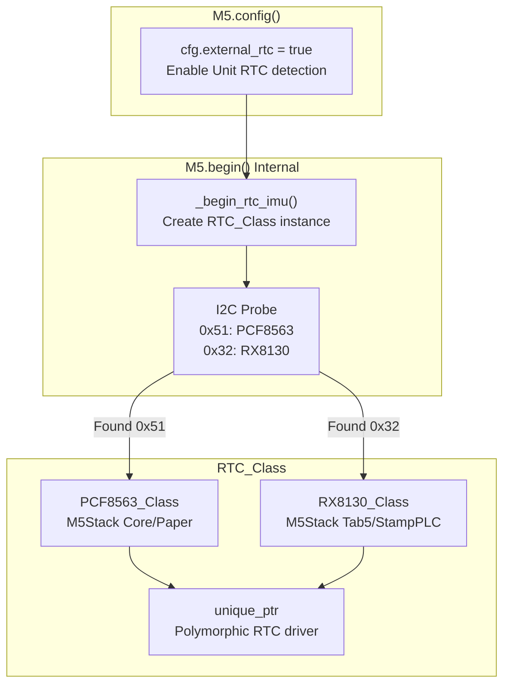

The `external_rtc = true` configuration enables detection of external RTC modules connected via Port A (Ex_I2C):

**Sources**: [examples/Basic/Rtc/Rtc.ino:32-46]()

### NTP Synchronization Process

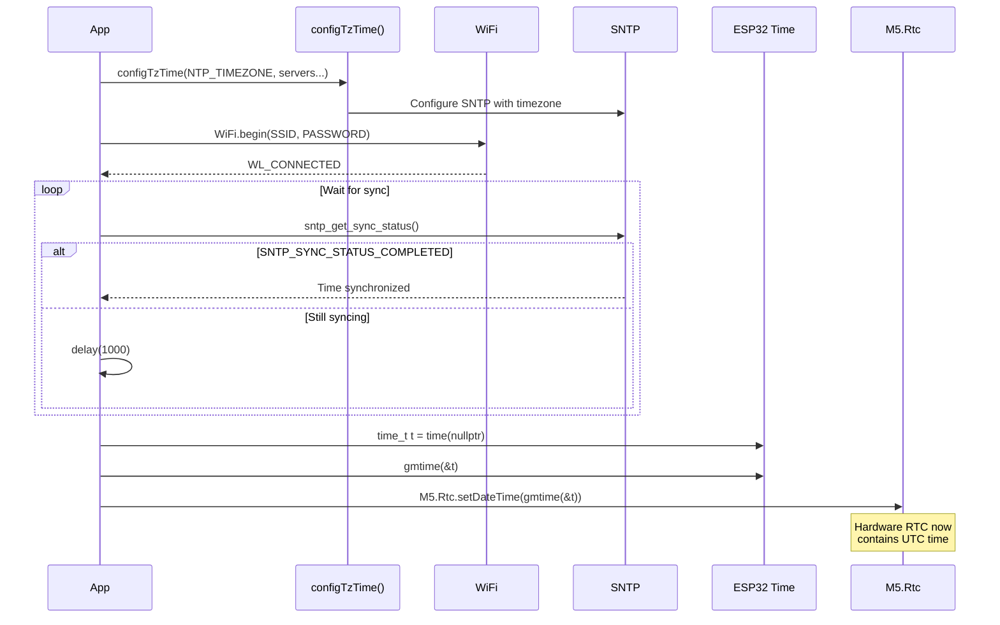

**Key Implementation Steps:**

1. **Timezone Configuration**: `configTzTime(NTP_TIMEZONE, ...)` sets both timezone and NTP servers in one call
2. **WiFi Connection**: Board-specific GPIO configuration for M5Tab5 ESP32-P4 variant
3. **SNTP Synchronization**: Polling `sntp_get_sync_status()` until `SNTP_SYNC_STATUS_COMPLETED`
4. **Second Alignment**: Code waits for second boundary to ensure precise synchronization
5. **RTC Update**: Converts `time_t` to `tm` structure via `gmtime()`, writes to RTC

**Sources**: [examples/Basic/Rtc/Rtc.ino:59-105]()

### Reading and Display

The example continuously reads from both the hardware RTC and ESP32's internal timer, displaying three time values:

| Time Source | Function | Purpose |
|-------------|----------|---------|
| `M5.Rtc.getDateTime()` | Hardware RTC chip | Persistent time, survives deep sleep and power loss |
| `gmtime(&t)` | ESP32 internal UTC | System time maintained by ESP-IDF |
| `localtime(&t)` | ESP32 with timezone | Local time with DST rules applied |

**RTC Data Structures:**

```
rtc_datetime_t {
    rtc_date_t date {
        int16_t year     // 1900-2099
        int8_t month     // 1-12
        int8_t date      // 1-31
        int8_t weekDay   // 0=Sun ... 6=Sat
    }
    rtc_time_t time {
        int8_t hours     // 0-23
        int8_t minutes   // 0-59
        int8_t seconds   // 0-59
    }
}
```

**Sources**: [examples/Basic/Rtc/Rtc.ino:109-146](), [src/utility/rtc/RTC_Base.hpp:18-76]()

### RTC Hardware Abstraction

The polymorphic RTC architecture supports multiple hardware implementations:

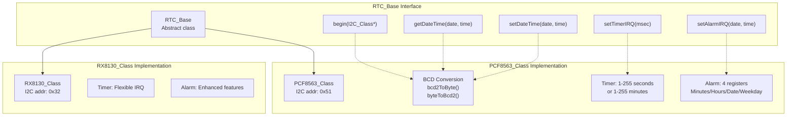

**PCF8563 BCD Conversion:**

The PCF8563 stores time values in BCD (Binary Coded Decimal) format, requiring conversion functions:

- `bcd2ToByte()`: Converts BCD to decimal: `((value >> 4) * 10) + (value & 0x0F)`
- `byteToBcd2()`: Converts decimal to BCD: `(bcdhigh << 4) | (value - (bcdhigh * 10))`

**Timer IRQ Configuration:**

PCF8563 supports two timer modes selected by register 0x0E:
- **1-second cycles**: For 1-270 seconds (value 0x82, countdown 1-255)
- **1-minute cycles**: For 271+ seconds (value 0x83, countdown 1-255 minutes)

**Sources**: [src/utility/rtc/PCF8563_Class.cpp:1-201](), [src/utility/rtc/PCF8563_Class.hpp:1-42](), [src/utility/rtc/RTC_Base.hpp:78-103](), [src/utility/rtc/RX8130_Class.hpp:1-40]()

---

## Audio Visualization with FFT

Both Bluetooth and MP3 examples implement identical FFT-based audio visualization using the `fft_t` class. This section documents the shared visualization architecture.

### FFT_t Class Implementation

The `fft_t` class performs 256-point Fast Fourier Transform using the Cooley-Tukey algorithm with pre-computed twiddle factors:

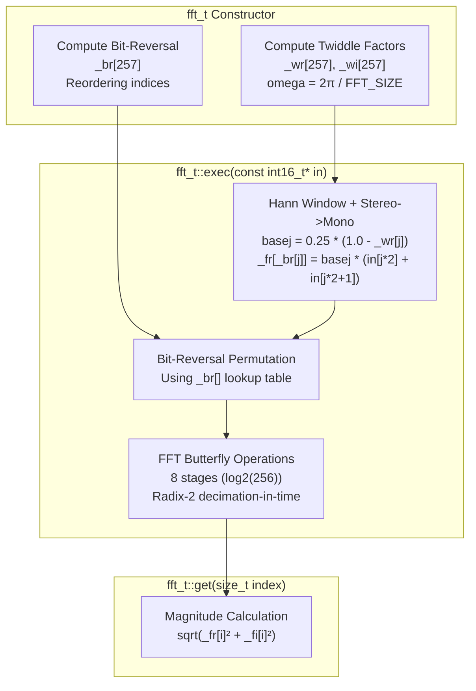

**Key Algorithm Details:**

| Component | Implementation | Purpose |
|-----------|----------------|---------|
| Twiddle factors | `_wr[i] = cos(2π*i/256)`, `_wi[i] = sin(2π*i/256)` | Pre-computed rotation coefficients for butterfly operations |
| Bit-reversal | `_br[je + j] = _br[je] + _br[j]` | Reordering for in-place FFT, computed once in constructor |
| Hann window | `basej = 0.25 * (1.0 - _wr[j])` | Reduces spectral leakage at edges |
| Stereo-to-mono | `(in[j*2] + in[j*2+1])` | Averages left and right channels |
| FFT stages | 8 iterations, `s = 1, 2, 4, 8, 16, 32, 64, 128` | Radix-2 decimation-in-time algorithm |

**Sources**: [examples/Advanced/Bluetooth_with_ESP32A2DP/Bluetooth_with_ESP32A2DP.ino:171-259](), [examples/Advanced/MP3_with_ESP8266Audio/MP3_with_ESP8266Audio.ino:80-168]()

### Visualization Rendering Pipeline

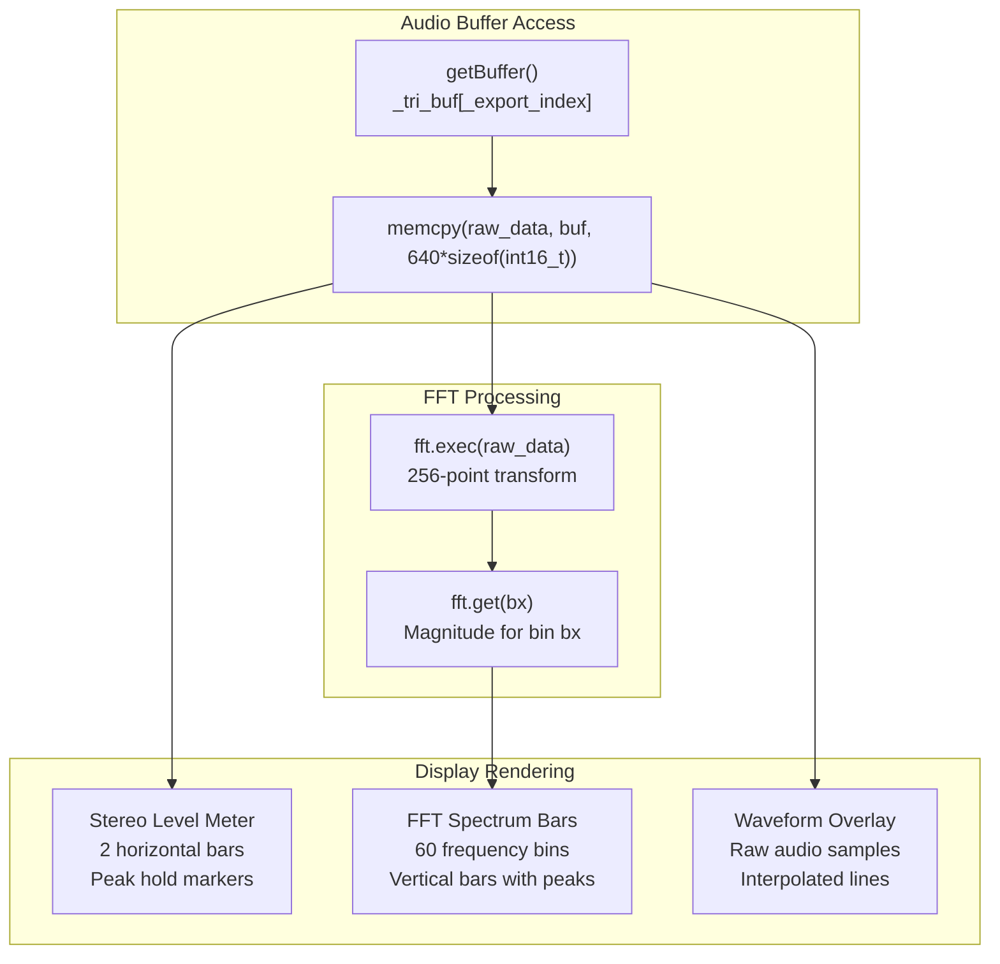

**Rendering Components:**

1. **Stereo Level Meter** (top 6 pixels):
   - Samples every 32nd sample from raw data (20 samples per channel)
   - Finds peak absolute value per channel
   - Draws expanding orange bars with white peak markers
   - Peak markers decay by 1 pixel per frame

2. **FFT Spectrum Bars**:
   - Bar width: `bw = display.width() / 60`, minimum 3 pixels
   - Number of bins: `xe = display.width() / bw`, max 128
   - Height scaling: `y = (magnitude * fft_height) >> 18`
   - Two-color bars: `0x000033` (rising) and `0x99AAFF` (falling)
   - White peak markers with 1-pixel-per-frame decay

3. **Waveform Overlay** (optional, disabled on M5UnitLCD):
   - Plots raw stereo samples as connected lines
   - Interpolates between adjacent samples
   - Color: `0xFFCC33` (below FFT bars) or `0xFFFFFF` (above)
   - Erases previous waveform using background color function

**Background Color Gradient:**

The `bgcolor()` function generates a subtle gradient behind the FFT display:

```
v = ((height - y) << 5) / display_height
return color888(v + 2, v, v + 6)  // Blue-tinted gradient
```

Every 4th pixel row (when `display_height > 44`) draws a horizontal grid line at `0x666666`.

**Sources**: [examples/Advanced/Bluetooth_with_ESP32A2DP/Bluetooth_with_ESP32A2DP.ino:329-568](), [examples/Advanced/MP3_with_ESP8266Audio/MP3_with_ESP8266Audio.ino:279-436]()

### Display Integration and Performance

Both examples implement board-agnostic rendering using M5GFX features:

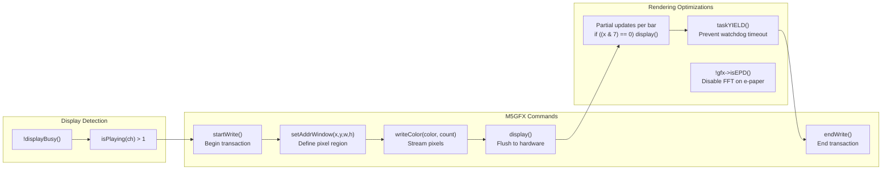

**Performance Strategies:**

| Technique | Implementation | Purpose |
|-----------|----------------|---------|
| `displayBusy()` check | Skip rendering if display controller busy | Prevents buffer overruns on slow displays |
| Partial `display()` calls | Call every 8 bars during FFT rendering | Updates screen progressively, improves responsiveness |
| `taskYIELD()` | After partial updates | Prevents ESP32 watchdog timeout on long render cycles |
| EPD detection | `fft_enabled = !gfx->isEPD()` | Disables FFT on e-paper displays (too slow) |
| Board detection | `wave_enabled = (board != board_M5UnitLCD)` | Disables waveform on small/slow displays |
| `setEpdMode(epd_fastest)` | Fastest refresh mode for EPD | Reduces latency on e-paper displays |

**Display Setup:**

The `gfxSetup()` function configures orientation and enables waveform rendering based on hardware capabilities. Landscape orientation is forced if display is taller than wide:

```
if (gfx->width() < gfx->height()) {
    gfx->setRotation(gfx->getRotation() ^ 1);
}
```

**Sources**: [examples/Advanced/Bluetooth_with_ESP32A2DP/Bluetooth_with_ESP32A2DP.ino:290-327](), [examples/Advanced/Bluetooth_with_ESP32A2DP/Bluetooth_with_ESP32A2DP.ino:418-568](), [examples/Advanced/MP3_with_ESP8266Audio/MP3_with_ESP8266Audio.ino:241-277](), [examples/Advanced/MP3_with_ESP8266Audio/MP3_with_ESP8266Audio.ino:296-436]()