M5Unified Audio System Architecture

# Audio System Architecture

<details>
<summary>Relevant source files</summary>

The following files were used as context for generating this wiki page:

- [examples/Advanced/Mic_FFT/Mic_FFT.ino](examples/Advanced/Mic_FFT/Mic_FFT.ino)
- [src/utility/Mic_Class.cpp](src/utility/Mic_Class.cpp)
- [src/utility/Mic_Class.hpp](src/utility/Mic_Class.hpp)
- [src/utility/Speaker_Class.cpp](src/utility/Speaker_Class.cpp)
- [src/utility/Speaker_Class.hpp](src/utility/Speaker_Class.hpp)

</details>


The Audio System Architecture provides unified audio input and output capabilities across M5Stack devices through `Speaker_Class` (accessible as `M5.Speaker`) and `Mic_Class` (accessible as `M5.Mic`). The architecture abstracts hardware differences (I2S, DAC, PDM, ADC) and runs audio processing on dedicated FreeRTOS tasks (`spk_task`, `mic_task`) with I2S DMA for non-blocking operation.

## Architecture Overview

**Audio System Component Architecture**
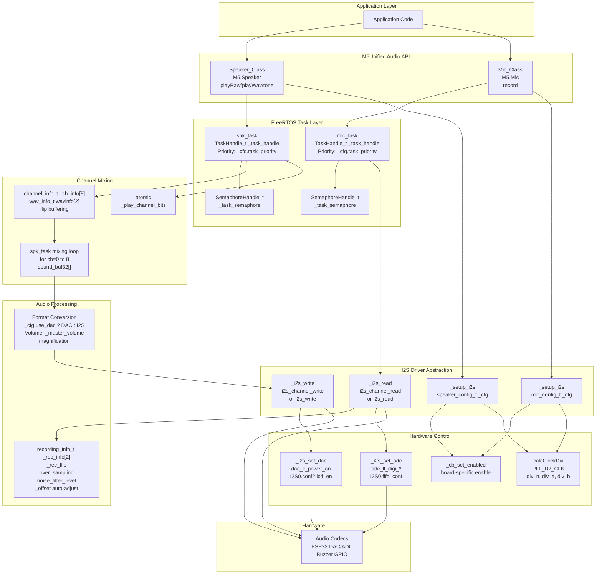

The audio architecture consists of two parallel subsystems:

**Speaker_Class Architecture:**
- 8 virtual channels (`channel_info_t _ch_info[8]`) for concurrent playback
- Flip-buffer mechanism (`wavinfo[2]`) for queue-less continuous operation
- Atomic channel tracking (`_play_channel_bits`) for thread-safe state management
- Background task (`spk_task`) mixes all active channels into `sound_buf32[]` buffer
- Sample rate conversion with linear interpolation (`liner_buf[2][2]`)
- Multiple output modes controlled by `_cfg.use_dac` and `_cfg.buzzer`

**Mic_Class Architecture:**
- Double buffering (`recording_info_t _rec_info[2]`, `_rec_flip`) for continuous recording
- Oversampling accumulation (`over_sampling` parameter) for SNR improvement
- Automatic DC offset correction (`_offset` value)
- Noise filtering with exponential smoothing (`noise_filter_level`)
- Background task (`mic_task`) processes I2S input and fills application buffers

Both tasks communicate via FreeRTOS primitives (`xTaskNotifyGive`, `xSemaphoreGive`) to minimize CPU overhead during idle periods.

Sources:
- [src/utility/Speaker_Class.hpp:82-298]()
- [src/utility/Mic_Class.hpp:98-196]()
- [src/utility/Speaker_Class.cpp:356-910]()
- [src/utility/Mic_Class.cpp:422-706]()

## I2S DMA Architecture

The audio system uses I2S (Inter-IC Sound) with DMA (Direct Memory Access) for efficient, non-blocking audio transfer. The I2S peripheral handles the serial audio protocol while DMA automatically transfers data between memory buffers and hardware FIFOs without CPU intervention.

**ESP-IDF Driver Version Abstraction**
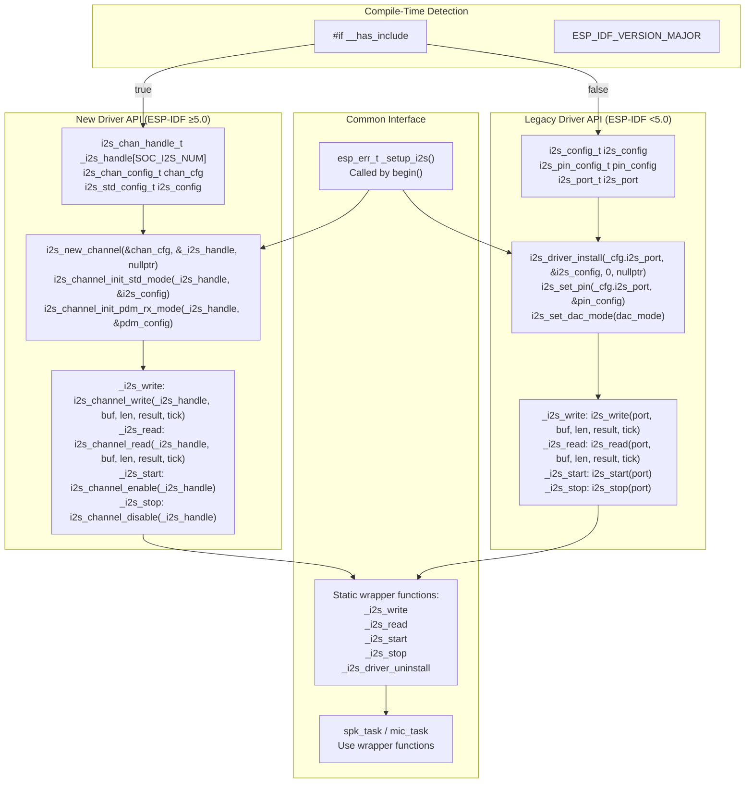

**DMA Buffer Configuration Structure**

The I2S driver uses ping-pong buffering with configurable parameters:

| Parameter | Speaker Default | Mic Default | Purpose |
|-----------|----------------|-------------|---------|
| `dma_buf_count` | 8 | 3 | Number of DMA descriptors |
| `dma_buf_len` | 256 | 128 | Samples per buffer |
| Latency | ~42ms @ 48kHz | ~24ms @ 16kHz | `(dma_buf_len / sample_rate) × dma_buf_count` |

**New Driver Setup (ESP-IDF ≥5.0):**
```
i2s_chan_config_t chan_cfg = I2S_CHANNEL_DEFAULT_CONFIG(_cfg.i2s_port, I2S_ROLE_MASTER);
chan_cfg.dma_desc_num = _cfg.dma_buf_count;
chan_cfg.dma_frame_num = _cfg.dma_buf_len;
i2s_new_channel(&chan_cfg, &_i2s_handle[_cfg.i2s_port], nullptr);
```

**Legacy Driver Setup (ESP-IDF <5.0):**
```
i2s_config.dma_buf_count = _cfg.dma_buf_count;
i2s_config.dma_buf_len = _cfg.dma_buf_len;
i2s_driver_install(_cfg.i2s_port, &i2s_config, 0, nullptr);
```

The wrapper functions (`_i2s_write`, `_i2s_read`, etc.) at [src/utility/Speaker_Class.cpp:82-184]() and [src/utility/Mic_Class.cpp:90-296]() abstract the API differences, allowing the task code to remain version-independent.

Sources:
- [src/utility/Speaker_Class.cpp:82-184]()
- [src/utility/Mic_Class.cpp:90-296]()
- [src/utility/Speaker_Class.cpp:186-297]()
- [src/utility/Mic_Class.cpp:298-417]()
- [src/utility/Speaker_Class.hpp:66-70]()
- [src/utility/Mic_Class.hpp:82-86]()
</thinking>

## Multi-Channel Mixing Architecture

The `Speaker_Class` implements 8 virtual audio channels mixed in real-time by `spk_task`. Each channel maintains independent playback state and supports sample rate conversion, enabling simultaneous playback of audio at different rates.

**Channel Mixing Data Flow**
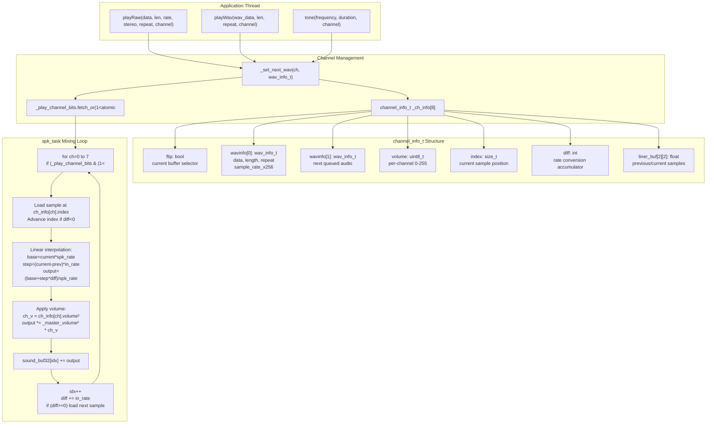

**Channel State Management**

The `channel_info_t` structure at [src/utility/Speaker_Class.hpp:265-274]() maintains per-channel state:

```cpp
struct channel_info_t {
    wav_info_t wavinfo[2];     // Current/next flip buffer
    size_t index;               // Sample position in data
    int diff;                   // Rate conversion accumulator
    volatile uint8_t volume;    // Channel volume 0-255
    volatile bool flip;         // Buffer selector
    float liner_buf[2][2];      // Interpolation state [prev/current][L/R]
};
```

**Flip Buffer Mechanism:**
- `wavinfo[!flip]`: Currently playing audio
- `wavinfo[flip]`: Next queued audio
- When current finishes (`repeat==0`), swap flip flag and clear old buffer
- Allows queueing next audio while current plays without gap

**Atomic Channel Tracking:**
```cpp
std::atomic<uint16_t> _play_channel_bits;  // Bitmask of active channels
```
- Bit N set: channel N is active
- Updated atomically by application thread (`fetch_or`, `fetch_and`)
- Read by `spk_task` to determine which channels to mix
- Thread-safe without mutex overhead

The mixing loop at [src/utility/Speaker_Class.cpp:624-790]() processes all active channels, accumulating their contributions to `sound_buf32[]` with rate conversion and volume scaling applied per sample.

Sources:
- [src/utility/Speaker_Class.hpp:244-274]()
- [src/utility/Speaker_Class.cpp:624-790]()
- [src/utility/Speaker_Class.cpp:290-292]()
- [src/utility/Speaker_Class.cpp:1013-1036]()

## Board-Specific Audio Hardware Control

The audio system integrates with external audio codecs and amplifiers through callback-based board-specific initialization. This abstraction separates audio data flow (I2S) from hardware control (I2C, GPIO).

**Callback-Based Hardware Control Architecture**
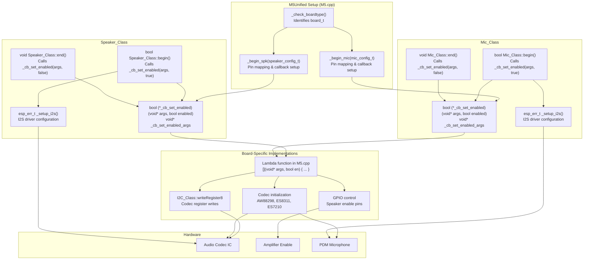

**Callback Registration Pattern**

The `Speaker_Class` and `Mic_Class` provide callback registration at [src/utility/Speaker_Class.hpp:242]() and [src/utility/Mic_Class.hpp:161]():

```cpp
class Speaker_Class {
    void setCallback(void* args, bool(*func)(void*, bool)) {
        _cb_set_enabled = func;
        _cb_set_enabled_args = args;
    }
private:
    bool (*_cb_set_enabled)(void* args, bool enabled) = nullptr;
    void* _cb_set_enabled_args = nullptr;
};
```

During `M5.begin()`, the board-specific initialization code registers a callback:
```cpp
// Example from M5Unified initialization
Speaker.setCallback(&board_config, [](void* args, bool enable) {
    if (enable) {
        // Initialize codec via I2C
        // Enable amplifier GPIO
    } else {
        // Disable amplifier
        // Power down codec
    }
    return true;
});
```

**Callback Invocation Points:**
- `Speaker_Class::begin()` at [src/utility/Speaker_Class.cpp:921](): Calls `_cb_set_enabled(args, true)` before I2S setup
- `Speaker_Class::end()` at [src/utility/Speaker_Class.cpp:950](): Calls `_cb_set_enabled(args, false)` after stopping task
- `Mic_Class::begin()` at [src/utility/Mic_Class.cpp:725](): Calls `_cb_set_enabled(args, true)` before I2S setup
- `Mic_Class::end()` at [src/utility/Mic_Class.cpp:757](): Calls `_cb_set_enabled(args, false)` after stopping task

This design separates hardware-specific initialization from the generic audio processing code, allowing the audio classes to remain board-agnostic.

Sources:
- [src/utility/Speaker_Class.hpp:242-243]()
- [src/utility/Mic_Class.hpp:161-162]()
- [src/utility/Speaker_Class.cpp:912-946]()
- [src/utility/Mic_Class.cpp:708-759]()

## Sample Rate Conversion and Interpolation

The audio system performs real-time sample rate conversion to accommodate audio data at arbitrary rates. The speaker uses linear interpolation for upsampling/downsampling, while the microphone uses accumulation-based downsampling.

**Speaker Sample Rate Conversion**
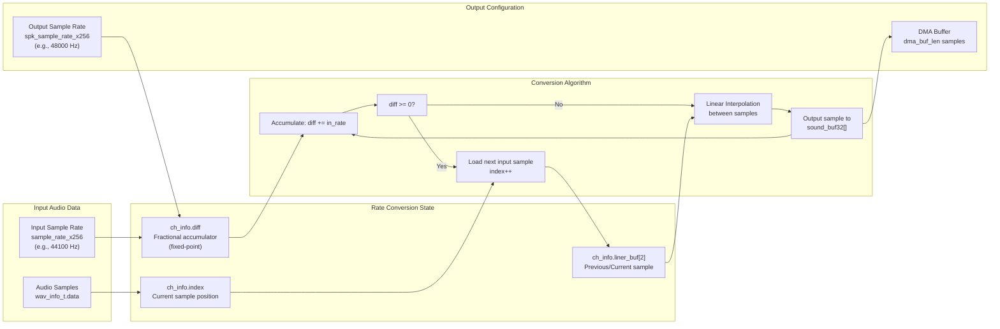

**Speaker Rate Conversion Algorithm**
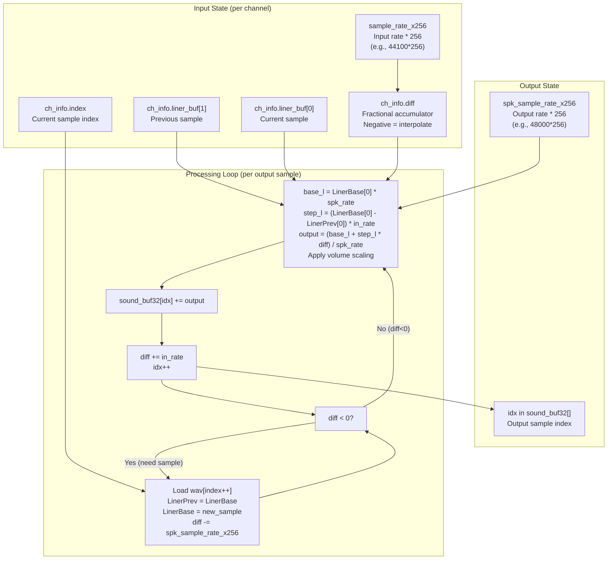

**Linear Interpolation Implementation**

From [src/utility/Speaker_Class.cpp:745-786](), the interpolation calculates intermediate samples:

```cpp
// Fixed-point rate with 256x multiplier
#define SAMPLERATE_MUL 256
const int32_t spk_sample_rate_x256 = output_rate * SAMPLERATE_MUL;
const int32_t in_rate = wav_info.sample_rate_x256;

// Linear interpolation between liner_prev and liner_base
float base_l = liner_base[0];                    // Current sample
float step_l = base_l - liner_prev[0];           // Delta to previous
base_l *= spk_sample_rate_x256;                  // Scale by output rate
base_l += step_l * ch_diff;                      // Add fractional position
step_l *= in_rate;                               // Scale delta by input rate

// Output = (base + step*position) / output_rate
int32_t output = base_l / spk_sample_rate_x256;
```

The `ch_diff` accumulator determines the fractional position between samples:
- Starts negative after loading a new input sample
- Incremented by `in_rate` per output sample
- When `ch_diff >= 0`, load next input sample and subtract `spk_sample_rate_x256`

This allows smooth conversion between arbitrary rates (e.g., 44.1kHz → 48kHz).

**Microphone Oversampling**

From [src/utility/Mic_Class.cpp:603-650](), downsampling uses accumulation:

```cpp
int32_t sum_value[2] = {0, 0};  // Stereo accumulator
int os_remain = over_sampling;  // Samples to accumulate

do {
    sum_value[0] += src_buf[src_idx];    // Accumulate left
    sum_value[1] += src_buf[src_idx+1];  // Accumulate right
    src_idx += 2;
} while (--os_remain && (src_idx < src_len));

// When os_remain==0, output averaged sample
float f_gain = (float)gain / (oversampling << 1);
output_sample = sum_value[0] * f_gain;
```

Oversampling benefits:
- Reduces quantization noise by sqrt(over_sampling)
- Improves effective resolution (3dB SNR per 2x oversampling)
- Configured via `mic_config_t.over_sampling` (1-8x, default 2x)

Sources:
- [src/utility/Speaker_Class.cpp:353-354]()
- [src/utility/Speaker_Class.cpp:745-786]()
- [src/utility/Mic_Class.cpp:422-427]()
- [src/utility/Mic_Class.cpp:603-650]()

## Clock Generation and Platform Differences

The audio system abstracts clock generation differences across ESP32 chip variants using platform-specific PLL configurations and fractional dividers.

**Platform-Specific Clock Configuration**
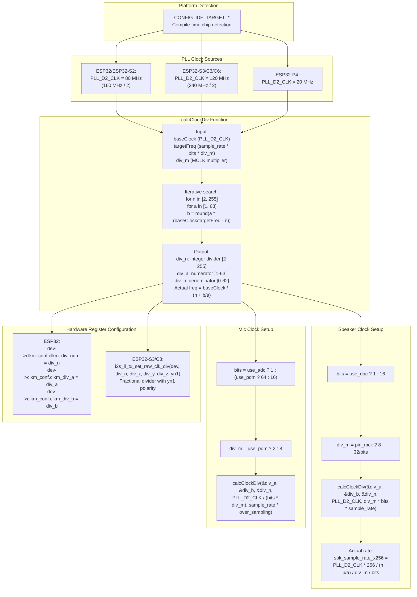

**Clock Divider Calculation Algorithm**

The `calcClockDiv()` function at [src/utility/Speaker_Class.cpp:300-351]() computes optimal fractional dividers:

```cpp
void calcClockDiv(uint32_t* div_a, uint32_t* div_b, uint32_t* div_n, 
                  uint32_t baseClock, uint32_t targetFreq) {
    float fdiv = (float)baseClock / targetFreq;
    uint32_t n = (uint32_t)fdiv;  // Integer part
    fdiv -= n;                     // Fractional part
    
    // Search for best a/b approximation
    uint32_t save_diff = UINT32_MAX;
    for (uint32_t a = 1; a < 64; ++a) {
        uint32_t b = roundf(a * fdiv);
        if (a <= b) continue;
        uint32_t diff = abs((int)(check_target - ((check_base * a) / (n * a + b))));
        if (save_diff <= diff) continue;
        save_diff = diff;
        save_a = a; save_b = b; save_n = n;
        if (!diff) break;  // Perfect match
    }
}
```

**Platform Clock Differences**

| Platform | PLL_D2_CLK | Typical Sample Rate | Actual Rate (48kHz target) |
|----------|------------|---------------------|----------------------------|
| ESP32 | 80 MHz | 48000 Hz | 48000.0 Hz |
| ESP32-S3 | 120 MHz | 48000 Hz | 48000.0 Hz |
| ESP32-C3 | 120 MHz | 48000 Hz | 48000.0 Hz |
| ESP32-P4 | 20 MHz | 48000 Hz | 47991.1 Hz |

The fractional divider achieves sub-Hz accuracy on most platforms. From [src/utility/Speaker_Class.cpp:396-400]():
```cpp
const int32_t spk_sample_rate_x256 = (float)PLL_D2_CLK * SAMPLERATE_MUL 
    / ((float)(div_b * div_m * bits) / (float)div_a + (div_n * div_m * bits));
```

Sources:
- [src/utility/Speaker_Class.cpp:300-351]()
- [src/utility/Speaker_Class.cpp:381-400]()
- [src/utility/Mic_Class.cpp:431-447]()
- [src/utility/Speaker_Class.cpp:413-489]()
- [src/utility/Mic_Class.cpp:460-526]()

## Task Synchronization and Double Buffering

The audio tasks use FreeRTOS task notifications and semaphores for efficient synchronization between the application thread and background audio processing tasks.

**Speaker Task Synchronization Flow**
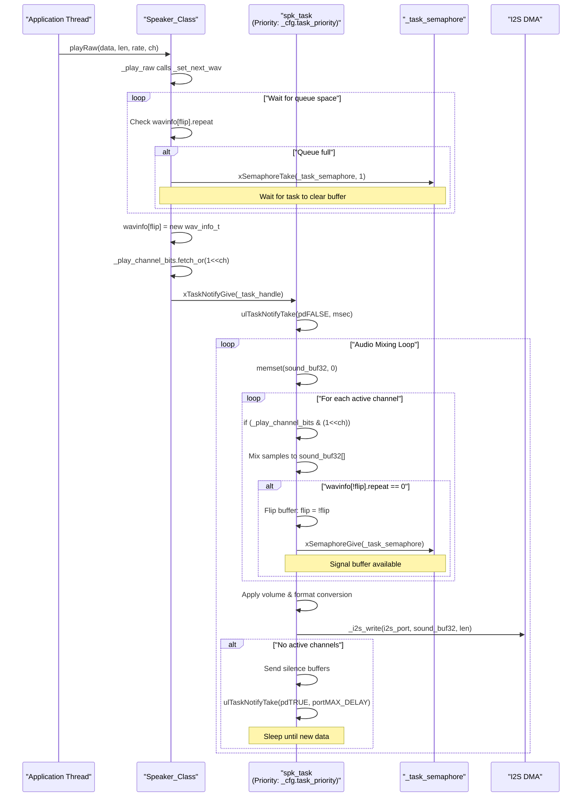

**Microphone Task Synchronization Flow**
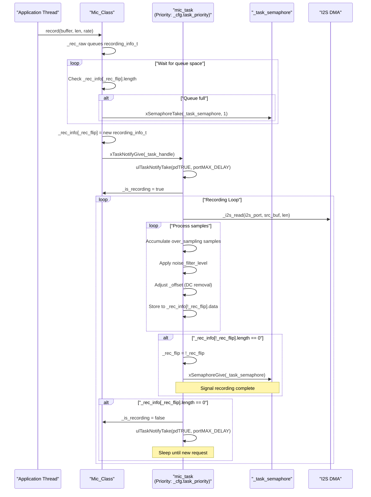

**FreeRTOS Synchronization Primitives**

The audio system uses two synchronization mechanisms:

**1. Task Notifications** (lightweight, faster than semaphores):
```cpp
// Wake up task from application thread
xTaskNotifyGive(_task_handle);

// Task waits for notification
ulTaskNotifyTake(pdTRUE, portMAX_DELAY);   // Clear on take, infinite wait
ulTaskNotifyTake(pdFALSE, wait_msec);      // Don't clear, timeout in ms
```

**2. Binary Semaphores** (for buffer completion signaling):
```cpp
// Task signals buffer ready
xSemaphoreGive(_task_semaphore);

// Application waits for buffer
xSemaphoreTake(_task_semaphore, 1);  // 1 tick timeout
```

**Double Buffering Implementation**

From [src/utility/Speaker_Class.cpp:632-665]() and [src/utility/Mic_Class.cpp:567-590]():

```cpp
// Speaker: per-channel flip buffer
struct channel_info_t {
    wav_info_t wavinfo[2];   // [0]=playing when flip=false, [1]=next
    volatile bool flip;       // Buffer selector
};

// Play current: wavinfo[!flip], queue next: wavinfo[flip]
if (wavinfo[!flip].repeat == 0) {
    flip = !flip;                    // Swap buffers
    xSemaphoreGive(_task_semaphore); // Signal queue space available
}

// Microphone: double record buffer
recording_info_t _rec_info[2];
volatile bool _rec_flip;

// Fill _rec_info[!_rec_flip], queue _rec_info[_rec_flip]
if (_rec_info[!_rec_flip].length == 0) {
    _rec_flip = !_rec_flip;          // Swap buffers
    xSemaphoreGive(_task_semaphore); // Signal recording complete
}
```

This design enables zero-copy streaming: the application queues a buffer pointer, the task processes directly from/to that buffer, then signals completion.

Sources:
- [src/utility/Speaker_Class.cpp:517-576]()
- [src/utility/Speaker_Class.cpp:632-665]()
- [src/utility/Speaker_Class.cpp:1013-1036]()
- [src/utility/Mic_Class.cpp:567-590]()
- [src/utility/Mic_Class.cpp:761-780]()

## Speaker Subsystem

The `Speaker_Class` provides audio playback capabilities with support for:
- Multi-channel audio playback (up to 8 virtual channels)
- Support for 8-bit and 16-bit audio data
- WAV file playback
- Tone generation
- Volume control (master and per-channel)
- Multiple output modes (I2S, DAC, buzzer)

### Speaker Class Structure

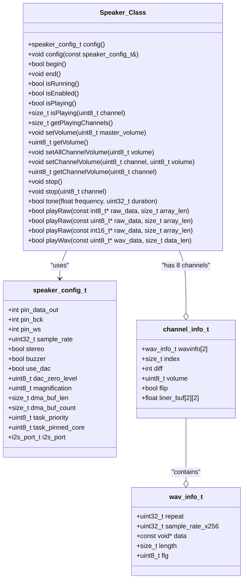

Sources:
- [src/utility/Speaker_Class.hpp:79-296]()

### Speaker Configuration

The `Speaker_Class` is configured using a `speaker_config_t` struct with the following key parameters:

| Parameter | Description | Default |
|-----------|-------------|---------|
| pin_data_out | I2S data output pin | I2S_PIN_NO_CHANGE |
| pin_bck | I2S bit clock pin | I2S_PIN_NO_CHANGE |
| pin_ws | I2S word select pin | I2S_PIN_NO_CHANGE |
| sample_rate | Output sample rate in Hz | 48000 |
| stereo | Enable stereo output | false |
| buzzer | Use single GPIO buzzer mode | false |
| use_dac | Use DAC output (ESP32 GPIO 25/26) | false |
| dac_zero_level | DAC zero level reference (0=Dynamic) | 0 |
| magnification | Output value multiplier | 16 |
| dma_buf_len | DMA buffer length | 256 |
| dma_buf_count | Number of DMA buffers | 8 |
| task_priority | Background task priority | 2 |
| task_pinned_core | Core to run background task (255=any) | 255 |
| i2s_port | I2S port to use | I2S_NUM_0 |

Sources:
- [src/utility/Speaker_Class.hpp:33-77]()

### Speaker Operation

The `Speaker_Class` operates using a background task (`spk_task`) that processes audio data and outputs it through the configured interface (I2S, DAC, or buzzer). The playback process follows this sequence:

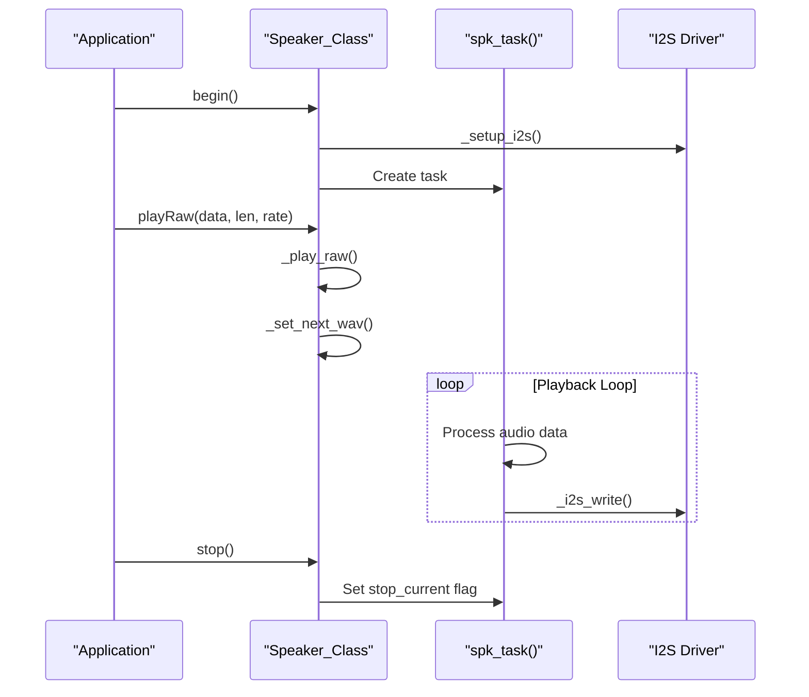

Sources:
- [src/utility/Speaker_Class.cpp:340-875]() - `spk_task()` implementation
- [src/utility/Speaker_Class.cpp:877-911]() - `begin()` method
- [src/utility/Speaker_Class.cpp:913-938]() - `end()` method
- [src/utility/Speaker_Class.cpp:940-964]() - `stop()` method
- [src/utility/Speaker_Class.cpp:1000-1026]() - `_play_raw()` method
- [src/utility/Speaker_Class.cpp:1028-1108]() - `playWav()` method

### Speaker Usage Examples

Basic usage of the speaker subsystem:

```cpp
// Initialize M5Unified with default configuration
M5.begin();

// Play a tone at 440 Hz for 1000 ms
M5.Speaker.tone(440, 1000);

// Set the master volume to 128 (range 0-255)
M5.Speaker.setVolume(128);

// Play raw audio data
M5.Speaker.playRaw(audio_data, data_length, 44100, false);

// Play a WAV file
M5.Speaker.playWav(wav_data, wav_length);

// Stop all audio playback
M5.Speaker.stop();
```

Custom speaker configuration:

```cpp
// Custom speaker configuration
auto cfg = M5.config();
cfg.speaker.pin_data_out = 25;  // DAC pin
cfg.speaker.use_dac = true;
cfg.speaker.sample_rate = 44100;
cfg.speaker.stereo = false;
M5.begin(cfg);
```

Multi-channel audio playback:

```cpp
// Play a tone on channel 0
M5.Speaker.tone(440, 1000, 0);

// Play a different tone on channel 1
M5.Speaker.tone(880, 1000, 1);

// Set the volume for channel 0
M5.Speaker.setChannelVolume(0, 200);

// Stop playback on channel 1
M5.Speaker.stop(1);
```

## Microphone Subsystem

The `Mic_Class` provides audio recording capabilities with support for:
- Recording to 8-bit or 16-bit buffers
- Configurable sample rate
- Mono/stereo recording
- Noise filtering
- Multiple input modes (I2S, PDM, ADC)

### Microphone Class Structure

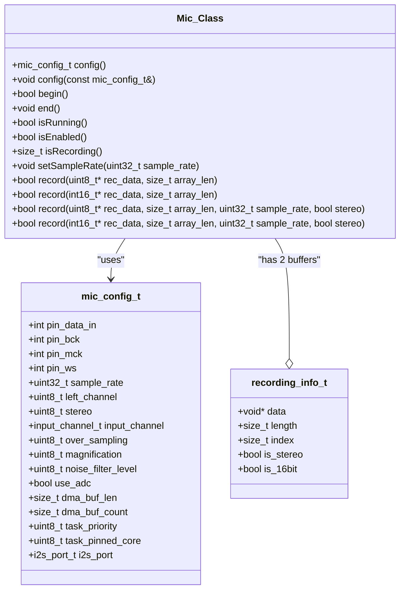

Sources:
- [src/utility/Mic_Class.hpp:98-196]()

### Microphone Configuration

The `Mic_Class` is configured using a `mic_config_t` struct with the following key parameters:

| Parameter | Description | Default |
|-----------|-------------|---------|
| pin_data_in | I2S data input pin | -1 |
| pin_bck | I2S bit clock pin | I2S_PIN_NO_CHANGE |
| pin_mck | I2S master clock pin | I2S_PIN_NO_CHANGE |
| pin_ws | I2S word select pin | I2S_PIN_NO_CHANGE |
| sample_rate | Input sample rate in Hz | 16000 |
| input_channel | Input channel (right/left/stereo) | input_only_right |
| over_sampling | Sampling times to obtain average | 2 |
| magnification | Input value multiplier | 16 |
| noise_filter_level | Noise filtering coefficient | 0 |
| use_adc | Use analog input (ADC) | false |
| dma_buf_len | DMA buffer length | 128 |
| dma_buf_count | Number of DMA buffers | 8 |
| task_priority | Background task priority | 2 |
| task_pinned_core | Core to run background task (255=any) | 255 |
| i2s_port | I2S port to use | I2S_NUM_0 |

Sources:
- [src/utility/Mic_Class.hpp:42-96]()

### Microphone Operation

The `Mic_Class` operates using a background task (`mic_task`) that reads audio data from the configured interface (I2S, PDM, or ADC) and stores it in application-provided buffers. The recording process follows this sequence:

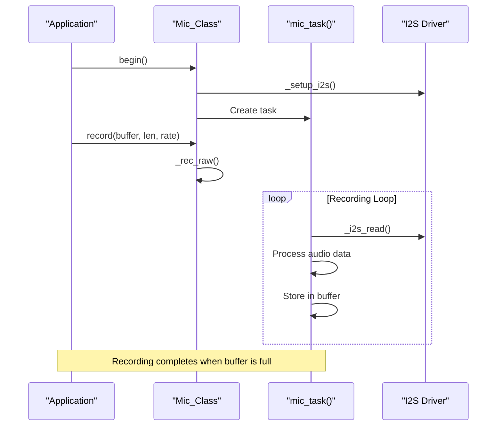

Sources:
- [src/utility/Mic_Class.cpp:407-673]() - `mic_task()` implementation
- [src/utility/Mic_Class.cpp:675-712]() - `begin()` method
- [src/utility/Mic_Class.cpp:714-726]() - `end()` method
- [src/utility/Mic_Class.cpp:728-747]() - `_rec_raw()` method

### Microphone Usage Examples

Basic usage of the microphone subsystem:

```cpp
// Initialize M5Unified with default configuration
M5.begin();

// Allocate a buffer for recording
int16_t audio_buffer[1024];

// Record audio data
M5.Mic.record(audio_buffer, 1024, 16000, false);

// Wait for recording to complete
while (M5.Mic.isRecording()) {
  delay(10);
}
```

Custom microphone configuration:

```cpp
// Custom microphone configuration
auto cfg = M5.config();
cfg.mic.pin_data_in = 34;  // ADC pin
cfg.mic.use_adc = true;
cfg.mic.sample_rate = 16000;
cfg.mic.over_sampling = 2;
cfg.mic.noise_filter_level = 32;
M5.begin(cfg);
```

## Implementation Details

### Hardware Support

The Audio System supports various hardware configurations across the M5Stack ecosystem:

#### Speaker Output Options:
- I2S digital audio output (standard for most M5Stack devices)
- DAC analog output (ESP32 GPIO 25/26)
- Simple buzzer output (single GPIO pin)

#### Microphone Input Options:
- I2S digital audio input (standard for most M5Stack microphones)
- PDM digital audio input (used in some MEMS microphones)
- ADC analog input (for analog microphones)

The system automatically adapts to different ESP32 chip versions (ESP32, ESP32-S2, ESP32-S3, ESP32-C3, ESP32-C6) through conditional compilation.

Sources:
- [src/utility/Speaker_Class.cpp:40-64]() - ESP32 version detection
- [src/utility/Mic_Class.cpp:46-73]() - ESP32 version detection

### Speaker Implementation

The Speaker_Class implementation uses a background FreeRTOS task (`spk_task`) that:
1. Sets up the I2S driver with the configured parameters
2. Waits for audio data to be queued for playback
3. Mixes audio data from all active channels
4. Applies volume adjustments and processing
5. Outputs the processed data through I2S, DAC, or buzzer

The implementation supports sample rate conversion, allowing playback of audio data at different rates than the configured output rate.

Sources:
- [src/utility/Speaker_Class.cpp:340-875]() - `spk_task()` implementation
- [src/utility/Speaker_Class.cpp:975-998]() - `wav_info_t` management
- [src/utility/Speaker_Class.cpp:1000-1026]() - `_play_raw()` method

### Microphone Implementation

The Mic_Class implementation uses a background FreeRTOS task (`mic_task`) that:
1. Sets up the I2S driver with the configured parameters
2. Starts I2S input
3. Waits for a recording request
4. Reads audio data from I2S
5. Applies processing (oversampling, noise filtering, etc.)
6. Stores the processed data in the application buffer

The implementation includes automatic zero-level adjustment and optional noise filtering.

Sources:
- [src/utility/Mic_Class.cpp:407-673]() - `mic_task()` implementation
- [src/utility/Mic_Class.cpp:594-596]() - Automatic zero level adjustment
- [src/utility/Mic_Class.cpp:603-616]() - Noise filtering

## Advanced Audio Applications

The Audio System serves as a foundation for more advanced audio applications, including:

- **Real-time FFT Analysis**: Analyzing the frequency spectrum of audio signals
- **Bluetooth A2DP**: Streaming audio via Bluetooth
- **Web Radio**: Streaming audio from Internet radio sources
- **MP3 Playback**: Decoding and playing MP3 files
- **Text-to-Speech**: Converting text to spoken audio

An example of FFT analysis is included in the M5Unified library, demonstrating real-time frequency analysis of microphone input.

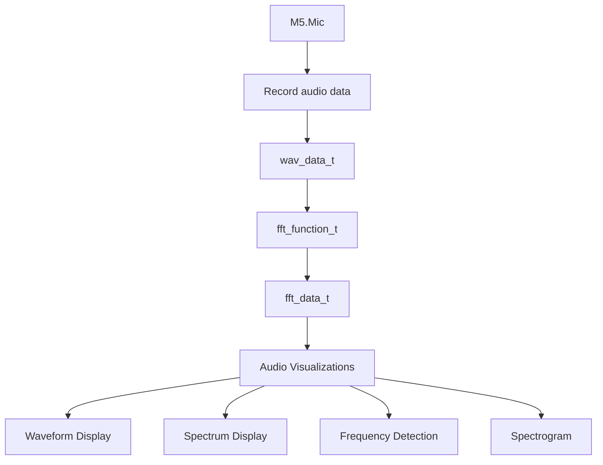

Sources:
- [examples/Advanced/Mic_FFT/Mic_FFT.ino]()