M5Unified Audio Visualization with FFT

# Audio Visualization with FFT

<details>
<summary>Relevant source files</summary>

The following files were used as context for generating this wiki page:

- [examples/Advanced/Bluetooth_with_ESP32A2DP/Bluetooth_with_ESP32A2DP.ino](examples/Advanced/Bluetooth_with_ESP32A2DP/Bluetooth_with_ESP32A2DP.ino)
- [examples/Advanced/MP3_with_ESP8266Audio/MP3_with_ESP8266Audio.ino](examples/Advanced/MP3_with_ESP8266Audio/MP3_with_ESP8266Audio.ino)
- [examples/Basic/Speaker/Speaker.ino](examples/Basic/Speaker/Speaker.ino)

</details>


This document describes how to implement real-time audio spectrum analysis and visualization using Fast Fourier Transform (FFT) with M5Unified. It covers the FFT algorithm implementation, audio buffer acquisition, frequency spectrum rendering, and waveform display integration with M5GFX graphics.

For information about the underlying audio system and I2S configuration, see [Audio System Architecture](4). For integrating external audio libraries that provide the audio source, see [Bluetooth Audio Streaming](9.1) and [MP3 File Playback](9.2).

## System Overview

Audio visualization with FFT transforms time-domain audio samples into frequency-domain spectrum data that can be displayed as visual bars. The system captures raw audio data from playback buffers, applies FFT analysis, and renders frequency spectrum bars with peak detection, combined with waveform overlay.

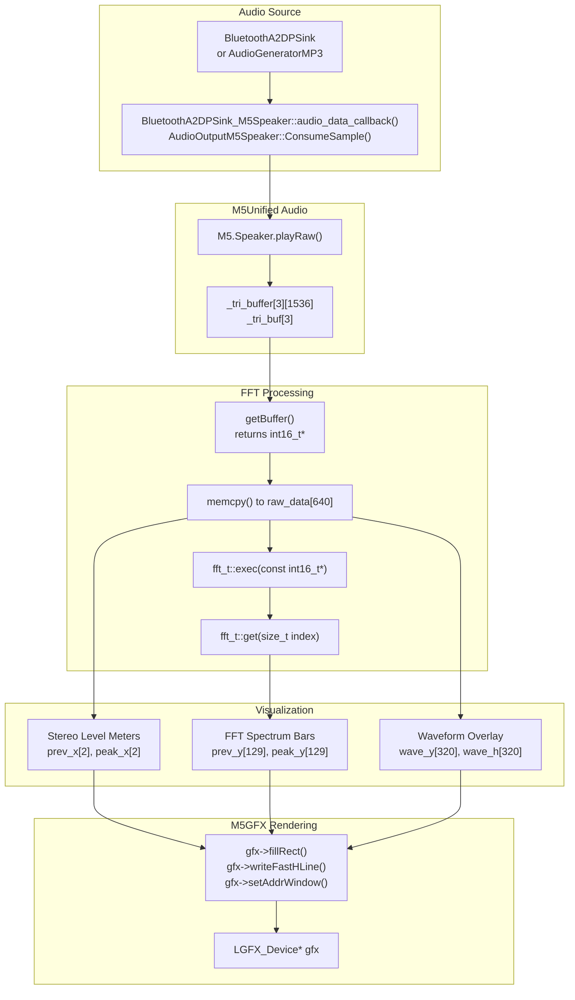

**Sources:** [examples/Advanced/Bluetooth_with_ESP32A2DP/Bluetooth_with_ESP32A2DP.ino:1-677](), [examples/Advanced/MP3_with_ESP8266Audio/MP3_with_ESP8266Audio.ino:1-512]()

### Data Flow Architecture

| Stage | Component | Buffer Size | Data Format |
|-------|-----------|-------------|-------------|
| Audio Source | External Library | Variable | Stereo 16-bit PCM |
| Adapter Buffer | `_tri_buffer[3][]` | 1536 samples | Stereo interleaved |
| FFT Input | `raw_data[]` | 640 samples (320×2) | Stereo interleaved |
| FFT Processing | `fft_t` internal | 256 bins | Float complex |
| Spectrum Output | `get(index)` | 128 bins | 32-bit magnitude |

**Sources:** [examples/Advanced/Bluetooth_with_ESP32A2DP/Bluetooth_with_ESP32A2DP.ino:45-48,261-271](), [examples/Advanced/MP3_with_ESP8266Audio/MP3_with_ESP8266Audio.ino:73-76,170-184]()

## FFT Implementation

The FFT implementation uses the Cooley-Tukey radix-2 algorithm with pre-computed twiddle factors for efficient real-time analysis. It processes 256-point FFT on stereo audio data with Hann window function applied during input stage.

### FFT Class Structure

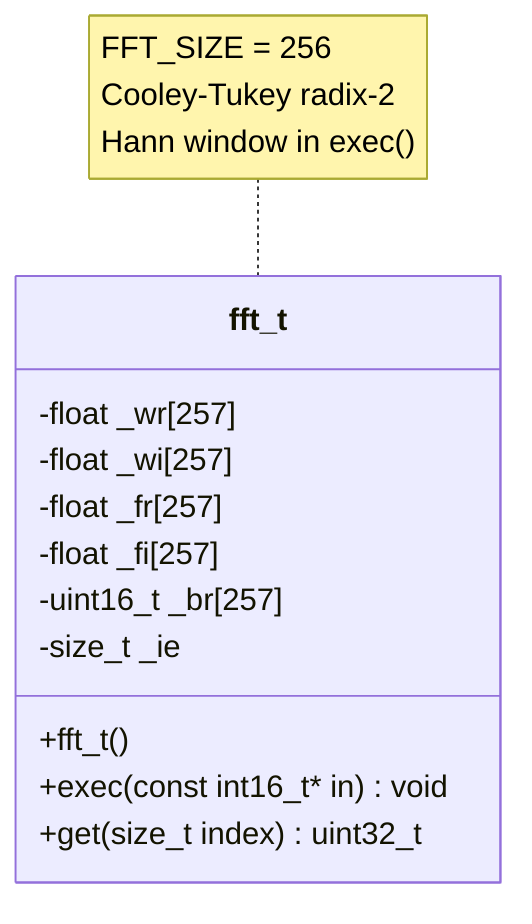

**Sources:** [examples/Advanced/Bluetooth_with_ESP32A2DP/Bluetooth_with_ESP32A2DP.ino:171-259](), [examples/Advanced/MP3_with_ESP8266Audio/MP3_with_ESP8266Audio.ino:80-168]()

### FFT Algorithm Components

| Component | Array | Size | Purpose |
|-----------|-------|------|---------|
| Real twiddle factors | `_wr[]` | 257 | Pre-computed cosine values |
| Imaginary twiddle factors | `_wi[]` | 257 | Pre-computed sine values |
| Real frequency data | `_fr[]` | 257 | Complex FFT real part |
| Imaginary frequency data | `_fi[]` | 257 | Complex FFT imaginary part |
| Bit-reversal table | `_br[]` | 257 | Index remapping for FFT |

**Sources:** [examples/Advanced/Bluetooth_with_ESP32A2DP/Bluetooth_with_ESP32A2DP.ino:174-179]()

### Initialization and Twiddle Factor Computation

The `fft_t` constructor pre-calculates all twiddle factors and the bit-reversal lookup table. This eliminates runtime trigonometric calculations for optimal performance.

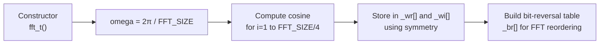

**Sources:** [examples/Advanced/Bluetooth_with_ESP32A2DP/Bluetooth_with_ESP32A2DP.ino:182-213]()

The twiddle factor computation exploits symmetry properties:
- `_wr[i]` and `_wr[FFT_SIZE/2 - i]` have opposite signs
- `_wi[FFT_SIZE/4 + i]` and `_wi[FFT_SIZE/4 - i]` are identical

**Sources:** [examples/Advanced/Bluetooth_with_ESP32A2DP/Bluetooth_with_ESP32A2DP.ino:191-199]()

### FFT Execution Pipeline

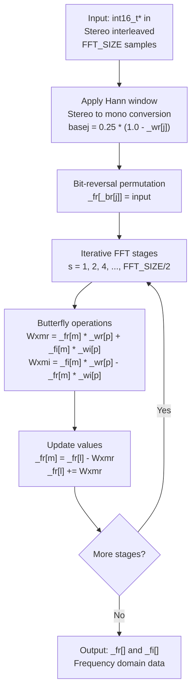

**Sources:** [examples/Advanced/Bluetooth_with_ESP32A2DP/Bluetooth_with_ESP32A2DP.ino:215-253]()

### Hann Window and Stereo to Mono Conversion

The `exec()` method applies a Hann window function during the input stage to reduce spectral leakage. It simultaneously converts stereo input to mono by averaging the left and right channels.

```cpp
// Excerpt showing the window function application
float basej = 0.25 * (1.0-_wr[j]);  // Hann window coefficient
_fr[_br[j]] = basej * (in[j * 2] + in[j * 2 + 1]);  // Apply window and mix stereo
```

**Sources:** [examples/Advanced/Bluetooth_with_ESP32A2DP/Bluetooth_with_ESP32A2DP.ino:217-226]()

### Magnitude Calculation

The `get()` method returns the magnitude for a given frequency bin by computing the Euclidean norm of the complex frequency data.

**Sources:** [examples/Advanced/Bluetooth_with_ESP32A2DP/Bluetooth_with_ESP32A2DP.ino:255-259]()

The magnitude formula: `magnitude = sqrt(_fr[index]² + _fi[index]²)`

Only the first half of the FFT output (`FFT_SIZE/2` bins) contains unique frequency information due to the real-valued input signal symmetry.

## Audio Data Acquisition

To perform FFT analysis, the system must access raw audio samples from the playback stream. This is achieved through adapter classes that expose internal audio buffers.

### Buffer Access Architecture

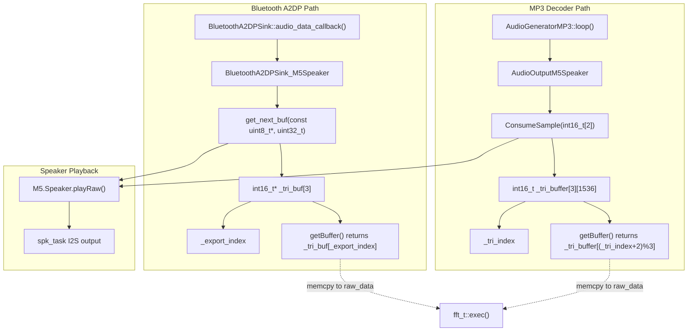

**Sources:** [examples/Advanced/Bluetooth_with_ESP32A2DP/Bluetooth_with_ESP32A2DP.ino:16-168](), [examples/Advanced/MP3_with_ESP8266Audio/MP3_with_ESP8266Audio.ino:28-77]()

### Triple Buffer Strategy

Both adapter classes implement a triple-buffer strategy to allow simultaneous audio playback and FFT analysis without blocking or copying overhead.

| Buffer Index | Purpose | Access Pattern |
|--------------|---------|----------------|
| `_tri_index` | Currently being written | Updated by audio callback |
| `_export_index` | Available for reading | Used by FFT processing |
| Third buffer | Previously processed | Allows safe concurrent access |

**Sources:** [examples/Advanced/Bluetooth_with_ESP32A2DP/Bluetooth_with_ESP32A2DP.ino:45-48,140-168]()

### BluetoothA2DPSink_M5Speaker Buffer Management

The Bluetooth adapter splits incoming audio data into two halves and uses `get_next_buf()` to cycle through triple buffers:

**Sources:** [examples/Advanced/Bluetooth_with_ESP32A2DP/Bluetooth_with_ESP32A2DP.ino:140-168]()

Buffer lifecycle:
1. Audio data arrives in `audio_data_callback()`
2. Data is split and copied to next buffer via `get_next_buf()`
3. Each half is sent to `M5.Speaker.playRaw()`
4. `_export_index` is updated for FFT access

### AudioOutputM5Speaker Buffer Management

The MP3 adapter accumulates samples in a buffer until it reaches `tri_buf_size` (1536 samples), then flushes:

**Sources:** [examples/Advanced/MP3_with_ESP8266Audio/MP3_with_ESP8266Audio.ino:38-68]()

Buffer accumulation:
1. `ConsumeSample()` receives stereo samples
2. Samples accumulate in `_tri_buffer[_tri_index]`
3. When buffer is full, `flush()` sends to `M5.Speaker.playRaw()`
4. Buffer index rotates: `_tri_index = _tri_index < 2 ? _tri_index + 1 : 0`

### Raw Data Extraction for Visualization

The main loop copies audio data from the adapter's buffer to a local array for processing:

**Sources:** [examples/Advanced/Bluetooth_with_ESP32A2DP/Bluetooth_with_ESP32A2DP.ino:433-436,475](), [examples/Advanced/MP3_with_ESP8266Audio/MP3_with_ESP8266Audio.ino:301-304,343]()

```cpp
// Pattern used in both examples
auto buf = adapter.getBuffer();
if (buf) {
    memcpy(raw_data, buf, WAVE_SIZE * 2 * sizeof(int16_t));
    // Process raw_data for FFT and waveform
}
```

The `WAVE_SIZE * 2` accounts for stereo interleaved samples (left/right pairs).

## Visualization Components

The visualization system renders three synchronized displays: stereo level meters, FFT frequency spectrum, and time-domain waveform overlay.

### Visualization Layout

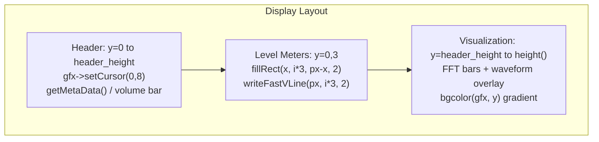

**Sources:** [examples/Advanced/Bluetooth_with_ESP32A2DP/Bluetooth_with_ESP32A2DP.ino:271,305-327]()

### Stereo Level Meter Implementation

The stereo level meters display real-time audio amplitude for left and right channels with peak hold indicators.

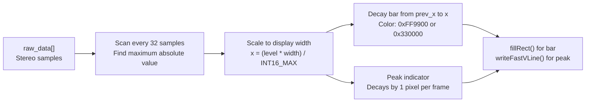

**Sources:** [examples/Advanced/Bluetooth_with_ESP32A2DP/Bluetooth_with_ESP32A2DP.ino:439-471](), [examples/Advanced/MP3_with_ESP8266Audio/MP3_with_ESP8266Audio.ino:298-339]()

Level calculation algorithm:
1. For each channel (i = 0 for left, 1 for right)
2. Scan through samples at stride 32: `j = i; j < 640; j += 32`
3. Find maximum: `if (level < abs(raw_data[j])) level = abs(raw_data[j])`
4. Scale to screen coordinates: `x = (level * gfx->width()) / INT16_MAX`

**Sources:** [examples/Advanced/Bluetooth_with_ESP32A2DP/Bluetooth_with_ESP32A2DP.ino:442-449]()

### FFT Spectrum Bar Display

The frequency spectrum displays FFT magnitude data as vertical bars with peak hold indicators and color-coded rising/falling states.

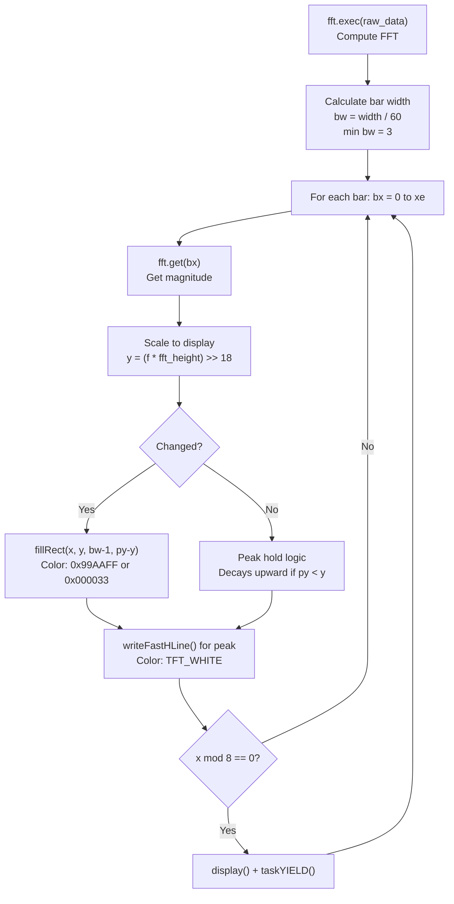

**Sources:** [examples/Advanced/Bluetooth_with_ESP32A2DP/Bluetooth_with_ESP32A2DP.ino:474-513](), [examples/Advanced/MP3_with_ESP8266Audio/MP3_with_ESP8266Audio.ino:342-381]()

Bar display parameters:
- Bar width (`bw`): Automatically calculated based on display width, minimum 3 pixels
- Number of bars (`xe`): `width / bw`, capped at `FFT_SIZE/2` (128)
- Height scaling: `(magnitude * fft_height) >> 18` (divide by 262144)
- Bar colors: `0x99AAFFu` (rising), `0x000033u` (falling)

**Sources:** [examples/Advanced/Bluetooth_with_ESP32A2DP/Bluetooth_with_ESP32A2DP.ino:476-484]()

### Waveform Overlay

The waveform overlay draws the time-domain audio signal on top of the frequency spectrum bars.

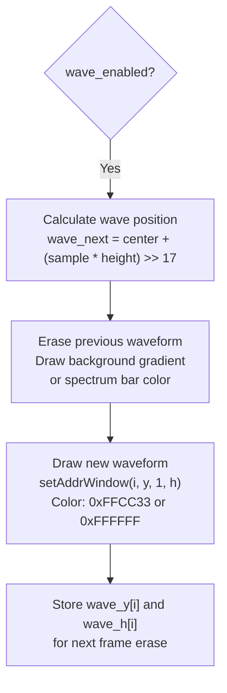

**Sources:** [examples/Advanced/Bluetooth_with_ESP32A2DP/Bluetooth_with_ESP32A2DP.ino:516-562](), [examples/Advanced/MP3_with_ESP8266Audio/MP3_with_ESP8266Audio.ino:384-430]()

Waveform rendering process:
1. For each pixel column: `i = 0` to `WAVE_SIZE`
2. Compute vertical position from stereo sample average
3. Erase previous waveform segment using background color
4. Draw new waveform segment in foreground color
5. Store position and height for next frame's erase operation

**Sources:** [examples/Advanced/Bluetooth_with_ESP32A2DP/Bluetooth_with_ESP32A2DP.ino:537-560]()

The waveform color changes based on whether it overlaps the spectrum bars:
- `0xFFCC33u` (orange): When in front of spectrum bars
- `0xFFFFFFu` (white): When behind spectrum bars

**Sources:** [examples/Advanced/Bluetooth_with_ESP32A2DP/Bluetooth_with_ESP32A2DP.ino:557-558]()

### Background Gradient Rendering

The `bgcolor()` function generates a vertical gradient background with optional horizontal grid lines.

**Sources:** [examples/Advanced/Bluetooth_with_ESP32A2DP/Bluetooth_with_ESP32A2DP.ino:274-288]()

Gradient calculation:
- Intensity: `v = ((h - y) << 5) / dh` (scales 0-32 based on vertical position)
- Color: `color888(v + 2, v, v + 6)` (slight blue tint)
- Grid lines: Every 4 vertical intensity steps, if display height > 44 pixels

## Graphics Rendering Pipeline

The rendering system uses M5GFX with batch operations and strategic display updates to maintain smooth frame rates while drawing complex visualizations.

### Rendering Flow Control

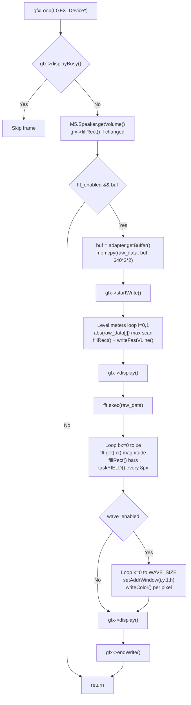

**Sources:** [examples/Advanced/Bluetooth_with_ESP32A2DP/Bluetooth_with_ESP32A2DP.ino:329-568]()

### Display Buffer Management

| Method | Purpose | When Called |
|--------|---------|-------------|
| `startWrite()` | Begin batch operation | Before rendering sequence |
| `display()` | Push updates to screen | After each major section |
| `taskYIELD()` | Allow task switching | Every 8 pixels in spectrum loop |
| `endWrite()` | End batch operation | After all rendering complete |

**Sources:** [examples/Advanced/Bluetooth_with_ESP32A2DP/Bluetooth_with_ESP32A2DP.ino:437,472,489,564-565]()

### Display Update Strategy

The system calls `gfx->display()` strategically to maintain interactivity:
1. After rendering stereo level meters
2. Every 8 pixels during spectrum bar rendering (with `taskYIELD()`)
3. After complete visualization frame

**Sources:** [examples/Advanced/Bluetooth_with_ESP32A2DP/Bluetooth_with_ESP32A2DP.ino:472,489,564]()

### Setup and Initialization

The `gfxSetup()` function configures display orientation, fonts, and initializes visualization state arrays.

**Sources:** [examples/Advanced/Bluetooth_with_ESP32A2DP/Bluetooth_with_ESP32A2DP.ino:290-327]()

Initialization steps:
1. Force landscape orientation if display is portrait
2. Set font: `lgfxJapanGothic_12`
3. Set EPD mode: `epd_fastest`
4. Draw header and title
5. Calculate `header_height` based on display size
6. Enable FFT and waveform based on display type
7. Initialize `prev_y[]`, `peak_y[]`, `wave_y[]`, `wave_h[]` arrays

Display-specific feature detection:
- FFT disabled on EPD displays: `fft_enabled = !gfx->isEPD()`
- Waveform disabled on Unit LCD: `wave_enabled = (gfx->getBoard() != m5gfx::board_M5UnitLCD)`

**Sources:** [examples/Advanced/Bluetooth_with_ESP32A2DP/Bluetooth_with_ESP32A2DP.ino:306-309]()

## Performance Considerations

Real-time audio visualization requires careful optimization to maintain smooth frame rates without audio dropouts.

### CPU Load Distribution

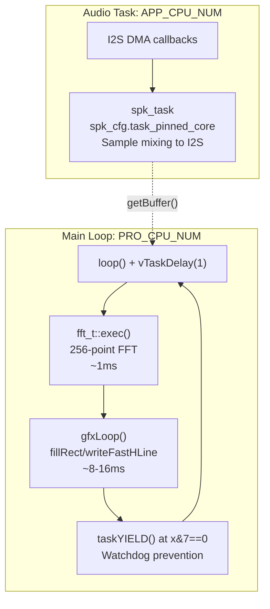

**Sources:** [examples/Advanced/Bluetooth_with_ESP32A2DP/Bluetooth_with_ESP32A2DP.ino:596,621,489]()

### Speaker Configuration for Visualization

The examples configure the speaker with high sample rates and increased DMA buffers to ensure smooth audio playback during intensive visualization:

**Sources:** [examples/Advanced/Bluetooth_with_ESP32A2DP/Bluetooth_with_ESP32A2DP.ino:592-601]()

Configuration accessed via `M5.Speaker.config()`:
- `spk_cfg.sample_rate`: 96000 Hz (higher quality, increased CPU load)
- `spk_cfg.task_pinned_core`: `APP_CPU_NUM` (isolate from main loop on PRO_CPU_NUM)
- `spk_cfg.dma_buf_count`: 20 (increased buffering to prevent underruns during rendering)
- `spk_cfg.dma_buf_len`: Default 512 samples (can be tuned for latency vs stability)

### Memory Usage

| Component | Size (bytes) | Purpose |
|-----------|--------------|---------|
| FFT working arrays | ~4 KB | `_wr`, `_wi`, `_fr`, `_fi` arrays (257 floats each) |
| Triple audio buffer | ~9 KB | 3 × 1536 samples × 2 bytes |
| Visualization state | ~1.5 KB | `prev_y`, `peak_y`, `wave_y`, `wave_h` arrays |
| Raw data buffer | ~1.3 KB | 640 stereo samples × 2 bytes |

**Sources:** [examples/Advanced/Bluetooth_with_ESP32A2DP/Bluetooth_with_ESP32A2DP.ino:174-179,261-271]()

### Frame Rate Management

The main loop enforces an 8ms cycle time to achieve approximately 125 FPS:

**Sources:** [examples/Advanced/Bluetooth_with_ESP32A2DP/Bluetooth_with_ESP32A2DP.ino:615-623]()

```cpp
static int prev_frame;
int frame;
do {
    vTaskDelay(1);
} while (prev_frame == (frame = millis() >> 3)); // 8 msec cycle wait
prev_frame = frame;
```

This prevents the loop from consuming all CPU time while allowing responsive visualization updates.

### Display-Specific Optimizations

The code adapts visualization complexity based on display characteristics:
- EPD displays: Disable FFT and waveform (static display only)
- Unit LCD: Disable waveform overlay (limited bandwidth)
- Standard displays: Enable all features

**Sources:** [examples/Advanced/Bluetooth_with_ESP32A2DP/Bluetooth_with_ESP32A2DP.ino:306-309]()