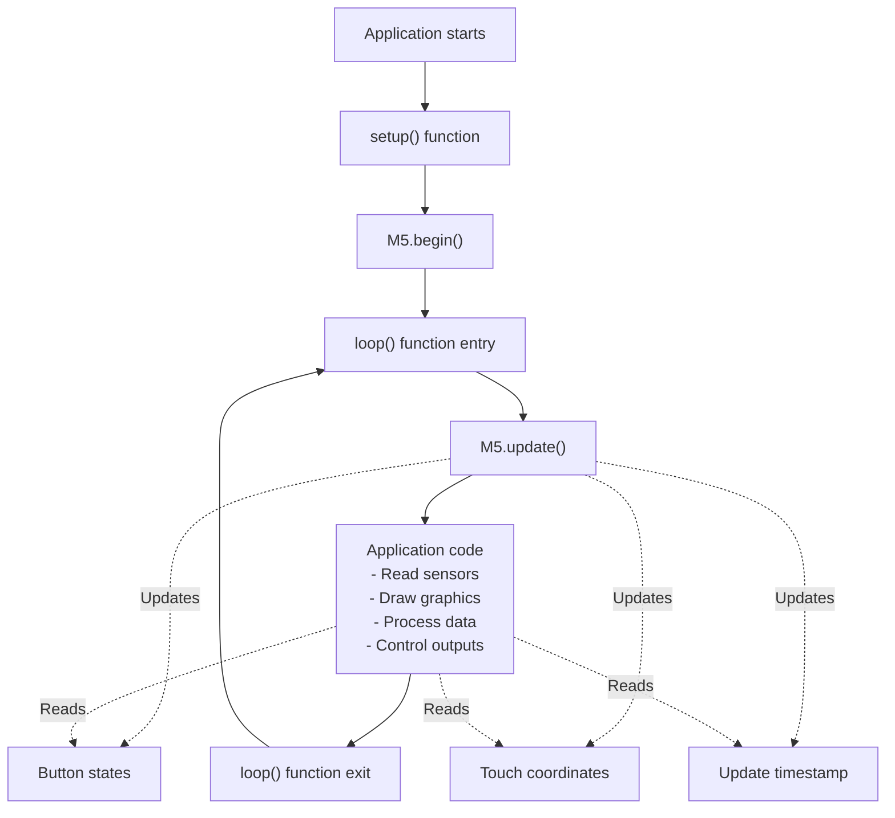
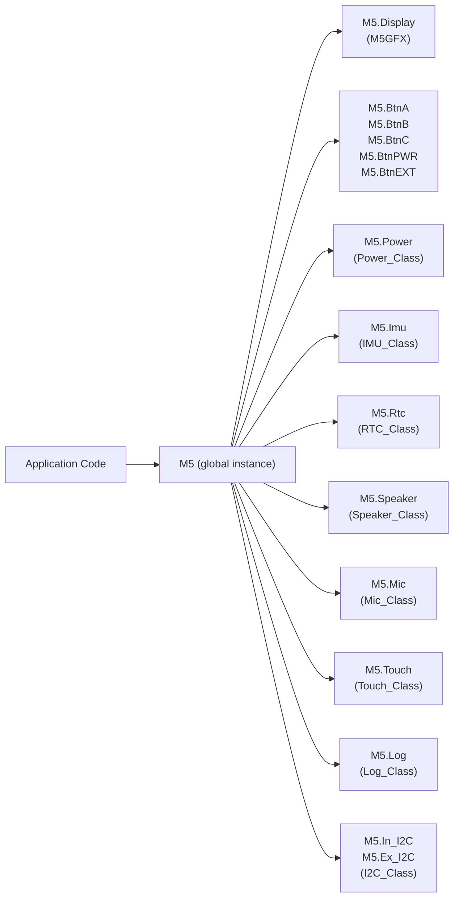
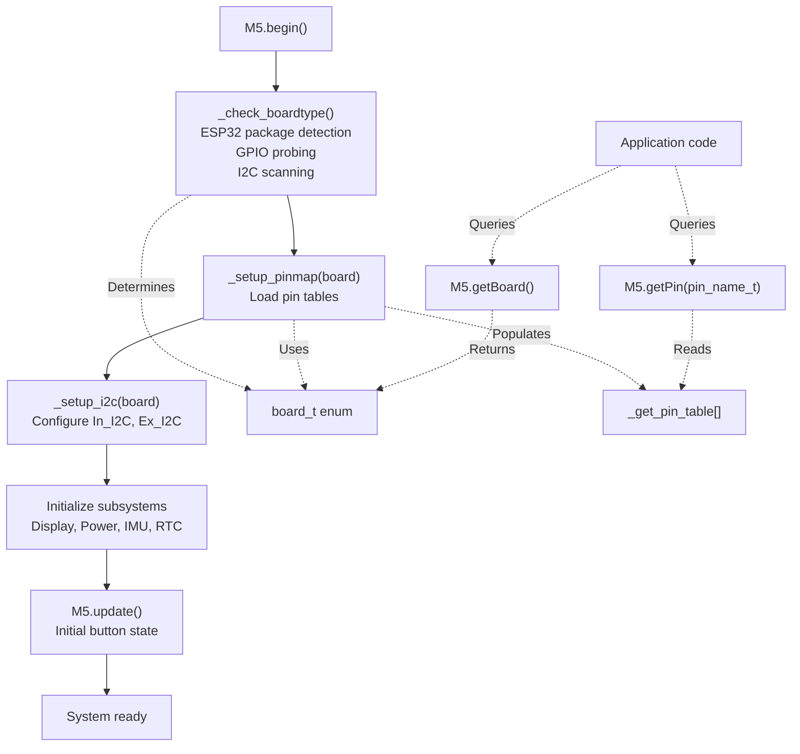

M5Unified Basic Usage Examples

# Basic Usage Examples

<details>
<summary>Relevant source files</summary>

The following files were used as context for generating this wiki page:

- [README.md](README.md)
- [examples/Basic/HowToUse/HowToUse.ino](examples/Basic/HowToUse/HowToUse.ino)
- [src/M5Unified.cpp](src/M5Unified.cpp)
- [src/M5Unified.hpp](src/M5Unified.hpp)

</details>


This page provides quick-start code patterns for using M5Unified in typical applications. It demonstrates the minimal initialization sequence, configuration options, and basic subsystem access patterns.

For detailed information about specific subsystems, see:
- System initialization details: [System Initialization and Lifecycle](#2.1)
- Board detection process: [Board Detection and Hardware Identification](#2.2)
- Display configuration: [Display Management and M5GFX Integration](#2.4)
- Power management: [Power Management System](#3)
- Audio functionality: [Audio System Architecture](#4)
- Input handling: [Input Handling System](#5)
- Sensor usage: [Sensor Integration](#6)

---

## Minimal Application Pattern

The simplest M5Unified application requires three steps: include the header, initialize the system, and call update regularly.

```cpp
#include <M5Unified.h>

void setup() {
    M5.begin();
}

void loop() {
    M5.update();
    // Your application code here
}
```

The global instance `M5` is automatically declared by the library and provides access to all hardware subsystems. The `M5.begin()` method performs automatic board detection, hardware initialization, and peripheral setup. The `M5.update()` method must be called in each iteration of the main loop to process button states, touch events, and other input polling.

**Sources:** [src/M5Unified.cpp:45](), [src/M5Unified.hpp:323-327](), [src/M5Unified.hpp:320]()

---

## Configuration-Based Initialization

The `config_t` structure allows fine-grained control over initialization behavior. Configuration must be performed before calling `begin()`.

```cpp
#include <M5Unified.h>

void setup() {
    auto cfg = M5.config();
    
    // Display configuration
    cfg.clear_display = true;           // Clear screen at startup
    
    // Serial debug output
    cfg.serial_baudrate = 115200;       // Enable Serial at 115200 baud
    
    // Power management
    cfg.output_power = true;            // Enable 5V output to ports
    cfg.pmic_button = true;             // Use PMIC button as BtnPWR
    
    // Internal peripherals
    cfg.internal_imu = true;            // Initialize IMU
    cfg.internal_rtc = true;            // Initialize RTC
    cfg.internal_mic = true;            // Initialize microphone
    cfg.internal_spk = true;            // Initialize speaker
    
    // External peripherals
    cfg.external_imu = false;           // Don't scan for Unit IMU
    cfg.external_rtc = false;           // Don't scan for Unit RTC
    cfg.external_display_value = 0xFFFF; // Scan for all external displays
    
    // LED brightness (for system LED, not RGB LED)
    cfg.led_brightness = 128;           // 0-255
    
    // Fallback board if detection fails
    cfg.fallback_board = board_t::board_M5AtomLite;
    
    M5.begin(cfg);
}

void loop() {
    M5.update();
}
```

The configuration system uses a union-based structure for compact representation of boolean flags. Display and speaker options use bitfields to enable/disable detection of specific external accessories.

**Sources:** [src/M5Unified.hpp:83-213](), [src/M5Unified.hpp:332]()

### Key Configuration Options

| Option | Type | Default | Description |
|--------|------|---------|-------------|
| `serial_baudrate` | `uint32_t` | `0` | Baud rate for Serial (0 = disabled) |
| `clear_display` | `bool` | `true` | Clear display during initialization |
| `output_power` | `bool` | `true` | Enable 5V output to external ports |
| `pmic_button` | `bool` | `true` | Use PMIC button for BtnPWR |
| `internal_imu` | `bool` | `true` | Initialize internal IMU sensor |
| `internal_rtc` | `bool` | `true` | Initialize internal RTC |
| `internal_mic` | `bool` | `true` | Initialize microphone |
| `internal_spk` | `bool` | `true` | Initialize speaker |
| `external_imu` | `bool` | `false` | Scan for external IMU units |
| `external_rtc` | `bool` | `false` | Scan for external RTC units |
| `led_brightness` | `uint8_t` | `0` | System LED brightness (0-255) |
| `fallback_board` | `board_t` | (varies) | Board type if auto-detection fails |

**Sources:** [src/M5Unified.hpp:83-213]()

---

## Main Loop Architecture

The `M5.update()` method performs time-critical input processing and must be called regularly. Application code executes between update calls.



The `update()` method performs several critical tasks:
- Updates button state machines with debouncing
- Reads touch panel coordinates and calculates touch regions
- Samples GPIO states for physical buttons
- Records the current timestamp for timing operations

**Sources:** [src/M5Unified.hpp:320](), [src/M5Unified.cpp:2661-2757]()

---

## Subsystem Access Patterns

All hardware subsystems are accessed as public member variables of the `M5` instance. The following diagram shows the relationship between the main application and available subsystems.



**Sources:** [src/M5Unified.hpp:215-248]()

### Display Access

The `Display` member provides M5GFX functionality for graphics output. It inherits all M5GFX methods for drawing primitives, text, and images.

```cpp
void setup() {
    M5.begin();
    
    M5.Display.setTextSize(2);
    M5.Display.setTextColor(TFT_WHITE);
    M5.Display.setCursor(10, 10);
    M5.Display.println("Hello M5Stack");
}

void loop() {
    M5.update();
    M5.Display.drawRect(50, 50, 100, 100, TFT_GREEN);
}
```

The display is automatically initialized based on the detected board type. Multiple displays can be accessed through `M5.getDisplay(index)` when external displays are configured.

**Sources:** [src/M5Unified.hpp:215-216](), [src/M5Unified.hpp:257-279]()

### Button Input

Buttons are accessed through named references: `BtnA`, `BtnB`, `BtnC`, `BtnEXT`, and `BtnPWR`. The Button_Class provides state query methods that must be called after `M5.update()`.

```cpp
void loop() {
    M5.update();
    
    if (M5.BtnA.wasPressed()) {
        M5.Display.println("Button A pressed");
    }
    
    if (M5.BtnB.isPressed()) {
        M5.Display.println("Button B is held");
    }
    
    if (M5.BtnC.wasReleased()) {
        M5.Display.println("Button C released");
    }
    
    if (M5.BtnA.pressedFor(1000)) {
        M5.Display.println("Button A held for 1 second");
    }
}
```

Button state methods:
- `wasPressed()` - Returns true once per press event
- `wasReleased()` - Returns true once per release event
- `isPressed()` - Returns current state (true while held)
- `pressedFor(ms)` - Returns true if held for specified duration
- `wasClicked()` - Returns true for quick press-release
- `wasHold()` - Returns true after long press threshold

**Sources:** [src/M5Unified.hpp:238-242](), [src/utility/Button_Class.hpp]()

### Power Management

The `Power` member provides battery monitoring, charging control, and sleep functionality. The API varies based on the detected PMIC (AXP192, AXP2101, IP5306, or ADC-based).

```cpp
void loop() {
    M5.update();
    
    // Battery status
    int level = M5.Power.getBatteryLevel();  // Percentage 0-100
    bool charging = M5.Power.isCharging();
    
    // Voltage and current
    int voltage = M5.Power.getBatteryVoltage();    // mV
    int current = M5.Power.getBatteryCurrent();    // mA
    
    M5.Display.printf("Battery: %d%% (%dmV)\n", level, voltage);
    M5.Display.printf("Charging: %s\n", charging ? "Yes" : "No");
    
    // Power control
    if (level < 10 && !charging) {
        M5.Display.println("Low battery, entering deep sleep");
        M5.Power.deepSleep(60 * 1000000);  // Sleep for 60 seconds (microseconds)
    }
}
```

**Sources:** [src/M5Unified.hpp:220](), [src/utility/Power_Class.hpp]()

### IMU Sensor

The `Imu` member provides access to the accelerometer, gyroscope, and magnetometer (if available). The library automatically selects the correct driver (MPU6886, BMI270, SH200Q) based on detected hardware.

```cpp
void loop() {
    M5.update();
    
    if (M5.Imu.update()) {  // Returns true if new data available
        auto data = M5.Imu.getImuData();
        
        M5.Display.printf("Accel: %.2f, %.2f, %.2f\n", 
                         data.accel.x, data.accel.y, data.accel.z);
        M5.Display.printf("Gyro:  %.2f, %.2f, %.2f\n",
                         data.gyro.x, data.gyro.y, data.gyro.z);
        M5.Display.printf("Mag:   %.2f, %.2f, %.2f\n",
                         data.mag.x, data.mag.y, data.mag.z);
    }
}
```

The IMU system includes automatic calibration that persists to NVS. Calibration can be triggered manually with `M5.Imu.calibrateOffsets()`.

**Sources:** [src/M5Unified.hpp:218](), [src/utility/IMU_Class.hpp]()

### Real-Time Clock

The `Rtc` member provides date and time functionality. The RTC maintains time across deep sleep when powered by a backup battery.

```cpp
void setup() {
    M5.begin();
    
    // Set initial time
    rtc_time_t time;
    time.hours = 14;
    time.minutes = 30;
    time.seconds = 0;
    M5.Rtc.setTime(time);
    
    rtc_date_t date;
    date.year = 2024;
    date.month = 3;
    date.date = 15;
    date.weekDay = 5;  // Friday
    M5.Rtc.setDate(date);
}

void loop() {
    M5.update();
    
    auto time = M5.Rtc.getTime();
    auto date = M5.Rtc.getDate();
    
    M5.Display.printf("%04d-%02d-%02d %02d:%02d:%02d\n",
                     date.year, date.month, date.date,
                     time.hours, time.minutes, time.seconds);
    
    delay(1000);
}
```

**Sources:** [src/M5Unified.hpp:221](), [src/utility/RTC_Class.hpp]()

### Speaker Output

The `Speaker` member provides audio playback functionality with an 8-channel virtual mixer. Audio processing occurs in a FreeRTOS task for non-blocking operation.

```cpp
void setup() {
    M5.begin();
    
    // Configure speaker volume
    M5.Speaker.setVolume(128);  // 0-255
}

void loop() {
    M5.update();
    
    if (M5.BtnA.wasPressed()) {
        // Play a tone: frequency, duration, channel
        M5.Speaker.tone(1000, 200, 0);
    }
    
    if (M5.BtnB.wasPressed()) {
        // Play raw audio data
        const int16_t waveform[] = { /* audio samples */ };
        M5.Speaker.playRaw(waveform, sizeof(waveform) / sizeof(int16_t), 
                          16000, false, 1, 0);
    }
}
```

The speaker system supports multiple simultaneous channels and includes board-specific enable callbacks for amplifier control.

**Sources:** [src/M5Unified.hpp:223](), [src/utility/Speaker_Class.hpp]()

### Microphone Input

The `Mic` member provides audio recording functionality with optional noise filtering and FFT processing.

```cpp
void setup() {
    M5.begin();
    
    // Start continuous recording
    M5.Mic.begin();
}

void loop() {
    M5.update();
    
    // Check if audio data is available
    if (M5.Mic.isEnabled() && M5.Mic.record()) {
        size_t samples = M5.Mic.getReadableSize();
        
        if (samples > 0) {
            int16_t buffer[samples];
            M5.Mic.read(buffer, samples);
            
            // Process audio data
            // ...
        }
    }
}
```

The microphone can also perform FFT analysis for frequency domain processing, useful for audio visualization.

**Sources:** [src/M5Unified.hpp:224](), [src/utility/Mic_Class.hpp]()

---

## Board Detection and Pin Mapping

The initialization process automatically detects the board type and configures pin mappings. Applications can query the detected board and access pin numbers.

```cpp
void setup() {
    M5.begin();
    
    // Query detected board type
    board_t board = M5.getBoard();
    M5.Display.printf("Board: %d\n", board);
    
    // Get pin numbers for ports
    int8_t i2c_sda = M5.getPin(m5::ex_i2c_sda);
    int8_t i2c_scl = M5.getPin(m5::ex_i2c_scl);
    M5.Display.printf("Port.A I2C: SDA=%d SCL=%d\n", i2c_sda, i2c_scl);
    
    // Access I2C buses
    M5.Ex_I2C.begin();  // External I2C (Port A)
    M5.In_I2C.begin();  // Internal I2C (for built-in peripherals)
}
```

The pin mapping system uses compile-time lookup tables that vary by board type. Pin names are defined in the `pin_name_t` enum and include standard port designations (Port A/B/C/D/E), M-Bus pins, and special function pins.

**Sources:** [src/M5Unified.hpp:26-53](), [src/M5Unified.hpp:251](), [src/M5Unified.hpp:315-317](), [src/M5Unified.cpp:73-327]()



The board detection algorithm uses multiple strategies:
1. ESP32 package version identification
2. GPIO pull-up/pull-down tests
3. Touch sensor capacitance measurements
4. I2C device probing

Once the board is identified, the pin mapping tables are loaded to configure all GPIO assignments, I2C buses, SPI pins, and port connections.

**Sources:** [src/M5Unified.cpp:971-1393](), [src/M5Unified.cpp:328-348](), [src/M5Unified.hpp:631-632]()

---

## Timing and Delays

The library provides timing utilities compatible with both Arduino and ESP-IDF frameworks.

```cpp
void loop() {
    M5.update();
    
    // Get current time
    uint32_t now = M5.millis();
    uint32_t now_us = M5.micros();
    
    // Non-blocking delay
    static uint32_t last_update = 0;
    if (M5.millis() - last_update > 1000) {
        M5.Display.println("One second elapsed");
        last_update = M5.millis();
    }
    
    // Blocking delay (uses FreeRTOS vTaskDelay)
    M5.delay(100);
}
```

The `M5.delay()` method uses `vTaskDelay()` on ESP32, which yields the CPU to other tasks. For precise timing, use `M5.micros()` or check elapsed time with `M5.getUpdateMsec()`, which returns the timestamp when `M5.update()` was last called.

**Sources:** [src/M5Unified.hpp:296-313](), [src/M5Unified.hpp:289]()

---

## Complete Example

This example demonstrates a typical application structure combining multiple subsystems:

```cpp
#include <M5Unified.h>

void setup() {
    // Configure and initialize
    auto cfg = M5.config();
    cfg.serial_baudrate = 115200;
    cfg.clear_display = true;
    cfg.output_power = true;
    M5.begin(cfg);
    
    // Setup display
    M5.Display.setRotation(1);
    M5.Display.setTextSize(2);
    M5.Display.fillScreen(TFT_BLACK);
    M5.Display.setTextColor(TFT_WHITE, TFT_BLACK);
    
    // Configure speaker
    M5.Speaker.setVolume(128);
    
    // Print board information
    M5.Display.printf("Board: %d\n", M5.getBoard());
    M5.Display.printf("Battery: %d%%\n", M5.Power.getBatteryLevel());
}

void loop() {
    M5.update();
    
    // Handle button input
    if (M5.BtnA.wasPressed()) {
        M5.Display.fillScreen(TFT_RED);
        M5.Speaker.tone(1000, 100);
    }
    
    // Read IMU data
    if (M5.Imu.update()) {
        auto data = M5.Imu.getImuData();
        M5.Display.setCursor(0, 40);
        M5.Display.printf("Accel: %.2f, %.2f, %.2f  ", 
                         data.accel.x, data.accel.y, data.accel.z);
    }
    
    // Display time
    auto time = M5.Rtc.getTime();
    M5.Display.setCursor(0, 60);
    M5.Display.printf("Time: %02d:%02d:%02d  ",
                     time.hours, time.minutes, time.seconds);
    
    delay(50);
}
```

**Sources:** [src/M5Unified.hpp:323-603](), [examples/Basic/]()

---

## External Display and Speaker Configuration

The library can automatically detect and initialize external displays and speakers when configured.

```cpp
void setup() {
    auto cfg = M5.config();
    
    // Enable external display detection
    cfg.external_display.atom_display = 1;    // ATOM Display (HDMI)
    cfg.external_display.module_display = 1;  // Module Display (HDMI)
    cfg.external_display.unit_oled = 1;       // Unit OLED
    cfg.external_display.unit_lcd = 1;        // Unit LCD
    cfg.external_display.unit_glass = 1;      // Unit GLASS
    
    // Enable external speaker detection
    cfg.external_speaker.hat_spk = 1;         // SPK HAT
    cfg.external_speaker.atomic_spk = 1;      // ATOMIC SPK
    cfg.external_speaker.atomic_echo = 1;     // ATOMIC ECHO
    
    M5.begin(cfg);
    
    // Query number of displays
    size_t display_count = M5.getDisplayCount();
    M5.Display.printf("Found %d displays\n", display_count);
    
    // Access specific displays
    if (display_count > 1) {
        M5GFX& secondary = M5.getDisplay(1);
        secondary.fillScreen(TFT_BLUE);
    }
    
    // Set primary display
    M5.setPrimaryDisplay(0);  // Use first display as primary
}
```

Multiple displays are stored in an internal vector and can be accessed by index. The primary display is aliased to `M5.Display` and `M5.Lcd` for convenience.

**Sources:** [src/M5Unified.hpp:93-213](), [src/M5Unified.hpp:257-279](), [src/M5Unified.hpp:362-603]()