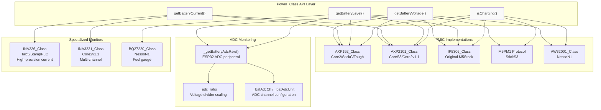
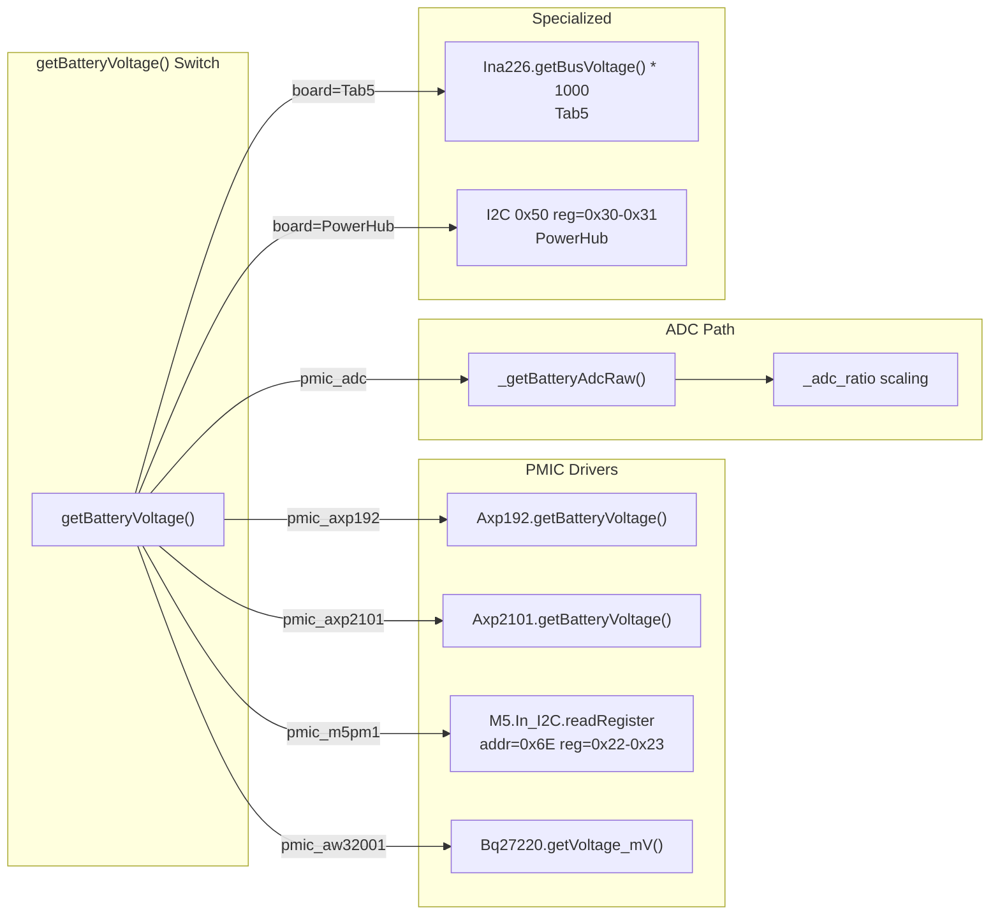
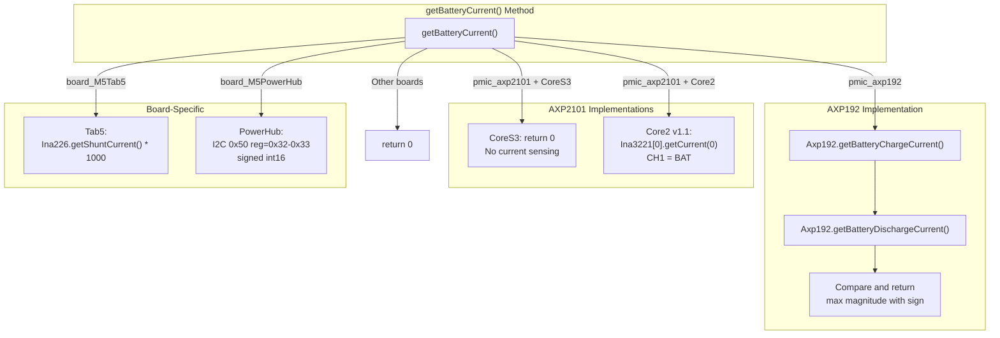
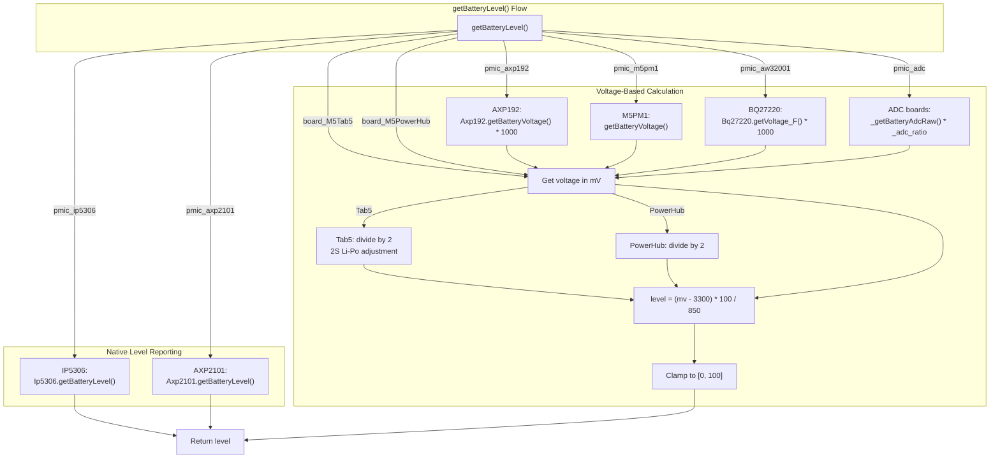
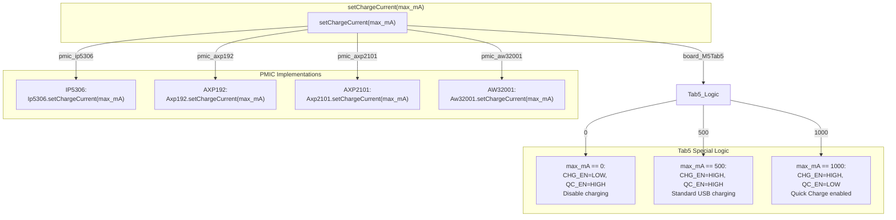
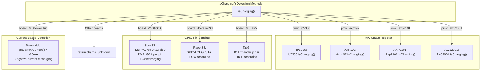

M5Unified Battery Monitoring and Charging Control

# Battery Monitoring and Charging Control

<details>
<summary>Relevant source files</summary>

The following files were used as context for generating this wiki page:

- [src/utility/Power_Class.cpp](src/utility/Power_Class.cpp)
- [src/utility/Power_Class.hpp](src/utility/Power_Class.hpp)

</details>


## Purpose and Scope

This document covers the battery monitoring and charging control functionality provided by the `Power_Class`. It explains how M5Unified abstracts battery voltage/current measurement, battery level calculation, and charge control across multiple hardware implementations including dedicated PMICs (Power Management ICs) and ADC-based monitoring systems. For general power management including sleep modes and power states, see [Sleep Modes and Power States](#3.3). For PMIC detection and initialization, see [PMIC Detection and Initialization](#3.1).

---

## Battery Monitoring Architecture

M5Unified supports two distinct battery monitoring strategies depending on the available hardware:

1. **PMIC-based monitoring**: Dedicated power management ICs (AXP192, AXP2101, IP5306, M5PM1, AW32001) provide built-in voltage, current, and charging status measurements via I2C registers
2. **ADC-based monitoring**: For boards without PMICs, the ESP32's ADC peripheral directly measures battery voltage through a voltage divider circuit

The `Power_Class` abstracts these differences through a unified API, with runtime selection based on the detected `pmic_t` type stored in `_pmic`.



**Sources**: [src/utility/Power_Class.cpp:1227-1309](), [src/utility/Power_Class.cpp:1360-1421](), [src/utility/Power_Class.cpp:1423-1500](), [src/utility/Power_Class.cpp:1633-1685](), [src/utility/Power_Class.cpp:1725-1779]()

---

## Voltage Measurement

### PMIC-Based Voltage Reading

Each PMIC provides battery voltage through dedicated ADC channels accessible via I2C registers. The `getBatteryVoltage()` method returns voltage in millivolts (mV).

| PMIC Type | Implementation | Board Examples | Return Format |
|-----------|---------------|----------------|---------------|
| `pmic_axp192` | `Axp192.getBatteryVoltage()` | M5Stack Core2, StickC, Tough | Volts * 1000 |
| `pmic_axp2101` | `Axp2101.getBatteryVoltage()` | CoreS3, Core2 v1.1 | Volts * 1000 |
| `pmic_ip5306` | Not supported | Original M5Stack | 0 |
| `pmic_m5pm1` | I2C registers 0x22-0x23 | StickS3 | Direct mV |
| `pmic_aw32001` | `Bq27220.getVoltage_mV()` | NessoN1 | Direct mV |



**Sources**: [src/utility/Power_Class.cpp:1360-1421]()

### ADC-Based Voltage Reading

Boards without PMICs use the ESP32's internal ADC to measure battery voltage through a voltage divider. The `_getBatteryAdcRaw()` method handles ADC configuration and reading, with board-specific initialization setting `_batAdcCh`, `_batAdcUnit`, and `_adc_ratio`.

#### ADC Configuration Per Board

| Board | ADC Channel | ADC Unit | `_adc_ratio` | Notes |
|-------|-------------|----------|--------------|-------|
| M5Paper | `ADC1_GPIO35_CHANNEL` | 1 | 2.0 | [src/utility/Power_Class.cpp:279-282]() |
| M5PaperS3 | `ADC1_GPIO3_CHANNEL` | 1 | 2.0 | [src/utility/Power_Class.cpp:198-204]() |
| M5Capsule | `ADC1_GPIO6_CHANNEL` | 1 | 2.0 | [src/utility/Power_Class.cpp:206-211]() |
| M5Cardputer | `ADC1_GPIO10_CHANNEL` | 1 | 2.0 | [src/utility/Power_Class.cpp:221-227]() |
| CoreInk | `ADC1_GPIO35_CHANNEL` | 1 | 4.922 | [src/utility/Power_Class.cpp:268-274]() |
| TimerCam | `ADC1_GPIO38_CHANNEL` | 1 | 1.513 | [src/utility/Power_Class.cpp:261-265]() |
| StickCPlus2 | `ADC1_GPIO38_CHANNEL` | 1 | 2.0 | [src/utility/Power_Class.cpp:303-309]() |

#### ADC Reading Implementation

The `_getBatteryAdcRaw()` method provides abstraction for ESP-IDF version differences:

- **ESP-IDF v5.x**: Uses `adc_oneshot` API with calibration schemes (curve fitting or line fitting)
- **ESP-IDF v4.x**: Uses legacy `adc1_get_raw()` with `esp_adc_cal_characterize()`

Both paths return calibrated voltage in millivolts, which is then multiplied by `_adc_ratio` to compensate for the voltage divider:

```
Battery Voltage (mV) = _getBatteryAdcRaw() * _adc_ratio
```

**Sources**: [src/utility/Power_Class.cpp:1227-1309](), [src/utility/Power_Class.cpp:53-513]()

---

## Current Measurement

Battery current measurement is only available on boards with PMICs or dedicated current sense ICs. Current is reported in milliamps (mA), with positive values indicating charging and negative values indicating discharge.

### Current Measurement Implementations



**Key Implementation Details**:

1. **AXP192**: Reads both charge and discharge currents separately, returns the larger magnitude with appropriate sign [src/utility/Power_Class.cpp:1643-1649]()

2. **AXP2101 on CoreS3**: Returns 0 as the CoreS3 lacks current sensing hardware [src/utility/Power_Class.cpp:1655-1656]()

3. **AXP2101 on Core2 v1.1**: Uses external INA3221 chip, reads channel 0 (battery current) and converts to mA [src/utility/Power_Class.cpp:1660-1661]()

4. **M5Tab5**: Uses INA226 high-precision current shunt monitor [src/utility/Power_Class.cpp:1670-1671]()

5. **M5PowerHub**: Reads signed 16-bit current from custom I2C protocol, negates for correct sign [src/utility/Power_Class.cpp:1676-1678]()

**Sources**: [src/utility/Power_Class.cpp:1633-1685]()

---

## Battery Level Calculation

The `getBatteryLevel()` method converts battery voltage to a percentage (0-100%) using either PMIC-reported levels or voltage-based estimation.

### Level Calculation Algorithm

For boards without native battery level reporting, voltage is linearly mapped:

```
level = (voltage_mV - 3300) * 100 / (4150 - 3350)
Clamped to [0, 100]
```

This assumes:
- **Minimum voltage**: 3300 mV (0% battery)
- **Maximum voltage**: 4150 mV (100% battery)
- **Linear discharge curve** between these points



**Special Cases**:

- **M5Tab5**: Uses 2S Li-Po battery (7.4V nominal), so voltage is divided by 2 before calculation [src/utility/Power_Class.cpp:1479-1481]()
- **M5PowerHub**: Also uses 2S configuration [src/utility/Power_Class.cpp:1485-1487]()
- **NessoN1 (BQ27220)**: Returns NaN on error, which is converted to -1 [src/utility/Power_Class.cpp:1434-1439]()

**Sources**: [src/utility/Power_Class.cpp:1423-1500]()

---

## Charging Control

### Charge Enable/Disable

The `setBatteryCharge(bool enable)` method controls whether the battery charging circuit is active. Implementation varies by PMIC:

| PMIC Type | Implementation | Register/Pin |
|-----------|---------------|--------------|
| `pmic_ip5306` | `Ip5306.setBatteryCharge(enable)` | I2C register control |
| `pmic_axp192` | `Axp192.setBatteryCharge(enable)` | I2C register control |
| `pmic_axp2101` | `Axp2101.setBatteryCharge(enable)` | I2C register control |
| `pmic_m5pm1` | I2C register 0x06 bit 0 | Direct bit manipulation |
| `pmic_aw32001` | `Aw32001.setBatteryCharge(enable)` | Dedicated charger IC |
| M5Tab5 | IO Expander 1 pin 7 (CHG_EN) | GPIO control |
| M5PowerHub | I2C 0x50 register 0x06 | Custom protocol |

**M5PM1 Implementation Example** [src/utility/Power_Class.cpp:1529-1540]():
```
Register 0x06 bit 0: 1=enable charging, 0=disable charging
Read-modify-write pattern to preserve other bits
```

**Sources**: [src/utility/Power_Class.cpp:1502-1563]()

### Charge Current Limiting

The `setChargeCurrent(uint16_t max_mA)` method sets the maximum charging current in milliamps. Each PMIC implements current limiting differently:



**M5Tab5 Current Control** [src/utility/Power_Class.cpp:1596-1622]():
- Uses IO Expander to control CHG_EN (pin 7) and QC_EN (pin 5)
- Supports discrete levels: 0mA (disabled), 500mA (standard), 1000mA (Quick Charge)
- Quick Charge mode enables higher current draw from USB-C PD sources

**Sources**: [src/utility/Power_Class.cpp:1565-1631]()

### Charge Voltage Limiting

The `setChargeVoltage(uint16_t max_mV)` method sets the maximum battery charge voltage in millivolts. This protects the battery from overcharging.

| PMIC | Method | Typical Values |
|------|--------|----------------|
| IP5306 | `Ip5306.setChargeVoltage(max_mV)` | 4100-4360 mV |
| AXP192 | `Axp192.setChargeVoltage(max_mV)` | 4100-4360 mV |
| AXP2101 | `Axp2101.setChargeVoltage(max_mV)` | 4100-4360 mV |

**Note**: This function is not implemented for ADC-based boards (M5Paper, CoreInk, etc.) as they lack charging control hardware.

**Sources**: [src/utility/Power_Class.cpp:1687-1723]()

### Charging Status Detection

The `isCharging()` method returns an `is_charging_t` enum indicating the current charging state:

```cpp
enum is_charging_t {
    is_discharging = 0,  // Battery is discharging
    is_charging = 1,      // Battery is charging
    charge_unknown = 2    // Status cannot be determined
}
```

#### Charging Detection Methods



**Implementation Details**:

1. **PMIC-based detection** [src/utility/Power_Class.cpp:1739-1749](): PMICs provide dedicated status registers indicating charge state

2. **M5StickS3** [src/utility/Power_Class.cpp:1756-1761](): Uses M5PM1 GPIO0 as input pin for charge status (configured during `begin()` at [src/utility/Power_Class.cpp:186-193]())

3. **M5PaperS3** [src/utility/Power_Class.cpp:1764-1765](): Reads GPIO4 pin configured as input [src/utility/Power_Class.cpp:198]()

4. **M5Tab5** [src/utility/Power_Class.cpp:1771-1773](): Reads IO Expander 1 pin 6 (CHG_STAT), HIGH indicates charging

5. **M5PowerHub** [src/utility/Power_Class.cpp:1767-1768](): Infers charging from battery current (< -10mA threshold)

**Sources**: [src/utility/Power_Class.cpp:1725-1779]()

---

## Board-Specific Implementation Matrix

| Board | Voltage Source | Current Source | Level Method | Charge Control |
|-------|---------------|----------------|--------------|----------------|
| M5Stack Core2 | AXP192 | AXP192 | Voltage-based | AXP192 registers |
| M5Stack Core2 v1.1 | AXP2101 | INA3221 CH0 | AXP2101 native | AXP2101 registers |
| M5Stack CoreS3 | AXP2101 | None (returns 0) | AXP2101 native | AXP2101 registers |
| M5Stack CoreS3 SE | AXP2101 | None (returns 0) | AXP2101 native | AXP2101 registers |
| M5Stack Tough | AXP192 | AXP192 | Voltage-based | AXP192 registers |
| M5Stack | IP5306 | None | IP5306 native | IP5306 registers |
| M5StickC | AXP192 | AXP192 | Voltage-based | AXP192 registers |
| M5StickC Plus | AXP192 | AXP192 | Voltage-based | AXP192 registers |
| M5StickC Plus2 | ADC GPIO38 | None | Voltage-based | None |
| M5StickS3 | M5PM1 I2C | None | Voltage-based | M5PM1 reg 0x06 |
| M5Paper | ADC GPIO35 | None | Voltage-based | None |
| M5PaperS3 | ADC GPIO3 | None | Voltage-based | GPIO4 status |
| CoreInk | ADC GPIO35 | None | Voltage-based | None |
| M5Capsule | ADC GPIO6 | None | Voltage-based | None |
| M5Cardputer | ADC GPIO10 | None | Voltage-based | None |
| M5Tab5 | INA226 bus | INA226 shunt | Voltage (2S) | IO Expander |
| M5PowerHub | I2C 0x50 | I2C 0x50 | Voltage (2S) | I2C 0x50 |
| M5StampPLC | INA226 bus | INA226 shunt | None | None |
| Arduino NessoN1 | BQ27220 | None | BQ27220 fuel gauge | AW32001 |
| M5TimerCam | ADC GPIO38 | None | Voltage-based | None |

**Sources**: [src/utility/Power_Class.cpp:53-513](), [src/utility/Power_Class.cpp:1360-1421](), [src/utility/Power_Class.cpp:1423-1500](), [src/utility/Power_Class.cpp:1633-1685](), [src/utility/Power_Class.cpp:1725-1779]()

---

## API Usage Examples

### Reading Battery Status

```cpp
// Read battery voltage
int16_t voltage_mV = M5.Power.getBatteryVoltage();
if (voltage_mV > 0) {
    M5.Display.printf("Battery: %d mV\n", voltage_mV);
}

// Read battery level percentage
int32_t level = M5.Power.getBatteryLevel();
if (level >= 0) {
    M5.Display.printf("Level: %d%%\n", level);
} else {
    M5.Display.println("Level not available");
}

// Check charging status
auto charging = M5.Power.isCharging();
if (charging == Power_Class::is_charging_t::is_charging) {
    M5.Display.println("Charging...");
} else if (charging == Power_Class::is_charging_t::is_discharging) {
    M5.Display.println("Discharging");
}

// Read battery current (if supported)
int32_t current_mA = M5.Power.getBatteryCurrent();
if (current_mA != 0) {
    M5.Display.printf("Current: %d mA\n", current_mA);
}
```

### Controlling Charging

```cpp
// Set charge current to 390mA (for Core2 battery)
M5.Power.setChargeCurrent(390);

// Set charge voltage to 4.2V
M5.Power.setChargeVoltage(4200);

// Enable battery charging
M5.Power.setBatteryCharge(true);

// Disable charging (for testing or specific use cases)
M5.Power.setBatteryCharge(false);
```

### VBUS Voltage Monitoring

For boards with PMICs, USB input voltage can be monitored:

```cpp
// Read VBUS voltage (USB input)
int16_t vbus_mV = M5.Power.getVBUSVoltage();
if (vbus_mV > 0) {
    M5.Display.printf("USB: %d mV\n", vbus_mV);
} else {
    M5.Display.println("VBUS not supported or not connected");
}
```

**Sources**: [src/utility/Power_Class.hpp:148-181]()