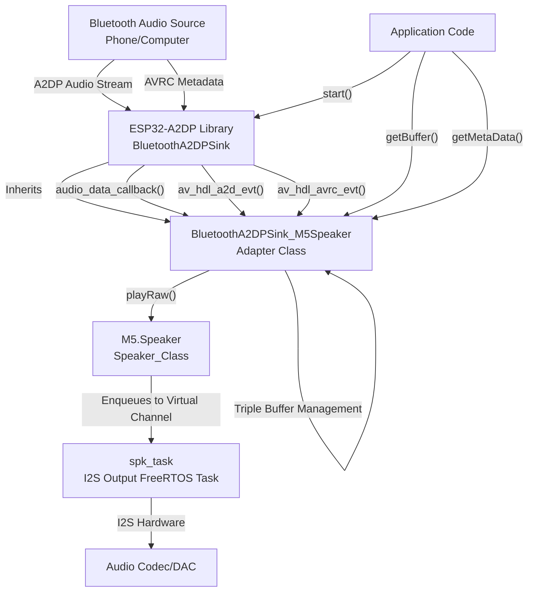
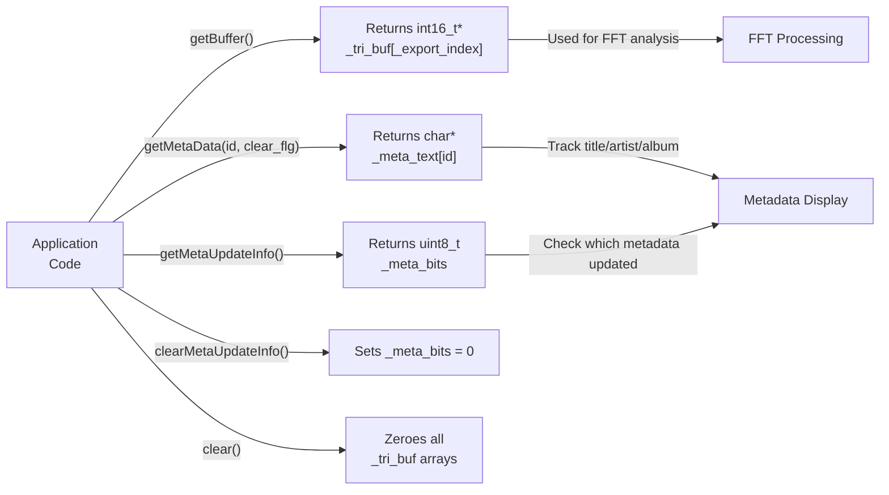
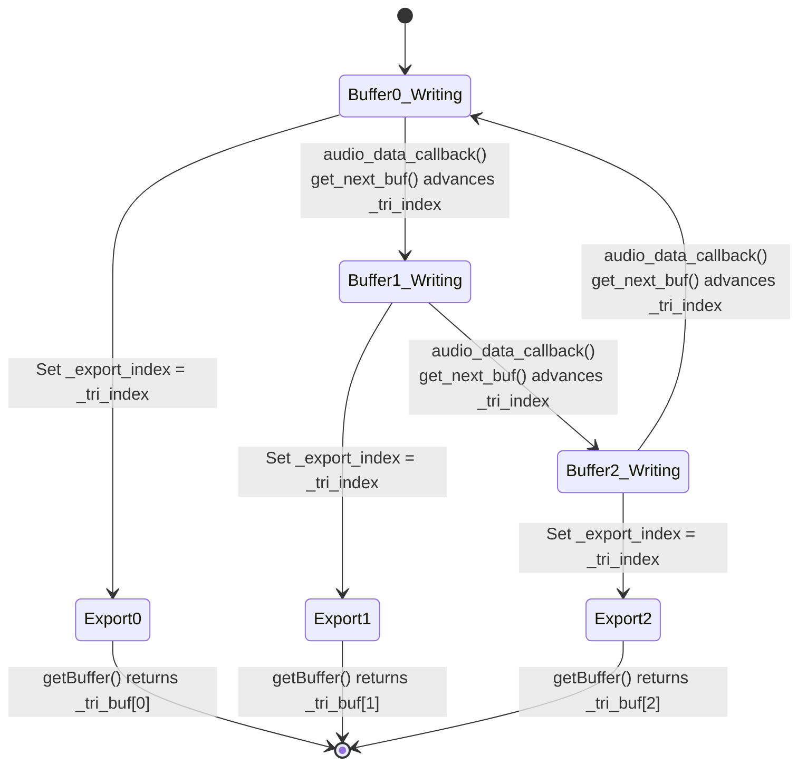
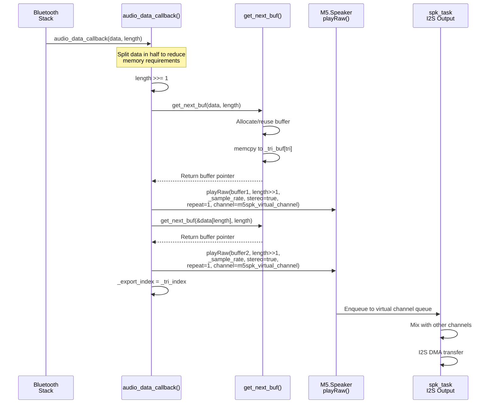
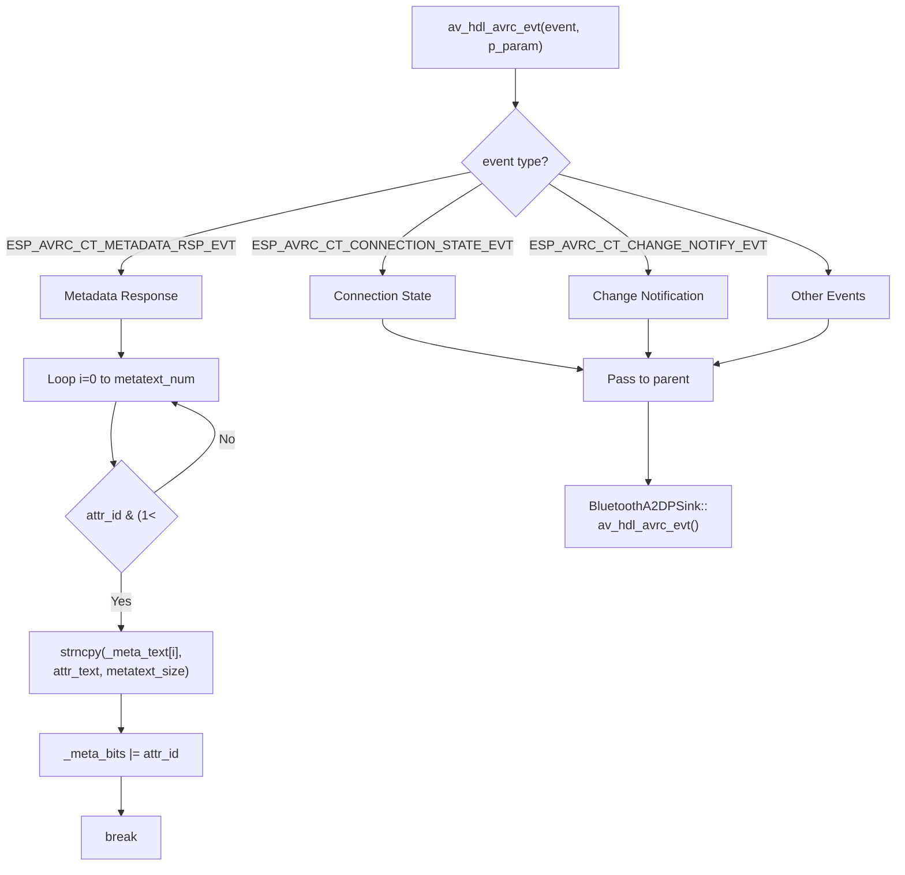
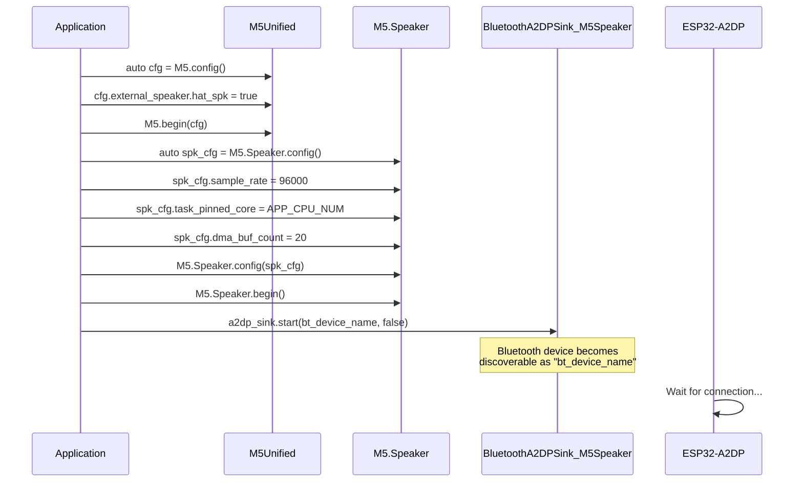
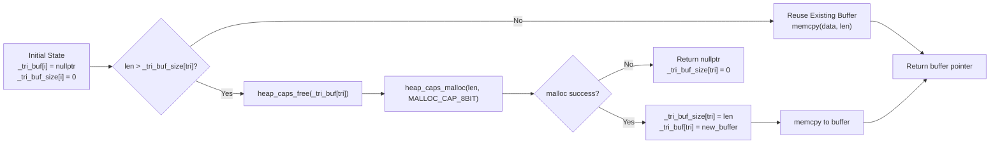

M5Unified Bluetooth Audio Streaming

# Bluetooth Audio Streaming

<details>
<summary>Relevant source files</summary>

The following files were used as context for generating this wiki page:

- [examples/Advanced/Bluetooth_with_ESP32A2DP/Bluetooth_with_ESP32A2DP.ino](examples/Advanced/Bluetooth_with_ESP32A2DP/Bluetooth_with_ESP32A2DP.ino)
- [examples/Advanced/MP3_with_ESP8266Audio/MP3_with_ESP8266Audio.ino](examples/Advanced/MP3_with_ESP8266Audio/MP3_with_ESP8266Audio.ino)
- [examples/Basic/Speaker/Speaker.ino](examples/Basic/Speaker/Speaker.ino)

</details>


## Purpose and Scope

This document describes the integration pattern for streaming Bluetooth A2DP audio through M5Unified's audio system. The `BluetoothA2DPSink_M5Speaker` adapter class bridges the third-party ESP32-A2DP library with the `Speaker_Class`, enabling M5Stack devices to function as Bluetooth audio receivers. This adapter handles audio buffering, sample rate adaptation, metadata extraction, and event processing for A2DP and AVRC protocols.

For general audio playback capabilities without Bluetooth, see [Speaker Interface and Multi-Channel Mixing](#4.2). For audio visualization techniques using FFT, see [Audio Visualization with FFT](#9.4). For MP3 file playback patterns, see [MP3 File Playback](#9.2).

**Sources:** [examples/Advanced/Bluetooth_with_ESP32A2DP/Bluetooth_with_ESP32A2DP.ino:1-20]()

## Architecture Overview

The Bluetooth audio streaming system uses an adapter pattern to connect the ESP32-A2DP library's `BluetoothA2DPSink` base class with M5Unified's `Speaker_Class`. The adapter intercepts audio data callbacks, buffers them efficiently, and forwards them to the M5Speaker virtual channel system.

### Component Interaction Diagram



**Sources:** [examples/Advanced/Bluetooth_with_ESP32A2DP/Bluetooth_with_ESP32A2DP.ino:16-24](), [examples/Advanced/Bluetooth_with_ESP32A2DP/Bluetooth_with_ESP32A2DP.ino:160-168]()

## BluetoothA2DPSink_M5Speaker Adapter Class

### Class Declaration and Constructor

The `BluetoothA2DPSink_M5Speaker` class extends `BluetoothA2DPSink` and disables its native I2S control, delegating audio output entirely to M5Unified's audio system:

| Constructor Parameter | Type | Purpose |
|----------------------|------|---------|
| `m5sound` | `m5::Speaker_Class*` | Pointer to M5.Speaker instance |
| `virtual_channel` | `uint8_t` | M5Speaker virtual channel (0-7) |

The constructor sets `is_i2s_output = false` to prevent ESP32-A2DP from directly managing I2S hardware, since M5Unified's `spk_task` handles all I2S operations.

**Sources:** [examples/Advanced/Bluetooth_with_ESP32A2DP/Bluetooth_with_ESP32A2DP.ino:16-23]()

### Public API Methods



**Sources:** [examples/Advanced/Bluetooth_with_ESP32A2DP/Bluetooth_with_ESP32A2DP.ino:25-39]()

### Member Variables

| Variable | Type | Purpose |
|----------|------|---------|
| `_tri_buf[3]` | `int16_t*[3]` | Triple buffer for audio data |
| `_tri_buf_size[3]` | `size_t[3]` | Size of each buffer in bytes |
| `_tri_index` | `size_t` | Current write buffer index (0-2) |
| `_export_index` | `size_t` | Buffer available for reading |
| `_meta_text[metatext_num][metatext_size]` | `char[3][128]` | Metadata strings (title, artist, album) |
| `_meta_bits` | `uint8_t` | Bitmask indicating updated metadata fields |
| `_sample_rate` | `size_t` | Current A2DP stream sample rate |

Constants: `metatext_size = 128`, `metatext_num = 3`

**Sources:** [examples/Advanced/Bluetooth_with_ESP32A2DP/Bluetooth_with_ESP32A2DP.ino:41-51]()

## Triple Buffer Strategy

The adapter implements a lock-free triple buffering mechanism to decouple the Bluetooth callback thread from the M5Speaker playback system:

### Triple Buffer State Machine



### Buffer Allocation and Management

The `get_next_buf()` method dynamically allocates or reallocates buffers as needed:

1. Calculate next buffer index: `tri = _tri_index < 2 ? _tri_index + 1 : 0`
2. If buffer too small, reallocate using `heap_caps_malloc(len, MALLOC_CAP_8BIT)`
3. Copy audio data with `memcpy(_tri_buf[tri], src_data, len)`
4. Advance `_tri_index = tri`
5. Return pointer for M5Speaker playback

This approach prevents buffer overruns and allows audio data to flow continuously without blocking.

**Sources:** [examples/Advanced/Bluetooth_with_ESP32A2DP/Bluetooth_with_ESP32A2DP.ino:140-158]()

## Audio Data Flow

### Data Callback Processing

The `audio_data_callback()` override is invoked by ESP32-A2DP when audio data arrives from the Bluetooth source:



The data is split into two halves and sent as separate `playRaw()` calls to reduce peak memory usage during the callback.

**Sources:** [examples/Advanced/Bluetooth_with_ESP32A2DP/Bluetooth_with_ESP32A2DP.ino:160-168]()

### Sample Rate Handling

The adapter extracts the sample rate from A2DP configuration events and stores it in `_sample_rate`:

| SBC Byte Value | Sample Rate |
|----------------|-------------|
| Bit 6 set | 32000 Hz |
| Bit 5 set | 44100 Hz |
| Bit 4 set | 48000 Hz |

This rate is passed to `M5.Speaker.playRaw()` to ensure proper playback timing.

**Sources:** [examples/Advanced/Bluetooth_with_ESP32A2DP/Bluetooth_with_ESP32A2DP.ino:92-102]()

## Metadata Handling

### AVRC Metadata Response Processing

The `av_hdl_avrc_evt()` override processes AVRC (Audio/Video Remote Control) metadata events:



The metadata text array indices correspond to:
- Index 0: Track title
- Index 1: Artist name
- Index 2: Album name

The `_meta_bits` bitmask tracks which metadata fields have been updated, allowing the application to detect changes without polling.

**Sources:** [examples/Advanced/Bluetooth_with_ESP32A2DP/Bluetooth_with_ESP32A2DP.ino:111-138]()

### Metadata Retrieval API

Application code retrieves metadata using:

```cpp
const char* title = a2dp_sink.getMetaData(0, true);  // Get title, clear update bit
const char* artist = a2dp_sink.getMetaData(1, true); // Get artist, clear update bit
const char* album = a2dp_sink.getMetaData(2, true);  // Get album, clear update bit
```

The `clear_flg` parameter determines whether the corresponding bit in `_meta_bits` is cleared after retrieval.

**Sources:** [examples/Advanced/Bluetooth_with_ESP32A2DP/Bluetooth_with_ESP32A2DP.ino:28]()

## A2DP Event Processing

### Connection and Audio State Events

The `av_hdl_a2d_evt()` override handles A2DP protocol events:

| Event Type | State Values | Action |
|-----------|--------------|--------|
| `ESP_A2D_CONNECTION_STATE_EVT` | `ESP_A2D_CONNECTION_STATE_CONNECTED` | Connection established |
| | `ESP_A2D_CONNECTION_STATE_DISCONNECTED` | Connection terminated |
| `ESP_A2D_AUDIO_STATE_EVT` | `ESP_A2D_AUDIO_STATE_STARTED` | Playback started |
| | `ESP_A2D_AUDIO_STATE_REMOTE_SUSPEND` | Playback paused |
| | `ESP_A2D_AUDIO_STATE_STOPPED` | Playback stopped |
| `ESP_A2D_AUDIO_CFG_EVT` | N/A | Audio configuration changed |

When audio stops (`REMOTE_SUSPEND` or `STOPPED`), the adapter calls `clearMetaData()` and `clear()` to reset the metadata display and zero the audio buffers.

**Sources:** [examples/Advanced/Bluetooth_with_ESP32A2DP/Bluetooth_with_ESP32A2DP.ino:62-109]()

### Metadata Clearing

The `clearMetaData()` method resets all metadata strings and sets all bits in `_meta_bits` to indicate the fields contain cleared/empty data:

```cpp
void clearMetaData(void)
{
  for (int i = 0; i < metatext_num; ++i)
  {
    _meta_text[i][0] = 0;  // Empty string
  }
  _meta_bits = (1<<metatext_num)-1;  // Set bits 0-2
}
```

**Sources:** [examples/Advanced/Bluetooth_with_ESP32A2DP/Bluetooth_with_ESP32A2DP.ino:53-60]()

## Configuration and Usage Pattern

### Initialization Sequence



### Virtual Channel Assignment

The adapter uses a specific virtual channel for playback. The example uses:

```cpp
static constexpr uint8_t m5spk_virtual_channel = 0;
```

This allows other audio sources to use channels 1-7 simultaneously, enabling sound effects or alerts to play over the Bluetooth stream.

**Sources:** [examples/Advanced/Bluetooth_with_ESP32A2DP/Bluetooth_with_ESP32A2DP.ino:10](), [examples/Advanced/Bluetooth_with_ESP32A2DP/Bluetooth_with_ESP32A2DP.ino:570-609]()

### Speaker Configuration Recommendations

For Bluetooth audio streaming, the following `Speaker_Class` configuration parameters are recommended:

| Parameter | Recommended Value | Rationale |
|-----------|------------------|-----------|
| `sample_rate` | 96000 Hz | Higher than Bluetooth's 44100/48000 Hz provides headroom for mixing |
| `task_pinned_core` | `APP_CPU_NUM` | Pin audio task to APP core, leaving protocol stack on PRO core |
| `dma_buf_count` | 20 | More buffers reduce underrun risk with wireless latency |

**Sources:** [examples/Advanced/Bluetooth_with_ESP32A2DP/Bluetooth_with_ESP32A2DP.ino:592-601]()

### Runtime Control

The application controls playback through the ESP32-A2DP library's methods:

```cpp
// Transport control
a2dp_sink.next();      // Skip to next track
a2dp_sink.previous();  // Go to previous track

// Connection status
bool connected = a2dp_sink.is_connected();

// Volume control through M5Speaker
M5.Speaker.setVolume(volume);  // 0-255
uint8_t current = M5.Speaker.getVolume();
```

**Sources:** [examples/Advanced/Bluetooth_with_ESP32A2DP/Bluetooth_with_ESP32A2DP.ino:636-637](), [examples/Advanced/Bluetooth_with_ESP32A2DP/Bluetooth_with_ESP32A2DP.ino:645-658]()

## Buffer Access for Visualization

The adapter exposes the most recent audio buffer for FFT analysis and visualization:

```cpp
const int16_t* buffer = a2dp_sink.getBuffer();
if (buffer) {
  // buffer contains stereo interleaved samples
  // Format: [L0, R0, L1, R1, L2, R2, ...]
  fft.exec(buffer);
}
```

The returned buffer corresponds to `_tri_buf[_export_index]`, which is the buffer most recently submitted to `M5.Speaker.playRaw()`. This buffer remains stable until the next `audio_data_callback()` invocation advances `_export_index`.

**Sources:** [examples/Advanced/Bluetooth_with_ESP32A2DP/Bluetooth_with_ESP32A2DP.ino:26](), [examples/Advanced/Bluetooth_with_ESP32A2DP/Bluetooth_with_ESP32A2DP.ino:433-436]()

## Memory Management Considerations

### Dynamic Buffer Allocation

Buffers are allocated on-demand using `heap_caps_malloc()` with `MALLOC_CAP_8BIT` capability. This ensures buffers can be accessed by both cores and the DMA controller. The adapter automatically reallocates if incoming data exceeds the current buffer size.

### Buffer Lifecycle



**Sources:** [examples/Advanced/Bluetooth_with_ESP32A2DP/Bluetooth_with_ESP32A2DP.ino:140-158]()

### Data Splitting Strategy

To minimize peak memory usage, the `audio_data_callback()` splits received data into two halves before buffering:

```
Original data length: 4096 bytes
Split into: 2048 bytes + 2048 bytes
Each half is buffered separately and submitted to playRaw()
```

This reduces the maximum single buffer allocation from the full A2DP frame size to half, lowering memory pressure during high-throughput streaming.

**Sources:** [examples/Advanced/Bluetooth_with_ESP32A2DP/Bluetooth_with_ESP32A2DP.ino:162-165]()