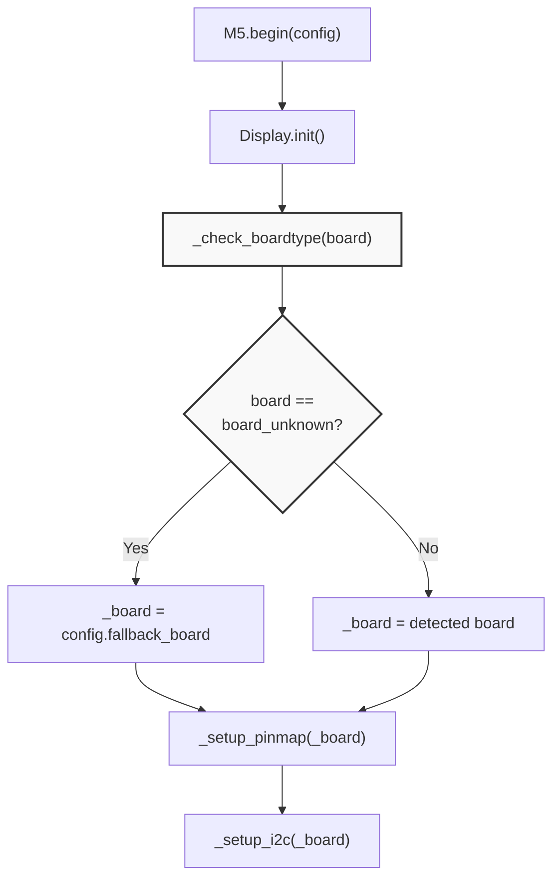
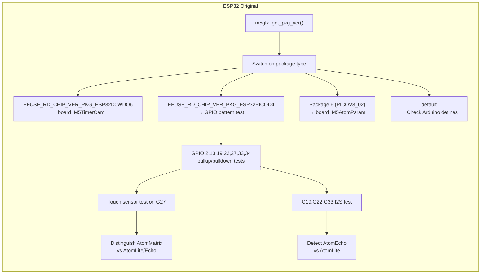
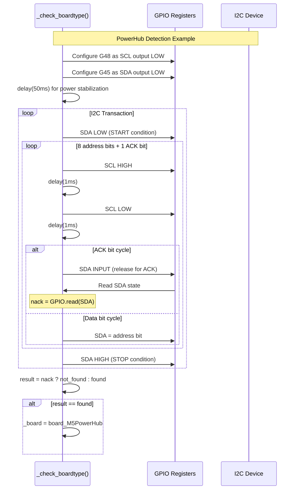
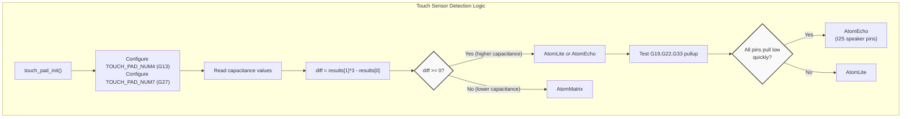
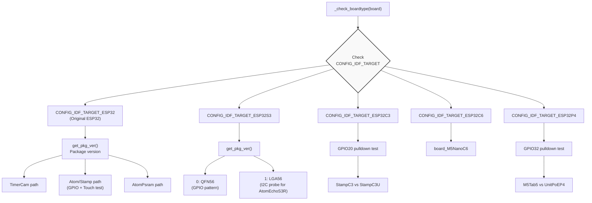
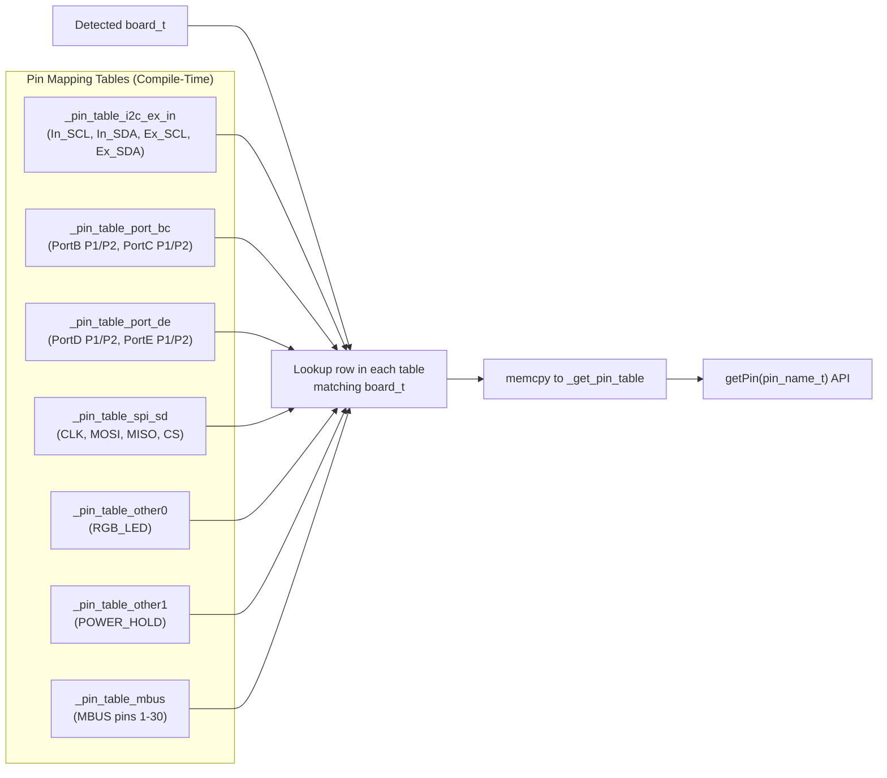
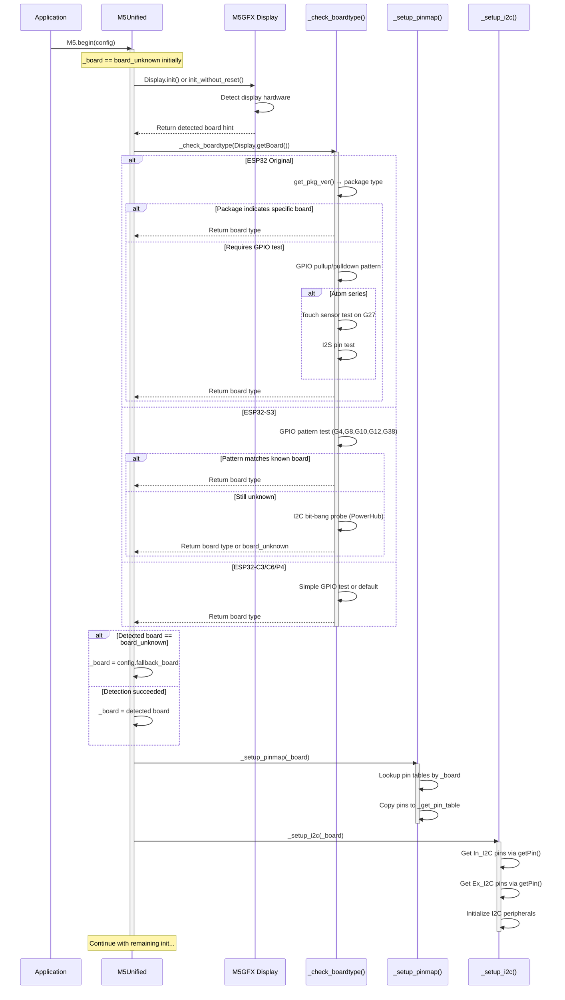

M5Unified Board Detection and Hardware Identification

# Board Detection and Hardware Identification

<details>
<summary>Relevant source files</summary>

The following files were used as context for generating this wiki page:

- [src/M5Unified.cpp](src/M5Unified.cpp)
- [src/M5Unified.hpp](src/M5Unified.hpp)

</details>


## Purpose and Scope

This document describes the board detection and hardware identification mechanism in M5Unified, which automatically determines which M5Stack device is running the code at runtime. This detection occurs during the `M5.begin()` initialization sequence and enables a single compiled binary to work across 19+ different M5Stack hardware variants without modification.

For information about pin mapping configuration that follows board detection, see [Pin Mapping System](#2.3). For the overall initialization sequence, see [System Initialization and Lifecycle](#2.1).

---

## Detection Architecture Overview

The board detection system is implemented primarily in the `_check_boardtype()` method, which employs a multi-strategy approach to identify hardware. The detection result is stored in the `_board` member variable (type `board_t`) and used throughout the initialization process to configure board-specific features.



**Detection Flow in M5.begin()**

Sources: [src/M5Unified.hpp:332-360](), [src/M5Unified.cpp:971-1418]()

---

## Detection Strategies

The `_check_boardtype()` method uses different detection strategies depending on the ESP32 variant. Each strategy is optimized for the hardware capabilities and physical characteristics of different board families.

### Strategy 1: ESP32 Package Version Detection

On the original ESP32 (non-S3/C3/C6/P4), the system reads the ESP32 package type from eFuse registers to perform coarse-grained board identification.



**ESP32 Package-Based Detection Logic**

Sources: [src/M5Unified.cpp:971-1114]()

The GPIO pattern test performs the following operations:
1. Backup GPIO states for pins 2, 13, 19, 22, 27, 33, 34
2. Configure pins as input with pullup/pulldown
3. Read pin states to identify board characteristics
4. Restore GPIO states after detection

For the AtomMatrix vs AtomLite distinction, the code uses capacitive touch sensing on GPIO27 (the RGB LED pin). The AtomMatrix has a different capacitance profile due to its 25-LED matrix compared to the single LED on AtomLite/Echo.

Sources: [src/M5Unified.cpp:985-1066]()

### Strategy 2: GPIO Pull Test Patterns

For ESP32-S3 devices, the system uses GPIO pull resistance tests to identify boards. This method leverages the fact that different boards have different external circuitry connected to specific GPIOs.

```mermaid
graph TB
    subgraph "ESP32-S3 Detection (QFN56 Package)"
        start["Package == 0 (QFN56)"]
        backup["Backup GPIO 4,8,10,12,38"]
        pulldown["Set GPIOs to pulldown"]
        pullup["Set G4,G12,G38 to pullup"]
        read["Read G8,G10,G4,G12,G38"]
        pattern["Analyze 5-bit pattern"]
        
        start --> backup
        backup --> pulldown
        pulldown --> pullup
        pullup --> read
        read --> pattern
        
        pattern --> STAMPS3["G38=0 after delay<br/>→ M5StampS3"]
        pattern --> ATOMS3LITE["G4=0, G38=1<br/>→ M5AtomS3Lite"]
        pattern --> ATOMS3U["G4=1, G38=1<br/>→ M5AtomS3U"]
        
        STAMPS3 --> CAPSULE_TEST["G8,G10 == 0b11?"]
        CAPSULE_TEST -->|"Yes"| CAPSULE["M5Capsule<br/>+ I2C STOP on G15,G13"]
        CAPSULE_TEST -->|"No"| STAMPS3_FINAL["M5StampS3"]
    end
    
    subgraph "PowerHub Detection"
        powerhub_start["Unknown after GPIO test"]
        i2c_manual["Manual I2C bit-bang<br/>on GPIO 48,45"]
        probe_0x50["Probe address 0x50"]
        ack_check["Check for ACK"]
        
        powerhub_start --> i2c_manual
        i2c_manual --> probe_0x50
        probe_0x50 --> ack_check
        ack_check -->|"ACK"| POWERHUB["M5PowerHub"]
    end
```



**ESP32-S3 GPIO Pattern Detection**

The StampS3 detection exploits a hardware characteristic: GPIO38 is connected to an SGM2578 power management chip that pulls the line low. On AtomS3Lite/U, GPIO38 is unconnected and remains high when configured as input with pullup.

Similarly, GPIO4 distinguishes AtomS3Lite (infrared receiver pulls it low) from AtomS3U (unconnected, remains high).

Sources: [src/M5Unified.cpp:1116-1192]()

### Strategy 3: I2C Device Probing

Some boards require active I2C communication to identify them. This is done by bit-banging I2C protocol directly using GPIO manipulation.



**I2C Bit-Bang Detection Sequence**

The bit-bang I2C implementation manually toggles SCL and SDA pins to communicate without initializing the I2C peripheral. This is necessary during early boot when I2C may not be configured yet.

Key addresses probed:
- `0x50` (7-bit) → PowerHub
- `0x18` (7-bit) → AtomEchoS3R (ES8311 codec)
- `0x3C` (7-bit) → AtomS3RCam (OV3660 camera)
- `0x21` (7-bit) → AtomS3RCam (GC0308 camera)

Sources: [src/M5Unified.cpp:1194-1248]() (PowerHub), [src/M5Unified.cpp:1253-1305]() (AtomEchoS3R), [src/M5Unified.cpp:1307-1378]() (AtomS3RCam)

### Strategy 4: Touch Sensor Capacitance Testing

On ESP32 (original), the touch sensor peripheral can measure capacitance to distinguish boards with different physical layouts.



**Touch Sensor Detection for Atom Series**

The AtomMatrix has a 5×5 LED matrix (25 LEDs) connected to GPIO27, while AtomLite has only one LED. This difference in load capacitance is detectable through the ESP32's capacitive touch sensor peripheral. The code reads both GPIO13 (NC, reference) and GPIO27 (LED) to compute a differential measurement that's robust to environmental variations.

Sources: [src/M5Unified.cpp:827-883]() (touch reading function), [src/M5Unified.cpp:994-1061]() (AtomMatrix detection)

---

## Board Type Enumeration

The detected board type is stored as a `board_t` enum value, which is actually defined in the M5GFX library and aliased in M5Unified:

```cpp
// From M5Unified.hpp
namespace m5
{
  using board_t = m5gfx::board_t;
}
```

Common board_t values include:
- `board_M5Stack` - Original M5Stack Basic/Gray/Fire
- `board_M5StackCore2` - M5Stack Core2
- `board_M5StackCoreS3` - M5Stack Core S3
- `board_M5StickC` - M5StickC
- `board_M5StickCPlus` - M5StickC Plus
- `board_M5StickCPlus2` - M5StickC Plus 2
- `board_M5StickS3` - M5StickS3
- `board_M5AtomLite` - ATOM Lite
- `board_M5AtomMatrix` - ATOM Matrix
- `board_M5AtomS3` - ATOMS3
- `board_M5Paper` - M5Paper
- `board_M5Dial` - M5Dial
- `board_M5Cardputer` - M5Cardputer
- `board_M5Tab5` - M5Tab5 (ESP32-P4)
- `board_unknown` - Fallback/undetected

Sources: [src/M5Unified.hpp:23]()

---

## Arduino IDE Board Defines

If runtime detection fails (returns `board_unknown`), the system falls back to Arduino IDE board selection macros. This provides a manual override mechanism when auto-detection is insufficient.

| Arduino Define | Fallback Board |
|----------------|----------------|
| `ARDUINO_M5STACK_CORE_ESP32` | `board_M5Stack` |
| `ARDUINO_M5STACK_CORE2` | `board_M5StackCore2` |
| `ARDUINO_M5STICK_C` | `board_M5StickC` |
| `ARDUINO_M5STICK_C_PLUS` | `board_M5StickCPlus` |
| `ARDUINO_M5STACK_COREINK` | `board_M5StackCoreInk` |
| `ARDUINO_M5STACK_PAPER` | `board_M5Paper` |
| `ARDUINO_M5STACK_TOUGH` | `board_M5Tough` |
| `ARDUINO_M5STACK_ATOM` | `board_M5AtomLite` |
| `ARDUINO_M5STACK_TIMER_CAM` | `board_M5TimerCam` |

If no Arduino define matches and detection fails, the system uses `config.fallback_board` specified in the configuration passed to `M5.begin()`.

Sources: [src/M5Unified.cpp:1075-1112]()

---

## ESP32 Variant-Specific Detection Paths

The detection logic is heavily conditional on the ESP32 variant, controlled by `CONFIG_IDF_TARGET_*` macros from sdkconfig.



**ESP32 Variant Detection Dispatch**

Each ESP32 variant has unique hardware characteristics that necessitate different detection approaches:

- **ESP32 (original)**: Rich package variants and mature ecosystem → Use package detection + GPIO tests
- **ESP32-S3**: Many M5Stack products → Complex GPIO patterns + I2C probing
- **ESP32-C3**: Minimal product line → Simple GPIO pullup test
- **ESP32-C6**: New variant → Simple default assignment
- **ESP32-P4**: Tab5-specific → Direct GPIO test

Sources: [src/M5Unified.cpp:974-1418]()

---

## Integration with Pin Mapping

After board detection completes, the detected board type is used to load the appropriate pin mapping table. This is done by `_setup_pinmap(board_t id)`.



**Pin Mapping Table Structure**

Each pin table is a 2D array where:
- First column = `board_t` identifier
- Subsequent columns = GPIO numbers for that board
- Last row = `board_t::board_unknown` (fallback values)

The `_setup_pinmap()` function iterates through all seven pin tables, finds the row matching the detected board, and copies the pin assignments into the `_get_pin_table` array. This array is then accessed via the `getPin(pin_name_t)` API.

Sources: [src/M5Unified.cpp:73-327]() (pin tables), [src/M5Unified.cpp:328-348]() (_setup_pinmap)

---

## Key Detection Code Entities

### Core Functions

| Function | Location | Purpose |
|----------|----------|---------|
| `_check_boardtype(board_t)` | [src/M5Unified.cpp:971-1418]() | Main board detection logic |
| `_setup_pinmap(board_t)` | [src/M5Unified.cpp:328-348]() | Load pin mappings for detected board |
| `_setup_i2c(board_t)` | [src/M5Unified.cpp:1420-1495]() | Configure I2C buses based on board |
| `_read_touch_pad(...)` | [src/M5Unified.cpp:827-883]() | Read capacitive touch sensors (ESP32) |

### Member Variables

| Variable | Type | Purpose |
|----------|------|---------|
| `M5Unified::_board` | `board_t` | Stores detected board type |
| `M5Unified::_get_pin_table` | `int8_t[pin_name_max]` | Pin mapping lookup table |

### Configuration

| Config Field | Type | Purpose |
|--------------|------|---------|
| `config_t::fallback_board` | `board_t` | Board type if detection fails |

Sources: [src/M5Unified.hpp:622](), [src/M5Unified.hpp:652](), [src/M5Unified.hpp:160-171]()

---

## Detection Call Flow in M5.begin()



**Complete Board Detection Sequence**

Sources: [src/M5Unified.hpp:332-360]()

---

## Summary

The M5Unified board detection system provides automatic hardware identification through:

1. **ESP32 package version reading** - Coarse-grained board family identification
2. **GPIO pattern testing** - Fine-grained board differentiation using pullup/pulldown characteristics
3. **I2C device probing** - Active communication to detect specific peripherals
4. **Touch sensor capacitance** - Physical layout detection for Atom series

The detection result (`board_t`) drives all subsequent configuration including pin mapping, I2C bus setup, peripheral initialization, and feature availability. This architecture enables M5Unified to provide a truly unified API across the entire M5Stack product line while maintaining optimal performance through compile-time table lookups rather than runtime conditionals.